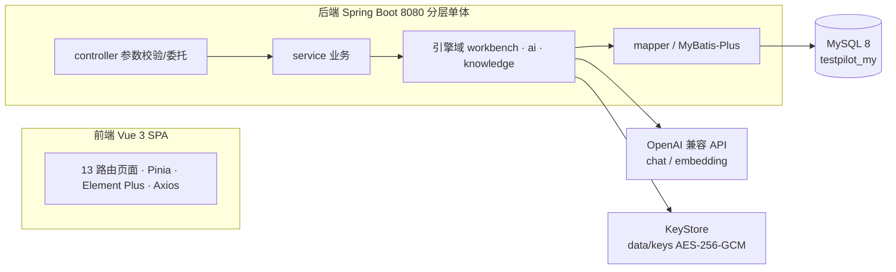
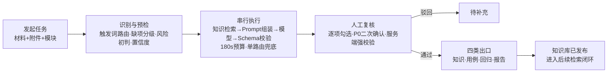

# TestPilot-my 概要设计说明书

> **版本**：v1.0（2026-10-04）
> **依据**：《TestPilot项目说明文档.md》第 9 章（方案唯一真源，位于 `D:\develop\lemon-TestPilot\docs\TestPilot项目说明文档.md`）
> **对象**：新项目 TestPilot-my（`D:\develop\TestPilot-my`，整体重写，尚未开始编码）
> **说明**：本文档为第 9 章方案的浓缩概要设计；与第 9 章存在出入时，以第 9 章为准。

---

## 1. 引言

### 1.1 背景与目的

原 TestPilot（Node.js 原生 HTTP + React 19 单巨石结构）产品逻辑已验证，但技术栈非主流、工程形态有局限（无框架、无路由、启动时隐式建表）。本项目以 Java 企业栈**整体重写**：产品定位不变（面向个人测试工程师的本地测试工作台，黄色主题，本机数据不上云），并将原第 6 章 30 个未实施方案全量落地（"按补丁后目标态一次实现"原则，不先复刻缺陷再打补丁）。

本概要设计描述新系统的总体架构、模块划分、数据与接口设计、AI 引擎机制、运行部署与出错处理，作为后续详细设计与编码的基准。

### 1.2 设计目标

| 目标 | 度量方式 |
| --- | --- |
| 功能等价 + 增强 | 13 个模块全部真实实现，无演示级/占位行为；以第 9 章 9.7.2 承接映射表（覆盖原 6.2~6.32 全部方案）逐行验收 |
| 架构正规化 | Spring Boot 分层单体 + Vue Router 正式路由 + Flyway 版本化迁移 |
| 红线零退化 | R1~R8、AI 使用边界、复核门禁、报告数字确定性全量沿用（见 2.4） |

### 1.3 基础术语

7 个标准入口（`testcase_gen / bug_analysis / log_triage / sql_analysis / regression_list / test_report / prompt_test`）· 固定 7 步执行链路 · 主任务/辅助任务 · 三级降级检索（semantic→keyword→none）· 软引用（`kb_retrieval_hit`，不阻塞撤销）/ 硬引用（`kb_relation`，触发 409）· 未复核 = "AI 草稿" · 风险单向取高 · 事实类路由（Bug/日志/SQL/回归，可沉淀知识）

## 2. 总体设计

### 2.1 总体架构

技术栈：JDK 21 + Spring Boot 3.5 + MyBatis-Plus + Maven + Flyway；Vue 3.5 + TypeScript + Vite 6 + Pinia + Vue Router 4 + Element Plus。生产形态为 Spring Boot 托管前端 dist，单端口 8080（对齐原"单端口"体验）。

### 2.2 核心业务主线

同一输入可命中多入口时：主任务唯一、按默认顺序串行调度、上一步结构化产物可传递给下一步、每路由独立兜底与追溯。

### 2.3 关键架构决策（第 9 章 D1~D14 中影响架构的子集）

| # | 决策 | 要点 |
| --- | --- | --- |
| D2 | 单体分包，不拆微服务 | 本地单人工具，无并发队列需求 |
| D3 | Flyway 管理 DDL + 种子 | 废弃启动建表与 information_schema 补列模式；迁移不可变 |
| D4 | BIGINT 主键 + 业务编号列 + **显式溯源列** | 消除原 `LIKE 'runId#%'` 前缀模糊查询 |
| D5 | JSON 快照用 LONGTEXT | 保证 R5 快照保真（JSON 类型会重排键序） |
| D7 | **同步一次性落库，不引入轮询** | 长请求通道 200s + 取消令牌替代 |
| D11 | 不引入向量库 | BLOB 向量 + 应用层余弦，千级规模足够 |
| D12 | 自研 OpenAI 兼容客户端 | purpose 隔离 / chatRaw 真运行 / 超时钳制 / 重试可控 |
| D13 | 取消用执行令牌 + cancel 端点 | 取消即丢弃不落库；Servlet 下比断连检测可靠 |
| D14 | 目标态一次实现 | 原项目已知缺陷（7.2 所列）直接按修复后形态实现 |

### 2.4 系统约束（不可退化的红线）

| 红线 | 内容 |
| --- | --- |
| R1 | 只检索已发布知识（检索强制 `status='已发布'`） |
| R2 | AI 不发布、不修改知识（AI 产物仅"待审核"，发布仅人工触发） |
| R3 | 不编造知识标题/Bug 编号（Prompt 约束→Schema 校验→未命中显式声明三层防线） |
| R4 | API Key 不入库、不进快照、不打日志 |
| R5 | 历史快照不可篡改（run/任务保存知识标题@版本@相似度快照） |
| R6 | 模型不可用不得伪造成功（降级路径全部显式标注） |
| R7 | AI 引用为软引用，不锁死知识库（409 保护仅由硬引用触发） |
| R8 | 知识事实不复制到工作台（`wb_asset.knowledge_json` 只存分类映射单一真源） |
| — | AI 不做上线批准；报告统计数字一律确定性计算（AI 仅叙述 + 数字守卫）；全系统无 DELETE 端点 |

## 3. 模块设计

### 3.1 后端模块（包划分）

| 包 | 职责 |
| --- | --- |
| `controller` | REST 入口；仅参数校验与委托 |
| `service` | 业务服务：模块树 / 用例 / 任务 / 回归 / 报告 / 知识 / 配置 / 审计 |
| `ai` | AI 引擎：ProviderRegistry（选模型）、OpenAiCompatClient（chat/chatRaw/embed + 800ms 重试 1 次）、PromptAssembler、OutputSchemaValidator、RiskMerger（词表增强 + 单向取高）、BudgetController（180s）、EntryRouteService（触发词富命中：matchedTriggers/confidence/source） |
| `workbench` | 工作台引擎：WorkflowExecutor（串行执行 + 取消令牌 + 产物传递）、PromptTestRunner（逐样例真运行 + 5 规则机器判定）、ValidationService（案例验证 + 知识断言）、三个轻量生成服务（用例/回归/报告叙述，均不写 wb_run） |
| `knowledge` | 检索域：EmbeddingService（异步重嵌/懒补偿/状态可见）、RetrievalService（三级降级）、HitRecorder（软引用） |
| `security` | KeyStore：AES-256-GCM + 本机 master.key（换机失效，对齐原 DPAPI 语义） |
| `common` / `config` / `mapper` / `entity` / `dto` | 统一响应 ApiResult、全局异常（业务码）、Jackson TypeHandler、Flyway 配置等 |

### 3.2 前端模块（13 路由）

| 路由 | 页面 | 要点 |
| --- | --- | --- |
| `/dashboard` | 工作台首页 | 六指标卡真实统计、快捷入口、数据资产、最近任务 |
| `/assistant` | AI 测试助手 | 入口勾选、智能输入（附件/测试集）、预检面板（自动刷新）、RunResult、最近执行面板 |
| `/runs` | 执行记录 | 搜索/风险/模块/复核筛选、分页 20/50/100、详情轨迹、导出 |
| `/cases` | 用例库 | 模块树、手工/AI 双模式生成、批次执行、AI 徽标与溯源 |
| `/analysis/bug·log·sql` | 三类专项分析 | 共享组件参数化；知识注入；模型下拉；风险三方取高 |
| `/regression` | 回归测试 | 清单卡片（必选项口径进度）、规则+AI 生成预览、完成记录分流 |
| `/reports` | 测试报告 | 生成（项目真源下拉/来源三类/AI 叙述开关）、详情、趋势对比 |
| `/knowledge` | 知识库 | 审核门控/版本化/撤销保护、语义搜索、嵌入状态、影响分析、批量导入 |
| `/orchestration` | 工作台编排 | 四类配置编辑（真源实时生效）、校验、版本历史、恢复默认 |
| `/validation` | 案例验证 | 官方+自建案例、路由/规则/知识三重断言、run-all |
| `/settings` | 配置中心 | 模块树（可改名）、大模型（Key 管理/测试连接/可删除）、模板、关联规则（读真源） |

通用组件：全局 DetailDrawer（跨页跳转复用）、RunResult 组件族（路由页签/Schema 徽标/逐样例对照表/复核栏/四出口按钮）、KnowledgeSink/CaseSink/RegressionSink/ReportSink、CasePreview、SuiteDialog。

## 4. 数据设计

### 4.1 设计约定

库 `testpilot_my`（utf8mb4/InnoDB，`createDatabaseIfNotExist=true` 首启建库）｜BIGINT 自增主键 + 人读业务编号列｜JSON 快照一律 LONGTEXT（R5 保真）｜中文枚举入库（`'待审核'` 等）｜Flyway V1 建表 + V2 种子（种子仅空库首装）｜无 DELETE。

### 4.2 表清单（18 张，四域）

| 域 | 表 |
| --- | --- |
| 配置 sys_（4） | `sys_module`（三级模块树）、`sys_provider`（厂商+purpose+has_key，Key 不入库）、`sys_setting`（模板等键值）、`sys_audit_log`（统一审计） |
| 知识 kb_（4） | `kb_knowledge`（7 分类/审核门控/版本化）、`kb_relation`（硬引用 409）、`kb_embedding`（BLOB 向量，按版本判过期）、`kb_retrieval_hit`（软引用） |
| 工作台 wb_（5） | `wb_asset`（7 入口配置**唯一真源**）、`wb_run`（结果/证据/复核/usage 快照）、`wb_run_step`（真实起止轨迹）、`wb_prompt_suite`（测试集资产）、`wb_validation_case`（验证案例+知识断言） |
| 业务 biz_（5） | `biz_case`（含 `_meta` AI 溯源）、`biz_task`（独立分析任务）、`biz_regression`（清单+必选项口径）、`biz_report`（叙述双形态+statsAvailable）、`biz_case_batch`（执行批次） |

### 4.3 核心数据关系

- **溯源显式化**：四条结果出口（知识/用例/回归/报告）以 `source_ref` JSON 或显式列精确关联 run 与路由，`getRun` 聚合返回 `knowledgeLinks / caseLinks / regressionLinks / reportLinks` 四组置灰判断；
- **知识引用双层**：AI 检索命中只写软引用（可追溯不阻塞撤销）；沉淀来源、报告来源、申请入库自动登记硬引用（撤销保护真实可触发）。

## 5. 接口设计

### 5.1 接口约定

统一响应 `ApiResult<T>`；业务异常带码（400 参数/门禁、401 鉴权、404、**409 引用保护与重复转入**、502 模型全部失败不落库）；常规请求超时 15s；**`POST /runs` 等长请求通道 200s**（后端 Tomcat ≥210s）；分页 pageSize 白名单 20/50/100。

### 5.2 API 分组（概要）

| 分组 | 端点族 | 特殊语义 |
| --- | --- | --- |
| 通用/首页 | `/api/bootstrap`、`/api/dashboard/metrics` | 六指标全表统计口径 |
| 配置 | `/api/modules`、`/api/providers`(+`/key`、`/test`)、`/api/settings` | PATCH 局部更新；测试连接探测失败降级 1-token chat |
| 知识 | `/api/knowledge`(CRUD+approve/reject/withdraw/import) + 人侧 4 端点 | withdraw 遇硬引用 409+依赖清单；导入全"待审核"同题跳过 |
| 独立分析 | `/api/ai/analyze`、`/api/tasks`(+`/reanalyze`、`/knowledge-draft`) | 注入知识检索；风险三方取高 |
| 助手 | `/api/workbench/preflight`、`/runs`(GET/POST/PATCH/`rerun`)、`/executions/{token}/cancel`、`/suites`、`/validations`(+run/run-all) | 复核服务端强校验；rerun 整单/单路由 |
| 轻量生成 | `/cases/generate`、`/regressions/generate`、`/reports/narrative` | 不写 wb_run；回归规则打底模型失败不阻断；叙述带数字守卫 |
| 资产 | `/api/cases`(+batches)、`/api/regressions`、`/api/reports`、`/api/audit` | 创建含 sourceRunId 查重 409；必选项进度算法 |

## 6. AI 引擎设计

### 6.1 规则与模型分工（"AI 负责分析，规则约束 AI，人负责终审"）

| 环节 | 规则（代码） | AI（模型） |
| --- | --- | --- |
| 路由识别 / 缺项检查 | 触发词词表（含原 6.21~6.26 增强变体）+ 正则规则表 | — |
| 知识检索 | keyword 降级兜底 | embedding 语义检索 |
| 分析本体 | — | chat：注入"角色+模块+工作流+已发布知识+安全规则+Schema" |
| 风险 | 正则初判（各域高危词）+ 单向取高 | 返回 risk_level |
| 输出 | Schema 字段级校验（含 object[] 第 N 条定位） | — |
| Prompt 测试 | 5 规则机器判定（verdict 不可被模型改） | 逐样例真运行 + 一次评审 |
| 终审与沉淀 | 服务端门禁 | 产物仅"待审核" |

### 6.2 执行链路（WorkflowExecutor 八步）

选模型（无可用 400 阻断）→ 路由识别+缺项+风险初判 → 附件拼接（前 8KB）→ **串行循环**（每路由前查取消令牌：检索→组装→调用→校验→单路由兜底；上一步产物可传递）→ 风险取高 → 组装 result（loadedKnowledge 快照/命中依据/usage）→ 三表落库 → 返回 getRun（含四组 links）。超时钳制 [5,30]s/路由、总预算 180s、可重试错误 800ms 重试 1 次、全部失败 502 不落库。

### 6.3 知识检索三级降级

semantic（余弦 ≥0.3 Top5）→ keyword（n-gram，标题×3/正文×1 Top5）→ none（显式"未检索到相关知识"）；发布/升版异步重嵌（失败置 pending 不阻断）；嵌入状态与跨模型失效人侧可见。

## 7. 运行与部署设计

| 形态 | 说明 |
| --- | --- |
| 开发 | 后端 `mvn spring-boot:run`(8080)；前端 `npm run dev`(5173，代理 /api) |
| 生产 | 前端 dist 打入 jar，`java -jar` 单端口 8080；`scripts/start.bat` 一键（检查 JDK/MySQL/Node → 构建 → 启动 → 开浏览器） |
| 环境 | JDK 21、Maven 3.9+（或 mvnw）、Node 20/22（仅构建期）、MySQL 8（环境变量 `DB_HOST/DB_PORT/DB_USER/DB_PASSWORD/DB_NAME` 覆盖，默认 root/空密码@127.0.0.1:3306） |
| 数据 | `data/keys`（主密钥+密文）与 `data/backups` 不入 git、不随分发；换机需重录 Key；备份 `mysqldump testpilot_my` |

## 8. 出错处理设计

| 场景 | 处理 | 对应红线 |
| --- | --- | --- |
| 无可用模型/Key | 助手与轻量生成 400 阻断；独立分析回退本地规则并显式标注 | R6 |
| 模型单路由失败/超时 | 本地兜底输出 + `degraded` 标注 + 步骤 note（含重试次数） | R6 |
| 全部路由失败 | 502，不落库 | — |
| 撤销被引用知识 | 409 + 依赖清单 | 引用保护 |
| 重复转入（回归/报告） | 409 + 返回已有 id | 去重门禁 |
| embedding 不可用 | keyword 降级黄色提示；无命中显式声明 | R6 |
| 叙述含集合外数字 | `_narrative_check` 重点复核徽标（不阻断） | 数字守卫 |
| 复核未勾完 | 服务端 400（不依赖前端禁用） | 复核门禁 |

## 9. 安全设计

API Key AES-256-GCM 加密落 `data/keys`（master.key 本机私有）；Key 不入数据库/日志/快照/错误响应（R4）；统一审计（复核/发布/沉淀/转入/配置变更）；默认仅本机访问。

## 10. 实施分期概览

| Phase | 内容 | 预估 |
| --- | --- | --- |
| P0 工程骨架 | 双工程可启动互通、Flyway 迁移+种子、13 空页面、主题 | 2~3 天 |
| P1 配置中心与底座 | 模块/厂商/设置 CRUD、KeyStore、指标接口（按原 6.32 目标态） | 3~5 天 |
| P2 知识库与检索底座 | 四表链路、三级降级、人侧 4 端点、批量导入 | 5~8 天 |
| P3 助手核心链路 | AI+工作台引擎、助手/执行记录全套 UI（含原 6.4/6.16~6.20/6.27 增强） | 8~12 天 |
| P4 分析/编排/验证 | 独立分析注入、编排真源化、案例验证增强 | 6~10 天 |
| P5 资产域 | 用例/回归/报告全增强 + 四出口 | 8~12 天 |
| P6 闭环收口 | AI 起草知识、首页细节、全局验收 | 4~6 天 |

总计约 36~56 人日；各 Phase 独立可交付可回退；进度回写主文档 9.10.3。

---

*本文档依据《TestPilot项目说明文档.md》第 9 章生成于 2026-10-04；后续开发实施中的变更以第 9 章为准并同步修订本文档。*
