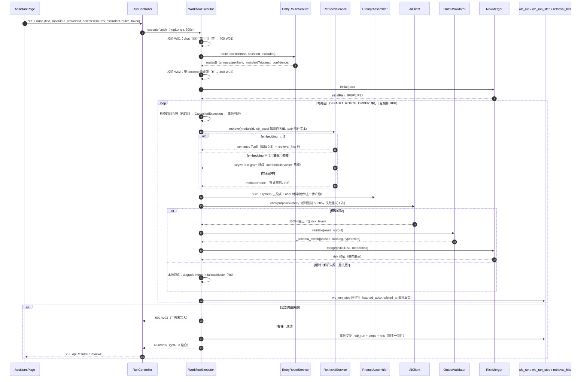
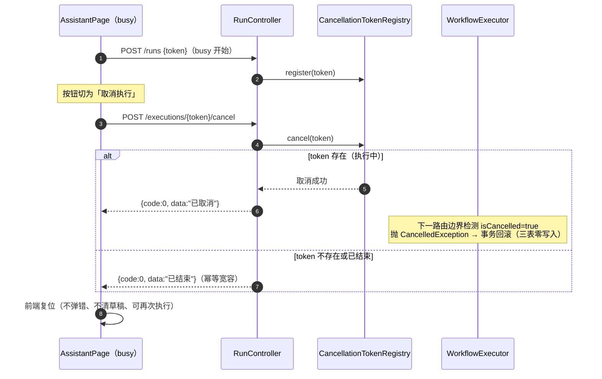
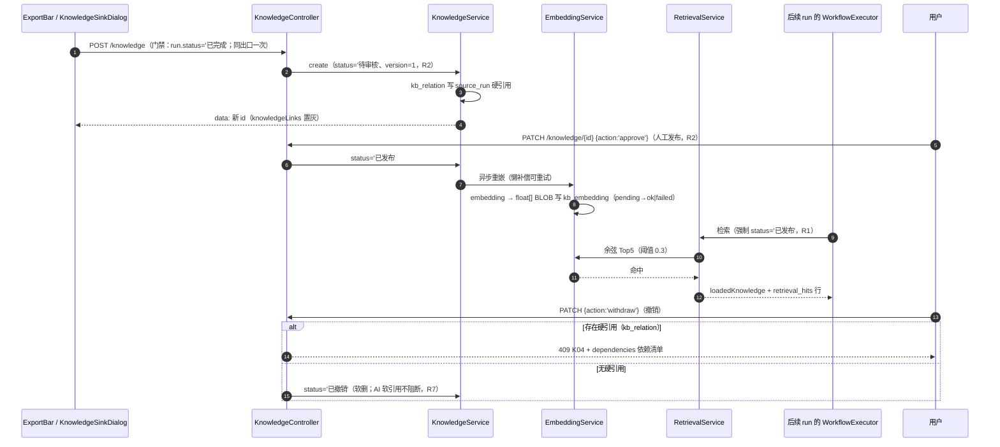
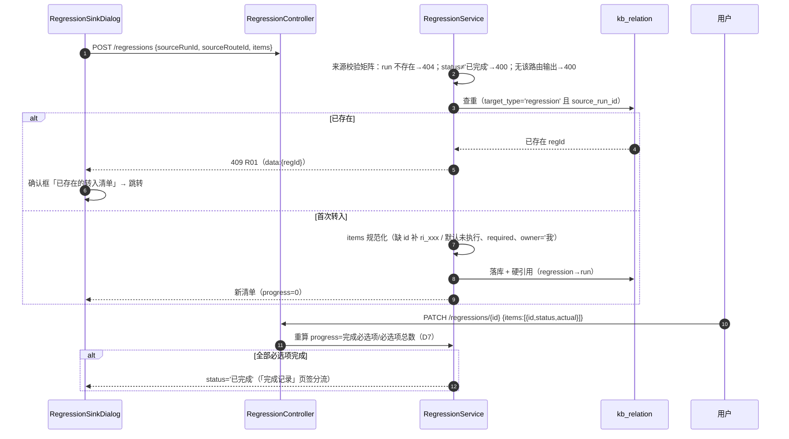
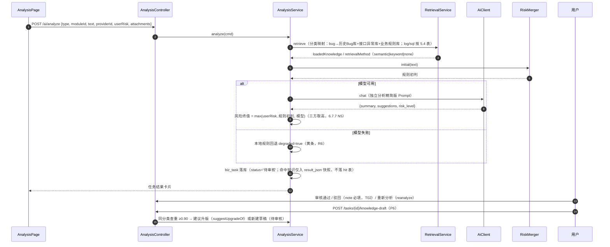
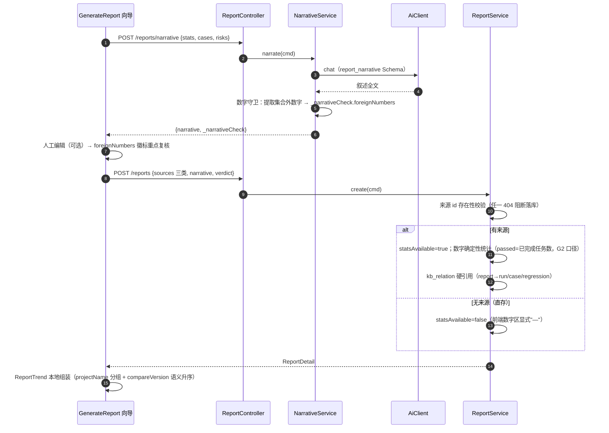
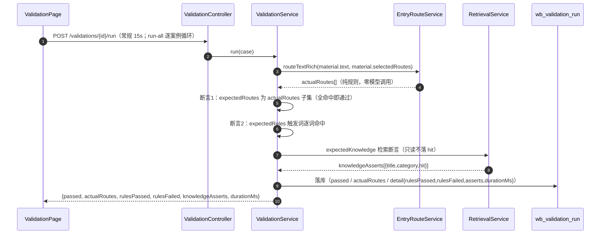

# TestPilot-my 详细设计说明书

> **版本**：v1.0（2026-10-04）
> **依据**：《TestPilot项目说明文档.md》第 9 章（方案唯一真源）、《TestPilot-my概要设计.md》（结构基准）
> **对象**：新项目 TestPilot-my（`D:\develop\TestPilot-my`，整体重写，尚未开始编码）
> **深度**：方法级——完整建表 DDL、全部 API 请求/响应/错误码、模块类与方法职责、关键算法伪代码、Prompt 模板与输出 Schema 全文、前端组件树与交互流
> **效力**：与第 9 章存在出入时以第 9 章为准；本设计中的实现细节（方法签名、DTO 字段、组件划分）为编码基准，编码时可微调但不得偏离红线与既定决策

---

## 目录

1. 引言
2. 总体结构设计
3. 数据库详细设计
4. 后端详细设计
5. REST API 详细设计
6. AI 资产详细设计
7. 前端详细设计
8. 关键流程时序设计
9. 校验规则与错误码矩阵
10. 测试详细设计
11. 附录与索引

---

## 1. 引言

### 1.1 编写目的

本文档将第 9 章方案与概要设计细化到**可直接编码**的级别：每张表的完整 DDL、每个端点的请求/响应/错误码、每个引擎组件的方法签名与算法伪代码、7 个入口的触发词/必填/知识映射/工作流/输出 Schema 全文、13 个页面的组件树与交互流。供后续各 Phase 编码实施与验收对照使用。

### 1.2 与上游文档的关系

```text
TestPilot项目说明文档.md 第 9 章   ← 方案唯一真源（决策 D1~D14、红线、Phase 划分）
        │ 浓缩
TestPilot-my概要设计.md            ← 架构与模块边界基准
        │ 展开
TestPilot-my详细设计.md（本文档）  ← 编码基准（DDL / API / 类方法 / 组件 / 算法）
```

### 1.3 本设计对主文档的三处澄清（需知悉）

编写本设计时发现主文档两处内隐缺口，按最合理方式落实并在此显式声明：

| # | 事项 | 主文档状态 | 本设计处理 |
| --- | --- | --- | --- |
| C1 | 案例验证运行历史 | 9.5.3 提及"运行历史表"，但 9.4.2 表清单（18 张）未列入 | 新增 `wb_validation_run` 表（见 3.2.14），**表总数 19 张**；后续建议回写主文档 |
| C2 | 工作台编排资产端点 | 9.6.1 编排页需读写 `wb_asset`（含版本历史、恢复默认），但 9.5.1 API 清单未列 | 补 `GET/PATCH /api/workbench/assets` 端点组（见 5.2.8） |
| C3 | 用例批次列表端点 | 9.5.1 仅列 `POST/PATCH /api/cases/batches`，批次页签需要列表 | 补 `GET /api/cases/batches`（见 5.2.13） |

### 1.4 读者与使用方式

- **编码实施**（P0~P6 逐 Phase）：第 3~7 章为对应实现清单；完成后按第 10 章测试设计验收；
- **进度对照**：每 Phase 完成后在主文档 9.10.3 登记实施记录，并同步修订本文档对应章节的偏差。

## 2. 总体结构设计

### 2.1 运行时视图

```text
开发态：
  [Vite dev 5173] --proxy /api--> [Spring Boot 8080] --> MySQL testpilot_my
                                          └--> 外部 LLM API（chat/embedding）
生产态：
  [浏览器] --> [Spring Boot 8080（托管 frontend/dist 静态资源 + /api）] --> MySQL + LLM
```

### 2.2 请求通道与超时（编码必守参数）

| 参数 | 值 | 落点 |
| --- | --- | --- |
| 常规请求 axios timeout | 15000ms | `frontend/src/api/http.ts` 默认实例 |
| 长请求 axios timeout | 200000ms | `httpLong` 实例（仅 `POST /runs`、`POST /runs/{id}/rerun`、三个轻量 generate、`POST /tasks/{id}/reanalyze`、`POST /validations/run-all`、`POST /embeddings/reembed`） |
| Tomcat connection-timeout | ≥ 210000ms | `application.yml: server.connection-timeout` |
| 单路由模型超时钳制 | [5000, 30000]ms | `OpenAiCompatClient`（读 provider.timeout_seconds 后 clamp） |
| 执行总预算 | 180000ms | `BudgetController` |
| 重试策略 | 可重试错误固定间隔 800ms 重试 1 次 | `RetryPolicy` |

### 2.3 后端分层与依赖方向

```text
controller ──▶ service ──▶ mapper ──▶ DB
    │            │
    │            ├──▶ workbench（引擎）──▶ ai（引擎）──▶ security（KeyStore）
    │            ├──▶ knowledge（检索域）──▶ ai
    │            └──▶ common（审计/异常/响应）
    └──▶ common
约束：
- controller 不写业务逻辑；service 不直接持有 HTTP 语义（不感知状态码，抛业务异常）；
- workbench 对 knowledge 的依赖经接口 `RetrievalPort`（retrieve / recordHits）注入，对 Key 读取经 `KeyReader` 函数接口注入（依赖倒置，对齐原 createWorkbench 注入设计，便于单测）；
- ai 引擎不依赖任何 controller/service；knowledge 不依赖 workbench。
```

### 2.4 前端分层

```text
views（13 页面）──▶ components（通用组件）──▶ api（资源模块）──▶ stores（bootstrap/ui）
       │                                                │
       └────────────────▶ router（13 路由 + 守卫）◀───────┘
约束：
- 页面组件只编排，不复用他页内部组件；跨页复用一律下沉 components；
- 所有请求经 api 层（组件内禁止直接 axios）；抽屉/通知全局态走 uiStore。
```

---

## 3. 数据库详细设计

### 3.1 全局约定

| 项 | 约定 |
| --- | --- |
| 库 | `testpilot_my`，JDBC URL 追加 `createDatabaseIfNotExist=true&useSSL=false&characterEncoding=utf8&serverTimezone=Asia/Shanghai` |
| 引擎/字符集 | InnoDB / utf8mb4 / utf8mb4_0900_ai_ci |
| 主键 | `id BIGINT AUTO_INCREMENT`；人读业务编号独立列（`code`/`run_code`/`reg_code`）带 UNIQUE |
| 时间列 | `created_at` `DATETIME DEFAULT CURRENT_TIMESTAMP`；`updated_at` `... ON UPDATE CURRENT_TIMESTAMP`；执行轨迹用 `DATETIME(3)` 毫秒精度 |
| JSON 快照 | 一律 `LONGTEXT`（R5 保真：不使用 MySQL JSON 类型避免键序重排）；快照列只读写不作为查询条件 |
| 枚举 | 中文枚举字符串直接入库（与原项目口径一致）；应用侧以常量类约束（见 4.1.4） |
| 删除 | 全库无 DELETE 端点；软停用走 `enabled` / `status` |
| 迁移 | Flyway：`V1__init.sql`（19 表 DDL）→ `V2__seed.sql`（种子，仅空库首装）→ 后续只增不改 |

### 3.2 完整 DDL（V1__init.sql）

#### 3.2.1 sys_module（三级模块树）

```sql
CREATE TABLE sys_module (
  id            BIGINT       AUTO_INCREMENT PRIMARY KEY,
  level         TINYINT      NOT NULL COMMENT '1=项目 2=模块 3=子模块',
  parent_id     BIGINT       NULL     COMMENT '父节点 id；level=1 时为 NULL',
  project_name  VARCHAR(100) NOT NULL COMMENT '项目名（三级行均冗余存全路径名，便于列表展示）',
  module_name   VARCHAR(100) NULL,
  submodule_name VARCHAR(100) NULL,
  enabled       TINYINT      NOT NULL DEFAULT 1 COMMENT '1=启用 0=停用（停用不出现在新建下拉，历史数据不受影响）',
  sort_order    INT          NOT NULL DEFAULT 0,
  created_at    DATETIME     NOT NULL DEFAULT CURRENT_TIMESTAMP,
  updated_at    DATETIME     NOT NULL DEFAULT CURRENT_TIMESTAMP ON UPDATE CURRENT_TIMESTAMP,
  KEY idx_parent (parent_id),
  KEY idx_level_enabled (level, enabled)
) COMMENT='三级模块树（配置中心-项目与模块）';
```

#### 3.2.2 sys_provider（大模型厂商）

```sql
CREATE TABLE sys_provider (
  id              BIGINT       AUTO_INCREMENT PRIMARY KEY,
  name            VARCHAR(50)  NOT NULL COMMENT '厂商名（可改名，6.32 C4 目标态）',
  purpose         VARCHAR(20)  NOT NULL DEFAULT 'chat' COMMENT 'chat | embedding（用途隔离）',
  base_url        VARCHAR(255) NOT NULL,
  model           VARCHAR(100) NOT NULL,
  enabled         TINYINT      NOT NULL DEFAULT 0,
  has_key         TINYINT      NOT NULL DEFAULT 0 COMMENT 'Key 密文文件是否已保存（Key 本体不入库，R4）',
  temperature     DECIMAL(3,2) NULL DEFAULT 0.20,
  timeout_seconds INT          NULL DEFAULT 30,
  max_tokens      INT          NULL DEFAULT 4096,
  created_at      DATETIME     NOT NULL DEFAULT CURRENT_TIMESTAMP,
  updated_at      DATETIME     NOT NULL DEFAULT CURRENT_TIMESTAMP ON UPDATE CURRENT_TIMESTAMP,
  KEY idx_purpose_enabled (purpose, enabled)
) COMMENT='大模型厂商配置';
```

#### 3.2.3 sys_setting（键值配置）

```sql
CREATE TABLE sys_setting (
  setting_key   VARCHAR(50) NOT NULL PRIMARY KEY COMMENT '如 template-bug / template-log / template-sql / template-regression / template-report / template-case',
  setting_value LONGTEXT    NULL,
  updated_at    DATETIME    NOT NULL DEFAULT CURRENT_TIMESTAMP ON UPDATE CURRENT_TIMESTAMP
) COMMENT='键值配置（格式模板等，纯参考不参与 AI 请求）';
```

#### 3.2.4 sys_audit_log（统一审计）

```sql
CREATE TABLE sys_audit_log (
  id            BIGINT       AUTO_INCREMENT PRIMARY KEY,
  resource_type VARCHAR(20)  NOT NULL COMMENT 'module|provider|knowledge|task|run|case|regression|report|suite|validation|asset|setting',
  resource_id   VARCHAR(64)  NOT NULL,
  action        VARCHAR(50)  NOT NULL COMMENT '如 创建/审核通过/驳回/撤销/沉淀/转入/存入/发布新版本/复核通过',
  detail_json   LONGTEXT     NULL COMMENT '动作上下文快照（不含 API Key 与完整正文）',
  created_at    DATETIME     NOT NULL DEFAULT CURRENT_TIMESTAMP,
  KEY idx_res (resource_type, resource_id),
  KEY idx_created (created_at)
) COMMENT='统一审计日志（只增不删）';
```

#### 3.2.5 kb_knowledge（知识）

```sql
CREATE TABLE kb_knowledge (
  id          BIGINT       AUTO_INCREMENT PRIMARY KEY,
  title       VARCHAR(200) NOT NULL,
  category    VARCHAR(20)  NOT NULL COMMENT '历史Bug库|业务规则库|接口异常库|日志规律库|SQL经验库|压测经验库|回归规则库',
  module_id   BIGINT       NULL,
  risk        VARCHAR(4)   NOT NULL DEFAULT 'P1' COMMENT 'P0|P1|P2|P3',
  status      VARCHAR(10)  NOT NULL DEFAULT '待审核' COMMENT '待审核|已发布|已驳回|已撤销',
  version     INT          NOT NULL DEFAULT 1,
  content     LONGTEXT     NOT NULL,
  source_ref  VARCHAR(200) NULL COMMENT '来源引用 {type}:{id}#{routeId}；type=task|run；人工新建为 NULL',
  review_note VARCHAR(500) NULL,
  created_at  DATETIME     NOT NULL DEFAULT CURRENT_TIMESTAMP,
  updated_at  DATETIME     NOT NULL DEFAULT CURRENT_TIMESTAMP ON UPDATE CURRENT_TIMESTAMP,
  KEY idx_status_cat (status, category),
  KEY idx_module (module_id),
  KEY idx_source (source_ref),
  KEY idx_title (title)
) COMMENT='知识条目（审核门控 + 版本化）';
```

#### 3.2.6 kb_relation（硬引用·引用保护）

```sql
CREATE TABLE kb_relation (
  id          BIGINT       AUTO_INCREMENT PRIMARY KEY,
  source_type VARCHAR(20)  NOT NULL COMMENT 'task|run|report|case_batch',
  source_id   VARCHAR(64)  NOT NULL,
  target_type VARCHAR(20)  NOT NULL DEFAULT 'knowledge',
  target_id   VARCHAR(64)  NOT NULL COMMENT 'knowledge.id',
  label       VARCHAR(100) NULL COMMENT '如 知识沉淀/报告来源/申请入库',
  active      TINYINT      NOT NULL DEFAULT 1,
  created_at  DATETIME     NOT NULL DEFAULT CURRENT_TIMESTAMP,
  KEY idx_target (target_type, target_id, active),
  KEY idx_source (source_type, source_id)
) COMMENT='硬引用关系（撤销保护真源：target 侧存在 active=1 即触发 409）';
```

#### 3.2.7 kb_embedding（知识向量缓存）

```sql
CREATE TABLE kb_embedding (
  id           BIGINT       AUTO_INCREMENT PRIMARY KEY,
  knowledge_id BIGINT       NOT NULL,
  kb_version   INT          NOT NULL COMMENT '生成向量时的知识 version；与当前 version 不符即视为过期（宁可检索不到不用旧向量）',
  vector       LONGBLOB     NOT NULL COMMENT 'float32 数组小端序列化',
  vector_model VARCHAR(100) NOT NULL,
  dim          INT          NOT NULL,
  status       VARCHAR(10)  NOT NULL DEFAULT 'ready' COMMENT 'ready|pending（重嵌失败置 pending，可查）',
  updated_at   DATETIME     NOT NULL DEFAULT CURRENT_TIMESTAMP ON UPDATE CURRENT_TIMESTAMP,
  UNIQUE KEY uk_kb (knowledge_id),
  KEY idx_model (vector_model)
) COMMENT='知识向量缓存（一行一知识，覆盖式更新）';
```

#### 3.2.8 kb_retrieval_hit（软引用·检索命中）

```sql
CREATE TABLE kb_retrieval_hit (
  id               BIGINT       AUTO_INCREMENT PRIMARY KEY,
  run_id           BIGINT       NOT NULL,
  route_id         VARCHAR(30)  NOT NULL,
  knowledge_id     BIGINT       NOT NULL,
  title_snapshot   VARCHAR(200) NOT NULL COMMENT '命中时标题快照',
  version_snapshot INT          NOT NULL,
  score            DECIMAL(6,4) NULL COMMENT '相似度/关键词得分',
  method           VARCHAR(10)  NOT NULL COMMENT 'semantic|keyword',
  created_at       DATETIME     NOT NULL DEFAULT CURRENT_TIMESTAMP,
  KEY idx_run (run_id, route_id),
  KEY idx_kb (knowledge_id)
) COMMENT='AI 检索命中软引用（可追溯，不参与撤销保护，R7）';
```

#### 3.2.9 wb_asset（7 入口配置·唯一真源）

```sql
CREATE TABLE wb_asset (
  id                  BIGINT      AUTO_INCREMENT PRIMARY KEY,
  entry_id            VARCHAR(30) NOT NULL UNIQUE COMMENT 'testcase_gen|bug_analysis|log_triage|sql_analysis|regression_list|test_report|prompt_test',
  name                VARCHAR(50) NOT NULL,
  triggers_json       LONGTEXT    NOT NULL COMMENT 'string[] 触发词',
  required_fields_json LONGTEXT   NOT NULL COMMENT 'string[] 必填字段名',
  knowledge_json      LONGTEXT    NOT NULL COMMENT 'string[] 知识分类白名单（检索唯一真源）',
  workflow_json       LONGTEXT    NOT NULL COMMENT '[{name,type}] type=required|optional|manual',
  version             INT         NOT NULL DEFAULT 1 COMMENT '保存发布递增',
  created_at          DATETIME    NOT NULL DEFAULT CURRENT_TIMESTAMP,
  updated_at          DATETIME    NOT NULL DEFAULT CURRENT_TIMESTAMP ON UPDATE CURRENT_TIMESTAMP
) COMMENT='工作台入口配置（运行时实时读取，修改立即生效）';
```

#### 3.2.10 wb_run（执行记录）

```sql
CREATE TABLE wb_run (
  id            BIGINT       AUTO_INCREMENT PRIMARY KEY,
  run_code      VARCHAR(20)  NOT NULL UNIQUE COMMENT 'RUN-yyMMdd-xxxx（人读业务编号）',
  title         VARCHAR(200) NOT NULL COMMENT '由材料首句派生，可编辑',
  text          LONGTEXT     NOT NULL COMMENT '原始输入材料',
  module_id     BIGINT       NULL,
  routes_json   LONGTEXT     NOT NULL COMMENT '[{id,role(primary|auxiliary),matchedTriggers[],confidence,source(auto|selected|fallback)}]',
  input_json    LONGTEXT     NOT NULL COMMENT '{providerId, suiteId?, suiteSnapshot?, attachments:[{name,size,content,include}]}',
  result_json   LONGTEXT     NOT NULL COMMENT '{model, sections:{routeId:{...输出字段,_schema_check?,degraded?}}, routeSummary:{...}, usage}',
  evidence_json LONGTEXT     NOT NULL COMMENT '["知识标题@v版本（semantic 0.87）",...,"兜底：{路由}（{原因}）","重跑自 RUN-..."]',
  missing_json  LONGTEXT     NOT NULL COMMENT '[{routeId, level(blocked|suggest), field, reason}]',
  review_json   LONGTEXT     NOT NULL COMMENT '{required, checks:[{item,checked,checkedAt}], note, status, reviewedAt, riskConfirmed}',
  status        VARCHAR(10)  NOT NULL DEFAULT '待复核' COMMENT '待补充|待复核|已完成',
  risk          VARCHAR(4)   NOT NULL DEFAULT 'P2' COMMENT '规则与模型取高后的终值；复核可人工上调',
  provider_name VARCHAR(50)  NULL,
  model_name    VARCHAR(100) NULL,
  usage_json    VARCHAR(500) NULL COMMENT '{"promptTokens":n,"completionTokens":n,"totalTokens":n}',
  duration_ms   BIGINT       NULL,
  created_at    DATETIME     NOT NULL DEFAULT CURRENT_TIMESTAMP,
  updated_at    DATETIME     NOT NULL DEFAULT CURRENT_TIMESTAMP ON UPDATE CURRENT_TIMESTAMP,
  KEY idx_status (status),
  KEY idx_created (created_at),
  KEY idx_module (module_id),
  KEY idx_risk (risk)
) COMMENT='AI 助手执行记录（同步一次性落库）';
```

#### 3.2.11 wb_run_step（逐步执行轨迹）

```sql
CREATE TABLE wb_run_step (
  id           BIGINT       AUTO_INCREMENT PRIMARY KEY,
  run_id       BIGINT       NOT NULL,
  step_index   INT          NOT NULL COMMENT '全局顺序号（跨路由连续）',
  route_id     VARCHAR(30)  NULL COMMENT '所属路由；纯人工节点为 NULL',
  step_name    VARCHAR(100) NOT NULL,
  step_type    VARCHAR(10)  NOT NULL DEFAULT 'required' COMMENT 'required|optional|manual（FR-05 目标态）',
  status       VARCHAR(10)  NOT NULL DEFAULT '已完成' COMMENT '已完成（兜底亦标已完成+note 说明，R6 显式）',
  started_at   DATETIME(3)  NULL,
  completed_at DATETIME(3)  NULL,
  note         VARCHAR(500) NULL COMMENT '本地兜底：{原因}（已重试 1 次）/ 逐样例判定：{verdict}（Prompt 测试）',
  KEY idx_run (run_id, step_index)
) COMMENT='执行轨迹（真实起止时间，毫秒精度）';
```

#### 3.2.12 wb_prompt_suite（Prompt 测试集）

```sql
CREATE TABLE wb_prompt_suite (
  id              BIGINT       AUTO_INCREMENT PRIMARY KEY,
  title           VARCHAR(100) NOT NULL,
  prompt_text     LONGTEXT     NOT NULL COMMENT '被测 Prompt 原文',
  expected_schema LONGTEXT     NULL COMMENT '预期输出 Schema 原文（自由文本）',
  samples_json    LONGTEXT     NOT NULL COMMENT '[{name,input,mode,expected}] ≤10；mode=exact|contains|json_fields|regex|manual',
  module_id       BIGINT       NULL,
  version         INT          NOT NULL DEFAULT 1 COMMENT '编辑保存 +1',
  status          VARCHAR(10)  NOT NULL DEFAULT 'active' COMMENT 'active|disabled（6.26 目标态：停用不出现在下拉，可删除）',
  created_at      DATETIME     NOT NULL DEFAULT CURRENT_TIMESTAMP,
  updated_at      DATETIME     NOT NULL DEFAULT CURRENT_TIMESTAMP ON UPDATE CURRENT_TIMESTAMP
) COMMENT='Prompt 测试集资产';
```

#### 3.2.13 wb_validation_case（案例验证）

```sql
CREATE TABLE wb_validation_case (
  id                      BIGINT       AUTO_INCREMENT PRIMARY KEY,
  title                   VARCHAR(100) NOT NULL,
  material_json           LONGTEXT     NOT NULL COMMENT '{text, moduleId?, selectedRoutes?}',
  expected_routes_json    LONGTEXT     NOT NULL COMMENT 'string[] 期望命中路由（子集断言：期望全命中即通过）',
  expected_rules_json     LONGTEXT     NOT NULL COMMENT 'string[] 期望触发规则（6.13 目标态：参与断言）',
  expected_knowledge_json LONGTEXT     NULL COMMENT '[{title,category}] 知识断言（6.13.7：期望可被检索命中）',
  last_result_json        LONGTEXT     NULL COMMENT '最近一次运行结果快照',
  created_by              VARCHAR(20)  NOT NULL DEFAULT 'official' COMMENT 'official|user（自建案例）',
  created_at              DATETIME     NOT NULL DEFAULT CURRENT_TIMESTAMP,
  updated_at              DATETIME     NOT NULL DEFAULT CURRENT_TIMESTAMP ON UPDATE CURRENT_TIMESTAMP
) COMMENT='案例验证（路由回归沙箱，纯规则执行不调模型）';
```

#### 3.2.14 wb_validation_run（案例运行历史）★ 本设计新增（澄清 C1）

```sql
CREATE TABLE wb_validation_run (
  id                 BIGINT   AUTO_INCREMENT PRIMARY KEY,
  case_id            BIGINT   NOT NULL,
  passed             TINYINT  NOT NULL,
  actual_routes_json LONGTEXT NOT NULL COMMENT 'string[] 实际命中路由顺序',
  detail_json        LONGTEXT NULL COMMENT '{rulesPassed, rulesFailed, knowledgeAsserts:[{title,category,hit}], durationMs}',
  created_at         DATETIME NOT NULL DEFAULT CURRENT_TIMESTAMP,
  KEY idx_case (case_id, created_at)
) COMMENT='案例运行历史（run-all 汇总与单案例历史查询）';
```

#### 3.2.15 biz_case（测试用例）

```sql
CREATE TABLE biz_case (
  id           BIGINT       AUTO_INCREMENT PRIMARY KEY,
  code         VARCHAR(20)  NOT NULL UNIQUE COMMENT 'TC-{seq}；AI 批量 TC-AI{yyMMdd}{nn}；复制 TC-C{yyMMdd}{nn}',
  title        VARCHAR(200) NOT NULL,
  module_id    BIGINT       NOT NULL,
  priority     VARCHAR(4)   NOT NULL DEFAULT 'P1' COMMENT 'P0|P1|P2',
  case_type    VARCHAR(10)  NOT NULL DEFAULT '功能' COMMENT '功能|接口|异常|回归',
  status       VARCHAR(10)  NOT NULL DEFAULT '未执行' COMMENT '未执行|通过|失败|阻塞|跳过（执行状态与版本独立管理）',
  version      INT          NOT NULL DEFAULT 1 COMMENT '编辑升版 +1',
  archived     TINYINT      NOT NULL DEFAULT 0,
  content_json LONGTEXT     NOT NULL COMMENT '{"precondition":str,"steps":[str],"expected":str,"testData":str,"_meta":{source,model,generatedAt,runId?,routeId?,editedAt?}}',
  created_at   DATETIME     NOT NULL DEFAULT CURRENT_TIMESTAMP,
  updated_at   DATETIME     NOT NULL DEFAULT CURRENT_TIMESTAMP ON UPDATE CURRENT_TIMESTAMP,
  KEY idx_module (module_id),
  KEY idx_status_archived (status, archived),
  KEY idx_priority (priority)
) COMMENT='测试用例';
```

#### 3.2.16 biz_task（独立分析任务）

```sql
CREATE TABLE biz_task (
  id               BIGINT       AUTO_INCREMENT PRIMARY KEY,
  title            VARCHAR(200) NOT NULL,
  type             VARCHAR(10)  NOT NULL COMMENT 'bug|log|sql',
  module_id        BIGINT       NOT NULL,
  risk             VARCHAR(4)   NOT NULL DEFAULT 'P2' COMMENT '终值=用户手选/本地初判/模型 三方取高',
  status           VARCHAR(10)  NOT NULL DEFAULT '待审核' COMMENT '待审核|已完成|待补充|已驳回',
  input            LONGTEXT     NOT NULL,
  result_json      LONGTEXT     NULL COMMENT '{summary,risk,suggestions,missingFields,loadedKnowledge[],retrievalMethod,providerName,modelName,degraded?}',
  review_status    VARCHAR(10)  NOT NULL DEFAULT '待审核' COMMENT '创建即与 status 同步（修正原 6.3.4 不一致）',
  review_note      VARCHAR(500) NULL COMMENT '驳回原因（6.7.7 N2：驳回必须填原因）',
  provider_name    VARCHAR(50)  NULL,
  model_name       VARCHAR(100) NULL,
  attachments_json LONGTEXT     NULL COMMENT '[{name,size}] 元数据（正文不复制进 result，R8 精神）',
  created_at       DATETIME     NOT NULL DEFAULT CURRENT_TIMESTAMP,
  updated_at       DATETIME     NOT NULL DEFAULT CURRENT_TIMESTAMP ON UPDATE CURRENT_TIMESTAMP,
  KEY idx_type_status (type, status),
  KEY idx_module (module_id)
) COMMENT='Bug/日志/SQL 独立分析任务';
```

#### 3.2.17 biz_regression（回归清单）

```sql
CREATE TABLE biz_regression (
  id              BIGINT       AUTO_INCREMENT PRIMARY KEY,
  reg_code        VARCHAR(20)  NOT NULL UNIQUE COMMENT 'REG-{seq}',
  title           VARCHAR(200) NOT NULL,
  version         VARCHAR(20)  NULL,
  module_id       BIGINT       NULL,
  status          VARCHAR(10)  NOT NULL DEFAULT '执行中' COMMENT '执行中|已完成（完成记录页签分流）',
  progress        INT          NOT NULL DEFAULT 0 COMMENT '必选项口径：完成必选项/必选项总数（D7）',
  source_run_id   BIGINT       NULL COMMENT '助手转入来源 run（手工/规则生成为 NULL）',
  source_route_id VARCHAR(30)  NULL,
  data_json       LONGTEXT     NOT NULL COMMENT '{"items":[{id,title,priority,required,source,reason,caseId?,expected,actual,owner,status}]}',
  created_at      DATETIME     NOT NULL DEFAULT CURRENT_TIMESTAMP,
  updated_at      DATETIME     NOT NULL DEFAULT CURRENT_TIMESTAMP ON UPDATE CURRENT_TIMESTAMP,
  KEY idx_status (status),
  KEY idx_source_run (source_run_id)
) COMMENT='回归清单（创建含 sourceRunId 查重 409）';
```

#### 3.2.18 biz_report（测试报告）

```sql
CREATE TABLE biz_report (
  id           BIGINT       AUTO_INCREMENT PRIMARY KEY,
  title        VARCHAR(200) NOT NULL,
  project_name VARCHAR(100) NOT NULL DEFAULT '未指定项目' COMMENT '取自 sys_module 去重项目名（T1 真源化）',
  version      VARCHAR(20)  NULL,
  verdict      VARCHAR(10)  NOT NULL COMMENT '可上线|有条件上线|不能上线',
  data_json    LONGTEXT     NOT NULL COMMENT '见 5.2.15 响应结构（statsAvailable/数字/narrative 双形态/sources 三类/risks）',
  created_at   DATETIME     NOT NULL DEFAULT CURRENT_TIMESTAMP,
  updated_at   DATETIME     NOT NULL DEFAULT CURRENT_TIMESTAMP ON UPDATE CURRENT_TIMESTAMP,
  KEY idx_project (project_name),
  KEY idx_created (created_at)
) COMMENT='测试报告（数字确定性，AI 仅叙述）';
```

#### 3.2.19 biz_case_batch（用例执行批次）

```sql
CREATE TABLE biz_case_batch (
  id          BIGINT       AUTO_INCREMENT PRIMARY KEY,
  title       VARCHAR(200) NOT NULL,
  module_id   BIGINT       NULL,
  status      VARCHAR(10)  NOT NULL DEFAULT '执行中' COMMENT '执行中|已完成',
  data_json   LONGTEXT     NOT NULL COMMENT '{"items":[{caseId,code,title,result,note,executedAt}]}（6.11 W3）',
  created_at  DATETIME     NOT NULL DEFAULT CURRENT_TIMESTAMP,
  updated_at  DATETIME     NOT NULL DEFAULT CURRENT_TIMESTAMP ON UPDATE CURRENT_TIMESTAMP
) COMMENT='用例执行批次（逐条结果记录，与用例 status 联动）';
```

### 3.3 种子数据设计（V2__seed.sql 清单）

| 域 | 种子 | 口径 |
| --- | --- | --- |
| sys_module | 电商平台 → 订单模块/支付模块 → 支付回调/优惠券/会员账户 等约 10 行；测试平台 1 行 | 对齐原项目模块树；enabled 全 1 |
| sys_provider | OpenAI(chat,enabled=0)、通义千问(chat,0)、DeepSeek(chat,0)、OpenAI Embedding(embedding,0) | 全部默认停用、has_key=0（首启无可用模型，分析功能显式阻断提示） |
| sys_setting | template-bug/log/sql/regression/report/case 六键 | 纯参考字段清单（C1 降级目标态：页面如实标注"不参与 AI 请求"） |
| wb_asset | 7 入口默认配置（内容见第 6 章 6.1 全文） | version=1 |
| kb_knowledge | 5 条已发布知识（历史 Bug 库×2、日志规律库、SQL 经验库、回归规则库）+ 1 条待审核 | 演示检索命中与审核门控 |
| biz_task | task_bug_001(P0,已完成)、task_log_001(P1,待审核)、task_sql_001(P2,待审核) | 对齐原项目演示口径 |
| biz_case | case_001~004（P0×2/P1×2，功能/接口/异常/回归各类型） | 支撑回归规则聚合与首页高风险统计 |
| biz_regression | REG-0001（执行中，3 items 全 required） | 演示进度口径 |
| biz_report | REP-0001（有条件上线，含 statsAvailable=true 数字） | 趋势对比演示基线 |
| wb_validation_case | 官方 walkthrough（支付异常→bug→log→sql→regression 顺序）+ val_prompt_test | 断言含 expectedRules 与知识断言示例 |
| kb_relation | 2 条演示硬引用（seed 报告→知识） | 撤销保护 409 可真实触发演示 |

种子执行纪律：Flyway `V2__seed.sql` 中的 INSERT 仅在空库首装时执行一次（Flyway 天然保证）；后续数据演进一律新增迁移版本（`V3__*.sql`），禁止改写 V1/V2。

### 3.4 溯源关系查询路径（替代原 LIKE 前缀匹配）

| 出口 | 写入位置 | `getRun` 聚合查询 |
| --- | --- | --- |
| 沉淀为知识 | `kb_knowledge.source_ref = 'run:{runId}#{routeId}'` | `SELECT id,title FROM kb_knowledge WHERE source_ref LIKE 'run:{runId}#%'`（source_ref 有索引；精确前缀已索引，语义等价于显式列且保持 task/run 双型统一） |
| 存入用例库 | `biz_case.content_json._meta.runId/routeId` | `SELECT COUNT(*) FROM biz_case WHERE JSON_EXTRACT(content_json,'$._meta.runId') = {runId}`（MySQL 8 函数索引；量级千级无压力） |
| 转回归清单 | `biz_regression.source_run_id/source_route_id` 显式列 | `WHERE source_run_id = {runId}` |
| 存测试报告 | `kb_relation(report→run)` + `data_json.runId` 双保险 | `SELECT source_id FROM kb_relation WHERE target_type='run' AND target_id={runId} AND source_type='report'` |

> 说明：知识出口保留 `source_ref` 前缀字符串（而非拆两列）是为兼容 `task:{id}` 与 `run:{id}#{routeId}` 双形态单列存储；列上建普通索引后前缀匹配走索引，与显式列查询性能等价（D4 决策落地方式）。

---

## 4. 后端详细设计

### 4.1 common 包

#### 4.1.1 统一响应体 ApiResult

```java
public record ApiResult<T>(int code, String message, T data) {
    public static <T> ApiResult<T> ok(T data) { return new ApiResult<>(0, "ok", data); }
    public static ApiResult<T> error(int code, String message) { return new ApiResult<>(code, message, null); }
}
```

约定：`code=0` 成功；非 0 为业务码且 HTTP 状态码同步（400/404/409/502），前端 axios 拦截器按 code 转通知。

#### 4.1.2 业务异常体系

```text
public class BizException extends RuntimeException {
    private final HttpStatus httpStatus;   // BAD_REQUEST / NOT_FOUND / CONFLICT / BAD_GATEWAY
    private final int code;                // 业务码（见第 9 章矩阵）
    public BizException(HttpStatus status, int code, String message) { ... }
}
```

全局处理：`@RestControllerAdvice` 捕获 `BizException` → `ApiResult.error`；捕获 `MethodArgumentNotValidException` → 400 字段级消息；捕获其余 `Exception` → 500 通用消息（**堆栈写日志但不回传，日志中不得含 API Key 与快照正文，R4**）。

#### 4.1.3 领域常量类

```java
public final class Enums {
    public static final Set<String> KB_CATEGORIES = Set.of("历史Bug库","业务规则库","接口异常库","日志规律库","SQL经验库","压测经验库","回归规则库");
    public static final Set<String> ENTRY_IDS = Set.of("testcase_gen","bug_analysis","log_triage","sql_analysis","regression_list","test_report","prompt_test");
    public static final Set<String> RUN_STATUS = Set.of("待补充","待复核","已完成");
    public static final Set<String> KB_STATUS = Set.of("待审核","已发布","已驳回","已撤销");
    public static final Set<String> VERDICTS = Set.of("可上线","有条件上线","不能上线");
    public static final List<String> PAGE_SIZES = List.of("20","50","100");   // 分页白名单
    public static final List<String> DEFAULT_ROUTE_ORDER = List.of("bug_analysis","log_triage","sql_analysis","regression_list","testcase_gen","test_report","prompt_test");
}
```

#### 4.1.4 分页参数 PageQuery

```java
public record PageQuery(String q, String status, Integer page, Integer pageSize) {
    public int safePage() { return page == null || page < 1 ? 1 : page; }
    public int safeSize() { return pageSize == null || !PAGE_SIZES.contains(String.valueOf(pageSize)) ? 20 : pageSize; }
}
```

#### 4.1.5 审计服务 AuditService

```text
@Service public class AuditService {
    public void log(String resourceType, Object resourceId, String action, Object detail);  // 异步落 sys_audit_log（@Async）
}
```

#### 4.1.6 MyBatis-Plus 配置

- ID 类型 `ASSIGN_ID` 关闭（全表用 `AUTO_INCREMENT`）；
- `JsonLongTypeHandler`（自定义，基于 Jackson `ObjectMapper`，LONGTEXT ↔ Map/List/实体）：`wb_run.routesJson` 等列以 `@TableField(typeHandler = JsonLongTypeHandler.class)` + `autoResultMap = true` 映射；
- 逻辑删除插件**不启用**（全库无删除语义）。

### 4.2 controller 层（端点映射总表）

| 控制器 | 端点（Method Path → 委托方法） |
| --- | --- |
| BootstrapController | `GET /api/bootstrap` → bootstrapService.get()；`GET /api/dashboard/metrics` → dashboardService.metrics() |
| ModuleController | `GET /api/modules`；`POST /api/modules`；`PATCH /api/modules/{id}` |
| ProviderController | `GET/POST /api/providers`；`PATCH/DELETE /api/providers/{id}`；`POST /api/providers/{id}/key`；`POST /api/providers/{id}/test` |
| SettingController | `GET/PATCH /api/settings` |
| KnowledgeController | `GET /api/knowledge`；`GET /api/knowledge/{id}`；`POST /api/knowledge`；`PATCH /api/knowledge/{id}`；`POST /api/knowledge/import` |
| KnowledgeSearchController | `GET /api/knowledge/search`；`GET /api/knowledge/{id}/impact`；`GET /api/knowledge/embeddings/status`；`POST /api/knowledge/embeddings/reembed` |
| TaskController | `GET/POST /api/tasks`；`PATCH /api/tasks/{id}`；`POST /api/tasks/{id}/reanalyze`；`POST /api/tasks/{id}/knowledge-draft` |
| AnalyzeController | `POST /api/ai/analyze` |
| WorkbenchController | `POST /api/workbench/preflight`；`POST /api/workbench/runs`；`GET /api/workbench/runs`；`GET/PATCH /api/workbench/runs/{id}`；`POST /api/workbench/runs/{id}/rerun`；`POST /api/workbench/executions/{token}/cancel` |
| AssetController | `GET /api/workbench/assets`；`PATCH /api/workbench/assets/{entryId}`；`GET /api/workbench/assets/{entryId}/versions`；`POST /api/workbench/assets/{entryId}/reset` |
| SuiteController | `GET/POST /api/workbench/suites`；`PATCH/DELETE /api/workbench/suites/{id}` |
| ValidationController | `GET/POST /api/workbench/validations`；`POST /api/workbench/validations/{id}/run`；`POST /api/workbench/validations/run-all` |
| GenerateController | `POST /api/workbench/cases/generate`；`POST /api/workbench/regressions/generate`；`POST /api/workbench/reports/narrative` |
| CaseController | `GET/POST /api/cases`；`PATCH /api/cases/{id}`；`GET/POST /api/cases/batches`；`PATCH /api/cases/batches/{id}` |
| RegressionController | `GET/POST /api/regressions`；`PATCH /api/regressions/{id}` |
| ReportController | `GET/POST /api/reports`；`GET /api/reports/{id}` |
| AuditController | `GET /api/audit` |

控制器规范：方法体 ≤ 5 行（参数校验注解 + 委托 + 返回）；`@Valid` + DTO 内 `@NotBlank/@Size` 完成入参校验；不感知事务。

### 4.3 service 层（类与方法职责清单）

#### 4.3.1 ModuleService

```text
List<ModuleNode> tree()                       // 读全部 enabled+disabled 组装三级树（配置中心展示全量；下拉场景由前端过滤 enabled）
Long create(ModuleCreateDto d)                // 校验 level/parent 存在性；sort_order 默认 99 → 排尾
void update(Long id, ModuleUpdateDto d)       // 全字段可选合并（?? 语义：null 不覆盖）；改名/停用/排序均可（6.32 C2 目标态）
```

#### 4.3.2 ProviderService

```text
List<ProviderView> list()                     // 脱敏视图（hasKey 布尔 + 四项参数；永不返回 Key）
Long create(ProviderCreateDto d)              // name/baseUrl/model/purpose
void update(Long id, ProviderUpdateDto d)     // 局部更新：仅覆盖请求携带字段（修复"缺 enabled 静默停用"）；不含 Key
void delete(Long id)                          // 前置校验：必须先 enabled=0；密文文件同步删除（KeyStore.remove）
void saveKey(Long id, String key)             // KeyStore.save → has_key=1；审计（不记 Key 内容）
TestResult test(Long id)                      // 两级探测：① GET {baseUrl}/models（2s 超时）② 失败降级 POST /chat/completions 1-token 请求（max_tokens=1）；返回 {ok, latencyMs, mode: "models"|"chat", message}
```

#### 4.3.3 KnowledgeService（核心状态机）

```text
Page<KnowledgeView> page(KnowledgeQuery q)                       // q/category/status/moduleId 筛选 + LIKE 搜索
KnowledgeDetail detail(Long id)                                   // 含 dependencies（kb_relation active=1 来源清单）与 referenceCount（软+硬引用计数）
Long create(KnowledgeCreateDto d)                                 // 强制 status='待审核'、version=1；触发 EmbeddingService.asyncEmbed(id)（发布时才真正需要向量，待审核不嵌——见 4.6.1 触发矩阵）
void patch(Long id, KnowledgePatchDto d)                          // action 分派：见下表
Map<String,Object> importKnowledge(List<KnowledgeCreateDto> list) // 逐条校验（title/category/content 必填、category∈7 分类）→ 同题同分类跳过 → 全部待审核；返回 {success, skipped, failed:[{title,reason}]}

// patch 的 action 状态机：
//   edit    → content/标题等更新，version+1，触发重嵌
//   approve → status='已发布'（仅待审核/已驳回可进），触发重嵌 + 审计"审核通过"
//   reject  → status='已驳回'（review_note 必填）
//   withdraw→ status='已撤销'；前置：SELECT kb_relation WHERE target_id={id} AND active=1 命中 → 抛 409 + dependencies 清单（R7 硬引用保护）
```

#### 4.3.4 TaskService（独立分析任务）

```text
Page<TaskView> page(TaskQuery q)                    // type/status/moduleId/q
Long create(TaskCreateDto d)                        // status 与 review_status 同步='待审核'（修正 6.3.4）
void review(Long id, TaskReviewDto d)               // submit/approve/reject（reject 必填 note）；approve 后开放申请入知识库
TaskView reanalyze(Long id, ReanalyzeDto d)         // 见 4.5.7（6.8 T2：原输入可改后重分析，生成新 result 覆盖前先落审计快照；也支持原样重跑）
Long knowledgeDraft(Long id, KnowledgeDraftDto d)   // 人工触发（P6 升级为 AI 起草，见 4.5.8）；创建待审核知识 source_ref='task:{id}' + 登记 kb_relation(task→knowledge, label='申请入库')
```

#### 4.3.5 CaseService / RegressionService / ReportService

```text
// CaseService
Page<CaseView> page(CaseQuery q)                    // 搜索范围含标题+步骤+预期（6.28：LIKE content_json——千级量级可接受）
Long create(CaseCreateDto d)                        // code 生成规则见 3.2.15；含 _meta 透传
void update(Long id, CaseUpdateDto d)               // 编辑升版 version+1；_meta 原值保留并追加 editedAt
Long createBatch(BatchCreateDto d)                  // items 为勾选用例 id 快照
void updateBatch(Long id, BatchUpdateDto d)         // 逐条 result 回写 + 同步 biz_case.status + 全部完成置已完成

// RegressionService
Page<RegressionView> page(RegressionQuery q)
Long create(RegressionCreateDto d)                  // sourceRunId 存在 → 校验 run 存在(404)/已完成(400)/含 regression_list 输出(400)/查重 kb_relation+source_run_id(409)；items 规范化（缺 id 补 ri_xxx、status 默认未执行、required 默认 true、owner 默认 '我'）
void update(Long id, RegressionUpdateDto d)         // 逐条 status/actual 更新 → 重算 progress（必选项口径）→ 100% 置已完成

// ReportService
Page<ReportView> page(ReportQuery q)
ReportDetail detail(Long id)                        // data_json 解析 + 审计拉取（G5）
Long create(ReportCreateDto d)                      // sourceRunId 校验矩阵同回归；直存路径 statsAvailable=false；sources 循环写 kb_relation
```

#### 4.3.6 DashboardService

```text
DashboardMetrics metrics()      // 六条 COUNT 单查：待补充(tasks) / 待审核(tasks) / 执行中(tasks执行中+regressions执行中) / 阻塞(tasks) / 高风险(tasks P0 + cases P0 未归档) / 不可上线(最新报告 verdict='不能上线' ? 1 : 0)
```

### 4.4 ai 引擎域

#### 4.4.1 ProviderRegistry

```text
@Component public class ProviderRegistry {
    // 依赖：SysProviderMapper + KeyStore
    public Provider pick(Long providerId, String purpose) {
        // ① providerId 非空：查行 → enabled=1 && purpose 匹配 && has_key=1 否则 BizException(400,"指定的模型不可用") → 返回（含解密 Key）
        // ② 空：WHERE purpose=? AND enabled=1 AND has_key=1 ORDER BY id LIMIT 1 → 无行 BizException(400,"未配置可用的对话模型，请到配置中心→大模型启用并配置 Key")
    }
    public List<ProviderView> listChatEnabled()        // 助手页模型下拉（bootstrap 也用）
}
```

#### 4.4.2 OpenAiCompatClient（自研，JDK HttpClient）

```text
@Component public class OpenAiCompatClient {
    public ChatResult chat(Provider p, List<Msg> messages)      // POST {baseUrl}/chat/completions；响应取 choices[0].message.content；剥离 ```json 围栏后必须 JSON.parse 为对象否则抛 ModelCallException；返回 content + usage
    public String chatRaw(Provider p, List<Msg> messages)       // 同上但不做 JSON 解析（Prompt 测试真运行）
    public float[] embed(Provider p, List<String> texts)        // POST {baseUrl}/embeddings；取 data[0].embedding
    // 通用：超时 = clamp(provider.timeoutSeconds, 5, 30)s；请求头 Authorization: Bearer {key}
    // 重试：RetryPolicy.shouldRetry(异常) → 429/5xx/IOException/JsonParseException → sleep(800ms) 重试 1 次 → 仍失败抛出
}
public record ChatResult(String content, Usage usage) {}        // Usage{promptTokens,completionTokens,totalTokens}
```

#### 4.4.3 PromptAssembler（模板全文见 6.3）

```java
@Component public class PromptAssembler {
    public String system(EntryDef entry, ModuleLabel module, List<KnowledgeFact> facts, String initialRisk) {
        // 组装：角色声明 + 模块路径 + 工作流步骤（来自 wb_asset.workflow_json）+ 知识事实列表（facts 为空 → 注入"本次未检索到相关知识……禁止虚构"）+ 安全规则（含"风险只可在 P{initialRisk} 基础上调高"）+ 输出字段说明（由 OutputSchemaDefs 单源生成）
    }
    public String user(String text, List<Attachment> attachments) {
        // text + include=true 的附件逐个 "\n--- 附件：{name} ---\n{前8KB}"
    }
    public String userWithPrev(String text, List<Attachment> att, Map<String,Object> prevOutputs) {
        // 上一步产物传递（6.18）：追加 "\n【上一步分析结论（供参考，独立判断）】\n{prevOutputs 摘要 JSON}"
    }
}
```

#### 4.4.4 OutputSchemaValidator

```java
@Component public class OutputSchemaValidator {
    public SchemaCheck validate(String entryId, Map<String,Object> parsed) {
        // 按 OutputSchemaDefs.get(entryId)（见 6.2 全文）逐字段：
        //   string  → 非 null 且非空白
        //   string[]→ List 且元素全为非空 string
        //   object[]→ List 且逐条为 Map；title/expected 非空、steps 为非空 string[]；错误信息带"第 N 条"
        //   {title,content}[] → 逐条 title/content 非空
        // 返回 {passed, missing[], typeErrors[]}
    }
}
public record SchemaCheck(boolean passed, List<String> missing, List<String> typeErrors) {}
```

#### 4.4.5 RiskMerger

```java
@Component public class RiskMerger {
    private static final List<RiskRule> RULES = List.of(   // 词表全文与各词分级依据见 6.4
        new RiskRule("P0", Pattern.compile("生产|资损|重复扣款|数据丢失|安全|p0|崩溃|\\bcrash(?:es|ed|ing)?\\b|白屏|宕机|drop\\s+table|truncate\\s+table|全量删除|误删", CASE_INSENSITIVE)),
        new RiskRule("P1", Pattern.compile("失败|异常|超时|锁等待|lock\\s*wait|卡死|卡顿|数据不一致|越权|超卖|错账|\\berror(?:s|ed)?\\b|\\bexceptions?\\b|\\btimeouts?\\b|\\bfail(?:s|ed|ing|ure|ures)?\\b|\\bfatal\\b|慢查询|全表扫描|死锁|deadlock|回滚|紧急修复|hotfix|hot\\s+fix|线上故障|线上问题|阻塞|未通过|不通过|遗留", CASE_INSENSITIVE)));
    public String initial(String text) { /* P0 命中→P0；P1 命中→P1；否则 P2 */ }
    public String merge(String initial, String modelRisk) {
        // RANK: P0=0 < P1=1 < P2=2 < P3=3；return rank(modelRisk) < rank(initial) ? initial : modelRisk
        // （模型只能升不能降；无效枚举值按 P2 处理并记 typeError）
    }
}
```

#### 4.4.6 BudgetController

```text
public class BudgetController {
    private final long deadline;                            // now + 180_000ms
    public boolean exceeded();                              // System.nanoTime() 对照
    public long remaining();                                // 供单路由超时 min(30s, remaining)
}
```

#### 4.4.7 EntryRouteService（触发词路由·真源实时读取）

```java
@Service public class EntryRouteService {
    // 依赖：WbAssetMapper（每次调用实时读——编排修改立即生效）
    public List<RouteHit> routeTextRich(String text, Set<String> selected) {
        // ① 读 7 入口 assets → triggers_json
        // ② 每入口计算 matchedTriggers = triggers 中实际在 text 出现的词（保持声明序）
        // ③ auto = matchedTriggers 非空的入口；selected 中不在 auto 的追加 source='selected'
        // ④ role：排序后首位 primary 其余 auxiliary；排序 = DEFAULT_ROUTE_ORDER 中位置
        // ⑤ confidence = 50 + min(30, matchedTriggers.size()*10) + round(completeness*0.2)（selected-only 显示 null → 前端"手动指定"）
        // ⑥ 全空 → fallback=[bug_analysis(source='fallback')]（前端显式标注"未命中入口，默认 Bug 分析"）
    }
    public List<String> routeText(String text, Set<String> selected) { /* 上方法 id 投影（validations 复用） */ }
}
public record RouteHit(String id, String role, List<String> matchedTriggers, Integer confidence, String source) {}
```

### 4.5 workbench 引擎域

#### 4.5.1 WorkflowExecutor（核心执行器，`POST /runs` 主体）

```java
@Service public class WorkflowExecutor {
    // 注入：ProviderRegistry / OpenAiCompatClient / PromptAssembler / OutputSchemaValidator /
    //       RiskMerger / EntryRouteService / RetrievalPort / KeyReader / WbRunMapper / WbRunStepMapper / AuditService
    // 注入（运行态）：ExecutionRegistry（取消令牌表 ConcurrentHashMap<String, AtomicBoolean>）

    public RunView execute(RunCreateDto d, String token) {
        // ① provider = registry.pick(d.providerId(), "chat")                 —— 400 阻断
        // ② hits = entryRoute.routeTextRich(d.text(), d.selectedRoutes())
        //    missing = FieldPresent.check(d.text(), hits 各入口 requiredFields)   // 规则表全文见 6.5
        //    initialRisk = riskMerger.initial(d.text())
        // ③ routes = hits（串行顺序）
        // ④ budget = new BudgetController()
        //    sections/routeSummary/steps/evidence/usage 累积容器
        // ⑤ for (route : routes) {
        //        if (registry.cancelled(token)) return null;                 // 取消：直接返回 null，调用方不落库不写响应
        //        if (budget.exceeded()) { degraded(route, "总预算耗尽"); continue; }
        //        facts = retrievalPort.retrieve(retrievalInput(d), asset.knowledgeOf(route))   // 附件前2000字入检索（C3）
        //        if (route.id == "prompt_test") { section = promptTestRunner.run(...); }
        //        else {
        //            prompt = assembler.system(...); userMsg = assembler.userWithPrev(...)
        //            try { raw = client.chat(provider, msgs)（RetryPolicy 包裹）
        //                  parsed = parseJson(raw.content())
        //                  check = validator.validate(route.id, parsed)
        //                  risk = riskMerger.merge(initialRisk, parsed.risk_level)
        //            } catch (ModelCallException e) { section = localFallback(route); degraded(route, e.reason()); }
        //        }
        //        steps.addAll(为该路由按 workflow_json 展开，真实起止时间，兜底写 note)
        //        evidence.addAll(facts → "知识标题@vN（method score）")
        //    }
        // ⑥ 全部路由均 degraded → BizException(502,"模型调用全部失败")（不落库）
        // ⑦ runId 落库（wb_run + wb_run_step 批量 + retrievalPort.recordHits）
        // ⑧ return getRun(runId)（含四组 links 聚合）
    }

    public RunView rerun(Long runId, RerunDto d) {
        // 读原 run：text/moduleId/routes_json/input_json；routeIds 非空 → 取交集子集（绕过触发词）
        // executeCore 复用 execute 主体（evidence 首条插"重跑自 {run_code}"）；生成新 runId
    }
}
```

**取消语义（D-17-2）**：`execute` 返回 null → Controller 直接返回 `ApiResult.ok("已取消")`；已执行路由结果丢弃、三表零写入。

#### 4.5.2 FieldPresent（缺项规则引擎，词表全文见 6.5）

```java
@Component public class FieldPresent {
    public List<MissingItem> check(String text, Set<String> entryIds) {
        // 对每个命中入口读 wb_asset.required_fields_json → 按 6.5 规则表逐字段正则判定
        // 分级：blocked（核心字段缺失：执行按钮禁用） / suggest（建议补充：可执行但提示）
    }
}
```

#### 4.5.3 PromptTestRunner（6.16 复刻）

```java
@Service public class PromptTestRunner {
    public PromptTestSection run(Provider p, RunCreateDto d, BudgetController budget) {
        // ① 样例来源：d.suiteId 非空 → 读 suite（快照 version+promptText 存 input_json.suiteSnapshot）
        //    否则 parsePromptTestMaterial(d.text())（【被测 Prompt】/【预期输出 Schema】/【样例 N】行约定，≤10）
        //    解析失败 → 退化为评审式：单次 chat 让模型评审材料中的 Prompt，返回 {checks, decision, source:"review"}
        // ② 逐样例：budget 检查 → raw = client.chatRaw(p, [user(被测Prompt+样例输入)])
        //    verdict = judgeSample(mode, raw, expected)：
        //      exact       → 去空白全等
        //      contains    → expected 按空白拆词全部包含
        //      json_fields → raw 解析为 JSON 对象且含 expected 列出的全部字段
        //      regex       → expected 作为正则匹配 raw
        //      manual      → 恒"待人工"
        //      规则异常（如正则编译失败）→ "待人工"
        //    超时/失败样例 → status="未运行"，不中断
        // ③ 评审总结一次 chat → {checks, decision}（Prompt 声明 verdict 不可更改、结论需人工终审）
        // ④ passRate = 通过样例/已运行样例；复核必选：review.required=true
        // ⑤ 逐样例落 steps（step_name 含 verdict）
    }
}
```

#### 4.5.4 ValidationService（案例验证，纯规则不调模型）

```text
@Service public class ValidationService {
    public CaseResult runOne(Long caseId) {
        // material → entryRoute.routeText(selectedRoutes 遵循 material_json)
        // 断言①：expectedRoutes ⊆ actualRoutes（子集断言）
        // 断言②：expectedRules 逐条在 evidence/rules 中验证（如"回归必须项≥6"）
        // 断言③：expectedKnowledge 逐条 → retrievalPort.retrieve(material.text, [category]) 命中该标题（6.13.7 知识断言）
        // passed = 三断言全过；落 wb_validation_case.last_result_json + wb_validation_run 行
    }
    public List<CaseResult> runAll()          // 遍历全部 enabled 案例
}
```

#### 4.5.5 轻量生成服务（三个，均不写 wb_run）

```text
// CaseGenerateService（6.5 目标态：cases object[] Schema；失败 502 零写入）
public CaseGenResult generate(CaseGenDto d) {
    // provider pick → retrieve(text, testcase_gen 资产 knowledge_json) → assembler.system → chat → parse → validate（object[] 逐条）
    // 失败 → BizException(502)；返回 {model, retrievalMethod, loadedKnowledge, coverage, cases[], suggestions, notice?}
}

// RegressionGenerateService（6.9：规则打底 + AI 增强，模型失败不阻断）
public RegressionGenResult generate(RegGenDto d) {
    // 规则聚合（确定性）：caseIds 带入 → 快照用例；否则 moduleId 下 P0/P1 + status='失败' 用例（去重）
    //   + 同模块历史Bug库已发布知识 ≤5 条 → "回归验证：{标题}"（priority=知识 risk）
    //   保底：不足 6 条按 updated_at 倒序补足；仍不足 → notice
    // AI 增强（可选）：chat 模型可用 → retrieve + chat（复用 regression_list Schema：must/suggested/completion_rule）
    //   must → kind='must' 建议项 required=true；suggested → required=false；失败 → 仅返回规则结果 + notice（不 502）
}

// ReportNarrativeService（6.10 T4：叙述 + 数字守卫）
public NarrativeResult narrative(NarrativeDto d) {
    // provider pick → retrieve(test_report 资产 knowledge) → system（附数字红线约束）→ chat → validate report_narrative Schema
    // 数字守卫：提取叙述全文数字 ∈ {passed, failed, blocked, modules.size, version 数字集合} → 集合外数字 → _narrative_check={foreignNumbers:[...]}
}
```

#### 4.5.6 ExecutionRegistry（取消令牌）

```text
@Component public class ExecutionRegistry {
    private final ConcurrentHashMap<String, AtomicBoolean> tokens = new ConcurrentHashMap<>();
    public String register()            // UUID；put(token, false)；返回给 Controller 塞进执行流程
    public void cancel(String token)    // computeIfPresent → set(true)
    public boolean cancelled(String token)
    public void unregister(String token)  // 执行结束（含异常）移除，防泄漏
}
```

#### 4.5.7 AnalyzeService（独立分析，`POST /api/ai/analyze`）

```text
public TaskView analyze(AnalyzeDto d) {
    // ① provider = pick(d.providerId, "chat")  → 无可用 → 本地规则分析（R6：result.degraded=true，显式提示"模型暂不可用，已使用本地规则"）——区别于助手的 400 阻断
    // ② 知识注入（6.2 M2 目标态）：facts = retrieval.retrieve(d.text + 附件前 2000 字, typeToCategories(d.type))
    //    system 注入事实；命中 → 落 kb_retrieval_hit（run_id 用 taskId 前缀约定 'task:{id}'？——否：软引用表 run_id 列存 biz_task.id 加负号区隔不可行。
    //    【设计决策】kb_retrieval_hit 增加 ref_type 不值得；改为：独立分析命中不落 hit 表，只在 result_json.loadedKnowledge 快照（人工检索可复现）——与 R7"可追溯"经 result 快照 + 审计满足
    // ③ 输出：通用四字段 + loadedKnowledge[] + retrievalMethod + providerName/modelName
    // ④ 风险三方取高（6.7.7 N5）：merge(userRisk, merge(initial(text), modelRisk))
    // ⑤ 落 biz_task + 审计
}
```

#### 4.5.8 KnowledgeDraftService（P6：AI 起草，6.2 M5 / 6.12）

```text
public DraftResult draftFromTask(Long taskId) {
    // ① 前置：task.status='已完成'
    // ② 查重：retrieve(task.result 摘要, [该任务分类]) → 命中 ≥0.90 同分类知识 → 返回 {suggestUpgradeOf: {id,title,version}}
    // ③ 起草：chat（Prompt：仅可依据任务 result 内容，不得新增事实；输出 {title, category, risk, content}）
    // ④ 入库：status='待审核'，source_ref='task:{id}'，登记 kb_relation(task→knowledge, label='AI 起草')
    //    —— R2：AI 全流程无发布权限
}
```

### 4.6 knowledge 检索域

#### 4.6.1 EmbeddingService

```text
@Service public class EmbeddingService {
    // 触发矩阵（fire-and-forget @Async，失败置 pending 不阻断业务，R6）：
    //   kb_knowledge approve（待审核→已发布）    → embed
    //   kb_knowledge edit 升版                   → 重嵌（version 更新）
    //   批量导入 approve                         → 逐条 embed
    //   检索时懒补偿：候选集内 kb_version != version 或无行 → 批量 16 条补嵌
    //   reembedAll()：管理员手动全量重嵌（换 embedding 模型后）
    public void asyncEmbed(Long knowledgeId)
    public int lazyCompensate(List<KnowledgeRow> candidates)     // 返回补偿条数
    public EmbeddingStatus status()                               // {total, ready, pending, staleVersion, currentModel, staleModels[]}
    public void reembedAll()                                      // 走 httpLong 通道
}
```

**序列化格式**：`ByteBuffer.allocate(4*n).order(LITTLE_ENDIAN).putFloat(v)` ↔ `byte[]`；`dim = n`；roundtrip 单测覆盖（4 字节对齐断言）。

#### 4.6.2 RetrievalService（实现 RetrievalPort 接口）

```text
@Service public class RetrievalService implements RetrievalPort {
    public RetrievalResult retrieve(String text, List<String> categories) {
        // 候选集：SELECT * FROM kb_knowledge WHERE status='已发布' AND category IN (categories)
        //   —— categories 为空（prompt_test）→ 直接返回 none（不消费知识库）
        // L1 semantic：embedding provider 可用（pick(purpose='embedding') 不抛 400）？
        //   qv = client.embed(provider, [text])[0]；对候选逐条：kb_embedding 行存在 && kb_version==version && vector_model==当前模型
        //     → 反序列化 → cosine(qv, kv)；≥0.30 取 Top5 → method='semantic'
        //   （懒补偿在候选准备阶段完成；补偿失败的条目仅缺席本次 semantic，不报错）
        // L2 keyword：embed 不可用或 L1 零命中 →
        //   tokenize(text)：中文连续段 → 2~3 字滑窗 n-gram；英文 [a-zA-Z]{2,} 词元
        //   得分 = Σ（词元 ∈ title ? 3 : 1）按知识条目累计（title/content 分别匹配）
        //   > 0 取 Top5 → method='keyword'（前端黄色提示降级）
        // L3 none：零命中 → {method:'none', hits:[]}（显式声明，前端"未检索到相关知识（未虚构）"）
    }
    public void recordHits(Long runId, String routeId, List<Hit> hits)  // 批量插 kb_retrieval_hit
}
public record KnowledgeFact(Long id, String title, String category, int version, String risk, String excerpt) {}
```

**余弦算法**：`dot / (||a||*||b||)`；零向量防护返回 0；Top5 排序稳定（score 降序、id 升序）。

#### 4.6.3 KnowledgeSearchService（人侧，6.30）

```text
Page<KnowledgeView> search(String q, String mode)          // semantic→keyword 降级同链路；mode=keyword 直走
ImpactView impact(Long id)                                  // {hardRefs:[{type,id,label}], softHitCount, recentRuns:[最新5条命中]}
EmbeddingStatus embeddingStatus()                           // 委托 EmbeddingService.status()
```

### 4.7 security 包（KeyStore）

```text
@Component public class KeyStore {
    // 文件布局：data/keys/master.key（32B 随机，首启生成，0600）；data/keys/provider-{id}.key = [12B IV | AES-256-GCM 密文]
    public void init()                       // ApplicationRunner：目录不存在则建；master.key 不存在则生成
    public void save(Long providerId, String key)     // 加密写文件；文件已存在覆盖
    public String read(Long providerId)               // 不存在 → BizException(400,"该厂商未保存 API Key")
    public void remove(Long providerId)               // 文件删除（provider DELETE 与 Key 清除共用）
    // 安全红线：Key 不入 sys_audit_log.detail、不写应用日志、不进任何快照（R4）；读取仅在 OpenAiCompatClient 调用链内
}
```

### 4.8 配置（application.yml 关键项）

```yaml
server:
  port: 8080
  connection-timeout: 210000        # 长请求通道（≥ axios 200s）
spring:
  datasource:
    url: jdbc:mysql://${DB_HOST:127.0.0.1}:${DB_PORT:3306}/${DB_NAME:testpilot_my}?createDatabaseIfNotExist=true&useSSL=false&characterEncoding=utf8&serverTimezone=Asia/Shanghai
    username: ${DB_USER:root}
    password: ${DB_PASSWORD:}
  flyway:
    enabled: true
    locations: classpath:db/migration
  mvc:
    async:
      request-timeout: 210000
mybatis-plus:
  configuration:
    map-underscore-to-camel-case: true
testpilot:
  data-dir: ./data                  # KeyStore 与备份根（可绝对路径覆盖）
  execution-budget-ms: 180000
```

---

## 5. REST API 详细设计

### 5.1 通用约定

#### 5.1.1 基础约定表

| 项 | 约定 |
| --- | --- |
| 前缀 | 全部端点以 `/api` 开头；生产态与前端静态资源同端口 8080（D10） |
| 请求体 | `application/json; charset=utf-8`；GET 查询参数用下划线命名（`module_id`、`page_size`），JSON 请求体字段用驼峰 |
| 响应包装 | `ApiResult<T>`：`{code, message, data}`；`code=0` 成功；非 0 业务码与 HTTP 状态码同步（错误码全集见第 9 章矩阵） |
| 分页请求 | `q`（LIKE 搜索词，可选）、`page`（默认 1，<1 回落 1）、`pageSize`（默认 20，白名单 20/50/100，非法值静默回落 20） |
| 分页响应 | `data: {items: T[], total: number, page: number, pageSize: number}` |
| 时间格式 | `yyyy-MM-dd HH:mm:ss`（Jackson 全局配置）；`wb_run_step` 轨迹毫秒精度 `yyyy-MM-dd HH:mm:ss.SSS` |
| 空值语义 | PATCH 局部更新：请求体未携带的字段不覆盖（`??` 合并）；显式 `null` 同样视为未携带（本系统无置空需求） |
| 鉴权 | 无（本机单用户工具，D2）；默认仅本机访问由部署形态保证 |
| 重复保护 | 重复转入/查重场景统一 409 + `data` 携带已存在资源 id（不依赖 HTTP 方法幂等语义） |

#### 5.1.2 长请求端点清单（前端走 `httpLong` 实例，timeout 200s）

`POST /api/workbench/runs`、`POST /api/workbench/runs/{id}/rerun`、`POST /api/workbench/cases/generate`、`POST /api/workbench/regressions/generate`、`POST /api/workbench/reports/narrative`、`POST /api/ai/analyze`、`POST /api/tasks/{id}/reanalyze`、`POST /api/workbench/validations/run-all`、`POST /api/knowledge/embeddings/reembed`。其余端点常规 15s。

#### 5.1.3 取消端点语义（D13）

前端发起执行前生成 UUID v4 作为 token，随 `POST /runs` 请求体传入；busy 态下「取消执行」按钮调 `POST /api/workbench/executions/{token}/cancel`。取消成功 → cancel 端点返回 `{code:0, data:"已取消"}`，原执行请求同步返回 `{code:0, data:"已取消"}`（三表零写入）。token 不存在或已结束 → 返回 `data:"已结束"`（幂等宽容，前端复位不弹错）。

### 5.2 端点分组详表

#### 5.2.1 通用与首页（BootstrapController）

**GET /api/bootstrap**（前端启动唯一入口，Pinia bootstrapStore 拉取一次）：

```json
{
  "code": 0, "message": "ok",
  "data": {
    "modules": [
      { "id": 1, "level": 1, "label": "电商平台", "enabled": true,
        "children": [
          { "id": 2, "level": 2, "label": "订单模块", "parentId": 1, "enabled": true,
            "children": [ { "id": 4, "level": 3, "label": "支付回调", "parentId": 2, "enabled": true, "children": [] } ] }
        ] }
    ],
    "providers": [
      { "id": 1, "name": "OpenAI", "purpose": "chat", "baseUrl": "https://api.openai.com/v1",
        "model": "gpt-4o-mini", "enabled": false, "hasKey": false,
        "temperature": 0.20, "timeoutSeconds": 30, "maxTokens": 4096 }
    ],
    "chatProviders": [ { "id": 2, "name": "通义千问", "model": "qwen-plus" } ],
    "counts": { "knowledge": 6, "cases": 4, "tasks": 3, "runs": 0, "regressions": 1, "reports": 1, "suites": 2 }
  }
}
```

说明：`providers` 永不包含 Key 字段（R4）；`chatProviders` 为 `purpose='chat' AND enabled=1 AND has_key=1` 投影（助手页与独立分析页模型下拉共用）；`modules` 含停用节点（全量树，下拉场景前端过滤）。

**GET /api/dashboard/metrics**：`data: {pendingTasks, reviewTasks, running, blocked, highRisk, cannotRelease}`，口径见 4.3.6（P1 起即真实统计，无演示值）。

#### 5.2.2 模块管理（ModuleController）

| 端点 | 请求 | 响应/语义 |
| --- | --- | --- |
| `GET /api/modules` | — | 三级树全量（含停用） |
| `POST /api/modules` | `{level, parentId?, projectName, moduleName?, submoduleName?}` | `data: 新 id`；level 1/2/3 校验；level≥2 时 parentId 必填且必须为上级 level 行 |
| `PATCH /api/modules/{id}` | `{projectName?, moduleName?, submoduleName?, enabled?, sortOrder?}` | 全字段可选合并（6.32 C2：支持改名/停用/排序） |

错误码：`400 M01 level 非法`、`400 M02 父模块不存在或层级不匹配`、`404 M03 模块不存在`。

#### 5.2.3 大模型厂商（ProviderController）

| 端点 | 请求 | 响应/语义 |
| --- | --- | --- |
| `GET /api/providers` | `?purpose=`（可选过滤） | 脱敏列表（同 bootstrap.providers 结构） |
| `POST /api/providers` | `{name, purpose, baseUrl, model}` | `data: 新 id`；purpose ∈ chat/embedding |
| `PATCH /api/providers/{id}` | `{name?, baseUrl?, model?, enabled?, temperature?, timeoutSeconds?, maxTokens?}` | **仅覆盖携带字段**（6.32 C4 修复：缺 enabled 不再静默停用）；不含 Key |
| `DELETE /api/providers/{id}` | — | 前置校验 `enabled=0`；删除行 + `KeyStore.remove(id)` 同步清密文（6.32 C3） |
| `POST /api/providers/{id}/key` | `{key: "sk-..."}` | 加密落盘；`has_key=1`；审计只记「保存 Key」不记内容（R4） |
| `POST /api/providers/{id}/test` | — | 两级探测（见 4.3.2）：`data: {ok, latencyMs, mode: "models"\|"chat", message}` |

错误码：`400 P01 参数非法`、`404 P02 厂商不存在`、`409 P03 厂商启用中，请先停用再删除`、`502 P04 两级探测均失败`（message 携带两级各自原因摘要）。

#### 5.2.4 设置（SettingController）

| 端点 | 请求 | 响应/语义 |
| --- | --- | --- |
| `GET /api/settings` | — | `data: {"template-bug": "...", "template-log": "...", "template-sql": "...", "template-regression": "...", "template-report": "...", "template-case": "..."}` |
| `PATCH /api/settings` | `{key: value}` 任意键 | 覆盖写；未知键 400 |

语义红线：模板内容**纯参考字段清单**，不参与任何 AI 请求（6.32 C1 目标态，前端页面如实标注）。

#### 5.2.5 知识（KnowledgeController：CRUD 与状态机）

**GET /api/knowledge**：`?q&category&status&module_id&page&page_size` → 分页。`data.items[]`：

```json
{ "id": 11, "title": "支付回调重复通知导致重复入账", "category": "历史Bug库", "risk": "P0",
  "status": "已发布", "version": 3, "moduleId": 4, "sourceRef": "run:8#bug_analysis",
  "updatedAt": "2026-10-04 10:00:00" }
```

**GET /api/knowledge/{id}**：详情含依赖与引用统计：

```json
{ "id": 11, "title": "...", "category": "历史Bug库", "risk": "P0", "status": "已发布",
  "version": 3, "content": "…全文…", "sourceRef": "run:8#bug_analysis", "reviewNote": null,
  "dependencies": [ { "sourceType": "task", "sourceId": 3, "label": "申请入库" },
                    { "sourceType": "report", "sourceId": 1, "label": "报告来源" } ],
  "referenceCount": { "hard": 2, "soft": 17 } }
```

**POST /api/knowledge**：`{title, category, risk, content, moduleId?}` → 强制 `status='待审核'、version=1`；`data: 新 id`。category 必须 ∈ 7 分类（400 K01）。

**PATCH /api/knowledge/{id}**（action 状态机，见 4.3.3）：

```text
{ "action": "approve" }
{ "action": "reject", "reviewNote": "事实依据不足" }
{ "action": "withdraw" }
{ "action": "edit", "title": "...", "content": "...", "risk": "P1", "moduleId": 4 }
```

错误码：`400 K01 分类非法`、`400 K02 状态流转非法`（如已发布再 approve）、`400 K03 驳回必须填原因`、`409 K04 知识存在硬引用不可撤销`（`data` 携带 dependencies 清单）、`404 K05 知识不存在`。

**POST /api/knowledge/import**（6.11 W2）：

```json
{ "items": [ { "title": "...", "category": "日志规律库", "risk": "P2", "content": "...", "moduleId": 5 } ] }
```

响应 `data: {success: 5, skipped: 2, failed: [{title, reason}]}`；同题同分类跳过（skipped）；全部强制 `待审核`；前端先解析预览再提交。

#### 5.2.6 知识人侧（KnowledgeSearchController，6.30）

| 端点 | 请求 | 响应/语义 |
| --- | --- | --- |
| `GET /api/knowledge/search` | `?q&mode=semantic\|keyword` | 与检索链路同三级降级（semantic 失败自动降 keyword）；返回 items + `data.method`（semantic/keyword/none） |
| `GET /api/knowledge/{id}/impact` | — | `data: {hardRefs: [{sourceType, sourceId, label}], softHitCount, recentRuns: [{runCode, routeId, hitAt}]}`（recentRuns 取最新 5 条命中） |
| `GET /api/knowledge/embeddings/status` | — | `data: {total, ready, pending, staleVersion, currentModel, staleModels: []}`（跨模型失效可见化） |
| `POST /api/knowledge/embeddings/reembed` | — | 全量重嵌（换 embedding 模型后手动触发）；走 httpLong；`data: 重嵌条数` |

#### 5.2.7 独立分析（AnalyzeController + TaskController）

**POST /api/ai/analyze**（Bug/日志/SQL 三页共用；走 httpLong）：

```json
{ "type": "bug", "moduleId": 4, "text": "支付回调偶发重复通知……",
  "attachments": [ { "name": "error.log", "size": 204800, "content": "…文本前 2000 字…" } ],
  "providerId": 2, "risk": "P1" }
```

响应 `data: TaskView`（任务实体 + result_json）：

```json
{ "id": 7, "title": "支付回调偶发重复通知", "type": "bug", "status": "待审核", "risk": "P0",
  "result": { "summary": "……", "risk": "P0", "suggestions": ["……"],
    "missingFields": [], "loadedKnowledge": [ { "id": 11, "title": "支付回调重复通知导致重复入账", "version": 3, "category": "历史Bug库" } ],
    "retrievalMethod": "semantic", "providerName": "通义千问", "modelName": "qwen-plus", "degraded": false } }
```

语义要点：① 无可用模型 → 本地规则分析 + `degraded:true`（R6，区别于助手的 400 阻断）；② 检索输入 = text + 附件前 2000 字，分类映射 `bug→[历史Bug库,接口异常库,业务规则库]`、`log→[日志规律库]`、`sql→[SQL经验库]`；③ 风险三方取高（用户手选/本地初判/模型）；④ 命中只快照进 result 不落 hit 表（4.5.7 设计决策）。

**GET /api/tasks**：`?type&status&module_id&q&page&page_size` → 分页。

**POST /api/tasks**：`{type, moduleId, text, risk?, providerId?}` —— 手工直建（不经 AI，result 为本地规则或空 + `degraded:true`）。

**PATCH /api/tasks/{id}**（复核流转）：

```text
{ "action": "submit" }                          // 待补充 → 待审核（补充材料后提交）
{ "action": "approve" }                          // 待审核 → 已完成（开放申请入知识库）
{ "action": "reject", "reviewNote": "……" }       // 驳回必须填原因（6.7.7 N2）
```

错误码：`400 T01 流转非法`、`400 T02 驳回必须填原因`、`404 T03 任务不存在`。

**POST /api/tasks/{id}/reanalyze**（6.8 T2）：`{text?, moduleId?, providerId?}` —— 原输入可改后重分析；生成新 result 覆盖前先落审计快照（旧 result 进 `detail_json`）；支持原样重跑。响应同 TaskView。

**POST /api/tasks/{id}/knowledge-draft**（申请入知识库 / P6 AI 起草）：

- P4 形态：`data: 新知识 id`，直接以任务 result 摘要创建待审核知识（`source_ref='task:{id}'`）+ 登记 `kb_relation(task→knowledge, label='申请入库')`；
- P6 形态（AI 起草，4.5.8）：响应可能为 `{suggestUpgradeOf: {id, title, version}}`（查重 ≥0.90 命中时，前端引导走「编辑升版」而非新建）或 `{knowledgeId}`（起草入库，`label='AI 起草'`）。

#### 5.2.8 编排资产（AssetController）★ C2 澄清新增

| 端点 | 请求 | 响应/语义 |
| --- | --- | --- |
| `GET /api/workbench/assets` | — | `data: [Asset]`（7 入口全量，含 version） |
| `PATCH /api/workbench/assets/{entryId}` | `{triggers?, requiredFields?, knowledge?, workflow?}`（四类配置任一/全部） | 保存发布：version+1，写历史快照；**修改立即影响** preflight 与执行（真源实时读取） |
| `GET /api/workbench/assets/{entryId}/versions` | — | `data: [{version, snapshotJson, savedAt}]` 历史快照列表 |
| `POST /api/workbench/assets/{entryId}/reset` | — | 恢复默认种子配置（同样 version+1 并留历史） |

Asset 结构：

```json
{ "entryId": "bug_analysis", "name": "Bug 分析", "version": 2,
  "triggers": ["bug", "缺陷", "报错", "异常", "失败", "error", "fail"],
  "requiredFields": ["复现步骤", "实际结果", "预期结果"],
  "knowledge": ["历史Bug库", "接口异常库", "业务规则库"],
  "workflow": [ { "name": "复现与影响面确认", "type": "required" },
                { "name": "根因定位", "type": "required" },
                { "name": "知识库比对", "type": "optional" } ] }
```

保存校验（6.14/6.29 目标态，服务端强校验）：触发词非空且无重复；必填字段名非空；knowledge ⊆ 7 分类白名单（`Enums.KB_CATEGORIES`）；workflow 至少 1 条 required。错误码：`400 A01 配置校验失败`（message 逐项列出）、`404 A02 入口不存在`。

#### 5.2.9 助手执行（WorkbenchController）

**POST /api/workbench/preflight**（识别预检，常规 15s，前端防抖自动重跑）：

```json
{ "text": "支付回调重复通知，日志出现 timeout，SQL 慢查询……", "selectedRoutes": [] }
```

响应 `data: {routes, missing, initialRisk}`：

```json
{
  "routes": [
    { "id": "bug_analysis", "role": "primary", "matchedTriggers": ["报错", "失败"], "confidence": 80, "source": "auto" },
    { "id": "log_triage", "role": "auxiliary", "matchedTriggers": ["timeout"], "confidence": 70, "source": "auto" }
  ],
  "missing": [ { "routeId": "bug_analysis", "level": "suggest", "field": "预期结果", "reason": "未检测到预期结果描述" } ],
  "initialRisk": "P0"
}
```

**POST /api/workbench/runs**（核心执行；httpLong）：

```json
{ "text": "支付回调重复通知……", "moduleId": 4, "providerId": 2,
  "selectedRoutes": [], "excludedRoutes": [],
  "suiteId": null, "token": "9f8c2d1e-..." }
```

响应 `data: RunView`（getRun 聚合，结构与 `GET /runs/{id}` 完全一致，见下）。

错误码：`400 W01 无可用模型（请到配置中心启用并配置 Key）`、`400 W02 阻塞级缺项（level=blocked 存在时禁止执行）`、`502 W03 模型调用全部失败（不落库）`、取消 → `{code:0, data:"已取消"}`。

**GET /api/workbench/runs**：`?q&risk&module_id&status&review&page&page_size` → 分页（搜索范围：标题+材料前 200 字，6.27）。

**GET /api/workbench/runs/{id}**（详情，四组 links 聚合）：

```json
{
  "id": 8, "runCode": "RUN-261004-0001", "title": "支付回调重复通知", "status": "待复核", "risk": "P0",
  "text": "……", "moduleId": 4, "providerName": "通义千问", "modelName": "qwen-plus",
  "durationMs": 41230, "usage": { "promptTokens": 5210, "completionTokens": 1830, "totalTokens": 7040 },
  "routes": [ { "id": "bug_analysis", "role": "primary", "matchedTriggers": ["报错"], "confidence": 80, "source": "auto" } ],
  "result": {
    "model": "qwen-plus",
    "sections": { "bug_analysis": { "summary": "……", "rootCause": "……", "suggestions": ["……"],
                                    "riskLevel": "P0", "_schemaCheck": { "passed": true, "missing": [], "typeErrors": [] } },
                  "log_triage": { "summary": "……", "degraded": true, "fallbackNote": "本地兜底：超时（已重试 1 次）" } },
    "routeSummary": { "bug_analysis": { "retrievalMethod": "semantic",
      "loadedKnowledge": [ { "id": 11, "title": "支付回调重复通知导致重复入账", "version": 3, "category": "历史Bug库" } ] } }
  },
  "evidence": [ "支付回调重复通知导致重复入账@v3（semantic 0.87）" ],
  "missing": [],
  "review": { "required": true, "checks": [ { "item": "结论已逐项确认", "checked": false, "checkedAt": null } ],
              "note": null, "status": null, "reviewedAt": null, "riskConfirmed": null },
  "steps": [ { "stepIndex": 1, "routeId": "bug_analysis", "stepName": "复现与影响面确认",
               "stepType": "required", "status": "已完成", "startedAt": "2026-10-04 10:00:01.120",
               "completedAt": "2026-10-04 10:00:03.840", "note": null } ],
  "knowledgeLinks": [ { "knowledgeId": 11, "title": "……", "version": 2 } ],
  "caseLinks": [ { "caseId": 21, "code": "TC-AI26100401" } ],
  "regressionLinks": [ { "regressionId": 3, "regCode": "REG-0004" } ],
  "reportLinks": [ { "reportId": 2 } ]
}
```

**PATCH /api/workbench/runs/{id}**（复核，服务端强校验）：

```text
{ "checks": [ { "item": "结论已逐项确认", "checked": true }, ...全部条目... ],
  "note": "已确认，风险维持 P0", "riskConfirmed": "P0" }
```

语义：`status='待复核'` 时才可复核；checks 必须覆盖 `review_json.required` 全部条目且全 checked（缺一即 400，不依赖前端禁用）；`riskConfirmed` 只允许 = 当前 risk 或更高（单向取高的人工版）；通过 → `status='已完成'`；驳回（checks 全 false + note 必填）→ `status='待补充'`。错误码：`400 W04 复核项未勾选完整`、`400 W05 风险只能确认或上调`、`409 W06 已完成记录复核动作锁定`（6.20 R2）、`404 W07 执行记录不存在`。

**POST /api/workbench/runs/{id}/rerun**（httpLong）：`{routeIds?: ["bug_analysis"]}` —— 空/缺省整单重跑；非空取原 routes ∩ routeIds 子集重跑（绕过触发词）。生成新 runId，evidence 首条 `重跑自 {run_code}`；响应新 RunView。

**POST /api/workbench/executions/{token}/cancel**：见 5.1.3。

#### 5.2.10 测试集与案例验证（SuiteController + ValidationController）

| 端点 | 请求 | 响应/语义 |
| --- | --- | --- |
| `GET /api/workbench/suites` | `?status=`（默认排除 disabled） | 测试集列表（助手页下拉 + 编排页管理共用） |
| `POST /api/workbench/suites` | `{title, promptText, expectedSchema?, samples: [{name, input, mode, expected}] ≤10, moduleId?}` | `data: 新 id`；mode ∈ 5 判定规则 |
| `PATCH /api/workbench/suites/{id}` | 同上任意子集 + `status?: active\|disabled` | 编辑保存 version+1（6.26：编辑即新版本快照）；停用不出现在下拉 |
| `DELETE /api/workbench/suites/{id}` | — | 6.26 目标态：可删除（前端二次确认）；删除不影响历史 run 中的 `suiteSnapshot` |
| `GET /api/workbench/validations` | — | `data: [{id, title, createdBy, lastResult, lastRunAt}]` 官方 + 自建 |
| `POST /api/workbench/validations` | `{title, materialJson: {text, moduleId?, selectedRoutes?}, expectedRoutes, expectedRules, expectedKnowledge?}` | 自建案例（6.13） |
| `POST /api/workbench/validations/{id}/run` | — | 单案例运行（纯规则，常规 15s） |
| `POST /api/workbench/validations/run-all` | — | 全部 enabled 案例运行（httpLong）；`data: {total, passed, failed, durationMs}` |

run 响应 `data: {passed, actualRoutes, rulesPassed, rulesFailed, knowledgeAsserts: [{title, category, hit}], durationMs}`。

#### 5.2.11 轻量生成（GenerateController，均不写 wb_run）

**POST /api/workbench/cases/generate**（httpLong；6.5 目标态）：

```json
{ "moduleId": 4, "text": "针对支付回调重试场景生成用例", "providerId": 2, "count": 5, "mode": "scenario" }
```

`mode`: `scenario`（按场景生成）| `coverage`（按模块覆盖率）。响应：

```json
{ "model": "qwen-plus", "retrievalMethod": "semantic",
  "loadedKnowledge": [ { "id": 11, "title": "……", "version": 3 } ],
  "coverage": "覆盖正向/异常/边界 3 类",
  "cases": [ { "title": "支付回调重复通知时幂等校验", "priority": "P0", "caseType": "异常",
               "precondition": "……", "steps": ["……"], "expected": "……" } ],
  "suggestions": ["建议补充回滚场景"], "notice": null }
```

失败 → `502 G01 用例生成失败`（零写入，前端不落任何数据）。

**POST /api/workbench/regressions/generate**（httpLong；6.9 规则打底 + AI 增强）：

```json
{ "moduleId": 4, "version": "v2.3.0", "caseIds": [21, 22], "useAi": true, "providerId": 2 }
```

响应：

```json
{ "items": [ { "id": "ri_001", "title": "支付回调重复通知幂等校验", "priority": "P0", "required": true,
               "source": "case", "caseId": 21, "reason": "失败用例", "expected": "……", "owner": "我" },
             { "id": "ri_002", "title": "回归验证：优惠券叠加规则", "priority": "P1", "required": true,
               "source": "knowledge", "reason": "历史Bug库已发布知识" } ],
  "regressionTitle": "订单模块 v2.3.0 回归清单", "notice": null }
```

语义：规则聚合确定性打底（用例快照/P0/P1+失败用例/同模块历史Bug库 ≤5 条/保底补足 ≥6 条）；`useAi=true` 时 AI 增强（must→required=true，suggested→required=false）；**模型失败不阻断**（仅 notice 标注，6.9 D3）。

**POST /api/workbench/reports/narrative**（httpLong；6.10 T4）：

```text
{ "providerId": 2, "version": "v2.3.0", "moduleName": "订单模块",
  "stats": { "passed": 58, "failed": 3, "blocked": 1 }, "cases": [ ...摘要... ], "risks": [ ... ] }
```

响应 `data: {narrative: "……", _narrativeCheck: {foreignNumbers: []}}`（数字守卫：叙述中集合外数字透出供前端徽标重点复核，不阻断）。

#### 5.2.12 用例（CaseController）

| 端点 | 请求 | 响应/语义 |
| --- | --- | --- |
| `GET /api/cases` | `?q&module_id&priority&case_type&status&archived&page&page_size` | 分页；q 搜索范围 = 标题+步骤+预期（6.28，LIKE content_json） |
| `POST /api/cases` | `{title, moduleId, priority, caseType, content: {precondition, steps[], expected, testData?, _meta?}}` | `data: 新 id`；`_meta` 透传溯源（AI 生成入库时写入 source/model/runId/routeId） |
| `PATCH /api/cases/{id}` | 同上任意子集 + `archived?` | 编辑升版 version+1；`_meta` 原值保留并追加 `editedAt`（6.5.8）；批量归档走 `{archived: true}` |

#### 5.2.13 用例批次（CaseController）★ C3 澄清新增

| 端点 | 请求 | 响应/语义 |
| --- | --- | --- |
| `GET /api/cases/batches` | `?module_id&status&page&page_size` | 批次分页列表（用例库批次页签） |
| `POST /api/cases/batches` | `{title, moduleId?, caseIds: [21, 22]}` | 创建批次；items 为勾选用例**快照**（code/title 固化） |
| `PATCH /api/cases/batches/{id}` | `{items: [{caseId, result: "通过\|失败\|阻塞\|跳过", note?}]}` | 逐条回写：同步 `biz_case.status` + 批次 items.executedAt；全部完成 → 批次 `status='已完成'` |

#### 5.2.14 回归（RegressionController）

**GET /api/regressions**：`?q&status&module_id&page&page_size`（6.31 搜索分页）→ 分页 items 含 progress（必选项口径）。

**POST /api/regressions**（助手转入 / 规则生成创建 / 手工创建统一入口）：

```json
{ "title": "订单模块 v2.3.0 回归清单", "version": "v2.3.0", "moduleId": 4,
  "sourceRunId": 8, "sourceRouteId": "regression_list",
  "items": [ { "id": "ri_001", "title": "……", "priority": "P0", "required": true, "source": "case", "caseId": 21 } ] }
```

sourceRunId 校验矩阵（6.9.7 D6）：run 不存在 → 404；run 未完成（status='待补充'）→ 400；run 不含 regression_list 输出 → 400；`kb_relation + source_run_id` 查重命中 → `409 R01 重复转入`（data 携带已存在 regId）。items 规范化：缺 id 补 `ri_xxx`、status 默认 `未执行`、required 默认 true、owner 默认 `'我'`。

**PATCH /api/regressions/{id}**：`{items: [{id, status: "通过|失败|未执行", actual?}], title?}` —— 逐条状态/实际结果更新 → 服务端重算 progress（完成必选项/必选项总数，D7）→ 全部必选项完成 → `status='已完成'`（完成记录页签分流）。

#### 5.2.15 报告（ReportController）

**GET /api/reports**：`?q&page&page_size`（6.25 G4）→ 分页。

**POST /api/reports**（生成，确定性统计；AI 叙述单独经 narrative 端点）：

```json
{ "projectId": 1, "moduleName": "订单模块", "version": "v2.3.0", "verdict": "有条件上线",
  "useAi": true, "narrative": "（前端先调 narrative 端点拿到的叙述全文，可人工编辑后传入）",
  "sourceRunIds": [8], "sourceCaseIds": [21, 22], "sourceRegressionIds": [3] }
```

响应 `data: ReportDetail`（`data_json` 完整结构）：

```json
{
  "id": 2, "title": "订单模块 v2.3.0 测试报告", "projectName": "电商平台", "version": "v2.3.0",
  "verdict": "有条件上线",
  "data": {
    "statsAvailable": true,
    "numbers": { "total": 62, "passed": 58, "failed": 3, "blocked": 1, "modules": 1 },
    "narrative": "（AI 叙述全文，或人工撰写）",
    "narrativeSource": "ai",
    "narrativeCheck": { "foreignNumbers": [] },
    "sources": { "runs": [ { "runId": 8, "runCode": "RUN-261004-0001", "title": "……" } ],
                  "cases": [ { "caseId": 21, "code": "TC-AI26100401", "title": "……", "result": "通过" } ],
                  "regressions": [ { "regressionId": 3, "regCode": "REG-0004", "progress": 100 } ] },
    "risks": [ { "risk": "P0", "desc": "支付回调重复入账风险", "source": "run:8#bug_analysis" } ]
  },
  "audits": [ { "action": "存入测试报告", "createdAt": "2026-10-04 10:30:00" } ]
}
```

直存路径（无 run/case/regression 来源）：`statsAvailable=false`，前端数字区域显式"—"（6.10.7 14~16 校验矩阵：来源 id 全部校验存在性，404 阻断）。sources 循环写 `kb_relation`（report→run/case/regression）硬引用 + 知识出口同 5.2.5 撤销保护。

**GET /api/reports/{id}**：详情 + audits（G5）；趋势对比数据由前端按 `project_name` 分组 + `compareVersion` 语义升序在本地组装（6.10.8）。

#### 5.2.16 审计（AuditController）

**GET /api/audit**：`?resource_type&resource_id&page&page_size` → 分页 `{action, resourceType, resourceId, detailJson, createdAt}`。resource_type 枚举见 3.2.4 注释。审计只增不查改（无 PATCH/DELETE）。

---

## 6. AI 资产详细设计

> 本章是第 4 章各引擎组件引用的「资产全文」锚点：6.1 种子全文（V2）、6.2 输出 Schema 全文、6.3 Prompt 模板全文、6.4 风险词表全文、6.5 缺项规则表全文。全部内容按原第 6 章 6.21~6.26 增强后**目标态**一次定稿（D14「按补丁后目标态一次实现」）。

### 6.1 wb_asset 种子全文（7 入口默认配置）

#### 6.1.1 要素总表

| 入口 | 触发词（增强后） | 必填字段 | 知识分类 | 工作流步数 | 默认顺序 |
| --- | --- | --- | --- | --- | --- |
| `testcase_gen` | 需求、验收、用例、场景、测试点（5） | 需求背景、验收标准 | 业务规则库、接口异常库、历史Bug库 | 5 | 5 |
| `bug_analysis` | bug、bugs、缺陷、复现、实际结果、预期结果、报错、异常（8） | 复现步骤、实际结果、预期结果、环境（J1 修正后 4 项） | 历史Bug库、日志规律库、SQL经验库、业务规则库 | 9 | 1 |
| `log_triage` | 日志、traceid、trace_id、trace-id、trace id、trace:、trace：、trace=、链路id、exception、exceptions、error、errors、timeout、timeouts、堆栈、调用链、lock wait（18） | 日志或traceId、时间范围、运行环境 | 日志规律库、历史Bug库 | 7 | 2 |
| `sql_analysis` | sql、select、update、insert、delete、join、explain、索引、慢查询、数据库（10，去空格） | SQL文本、分析目标 | SQL经验库、压测经验库 | 8 | 3 |
| `regression_list` | 回归、影响范围、改动模块、发布范围、变更范围（5） | 版本或变更内容、影响模块 | 回归规则库、历史Bug库 | 7 | 4 |
| `test_report` | 测试报告、上线结论、发布报告、质量结论、质量报告、测试总结、发版报告、验收报告、上线评审（9） | 版本、测试范围、执行结果 | 业务规则库、历史Bug库、回归规则库 | 7 | 6 |
| `prompt_test` | prompt、prompts、提示词、模型输出、回答质量、幻觉（6） | Prompt文本、预期输出或评价标准 | （空数组，唯一不消费知识库的入口） | 7 | 7 |

默认路由顺序（`Enums.DEFAULT_ROUTE_ORDER`）：`bug_analysis → log_triage → sql_analysis → regression_list → testcase_gen → test_report → prompt_test`；无任何命中时回退 `bug_analysis`（source='fallback'，前端显式标注）。

#### 6.1.2 种子 JSON（V2__seed.sql 摘录，逐入口）

```text
{ "entryId": "testcase_gen", "name": "测试用例生成",
  "triggers": ["需求","验收","用例","场景","测试点"],
  "requiredFields": ["需求背景","验收标准"],
  "knowledge": ["业务规则库","接口异常库","历史Bug库"],
  "workflow": [
    { "name": "校验输入", "type": "required" },
    { "name": "拆解测试点", "type": "required" },
    { "name": "覆盖正常/异常/边界", "type": "required" },
    { "name": "生成结构化用例", "type": "required" },
    { "name": "标记人工复核", "type": "manual" } ] }

{ "entryId": "bug_analysis", "name": "Bug 分析",
  "triggers": ["bug","bugs","缺陷","复现","实际结果","预期结果","报错","异常"],
  "requiredFields": ["复现步骤","实际结果","预期结果","环境"],
  "knowledge": ["历史Bug库","日志规律库","SQL经验库","业务规则库"],
  "workflow": [
    { "name": "校验输入", "type": "required" },
    { "name": "描述现象", "type": "required" },
    { "name": "识别影响模块", "type": "required" },
    { "name": "给出日志方向", "type": "optional" },
    { "name": "给出SQL方向", "type": "optional" },
    { "name": "检索历史Bug", "type": "required" },
    { "name": "生成回归范围", "type": "optional" },
    { "name": "判断风险", "type": "required" },
    { "name": "标记人工复核", "type": "manual" } ] }

{ "entryId": "log_triage", "name": "日志排查",
  "triggers": ["日志","traceid","trace_id","trace-id","trace id","trace:","trace：","trace=","链路id","exception","exceptions","error","errors","timeout","timeouts","堆栈","调用链","lock wait"],
  "requiredFields": ["日志或traceId","时间范围","运行环境"],
  "knowledge": ["日志规律库","历史Bug库"],
  "workflow": [
    { "name": "提取关键字", "type": "required" },
    { "name": "识别异常", "type": "required" },
    { "name": "还原调用链", "type": "required" },
    { "name": "定位可疑模块", "type": "required" },
    { "name": "匹配历史规律", "type": "optional" },
    { "name": "给出排查建议", "type": "required" },
    { "name": "标记证据缺口", "type": "manual" } ] }

{ "entryId": "sql_analysis", "name": "SQL 分析",
  "triggers": ["sql","select","update","insert","delete","join","explain","索引","慢查询","数据库"],
  "requiredFields": ["SQL文本","分析目标"],
  "knowledge": ["SQL经验库","压测经验库"],
  "workflow": [
    { "name": "识别风险", "type": "required" },
    { "name": "检查WHERE", "type": "required" },
    { "name": "给出索引验证方向", "type": "optional" },
    { "name": "分析慢查询", "type": "required" },
    { "name": "检查JOIN", "type": "required" },
    { "name": "检查ORDER BY", "type": "optional" },
    { "name": "判断性能风险", "type": "required" },
    { "name": "建议EXPLAIN验证", "type": "manual" } ] }

{ "entryId": "regression_list", "name": "回归清单",
  "triggers": ["回归","影响范围","改动模块","发布范围","变更范围"],
  "requiredFields": ["版本或变更内容","影响模块"],
  "knowledge": ["回归规则库","历史Bug库"],
  "workflow": [
    { "name": "识别直接变更", "type": "required" },
    { "name": "扩展上下游", "type": "required" },
    { "name": "还原业务链路", "type": "required" },
    { "name": "检索历史Bug", "type": "optional" },
    { "name": "评估风险", "type": "required" },
    { "name": "生成必测/建议项", "type": "required" },
    { "name": "人工复核", "type": "manual" } ] }

{ "entryId": "test_report", "name": "测试报告",
  "triggers": ["测试报告","上线结论","发布报告","质量结论","质量报告","测试总结","发版报告","验收报告","上线评审"],
  "requiredFields": ["版本","测试范围","执行结果"],
  "knowledge": ["业务规则库","历史Bug库","回归规则库"],
  "workflow": [
    { "name": "汇总测试范围", "type": "required" },
    { "name": "统计执行结果", "type": "required" },
    { "name": "汇总缺陷", "type": "required" },
    { "name": "识别风险模块", "type": "required" },
    { "name": "整理遗留问题", "type": "required" },
    { "name": "生成上线建议", "type": "required" },
    { "name": "人工审批", "type": "manual" } ] }

{ "entryId": "prompt_test", "name": "Prompt 测试",
  "triggers": ["prompt","prompts","提示词","模型输出","回答质量","幻觉"],
  "requiredFields": ["Prompt文本","预期输出或评价标准"],
  "knowledge": [],
  "workflow": [
    { "name": "读取Prompt", "type": "required" },
    { "name": "准备样例", "type": "required" },
    { "name": "逐项运行", "type": "required" },
    { "name": "对照Schema", "type": "required" },
    { "name": "检查事实与幻觉", "type": "required" },
    { "name": "记录差异", "type": "required" },
    { "name": "人工判定", "type": "manual" } ] }
```

**词形升级说明**（对齐原 6.22 S2 / 6.23 Q1+Q2 / 6.25 X2）：触发词匹配机制为双形态——纯 ASCII 词字符序列（如 `bug`/`select`）构造 `\b词\b` 正则匹配（消除 `mysql` 含 `sql`、`latest` 含 `test` 类子串误伤，覆盖复数需显式登记 `bugs`/`errors` 等）；含中文或标点的触发词（如 `索引`/`trace:`）维持子串匹配。种子即目标态，新库首装直接生效（无存量 UPDATE 问题）。

### 6.2 OutputSchemaDefs 全文（7 入口输出 Schema）

#### 6.2.1 定义结构

```java
public final class OutputSchemaDefs {
    // SchemaMap = Map<String, FieldDef>；FieldDef(type, label, required, minItems?)
    // type: "string" | "string[]" | "object[]"（object[] 的子字段在 items 子定义）
    // 全部字段 required=true（缺省/空值即计 missing——与原项目一致，不引入可选字段）
    // minItems：数组最小条数软校验（不足 → missing "「label」不足 N 条"，passed=false，不阻断落库）
}
```

`systemPrompt` 的输出字段说明与 `OutputSchemaValidator` 的校验规则均由该单源生成（U5 单源化，消除双源漂移）。

#### 6.2.2 通用字段（7 入口共用）

| 字段 | type | 说明 |
| --- | --- | --- |
| `risk_level` | string | 风险等级（模型建议值；终值经 RiskMerger 单向取高） |

#### 6.2.3 各入口专属字段全文

```yaml
testcase_gen:                       # 6.5 目标态（cases object[] + 保留 coverage/suggestions）
  coverage:      { type: string[],  label: 覆盖维度 }
  cases:         { type: object[],  label: 结构化用例,
                   items: { title: string, priority: "P0|P1|P2", case_type: "功能|接口|异常|回归",
                            precondition: string, steps: string[], expected: string, test_data: string } }
  suggestions:   { type: string[],  label: 生成建议 }

bug_analysis:                       # 7 专属字段 + risk_level
  summary:          { type: string,   label: 问题现象概述 }
  affected_modules: { type: string[], label: 影响模块 }
  possible_causes:  { type: string[], label: 可能原因 }
  log_directions:   { type: string[], label: 建议排查的日志方向 }
  sql_directions:   { type: string[], label: 建议核查的SQL方向 }
  historical_bugs:  { type: string[], label: 历史Bug引用 }
  regression_scope: { type: string[], label: 建议回归范围 }

log_triage:                         # 4 专属字段 + risk_level
  anomaly_summary:  { type: string,   label: 异常摘要 }
  timeline:         { type: string[], label: 关键时间线 }
  suspect_modules:  { type: string[], label: 可疑模块 }
  suggestions:      { type: string[], label: 排查建议 }

sql_analysis:                       # 4 专属字段 + risk_level（SQL 分析用 P0~P2）
  risks:              { type: string[], label: 风险点 }
  where_review:       { type: string,   label: 过滤条件审查结论 }
  index_advice:       { type: string,   label: 索引建议 }
  explain_suggestions: { type: string[], label: EXPLAIN验证建议 }

regression_list:                    # 3 专属字段 + risk_level（6.24 Q3：must ≥6 软校验）
  must_regression:     { type: string[], label: 必回归项,     minItems: 6 }
  suggested_regression: { type: string[], label: 建议回归项 }
  completion_rule:     { type: string,   label: 完成规则 }

test_report:                        # 6.10.7 E5 目标态（sections 升 object[] + risk_findings）
  sections:         { type: object[],  label: 报告章节, minItems: 6,
                      items: { title: string, content: string } }
  risk_findings:    { type: string[], label: 风险发现 }
  release_decision: { type: string,   label: 上线建议（需人工审批） }

prompt_test:                        # 6.16 做实后的执行域字段（checks/decision 为模型必产；
  checks:  { type: string[], label: 检查项 }      # samples_results 等由 PromptTestRunner 组装追加）
  decision: { type: string,   label: 判定建议 }
  # 执行时附加（非 Schema 校验对象）：samples_results[{name,input,mode,expected,actual,verdict,diff}]、
  #   pass_rate、source（"测试集：{title}（{id}）· v{version}" | "材料解析（未使用测试集）" | "review"）、
  #   suite_version?、prompt_snapshot?、schema_snapshot?（仅测试集路径，T3）
```

**辅助 Schema**（轻量生成与 AI 起草，非 wb_asset 资产）：

```yaml
report_narrative:                   # 6.10 T4 报告叙述端点
  summary:           { type: string,   label: 总结 }
  quality_assessment: { type: string,   label: 质量评估 }
  next_steps:        { type: string[], label: 后续步骤 }
knowledge_draft:                    # 6.2 M5 / 6.12 AI 起草知识
  title:   { type: string,   label: 标题 }
  category: { type: string,   label: 分类 }
  risk:    { type: string,   label: 风险 }
  content: { type: string[], label: 分条正文 }
```

### 6.3 Prompt 系统模板全文（PromptAssembler 组装基准）

#### 6.3.1 system 消息模板（7 入口通用骨架，`{}` 为注入变量）

```text
你是 TestPilot 测试工作台的测试分析引擎，正在执行「{入口名}」任务。你只负责本任务，
不复述其他任务的结论。

【所属模块】{项目 / 模块 / 子模块 全路径，未选则"未指定"}

【工作流程（必须按序执行）】
{workflow_json 逐行：1. 校验输入（required）
 2. 描述现象（required）
 ...（manual 步骤标注"由人工完成，你不产出该步骤内容"）}

【已发布知识事实（唯一事实来源）】
{命中时逐行：- [分类] 标题（v版本，风险P0）：摘要（≤200 字）
 未命中时：本次未检索到相关知识。你必须基于用户材料独立判断，禁止虚构知识标题或 Bug 编号，
 禁止引用任何未在上文出现的知识。}

【安全规则】
1. 证据不足时明确说明信息缺口，不得猜测根因或编造结论；
2. 不得编造知识标题、Bug 编号或任何引用标识；
3. 你不做出上线批准——上线结论一律由人工选择；
4. 风险等级只可在初判 {initialRisk} 的基础上调高，不得调低；
5. P0/P1 结论必须人工复核后才可作为正式结论；
6. 你的输出是「AI 草稿」，未经人工复核不得视为最终结论。

【输出要求】
只输出一个 JSON 对象，不要输出任何其他文字或 markdown 代码块围栏。字段结构如下（全部必填）：
{由 OutputSchemaDefs 单源生成：字段名（中文label）：类型说明；object[] 逐子字段展开；
 数组字段标注最少条数（如"必回归项：至少 6 条"）}
```

#### 6.3.2 user 消息模板

```text
{用户原始材料 text}

{include=true 的附件逐个追加：}
--- 附件：{name}（前 8KB）---
{content}

{上一路由产物传递（6.18 G，默认开启、prompt_test 互斥）追加：}
【上一步分析结论（供参考，独立判断）】
{已完成路由的结构化输出摘要 JSON：{"bug_analysis":{"summary":"…","risk_level":"P0"}}}
```

#### 6.3.3 独立分析（POST /api/ai/analyze）精简模板

```text
你是 TestPilot 测试工作台的分析引擎，正在执行「{资产名}」任务。

【已发布知识事实（唯一事实来源）】
{同上；未命中时注入"本次未检索到相关知识……禁止虚构知识标题或 Bug 编号"}

【安全规则与输出字段声明】
{风险三方取高说明 + 四字段 JSON 结构：summary / risk / suggestions / missingFields
 （本链路保持原四字段 Schema，不随助手专属 Schema 扩展——对齐原 6.6.5 决策）}

user 消息：{taskType}\n{text}
```

### 6.4 RiskMerger 风险词表全文（增强后目标态并集）

#### 6.4.1 分级与来源

| 级别 | 正则（CASE_INSENSITIVE） | 词项来源 |
| --- | --- | --- |
| **P0** | `生产\|资损\|重复扣款\|数据丢失\|安全\|p0\|崩溃\|\bcrash(?:es\|ed\|ing)?\b\|白屏\|宕机\|drop\s+table\|truncate\s+table\|全量删除\|误删` | 原始词表（生产/资损/重复扣款/数据丢失/安全/p0）+ 6.6.10 B2（崩溃/crash/白屏/宕机）+ 6.23 Q4（drop table/truncate table/全量删除/误删） |
| **P1** | `失败\|异常\|超时\|锁等待\|lock\s*wait\|卡死\|卡顿\|数据不一致\|越权\|超卖\|错账\|\berror(?:s\|ed)?\b\|\bexceptions?\b\|\btimeouts?\b\|\bfail(?:s\|ed\|ing\|ure\|ures)?\b\|\bfatal\b\|慢查询\|全表扫描\|死锁\|deadlock\|回滚\|紧急修复\|hotfix\|hot\s+fix\|线上故障\|线上问题\|阻塞\|未通过\|不通过\|遗留` | 原始词表（失败/异常/超时/锁等待/lock wait）+ 6.6.10 B2（卡死/卡顿/数据不一致/越权/超卖/错账）+ 6.22 S4（error/exception/timeout/fail*/fatal 英文 `\b` 边界）+ 6.23 Q4（慢查询/全表扫描/死锁/deadlock）+ 6.24 Q2（回滚/紧急修复/hotfix/hot fix/线上故障/线上问题）+ 6.25 X3（阻塞/未通过/不通过/遗留） |
| **P2** | 兜底档（无命中） | — |

#### 6.4.2 判定语义

- `initial(text)`：P0 命中 → P0；否则 P1 命中 → P1；否则 P2；
- `merge(initial, modelRisk)`：RANK `P0=0 < P1=1 < P2=2 < P3=3`；模型返回值只能升不能降（取 rank 较小者，即风险较高者）；无效枚举值按 P2 处理并记 typeError；
- 词表为**全路由共用**初判起点（并集关系，任一域词命中即生效）；`\b` 词边界防编程标识符误伤（`errorCode`/`crashlog` 不升级）；否定语境（"未崩溃"）不特殊处理（保守口径，与原方案一致）。

### 6.5 FieldPresent 缺项规则表全文（19 字段，增强后目标态）

> 规则表支持「正则或函数」双形态（6.22 S1 的兼容扩展）；`extraPatterns`（启用模块名动态并集）由调用方注入（6.24 Q1 / 6.25 X1）。分级：**blocked**（核心字段缺失，禁用执行按钮）/ **suggest**（建议补充，可执行但提示）——分级映射在规则元数据 `level` 列。

| # | 字段 | 判定规则（目标态） | level | 使用入口 |
| --- | --- | --- | --- | --- |
| 1 | 问题标题 | `/.{5,}/`（保留字典项；默认不被引用——J1 后 bug 必填已移除该项） | suggest | （编排自定义兜底） |
| 2 | 复现步骤 | `/复现\|步骤\|操作\|点击\|请求/` | blocked | bug_analysis |
| 3 | 实际结果 | `/实际(?:结果)?[:：]/` | blocked | bug_analysis |
| 4 | 预期结果 | `/(?:预期(?:结果)?\|期望)[:：]/` | blocked | bug_analysis |
| 5 | 环境 | `/环境\|线上\|正式服\|预发\|灰度\|生产\|测试环境\|\b(?:staging\|test\|prod\|uat)\b/i`（S3） | blocked | bug_analysis |
| 6 | 日志或traceId | 函数 `presentLogId(text)`：词形 `/日志\|trace[\s_-]?id\|trace\s*[:：=]\|链路\s*id\|exception\|error\|timeout\|堆栈\|调用链\|lock\s*wait/i` ∨ 行级 `/^.*(?:\d{4}[-/]\d{1,2}[-/]\d{1,2}\|\d{1,2}:\d{2}:\d{2}).*(?:ERROR\|WARN\|INFO\|DEBUG\|FATAL\|CRITICAL\|错误\|警告).*$/im`（S2） | blocked | log_triage |
| 7 | 时间范围 | 函数 `presentTimeRange(text)`：A 相对时间词（最近/近期/今天/昨天/昨晚/上午/下午/本周/上周/近 N 分钟小时天日周月/过去 N …）∨ B 显式区间（时刻 `10:00-10:30`、日期 `2026-10-01 至 2026-10-02`、时点 `10 点到 12 点`）∨ C 时间戳序列（完整日期时间 ≥1 处 或 `HH:mm:ss` ≥2 处）（S1；裸"时间"二字与单日期不再通过） | suggest | log_triage |
| 8 | 运行环境 | `/环境\|线上\|正式服\|预发\|灰度\|生产\|\b(?:staging\|test\|prod\|uat)\b/i`（S3；bug「环境」多保留"测试环境"字样） | suggest | log_triage |
| 9 | SQL文本 | `/\b(select\|update\|insert\|delete\|join\|explain)\b/i`（Q1；词边界覆盖多行/紧贴/子查询形态） | blocked | sql_analysis |
| 10 | 分析目标 | `/分析\|排查\|优化\|慢\|风险\|一致性/` | blocked | sql_analysis |
| 11 | 需求背景 | `/需求\|背景\|功能\|场景\|业务/` | blocked | testcase_gen |
| 12 | 验收标准 | `/验收\|标准\|预期\|规则\|要求/` | suggest | testcase_gen |
| 13 | 版本或变更内容 | `/版本\|v\d\|变更\|改动\|发布\|上线/`（Q1 补发布形态） | blocked | regression_list |
| 14 | 影响模块 | `/模块\|支付\|订单\|账户\|接口/` ∪ `extraPatterns`（sys_module 启用模块名/子模块名动态并集，Q1） | blocked | regression_list |
| 15 | 版本 | `/版本\|v\d\|发布\|上线/`（X1） | blocked | test_report |
| 16 | 测试范围 | `/范围\|模块\|用例\|回归/` ∪ `extraPatterns`（模块名动态并集，X1） | blocked | test_report |
| 17 | 执行结果 | `/通过\|失败\|阻塞\|执行/`（宽词伪通过为已记取舍） | suggest | test_report |
| 18 | Prompt文本 | `/prompt\|提示词/i`（已选测试集时豁免——P3） | blocked | prompt_test |
| 19 | 预期输出或评价标准 | `/预期\|标准\|schema\|格式/i` | suggest | prompt_test |

**配套元数据 FIELD_META**（6.21 J2）：每字段 `{hint（判定依据人话）, skeleton（补充骨架模板）}`；preflight 响应对实际缺失字段提供 `missingMeta`；「插入骨架」按钮将 skeleton 追加至材料尾部。

### 6.6 Prompt 测试材料解析格式（parsePromptTestMaterial 行约定）

```text
【被测 Prompt】
{被测系统提示词原文，多行}

【预期输出 Schema】
{自由文本描述（可空块）}

【样例 1】
输入：{样例输入}
模式：exact | contains | json_fields | regex | manual
预期：{预期值}

【样例 2】…
（≤10 个，超出截断并 notice）
```

解析失败（无【被测 Prompt】或无任何样例）→ 退化为评审式（单次 chat 评审材料中的 Prompt，`source:"review"`）。5 种判定模式语义见 4.5.3。

### 6.7 知识沉淀映射（SINK_ROUTES）与出口门禁

| 路由 | 沉淀分类 | 出口按钮 |
| --- | --- | --- |
| `bug_analysis` | 历史Bug库 | 沉淀为知识 / 存入用例库 / 转回归清单（含 regression_scope 时） |
| `log_triage` | 日志规律库 | 沉淀为知识 |
| `sql_analysis` | SQL经验库 | 沉淀为知识 |
| `regression_list` | 回归规则库 | 沉淀为知识 / 转回归清单（must/suggested → items） |
| `testcase_gen` | —（过程产物） | 存入用例库（cases → CaseSink） |
| `test_report` | —（过程产物） | 存入测试报告（ReportSink 直存） |
| `prompt_test` | —（过程产物） | 无出口 |

出口统一门禁：`run.status='已完成'`（人工复核通过）；同一路由同出口仅可执行一次（按钮置灰 + links 聚合判断）；沉淀产物一律 `status='待审核'`（R2，AI 无发布权限）。

---

## 7. 前端详细设计

> 技术基线：Vue 3.5 + TypeScript + Vite + Pinia + Vue Router + Element Plus（按需引入）；组合式 API 统一 `<script setup lang="ts">`；API 层按资源分文件对齐后端 5.2 分组。D9 正式路由化（URL 可分享/收藏/刷新保持）。

### 7.1 工程结构与基础设施

#### 7.1.1 目录结构

```text
frontend/
├── index.html
├── vite.config.ts          # @ 别名；dev 代理 /api → 127.0.0.1:8080；build.outDir 指向 backend static（D10 单端口）
├── tsconfig.json
└── src/
    ├── main.ts             # createApp + Pinia + Router + ElementPlus 按需 + 全局样式
    ├── App.vue             # <AppLayout> 包裹 <router-view>（含全局 DetailDrawer 挂载）
    ├── api/                # 按资源分文件（对齐 5.2 分组）
    │   ├── http.ts         # axios 实例与统一约定（见 7.1.2）
    │   ├── bootstrap.ts    # /bootstrap、/dashboard/metrics
    │   ├── modules.ts      # 模块 CRUD
    │   ├── providers.ts    # 厂商 CRUD + /models 探测 + /chat 探测
    │   ├── settings.ts     # 设置读写 + 模板
    │   ├── knowledge.ts    # 知识 CRUD/审核/导入/人侧 4 端点
    │   ├── analysis.ts     # /ai/analyze + tasks CRUD/复核/reanalyze/knowledge-draft
    │   ├── workbench.ts    # preflight/runs/rerun/cancel/suites/validations/assets
    │   ├── generate.ts     # cases/generate、regressions/generate、reports/narrative
    │   ├── cases.ts        # 用例 + batches
    │   ├── regressions.ts / reports.ts / audit.ts
    ├── stores/
    │   ├── bootstrap.ts    # 全局底座数据（见 7.3.1）
    │   └── ui.ts           # 抽屉与通知（见 7.3.2）
    ├── router/index.ts     # 13 路由 + 守卫（见 7.1.3）
    ├── components/
    │   ├── layout/         # AppLayout.vue、SidebarGroup.vue
    │   ├── common/         # DetailDrawer.vue、WBadge.vue、Pager.vue、EmptyState.vue、SectionCard.vue
    │   ├── run/            # RunResult.vue + 八子组件（见 7.4.2）
    │   ├── sink/           # KnowledgeSinkDialog / CaseSinkDialog / RegressionSinkDialog / ReportSinkDialog（见 7.4.3）
    │   ├── case/           # CasePreview.vue（AI 生成预览）、CaseEditor.vue
    │   ├── knowledge/      # KnowledgeModal.vue、ImportModal.vue
    │   ├── prompt/         # SuiteDialog.vue（测试集编辑，样例表 ≤10）
    │   └── export/         # ExportBar.vue（MD/XLSX/PDF 出口聚合）
    ├── views/              # 13 页面（见 7.5）
    │   ├── DashboardPage.vue / AssistantPage.vue / RunsPage.vue / CasesPage.vue
    │   ├── AnalysisPage.vue（type=bug|log|sql 参数化共用）
    │   ├── RegressionPage.vue / ReportsPage.vue / KnowledgePage.vue
    │   └── OrchestrationPage.vue / ValidationPage.vue / SettingsPage.vue
    ├── utils/
    │   ├── format.ts       # 耗时（ms→"41.2s"）、时间、文件大小、完整度百分比
    │   ├── export.ts       # Markdown 拼装 Blob 下载；XLSX（SheetJS，含回归"类型/来源"列）；window.print
    │   ├── readTextFiles.ts # 附件共享工具：FileReader 读文本、>8KB 截断 + 提示（6.11 W1）
    │   ├── draft.ts        # 草稿存取：key 命名 `tp_draft_{page}`，JSON 序列化 + 版本号
    │   └── compareVersion.ts # 版本语义排序纯函数（6.10.8，入 vitest 单测）
    └── styles/
        ├── variables.css   # CSS 变量（见 7.6）
        ├── element.scss    # Element Plus 主题覆写
        └── print.css       # @media print（D8）
```

#### 7.1.2 http 层约定（`api/http.ts`）

```ts
const http = axios.create({ baseURL: '/api', timeout: 200_000 }); // 对齐 5.1.2 httpLong 清单

http.interceptors.response.use(
  (res) => {
    const body = res.data as ApiResult<unknown>;
    if (body.code === 0) return body.data;            // 拦截器直接解包，调用方拿 data
    ElMessage.error(body.message);                    // 业务错误统一提示
    return Promise.reject(new BizError(body.code, body.message));
  },
  (err) => { /* 网络层错误统一"无法连接服务器"；超时区分提示（>180s 执行请勿关闭页面） */ }
);

// GET 查询参数下划线命名（page_size / module_id / case_type / source_run_id）
export const qs = (params: Record<string, unknown>) =>
  Object.fromEntries(Object.entries(params)
    .filter(([, v]) => v !== undefined && v !== null && v !== '')
    .map(([k, v]) => [k.replace(/[A-Z]/g, (c) => `_${c.toLowerCase()}`), String(v)]));

// 长请求取消令牌（6.17 A1 / D13）
export function withToken() {
  const token = crypto.randomUUID();
  return { token, cancel: () => post(`/executions/${token}/cancel`, { token }) };
}
```

约定：JSON 请求体一律驼峰（后端 DTO record 接收）；查询参数一律下划线（后端 `@RequestParam` 逐个声明）；`BizError.code` 供页面做分支（如 409 R01 重复转入 → 弹已存在清单跳转确认框）。

#### 7.1.3 路由表与守卫（`router/index.ts`）

| 路由 | name | 组件 | 元信息/守卫 |
| --- | --- | --- | --- |
| `/` | — | redirect → `/dashboard` | — |
| `/dashboard` | dashboard | DashboardPage | — |
| `/assistant` | assistant | AssistantPage | `keepAlive: true`（草稿/勾选/执行态切页保留） |
| `/runs` | runs | RunsPage | 列表 + 详情抽屉模式（query `drawerType=run&drawerId=`） |
| `/cases` | cases | CasesPage | 同上（drawerType=case） |
| `/analysis/bug` | analysisBug | AnalysisPage | props: { type: 'bug' } |
| `/analysis/log` | analysisLog | AnalysisPage | props: { type: 'log' } |
| `/analysis/sql` | analysisSql | AnalysisPage | props: { type: 'sql' } |
| `/regression` | regression | RegressionPage | — |
| `/reports` | reports | ReportsPage | — |
| `/knowledge` | knowledge | KnowledgePage | — |
| `/orchestration` | orchestration | OrchestrationPage | `onBeforeRouteLeave` 未保存草稿确认 |
| `/validation` | validation | ValidationPage | — |
| `/settings` | settings | SettingsPage | — |

全局守卫：

```ts
router.beforeEach(async () => {
  await useBootstrapStore().ensureLoaded();  // 幂等：首次任一路由进入时拉 /bootstrap（模块树/厂商/计数）
  return true;
});
```

`/orchestration` 离开守卫：EntryEditor 存在未保存修改（dirty 比对 `wb_asset` 快照）→ `ElMessageBox.confirm('有未保存的编排修改，确定离开？')`。DetailDrawer 跨页互跳统一走 `uiStore.navigateWithDrawer()`（见 7.3.2），目标页 `onMounted` 读 `route.query.drawerType/drawerId` 自动开抽屉（保留原"点击行 → 滑出抽屉 → 点击溯源链接 → 跳页并自动开抽屉"交互）。

### 7.2 全局布局（AppLayout.vue）

```text
┌──────────────────────────────────────────────────────────────┐
│ 顶栏：Logo "TestPilot" │ 面包屑（当前路由标题） │ 厂商状态徽标   │
├───────────┬──────────────────────────────────────────────────┤
│ 侧边导航    │  <router-view v-slot="{ Component }">             │
│（13 项分组）│    <keep-alive><component :is="Component"/></keep-alive>│
│           │  </router-view>                                   │
│           │  <DetailDrawer/>（全局唯一挂载，teleport to body）   │
└───────────┴──────────────────────────────────────────────────┘
```

导航分组（13 项，5 组）：

| 分组 | 菜单项（路由） |
| --- | --- |
| 工作台 | 首页（/dashboard）、AI 测试助手（/assistant） |
| 测试执行 | 执行记录（/runs）、回归测试（/regression） |
| 资产库 | 用例库（/cases）、知识库（/knowledge）、测试报告（/reports） |
| 专项分析 | Bug 分析（/analysis/bug）、日志分析（/analysis/log）、SQL 分析（/analysis/sql） |
| 智能与配置 | 工作台编排（/orchestration）、案例验证（/validation）、配置中心（/settings） |

顶栏厂商状态徽标：读 `bootstrapStore.providers`——`chat` 用途且 `has_key` 的厂商数（如"模型 ×3"），零个时红色提示"未配置模型"。

### 7.3 Pinia stores

#### 7.3.1 bootstrapStore（全局底座数据）

| 成员 | 类型 | 说明 |
| --- | --- | --- |
| `loaded` | state: boolean | ensureLoaded 幂等门闩 |
| `modules` | state: ModuleNode[] | 模块树（含项目名一级/模块二级/子模块三级，disabled 带置灰标记） |
| `providers` | state: Provider[] | 脱敏列表（`hasKey`、无 Key 明文） |
| `counts` / `metrics` | state | 数据资产计数 / 首页六指标（P1 骨架，P6 真实口径终验） |
| `chatProviders` | getter | `providers.filter(p => p.purpose==='chat' && p.hasKey && p.enabled)` —— 助手/分析/生成页模型下拉唯一数据源；空数组时表单区顶部黄色横幅"请到配置中心启用并配置 Key" |
| `moduleOptions` | getter | 树形 `el-cascader` options（disabled 过滤可选） |
| `ensureLoaded()` | action | 首调 `GET /bootstrap`；供全局守卫与各页共用 |
| `refreshCounts()` | action | 资产变更（入库/沉淀/删除）后局部刷新，避免整页重载 |

#### 7.3.2 uiStore（抽屉跳转链与通知）

```ts
state: {
  drawer: { type: DrawerType | null, id: number | null, visible: false },
  drawerChain: DrawerHop[] = [],   // [{from: 'run:8', to: 'knowledge:11', at}] ≤5 条，抽屉头部"返回上一级"依据
}
actions: {
  openDrawer(type, id, from?: string)  // from 非空则入链；打开全局 DetailDrawer
  closeDrawer()
  navigateWithDrawer(path, drawerType, drawerId)  // router.push({path, query:{drawerType, drawerId}}) + closeDrawer
}
```

`DrawerType` 枚举 = `case | knowledge | task | run | regression | report | regression-item`（对齐原 DetailDrawer resource 映射并扩展 run/regression/report 三类，G5 报告详情不再走专用分支）。

### 7.4 通用组件设计

#### 7.4.1 DetailDrawer（全局资源详情抽屉）

- 单实例挂载于 AppLayout，`teleport` to body，宽度 720px，头部含类型徽标 + 标题 + 跳转链"← 返回 {from}"。
- 内容区按 `drawer.type` 分发七种渲染器（内部子组件懒加载）；数据源 `GET /api/{resource}/{id}`。
- 溯源链接行（各渲染器共性区）："来源任务 / 引用知识 / 关联 run / 关联用例 / 关联清单"——数据来自各资源详情的 `*_links` 聚合字段；点击 → `uiStore.navigateWithDrawer()`（带 from 入链）。
- 知识渲染器含动作区：审核（通过/驳回）、升版（弹 KnowledgeModal 预填）、撤销（409 时展示依赖清单）、影响分析（`GET /knowledge/{id}/impact` 结果表）。
- run 渲染器复用 RunResult 组件族（与执行记录详情同一组件，只读模式隐藏复核栏）。

#### 7.4.2 RunResult 组件族（八子组件）

```text
RunResult.vue（聚合容器：RunView → 各子组件分发）
├── RouteTabs.vue        # 路由页签：主任务★/辅助；页签副标题=matchedTriggers.join('/') + confidence%（6.17 C 命中依据）
├── DegradedBanner.vue   # section.degraded=true 黄条：「本地兜底 · {fallbackNote}」（R6 显式，不伪造）
├── SchemaBadge.vue      # _schema_check.passed=false 黄色徽标；hover 弹 missing[]/typeErrors[] 明细
├── KnowledgeRefs.vue    # routeSummary[route].loadedKnowledge 渲染引用行：标题@v版本（retrievalMethod 徽标）
│                        #   点击 → navigateWithDrawer('/knowledge', 'knowledge', id)（6.20 引用跳转）
├── PromptTestTable.vue  # prompt_test 专属：六列对照表
│                        #   列 = 样例名 | 输入（截断+tooltip）| 模式 | 预期 | 实际 | 判定（5 规则徽标：exact/contains/json_fields/regex/manual）
├── RouteMetaBar.vue     # 当前路由条：耗时 durationMs（6.17 D）| riskLevel 徽标 | retrievalMethod | usage token 徽标（6.17 E）
├── ReviewPanel.vue      # 复核栏（6.20 R2/R4）：
│                        #   checks 逐项勾选（全勾才亮「通过」）；note 文本域；
│                        #   风险下拉 options = [当前 risk, 更高档位]（单向取高的人工版，W05）；
│                        #   P0 时「通过」二次确认弹窗；status='已完成' 时整栏只读 + "复核动作已锁定"灰条；
│                        #   驳回：checks 全 false + note 必填
└── ExportBar.vue        # 底部操作条：
                         #   四类出口按钮（bug/log/sql/regression→「沉淀为知识」；testcase_gen→「存入用例库」；
                         #     regression_list & bug(regression_scope)→「转入回归清单」；test_report→「存入测试报告」）
                         #   出口门禁：run.status==='已完成' 才可点；已处理置灰（links 聚合非空即置灰，同出口一次）
                         #   「导出 Markdown」「导出 JSON」（utils/export 拼装）；「重新执行」/「重跑此路由」（rerun）
```

#### 7.4.3 四 Sink 弹窗族（出口产物落库预填）

| 弹窗 | 触发（路由 → 出口） | 预填逻辑 | 提交端点与后置动作 |
| --- | --- | --- | --- |
| KnowledgeSinkDialog | bug/log/sql/regression → 沉淀为知识 | title=run.title（可编辑）；content=该路由 section 输出全文（Markdown 拼装）；category=SINK_ROUTES 映射；sourceRunId/runCode 透传 | `POST /api/knowledge`（status='待审核'，R2）；成功后提示"已提交审核" + knowledgeLinks 置灰 |
| CaseSinkDialog | testcase_gen → 存入用例库 | cases 列表 checkbox（默认全选）+ 每条 title/priority/caseType 可编辑；moduleId=run.moduleId 预选 | 循环 `POST /api/cases`（`_meta.source='ai_route'`、runId/routeId 溯源）；全部完成后 caseLinks 置灰 |
| RegressionSinkDialog | regression_list（must_regression）→ 转入回归清单；bug_analysis（含 regression_scope 字段）→ 转入回归清单 | items=must→required=true / suggested→required=false；title/version/moduleId 预填；sourceRunId+sourceRouteId 携带 | `POST /api/regressions`；`409 R01` 时弹"已存在转入清单"确认框 → 跳转已存在清单页 |
| ReportSinkDialog | test_report → 存入测试报告 | sections→data.sections；release_decision 映射 verdict 建议值（下拉三选）；version 预填；statsAvailable=false（助手链路无执行数字） | `POST /api/reports`；成功后 reportLinks 置灰 |

四弹窗共性行为：提交中 loading；失败 ElMessage 透出 code/message；成功后触发 `bootstrapStore.refreshCounts()`。

#### 7.4.4 其他通用组件

| 组件 | 职责要点 |
| --- | --- |
| `CasePreview.vue` | AI 用例生成预览卡片：逐条可编辑（title/priority/caseType/precondition/steps/expected）+ 勾选框（默认全选）+ 查重提示徽标（同模块同标题 → "疑似重复，建议合并升版"，6.5.8 B2）+「入库所选」批量提交 |
| `SuiteDialog.vue` | 测试集编辑：被测 Prompt 原文 / 预期 Schema 自由文本 / 样例表（name/input/mode 五选/expected，≤10 行超出行内提示截断）+ moduleId 关联 + 停用开关（6.26） |
| `ImportModal.vue` | 知识批量导入（6.11 W2）：选 JSON/Markdown 文件 → 解析预览表（title/category/content 三列）→ 同题同分类行标灰"跳过" → 提交后反馈 {导入 n / 跳过 m} |
| `Pager.vue` | 封装 `el-pagination`：pageSize 白名单 20/50/100；total 透出；change 事件统一 `page/page_size` 下划线参数 |
| `WBadge.vue` | 风险徽标（P0 红 / P1 橙 / P2 灰）与状态徽标（通过绿/失败红/阻塞橙/未执行灰），复用 CSS 变量 |
| `EmptyState.vue` | 空态（图标+文案+可选动作按钮，如知识库空态"导入首批知识"） |

### 7.5 页面组件树与交互流

#### 7.5.1 DashboardPage（工作台首页）

```text
DashboardPage
├── Hero                    # 中文问候（按时段：上午好/下午好/晚上好，6.15）+ 项目名 + 今日日期
├── MetricCards             # 六指标卡（/dashboard/metrics：用例/知识/任务/执行/回归/报告真实统计，6.3）
├── QuickEntries            # 快捷入口（助手/用例生成/回归生成/报告生成 四图标卡）
├── AssetCards              # 数据资产卡（counts；点击跳转带口径：知识库带分类 query、用例库带模块 query）
└── RecentTasks             # 最近任务表（最近 10 条 biz_task + wb_run 混排，点击行 → openDrawer）
```

#### 7.5.2 AssistantPage（AI 测试助手，keepAlive）——核心交互流

组件树：

```text
AssistantPage
├── AssistantForm
│   ├── EntryCheckGroup     # 7 入口复选卡（bootstrap 后实时 wb_asset：名称+图标；勾选= selectedRoutes）
│   ├── MaterialInput       # 智能输入 textarea + 字数统计 + 「载入支付异常示例」按钮
│   ├── AttachmentList      # 附件上传（utils/readTextFiles；>8KB 截断提示；附件名参与草稿）
│   ├── ModelSelect         # chatProviders 下拉（含"自动（默认厂商）"）；空时黄色横幅
│   ├── ModuleCascader      # moduleOptions（三级）
│   ├── SuiteSelect         # 测试集选择栏（active suites 下拉；选中后材料区只读展示 suiteSnapshot，6.19 P3）
│   └── ExcludedRoutes      # 路由排除交互（6.18 E）：命中路由 chips 带 ✕ 可移除（→ excludedRoutes）
├── PreflightPanel          # 防抖自动预检（6.19 F）：text/勾选/附件/测试集任一变化 → 500ms debounce → POST /preflight
│   ├── RouteChips          # 命中路由 chips（matchedTriggers + confidence% tooltip + 主/辅标记）
│   ├── CompletenessRing    # 完整度环形（各命中路由分列）
│   ├── MissingList         # 缺项分级（6.18 H）：blocked 红色区隔 + 禁用「按流程执行」；suggest 黄色
│   │   └── [插入骨架]       # 按 FIELD_META.skeleton 将补充骨架模板追加至材料尾部（J2）
│   └── DraftNotice         # 草稿恢复提示条（"已恢复上次未提交的输入"）
├── RunResult（组件族，见 7.4.2）
├── SinkDialogs ×4（见 7.4.3）
└── RecentRunsPanel         # 最近执行面板（6.17 C）：右侧最近 5 条 run；点击 → /runs 详情
```

执行交互流（walkthrough）：

1. **进入**：keepAlive 首挂载 → 读 localStorage 草稿（text/附件名列表/勾选/moduleId/providerId/suiteId，6.18 F）→ 有草稿则恢复 + DraftNotice；`onDeactivated` 时写草稿（不覆盖"已提交清空"标记——执行成功后草稿清除）。
2. **预检**：任一输入变化 → 防抖 `POST /preflight {text, selectedRoutes, attachments:[names], suiteId}` → 响应 `{routes[], missing[], completeness, initialRisk}` 刷新面板；`initialRisk` 预警显示（"规则初判 P0，执行后将强制复核"）。
3. **执行**：「按流程执行」disabled 条件 = `missing 存在 level=blocked` || `chatProviders.length===0` || busy。点击 → `withToken()` 生成令牌 → `POST /runs {token,...}` → busy 态按钮切换为「取消执行」（点击 → cancel 端点 → 前端复位不弹错，D13）；响应 RunView → RunResult 渲染 → 清除草稿。
4. **复核与出口**：ReviewPanel（勾选/风险上调/P0 二次确认）→ status='已完成' → ExportBar 出口激活 → Sink 弹窗落库 → links 置灰。

#### 7.5.3 RunsPage（执行记录）

列表区：`q`（标题+材料前 200 字）/`risk`/`module_id`/`status`/`review` 筛选 + Pager；表格列 = 编号 runCode/标题/风险 WBadge/路由 chips/复核状态/耗时/时间。行点击 → 详情抽屉（`uiStore.openDrawer('run', id)`）。详情 = DetailDrawer 的 run 渲染器（RunResult 只读 + 复核栏 + 轨迹表 steps + evidence 溯源行 + 重跑按钮）。

#### 7.5.4 CasesPage（用例库）

```text
CasesPage
├── el-tabs：用例 | 执行批次
├── ModuleTree（左栏）+ Filters（priority/case_type/status/archived）+ 批量操作条（归档/导出 XLSX/加入批次）
├── CasesTable（行点击 → openDrawer('case')）
├── CaseEditor（新增/编辑弹窗：编辑保存 version+1 提示）
├── CaseGenerator（AI 双模式：mode=scenario|coverage + count + provider → POST /cases/generate）
│   └── CasePreview（见 7.4.4）
└── BatchTab：batches 列表 + 创建（勾选用例快照）+ 逐条回填结果（同步 biz_case.status）
```

#### 7.5.5 AnalysisPage（type 参数化，三路由共用）

```text
AnalysisPage（props.type = bug | log | sql）
├── NewAnalysisCard
│   ├── MaterialInput + AttachmentList（W1 附件）+ ModelSelect + ModuleCascader
│   ├── CompletenessBar   # 输入完整度真判定（6.7.7 N4：复用 preflight 端点按类型映射 required）
│   └── 风险手选下拉（P0/P1/P2，三方取高的一方，6.7.7 N5）
├── ResultCard（degraded 黄条 / 知识引用卡片可跳转 / 建议 / 风险终值徽标 / 来源任务行）
├── TaskList（分页 + 状态流转：审核通过/驳回（原因必填 N2）/重新分析 T1/申请入知识库）
└── KnowledgePanel（该分类"已入库经验"列表，点击 → openDrawer('knowledge')）
```

#### 7.5.6 RegressionPage（回归测试）

清单卡片流（进度环=必选项口径 progress）+「完成记录」页签分流（status='已完成'）；生成向导：模块/版本/勾选用例 + `useAi` 开关 → `POST /regressions/generate` 预览 items（规则打底+AI 增强，notice 提示）→ 调整 → `POST /regressions` 创建；条目行内更新状态/实际结果 → progress 重算；XLSX 导出含"类型/来源"列（6.31）；「复制待办」复制 Markdown 清单到剪贴板。

#### 7.5.7 ReportsPage（测试报告）

```text
ReportsPage
├── ReportList（q 搜索 + 分页，6.25 G4）
├── GenerateReport（向导弹窗）
│   ├── Step1：项目下拉（moduleOptions 一级）→ 模块级联 → version 输入 → verdict 三选
│   ├── Step2：来源三类勾选（runs/cases/regressions 多选，可选直存全不勾）
│   ├── Step3：useAi 开关 → narrative 端点取叙述（数字守卫 foreignNumbers 徽标重点复核，可人工编辑）→ 提交 POST /reports
│   └── 无来源（直存）→ statsAvailable=false 提示"数字区将显示 —"
├── ReportDetail（statsAvailable 分支渲染：数字区/叙述区/sources 三类溯源行/risks 表 + audits）
└── ReportTrend（趋势对比：按 projectName 分组 + compareVersion 语义升序 + CSS 分段条，6.10.8）
```

#### 7.5.8 KnowledgePage（知识库）

搜索栏（`mode`: semantic|keyword 切换 + q + category 筛选）+ 嵌入状态入口（status=failed 行标红 + 「重嵌」按钮，6.30）+ 列表（标题@v版本/分类/状态 WBadge/来源）+ KnowledgeModal（新增/编辑/升版，action 状态机四动作）+ ImportModal（批量导入）+ DetailDrawer（审核/升版/撤销 409 依赖清单/影响分析结果表）。

#### 7.5.9 OrchestrationPage（工作台编排）

7 入口 `el-tabs` + EntryEditor 四区（触发词 tag 编辑 / 必填字段勾选 / 知识分类多选 / 工作流步骤列表可拖拽排序与 type 切换）+ 保存校验（触发词非空/至少一知识分类/工作流 ≥1 步，6.14）+ 版本历史抽屉（快照列表 + 回滚）+ 「恢复默认」+ 草稿态（dirty 标记 + 离开守卫，6.29）。

#### 7.5.10 ValidationPage（案例验证）

CaseCards（官方 official + 自建 user 分组）+ 单案例「运行」（纯规则 15s 内）+ RunHistory（wb_validation_run 历史，rulesPassed/Failed 与 knowledgeAsserts 展示）+ 「全部运行」（httpLong，汇总 {total, passed, failed}）+ 自建案例表单（material/expectedRoutes/expectedRules/expectedKnowledge）。

#### 7.5.11 SettingsPage（配置中心）

四页签 `el-tabs`：

| 页签 | 组件与要点 |
| --- | --- |
| 项目与模块 | ModuleTree（三级增/改/停用；停用需确认"不可在助手/分析选择"） |
| 大模型 | ProviderPanel：4 厂商卡（purpose 标签）+ Key 管理（输入即密文显示 `••••` + hasKey 状态）+ 测试连接（/models 2s 探测 → 失败降级 1-token chat，结果按两级展示）+ 模型列表编辑（删改，6.32 C3）+ 删除厂商（enabled=0 前置确认） |
| 格式模板 | TemplatePanel：模板列表 + 预览；顶部黄色横幅"模板为纯参考，运行时以 wb_asset 真源为准"（6.32 C1） |
| 关联规则 | RelationPanel：读 `GET /api/workbench/assets` 渲染 7 入口 → 知识分类映射表（只读 + 跳编排页编辑，6.32 C5） |

### 7.6 主题与样式规范

#### 7.6.1 CSS 变量（`styles/variables.css`）

```css
:root {
  --tp-primary: #f5a623;          /* 琥珀黄主色（沿用原项目视觉） */
  --tp-primary-light: #ffd57a;
  --tp-primary-dark: #d48a0e;
  --tp-bg: #f7f8fa;               /* 页面底 */
  --tp-card-bg: #ffffff;
  --tp-border: #e8e8ea;
  --tp-text: #303133;
  --tp-text-secondary: #909399;
  --tp-success: #67c23a;          /* 通过绿 */
  --tp-danger: #f56c6c;           /* 失败红 / P0 */
  --tp-warning: #e6a23c;          /* 阻塞橙 / 建议黄 / P1 / degraded */
  --tp-radius: 8px;
}
```

#### 7.6.2 Element Plus 定制（`styles/element.scss`）

覆写 `--el-color-primary` 系列（primary/primary-light-3/5/7/8/9 + hover + active）指向 `--tp-primary` 色阶；`el-table` 表头底色 `--tp-bg`；`el-dialog` 圆角 `--tp-radius`；徽标类统一走 WBadge（不直接用 EP tag 默认蓝）。

#### 7.6.3 打印样式（`styles/print.css`，D8）

```css
@media print {
  .app-sidebar, .app-topbar, .el-pagination, .export-bar, .el-dialog__footer { display: none !important; }
  .page-container { margin: 0; padding: 0; background: #fff; }
  .detail-drawer { position: static; width: 100%; box-shadow: none; }   /* 抽屉打印态转全宽 */
  .run-result, .report-detail { break-inside: avoid; }                  /* 分块防截断 */
  table { border-collapse: collapse; } th, td { border: 1px solid #999; }
}
```

「导出 PDF」= `window.print()`（浏览器自带中文渲染零依赖，D8 决策；Markdown 为权威导出格式双轨）。

---

## 8. 关键流程时序设计

> 本章以时序图刻画七条关键链路的参与者协作、决策点与失败分支；参与者命名对齐第 4 章组件与第 5 章端点。所有链路均为同步一次性落库模型（D7），无轮询、无消息队列。

### 8.1 助手执行主链路（POST /api/workbench/runs，含检索三级降级）



要点：
- 受理三阻断依次为 W01 → W02 → W03，全部服务端强校验（不依赖前端禁用）。
- 检索降级为**同步三分支**；命中同时写 `retrieval_hits` 行与 `result_json.routeSummary` 快照（双轨可追溯），AI 引用为软引用不锁知识（R7）。
- 单路由失败不阻断整单；整单全败时 502 不落库，前端保持输入可重试。

### 8.2 执行中取消（POST /api/workbench/executions/{token}/cancel，D13）



要点：取消=丢弃不落库；检测点在路由边界（不中途打断模型调用，避免半途脏状态）；执行与取消竞争以先提交者为准，慢一步的取消走"已结束"分支。

### 8.3 知识沉淀与检索闭环（R1/R2/R7）



### 8.4 回归转入与查重（POST /api/regressions，R01）



### 8.5 独立分析：三方取高与知识起草（P4/P6）



### 8.6 报告生成双链路（确定性统计 + AI 叙述 + 数字守卫）



### 8.7 案例验证：纯规则沙箱（FR-12）



要点：词表/判定规则（6.21~6.26 增强后目标态）的任何调整都必须先通过案例验证 run-all 全绿——这是路由回归的固定沙箱（9.10.2 风险缓解措施），也是本设计把「触发词矩阵单测 + run-all」双层防护写死的依据。

---

## 9. 校验规则与错误码矩阵

### 9.1 错误码总矩阵（26 码全集）

按资源前缀分组的全量错误码（汇总第 5 章各端点分散定义）。code 恒为业务码，HTTP 状态码同步透出；前端以 `BizError.code` 做分支处理（如 R01 跳转确认、K04 展开依赖清单）。

| 码 | HTTP | 语义 | 触发端点 | 前端处理 |
| --- | --- | --- | --- | --- |
| M01 | 400 | level 非法（模块层级取值） | POST/PATCH /api/modules | 表单行内提示 |
| M02 | 400 | 父模块不存在或层级不匹配 | 同上 | 级联重置 |
| M03 | 404 | 模块不存在 | PATCH/DELETE /api/modules/{id} | 刷新列表 |
| P01 | 400 | 厂商参数非法（baseUrl/purpose/模型列表） | POST/PATCH /api/providers | 表单行内提示 |
| P02 | 404 | 厂商不存在 | PATCH/DELETE /api/providers/{id} | 刷新 |
| P03 | 409 | 厂商启用中，请先停用再删除 | DELETE /api/providers/{id} | 提示先停用 |
| P04 | 502 | 两级探测均失败（/models → 1-token chat） | POST /api/providers/{id}/test | 展示两级各自原因摘要 |
| K01 | 400 | 分类非法（∉ 7 分类白名单） | POST/PATCH /api/knowledge | 下拉限制防呆 |
| K02 | 400 | 状态流转非法（如已发布再 approve） | PATCH /knowledge/{id} action | 刷新详情 |
| K03 | 400 | 驳回必须填原因 | 同上（action=reject） | 弹原因输入框 |
| K04 | 409 | 知识存在硬引用不可撤销 | 同上（action=withdraw） | 展示 dependencies 依赖清单 |
| K05 | 404 | 知识不存在 | 各知识端点 | 刷新列表 |
| T01 | 400 | 流转非法（任务状态机） | PATCH /api/tasks/{id} | 刷新详情 |
| T02 | 400 | 驳回必须填原因 | 同上 | 原因必填框 |
| T03 | 404 | 任务不存在 | 各任务端点 | 刷新列表 |
| A01 | 400 | 编排配置校验失败（message 逐项列出） | PUT /api/workbench/assets/{entryId} | 逐项红字定位 |
| A02 | 404 | 入口不存在 | 同上 | 刷新 |
| W01 | 400 | 无可用模型（请到配置中心启用并配置 Key） | POST /runs 及各生成端点 | 引导跳配置中心 |
| W02 | 400 | 阻塞级缺项（存在 level=blocked 禁止执行） | POST /runs | 缺项面板高亮 |
| W03 | 502 | 模型调用全部失败（零落库） | POST /runs | 保留输入可重试 |
| W04 | 400 | 复核项未勾选完整 | PATCH /runs/{id} | 勾选栏高亮 |
| W05 | 400 | 风险只能确认或上调 | 同上 | 下拉重置 |
| W06 | 409 | 已完成记录复核动作锁定 | 同上 + rerun | 整栏只读 |
| W07 | 404 | 执行记录不存在 | 各 run 端点 | 刷新列表 |
| R01 | 409 | 重复转入（data 携带已存在 regId） | POST /api/regressions | 确认框 → 跳转已存在清单 |
| G01 | 502 | 用例生成失败（零写入） | POST /cases/generate | 保留输入可重试 |

### 9.2 服务端强校验清单（不依赖前端禁用）

| # | 规则 | 落点 | 违反时 |
| --- | --- | --- | --- |
| 1 | 复核 checks 必须覆盖 review_json.required 全条目且全 checked | RunService.review | 400 W04 |
| 2 | riskConfirmed ∈ {当前 risk，更高档}（单向取高的人工版） | 同上 | 400 W05 |
| 3 | status='已完成' 后复核与重跑动作锁定 | 同上 + rerun | 409 W06 |
| 4 | 出口前置：run.status='已完成' + 同一路由同出口仅一次（links 聚合判断） | SinkService 各 create | 资源各自码 |
| 5 | 编排保存四校验：触发词非空且无重复 / 必填字段名非空 / knowledge ⊆ 7 分类 / workflow ≥1 条 required | AssetService.update | 400 A01 |
| 6 | 回归转入来源矩阵 + kb_relation 查重 | RegressionService.create | 404 / 400 / 409 R01 |
| 7 | 报告来源 id 存在性全量校验（任一不存在即阻断） | ReportService.create | 404 |
| 8 | 撤销仅硬引用触发 409（软引用不阻断，R7） | KnowledgeService.withdraw | 409 K04 |
| 9 | 知识状态机（K02）与驳回原因必填（K03） | KnowledgeService.action | 400 |
| 10 | 分页 pageSize ∈ {20,50,100}，越界取默认 | 全局分页参数解析 | 静默规整 |

### 9.3 红线 R1~R8 落点映射

| 红线 | 落地机制 | 实现落点 |
| --- | --- | --- |
| R1 只检索已发布知识 | 检索强制 `status='已发布'` | RetrievalService（4.6） |
| R2 AI 不发布、不修改知识 | AI 产物一律 status='待审核'；发布仅走人工 PATCH approve | KnowledgeSink（7.4.3）/ knowledge-draft 端点 / EmbeddingService |
| R3 不编造知识标题、Bug 编号 | Prompt 安全规则 6 条（6.3）+ Schema 校验 + 未命中显式声明三层防线 | PromptAssembler + OutputValidator |
| R4 Key 不入库、不进快照、不打日志 | AES-256-GCM 文件加密；厂商脱敏投影（has_key）；SLF4J 禁打 Key 与快照 | KeyStore + Provider 投影 + 日志规范（9.8.2） |
| R5 历史快照不可篡改 | 快照一律 LONGTEXT（D5，非 MySQL JSON）；快照字段只读写不查询 | 第 3 章开篇约定 + JacksonTypeHandler |
| R6 模型不可用不伪造成功 | degraded + fallbackNote 黄条；无命中 method='none' 显式；兜底步骤 note 记录原因 | WorkflowExecutor + DegradedBanner（7.4.2） |
| R7 AI 引用为软引用 | 409 仅硬引用触发；run 软引用快照在知识撤销后仍可回看 | kb_relation 硬/软类型区分 |
| R8 知识事实不复制到工作台 | wb_asset.knowledge_json 只存分类名数组（映射），不存知识正文 | AssetService + 保存校验第 5 条 |

### 9.4 输入侧规则汇总（发起阶段纯规则域）

| 规则 | 内容 | 归属 |
| --- | --- | --- |
| 触发词双形态匹配 | 纯 ASCII 词构造 `\b词\b` 边界（复数显式登记）；含中文/标点词维持子串匹配 | EntryRouteService（6.1 种子） |
| 缺项判定 19 字段 | 正则/函数双形态；extraPatterns 动态并集（模块名）；blocked/suggest 分级 | FieldPresent（6.5 规则表） |
| 附件 8KB 截断 | 前端 readTextFiles 截断 + 执行器拼接二次限额 | utils/readTextFiles + WorkflowExecutor |
| 测试集样例 ≤10 | 编辑超行拦截；解析超量截断 + notice | SuiteDialog + parsePromptTestMaterial（6.6） |
| 测试集互斥 | 选中测试集时 prompt_test 路由不参与材料触发（suiteSnapshot 优先） | WorkflowExecutor（6.19 P3） |
| 标题派生 | 材料首句 ≤42 字截断 | WorkflowExecutor |
| Prompt 测试 5 判定规则 | exact / contains / json_fields / regex / manual | PromptTestRunner（4.5.3） |
| 阶段口径 | 发起任务阶段 AI 零参与（纯规则域）；AI 仅存在于执行域 | 6.21~6.26 各节首口径 |

---

## 10. 测试详细设计

> 对齐主文档 9.8.1 测试策略；测试库 `testpilot_my_test` 独立（Flyway 迁移 + 种子在空库首装执行），与开发库物理隔离。模型调用在单测层全部 Mock（MockAiClient），集成测试的 AI 路径使用本地桩服务（StubProvider）。

### 10.1 后端单元测试清单（JUnit 5 + Mockito）

| # | 测试类 | 覆盖对象 | 关键用例与断言 |
| --- | --- | --- | --- |
| 1 | `EntryRouteServiceTest` | 触发词双形态匹配（6.21~6.26 增强后目标态） | 词边界矩阵：`mysql/sqlite/postgresql` 不命中 sql_analysis（`\bsql\b` 边界）；`SELECT\n…` 多行 SQL 命中；复数登记 `bugs/errors/exceptions/timeouts/prompts` 命中；`latest/test` 不因 `test_report` 的 `test` 子串误命中；中文词子串形态（'测试报告'）保持命中；空集回退 bug_analysis；excludedRoutes 排除生效；DEFAULT_ROUTE_ORDER 排序断言 |
| 2 | `FieldPresentTest` | 缺项判定 19 字段规则表（6.5） | `presentTimeRange` 三分支（A 相对时间词 / B 显式区间 / C 时间戳序列）各真值与假值；`presentLogId` 词形与行级结构双侧；`extraPatterns` 模块名动态并集（启用模块名可命中、停用不命中）；blocked/suggest 分级映射；'env2' 类 `v\d` 已知边界按现状断言（记取舍） |
| 3 | `RiskMergerTest` | 风险初判与合议（6.4 词表） | P0 词表逐词命中（含 `\bcrash(?:es|ed|ing)?\b` 词边界不误伤）；P1 词表逐词命中（含慢查询/死锁/hotfix/阻塞等 6.22~6.25 并集）；`merge` 单向取高（规则 P2 + 模型 P0 → P0；规则 P0 + 模型 P2 → P0）；无命中 → P2 |
| 4 | `OutputValidatorTest` | 7 入口 Schema 结构校验 | 缺失字段 → passed=false + missing[] 定位；类型错误（string vs array）→ typeErrors[]；`object[]` 第 N 条元素缺字段 → 定位到 `cases[2].title`；minItems 软校验（sections <6 / must_regression <6 仅记 missing、不断言 failed）；degraded 分支跳过校验 |
| 5 | `RetrievalServiceTest` | 三级降级 + 余弦 | embedding 可用 → semantic Top5（阈值 0.3 边界：0.29 miss / 0.31 hit）；embedding 调用抛错 → keyword 降级（method='keyword'）；均无命中 → method='none'；检索强制 `status='已发布'`（未发布知识注入被排除，R1）；hit 行写入字段断言 |
| 6 | `EmbeddingCodecTest` | float[] BLOB 序列化 | 编码→解码 roundtrip 等值（含 NaN 防护）；空向量边界 |
| 7 | `VectorMathTest` | 余弦计算 | 正交/同向/反向边界；零向量返回 0 不抛异常 |
| 8 | `KeyStoreTest` | AES-256-GCM | 加密→解密 roundtrip；master.key 缺失 → 明确业务异常（提示重录 Key）；错误主密钥解密失败不泄漏明文（R4） |
| 9 | `PromptAssemblerTest` | 三段式 Prompt 组装 | 知识事实段格式 `[分类] 标题（v版本，风险）：摘要`；未命中知识时显式"无命中知识"文案；附件 8KB 截断；上一路由产物传递（prompt_test 互斥不传递）；安全规则 6 条恒注入（R3） |
| 10 | `PromptTestRunnerTest` | 5 判定规则 | exact/contains 语义；json_fields 字段存在判定；regex 编译失败 → manual 降级；manual 恒记"待人工判定"；逐样例 verdict 写入 step note |
| 11 | `ParsePromptTestMaterialTest` | 材料解析（6.6） | 标准文本解析【被测 Prompt】+样例 N 条；缺【被测 Prompt】或无样例 → 降级 review 模式；样例 >10 截断 + notice |
| 12 | `NarrativeGuardTest` | 数字守卫 | 集合 {58,3,1} 内数字不告警；"60 个用例"等集合外数字 → foreignNumbers 命中；版本号 `v2.3.0` 不误报 |
| 13 | `TitleDeriverTest` | 标题派生 | 首句 42 字截断；多行材料取首句；空材料取默认 |
| 14 | `ProgressCalculatorTest` | 回归 progress（D7） | 完成必选项/必选项总数；可选项完成不计入分母；全完成 → 100 |
| 15 | `CodeGeneratorTest` | 业务编号 | TC-{seq} / TC-AI{yyMMdd}{nn} / TC-C{yyMMdd}{nn} / REG-{seq} / RUN-yyMMdd-xxxx 格式与并发不重复（DB 唯一约束兜底） |
| 16 | `WorkflowExecutorTest` | 执行编排 | 串行顺序与产物传递；预算 180s 熔断（模拟超时 → 后续路由跳过 + notice）；取消令牌在路由边界生效（CancelledException）；单路由失败 → degraded 不阻断；全败 → W03 |
| 17 | `CompareVersionTest` | 版本语义排序（前端纯函数，vitest） | v2.3.0 < v2.10.0（数字段数值比较）；含后缀 v2.3.0-beta 排序；非法串兜底字典序 |

### 10.2 后端集成测试矩阵（Spring Boot Test + 本地 MySQL）

| 组 | 场景 | 断言要点 |
| --- | --- | --- |
| 迁移链 | Flyway V1（19 表）+ V2（种子：7 入口 / 4 厂商 / 三级模块树 / 示例知识） | 空库首装成功；重跑幂等（种子不重复写入）；表数 = 19 |
| API 冒烟 | 9.1 错误码逐码触发 | M01/M02/M03、P01~P04、K01~K05、T01~T03、A01/A02、W01~W07、R01、G01 各返回预期 HTTP + code（26 码全覆盖） |
| 执行容错三路径 | ① primary 模型超时；② 多路由部分失败；③ 全路由失败 | ① 兜底 degraded 落库 + step note 含重试次数；② 部分 degraded 部分正常，整单照常完成；③ 502 W03 且 wb_run/wb_run_step/retrieval_hits 三表零行 |
| 取消链路 | busy 中取消 / 重复取消 / 取消不存在的 token | "已取消" + 三表零写入；重复取消 → "已结束"；不存在 → "已结束"（幂等） |
| 复核门禁 | checks 缺项 / 风险下调 / 完成后再复核 | 400 W04 / 400 W05 / 409 W06 逐项验证（服务端强校验，绕过前端） |
| 出口闭环 | 沉淀 → 审核 → 发布 → 重嵌 → 检索命中 | 沉淀即待审核（R2）；approve 后重嵌任务入队；再次检索命中新知识 + hit 行 |
| 撤销保护 | 被 run 软引用撤销 / 被 report 硬引用撤销 | 软引用放行（R7）；硬引用 409 K04 + dependencies 清单 |
| 回归转入 | 首次转入 / 重复转入 / 未完成 run 转入 | 成功落库 progress=0；409 R01 + regId；400 矩阵各分支 |
| 报告直存 | 无来源直存 / 来源 id 不存在 | statsAvailable=false；404 阻断且报告零写入 |

### 10.3 前端测试

| 项 | 工具 | 内容 |
| --- | --- | --- |
| 类型检查 | `vue-tsc --noEmit` | CI 门槛，全量通过方可构建 |
| 纯函数单测 | vitest | compareVersion（见 10.1 #17）、qs 下划线转换、draft 序列化 roundtrip、format（耗时/大小/完整度）、ExportBar 出口可用态判定函数（门禁 + links 置灰逻辑） |
| 构建产物 | `npm run build` | dist 输出至 backend static（D10），体积阈值告警 |

### 10.4 真机 walkthrough 清单（每 Phase 验收执行）

| # | 链路 | 步骤与观察点 |
| --- | --- | --- |
| 1 | **支付异常示例全链路**（固定回归链路） | 助手页载入示例 → 预检识别 4 路由（bug/log/sql/regression 命中依据+置信度可见）→ 执行（串行、逐路由耗时/token/知识引用可见）→ 复核勾选全项 →（P0 二次确认）→ 状态已完成 → 沉淀知识 → 知识库审核发布 → 重嵌 ok → 再次执行同一材料，新知识出现在引用行（闭环验证） |
| 2 | **Prompt 测试示例链路**（固定回归链路） | 测试集选择 → 执行 → 六列对照表（5 判定规则徽标）→ 复核必选通过 → 导出 Markdown → 停用测试集后不出现在下拉（6.26） |
| 3 | 异常链路补测 | 模型全部失败 → 502 保留输入重试成功；执行中取消 → 复位后可重跑；407 场景（无 Key）→ W01 引导提示 |
| 4 | Phase 对齐 | P0~P6 每期验收按主文档 9.8 表「验收要点」执行 + 本节链路 1/2 全量回归（其中链路 1 在 P3 起必须可走通） |

---

*本章定义的测试清单与 9.10.2 风险缓解表一一对应：词表回归（10.1 #1 + 10.4 链路 1）、长请求超时（10.2 执行容错组）、JSON 快照映射（10.1 #6）、中文打印（10.4 链路 1 导出实测）等。*

---

## 11. 附录与索引

### 11.1 术语表

| 术语 | 定义 |
| --- | --- |
| 入口 / 路由（entryId / routeId） | 7 个 AI 测试助手入口（testcase_gen / bug_analysis / log_triage / sql_analysis / regression_list / test_report / prompt_test），识别与执行的最小单元 |
| 出口（Sink） | 复核完成后将产物落库的动作：沉淀知识 / 存入用例库 / 转入回归清单 / 存入测试报告（四类） |
| 沉淀 | 事实类路由产物 → 知识库的动作；产物一律 `status='待审核'`（R2） |
| 预检（preflight） | 发起前的纯规则识别：路由命中 + 缺项判定 + 完整度 + 风险初判；零落库、零模型 |
| 复核（review） | 执行后的人工门禁：checks 全勾 + 备注 + 风险确认；通过 → `已完成`，驳回 → `待补充` |
| 兜底 / degraded | 模型不可用或输出不可解析时的本地规则输出；必须显式标注 fallbackNote（R6） |
| 三级降级 | 检索的 semantic → keyword → none 三档；每档在 UI 上显式区分（R6） |
| 快照（snapshot） | LONGTEXT 原样保存的 JSON（非 MySQL JSON 类型，保键序空白，D5/R5）；只读写不查询 |
| 硬引用 / 软引用 | kb_relation 两种关系：硬引用阻止撤销（409 K04）；软引用（AI 引用）不阻断（R7） |
| 必选项口径 | 回归清单 progress 的分母 = 必选项总数（D7） |
| 主任务 / 辅助任务 | 多路由命中时的角色划分；DEFAULT_ROUTE_ORDER 决定顺序，可指定主任务（6.19 P4） |
| 测试令牌（token） | 执行取消机制的载体（D13）；三表零写入的取消语义 |
| 数字守卫 | 报告叙述中集合外数字检测（foreignNumbers），前端徽标重点复核、不阻断 |
| 起草（knowledge-draft） | 分析任务产物 → AI 生成知识草稿（查重 ≥0.90 建议升版）；产物仍为待审核（P6/R2） |
| 重嵌（reembed） | 知识发布/编辑后异步重建 embedding 向量；失败可懒补偿重试 |

### 11.2 主文档 6.x 方案 → 本设计落点索引

| 原方案（主文档第 6 章） | 本设计落点 |
| --- | --- |
| 6.2 M2 / M4 / M5 | 5.2.7 / 5.2.11 / 8.5 |
| 6.3 首页指标 | 5.2.1 + 7.5.1 |
| 6.4 执行记录 | 5.2.9 + 7.5.3 |
| 6.5 / 6.5.8 用例生成与升版 | 5.2.11 + 7.4.4 + 6.2（coverage/cases Schema） |
| 6.6 Bug 专项 | 4.4.5 + 6.4 词表 + 5.2.7 |
| 6.7 日志专项（N1~N5） | 5.2.7 + 7.5.5 |
| 6.8 SQL 专项（T1~T5） | 5.2.7 reanalyze + 6.2（sql_analysis Schema） |
| 6.9 / 6.9.7 回归 | 5.2.14 + 7.5.6 + 8.4 |
| 6.10 / 6.10.7 / 6.10.8 报告 | 5.2.11 narrative + 5.2.15 + 7.5.7 + 8.6 |
| 6.11 W1 / W2 / W3 | 7.1.1 readTextFiles / 7.4.4 ImportModal / 5.2.13 batches |
| 6.13 / 6.13.7 案例验证 | 5.2.10 + 8.7 |
| 6.14 / 6.29 编排 | 5.2.8 + 7.5.9 |
| 6.15 首页细节 | 7.5.1 Hero |
| 6.16 Prompt 测试 | 5.2.10 + 4.5.3 |
| 6.17 执行域 A~E | 5.1.3 + 5.2.9 rerun + 7.5.2 |
| 6.18 输入域 | 7.4.4 + 7.5.2（草稿/排除/分级） |
| 6.19 预检域 | 5.2.9（富响应）+ 7.5.2（防抖） |
| 6.20 结果域 | 7.4.2 + 5.2.9（复核强校验） |
| 6.21~6.26 交叉增强 | 6.1 种子（增强后目标态）+ 6.4 词表 + 6.5 规则表 |
| 6.27 执行记录域 | 5.2.9（搜索）+ 7.5.3 |
| 6.28 用例外围 | 5.2.12 + 7.5.4 |
| 6.30 知识人侧 | 5.2.5（人侧 4 端点）+ 7.5.8 |
| 6.31 回归外围 | 5.2.14 + 7.5.6 |
| 6.32 配置中心 C1~C5 | 5.2.2~5.2.4 + 7.5.11 |

### 11.3 对主文档的澄清项与偏差说明

| 项 | 内容 | 影响 |
| --- | --- | --- |
| C1 | 新增 `wb_validation_run` 表（案例运行历史）——主文档 9.4.2 清单 18 张 → 本设计 **19 张** | 支撑 run-all 汇总与单案例历史查询（6.13） |
| C2 | 补 `GET/PATCH /api/workbench/assets` 端点组（主文档 9.5.1 清单未列） | 编排页读真源与保存的必需端点（6.14/6.29） |
| C3 | 补 `GET /api/cases/batches`（用例批次列表） | 用例库批次页签数据源（6.11 W3） |
| 偏差 1 | 错误码体系（M/P/K/T/A/W/R/G 前缀 26 码）为本设计新增细化，主文档未定义码级 | 仅前端分支与测试矩阵使用，不改变任何交互语义 |
| 偏差 2 | 表 DDL 为概要设计 4.3 表清单的列级展开（列名/索引/注释），表数与表名与概要设计一致（除 C1） | 实现以第 3 章 DDL 为准 |
| 偏差 3 | 前端目录结构与组件命名（第 7 章）为本设计新增的实现级规格 | 对齐主文档 9.6 的页面与组件清单，不增删功能 |

### 11.4 概要设计 → 详细设计章节对照

| 概要设计（10 章） | 详细设计（11 章） |
| --- | --- |
| 1 引言 | 1 引言（增补：对概要的三处澄清 C1~C3 声明） |
| 2 总体结构 | 2 总体结构（细化到包/目录级） |
| 3 功能模块设计 | 4 后端详细设计 + 7 前端详细设计 |
| 4 数据库设计 | 3 数据库详细设计（19 表 DDL + 种子） |
| 5 接口设计 | 5 REST API 详细设计 + 9 校验规则与错误码矩阵 |
| 6 AI 引擎设计 | 6 AI 资产详细设计（种子/Schema/Prompt/词表/规则表全文） |
| 7 运行与部署 | 4.8 配置 + 第 2 章部署形态（D10 单端口） |
| 8 出错处理 | 9 错误码矩阵 + 8 时序失败分支 |
| 9 安全设计 | 9.3 红线 R1~R8 落点映射 |
| 10 分期实施 | 10.4（对齐主文档 9.8 Phase 验收） |

### 11.5 编制说明

- **真源与优先级**：主文档（`TestPilot项目说明文档.md`）第 9 章为唯一决策真源；概要设计为结构基准；本详细设计为方法级规格（类/方法/DDL/端点/Schema/组件树级）。三者冲突时以主文档第 9 章为准，其次概要设计，再次本文件。
- **目标态原则（D14）**：原项目"演示级/占位行为"不复刻；6.21~6.26 交叉增强按"补丁后目标态"一次实现（触发词/词表/判定规则均为增强后并集）。
- **编码前置**：实现启动前以本设计第 3 章 DDL 生成 Flyway V1、第 6 章全文生成 V2 种子与常量类，避免二次翻译偏差。
- 编制日期：2026-10-04；配套文档：《TestPilot项目说明文档.md》（真源）、《TestPilot-my概要设计.md》（结构基准）。

---

*TestPilot-my 详细设计 · 共 11 章 · 2026-10-04 · 依据主文档第 9 章方案与概要设计编制*
