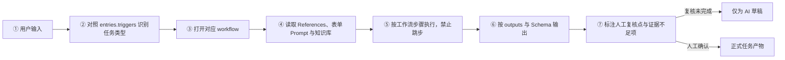

# TestPilot 项目说明文档

> **整理日期**：2026-10-04
> **适用范围**：TestPilot 当前 main 分支（v1.0.0）
> **资料来源**：本文档整合自原根目录 `README.md` 与 `design/`、`docs/` 目录下的需求、设计、手册类文档（用户操作手册、AI 工作流升级需求、知识库解析与双向服务方案、部署验证记录、交互原型）。上述原始文档已删除，本文档为唯一保留的项目综合说明；各章末尾的「出处」为指向已删除原文档的溯源标注。

---

## 目录

1. 项目概述
2. 技术架构与实现概览
3. 环境与部署
4. 功能模块说明
5. 知识库专题
6. 设计演进与升级规划
7. 常见问题与已知行为
8. 附录：资料索引

---

## 1. 项目概述

### 1.1 产品定位

TestPilot 是面向个人测试工程师的**本地测试工作台**（黄色主题）。所有数据保存在本机 MySQL 数据库（首次启动自动创建 `testpilot` 库），默认仅本机可访问，不上传云端。

它把日常测试工作收敛为一条主线：

> **发起任务 → 自动识别与路由 → 按流程执行 → 人工复核 → 沉淀知识 → 生成报告**

### 1.2 能力总览

| 模块 | 一句话说明 |
| --- | --- |
| 工作台首页 | 质量态势指标、快捷入口、数据资产与最近任务 |
| AI 测试助手 | 一句话发起完整测试分析，自动识别主任务与辅助任务并顺序执行 |
| 执行记录 | 保存原始输入、路由、逐步轨迹、证据、缺项与人工复核结论 |
| 用例库 | 按项目/模块/子模块组织用例，支持新增、导出、批量操作 |
| Bug 分析 | 定位现象、证据和回归范围的专项分析 |
| 日志分析 | 还原调用链与异常节点 |
| SQL 分析 | 检查 SQL 正确性、性能与一致性 |
| 回归测试 | 从高风险用例与历史缺陷生成可执行清单，并在线维护执行状态 |
| 测试报告 | 汇总多来源形成统一质量结论，可导出 Markdown / PDF |
| 知识库 | 可编辑、版本化、带引用保护的经验沉淀，供分析任务检索 |
| 工作台编排 | 配置 7 个标准入口的触发词、必填项、知识映射与工作流 |
| 案例验证 | 用固定 walkthrough 回归路由顺序与安全规则 |
| 配置中心 | 三级模块、大模型厂商、输出格式模板与关联规则 |

### 1.3 AI 使用边界（工作原则）

- 证据不足时**明确提示缺什么**，不编造结论；
- 不虚构知识标题或 Bug 编号；
- **AI 不做上线批准**，P0/P1 与 Prompt 测试结果必须人工复核；
- 任务识别、路由、步骤、输入、证据与复核结论全程可追溯。

> 出处：README.md、docs/用户操作手册.md 第 1 章

---

## 2. 技术架构与实现概览

### 2.1 技术栈

| 层 | 选型 |
| --- | --- |
| 前端 | React 19 + TypeScript 7 + Vite 8，单页应用，无路由框架（`setPage` 状态切换）；图标 lucide-react，导出能力 jspdf（PDF）/ xlsx（Excel） |
| 后端 | Node.js 原生 HTTP 服务（无 Web 框架），REST API |
| 数据层 | MySQL 8.x（mysql2 连接池，启动时自动建库、建表、写种子数据） |
| 端口 | 服务端与前端统一使用 `3344` |

### 2.2 代码结构

| 文件 | 职责 |
| --- | --- |
| `server.mjs` | HTTP 服务与全部 REST API、建库建表、种子数据、单项分析 LLM 调用（`/api/ai/analyze`）、知识库 CRUD 与审核 |
| `workbench-api.mjs` | AI 工作台引擎：7 个标准入口定义（`ENTRY_DEFS`）、路由判定、工作流执行、案例验证 |
| `db.mjs` | MySQL 访问层（导出 `createDb()`，提供 `one/all/run/exec/end` 五个异步助手，首次启动自动 `CREATE DATABASE IF NOT EXISTS testpilot`） |
| `src/main.tsx` | 主应用 UI：工作台首页、Bug/日志/SQL 分析、用例库、知识库、回归、报告、配置中心 |
| `src/workbench.tsx` | AI 助手、执行记录、工作台编排、案例验证四个页面 |
| `scripts/deploy.mjs` | 一键部署脚本（检查环境 → 安装 → 构建 → 启动） |

### 2.3 AI 执行链路（固定 7 步）



输入完整度校验发生在链路第一步；缺少核心字段时进入"证据不足项/需补充信息"，不得跳过后直接给根因。

### 2.4 多入口顺序调度

同一输入可命中多个入口（如"支付成功但订单未支付 + lock wait timeout + 支付回调改动"同时命中 Bug、日志、SQL、回归），系统按以下规则调度：

1. 展示命中入口、命中依据与置信度，禁止不可解释的分类结果；
2. **主任务只保留一个**，其余为辅助任务，可取消误命中项；
3. 按 `dispatch.multi_route_policy: sequential_when_matched` 与 `default_order` 顺序执行（联动案例固定顺序：Bug 分析 → 日志排查 → SQL 分析 → 回归清单）；
4. 上一步的结构化产物传递给下一步，下步缺项单独提示；
5. 每个子任务独立保存、重试、审核和追溯。

> 出处：design/2026-08-ai-workflow-upgrade/requirements.md 第 2 节

---

## 3. 环境与部署

### 3.1 环境要求

- **Node.js 24 LTS 或更高版本**（含 npm）：<https://nodejs.org/>
- **MySQL 8.x**：本机数据库服务。默认连接 `127.0.0.1:3306`（root / 空密码），可通过环境变量 `DB_HOST` / `DB_PORT` / `DB_USER` / `DB_PASSWORD` / `DB_NAME` 覆盖。
- 操作系统：Windows / macOS；浏览器：Edge、Chrome 等现代浏览器。

### 3.2 启动与访问

将项目下载并完整解压到当前用户可写的文件夹后再运行，不要直接在压缩包中运行。

| 方式 | 操作 | 适用场景 |
| --- | --- | --- |
| Windows 一键启动 | 双击 `start.bat` | 日常使用 |
| macOS 一键启动 | 双击 `start.command` 或 `启动 TestPilot.command` | 日常使用 |
| 终端通用启动 | 项目目录执行 `npm run deploy` | 任意系统 |

一键启动会自动完成：检查环境（Node / MySQL / 端口）→ `npm ci` 安装锁定依赖 → TypeScript 校验并构建到 `dist` → 启动生产服务 → 打开浏览器。

```bash
npm start        # 已安装依赖并构建后，离线直接启动
npm run dev      # 开发模式（同样运行在 3344 端口）
npm run check    # 开发校验：TypeScript 类型检查
npm run build    # 生产构建
```

- 访问地址：<http://127.0.0.1:3344>，服务保留终端窗口运行，停止按 `Ctrl+C` 或关闭窗口；
- 端口冲突时设置 `PORT` 环境变量后启动；
- 安装、构建、启动失败的原因会显示在终端并写入 `logs/deploy.log`。

### 3.3 数据与安全

| 项目 | 说明 |
| --- | --- |
| 数据库 | 本机 MySQL 8.x（默认库名 `testpilot`，自动创建）；更新代码不影响数据，**请勿删库** |
| data 文件夹 | 保存 API Key 密文与导出的 JSON 备份，更新或重装时一并保留 |
| API Key | Windows 使用当前用户 DPAPI 加密存至 `data/keys`，macOS 使用钥匙串；不写入数据库明文。**加密文件不能跨用户/跨电脑解密，换机后需重新配置** |
| 访问范围 | 仅本机 `127.0.0.1:3344`，默认局域网不可访问 |

备份建议：`mysqldump` 定期导出 `testpilot` 库（最完整）；复制 `data` 文件夹；用例库 JSON 导出、回归清单 XLSX 导出、报告 Markdown/PDF 导出可作轻量归档。

### 3.4 旧版数据迁移

- **SQLite → MySQL**：从旧版（SQLite 单文件）升级时，保留 `data/testpilot.sqlite`，执行 `node scripts/migrate-sqlite-to-mysql.mjs` 导入历史数据（幂等，可重复运行，原文件保留不动）。
- **浏览器 localStorage → MySQL**：旧版浏览器数据在首次进入时自动弹窗，可选择"备份并迁移到数据库"（先在本机生成只读 JSON 备份至 `data/backups`，再导入 MySQL，重复操作不产生重复数据）。

### 3.5 部署实现要点

- macOS 两个 `.command` 与 Windows `start.bat` 统一进入 `scripts/deploy.mjs`，`server-runtime.mjs` 为兼容入口；
- 每次一键启动都会校验安装与构建（需可访问 npm 软件源）；已构建后可 `npm start` 离线启动；
- 密钥文件与日志不入库（不提交 git）；pnpm 的 core-js 构建许可占位值为 false，文档统一采用 npm；
- 生产构建存在前端包体积警告，不影响构建和访问。

> 出处：README.md、docs/用户操作手册.md 第 2/15/16 章、docs/deployment-review.md

---

## 4. 功能模块说明

### 4.1 主界面与工作台首页

工作台首页是应用**默认入口页**（导航编号 01），回答一个问题："今天从哪里开始？"。它是整个测试工作流的**态势总览仪表盘**：监控质量态势指标、充当任务发起的枢纽、提供数据资产概览与最近动态查看。

主界面分为三个区域：左侧导航（13 个模块：工作台首页 / AI 测试助手 / 执行记录 / 用例库 / Bug 分析 / 日志分析 / SQL 分析 / 回归测试 / 测试报告 / 知识库 / 工作台编排 / 案例验证 / 配置中心）、顶部操作栏（提供「维护知识」「新建任务」快捷跳转）与内容区；导航栏底部显示本机数据库连接状态。


#### 页面结构（自上而下）

| 区域 | 内容 |
| --- | --- |
| 欢迎区（Hero） | 问候语（当前为静态英文演示文案，中文动态化方案见 6.15）与副标题，右侧「创建智能任务」按钮直达 AI 测试助手 |
| 六张指标卡 | 待补充、待审核、执行中、阻塞、高风险、不可上线，快速了解当前质量态势 |
| 快捷入口（左栏） | 6 张卡片：生成测试用例、Bug 分析、日志分析、SQL 分析、生成回归清单、生成测试报告，点击直达对应页面 |
| 数据资产（右栏） | 测试用例、任务记录、知识条目、测试报告四类数据的 MySQL 实时统计，点击数字区域跳转对应模块（「任务记录」卡为全类型任务总数、点击落到 Bug 分析页，口径注明方案见 6.15） |
| 最近任务表 | 最近 5 条任务（任务/类型/模块/风险/审核/更新时间），点击任意行打开详情抽屉，可执行提交审核 / 审核通过 / 驳回 |

#### 使用方式

- 启动应用访问 <http://127.0.0.1:3344> 后**自动进入首页**，也可点击左侧导航「01 工作台首页」；
- 点击「创建智能任务」→ 进入 AI 测试助手发起新分析；
- 点击快捷卡片 → 直达对应功能页；点击数据资产数字 → 跳转对应模块；
- 点击最近任务行 → 右侧滑出详情抽屉，查看输入、分析结果并执行审核操作。

#### 实现要点（前端 React + 后端 Node 原生 HTTP + MySQL）

- **前端**（`src/main.tsx`）：应用无路由框架，`App` 组件以 `useState<PageKey>('dashboard')` 持有当前页，`dashboard` 为初始值，故启动即首页；`Dashboard` 组件挂载时请求最近任务（取 20 条中前 5 条）并渲染全部区块。指标卡数值分两类：**动态计算**（待审核 = 最近任务中 `reviewStatus==='待审核'` 的数量；高风险 = `risk==='P0'` 的数量）与**静态演示值**（待补充=2、执行中=1、阻塞=1、不可上线=0，见 7.2 已知行为；真实统计改造方案见 6.3）。快捷入口来自 `TASK_META` 常量（同时定义 6 类任务的标题/描述/必填项），点击映射为页面 key 后 `setPage()` 切换；表格行点击触发 `setDrawer({type:'task'})` 打开通用详情抽屉。
- **API 层**（`server.mjs`）：首页仅消费两个 GET 接口——`GET /api/bootstrap` 对每张资源表执行 `COUNT(*)`，返回 `counts`（数据资产计数）+ `modules` + `providers`，应用启动时调用一次作为全局状态；`GET /api/tasks?pageSize=20` 走通用 `listResource`，按 `updated_at DESC` 分页查询，`mapRow` 负责 snake_case→camelCase 字段转换、JSON 字段解析与模块标签拼接。
- **数据层**（MySQL `testpilot` 库）：`tasks` 表是最近任务列表与待审核/高风险指标的数据源；`cases`/`knowledge`/`reports` 等表是数据资产计数来源。

数据流：

```text
打开 127.0.0.1:3344
  → GET /api/bootstrap（资产计数/模块/模型配置，全局状态）
  → Dashboard 挂载 → GET /api/tasks?pageSize=20（最近任务）
  → 渲染：指标卡（动态+演示值）/ 快捷入口（TASK_META）/ 数据资产（counts）/ 最近任务表格
  → 用户点击 → setPage 切换页面 / setDrawer 打开详情抽屉
```

### 4.2 AI 测试助手（核心功能）

把"一段材料"变成"一组按顺序执行的分析任务"，是使用频率最高的入口。

**发起任务**：页面由可选任务入口（7 个标准入口：测试用例生成、Bug 分析、日志排查、SQL 分析、回归清单、测试报告、Prompt 测试）、智能输入（项目/模块/子模块 + 整段材料粘贴，支持"载入支付异常示例"与"载入 Prompt 测试示例"两个示例按钮）、文本附件上传（白名单 .txt/.log/.sql/.md/.json/.csv，单个 ≤200KB，可移除；"附件参与分析"开关默认开启，开启时每文件前 8KB 随材料送入模型）、两个操作按钮（**识别任务与缺项** / **按流程执行**）四部分组成。不勾选入口时交给系统自动识别，勾选则执行指定任务。勾选 Prompt 测试时出现测试集选择栏：不使用测试集则按材料中【被测 Prompt】结构逐样例解析（解析失败退化为文本评审），也可下拉选用测试集并新建/编辑——测试集含被测 Prompt、预期输出 Schema 与 ≤10 个样例，执行时逐样例真运行并按 5 种规则机器判定（做实方案与实施记录见 6.16）。

**识别与预检**：点击"识别任务与缺项"后，右侧面板展示路由列表（含主/辅助任务角色与信息完整度百分比）、缺少必要信息清单；缺项时不猜测根因，可生成待补充记录。


**按流程执行**：按固定顺序完成全部路由后生成执行结果卡片——执行 ID、路由页签（主/辅助任务）、每路由分块结构化输出（含知识引用范围与 JSON 结果；结构校验未通过的路由显示黄色徽标，悬停可见缺失项；Prompt 测试路由在 JSON 前额外展示逐样例真运行对照表：样例/输入/预期/实际输出/机器判定/差异说明六列与通过率，判定由规则产生、不可被模型更改）、人工复核栏（逐项复核勾选 + 可选复核备注 + **确认通过** / **驳回补充**；P0 记录确认时二次确认；命中 Prompt 测试时复核必选）。页面底部固定显示全局安全规则。


**后续去向**：每次执行写入执行记录；复核通过后，可在执行结果卡片将事实类路由（Bug 分析 / 日志排查 / SQL 分析 / 回归清单）的输出**沉淀为知识**（生成待审核知识，需在知识库中审核发布，来源追溯 `runId#路由ID`）；Bug/日志/SQL 分析任务审核通过后也可在任务详情**申请入知识库**。用例生成路由的「存入用例库」与知识沉淀扩展方案见 6.5；测试报告路由的「存入测试报告」出口方案见 6.10.7。

### 4.3 执行记录

回答"这次分析到底执行了什么、结论是什么、谁复核过"。列表支持按标题/原始输入搜索、状态筛选（待补充/待复核/已完成）、导出当前页 JSON；详情抽屉包含执行结果卡片（可在此逐项勾选复核项、填写备注并直接复核，未勾完时服务端拒绝通过，复核通过后可将事实类路由输出沉淀为知识，已沉淀路由显示"已沉淀 → 待审核"，支持导出 Markdown 存档）与逐步执行轨迹（每步的路由、真实起止时间与状态；本地兜底的路由在步骤说明中标注原因）。

### 4.4 工作台编排

维护 7 个标准入口的"运行配置"，即父子任务结构（组合任务）的自定义全链路。每个入口可编辑四类配置（每行一项）：

| 配置项 | 说明 |
| --- | --- |
| 触发词 | 命中该入口的关键词 |
| 必填信息 | 执行前必须提供的信息，缺失时提示补充 |
| 知识库引用映射 | 该入口检索哪些知识库分类 |
| 工作流步骤 | 严格按顺序执行的步骤清单 |

发布规则：点击「保存并发布新版本」后版本号自动递增（v1 → v2）；**知识库事实不复制到工作台**；历史执行记录保留当时快照。

### 4.5 案例验证

在发布工作台资产前做回归：用固定 walkthrough（完整材料）验证路由顺序与安全规则。每个案例卡片包含完整材料、预期检查（预期路由与必须规则）、运行按钮；运行后显示"验证通过/失败"及实际路由顺序（如 `bug_analysis → log_triage → sql_analysis → regression_list`）。

### 4.6 用例库

按"项目 → 模块 → 子模块"三级组织。支持关键词/模块/优先级筛选、模块树点击筛选、导出 XLSX 与 JSON 备份、批量操作（生成回归、生成报告、下载 CSV 等）、新增用例（标题、测试步骤、预期结果必填）、详情抽屉（徽标、关联 Bug、复制用例等操作）。「新增 / 智能生成」页签的 AI 智能生成能力方案见 6.5。

### 4.7 Bug / 日志 / SQL 三类专项分析

三个分析页结构完全一致（新建分析 / 任务列表 / 已入库经验三个页签）：填写任务标题、模块与风险等级，粘贴问题上下文，右侧实时显示**输入完整度**评分与**输出结构预览**；点击开始分析后生成结构化结果，执行「提交审核 → 审核通过/驳回 → 申请入知识库」流转。

模型说明：系统优先调用已启用且已配置 Key 的大模型；未配置或调用失败时自动回退**本地规则**分析并明确提示，回退不影响流程。

### 4.8 回归测试

回归清单以卡片展示：进度环/条实时反映通过比例；每项可下拉更新执行状态（未执行/通过/失败/阻塞/跳过，立即保存）；底部统计通过/失败/阻塞数量；支持复制为 Markdown 待办、下载 XLSX；全部必选项完成后自动归档到「完成记录」页签。

### 4.9 测试报告

报告列表展示标题、项目/版本、覆盖模块、结论、失败/阻塞数；生成报告时左侧填写标题、发布版本与上线结论（可上线/有条件上线/不能上线），右侧勾选纳入报告的任务来源；详情包含醒目的上线结论、执行结果统计、风险与遗留问题列表，支持复制 Markdown、下载 .md 与 .pdf。报告项目名与 AI 叙述增强方案见 6.10；AI 助手「测试报告」结果直存报告库见 6.10.7。

### 4.10 配置中心

四个页签：

- **项目与模块**：三级模块树，子模块可停用/恢复（停用后不出现在新建表单下拉，历史数据不受影响），支持新增；
- **大模型**：OpenAI、通义千问、DeepSeek、自定义兼容模型的 Base URL / 模型名 / API Key / 温度 / 超时 / 最大输出配置，支持测试连接；未启用厂商不参与分析；
- **格式模板**：与 6 类任务对应的输出字段编辑，保存后历史记录同步显示新结构（新增字段显示"待补齐"，原始快照保留）；
- **关联规则**：只读展示每类任务自动检索的知识库分类映射。

> 出处：docs/用户操作手册.md 第 3-14 章；4.1 节工作台首页实现细节源自 src/main.tsx 与 server.mjs 代码调查

---

## 5. 知识库专题

### 5.1 定位与三大机制

知识库是 TestPilot 中**「AI 分析的事实来源」**，覆盖 7 大分类：历史 Bug 库、业务规则库、接口异常库、日志规律库、SQL 经验库、压测经验库、回归规则库（`KB_CATEGORIES`）。

| 机制 | 说明 |
| --- | --- |
| **审核门控** | 新知识默认「待审核」，只有**已发布**状态的知识才会被分析任务检索引用 |
| **版本化** | 每次编辑保存生成新版本（`version` 自增），历史可追溯 |
| **引用保护** | 已被下游引用的知识不能随意撤销（后端返回 409 并列出依赖来源），避免"抽掉地基" |

### 5.2 使用路径（5 条）

1. **新增知识**：页头「新增知识」→ 填写标题/分类/风险/模块/正文 → 保存并提交审核（进入待审核）；
2. **审核与发布**：详情抽屉中「审核通过并发布」→ 可被分析任务检索；
3. **编辑与升版**：「编辑内容」修改正文，「保存新版本」版本号递增；
4. **撤销入库**：已发布知识可撤销；被引用时撤销被阻止（409 + 依赖清单），需先解除引用；
5. **申请入知识库（反向沉淀）**：Bug/日志/SQL 任务审核通过后点击「申请入知识库」，自动生成待审核知识（`source_task_id` 指向原任务，分类按任务类型自动映射），分析页「已入库经验」页签可查看已发布知识卡片。

### 5.3 实现结构（前端 React + 后端 Node 原生 HTTP + MySQL）

**数据层**（`server.mjs`）：

- `knowledge` 表：`id, title, category, module_id(外键→modules), risk(默认P1), status(待审核/已发布/已驳回/已撤销), version, content, source_task_id(来源追溯), review_note, created_at, updated_at`；
- `relations` 表（引用保护的基石）：`source_type/source_id → target_type/target_id + label + active`，任何实体引用知识时插入一条 `target_type='knowledge'` 记录。

**API 层**：

| 端点 | 行为 |
| --- | --- |
| `GET /api/knowledge` | 通用 listResource：搜索、category/status/module_id 筛选、分页 |
| `GET /api/knowledge/:id` | 详情，额外查 relations 计算 `dependencies` 与 `referenceCount` |
| `POST /api/knowledge` | 新建，强制 `status='待审核'`、`version=1`，写审计日志 |
| `PATCH /api/knowledge/:id` | `action='approve'`→已发布 / `'reject'`→已驳回 / `'withdraw'`→有 active 引用时 409 + dependencies；编辑则 version+1 |

**前端 UI 层**（`src/main.tsx`）：`KnowledgePage`（列表与指标卡）、`KnowledgeModal`（新增弹窗）、`DetailDrawer`（详情抽屉：引用次数、关联影响、编辑升版、审核发布、撤销入库）、`KnowledgeExperience`（分析页已入库经验）、`RelationSettings`（配置中心任务↔知识分类映射）。

### 5.4 与 AI 工作流的集成

知识库的"消费端"在 `workbench-api.mjs`：7 个标准入口各自声明 `knowledge` 引用映射（存于 `workbench_assets.knowledge_json`，可在工作台编排页自定义，修改后版本递增）：

| 入口 | 引用知识分类 |
| --- | --- |
| `bug_analysis` | 历史 Bug 库、日志规律库、SQL 经验库、业务规则库 |
| `log_triage` | 日志规律库、历史 Bug 库 |
| `sql_analysis` | SQL 经验库、压测经验库 |
| `regression_list` | 回归规则库、历史 Bug 库 |
| `test_report` | 业务规则库、历史 Bug 库、回归规则库 |
| `testcase_gen` | 业务规则库、接口异常库、历史 Bug 库 |

执行工作流时，路由引用的知识分类记入 `workflow_runs.evidence_json`，保留当时快照。

关键设计原则：**「知识库事实不复制到工作台」**——工作台只维护引用映射，事实始终以知识库中「已发布」版本为准，避免双份数据不一致。

### 5.5 数据闭环

```
分析任务(审核通过) ──申请入知识库──▶ knowledge表(待审核)
                                        │ 人工审核
                                        ▼
                                   knowledge表(已发布)
                                        │ 被工作流入口按分类检索
                                        ▼
                              AI分析任务输出 + relations表记录引用
                                        │ 引用保护(409)
                                        ▼
                                   撤销/编辑受控
```

一句话总结：知识库通过**「审核门控 + 版本化 + relations 引用保护」**三大机制，为 AI 分析提供可信、可追溯、不可被悄悄篡改的事实来源。

> 出处：docs/知识库功能解析.md

---

## 6. 设计演进与升级规划

### 6.1 AI 测试助手与工作流升级（2026-08，已确认，核心功能已实现）

#### 6.1.1 背景

升级前 TestPilot 的 AI 能力以"进入单项页面 → 输入文本 → 返回结果"方式工作，只依赖长 Prompt 存在明显问题：同一输入被不同模型解释为不同任务、多项任务被合并成一段回答、表单缺项时模型补造信息、Prompt/工作流/输出格式散落不同步、分析过程无法说明加载了什么规则与知识、AI 输出未经复核即被误认为正式结论。

升级目标：把文件化能力（`workbench.yaml` + `workflows/` 等）映射为页面能力，让 TestPilot 从"多个 AI 工具入口"升级为"**有入口路由、有固定步骤、有业务知识、有机器校验、有人工门禁的测试调度器**"。

#### 6.1.2 核心设计结论

**① 知识库与工作台必须分离**：

| 领域 | 负责内容 | 不应包含 |
| --- | --- | --- |
| 知识库 | 已验证的业务事实与历史经验（历史 Bug、支付规则、回归规则） | Prompt、任务步骤、输出格式 |
| 工作台资产 | 测试助手如何完成任务（入口路由、表单、工作流、Prompt、Schema） | 未审核的业务事实 |
| References 方法库 | 如何识别、匹配和排查（模块映射、日志关键词、历史 Bug 匹配方法） | 历史 Bug 正文副本 |

**② 固定 7 步执行链路**（见 2.3 节）；**③ 多入口按顺序调度**（见 2.4 节）；**④ 文件资产映射为平台能力**：`workbench.yaml`→入口路由、`system/`→全局规则、`workflows/`→可视化步骤、`forms/`→输入表单、`prompts/`→Prompt 资产、`outputs/`+`schemas/`→输出模板与机器校验、`references/`→方法库、`examples/`→案例验证素材。

#### 6.1.3 信息架构

```text
AI 测试助手：发起任务 / 执行记录 / 组合任务 / 案例验证
工作台编排：入口路由 / 全局规则 / 工作流 / 输入表单 / Prompt / 输出模板 / Schema / References / Examples
知识库（独立入口）：历史 Bug / 业务规则 / 接口异常 / 日志规律 / SQL 经验 / 压测经验 / 回归规则
```

#### 6.1.4 功能需求摘要（FR-01 ~ FR-13）

| 编号 | 需求 | 要点 |
| --- | --- | --- |
| FR-01 | AI 测试助手首页 | 统一智能输入区、入口卡片、自动识别+手工勾选、最近执行与待复核展示 |
| FR-02 | 入口路由 | 7 个入口 ID（`testcase_gen`/`bug_analysis`/`log_triage`/`sql_analysis`/`regression_list`/`test_report`/`prompt_test`），关键词/正则触发，必须展示命中原因 |
| FR-03 | 全局规则 | 禁止跳步、禁止无证据确认根因、禁止虚构知识、AI 不批上线、风险 P0–P3（SQL 分析用 P0–P2）、规则修改需版本与验证 |
| FR-04 | 输入表单 | 字段必填/条件必填/脱敏提示、整段文本自动拆解、缺失面板（阻塞/建议补充）、缺核心字段禁止完整分析 |
| FR-05 | 工作流编排 | 有序步骤（必选/可选/条件/人工节点）、版本绑定任务快照；Bug/日志/SQL/回归各有固定步骤，回归必须项 ≥6 |
| FR-06 | Prompt 资产 | 系统规则+工作流+References+知识检索+表单变量组装、变量检查与 Token 预估、修改后须案例验证 |
| FR-07 | 输出模板与 Schema | 模板与 Schema 成对同步校验；`bug_output` 必须含 10 个字段；多入口章节顺序固定 |
| FR-08 | References 方法库 | 只保存方法与索引，不复制知识正文；执行详情显示实际加载项 |
| FR-09 | 知识库检索 | 按入口配置知识分类与召回数、只用已发布知识、无命中显式声明、任务保存知识版本快照 |
| FR-10 | 执行详情与证据链 | 六区域：输入、路由命中、时间线、加载的规则/知识、模型与 Schema 校验、人工复核 |
| FR-11 | 人工复核门禁 | 复核项默认未勾选、P0/资金/订单结论额外确认、未复核=「AI 草稿」、上线结论由人选择 |
| FR-12 | 案例验证沙箱 | 官方示例+自建案例、草稿配置试跑、修改前后对比、发布前必跑案例 |
| FR-13 | 配置发布与版本 | 资产五状态（草稿→待验证→可发布→已发布→已停用）、发布生成不可变"工作台版本包"、支持回滚配置不回滚历史任务 |

#### 6.1.5 状态与风险规则

- 任务状态：草稿 → 待预检 → 待补充 → 可执行 → 执行中 → 待复核 → 已确认 → 已完成（异常：阻塞/执行失败/已取消）；
- 步骤状态：未开始、等待输入、执行中、已完成、Schema 失败、等待人工、阻塞、已跳过；
- 结论等级：P0（资金/订单状态/严重数据一致性/核心链路不可用）、P1（主要功能不可用）、P2（局部功能有替代方案）、P3（低影响体验项）。风险规则可给出最低等级，AI 不得擅自降低强制风险。

#### 6.1.6 与现有功能的兼容方案

现有「快捷任务」升级为 AI 测试助手统一输入；Bug/日志/SQL 独立页面保留为强制指定入口的快捷方式；「全链路任务」升级为联动工作流管理与运行记录；「格式模板」扩展为输出模板 + Schema 配对；「关联规则」扩展为入口路由与知识/References 范围；知识库继续只管理事实；旧任务可查看不强制迁移，新任务走新执行链路。

#### 6.1.7 验收标准（要点）

7 个入口 ID 与教程一致且可正确进入；支付异常输入识别 `bug_analysis` 为主任务并解释命中原因；多入口顺序执行不合并输出；Bug 缺环境/复现步骤明确阻塞；每步展示加载的总规则/工作流/References/Prompt/知识/Schema；知识库无结果不生成虚假标题；Bug 输出含 10 个必填字段；SQL 无 EXPLAIN 不武断要求加索引；回归必须项 ≥6；复核未完成不能生成正式结论或发布知识；P0 与 Prompt"通过"必须人工终审；历史任务始终使用当时版本包。

#### 6.1.8 建议分期

| 阶段 | 内容 |
| --- | --- |
| Phase 1 可配置执行骨架 | 入口路由、表单完整度、顺序工作流、执行详情、人工复核、版本快照 |
| Phase 2 资产编排中心 | 全局规则、Prompt、输出模板/Schema、References、发布与回滚 |
| Phase 3 案例验证与质量度量 | 案例沙箱、断言对比、配置回归、路由准确率、Schema 通过率、人工修改率 |

#### 6.1.9 原型

升级评审阶段曾提供可点击原型（AI 测试助手、执行记录、工作台编排、案例验证四页面），仅展示交互方向，不连接模型、不保存数据、不修改正式配置。原型与预览图已随设计文档一并删除，交互流程以本文档 2.3、2.4、4.2、4.4、4.5 节的描述为准。

> 出处：design/2026-08-ai-workflow-upgrade/requirements.md、README.md（均已删除，内容已整合）

### 6.2 知识库双向服务实现方案（设计文档，未实施）

#### 6.2.1 已确认决策与现状事实

| 决策点 | 结论 |
| --- | --- |
| 检索路线 | 向量语义检索（embedding + 应用层余弦，BLOB 存向量），不引入向量库 |
| AI 测试助手接模型 | 包含，分阶段（阶段一单项分析注入，阶段二助手逐路由调模型） |
| AI 起草知识草稿 | 包含（AI 预填草稿，状态固定「待审核」，人工审核后才发布） |

代码调查发现的关键现状（全项目当前 AI 与知识库尚未打通）：

- 全项目唯一 LLM 调用点是 `/api/ai/analyze`，Prompt 中无任何知识内容；
- AI 测试助手输出全部由 `buildOutput()` 本地模板生成，不调模型、不查 knowledge 表；
- knowledge 表仅被列表/详情两处查询，全部服务于前端渲染；
- 证据链只记录知识**分类名**字符串；分类白名单存在双源不一致（`RelationSettings` 与 `ENTRY_DEFS`）；
- 回归清单"生成"是空壳（无 API 调用）；用例"智能生成"名不副实（纯手工表单）；报告生成是前端确定性拼装。

#### 6.2.2 目标架构

```text
写入侧：人工审核通过/AI起草(待审核) ─▶ knowledge(已发布) ─触发嵌入─▶ knowledge_embeddings(新)
检索枢纽：knowledge-retrieval.mjs —— L1 语义 → L2 关键词 → L3 空结果显式声明
消费侧：单项分析(M2) / 助手runs(M3) / 用例·回归·报告(M4) / 语义搜索·输入联想·影响分析(人侧)
追溯：retrieval_hits(新, 软引用) + evidence_json(条目级快照)
闭环：AI起草知识草稿(M5) ─▶ 待审核 ─人工─▶ 已发布
```

架构原则：事实留在知识库；工作台 `knowledge_json` 只维护分类白名单（统一单一来源，消除双源漂移）；检索服务是唯一读取知识的通道。

#### 6.2.3 设计红线（R1–R8）

| # | 红线 |
| --- | --- |
| R1 | 只检索已发布知识（所有检索 SQL 强制 `status='已发布'`） |
| R2 | AI 不发布、不修改知识（AI 产物只能以待审核入库，审核动作仅人工触发） |
| R3 | 不编造知识标题/Bug 编号（Prompt 硬约束 → Schema 校验 → 未命中显式声明，三层防线） |
| R4 | API Key 不入库、不进快照 |
| R5 | 历史快照不可篡改（run/task 保存"知识标题@版本@相似度"快照） |
| R6 | 模型不可用不得伪造成功（降级路径全部显式标注） |
| R7 | AI 引用不锁死知识库（软引用 `retrieval_hits` 可追溯不阻塞撤销；硬引用 `relations` 才触发 409） |
| R8 | 知识事实不复制到工作台 |

#### 6.2.4 数据模型概要

- 新表 `knowledge_embeddings`：知识向量（`kb_id + kb_version + chunk_text + vector(BLOB) + vector_model + dim + status`）；向量以 Float32Array 序列化为 BLOB，检索时 JOIN 条件含 `kb_version=k.version`——知识升版未重嵌入时宁可检索不到，也不用旧向量代表新内容；
- 新表 `retrieval_hits`：AI 检索命中记录（run 类型/ID、kb 版本、相似度、引用片段），用于影响分析、审计与案例验证断言，**明确不参与撤销保护**；
- `providers` 表加 `purpose` 列（`chat`/`embedding`）——DeepSeek 官方无 embeddings 端点，需要隔离；seed 追加 OpenAI 兼容嵌入模型；
- 现有 `knowledge`/`relations`/`workbench_assets` 表零改动；`validation_cases` 加 `expected_knowledge_json` 列。

#### 6.2.5 检索与降级设计

检索服务 `knowledge-retrieval.mjs` 核心接口：`embedKnowledge` / `retrieveKnowledge` / `findSimilar`（AI 起草查重用，阈值 0.90）/ `reembedAll`。

| 情况 | mode | 前端展示 |
| --- | --- | --- |
| 语义正常有命中 | `semantic` | 「语义命中 N 条」+相似度 |
| 语义正常无命中 | `semantic`（hits 空） | **「未找到已发布知识」**，不得静默 |
| embedding 不可用→关键词命中 | `keyword` | 黄色提示「关键词降级命中」 |
| 关键词也无命中 | `none` | 「未找到已发布知识（关键词模式）」 |

嵌入触发：人工审核发布、编辑升版、撤销/驳回、迁移导入、检索时懒补偿、手动重嵌、换模型全量重嵌入；嵌入为 fire-and-forget，失败不影响业务操作（置 pending 兜底）。

#### 6.2.6 里程碑拆解

| 里程碑 | 内容 | 要点 |
| --- | --- | --- |
| M1 检索基础设施 | 两张新表 + 检索模块 + 5 个检索端点 + 人侧 UI（语义搜索、嵌入状态、影响分析） | 约占 60% 工作量，其余里程碑的地基 |
| M2 单项分析注入 | `/api/ai/analyze` 注入检索命中的知识 + hits 透传落库 + 引用卡片展示 | Prompt 注入《知识标题》(分类, v版本, 相似度) |
| M3 助手接模型 | 逐路由"检索→调模型→容错链"，risk 取正则与模型的较高者，总预算 180s | 模型失败单路由兜底，落库时机与响应模式保持现状 |
| M4 四入口扩展 | 用例 AI 起草、回归清单从零建（`POST /api/regressions`，必回归 ≥6 服务端保底）、报告 AI 增强章节（**数字统计保持确定性**，AI 绝不参与计数；落地设计见 6.10，助手结果直存见 6.10.7）、案例验证知识断言 | 报告数字确定性是最高优先红线 |
| M5 AI 起草闭环 | 审核通过的任务「AI 起草知识」：查重（≥0.90 建议升版）→ 起草 → 待审核 → 人工发布 | AI 全流程无发布权限 |

实施顺序：M1 →（M2 ∥ M3）→ M4 → M5，每个里程碑独立可交付、可验收、可单独回滚。测试策略为引入 vitest（项目此前无测试框架），单元测试覆盖点积计算、BLOB 序列化 roundtrip、降级链、risk 合并、Prompt 快照等 10 项，集成测试覆盖容错链三路径等 4 项。

> 出处：docs/知识库双向服务实现方案.md（状态：设计文档，未实施）

### 6.3 工作台首页指标卡真实统计（方案，未实施）

#### 6.3.1 背景与现状

首页六张指标卡当前为半演示状态：待补充/执行中/阻塞/不可上线四张为写死的演示值；待审核/高风险虽为动态计算，但仅基于最近任务切片（`GET /api/tasks?pageSize=20` 结果的前 5 条）计算，非全表统计。演示值不随数据变化，无法反映真实质量态势（见 7.2 已知行为）。

#### 6.3.2 指标口径定义（已确认）

| 卡片 | 统计口径 | 说明 |
| --- | --- | --- |
| 待补充 | `tasks WHERE status='待补充'` 全表计数 | 审核驳回动作的落地状态，对应副文案"缺少必要信息" |
| 待审核 | `tasks WHERE status='待审核'` 全表计数 | 替代现有"最近 20 条内 reviewStatus 计算"；统一以 status 字段为准，原因见 6.3.4 |
| 执行中 | `tasks WHERE status='执行中'` + `regressions WHERE status='执行中'` | 组合任务父任务 + 进行中的回归清单，对应副文案"回归与全链路" |
| 阻塞 | `tasks WHERE status='阻塞'` 全表计数 | 任务状态族成员（报告生成 blocked 统计同源），对应"需要优先处理" |
| 高风险 | `tasks WHERE risk='P0'` + `cases WHERE priority='P0' AND archived=0` | 任务与用例全表统计，对应"P0 任务与用例"；用例需排除已归档 |
| 不可上线 | 最新一份 `reports`（`created_at DESC LIMIT 1`）`verdict='不能上线'` 时为 1，否则 0 | "当前质量结论"语义，取值 0/1 |

#### 6.3.3 接口与前端设计（已确认新增独立接口）

**`GET /api/dashboard/metrics`**（`server.mjs` 的 `handleApi` 新增分支）：

```json
{ "metrics": { "pendingInput": 0, "pendingReview": 1, "running": 1, "blocked": 0, "highRisk": 3, "notLaunchable": 0 } }
```

实现要点：六项均为单条 `COUNT(*)` / `LIMIT 1` 查询，一次请求内执行后组装返回；不改动现有 `/api/bootstrap`（其 `counts` 继续承载数据资产统计）。

**前端**（`src/main.tsx` `Dashboard` 组件）：挂载时以 `API.request('/dashboard/metrics')` 获取指标并替换六张卡的演示值/切片计算值；卡片标签、副文案、配色与整体布局不变；最近任务表格的加载逻辑保持现状。

**刷新时机**：指标在每次进入首页（Dashboard 挂载）时刷新；可选增强——在详情抽屉的任务审核动作（提交/通过/驳回）成功后触发指标重取，使首页数值即时更新。

#### 6.3.4 现状一致性问题（附带发现）

创建分析任务时后端写入 `status='待审核'` 但 `review_status` 固定为'未提交'（`POST /api/tasks` 硬编码），仅当用户在详情抽屉点"提交审核"后两者才同步。原卡片按 reviewStatus 统计会漏掉"创建即待复核"的任务；本方案统一按 `status` 统计后首页指标不再受影响，但建议后续实施时将创建动作的 `review_status` 同步为'待审核'（可选修正，不属于本方案必须项）。

#### 6.3.5 验收标准（种子数据基线）

| 卡片 | 预期值 | 依据 |
| --- | --- | --- |
| 待补充 | 0 | 无 status='待补充' 的任务 |
| 待审核 | 1 | task_sql_001 |
| 执行中 | 1 | reg_001（回归清单执行中；无执行中任务） |
| 阻塞 | 0 | 无 status='阻塞' 的任务 |
| 高风险 | 3 | task_bug_001（P0 任务）+ case_001 / case_004（P0 用例） |
| 不可上线 | 0 | 最新报告 report_001 结论为"有条件上线" |

另需验证：驳回一个任务后"待补充"+1；生成 verdict='不能上线' 的新报告后"不可上线"=1；全部数值不再出现固定演示值。

#### 6.3.6 实施范围与文档回写

实施范围仅两处：`server.mjs`（新增接口分支）、`src/main.tsx`（Dashboard 指标来源替换）。完成后需回写本文档：4.1 节"实现要点"更新指标来源描述、7.2 已知行为删除"演示占位值"条目、6.3 节标注"已实施"。

> 出处：本文档新增方案（2026-10-03），口径经使用者确认（执行中=任务+回归清单、高风险=任务+用例全表、不可上线=最新报告 0/1、独立接口）；现状分析基于 src/main.tsx 与 server.mjs 代码调查。

### 6.4 执行记录功能补全设计方案（已实施，2026-10-03）

#### 6.4.1 背景与问题清单

对"执行记录"（`workflow_runs` / `workflow_run_steps`，实现集中于 `workbench-api.mjs` 与 `src/workbench.tsx`）逐行核对后确认：核心链路（创建 / 列表搜索筛选分页 / 详情 / 人工复核 / 状态流转 / 证据快照与 `retrieval_hits` 软引用）真实完整。以下 8 项为未完成、预留或简化实现：

| 编号 | 问题 | 类型 | 代码证据 |
| --- | --- | --- | --- |
| U1 | 4.2 节承诺"复核通过的任务可**申请入知识库**"，执行记录侧无此入口（"申请入知识库"按钮仅存在于 Bug/日志/SQL 分析任务抽屉 `src/main.tsx`，走 `tasks` 流程） | 承诺未兑现 | RunResult 复核栏仅有「确认通过 / 驳回补充」两按钮 |
| U2 | 复核备注 `note` 后端已支持，前端未开放输入，备注恒为默认文案 | 半成品 | PATCH /runs/:id 支持 note；前端 `review()` 只传 action |
| U3 | AI 助手执行完成后左侧"执行前检查"面板路由名称可能为空（7.2 已知行为） | 缺陷 | `execute()` 成功后 `setPreflight(run)`，run.routes 为字符串数组而预检面板渲染期望对象数组 |
| U4 | 复核门禁勾选未实现：`review_json.checks` 仅存档不交互，无逐项确认，P0/P1 无额外确认，未复核未标注"AI 草稿"（FR-11 部分未落地） | 设计简化 | 创建 run 时 checks 硬编码四项 |
| U5 | 输出仅校验"是合法 JSON 对象"，无字段级 Schema 校验（FR-07 部分未落地）；`OUTPUT_SCHEMAS` 为中文描述文本，不可机读，Prompt 描述与校验规则双源 | 设计简化 | `callModel()` |
| U6 | 逐步执行轨迹为事后补记：步骤 `status` 硬编码"已完成"、`started_at=completed_at` 同一时间戳；路由模型调用实为 `Promise.all` 并行，与 `sequential_when_matched` 策略名不符；模型失败为整体 502 阻断，与 6.2.6 M3 已确认的"模型失败单路由兜底"不符 | 设计简化 + 决策偏差 | POST /runs 执行与步骤写入段 |
| U7 | 附件仅有"附件入口已预留"文案，无上传入口；`input_json.attachments` 恒为空数组 | 预留未完成 | AssistantPage 智能输入区 |
| U8 | 执行记录无导出、无删除；全项目后端无任何 DELETE 端点 | 能力缺失 / 取舍待定 | 全仓 `DELETE` 零命中 |

#### 6.4.2 设计原则（延续既有红线与决策）

- **同步一次性落库不破坏**：所有增强保持"HTTP 同步返回完整 run、执行过程在内存完成、成功才落库"，不新增"执行中"状态与轮询（沿用 6.2 已确认决策；异步化 + 进度查询仅作远期升级路径，触发条件见该决策记录）。
- **R2（AI 不发布）、R5（历史快照不可篡改）、R6（不伪造成功）、R7（AI 引用为软引用）继续有效**。
- **最小侵入**：优先复用既有端点与组件（RunResult、POST /api/knowledge）；不改 `workflow_runs.status` 枚举（待补充/待复核/已完成），存量数据零迁移、DDL 零改动。
- **显式化**：机器校验失败、模型降级、预算耗尽兜底，一律在结果与轨迹中显式标注，不得静默（R6）。

#### 6.4.3 第一批：快速修复（U3、U2）——已实施（2026-10-03）

**U3 预检面板空白路由修复**

- 改动：`AssistantPage.execute()` 成功回调中移除 `setPreflight(r)`，仅保留 `setRun(r)`。识别与执行两态分离：预检面板只由「识别任务与缺项」刷新，执行结果由下方 RunResult 卡片完整呈现。
- 验收：载入示例 → 识别 → 执行，左侧面板不出现空白路由行，回到空态引导文案。

**U2 复核备注开放**

- 前端：RunResult 复核栏新增备注输入（textarea，可选，≤200 字）；`review(action)` 改为 `patch(\`/runs/${run.id}\`, { action, note: note || undefined })`。
- 后端：零改动（PATCH 已支持 note，空值沿用默认文案"人工确认通过"/"请补充证据"）。
- 验收：填写的备注存入 `review_json.note` 并在详情回显；不填时行为与现状一致。

#### 6.4.4 第二批：知识沉淀闭环（U1）——已实施（2026-10-03）

**目标**：执行记录**人工复核通过后**，可把单个路由的结构化输出沉淀为待审核知识，走知识库既有"人工审核 → 发布"链路。与 6.2 M5"AI 自动起草"不重叠：本项由人工点击触发，AI 产物仍只能以待审核入库（R2）。

**数据模型**：`knowledge` 表零改动。`source_task_id` 扩展取值约定：分析任务来源存任务 id（现状不变）；执行记录来源存 `runId#routeId` 复合值（如 `run_31d4e0dc#bug_analysis`），可反拆。

**接口**：

- 复用 `POST /api/knowledge`（已强制 `status='待审核'`、`version=1`、写审计日志）；
- `GET /api/workbench/runs/:id` 响应扩展 `knowledgeLinks: { [routeId]: knowledgeId }`：`getRun()` 追加一次 `SELECT id, source_task_id FROM knowledge WHERE source_task_id LIKE ?`（参数 `runId#%`），供前端"已沉淀"标记。表小、前缀过滤，无需新端点与索引。

**前端（RunResult）**：

- 每个 `wb-output` 路由卡片头部新增「沉淀为知识」按钮：仅 `run.status==='已完成'` 且该路由未沉淀时可用；已沉淀置灰显示"已沉淀 → 知识库待审核"；
- 点击弹出沉淀表单：分类预填（入口映射：`bug_analysis`→历史 Bug 库、`log_triage`→日志规律库、`sql_analysis`→SQL 经验库、`regression_list`→回归规则库）、标题预填 `run.title · 路由名`、风险预填该路由 `risk_level`、正文预填"来源头（run id / 路由 / 模型）+ 该路由 sections 的 pretty JSON"，均可编辑；提交后刷新 `knowledgeLinks`。
- **决策点 D1**：默认仅开放上述 4 个"事实类"路由的沉淀入口（与知识库 7 分类语义最贴合）；`testcase_gen` / `test_report` / `prompt_test` 输出属过程产物，默认隐藏按钮。如需全开放，补全映射常量即可。

**验收**：支付异常示例执行 → 人工确认通过 → Bug 分析卡片沉淀 → 知识库出现待审核知识（来源可追溯）→ 审核发布后分析页"已入库经验"可见；未复核通过的记录不显示按钮；同一路由不可重复沉淀。

#### 6.4.5 第三批：复核门禁与输出校验（U4、U5）——已实施（2026-10-03）

> 实施说明（与设计稿的差异）：① `OUTPUT_SCHEMAS` 结构化定义实际为 `{字段: {type, label}}`（全部字段必填，未引入可选 `required` 标志，缺省/空值即计为 missing）；② 徽标文案为"结构校验未通过"，缺失项与类型错误明细悬停可见；③ review.checks 追加项文案为"存在输出结构校验未通过的路由，请重点复核"；④ 勾选状态落库含 `checkedAt`（勾选时间），取消勾选置空。

**U4 复核门禁勾选（FR-11 补全）**

- 数据：`review_json.checks` 升级为 `[{item, checked, checkedAt}]`；读取端兼容旧字符串数组（视为全部未勾选）。
- 后端 PATCH /runs/:id：接收 `checks`；`action='approve'` 且 `review.required=true` 时**服务端强校验**全部 checked，否则 400 `{error:'存在未确认的复核项'}`（不依赖前端禁用）；reject 不要求勾选。
- 前端：复核栏逐项渲染勾选框（默认未勾选）+ U2 备注输入；「确认通过」在存在未勾项时禁用；`risk==='P0'` 时追加 `confirm()` 二次确认。
- 展示别名（**决策点 D2**，推荐采纳）：`status` 枚举不变，列表"复核"列与详情在 `review.status==='待复核'` 时显示"待复核 · AI 草稿"，落实 FR-11"未复核 = AI 草稿"语义而不破坏筛选器与既有数据。
- 验收：未勾完无法通过（直调接口同样被拒）；勾选状态与时间落库；P0 有二次确认。

**U5 输出 Schema 机器校验（FR-07 补全）**

- 单源化：`OUTPUT_SCHEMAS` 升级为结构化定义 `{字段: {type:'string'|'string[]', required, label}}`，`systemPrompt()` 的字段说明由该结构生成（消除"Prompt 描述"与"校验规则"双源漂移）。
- 校验器：`validateOutput(routeId, parsed)` 返回 `{passed, missing[], typeErrors[]}`，在 `callModel()` 成功后执行。
- 失败处理（R6：显式不静默、不阻断）：写入 `result.sections[id]._schema_check`；前端结果卡片头部显示"结构校验未通过（缺 X、Y）"黄色徽标；创建 run 时若存在未通过路由，向 `review.checks` 追加一项"输出结构不完整，重点复核"。
- 范围界定：仅覆盖 workbench 7 入口的 `OUTPUT_SCHEMAS`，不与配置中心"格式模板"（`tasks` 流程）联动；两者统一列为后续独立事项。
- 验收：构造缺字段 / 错类型的模型返回可检出并显式标注；正常输出行为无感知变化。

#### 6.4.6 第四批：执行链路增强（U6、U7）——已实施（2026-10-03）

> 实施说明（与设计稿的差异）：① 附件读取用 `File.text()`（`FileReader.readAsText` 的 Promise 等价 API），零依赖不变；② 兜底路由的 `workflow_run_steps` 步骤 note 写入"本地兜底：{原因}"，status 仍为"已完成"，时间窗为该路由的尝试/判定时刻；③ 全部路由失败时 502 错误信息聚合了各路由的失败原因；④ 证据汇总追加"兜底：{路由}（{原因}）"条目。

**U6 逐步执行轨迹真实化 + 单路由兜底**

- 执行模式：POST /runs 内 `Promise.all` 并行调用改为 `for...of` 串行逐路由执行（与 `sequential_when_matched` 策略语义对齐），逐路由记录 `startedAt / completedAt / durationMs`（内存）；全部结束后一次性落库——同步决策不变，不新增"执行中"态。
- 步骤写入：每路由的 workflow 步骤沿用该路由真实时间窗（步骤内部不伪造逐条时间）；`status` 仍为"已完成"，但时间戳不再同值，详情"逐步执行轨迹"呈现真实先后与耗时。
- 总预算与降级（落实 6.2.6 M3 已确认决策，修正现状整体 502 阻断）：单路由超时 clamp [5,30] 秒、全路由总预算 180 秒；预算耗尽后剩余路由不再调模型，走本地模板兜底输出，`routeSummary` 对应路由标注 `degraded: true` 与原因，结果卡片黄色徽标"本地兜底输出"；单路由模型失败同样单路由兜底（全部路由失败仍返回 502 且不落库）。
- **决策点 D3**：串行化后总等待 ≈ 各路由耗时之和（最坏 7×30s=210s，超 180s 预算部分走兜底；浏览器 fetch 无默认超时，可接受）。如不可接受，备选为保持并行 + 仅补耗时统计（"真实时序"降级为"批次窗口 + 顺序展示"）。**推荐串行**。
- 验收：同一 run 步骤时间戳呈现真实先后与耗时；模拟某路由模型超时，仅该路由降级标注、其余正常、记录照常落库。

**U7 附件上传（文本类）**

- 方案（零新依赖、不引入 multipart 解析）：前端 `FileReader.readAsText` 读取文本类附件（扩展名白名单 `.txt/.log/.sql/.md/.json/.csv`，单文件 ≤200KB），以 `{name, size, content}` 随 POST /runs 请求体 `attachments` 提交；后端现有 `input_json.attachments` 字段原样落库，零表改动。二进制类型前端直接提示"仅支持文本类附件"。
- 参与分析（**决策点 D4**，推荐参与）：组装 user 消息时按 `--- 附件：{name} ---` + 内容前 8KB 拼接，防止 token 失控；输入区提供"附件参与分析"开关（默认开）。
- 展示：执行结果卡片上方新增附件 chips；详情抽屉可折叠查看附件全文；保留"敏感日志请脱敏"提示文案。
- 验收：选择 .log 文件执行后，记录详情可查看附件名与内容；超限文件被拒；不选附件时行为与现状一致。

#### 6.4.7 U8 导出与删除：能力边界——已实施（2026-10-03）

- **导出（做）**：详情抽屉加「导出 Markdown」（输入 / 路由结果 / 复核 / 轨迹 / 证据汇总，前端拼装下载，对齐测试报告页导出先例）；列表工具栏加「导出当前页 JSON」。
- **删除（明确不做）**：全项目无 DELETE 是刻意设计（本地审计价值 + R5 快照不可篡改）；删除会产生 `retrieval_hits` 孤儿软引用、削弱影响分析能力。重议条件：单库体积影响本机使用，或出现合规删除需求时，再设计"级联清理 runs + steps + hits"的维护动作（须确认对话框，不进常规 UI）。

#### 6.4.8 实施顺序、验收基线与文档回写

| 批次 | 内容 | 预估 | 改动面 |
| --- | --- | --- | --- |
| 1 | U3 修复、U2 备注 | 0.5 天 | `src/workbench.tsx` |
| 2 | U1 沉淀闭环 | 1 天 | `src/workbench.tsx` + `workbench-api.mjs`（getRun 扩展） |
| 3 | U4 勾选、U5 Schema | 1~2 天 | `workbench-api.mjs` + `src/workbench.tsx` |
| 4 | U6 串行+计时+兜底、U7 附件、U8 导出 | 2~3 天 | `workbench-api.mjs` + `src/workbench.tsx` |

- 验收基线：`npm run check`（tsc --noEmit）通过；支付异常示例 walkthrough（识别 → 执行 → 勾选复核 → 备注 → 沉淀 → 知识库审核发布）全程可走通；每批完成后人工回归列表 / 详情 / 复核主链路。
- 文档回写（仿 6.3.6）：每批实施后——7.2 已知行为删除 / 更新对应条目（U3 对应"AI 助手"行、U7 对应附件行）；4.2"后续去向"与 4.3 节补全新能力描述；本节标注"已实施（第 N 批）"。

> 出处：本文档新增方案（2026-10-03），基于 `src/workbench.tsx`、`workbench-api.mjs`、`knowledge-retrieval.mjs`、`src/main.tsx` 与本文档 4.2 / 4.3 / 6.1 / 6.2 / 7.2 逐行核对产出；含 D1~D4 四个待确认决策点，确认后按批次实施。

### 6.5 用例智能生成与知识沉淀闭环（方案，未实施）

#### 6.5.1 背景与现状梳理

「测试用例生成」是 AI 测试助手 7 个标准入口之一（`testcase_gen`）。以下为逐行核对后的完整现状（用户使用方式 / AI 生成原理 / 请求链路），作为本节方案的现状依据。

**（一）用户如何使用此功能**

该功能有两个同名入口——真实 AI 入口在「AI 测试助手」页（下述 1~7）；用例库的「新增 / 智能生成」页签为占位入口，现状只支持手工录入（见下文问题 1）。真实入口的操作路径（前置条件 → 选择入口 → 填写材料 → 识别缺项 → 按流程执行 → 复核）：

1. **前置条件**：到「配置中心 → 大模型」启用一个对话模型（用途 `chat`）并配置 API Key；否则助手页的「按流程执行」按钮被禁用，右侧显示"未配置可用的对话模型"警告。
2. **选择入口**：进入「AI 测试助手」页，在"可选任务入口"网格中勾选**测试用例生成**；也可以不勾选——只要输入文本含 `需求 / 验收 / 用例 / 场景 / 测试点` 等触发词就会被自动识别命中。
3. **填写智能输入**：项目 / 模块 / 子模块下拉、分析模型下拉（自动或指定）、大文本框粘贴需求背景与验收标准（该入口必填项）、可选上传文本类附件（`.txt/.log/.sql/.md/.json/.csv`，≤200KB，开启"附件参与分析"时每文件前 8KB 送入模型）。
4. **点击「识别任务与缺项」**（`POST /api/workbench/preflight`）：右侧面板显示命中的路由清单（主任务 / 辅助任务角色、信息完整度百分比）、缺少的必要信息（用例生成即"需求背景、验收标准"两个字段的规则判定）。
5. **点击「按流程执行」**（`POST /api/workbench/runs`）：按路由顺序依次执行，真实调用大模型 + 知识检索。
6. **查看结果**（`RunResult` 组件）：结果卡片显示执行 ID、风险等级、状态、使用的模型名；每路由一个分块，以 JSON 展示输出（用例生成路由的结构为"覆盖维度 / 用例结构 / 生成建议"加通用字段），并显示"加载知识（semantic/keyword）：标题（v版本）"或"未检索到相关知识（未虚构）"。
7. **人工复核**：勾选复核项后点「确认通过」，或「驳回补充」（P0 记录确认时二次弹窗）；可「导出 Markdown」存档整个执行记录。

**（二）项目是如何用 AI 生成测试用例的**

核心逻辑在 `workbench-api.mjs` 的 `POST /runs` 处理器，完整链路为"路由 → 知识检索（RAG）→ Prompt 组装 → OpenAI 兼容接口调用 → 校验 → 落库"：

① **选模型**：优先用请求指定的 `providerId`（必须 `enabled=1` 且 `purpose='chat'`），否则自动取第一个"已启用 + 已配 Key + chat 用途"的模型；Key 从加密存储（Windows DPAPI / macOS 钥匙串）读出。无可用模型直接 400 阻断。

② **知识检索（RAG 注入事实）**：`testcase_gen` 声明的知识分类是「业务规则库、接口异常库、历史 Bug 库」，调用 `knowledge-retrieval.mjs` 做三级降级检索：

- **semantic（向量）**：用 `purpose='embedding'` 的模型把需求和知识向量化，余弦相似度 ≥0.3 取 Top5；embedding 按 `updated_at` 判过期、批量 16 条自动补齐；
- **keyword（降级）**：向量不可用时，中文 2~3 字 n-gram 滑窗 + 英文词 token 匹配，标题命中 ×3、正文 ×1，取 Top5；
- **none**：都没命中则显式告知"未检索到相关知识"，并禁止模型虚构。

③ **Prompt 组装**（`systemPrompt`）：system 消息 = 角色声明 + 所属模块 + 工作流步骤（校验输入 → 拆解测试点 → 覆盖正常 / 异常 / 边界 → 生成结构化用例 → 标记人工复核）+ 已发布知识事实列表（`[分类] 标题（v版本，风险）：摘要`）+ 安全规则（不猜测根因、不编造知识标题 / Bug 编号、P0/P1 必须人工复核）+ 强制的输出 JSON 字段结构；user 消息 = 用户原始输入 + 附件内容。

④ **模型调用**（`callModel`）：`POST {baseUrl}/chat/completions`（Bearer Key，temperature / max_tokens / 超时来自配置，超时钳制在 5~30 秒），解析 `choices[0].message.content`，剥离 markdown 代码块围栏后必须能解析为 JSON 对象，否则抛错。

⑤ **输出约束与校验**：
- 输出 Schema 固定为 `{coverage（覆盖维度）, case_format（用例结构）, suggestions（生成建议）}`（三者均为 string[]）加通用字段（`OUTPUT_SCHEMAS`），由 `validateOutput` 逐字段校验缺失 / 类型，未通过的路由打上 `_schema_check` 徽标提示重点复核；
- **风险单向取高**：正则初判 P0/P1/P2 后，模型返回的 `risk_level` 只能升不能降（RANK 比较）；
- **失败策略**（既定决策）：全部路由调用失败 → 502 阻断且不落库；部分失败 → 该路由输出"本地兜底输出"文案并标注 `degraded`；整体 180 秒预算兜底。

⑥ **落库与复盘**：执行记录写入 `workflow_runs`（结果快照、证据链 `evidence_json` 含"知识标题@v版本（检索方法 得分）"）、`workflow_run_steps`（每条工作流步骤的执行轨迹）、`retrieval_hits`（检索命中软引用快照）。

**（三）代码是怎么实现此功能的（请求链路）**

```text
用户点击「按流程执行」
 → src/workbench.tsx execute()            POST /api/workbench/runs {text, moduleId, selectedRoutes, providerId, attachments}
 → server.mjs handleApi()                 parts[1]==='workbench' → 交给 workbench.handle()
 → workbench-api.mjs POST /runs
     ├─ 选 provider + 读加密 Key（providers 表 / scripts/provider-keys.mjs）
     ├─ routeText() 命中 testcase_gen + fieldPresent() 找缺项 + 正则初判 risk
     ├─ for 循环串行执行每个路由：
     │    options.retrieve(text, ['业务规则库','接口异常库','历史 Bug 库']) → knowledge-retrieval.mjs
     │    systemPrompt(...) → callModel(provider, key, messages) → 模型 API
     │    validateOutput() 校验 → 正常输出 / degraded 兜底标注
     ├─ 拼装 result：model 名、sections（各路由 JSON）、routeSummary（loadedKnowledge 条目级快照 + retrievalMethod）
     ├─ INSERT workflow_runs / retrieval_hits / workflow_run_steps
     └─ 返回 getRun(runId) → 前端 RunResult 渲染
```

关键落点：

- **前端**：`AssistantPage`（入口勾选、智能输入、识别 / 执行）、`RunResult`（结果展示、复核 `PATCH /runs/:id`、导出 Markdown）、`KnowledgeSink`（仅事实类路由的沉淀弹窗）；
- **后端**：`server.mjs` 只做委托，全部工作台逻辑在 `workbench-api.mjs`；知识检索独立在 `knowledge-retrieval.mjs`，经 `createWorkbench(db, {readProviderKey, retrieve, recordHits})` 注入（依赖倒置，便于测试）；
- **数据表**：`workbench_assets`（入口配置真源，可在「工作台编排」页修改触发词 / 必填项 / 知识映射 / 工作流并版本递增）、`workflow_runs`、`workflow_run_steps`、`retrieval_hits`、`knowledge_embeddings`；
- **运行时依赖**：MySQL（`db.mjs` 连接池），模型为任意 OpenAI 兼容接口（OpenAI / 通义千问 / DeepSeek）。

真实实现 vs 占位：AI 测试助手内的「测试用例生成」是完整的真实 AI 链路（2026-10 接入真实模型 + 知识检索，运行时自测 16/16 通过）；而「用例库新增页签的智能生成」为占位（即下述问题 1）、「回归页签的分析并生成按钮（只弹提示不发请求）」亦为占位（见 7.2）。

现状缺口共五项（2026-10-03 二次逐行核实，与首次归档结论一致并扩充）：

| # | 缺口 | 证据（源码定位） |
| --- | --- | --- |
| 1 | 模型不产出逐条结构化用例：输出 Schema 仅 coverage / case_format / suggestions 三个 string[] 字段，属"覆盖维度 / 用例结构 / 生成建议"层面的指导性内容，无法直接入库 | `workbench-api.mjs` `OUTPUT_SCHEMAS.testcase_gen` |
| 2 | 用例库「新增 / 智能生成」页签名不副实：页签只渲染手工 `CaseEditor`，无任何 AI 逻辑 | `src/main.tsx` `CasesPage` 的 `tab==='new'` 分支 |
| 3 | 执行结果无出口：`SINK_ROUTES` 仅登记 4 个事实类路由，`testcase_gen` 既无「沉淀为知识」按钮，也无「存入用例库」通道——生成结果只能看，不能落为资产 | `src/workbench.tsx` `SINK_ROUTES`、`RunResult` |
| 4 | 无轻量生成端点：用例库场景若复用 `POST /runs` 会写 `workflow_runs`，轻量生成动作将污染执行记录 | `workbench-api.mjs` `handle()` 无 `cases/generate` 分支 |
| 5 | 来源追踪字段闲置：`cases.source_task_id` 列与 `POST /api/cases` 的 `sourceTaskId` 入参均已预留，但当前不存在任何写入该字段的代码路径（手工表单不传、种子数据为空），AI 生成 → 入库的溯源链路完全缺失 | `server.mjs` `cases` 表 DDL、`POST /api/cases` |

缺口 1~3 即下文问题 1 / 问题 2 的详细展开；缺口 4、5 分别由方案 A1（轻量端点不写 `workflow_runs`）、A4（零 DDL 激活 `source_task_id` 与 `content_json._meta`）针对性解决。

**问题 1：用例库「新增 / 智能生成」页签名不副实。** `CasesPage` 共三个页签（「用例库」「新增 / 智能生成」「执行记录」），其中「新增 / 智能生成」页签只渲染 `CaseEditor` 手工表单（标题 / 模块 / 优先级 / 类型 / 前置条件 / 步骤 / 预期结果 / 测试数据，保存即 `POST /api/cases`），全程无任何 AI 调用；`localAnalysis()` 的 cases 分支为死代码。页签名承诺的"智能生成"能力不存在（与 7.2 已知行为一致）。

**问题 2：用例生成结果没有「沉淀为知识」按钮（且无入库入口）。** `SINK_ROUTES` 仅登记 4 个事实类路由（bug_analysis / log_triage / sql_analysis / regression_list；执行记录补全决策 D1，见 6.4.4），`testcase_gen` 不在其中，执行结果卡片不显示沉淀按钮；同时 `OUTPUT_SCHEMAS.testcase_gen` 仅有 coverage（覆盖维度）/ case_format（用例结构）/ suggestions（生成建议）三个字段，不产出逐条结构化用例，无法入用例库，也没有「存入用例库」动作。

#### 6.5.2 已确认决策

| 编号 | 决策 | 说明 |
| --- | --- | --- |
| D1 | 用例库真实接入 AI 生成 | 「新增 / 智能生成」页签改为双模式（手工新增 / AI 智能生成），AI 模式复用助手模型链路（使用者已确认） |
| D2 | 生成结果预览编辑后勾选保存 | 生成不自动入库；逐条预览、内联编辑、勾选后仅保存选中项（使用者已确认） |
| D3 | 助手结果双出口 | `testcase_gen` 执行结果同时支持「存入用例库」与「沉淀为知识」（使用者已确认） |
| A1 | 统一复用助手体系 | 升级 `OUTPUT_SCHEMAS.testcase_gen` 为含 `cases` 数组；新增轻量端点 `POST /api/workbench/cases/generate` 供用例库调用；模型选择 / 知识检索 / systemPrompt / callModel / 校验一套逻辑两处共用；该端点不写 `workflow_runs`，避免轻量生成动作污染执行记录 |
| A2 | 沉淀默认分类 | 「业务规则库」（弹窗内可改） |
| A3 | 入库门禁 | 与既有知识沉淀同门禁：`run.status==='已完成'`（人工复核通过后产物方可入资产库，保持"AI 产物需人工确认"红线） |
| A4 | 零 DDL | 来源追踪复用 `cases.source_task_id`（助手来源 `${runId}#testcase_gen`）与 `content_json._meta`（source / model / generatedAt / runId / routeId），不新增表与列 |

> 与既有方案的关系：D3 是执行记录补全 D1 沉淀路由范围（4 个事实类路由，见 6.4.4）的扩展；整体方向与 6.2 里程碑 M4「用例 AI 起草」一致，本节为其轻量落地版（不含 M4 的完整四入口改造）。

#### 6.5.3 后端设计（`workbench-api.mjs`）

1. **Schema 升级**：`OUTPUT_SCHEMAS.testcase_gen` 的 `case_format` 替换为 `cases`（object[]，label 声明每条含 title / priority（P0|P1|P2）/ case_type（功能|接口|异常|回归）/ precondition / steps（字符串数组）/ expected / test_data）；coverage、suggestions 保留。
2. **Prompt 类型渲染**：`systemPrompt()` 类型渲染补 `object[]` 分支（渲染为"对象数组"），与结构化 Schema 单源保持一致。
3. **校验器扩展**：`validateOutput()` 新增 `object[]` 分支——元素须为对象；逐条校验 title / expected 非空、steps 为非空字符串数组，错误信息带"第 N 条"定位；`cases` 为空数组计入 missing。
4. **provider 选择抽取**：新增内部函数 `pickProvider(providerId)`（指定时校验 / 未指定取第一个 enabled + 已配置 Key + chat），`POST /runs` 与新端点共用。
5. **新端点 `POST /api/workbench/cases/generate`**：入参 `{text, moduleId?, providerId?}`；text 为空 → 400；无可用模型 / 无 Key → 400（复用既有提示文案）；知识分类从 `workbench_assets` 中 `testcase_gen` 的 `knowledge_json` 读取（单一事实源，与助手一致）；`retrieve → systemPrompt → callModel`；调用失败 → 502 明确报错且不写任何数据（不回退本地模板）；返回 `{model, retrievalMethod, loadedKnowledge, ...模型输出字段, notice?, generatedAt, _schema_check?}`（校验未通过时附 `_schema_check`）。
6. **入库状态回读**：`getRun()` 响应新增 `caseLinks: {[routeId]: 已入库条数}`（`SELECT source_task_id FROM cases WHERE source_task_id LIKE '${runId}#%'` 按路由聚合），供前端"已存入用例库（N 条）"状态展示。

#### 6.5.4 助手前端设计（`src/workbench.tsx`）

7. `SINK_ROUTES` 增加 `testcase_gen:{name:'测试用例生成',category:'业务规则库'}`——该路由自动出现「沉淀为知识」按钮（已沉淀后显示"已沉淀 → 待审核"，复用既有逻辑）。
8. `KnowledgeSink` 正文预填：`testcase_gen` 时精简为"来源行 + `{coverage, suggestions, risk_level, human_review_points}`"，避免把全部生成用例灌入知识正文。
9. **新增共享导出**（供用例库复用）：`casesToDrafts(section)`（模型输出 → 可编辑草稿；priority / caseType 越界兜底 P1 / 功能；steps 按行文本互转）、`CasePreview`（勾选 + 全选、内联编辑、title / steps / expected 必填校验提示的受控列表组件）、`saveCaseDrafts(drafts, opts)`（逐条串行 `POST /api/cases`；前端生成编号 `TC-AI<时间戳后 6 位><两位序号>`；`content._meta` 记录 source / model / generatedAt / runId? / routeId?；返回成功 / 失败明细）。
10. `RunResult`：`testcase_gen` 路由头部新增「存入用例库」按钮——门禁 `run.status==='已完成'`；`caseLinks` 已存在时禁用并显示"已存入用例库（N 条）"；该路由无 `cases`（历史记录 / 兜底输出）时禁用并提示"本次输出无可用用例"；点击打开 `CaseSink` 弹窗（`CasePreview` + 保存；来源 `sourceTaskId='${runId}#testcase_gen'`、`source='ai_assistant'`；保存成功后刷新 run 使按钮状态更新）。

#### 6.5.5 用例库前端设计（`src/main.tsx`）

11. 「新增 / 智能生成」页签改为双模式分段切换：「手工新增」（默认，保留 `CaseEditor` 原样）/「AI 智能生成」。
12. **新增 `CaseGenerator` 组件**：需求材料 textarea（placeholder 引导包含需求背景、业务规则、验收标准）+ 模块下拉 + 分析模型下拉（过滤 embedding 用途，默认自动）；无可用对话模型时禁用生成按钮并警告（复用助手"请到配置中心 → 大模型…"文案）；生成 → `POST workbench/cases/generate` → 展示模型 / 检索方法 / 加载知识（标题@版本）或"未检索到相关知识（未虚构）"；结果经 `CasePreview` 编辑勾选 → 「保存选中 N 条」→ `saveCaseDrafts({moduleId, source:'ai_generate'})` → 提示成功条数并跳回用例库列表刷新；`cases` 为空或校验未通过时展示对应警告态。
13. import 扩展：从 `./workbench` 引入 `CasePreview`、`saveCaseDrafts`、`casesToDrafts`。

#### 6.5.6 样式与测试计划

14. `styles.css`：新增用例预览卡片与双模式切换的少量样式（复用既有 `panel` / `field` / `button` / `badge` 风貌与黄色主题）。
15. **静态校验**：`node --check workbench-api.mjs`；`npm run check`；`npm run build`。
16. **后端自测**（临时脚本，跑完清理）：`cases/generate` 的 text 空 → 400、无可用模型 → 400、假模型 → 502 且无数据写入；`validateOutput` 的 `object[]` 分支（缺 title / steps / expected 定位"第 N 条"、空数组记 missing）；`getRun` 的 `caseLinks` 计数。
17. **真机回归**（需已配置 chat 模型）：用例库生成 → 编辑 → 勾选保存 → 列表 / 详情正确（编号唯一、`_meta` 完整）；助手执行 `testcase_gen` → 复核通过 →「存入用例库」（保存后变"已存入 N 条"）+「沉淀为知识」（正文为覆盖维度 / 建议，进入知识库待审核）。
18. **兼容回归**：其余 4 个事实类路由的沉淀按钮不受影响；历史 run（旧 JSON 无 `cases`）渲染兼容——入库按钮禁用、知识沉淀预填容错。

#### 6.5.7 假设与边界

- 运行前提：MySQL 已启动（`testpilot` 库）；本次仅 INSERT，无 DDL / 删除操作。
- 历史执行记录为 JSON 快照，Schema 升级不影响旧记录展示。
- 不新增生成条数控件（由材料与模型自行决定）；无可用模型时按既定决策报错阻断，不回退本地模板。
- 不在本次范围：单项分析 `/api/ai/analyze` 知识注入、回归清单 AI 生成等（见 6.2 里程碑 M4）。
- 实施完成后需回写本文档：4.2 补充双出口动作、4.6 与 7.2 更新用例库描述、本节标注"已实施"。

> 出处：本文档新增方案（2026-10-03），源自当次会话对 `src/main.tsx`、`src/workbench.tsx`、`workbench-api.mjs`、`server.mjs`、`knowledge-retrieval.mjs` 与本文档 4.2 / 4.6 / 6.4 / 7.2 的逐行核对；6.5.1 完整归档了对「测试用例生成」既有实现的功能解析（用户使用方式 / AI 生成原理 / 请求链路）；含使用者确认的 D1~D3 三项决策；状态：方案，未实施。
>
> 2026-10-03 复核归档：同日再次逐行核实全部结论未变（方案仍未实施）；本次将 6.5.1 的缺口梳理由两处扩为五项清单（新增缺口 4「无轻量端点」、缺口 5「来源追踪字段闲置」，各附源码定位与方案 A1 / A4 的对应关系），并在「用户如何使用」中补全双入口视角（真实 AI 入口 + 用例库占位页签）。

#### 6.5.8 补充方案：编辑升版 / 入库查重 / AI 来源标识（2026-10-03 追加，未实施）

对本节功能闭环的二次排查（逐行核对 `src/main.tsx` 的 `DetailDrawer` case 分支、`server.mjs` 的 `POST /api/cases` 与本节既有设计）确认：核心缺口已由 6.5.2~6.5.6 覆盖，尚有三处"未实现且无任何方案"的缺口（B1~B3），经使用者认可补全如下。三处均为**纯前端改动，零后端 / 零 DDL**；B1 可独立先行，B2 / B3 依赖 6.5 主体（`saveCaseDrafts` / `CasePreview` / `content_json._meta`）实施。

**缺口与决策**

| 编号 | 缺口（现状） | 证据（源码定位） | 决策 |
| --- | --- | --- | --- |
| B1 | AI 用例保存后无法修正：详情「编辑并升版」为死按钮（点击无反应）、「复制用例」仅弹提示 | `DetailDrawer` case 分支全部只读渲染，`editing` 条件渲染仅存在于 knowledge 分支，case 分支的 `setEditing(true)` 无对应 UI；后端 `PATCH /api/cases` 已支持 `version=version+1` | 做实编辑升版与复制（使用者已认可） |
| B2 | AI 批量生成入库无查重：模型对同一需求可能产出重复标题用例，静默重复入库 | 6.5 `saveCaseDrafts` 直接逐条 `POST /api/cases`；`POST /api/cases` 无同模块同题校验；既有查重方案 `findSimilar`（6.2 M5，阈值 0.90）属知识域且未实施 | 保存前软提示查重，不硬阻断（使用者已认可） |
| B3 | AI 来源标识不可见：6.5 仅约定溯源写入 `content_json._meta`（A4），列表 / 详情无任何展示设计，`_meta` 成死数据 | 6.5.3~6.5.7 无一条展示条目 | 列表徽标 + 详情来源行（使用者已认可） |

**B1 编辑升版与复制做实（`src/main.tsx`）**

19. **编辑态表单**：`DetailDrawer` case 分支补 `editing` 渲染——前置条件 / 测试步骤 / 预期结果 / 测试数据四个只读 section 换为受控表单（预填 `item.content`），标题 / 模块 / 优先级 / 用例类型一并放开编辑；控件与布局复用 `CaseEditor`（`Field` / `ModuleSelect` / `form-grid`）。
20. **按钮组切换**：非编辑态「复制用例 / 编辑并升版」→ 编辑态「保存新版本 / 取消」。
21. **保存**：前端必填校验（标题、步骤、预期结果，与 `CaseEditor` 同规则）→ `API.patch('cases', item.id, { title, moduleId, priority, caseType, content: { precondition, steps（按行拆数组）, expected, testData } })` → `setItem(next)` 刷新版本号 → `refresh()` 同步列表 → 提示"已升版至 v{next.version}"。
22. **溯源保持**：`content._meta` 存在（AI 生成用例）时原值保留并追加 `editedAt`；编辑不改 `status`（执行状态独立管理）。
23. **复制用例做实**（可选轻量项）：`POST /api/cases` 传新编号 `TC-C<时间戳后 6 位>`、title 加"副本"前缀、原 content 与模块 / 优先级 / 类型；成功后刷新列表并打开新用例详情（替换现状的仅提示）。
24. **验收**：编辑后版本号 +1、列表与详情同步；AI 用例编辑后 `_meta` 链完整（source / model / generatedAt 不变 + editedAt）；手工用例行为一致。

**B2 AI 生成入库查重（6.5 `saveCaseDrafts` 内部增强）**

25. **保存前查重**：对勾选草稿按 `moduleId` 调 `GET /api/cases?module_id=xx&pageSize=100`，按 `title === 草稿.title` 精确比对（LIKE 搜索结果前端再过滤，避免误伤）。
26. **命中处理**：`CasePreview` 对应条目显示"库中已有同题用例"警告徽标（title 属性展示已有用例编号）并**默认取消勾选**，使用者可重新勾选强制保存——同题不同前置 / 步骤属合法场景，判断权交人。
27. **成功提示区分**："已保存 N 条（其中 M 条与库中已有用例同题）"。
28. **边界**：仅标题精确匹配，不引入向量相似度（`findSimilar` 属知识域且未实施，用例域不引入 embedding 依赖）；跨模块不比对（同题异模块通常合法）。

**B3 AI 来源标识展示（6.5.4 / 6.5.5 的补充条目）**

29. **列表徽标**：用例列表「用例」列，`item.content?._meta?.source` 存在时 title 旁显示"AI"小徽标（title 属性提示"模型 xxx · 生成时间"，复用既有 badge 样式）。
30. **详情来源行**：`DetailGrid` 增加"来源"行——AI 生成显示"AI 智能生成（模型 xxx · 时间，入口：用例库 / 执行记录 runId）"；`_meta` 缺省（手工用例）不显示任何标识，历史数据零影响。

**测试与回写**

31. **静态校验**：`npm run check`（纯前端改动，无 `.mjs` 变更）。
32. **真机回归**：B1 编辑 / 复制全链路（含 AI 用例编辑后 `_meta` 检查）；B2 造同题数据验证警告徽标、默认取消勾选与强制保存路径；B3 依赖 6.5 实施后造 AI 用例验证徽标与来源行，手工用例无标识。
33. **兼容回归**：无 `_meta` 的历史用例列表 / 详情渲染不变；`PATCH` 升版不改 `status`；执行记录链路不受影响。
34. **实施完成后回写本文档**：7.2"用例库 · 详情"行删除对应条目、4.6 补充用例编辑描述、本节标注"已实施"。

> 出处：2026-10-03 追加；基于对 `src/main.tsx`（`DetailDrawer` case 分支与 `editing` 使用范围）、`server.mjs`（`POST /api/cases` 无查重）与本节既有设计的逐行核对；含使用者认可的三项决策 B1~B3；状态：方案，未实施。

### 6.6 Bug 分析功能解析与独立分析页知识注入（方案，未实施）

「Bug 分析」是 AI 测试助手 7 个标准入口之一（`bug_analysis`），同时在左侧导航保留独立专项分析页（`AnalysisPage`，走 `tasks` 流程）。两条链路的差别：助手路径为完整 AI 链路（真实模型 + 知识检索 + 复核门禁 + 知识沉淀）；独立页为简化链路（`/api/ai/analyze`，无知识检索，模型不可用时回退本地规则）。以下 6.6.1~6.6.3 为逐行核对后的完整现状归档（用户使用方式 / AI 分析原理 / 实现链路）；6.6.4 起为独立分析页知识注入方案设计（2026-10-03 追加，为 6.2.6 里程碑 M2「单项分析注入」的落地设计）。

#### 6.6.1 用户如何使用此功能

**入口一：AI 测试助手页**（`AssistantPage`，`src/workbench.tsx`；推荐路径）

1. **前置条件**：到「配置中心 → 大模型」启用一个对话模型（用途 `chat`）并配置 API Key；否则助手页的「按流程执行」按钮被禁用，右侧显示"未配置可用的对话模型"警告。
2. **选择入口**：在"可选任务入口"网格中勾选**Bug 分析**（`bug_analysis`）；也可不勾选——输入文本含 `bug / 缺陷 / 复现 / 实际结果 / 预期结果 / 报错 / 异常` 等触发词即自动命中；未命中任何入口时默认落入 `bug_analysis`。
3. **填写智能输入**：项目 / 模块 / 子模块下拉、分析模型下拉（自动或指定）、大文本框粘贴 Bug 现象 / 复现步骤 / 实际与预期结果 / 运行环境等材料；可选上传文本类附件（`.txt/.log/.sql/.md/.json/.csv`，≤200KB，开启"附件参与分析"时每文件前 8KB 送入模型）。
4. **点击「识别任务与缺项」**（`POST /api/workbench/preflight`）：右侧面板显示命中的路由清单（主任务 / 辅助任务角色、信息完整度百分比）与缺少的必要信息——Bug 分析必填项为"问题标题、复现步骤、实际结果、预期结果、环境"（正则规则判定）；缺项时只提示补充，不猜测根因。
5. **点击「按流程执行」**（`POST /api/workbench/runs`）：按路由顺序串行执行，真实调用大模型 + 知识检索。
6. **查看结果**（`RunResult` 组件）：结果卡片显示执行 ID、风险等级（P0/P1/P2）、状态、使用的模型名；Bug 分析路由以 JSON 展示结构化输出（问题现象概述 / 影响模块 / 可能原因 / 建议排查的日志方向 / 建议核查的 SQL 方向 / 历史 Bug 引用 / 建议回归范围，加通用字段），并显示"加载知识（semantic/keyword）：标题（v版本）"或"未检索到相关知识（未虚构）"；结构校验未通过、本地兜底的路由显示黄色徽标；可「导出 Markdown」存档。
7. **人工复核**：逐项勾选复核清单 + 可选备注 →「确认通过」（P0 记录二次确认弹窗）或「驳回补充」（回到"待补充"）。P0/P1 或命中 `prompt_test` 时为**必选复核**，清单未全部勾选时服务端拒绝通过。
8. **知识沉淀**：复核通过（`status='已完成'`）后，Bug 分析属事实类路由，卡片头部出现「沉淀为知识」按钮 → 弹窗预填标题 / 分类（历史 Bug 库）/ 风险 / 正文（来源头 + 该路由 JSON）→ 提交生成**待审核**知识（来源 `runId#bug_analysis`），经知识库人工审核发布后才进入后续检索；同一路由不可重复沉淀（6.4.4 已实施）。

**入口二：左侧导航「Bug 分析」独立页**（`AnalysisPage`，`src/main.tsx`）

新建分析 / 任务列表 / 已入库经验三个页签：填写任务标题、模块与风险等级，粘贴问题上下文（右侧实时显示输入完整度评分与输出结构预览），点击「开始分析」调用 `POST /api/ai/analyze`；模型未配置或调用失败时回退本地规则分析并明确提示（与 4.7 一致）。产物以 `tasks` 记录（状态"待审核"）进入"提交审核 → 审核通过/驳回 → 申请入知识库"流转；「已入库经验」页签对应「历史 Bug 库」已发布知识。该路径**未接入知识库检索**（对应 6.2 里程碑 M2「单项分析注入」，未实施）。

#### 6.6.2 项目是如何用 AI 做 Bug 分析的

核心逻辑在 `workbench-api.mjs` 的 `POST /runs` 处理器，完整链路为"路由 → 知识检索（RAG）→ Prompt 组装 → OpenAI 兼容接口调用 → 校验 → 落库"：

① **选模型**：优先用请求指定的 `providerId`（必须 `enabled=1` 且 `purpose='chat'`），否则自动取第一个"已启用 + 已配 Key + chat 用途"的模型；Key 从加密存储（Windows DPAPI / macOS 钥匙串）读出。无可用模型直接 400 阻断，不回退本地模板。

② **路由识别与缺项（规则判定，不调模型）**：`routeText()` 按触发词匹配路由；`fieldPresent()` 用正则检查 5 个必填项；风险先由正则初判（`生产 / 资损 / 重复扣款 / 数据丢失 / 安全` → P0；`失败 / 异常 / 超时 / 锁等待 / lock wait` → P1；其余 P2）。

③ **知识检索（RAG 注入事实）**：`bug_analysis` 声明的知识分类是「历史 Bug 库、日志规律库、SQL 经验库、业务规则库」，调用 `knowledge-retrieval.mjs` 做三级降级检索（仅 `status='已发布'`）：

- **semantic（向量）**：余弦相似度 ≥0.3 取 Top5；embedding 按 `updated_at` 判过期、批量 16 条自动补齐；
- **keyword（降级）**：中文 2~3 字 n-gram 滑窗 + 英文词 token 匹配，标题命中 ×3、正文 ×1，取 Top5；
- **none**：未命中则显式标注"未检索到相关知识"，并禁止模型虚构。

④ **Prompt 组装**（`systemPrompt`）：system 消息 = 角色声明（"只负责本任务，不复述其他任务"）+ 所属模块 + 工作流步骤（校验输入 → 描述现象 → 识别影响模块 → 给出日志方向 → 给出 SQL 方向 → 检索历史 Bug → 生成回归范围 → 判断风险 → 标记人工复核）+ 已发布知识事实列表（`[分类] 标题（v版本，风险）：摘要`；无命中时写入"禁止虚构知识标题或 Bug 编号"）+ 安全规则（证据不足不猜测根因、不编造知识标题 / Bug 编号、AI 不做上线批准、P0/P1 必须人工复核）+ 强制的输出 JSON 字段结构；user 消息 = 用户原始输入 + 附件内容（前 8KB）。

⑤ **模型调用**（`callModel`）：`POST {baseUrl}/chat/completions`（Bearer Key，temperature / max_tokens / 超时来自配置，超时钳制在 5~30 秒），解析 `choices[0].message.content`，剥离 markdown 代码块围栏后必须能解析为 JSON 对象，否则抛错。

⑥ **输出约束与校验**：

- 输出 Schema（`OUTPUT_SCHEMAS.bug_analysis`）为 7 个字段，由 `validateOutput` 逐字段校验缺失 / 类型，未通过的路由打上 `_schema_check` 徽标提示重点复核；
- **风险单向取高**：正则初判后，模型返回的 `risk_level` 只能升不能降（RANK 比较 P0>P1>P2）；
- **串行执行 + 总预算**：逐路由串行并记录真实起止时间，全路由总预算 180 秒；预算耗尽或单路由模型失败 → 该路由输出"本地兜底输出"文案并标注 `degraded`（原因显式）；**全部路由失败 → 502 阻断且不落库**。

⑦ **落库与复盘**：执行记录写入 `workflow_runs`（结果快照；状态按缺项落为"待补充"或"待复核"；证据链 `evidence_json` 含"模型：厂商 / 模型名"与"知识库：标题@v版本（检索方法 得分）"）、`workflow_run_steps`（9 个步骤的执行轨迹）、`retrieval_hits`（检索命中**软引用**快照——不写 `relations`、不阻塞知识撤销）。

⑧ **人工复核门禁**（`PATCH /api/workbench/runs/:id`）：`review.checks` 逐项勾选（含勾选时间）；`action='approve'` 且必选复核时服务端强校验全部已勾选，未完成返回 400，通过后状态置"已完成"；`action='reject'` → 状态回到"待补充"。

#### 6.6.3 代码是怎么实现此功能的（请求链路）

```text
用户点击「按流程执行」
 → src/workbench.tsx execute()            POST /api/workbench/runs {text, moduleId, selectedRoutes, providerId, attachments}
 → server.mjs handleApi()                 parts[1]==='workbench' → 交给 workbench.handle()
 → workbench-api.mjs POST /runs
     ├─ 选 provider + 读加密 Key（providers 表 / scripts/provider-keys.mjs）
     ├─ routeText() 命中 bug_analysis + fieldPresent() 找缺项 + 正则初判 risk
     ├─ for 循环串行执行每个路由：
     │    options.retrieve(text, ['历史 Bug 库','日志规律库','SQL 经验库','业务规则库']) → knowledge-retrieval.mjs
     │    systemPrompt(...) → callModel(provider, key, messages) → 模型 API
     │    validateOutput() 校验 → 正常输出 / degraded 兜底标注
     ├─ 拼装 result：model 名、sections（各路由 JSON）、routeSummary（loadedKnowledge 条目级快照 + retrievalMethod）
     ├─ INSERT workflow_runs / retrieval_hits / workflow_run_steps
     └─ 返回 getRun(runId) → 前端 RunResult 渲染
```

关键落点：

- **前端**：`AssistantPage`（入口勾选、智能输入、识别 / 执行）、`RunResult`（结果展示、复核、导出 Markdown、知识沉淀按钮）、`KnowledgeSink`（沉淀弹窗；`SINK_ROUTES` 登记 `bug_analysis` → 历史 Bug 库）；
- **后端**：`server.mjs` 只做委托（`/api/workbench/*` 交给 `workbench.handle()`）；独立分析页走 `server.mjs` 内联的 `POST /api/ai/analyze`（简化 Prompt：summary / risk / suggestions / missingFields，无知识检索）；知识检索独立在 `knowledge-retrieval.mjs`，经 `createWorkbench(db, {readProviderKey, retrieve, recordHits})` 注入（依赖倒置，便于测试）；`getRun()` 组装 `steps` 轨迹与 `knowledgeLinks`（已沉淀路由标记）供前端渲染；
- **数据表**：`workbench_assets`（入口配置真源，可在「工作台编排」页修改触发词 / 必填项 / 知识映射 / 工作流并版本递增）、`workflow_runs`、`workflow_run_steps`、`retrieval_hits`、`knowledge_embeddings`、`knowledge`（知识事实）、`providers`（`purpose` 列隔离 chat / embedding 用途）；
- **状态机**：`workflow_runs.status` = 待补充 / 待复核 / 已完成；`review.status` = 待复核 / 已复核 / 已驳回；`risk` = P0/P1/P2；`retrieval_hits.method` = semantic / keyword / none；
- **错误处理与兜底**：无可用模型 / 无 Key → 400 明确提示（指向配置中心）；单路由模型失败或预算耗尽 → 该路由本地兜底并显式标注（不静默）；全部路由失败 → 502 阻断且不落库；结构校验失败 → 徽标提示重点复核；
- **运行时依赖**：MySQL（`db.mjs` 连接池）；模型为任意 OpenAI 兼容接口（OpenAI / 通义千问 / DeepSeek）。

> 出处：本文档新增归档（2026-10-03），基于当次会话对 `src/main.tsx`、`src/workbench.tsx`、`workbench-api.mjs`、`knowledge-retrieval.mjs`、`server.mjs` 的逐行核对；采用与 6.5.1 相同的三段式结构（用户使用方式 / AI 原理 / 请求链路）。

#### 6.6.4 背景与已确认决策

「Bug 分析」独立页与日志、SQL 独立页共用同一简化链路（`src/main.tsx` 的 `AnalysisPage` → `POST /api/ai/analyze`）：system Prompt 固定为极简四字段（`summary / risk / suggestions / missingFields`），无知识检索。本方案为 6.2.6 里程碑 M2「单项分析注入」的落地设计（M2 定义：`/api/ai/analyze` 注入检索命中的知识 + hits 透传落库 + 引用卡片展示）：给独立分析页接入知识库检索（Prompt 注入已发布知识 + 结果引用展示 + 命中软引用落库），一处改造覆盖 Bug / 日志 / SQL 三页共用链路；模型失败回退策略、输出 Schema、任务审核流转均保持不变。

| 编号 | 决策 | 说明 |
| --- | --- | --- |
| D1 | 映射真源 = 工作台资产 | 检索分类从 `workbench_assets`（`bug_analysis` / `log_triage` / `sql_analysis` 的 `knowledge_json`）读取；配置中心「关联规则」展示同步改为读取同一真源，消除双源不一致（使用者已确认） |
| D2 | 命中快照 + 软引用登记 | hits 随任务 `result_json` 存档（标题@版本@得分快照）；`POST /api/tasks` 自动登记 `retrieval_hits`（`run_id`=任务 ID）；不写 `relations`，不阻塞知识撤销（R7；使用者已确认） |
| D3 | 失败策略保持现状 | 模型未配置 / 调用失败 → 回退本地规则并明确提示（4.7 描述不变）；检索无命中 / 不可用 → 显式声明"未检索到相关知识"，不阻断流程（使用者已确认） |
| D4 | 引用展示 = 任务抽屉区块 | 任务详情抽屉新增「引用知识」区块（标题 · v版本 · 分类 · 检索方法 · 得分）；未命中显示"未检索到相关知识（未虚构）"；任务生成提示语标注加载条数（使用者已确认） |

> 与既有方案的关系：本方案为 6.2.6 M2 的落地设计，与 6.5.3「知识分类从 `workbench_assets` 读取（单一事实源）」沿用同一原则；助手链路（`workbench-api.mjs`）与独立页链路（`server.mjs` 内联处理器）互不影响，本节改造仅限后者（现状见 6.6.3 关键落点）。

#### 6.6.5 后端设计（`server.mjs`）

1. **任务类型 → 入口映射**：新增常量 `ANALYSIS_ENTRY_MAP = {bug:'bug_analysis', logs:'log_triage', sql:'sql_analysis'}`；`/api/ai/analyze` 按 `d.taskType` 读取资产行 `SELECT name,knowledge_json FROM workbench_assets WHERE id=?`，一次取得中文任务名与知识分类数组（单一事实源）；资产行缺失（正常不可达）按空数组处理，检索自然返回 `none`，不阻断。
2. **检索接入**：在 provider 校验与 Key 读取通过后（确认即将真实调用模型）执行 `retrieval.retrieve(text, categories)`——复用 `server.mjs` 模块作用域的检索实例（`const retrieval = await createRetrieval(db, {readProviderKey})`，与助手链路同一个 `knowledge-retrieval.mjs`）；检索内部自吞异常、三级降级（仅 `status='已发布'`、Top5），任何失败不阻断模型调用（D3）。
3. **Prompt 组装**：system 消息升级为助手同款三段式（精简版）：角色声明（`你是 TestPilot 测试工作台的分析引擎，正在执行「{资产名}」任务`）+ 知识库事实列表（`- [分类] 标题（v版本，风险）：摘要`；无命中时写入"本次未检索到相关知识……禁止虚构知识标题或 Bug 编号"）+ 安全规则与输出字段声明；**输出保持现有四字段 JSON 结构不变（本方案不改独立页输出 Schema）**；user 消息维持 `${taskType}\n${text}`。
4. **响应扩展**：返回体新增 `retrieval:{method,hits[],notice?}`（条目级快照：id / title / category / version / risk / score / snippet，直接透传检索输出）；`provider / model / result` 保持不变（向后兼容）。
5. **软引用登记**：`POST /api/tasks` 插入任务后，若 `d.result.retrieval.hits` 非空则调用 `retrieval.recordHits(taskId, routeId, hits, method)`；`route_id` 记录映射后的入口 id（如 `bug_analysis`），与执行记录链路保持同词表（未知类型落原始值）；仅写 `retrieval_hits` 软引用，不写 `relations`（R7）。

#### 6.6.6 前端设计（`src/main.tsx`）

6. **`AnalysisPage.run()`**：模型返回后合并检索结果——`result = {...result, ...ai.result}; if(ai.retrieval) result.retrieval = ai.retrieval;`；任务生成提示语按命中条数区分：`分析任务已生成（已加载知识 N 条），请进行人工复核`；未命中或回退本地规则路径保持原文案（本地规则路径不携带 `retrieval` 字段）。
7. **任务详情抽屉（`DetailDrawer` task 分支）**：「分析结果」区块之后新增「引用知识」区块（仅当 `item.result?.retrieval` 存在时渲染）：逐条显示 `[分类] 标题（v版本）· 检索方法 · 得分`（复用 `Badge` 与 `detail-section` 布局）；`method==='none'` 时显示"未检索到相关知识（未虚构）"；「分析结果」pre 渲染前剔除 `retrieval` 键，引用数据只由新区块承载、不在结果 JSON 中重复展示。
8. **配置中心「关联规则」真源化（`RelationSettings`）**：组件挂载时请求 `GET /api/workbench/assets`（既有端点），按 `TASK_META` id → 入口 id 映射（cases→`testcase_gen`、bug→`bug_analysis`、logs→`log_triage`、sql→`sql_analysis`、regression→`regression_list`、report→`test_report`）读取各入口 `knowledge` 数组渲染徽标，消除现状双源不一致（如 Bug 现为 3 类、真源为 4 类）；请求失败回退现有静态数组保底；面板 hint 改为"与工作台编排同源，发布知识后自动进入对应任务的检索范围（含独立分析页）"。

#### 6.6.7 样式与测试计划

9. **样式**：复用既有 `detail-section` / `Badge` 风貌与黄色主题；引用区块条目如需列表样式，新增少量 CSS（预计 ≤10 行），不引入新组件库。
10. **静态校验**：`node --check server.mjs`；`npm run check`；`npm run build`。
11. **后端自测**（临时脚本 / curl，跑完清理）：
    - 已配 chat + embedding 模型且存在已发布知识：`POST /api/ai/analyze` → `retrieval.method` 为 `semantic` 或 `keyword`，hits 含 title / version / category / score；
    - 未配置 embedding：自动降级 `keyword`；分类无命中 → `method:'none'` + notice，模型结果照常返回；
    - `POST /api/tasks` 携带 `result.retrieval` → 201 且 `retrieval_hits` 出现 `run_id=task_…` 行（route_id 为映射入口 id）；未携带时零新增；
    - 模型未启用 / Key 缺失 → 400（现有行为不变）；未知 `taskType` → 分类空数组、检索 none、不报错。
12. **真机回归**（需配置 chat 模型）：
    - Bug / 日志 / SQL 三页：命中时抽屉显示「引用知识」、提示语标注加载条数；未命中显示"未检索到相关知识（未虚构）"；本地规则路径不显示引用区块、行为与现状一致；
    - 配置中心「关联规则」与「工作台编排」一致（Bug 为 4 类）；在工作台编排修改某入口知识分类后，独立页下一次分析按新分类检索（同源生效验证）；
    - 对仅被本次分析命中的知识执行「撤销入库」：可正常撤销、不被 409 阻止（软引用不产生 `relations` 硬引用）。
13. **兼容回归**：AI 测试助手 / 执行记录链路不受影响（`retrieval_hits` 仅新增 task 维度行）；历史任务（无 `retrieval` 字段）抽屉渲染兼容；知识库详情「引用次数」不因软引用上涨（仅统计 `relations`）。

#### 6.6.8 假设与边界

- 运行前提：MySQL 已启动（`testpilot` 库）；本次仅新增检索读取与两类写入（任务 `result_json` 快照、`retrieval_hits` 插入），无 DDL、无删除操作。
- 检索分类以 `workbench_assets` 为单一真源：在工作台编排页修改知识映射后，独立页下一次分析即时生效；静态兜底仅用于资产行缺失的异常场景。
- 不在本方案范围：独立页输出 Schema 升级、模型超时钳制对齐（助手为 5~30 秒）、附件参与分析（7.2 已知行为）；与 6.2 M4、6.5 各自的后续事项区分。
- 检索命中为软引用快照（不写 `relations`，R7 持续有效）；知识撤销后的历史命中快照保留（R5 快照不可篡改）。
- 实施完成后需回写本文档：6.6 标题状态、6.2.6 M2 标注"已实施"、7.2 与 4.7 相关描述补充独立页知识注入说明（如有）。

> 出处：本文档新增方案（2026-10-03），为 6.2.6 里程碑 M2「单项分析注入」的落地设计；基于当次会话对 `server.mjs`、`src/main.tsx`、`knowledge-retrieval.mjs`、`workbench-api.mjs` 的逐行核对；含使用者确认的 D1~D4 四项决策；状态：方案，未实施。

### 6.7 日志排查功能解析与专项增强方案（现状解析与详细方案已归档；未实施）

「日志排查」是 AI 测试助手 7 个标准入口之一（`log_triage`），同时在左侧导航保留独立「日志分析」页（`AnalysisPage`，taskType=`logs`，走 `tasks` 流程）。两条链路的差别与 Bug 分析（6.6）一致：助手路径为完整 AI 链路（真实模型 + 知识检索 + 复核门禁 + 知识沉淀）；独立页为简化链路（`/api/ai/analyze`，无知识检索，模型不可用时回退本地规则）。以下 6.7.1~6.7.3 为逐行核对后的完整现状归档（用户使用方式 / AI 排查原理 / 实现链路）；6.7.4~6.7.6 为日志排查特有缺口的补齐方案（2026-10-04 追加；独立页知识注入等共用链路改造见 6.6.4~6.6.8，本节不重复设计）。

#### 6.7.1 用户如何使用此功能

**入口一：AI 测试助手页**（`AssistantPage`，`src/workbench.tsx`；推荐路径）

1. **前置条件**：到「配置中心 → 大模型」启用一个对话模型（用途 `chat`）并配置 API Key；否则助手页的「按流程执行」按钮被禁用，右侧显示"未配置可用的对话模型"警告。
2. **选择入口**：在"可选任务入口"网格中勾选**日志排查**（`log_triage`）；也可不勾选——输入文本含 `日志 / traceid / exception / error / timeout / 堆栈 / 调用链 / lock wait` 等触发词即自动命中。日志类材料常同时命中 Bug 分析与 SQL 分析（内置"支付异常示例"即 Bug → 日志 → SQL → 回归四路由联动），此时日志排查按默认顺序为第二路由（辅助任务）。
3. **填写智能输入**：项目 / 模块 / 子模块下拉、分析模型下拉（自动或指定）、大文本框粘贴日志材料（发生时间、环境、traceId、日志上下文、预期行为等；该入口必填项为"日志或 traceId、时间范围、运行环境"）；可选上传文本类附件（`.txt/.log/.sql/.md/.json/.csv`，≤200KB，开启"附件参与分析"时每文件前 8KB 送入模型）。
4. **点击「识别任务与缺项」**（`POST /api/workbench/preflight`）：右侧面板显示命中的路由清单（主任务 / 辅助任务角色、信息完整度百分比）与缺少的必要信息；缺项时只提示补充，不猜测根因。
5. **点击「按流程执行」**（`POST /api/workbench/runs`）：按路由顺序串行执行，真实调用大模型 + 知识检索。
6. **查看结果**（`RunResult` 组件）：结果卡片显示执行 ID、风险等级、状态、使用的模型名；日志排查路由以 JSON 展示结构化输出——**异常摘要（anomaly_summary）/ 关键时间线（timeline）/ 可疑模块（suspect_modules）/ 排查建议（suggestions）** 四个专属字段加通用字段，并显示"加载知识（semantic/keyword）：标题（v版本）"或"未检索到相关知识（未虚构）"；结构校验未通过、本地兜底的路由显示黄色徽标；可「导出 Markdown」存档。
7. **人工复核**：逐项勾选复核清单 + 可选备注 →「确认通过」（P0 记录二次确认弹窗）或「驳回补充」（回到"待补充"）。P0/P1 或命中 `prompt_test` 时为**必选复核**，清单未全部勾选时服务端拒绝通过。
8. **知识沉淀**：复核通过（`status='已完成'`）后，日志排查属事实类路由，卡片头部出现「沉淀为知识」按钮 → 弹窗预填标题 / 分类（**日志规律库**）/ 风险 / 正文（来源头 + 该路由 JSON）→ 提交生成**待审核**知识（来源 `runId#log_triage`），经知识库人工审核发布后才进入后续检索；同一路由不可重复沉淀（6.4.4 已实施）。

**入口二：左侧导航「日志分析」独立页**（`AnalysisPage`，`src/main.tsx`）

新建分析 / 任务列表 / 已入库经验三个页签：填写任务标题、模块与风险等级，粘贴问题上下文（右侧实时显示输入完整度评分与输出结构预览），点击「开始分析」调用 `POST /api/ai/analyze`；模型未配置或调用失败时回退本地规则分析并明确提示（与 4.7 一致）。产物以 `tasks` 记录（状态"待审核"）进入"提交审核 → 审核通过/驳回 → 申请入知识库"流转；「已入库经验」页签对应「日志规律库」已发布知识。该路径**未接入知识库检索**（对应 6.2.6 里程碑 M2，落地设计见 6.6.4~6.6.8，未实施）。

#### 6.7.2 项目是如何用 AI 做日志排查的

主链路（`POST /runs`）与 Bug 分析（6.6.2）共用同一执行引擎，链路为"路由 → 知识检索（RAG）→ Prompt 组装 → OpenAI 兼容接口调用 → 校验 → 落库"，本节仅列日志排查的差异配置：

| 环节 | 日志排查（`log_triage`）的差异配置 |
| --- | --- |
| 触发词 | `日志 / traceid / exception / error / timeout / 堆栈 / 调用链 / lock wait` |
| 必填信息 | 日志或 traceId（`/日志\|trace\s?id\|exception\|error\|timeout\|堆栈/i`）、时间范围（`时:分` 或日期格式）、运行环境（`/环境\|staging\|test\|prod\|生产/`） |
| 知识检索分类 | **日志规律库、历史 Bug 库**（仅检索已发布知识，三级降级 semantic→keyword→none，Top5） |
| 工作流步骤（7 步，严格执行不跳步） | 提取关键字 → 识别异常 → 还原调用链 → 定位可疑模块 → 匹配历史规律 → 给出排查建议 → 标记证据缺口 |
| 输出 Schema（`OUTPUT_SCHEMAS.log_triage`） | `anomaly_summary`（异常摘要，string）、`timeline`（关键时间线，string[]）、`suspect_modules`（可疑模块，string[]）、`suggestions`（排查建议，string[]） |
| 风险判定 | 与全路由共用正则初判（`生产 / 资损 / 重复扣款 / 数据丢失 / 安全` → P0；`失败 / 异常 / 超时 / 锁等待 / lock wait` → P1），模型 `risk_level` 单向取高（只能升不能降） |
| 沉淀映射 | `SINK_ROUTES.log_triage` → 日志规律库（复核通过后可沉淀） |

无命中知识时 system Prompt 显式写入"本次未检索到相关知识……禁止虚构知识标题或 Bug 编号"（R3 三层防线之一）；选模型 / 附件拼接（前 8KB）/ 串行执行 / 180 秒总预算 / 单路由兜底 / 全部失败 502 阻断不落库等策略与 6.6.2 完全一致。

**独立页简化链路**：`POST /api/ai/analyze` 的 system Prompt 固定为"你是测试分析助手。仅返回合法 JSON，包含 summary、risk、suggestions、missingFields."，user 消息为 `logs\n{文本}`——**无知识检索、无模块信息、无工作流步骤、无日志专属字段**（timeline / suspect_modules 等结构仅助手链路产出）。

#### 6.7.3 代码是怎么实现此功能的（请求链路）

```text
（助手链路与 6.6.3 完全同构，差异仅在路由定义与检索分类）
 → workbench-api.mjs
     ├─ ENTRY_DEFS.log_triage：触发词 / 必填项 / knowledge:['日志规律库','历史 Bug 库'] / 7 步 workflow
     ├─ OUTPUT_SCHEMAS.log_triage：anomaly_summary / timeline / suspect_modules / suggestions
     └─ POST /runs 内 options.retrieve(text, ['日志规律库','历史 Bug 库']) → 其余同 6.6.3
```

关键落点（差异部分）：

- **前端**：`SINK_ROUTES` 登记 `log_triage → 日志规律库`（`src/workbench.tsx`）；导航页签「日志分析」图标 `SquareTerminal`（`src/main.tsx` `NAV`）；`TASK_META.logs` 定义标题 / 描述 / hint（引导"粘贴发生时间、环境、traceId、上下文日志和预期行为"）与必填项；独立页输出结构预览 `outputSections('logs')`（与实际返回不符，见 6.7.4 缺口 3）；
- **后端**：日志排查的入口定义与 Schema 均为 `workbench-api.mjs` 头部常量（seed 至 `workbench_assets` 后可在「工作台编排」页在线调整触发词 / 必填项 / 知识映射 / 工作流并版本递增，改配置不用改代码）；独立页共用 `server.mjs` 内联的 `POST /api/ai/analyze`（三页共用一处处理器）；
- **本地规则兜底**：`localAnalysis()` 的 logs 分支不解析日志结构，任何输入返回同样 3 条建议（按时间窗口还原调用链 / 定位首个异常节点并保留上下文 / 补充同 traceId 的上下游日志），风险由关键词正则判定（见 6.7.4 缺口 7）。

#### 6.7.4 现状缺口清单（7 项，2026-10-04 逐行核对）

日志排查主链路（AI 测试助手）为完整真实实现（真实模型调用 + 知识检索注入 + 结构校验 + 风险管控 + 三表落库 + 人工复核 + 知识闭环）；缺口集中在独立页与共用链路的体验一致性：

| # | 缺口 | 证据（源码定位） | 关联方案 |
| --- | --- | --- | --- |
| 1 | 独立页不注入知识库：`/api/ai/analyze` 无 retrieve 调用，system Prompt 为固定文案 | `server.mjs` `/ai/analyze` 处理器 | **6.6.4~6.6.8（M2 落地设计，未实施）** |
| 2 | 独立页「添加附件」为占位：选择文件后仅提示文件名，不读取内容、不参与分析 | `src/main.tsx` `AnalysisPage` 的 file input onChange 仅 `notify` | 7.2 已知行为；本节 C2 |
| 3 | 独立页输出结构与宣传不符：右侧预览"异常摘要 / 关键时间线 / 错误片段 / 可能原因 / 排查建议"，实际模型仅被要求返回通用四字段（summary / risk / suggestions / missingFields），日志专属字段全部缺失 | `src/main.tsx` `outputSections('logs')` vs `server.mjs` `/ai/analyze` Prompt | 本节 C1（6.6.8 已明确"不改独立页输出 Schema"不在 M2 范围） |
| 4 | 附件内容不参与知识检索：`retrieve(text, ...)` 仅用主文本，附件只拼入 user 消息 | `workbench-api.mjs` `POST /runs` 执行循环 | 本节 C3 |
| 5 | 无流式输出 / 中间进度：串行执行 + 同步一次性响应，多路由 + 180 秒预算场景下前端仅 busy 动画 | `POST /runs` 响应模式 | 本节 C5（取舍项） |
| 6 | 无真实日志源对接：仅文本粘贴与文本附件（6 种扩展名、≤200KB、前 8KB 截断），不支持日志平台拉取、大文件分片与二进制格式 | `AssistantPage.addFiles` 白名单 | 边界记录（见 6.7.6，产品定位取舍） |
| 7 | 本地规则兜底为静态文案：`localAnalysis` logs 分支不做日志结构解析（时间戳 / 级别 / traceId），兜底时无实际参考价值 | `src/main.tsx` `localAnalysis` | 本节 C4 |

#### 6.7.5 补齐方案详细设计（2026-10-04 经使用者确认，未实施）

**已确认决策**

| 编号 | 决策点 | 结论 |
| --- | --- | --- |
| D-C0 | 方案范围 | C1~C6 全量细化（含 P2 的 SSE 流式输出与大日志分片完整设计） |
| D-C1 | C1 实施时机 | M2 之后单独批次（保持 6.6.5 第 3 条"不改输出 Schema"边界，分步实施、回滚粒度细） |
| D-C2 | 附件路线 | 真实现附件上传（复用助手链路，Bug/日志/SQL 三页同时受益） |
| D-C3 | 产出方式 | 更新本文档 6.7 节（对话中给摘要） |

与 6.6 方案的分工：共用链路改造（独立页知识注入 + 引用展示 + 软引用落库）以 6.6.4~6.6.8 为准，即下述**批次 0 前置**；批次 1~6 为日志排查专项增强，全部在 M2 之后叠加。

**批次 0（前置）：跟随 6.6 M2 实施**

独立「日志分析」页接入知识检索（分类真源读 `workbench_assets` 的 `log_triage.knowledge_json`）、任务抽屉「引用知识」区块、`retrieval_hits` 软引用登记。直接按 6.6.4~6.6.8 实施，本节无独立工作。

**批次 1：C1 独立页专属 Schema 与三段式 Prompt**

后端设计（`workbench-api.mjs` + `server.mjs`）：

1. **共享资产导出**（`workbench-api.mjs`，零行为变化）：`ENTRY_DEFS`（L1）、`normalizeAsset`（L17）、`OUTPUT_SCHEMAS`（L27）、`validateOutput`（L36）、`systemPrompt`（L37）五处声明前加 `export`；`server.mjs` 顶部 `import { normalizeAsset, systemPrompt, validateOutput } from './workbench-api.mjs'`（workbench-api 不反向依赖 server，无循环导入）。
2. **`POST /api/ai/analyze` 改造**（`server.mjs` L118）：
   - 新增常量 `ANALYSIS_ENTRY_MAP = {bug:'bug_analysis', logs:'log_triage', sql:'sql_analysis'}`；请求体新增可选 `moduleId`（前端已有模块下拉但现状未随请求提交）；
   - 读入口资产：`db.one('SELECT * FROM workbench_assets WHERE id=?', entryId)` → `normalizeAsset` → `entry`（取 name / workflow / knowledge）；资产行缺失时回退现状固定 Prompt（向后兼容，正常不可达）；
   - moduleLabel：复用 `server.mjs` L88 既有 `moduleLabel(d.moduleId)`，空值取 '未指定'；
   - system 消息换为 `systemPrompt(entry, '主任务', label, retrieval.hits)`（叠加在 M2 检索注入之上）；user 消息去掉 `${taskType}\n` 前缀（任务名已进 system；此处对 6.6.5 第 3 条"user 消息维持 `${taskType}\n${text}`"做相应调整，属 C1 批次内的显式偏移）；
   - 输出校验：`validateOutput(entryId, parsed)`；未通过时响应附 `_schema_check`，不阻断；
   - **风险取高**：正则初判（与 `workbench-api.mjs` L77 同款：`生产/资损/重复扣款/数据丢失/安全` → P0；`失败/异常/超时/锁等待/lock wait` → P1）+ 模型 `risk_level` 单向取高（RANK P0>P1>P2，只能升不能降），与助手链路对齐，最终值写入 `result.risk_level`；
   - 响应结构不变：`{provider, model, result, retrieval}`；result 内含专属字段 + `risk_level` + 可选 `_schema_check`。
3. **前端对齐**（`src/main.tsx`）：
   - `outputSections`（L182）对齐实际 Schema：logs → 异常摘要 / 关键时间线 / 可疑模块 / 排查建议（+通用：风险等级 / 人工复核点）；bug → 问题现象概述 / 影响模块 / 可能原因 / 建议排查的日志方向 / 建议核查的 SQL 方向 / 历史 Bug 引用 / 建议回归范围；sql → 风险点 / 过滤条件审查结论 / 索引建议 / EXPLAIN 验证建议；
   - `TASK_META.required`（L27-33）与真源对齐：logs 改为「日志或 traceId / 时间范围 / 运行环境」（与 `workbench_assets` 一致；bug / sql 同步核对）。注：`Completeness`（L178）为长度启发式展示（`text.length>(i+1)*25` 判"已识别"），非真实字段识别，本批仅对齐清单文案、不改其算法；
   - `AnalysisPage.run()`（L117）：请求体加 `moduleId`；
   - `DetailDrawer` task 分支（L149）：分析结果与「申请入知识库」正文均为 `pretty(item.result)` JSON 渲染，新字段天然兼容，零改动，回归验证即可。

**批次 2：C2 独立页附件真实现（落地设计以 6.11.3 为准，本批仅列日志侧衔接）**

4. **落地真源**：附件真实现的完整设计见 6.11.3「外围功能补全 · 分析页附件」（W1 决策已确认：白名单 `.txt/.log/.sql/.md/.json/.csv`、单文件 ≤200KB、`File.text()` 读取、**选择即参与（无开关）**、`server.mjs` `/ai/analyze` user 消息按 `--- 附件：{name} ---` 拼入每文件前 8KB、任务 `input` 仅记录附件元数据 name / size 不复制正文）——共享 `AnalysisPage` 组件，Bug / 日志 / SQL 三页一次生效；本批不重复设计。
5. **日志侧衔接点**：① 批次 3（C3）的检索输入增强依赖本批提供的附件链路；② 批次 6（C6）的分片触发条件（`.log` / `.txt` 附件且 >8KB）消费同一附件结构；③ 实施后删除 7.2「分析页（独立任务入口）· 添加附件」已知行为行（与 6.11 回写清单合并执行）。

**批次 3：C3 检索输入增强（附件参与检索，全 7 入口生效）**

6. **助手链路**（`workbench-api.mjs` POST /runs）：执行循环（L82）之前计算一次 `retrievalQuery = text + '\n' + 参与分析附件每文件前 2000 字拼接`；L82 `options.retrieve(text, e.knowledge)` 改传 `retrievalQuery`。模块级常量 `RETRIEVAL_ATTACHMENT_CHARS = 2000`（取值理由：约为参与分析 8KB 的 1/4，防长附件稀释关键词召回；如需可配置列入后续 settings 增强，不在本方案范围）。
7. **独立页链路**（`server.mjs` `/ai/analyze`，M2 引入的 retrieve 调用点）：同样使用增强 query（依赖批次 2 提供附件、批次 0 提供检索接入）。
8. keyword 检索的中文 n-gram 滑窗与英文 token 对附件文本同样生效；semantic 路径的 query 向量亦基于增强文本。

**批次 4：C4 本地兜底日志预处理**

9. **新增纯函数 `parseLogSignals(text)`**（`src/main.tsx`）：
    - `errorLines`：匹配含 `ERROR|FATAL|Exception|WARN` 的行（不区分大小写），取前 10 条；
    - `traceId`：`/trace[ -]?id[:=]\s*([A-Za-z0-9-]{4,})/i` 首个命中；
    - `exceptionClass`：`/([A-Za-z_][\w.]*(?:Exception|Error))/` 首个命中；
    - `timeline`：含时间戳（`\d{4}-\d{2}-\d{2}[ T]\d{2}:\d{2}` 或 `时:分` 形式）的行取前 5 条。
10. **`localAnalysis`（L181）logs 分支改造**：summary 动态化（"检测到 N 条异常日志行，首个异常 {exceptionClass}，traceId {traceId}"，无信号时回退现状 `text.slice(0,120)`）；suggestions 按信号动态生成（有 traceId → "按 traceId={id} 串联上下游日志"；有异常类 → "定位 {class} 的堆栈与抛出点"；时间戳缺失 → 提示补充时间范围；无信号 → 保持现状 3 条）；命中时间戳行时附 `timeline` 字段（与 C1 模型路径的专属字段对齐）；risk 仍由现有正则判定。
11. **边界**：bug / sql / cases 分支与 `missingFields` 逻辑不动；`parseLogSignals` 的信号摘要也可作为 C1 之后模型输入的可选增强（降低 token 负担），是否启用在实施时验证效果后决定。

**批次 5：C5 SSE 流式输出（含既定决策修订）**

12. **决策修订声明**：修订 6.2.6 M3 与 6.4.2 中"同步 HTTP 一次性响应"的表述——**落库语义不变**（全部路由完成后一次性落库、不新增"执行中"状态、不引入轮询），仅响应方式可选升级为 SSE 渐进推送；`stream` 缺省 false，默认行为与现状完全一致，既有调用方零感知。
13. **后端**（`workbench-api.mjs` POST /runs）：
    - 请求体新增可选 `stream`；为 true 时 `res.writeHead(200, {'Content-Type':'text/event-stream', 'Cache-Control':'no-store'})`；
    - 逐路由完成即 `res.write('data: ' + JSON.stringify({type:'route', index, total, route:{id,name,role}, section, degraded?}) + '\n\n')`；预算耗尽或单路由兜底同样发 route 事件（带 degraded 标注）；
    - 全部路由失败：SSE 已发 200 头无法改状态码，改发 `{type:'error', error}` 终止事件（前端按错误处理，文案与现状 502 一致，"不落库"语义不变）；
    - 成功结束发 `{type:'done', run: await getRun(runId)}` 后 `res.end()`；非 stream 路径完全复用现状代码。
14. **前端**（`src/workbench.tsx` `execute()`）：
    - 请求体带 `stream: true`；`fetch` + `response.body.getReader()` 手解析 `data:` 行（EventSource 不支持 POST，零依赖不引库）；
    - 收到 route 事件 → 以事件数据渐进更新 `setRun`（`RunResult` 按 `routeSummary` 遍历渲染，天然支持部分路由结果）；busy 文案更新为"正在执行第 N/M 个路由：{name}"；
    - done 事件 → 完整 run；error 事件 → notify 错误（行为对齐现状 502 提示）；
    - 超时策略沿用 D3 决策（fetch 无默认超时可接受，总预算由后端 180 秒控制）。
15. **链路兼容**：`server.mjs` L130 对 `/api/` 直通 `handleApi`，无压缩 / 缓冲中间件，SSE 无阻；开发模式 vite middleware 同样直通；案例验证（POST /validations）走 `routeText` 不调模型，不受影响。

**批次 6：C6 大日志分片分析（P2）**

16. **现状与目标**：附件参与分析仅取前 8KB（L79 `slice(0,8192)`），超出部分丢弃；C6 让 `log_triage` 路由对超长日志类附件做分片信号提取，主调用注入汇总信号，还原更完整的时间线。
17. **设计**（`workbench-api.mjs` POST /runs，`log_triage` 路由分支）：
    - 触发条件：存在 `.log` / `.txt` 附件且内容 > 8KB；
    - 分片：每片 8KB，上限 3 片（最长 24KB 有效分析；超出部分仍丢弃并显式标注"附件过大，已分析前 N 片"）——上限防止预算耗尽导致全部兜底；
    - 分片调用：每片一次轻量模型调用（Prompt 固定："仅从以下日志片段提取 JSON：{errorLines(≤10), traceIds(≤5), exceptionClasses(≤5), timestamps(≤5)}，无则空数组"）；共享 180 秒总预算，单片失败 / 超时 → 该片跳过（降级不阻断）；
    - 汇总注入：合并去重各片信号，作为 `--- 附件分片信号汇总 ---` 段拼入该路由 user 消息；
    - 标注：`routeSummary` 该路由附 `attachmentChunks:{analyzed:N, total:M}`；`evidence_json` 追加"附件分片：N/M 片"；全部片失败 → 回退现状单段 8KB 并标注。
18. **成本与取舍**：N+1 次模型调用（N=片数 ≤3）；与 C5 正交，可独立实施、任意批次后插入。

**测试计划**

19. **静态校验**：`node --check workbench-api.mjs`、`node --check server.mjs`、`npm run check`、`npm run build`。
20. **后端自测**（临时脚本，跑完清理）：
    - C1：三 taskType 各构造缺字段 / 错类型模型返回 → `_schema_check` 检出；正常返回专属字段；风险取高（正则 P1 + 模型 P0 → P0；反向不降）；资产行缺失回退固定 Prompt；
    - C2：按 6.11.3 自测项执行（非法扩展名拒收、200KB 超限拒收、8KB 截断生效、`input_json` 记录附件元数据 name / size）；助手链路另验 `include=false` 附件不拼接、不参与 C3 检索；
    - C3：主文本无关键词、附件含关键词 → keyword 检索命中且排序正确；
    - C4：`parseLogSignals` 样例断言（含 traceId + Exception + 时间戳 / 纯白话文本 / 空输入）；
    - C5：`stream=false` 响应与现状逐字段一致；`stream=true` 事件序列（route×N → done）；全失败 error 事件且 `workflow_runs` 零新增；
    - C6：3 片上限、单片失败降级、`attachmentChunks` 标注。
21. **真机回归**（需已配置 chat 模型）：三独立页 walkthrough（分析 → 详情抽屉 → 申请入知识库正文含专属字段）；助手支付异常示例全程（含 C3 附件检索、C5 渐进渲染、C6 大附件）；历史任务（旧四字段 result）抽屉渲染兼容。
22. **兼容回归**：案例验证链路；执行记录列表 / 详情 / 复核主链路；沉淀为知识与已沉淀标记；无附件时各批次行为与现状一致。

**实施顺序与预估**

| 批次 | 内容 | 预估 | 改动面 |
| --- | --- | --- | --- |
| 0 | 6.6 M2 知识注入 | （见 6.6.4~6.6.8） | `server.mjs` + `src/main.tsx` |
| 1 | C1 专属 Schema 与三段式 Prompt | 1 天 | `workbench-api.mjs`（export）+ `server.mjs` + `src/main.tsx` |
| 2 | C2 附件真实现（按 6.11.3 实施） | （并入 6.11） | 见 6.11.3 |
| 3 | C3 检索输入增强 | 0.5 天 | `workbench-api.mjs` + `server.mjs` |
| 4 | C4 兜底日志预处理 | 0.5 天 | `src/main.tsx` |
| 5 | C5 SSE 流式输出 | 1~2 天 | `workbench-api.mjs` + `src/workbench.tsx` |
| 6 | C6 大日志分片 | 1 天 | `workbench-api.mjs` |

批次 1（C1）与批次 2（C2，按 6.11.3）相互独立、可并行，均建议在 M2 之后；批次 3（C3）依赖批次 2 的附件链路；批次 4 独立；批次 5 / 6 相互独立，可在任意批次后插入。合计约 3.5~5 天（不含批次 0 与批次 2，批次 2 工作量计入 6.11）。

**文档回写清单**

23. 每批实施后：6.7 标注已实施（第 N 批）；7.2 删改对应行（C2 删「分析页·添加附件」行、C1 删「输出结构预览」行，C2 行与 6.11 回写清单合并执行）；4.7 补独立页专属结构 / 附件 / 引用知识描述；4.2 补 C5 / C6 说明；C5 实施时在 6.2.6 M3 与 6.4.2 追加决策修订标注（仅响应方式，落库语义不变）。

#### 6.7.6 假设与边界

- 主链路（AI 测试助手）现状无缺口；批次 1~4 的实施前提为 6.6 M2 先行（批次 0），批次 5 / 6 独立无前置。
- 无真实日志源对接（缺口 6）为**产品定位取舍**而非缺陷：TestPilot 面向个人测试工程师的本地工作台，日志材料以"粘贴 + 文本附件"为主；对接 ELK / SLS 等日志平台、二进制日志解析不在近期范围，如后续需要按新方案单独立项。
- 全部批次不涉及 DDL 与数据删除；C1 的共享导出为纯 `export` 追加，需全量回归助手 7 入口的 Prompt 与校验行为零变化。
- C3 附件检索前缀为固定常量 2000 字、C6 分片上限固定 3 片——两者如需可配置，列入后续 settings 增强，不在本方案范围。
- C5 修订"同步一次性响应"表述仅限响应方式（SSE 可选、默认关闭）；落库时机、无"执行中"状态、无轮询的既定决策全部保持。
- 实施完成后按 6.7.5 第 23 条回写清单更新本文档。

> 出处：本文档新增归档（2026-10-04），基于当次会话对 `src/workbench.tsx`、`src/main.tsx`、`workbench-api.mjs`、`knowledge-retrieval.mjs`、`server.mjs` 的逐行核对；采用与 6.5.1 / 6.6.1~6.6.3 相同的三段式结构（用户使用方式 / AI 原理 / 请求链路）。同日经使用者确认四项决策（范围 C1~C6 全量细化 / C1 在 M2 后单独批次 / 附件真实现 / 落盘本文档）后，将 6.7.5 建议稿展开为行号级详细设计（批次 0~6、测试计划、实施顺序与回写清单）；共用链路改造以 6.6.4~6.6.8 为准；状态：现状解析与详细方案已归档，未实施。

### 6.8 SQL 分析功能解析与专项增强方案（现状解析归档；方案未实施）

「SQL 分析」是 AI 测试助手 7 个标准入口之一（`sql_analysis`），同时在左侧导航保留独立「SQL 分析」页（`AnalysisPage`，taskType=`sql`，走 `tasks` 流程）。两条链路的差别与 Bug 分析（6.6）、日志排查（6.7）一致：助手路径为完整 AI 链路（真实模型 + 知识检索 + 复核门禁 + 知识沉淀）；独立页为简化链路（`/api/ai/analyze`，无知识检索，模型不可用时回退本地规则）。以下 6.8.1~6.8.3 为逐行核对后的完整现状归档（用户使用方式 / AI 分析原理 / 实现链路）；6.8.4~6.8.6 为 SQL 分析特有缺口的补齐方案（2026-10-04 追加；独立页知识注入等共用链路改造见 6.6.4~6.6.8，附件 / 输出结构等通用体验改造见 6.7.5，本节不重复设计）。

#### 6.8.1 用户如何使用此功能

**入口一：AI 测试助手页**（`AssistantPage`，`src/workbench.tsx`；推荐路径）

1. **前置条件**：到「配置中心 → 大模型」启用一个对话模型（用途 `chat`）并配置 API Key；否则助手页的「按流程执行」按钮被禁用，右侧显示"未配置可用的对话模型"警告。
2. **选择入口**：在"可选任务入口"网格中勾选**SQL 分析**（`sql_analysis`）；也可不勾选——输入文本含 `sql / select / update / insert / delete / join / explain / 索引 / 慢查询 / 数据库` 等触发词即自动命中。SQL 类材料常同时命中 Bug 分析与日志排查（内置"支付异常示例"即 Bug → 日志 → SQL → 回归四路由联动），此时 SQL 分析按默认顺序为第三路由（辅助任务）。
3. **填写智能输入**：项目 / 模块 / 子模块下拉、分析模型下拉（自动或指定）、大文本框粘贴 SQL 材料（SQL 语句、表结构、执行计划、实际结果与预期结果等；该入口必填项为"SQL 文本、分析目标"）；可选上传文本类附件（`.txt/.log/.sql/.md/.json/.csv`，≤200KB，开启"附件参与分析"时每文件前 8KB 送入模型）。
4. **点击「识别任务与缺项」**（`POST /api/workbench/preflight`）：右侧面板显示命中的路由清单（主任务 / 辅助任务角色、信息完整度百分比）与缺少的必要信息；缺项时只提示补充，不猜测根因。
5. **点击「按流程执行」**（`POST /api/workbench/runs`）：按路由顺序串行执行，真实调用大模型 + 知识检索。
6. **查看结果**（`RunResult` 组件）：结果卡片显示执行 ID、风险等级、状态、使用的模型名；SQL 分析路由以 JSON 展示结构化输出——**风险点（risks）/ 过滤条件审查结论（where_review）/ 索引建议（index_advice）/ EXPLAIN 验证建议（explain_suggestions）** 四个专属字段加通用字段，并显示"加载知识（semantic/keyword）：标题（v版本）"或"未检索到相关知识（未虚构）"；结构校验未通过、本地兜底的路由显示黄色徽标；可「导出 Markdown」存档。
7. **人工复核**：逐项勾选复核清单 + 可选备注 →「确认通过」（P0 记录二次确认弹窗）或「驳回补充」（回到"待补充"）。P0/P1 或命中 `prompt_test` 时为**必选复核**，清单未全部勾选时服务端拒绝通过。
8. **知识沉淀**：复核通过（`status='已完成'`）后，SQL 分析属事实类路由，卡片头部出现「沉淀为知识」按钮 → 弹窗预填标题 / 分类（**SQL 经验库**）/ 风险 / 正文（来源头 + 该路由 JSON）→ 提交生成**待审核**知识（来源 `runId#sql_analysis`），经知识库人工审核发布后才进入后续检索；同一路由不可重复沉淀（6.4.4 已实施）。

**入口二：左侧导航「SQL 分析」独立页**（`AnalysisPage`，`src/main.tsx`）

新建分析 / 任务列表 / 已入库经验三个页签：填写任务标题、模块与风险等级，粘贴问题上下文（右侧实时显示输入完整度评分与输出结构预览），点击「开始分析」调用 `POST /api/ai/analyze`；模型未配置或调用失败时回退本地规则分析并明确提示（与 4.7 一致）。产物以 `tasks` 记录（状态"待审核"）进入"提交审核 → 审核通过/驳回 → 申请入知识库"流转；「已入库经验」页签对应「SQL 经验库」已发布知识。该路径**未接入知识库检索**（对应 6.2.6 里程碑 M2，落地设计见 6.6.4~6.6.8，未实施）。

#### 6.8.2 项目是如何用 AI 做 SQL 分析的

主链路（`POST /runs`）与 Bug 分析（6.6.2）共用同一执行引擎，链路为"路由 → 知识检索（RAG）→ Prompt 组装 → OpenAI 兼容接口调用 → 校验 → 落库"，本节仅列 SQL 分析的差异配置：

| 环节 | SQL 分析（`sql_analysis`）的差异配置 |
| --- | --- |
| 触发词 | `sql / select / update / insert / delete / join / explain / 索引 / 慢查询 / 数据库` |
| 必填信息 | SQL 文本（`/select \|update \|insert \|delete \|join \|explain /i`）、分析目标（`/分析\|排查\|优化\|慢\|风险\|一致性/`） |
| 知识检索分类 | **SQL 经验库、压测经验库**（仅检索已发布知识，三级降级 semantic→keyword→none，Top5） |
| 工作流步骤（8 步，严格执行不跳步） | 识别风险 → 检查 WHERE → 给出索引验证方向 → 分析慢查询 → 检查 JOIN → 检查 ORDER BY → 判断性能风险 → 建议 EXPLAIN 验证 |
| 输出 Schema（`OUTPUT_SCHEMAS.sql_analysis`） | `risks`（风险点，string[]）、`where_review`（过滤条件审查结论，string）、`index_advice`（索引建议，string）、`explain_suggestions`（EXPLAIN 验证建议，string[]） |
| 风险判定 | 与全路由共用正则初判（`生产 / 资损 / 重复扣款 / 数据丢失 / 安全` → P0；`失败 / 异常 / 超时 / 锁等待 / lock wait` → P1），模型 `risk_level` 单向取高（只能升不能降） |
| 沉淀映射 | `SINK_ROUTES.sql_analysis` → SQL 经验库（复核通过后可沉淀） |

无命中知识时 system Prompt 显式写入"本次未检索到相关知识……禁止虚构知识标题或 Bug 编号"（R3 三层防线之一）；选模型 / 附件拼接（前 8KB）/ 串行执行 / 180 秒总预算 / 单路由兜底 / 全部失败 502 阻断不落库等策略与 6.6.2 完全一致。

**静态分析边界**：SQL 分析为**纯静态分析**——模型基于文本判断正确性、性能与一致性风险，输出"EXPLAIN 验证建议"等方向性结论，**不连接业务库真实执行 SQL / EXPLAIN**（见 6.8.4 缺口 8、6.8.6 边界）。

**独立页简化链路**：`POST /api/ai/analyze` 的 system Prompt 固定为"你是测试分析助手。仅返回合法 JSON，包含 summary、risk、suggestions、missingFields."，user 消息为 `sql\n{文本}`——**无知识检索、无模块信息、无工作流步骤、无 SQL 专属字段**（risks / where_review / index_advice / explain_suggestions 结构仅助手链路产出）。

#### 6.8.3 代码是怎么实现此功能的（请求链路）

```text
（助手链路与 6.6.3 完全同构，差异仅在路由定义与检索分类）
 → workbench-api.mjs
     ├─ ENTRY_DEFS.sql_analysis：触发词 / 必填项 / knowledge:['SQL 经验库','压测经验库'] / 8 步 workflow
     ├─ OUTPUT_SCHEMAS.sql_analysis：risks / where_review / index_advice / explain_suggestions
     └─ POST /runs 内 options.retrieve(text, ['SQL 经验库','压测经验库']) → 其余同 6.6.3
```

关键落点（差异部分）：

- **前端**：`SINK_ROUTES` 登记 `sql_analysis → SQL 经验库`（`src/workbench.tsx`）；导航页签「SQL 分析」图标 `Database`（`src/main.tsx` `NAV`）；`TASK_META.sql` 定义标题 / 描述 / hint（引导"粘贴 SQL、表结构、执行计划、实际结果和预期结果"）与必填项，任务标题占位示例"订单与流水一致性检查"；独立页输出结构预览 `outputSections('sql')`（"SQL 正确性 / 性能风险 / 影响范围 / 优化建议 / 审核结论"，与实际返回不符，见 6.8.4 缺口 3）；任务抽屉「申请入知识库」固定映射 SQL 经验库、「已入库经验」页签筛选「SQL 经验库」；
- **后端**：SQL 分析的入口定义与 Schema 均为 `workbench-api.mjs` 头部常量（seed 至 `workbench_assets` 后可在「工作台编排」页在线调整触发词 / 必填项 / 知识映射 / 工作流并版本递增，改配置不用改代码）；独立页共用 `server.mjs` 内联的 `POST /api/ai/analyze`（三页共用一处处理器）；
- **本地规则兜底**：`localAnalysis()` 的 sql 分支不解析材料中的 SQL（语句块 / WHERE / JOIN / EXPLAIN 结果），任何输入返回同样 3 条建议（检查过滤条件、索引与执行计划 / 验证事务隔离和状态一致性 / 在测试环境执行验证 SQL），风险由关键词正则判定（见 6.8.4 缺口 6）。

#### 6.8.4 现状缺口清单（8 项，2026-10-04 逐行核对）

SQL 分析主链路（AI 测试助手）为完整真实实现（真实模型调用 + 知识检索注入 + 结构校验 + 风险管控 + 三表落库 + 人工复核 + 知识闭环）；缺口集中在独立页与共用链路的体验一致性，另含 1 项安全边界记录：

| # | 缺口 | 证据（源码定位） | 关联方案 |
| --- | --- | --- | --- |
| 1 | 独立页不注入知识库：`/api/ai/analyze` 无 retrieve 调用，system Prompt 为固定文案 | `server.mjs` `/ai/analyze` 处理器 | **6.6.4~6.6.8（M2 落地设计，未实施）** |
| 2 | 独立页「添加附件」为占位：选择文件后仅提示文件名，不读取内容、不参与分析 | `src/main.tsx` `AnalysisPage` 的 file input onChange 仅 `notify` | 7.2 已知行为；6.7.5 C2（通用改造） |
| 3 | 独立页输出结构与宣传不符：右侧预览"SQL 正确性 / 性能风险 / 影响范围 / 优化建议 / 审核结论"，实际模型仅被要求返回通用四字段（summary / risk / suggestions / missingFields），SQL 专属字段全部缺失 | `src/main.tsx` `outputSections('sql')` vs `server.mjs` `/ai/analyze` Prompt | 6.7.5 C1（通用改造，SQL 页自动受益） |
| 4 | 配置中心「关联规则」与真源不一致：SQL 静态映射为"SQL 经验库 / 业务规则库"，真源（`workbench_assets.sql_analysis.knowledge_json`）为"SQL 经验库 / 压测经验库" | `src/main.tsx` `RelationSettings` vs `workbench-api.mjs` `ENTRY_DEFS.sql_analysis` | **6.6.6 第 8 条（RelationSettings 真源化）** |
| 5 | 附件内容不参与知识检索：`retrieve(text, ...)` 仅用主文本，附件只拼入 user 消息 | `workbench-api.mjs` `POST /runs` 执行循环 | 6.7.5 C3（通用改造） |
| 6 | 本地规则兜底为静态文案：`localAnalysis` sql 分支不解析 SQL 结构（语句块 / WHERE / JOIN / EXPLAIN 结果），兜底时无实际参考价值 | `src/main.tsx` `localAnalysis` | 本节 S1 |
| 7 | 模型超时未钳制：独立页直用 `provider.timeout`（默认 60 秒），与助手 `callModel` 的 5~30 秒钳制不一致 | `server.mjs` `/ai/analyze` vs `workbench-api.mjs` `callModel` | 本节 S2 |
| 8 | 无真实 SQL 执行 / EXPLAIN 对接：纯静态分析，不连接业务库，产物为"EXPLAIN 验证建议"而非真实执行计划 | 全链路设计（见 6.8.2 静态分析边界） | 边界记录（见 6.8.6，安全取舍） |

#### 6.8.5 补齐方案（建议稿，S1~S3 待使用者确认）

与 6.6 / 6.7 方案的分工：**共用链路改造（独立页知识注入 + 引用展示 + 软引用落库）以 6.6.4~6.6.8 为准**，实施 M2 时 Bug / 日志 / SQL 三页同时受益；**通用体验改造（专属 Schema、附件真实现、检索输入增强）以 6.7.5 C1~C3 为准**，实施后 SQL 页自动受益（缺口 2 / 3 / 5 随其解决）；以下为 SQL 分析特有的后续增强。

**P0 —— 跟随 6.6 M2 实施（本节无独立工作）**

独立「SQL 分析」页接入知识检索（分类真源读 `workbench_assets` 的 `sql_analysis.knowledge_json`，即"SQL 经验库 + 压测经验库"，同时消除缺口 4 的展示不一致）、任务抽屉「引用知识」区块展示、`retrieval_hits` 软引用登记。直接按 6.6 方案实施即可。

**P1 —— SQL 特有体验一致性（建议 2 项）**

- **S1 SQL 上下文预处理（兜底与增强）**：用正则从材料中提取 SQL 语句块（SELECT / INSERT / UPDATE / DELETE / EXPLAIN / JOIN）、关键子句（WHERE / JOIN / ORDER BY / LIMIT）与 EXPLAIN 输出块，构造结构化上下文；价值一：兜底路径替代 `localAnalysis` 的静态 3 条建议（消除缺口 6）；价值二：预处理结果可作为模型输入前缀、辅助关键词检索召回（与 6.7.5 C3 / C4 同模式，若通用改造先行则本项仅保留 SQL 提取规则部分）；
- **S2 超时钳制对齐**：`/api/ai/analyze` 模型调用超时钳制为 5~30 秒（与助手 `callModel` 一致），当前直用 `provider.timeout`（默认 60 秒，长材料可能长时间无反馈；消除缺口 7）。

**P2 —— 能力增强（可选，按需再议）**

- **S3 SQL 静态规则打底**：以确定性规则对 SQL 材料做基础审查（无 WHERE 的 UPDATE / DELETE、SELECT * 全列扫描、多表 JOIN 缺关联条件、LIKE 前缀通配等常见风险项），规则结果与模型输出合并展示、模型失败时规则结果照常可用（同 6.9.2 D1"规则打底 + AI 增强"模式的思想，属新增能力而非现状补齐）。

**待确认决策点**：① S1 的实施时机（跟随 C 系列通用改造一起做 / 独立做）；② S1 的提取规则范围（仅 SQL 块 / 含子句切分）；③ S2 是否纳入近期批次；④ S3 是否立项。确认后按批次实施并回写本文档。

#### 6.8.6 假设与边界

- 主链路（AI 测试助手）现状无缺口，本节方案针对独立页与共用链路增强；S1~S2 的实施前提为 6.6 M2 与 6.7.5 C 系列先行（P0 无独立工作）。
- 无真实 SQL 执行 / EXPLAIN 对接（缺口 8）为**安全边界取舍**而非缺陷：连接业务库涉及凭据管理、只读约束、注入防护与环境隔离，与"本地静态分析 + 建议验证方向"的产品定位冲突；如后续需要，按新方案单独立项（至少含只读账号、语句白名单、环境隔离三项前置约束）。
- S1~S3 均不涉及 DDL 与数据删除；S1 若与 6.7.5 C1 共享模块同批实施，需保持助手 7 入口现有 Prompt 与校验行为不变（全量回归）。
- 实施完成后需回写本文档：6.8 标注已实施项、7.2 对应条目（附件占位、输出结构预览）更新或删除、4.7 补充独立页知识注入与专属结构说明。

> 出处：本文档新增归档（2026-10-04），基于当次会话对 `src/workbench.tsx`、`src/main.tsx`、`workbench-api.mjs`、`knowledge-retrieval.mjs`、`server.mjs` 的逐行核对；采用与 6.6.1~6.6.3 / 6.7.1~6.7.3 相同的三段式结构（用户使用方式 / AI 原理 / 请求链路）；增强方案为建议稿（S1~S3 待确认），共用链路改造以 6.6.4~6.6.8 与 6.7.5 为准；状态：现状解析已归档，方案未实施。

### 6.9 回归清单智能生成（方案，未实施）

「回归清单」是 AI 测试助手 7 个标准入口之一（`regression_list`，助手链路完整可用）；其轻量落地面（用例库「批量操作 → 生成回归」与回归页「生成清单」）尚未接入真实逻辑。本节为 6.2.6 里程碑 M4 剩余项的落地设计（2026-10-03 全文档未实现盘点后新增）。

#### 6.9.1 背景与现状

- 用例库批量操作栏的「生成回归」仅执行 `props.setPage('regression')` 跳转，不携带勾选用例上下文（`src/main.tsx` 批量操作栏）。
- 回归页「生成回归」页签的 `GenerateRegression` 仅含「版本 / 清单标题」「变更内容与影响模块」两个字段；提交处理器为 `notify('已按风险规则生成回归草稿');done()`——不发请求、不落库、无预览（`src/main.tsx` 的 `GenerateRegression`）。
- 数据侧：`regressions` 表与种子 `reg_001` 已存在（`title / module_id / status / progress / data_json`；items 含 `caseId / bugId / priority / status / expected / actual / owner / moduleId`）；`PATCH /api/regressions` 已支持逐条结果更新与进度自动计算（100% 自动置"已完成"），但**无任何创建端点**（`server.mjs` 端点清单中无 `POST /api/regressions`）。
- 清单消费侧全部真实：清单渲染、逐条状态下拉、进度环、复制清单、导出 XLSX（`src/main.tsx` 的 `RegressionPage`）。

| # | 缺口 | 证据（源码定位） |
| --- | --- | --- |
| 1 | 生成按钮为死交互：不发请求、不落库、无预览 | `GenerateRegression` 提交处理器（`src/main.tsx`） |
| 2 | 无创建端点：清单只能由种子注入，UI 无法新建 | `server.mjs` 无 `POST /api/regressions` |
| 3 | 勾选上下文丢失：批量「生成回归」不带 caseIds，无法按勾选聚合 | `src/main.tsx` 批量操作栏 |

#### 6.9.2 已确认决策

| 编号 | 决策 | 说明 |
| --- | --- | --- |
| D1 | 规则打底 + AI 增强 | 以确定性规则聚合为主（影响模块下 P0/P1 用例、失败用例与历史 Bug，保底 ≥6 条）；模型仅补充建议项与风险说明，模型失败时规则结果照常可用（使用者已确认） |
| D2 | 预览勾选后入库 | 生成不自动落库；逐条预览、编辑、勾选后创建清单（使用者已确认） |
| D3 | 双入口共用轻量端点 | 用例库勾选带入与回归页独立生成共用 `POST /api/workbench/regressions/generate`；不写 `workflow_runs`（与 6.5 A1 同模式） |
| D4 | 零表结构变更 | 入库走新增 `POST /api/regressions`；items 沿用种子结构并附加 `source / reason` 字段（旧清单渲染兼容） |

#### 6.9.3 后端设计（`workbench-api.mjs` / `server.mjs`）

1. **新端点 `POST /api/workbench/regressions/generate`**（轻量，不写任何表）：入参 `{title?, version?, change, moduleId?, caseIds?, providerId?}`；`change` 为空 → 400。规则聚合（确定性、纯 DB 查询）：
   - 勾选带入：`caseIds` 有值时按 id 取用例（跳过不存在项），快照其标题与现有优先级；
   - 模块默认：无 `caseIds` 时取 `moduleId` 下 P0/P1 用例与 `status='失败'` 用例（去重）；
   - 历史缺陷：同模块「历史 Bug 库」已发布知识（最多 5 条）生成"回归验证：{知识标题}"条目，优先级沿用该知识风险等级；
   - 保底：聚合不足 6 条时按 `updated_at` 倒序从模块下其余用例补足；仍不足则附 `notice:'该模块用例较少，可在预览中补充'`（不报错）。
2. **AI 增强（可选、失败不阻断）**：已配置 chat 模型时按 6.5.4 的 `pickProvider` 同模式选模型；知识分类取 `regression_list` 资产的 `knowledge_json`（真源）；**复用既有 `regression_list` 输出 Schema**（`must_regression / suggested_regression / completion_rule`，零校验器扩展）——`must_regression` 逐条转为"AI 必回归建议"、`suggested_regression` 转为"AI 建议项"、`completion_rule` 作为风险说明；调用失败 → 仅返回规则结果 + `notice`。
3. **响应**：`{items:[{key, source:'rule'|'ai', kind:'case'|'history'|'must'|'suggested', title, priority?, caseId?, reason?}], riskNotes, retrieval, model?, notice?}`（预览数据，不落库）。
4. **新增入库端点 `POST /api/regressions`**（`server.mjs` 标准资源域）：入参 `{title, version?, moduleId?, items}`；服务端生成 `reg_` 前缀 id、`status='执行中'`、`progress=0`；`data_json={version, items}`（条目兼容 `reg_001` 结构并附加 `source / reason`）；`audit('regression', id, '创建')`；→ 201。
5. `PATCH /api/regressions` 保持不变（逐条更新、进度与完成态自动计算）。

#### 6.9.4 前端设计（`src/main.tsx`）

6. **`GenerateRegression` 重做**：字段 = 清单标题（必填）、版本号（默认从标题提取 `vX.Y.Z`，可改）、变更内容与影响模块（必填 textarea）、影响模块（`ModuleSelect`）、生成方式（默认"规则 + AI 增强"；无可用 chat 模型时自动降为"仅按规则"并说明）。
7. **预览区**：分两组展示"规则聚合项"（来源徽标：勾选用例 / 模块 P0-P1 / 失败用例 / 历史 Bug）与"AI 建议项"；每条支持勾选（默认全选）、标题编辑、优先级选择；底部「创建清单（N 条）」→ `POST /api/regressions` → 回到清单列表并提示；`notice / riskNotes` 以提示条展示。
8. **批量入口做实**：用例库「生成回归」跳转时携带勾选上下文（App 层新增 `regressionPrefill` 状态：`caseIds + moduleId`）；回归页消费后自动切到「生成回归」页签并预填；无勾选时为空手进入（行为同现状）。
9. **渲染兼容**：清单列表对 `source==='ai'` 条目渲染"AI"小徽标；历史清单（无附加字段）渲染不变。

#### 6.9.5 测试计划

10. **静态校验**：`node --check server.mjs`、`node --check workbench-api.mjs`；`npm run check`；`npm run build`。
11. **后端自测**（临时脚本 / curl，跑完清理）：`change` 空 → 400 且零写入；无 chat 模型 → 200 规则结果 + notice；假模型 → 规则结果照常返回（不 502、不阻断）；保底 ≥6 条生效（构造不足 6 条的模块）；`POST /api/regressions` 后新旧清单并存，`PATCH` 逐条更新与进度自动计算回归通过。
12. **真机回归**：用例库勾选 2 条 → 生成回归 → 预览勾选 → 清单列表出现新清单（标题 / 版本 / 条目正确）；无勾选路径按模块聚合正确；导出 XLSX 与复制清单包含新条目。
13. **兼容回归**：助手 `regression_list` 路由（完整 AI 链路）不受影响；`regressions` 通用列表 / 详情无回归。

#### 6.9.6 假设与边界

- 运行前提：MySQL 已启动；本次新增 1 个生成端点与 1 个创建端点，复用现表（无 DDL、无删除）。
- 规则打底为保底路径：模型不可用 / 失败时生成结果仍可用、可预览、可入库（区别于 6.5 生成硬阻断——该场景无确定性兜底，本场景有）。
- 条目优先级取用例现有值；历史缺陷条目沿用知识风险等级；项目 / 模块名沿用 `modules` 表真源。
- 不在本次范围：回归清单自动执行（接口自动化）、与 CI 联动、清单删除 / 归档。
- 实施完成后回写：第 4 章回归测试小节、7.2「回归测试 · 生成清单」行、本节标注"已实施"。

> 出处：本文档新增方案（2026-10-03），为 6.2.6 里程碑 M4「回归清单生成」剩余项的落地设计；基于当次会话对 `src/main.tsx`（`GenerateRegression` / 批量操作栏）、`server.mjs`（端点清单、`regressions` DDL 与种子）、`workbench-api.mjs`（检索与模型调用设施）的逐行核对；含使用者确认的 D1~D4 四项决策；状态：方案，未实施。

#### 6.9.7 补充方案：助手结果转入与周边缺口修复（2026-10-04 追加，未实施）

对本节功能闭环的二次排查（逐行核对 `src/main.tsx` 的 `RegressionPage` / `GenerateRegression` / `RegressionItemDetail` / `DetailDrawer`、`src/workbench.tsx` 的 `RunResult` / `SINK_ROUTES`、`server.mjs` 的 `regressions` DDL 与 `PATCH /api/regressions`、`workbench-api.mjs` 的 `getRun`）确认：本节『已确认决策』D1~D4 已覆盖「回归页直接生成 + 用例库勾选带入」两条生成路径，但 AI 测试助手侧的结果转入与六处周边缺口（N1~N6）尚无设计。经使用者认可补全如下（本次会话确认范围：双入口都做——助手结果转入为本次新增；核心 + 周边缺口一并设计）。

**缺口与决策**

| 编号 | 缺口（现状） | 证据（源码定位） | 决策 |
| --- | --- | --- | --- |
| N1 | 助手 `regression_list` 结果只有「沉淀为知识」出口：AI 生成的必回归 / 建议项无法变成可执行清单 | `src/workbench.tsx` `RunResult` 路由卡片（`SINK_ROUTES` 仅知识出口）；`workbench-api.mjs` `POST /runs` 不写 `regressions` 表 | 新增「存入回归清单」动作，与本节生成入口构成双入口全覆盖（使用者已确认） |
| N2 | 「完成记录」为静态 `Empty` 占位（文案承诺"全部必选项完成后自动归档"）；进度口径无"必选项"概念（跳过 / 失败也计入完成） | `RegressionPage` 的 `tab==='history'` 分支；`PATCH /api/regressions` 的 `complete` 全条目口径 | 必选项口径 + 归档分流（使用者已确认） |
| N3 | 回归项「实际结果」无录入入口：抽屉只读 | `RegressionItemDetail`（`src/main.tsx`） | 抽屉内联编辑保存（使用者已确认） |
| N4 | XLSX 导出固定取列表第一张清单，多清单无法选择 | 页面头部 `exportRegression(data.items[0])` | 改为每张清单卡片内导出（使用者已确认） |
| N5 | 模块名显示为前端硬编码 map（仅 3 个种子模块），新模块显示 id 原文 | `moduleFromId`（`src/main.tsx`，列表 / 抽屉 / 导出 3 处调用） | 改用 `bootstrap.modules` 真源（使用者已确认） |
| N6 | 清单来源不可追溯：助手转入的清单与手工 / 种子清单无从区分，重复转入无法识别 | `regressions` 表无来源字段；`getRun()` 无转入状态聚合 | 新增 `source_task_id` 列 + 来源徽标（使用者已确认） |

**已确认决策（续本节『已确认决策』，D5~D8）**

| 编号 | 决策 | 说明 |
| --- | --- | --- |
| D5 | 助手出口门禁与去重 | `run.status==='已完成'`（人工复核通过）才可转入，与 6.5 A3「存入用例库」同门禁；同一 run 的 `regression_list` 仅可转入一次（已转入按钮置灰显示"已存入回归清单"）；「存入回归清单」与既有「沉淀为知识」按钮并列展示，互不影响 |
| D6 | 来源追溯（修订 D4 边界） | `regressions` 新增 `source_task_id VARCHAR(64) NULL` 列——与 `cases.source_task_id` 先例同构，启动时 `information_schema` 检查后 `ALTER TABLE ADD COLUMN`（同 `providers.purpose` 模式，不丢数据）；助手转入写 `${runId}#regression_list`；`getRun()` 新增 `regressionLinks` 聚合。D4"零表结构变更"修订为"不新建表、不改现有列语义；仅新增 1 个可空追溯列" |
| D7 | 必选项进度口径 | items 条目新增 `required` 布尔（缺省视为 true → 旧清单零迁移、`reg_001` 进度口径不变）；进度与完成归档仅按必选项计算；AI 映射：`must_regression → required:true`、`suggested_regression → required:false` |
| D8 | 归档分流与只读 | 「回归清单」页签只渲染 `status!=='已完成'`；「完成记录」渲染 `status==='已完成'`（同一次拉取前端分流，零后端改动）；完成记录中的条目状态下拉禁用（只读归档），查看 / 复制 / 导出保留 |

**后端设计**

14. **`server.mjs` 启动 DDL 区**：新增列检查与 ALTER（`ALTER TABLE regressions ADD COLUMN source_task_id VARCHAR(64) NULL`，模式同 `providers.purpose` 的 `information_schema` 检查；幂等，重启不重复执行）。
15. **`POST /api/regressions`**（本节『后端设计』第 4 条）入参扩展：`sourceTaskId?`（写入列；`sourceTaskId` 已存在 → 409"该执行记录已转入回归清单"，服务端强校验不依赖前端置灰）；items 逐条规范化——缺 `id` 补 `ri_xxx`、缺 `status` 默认 `未执行`、缺 `required` 默认 true、缺 `owner` 默认 `我`、缺 `expected` / `actual` 留空。
16. **`PATCH /api/regressions/:id` 进度算法修订**（D7）：`total = items.filter(i=>i.required!==false).length`；`complete = items.filter(i=>i.required!==false && !['未执行','阻塞'].includes(i.status)).length`；`progress = total ? Math.round(complete/total*100) : 0`；`progress===100 → status='已完成'`。
17. **`workbench-api.mjs` `getRun()`**：新增 `run.regressionLinks`——`SELECT id, source_task_id FROM regressions WHERE source_task_id LIKE ?`（`${runId}#%`）按路由 id 聚合（模式同 6.4.4 的 `knowledgeLinks`，只读）。
18. **助手转入口不新增端点**：前端把 AI sections 转换为 items 后直接调 `POST /api/regressions`（含 `sourceTaskId`）；`completion_rule` 不入 items，仅作弹窗说明条展示；`must_regression / suggested_regression` 为空时入口禁用。

**前端设计**

19. **`RunResult` 路由卡片新增「存入回归清单」按钮**（`src/workbench.tsx`，仅 `regression_list` 路由，与「沉淀为知识」并列）：
    - 门禁 `run.status==='已完成'`；`run.regressionLinks?.regression_list` 存在 → 置灰"已存入回归清单"；
    - 该路由无 `must_regression / suggested_regression`（历史记录 / 兜底输出）→ 禁用并提示"本次输出无可用回归项"；
    - 点击打开 `RegressionSink` 弹窗。
20. **新增 `RegressionSink` 弹窗**（`src/workbench.tsx`，与 `KnowledgeSink` 并列）：
    - 标题预填 `run.title`；版本号预填——从 `run.input.text` 提取首个 `v\d+(\.\d+)*` 匹配，无则留空可手输；模块沿用 `run.moduleId`；
    - 条目预览两组：必回归项（`must_regression` 逐条 → `{title, priority:'P1', required:true, source:'ai'}`）、建议项（`suggested_regression` → `{title, priority:'P2', required:false, source:'ai'}`）；默认全选，标题可编辑、优先级可选（P0/P1/P2）；
    - 优先级默认 P1 / P2 的理由：AI 输出不含优先级信息，不默认升级至高优先级；P0 由人工在预览中显式设置（对齐"P0 需人工确认"的既有红线）；
    - 「存入回归清单（N 条）」→ `POST /api/regressions`（`sourceTaskId='${run.id}#regression_list'`）→ 刷新 run（按钮随 `regressionLinks` 变灰）+ `notify`。
21. **`RegressionPage` 列表分流与卡片升级**（`src/main.tsx`）：
    - `load()` 一次拉取（`pageSize:100`）后前端分流：「回归清单」渲染 `status!=='已完成'`，「完成记录」渲染 `status==='已完成'`（替代静态 `Empty`，无数据时保留空态文案）；
    - 卡片头部：`sourceTaskId` 存在 → "AI 助手"来源徽标（`title` 悬停显示 `${runId}#regression_list`）；副标题补"必选 M / 共 N 项"计数；
    - 条目行：`source==='ai'` → "AI"徽标（本节『前端设计』第 9 条）；`required===false` → "建议"徽标；完成记录页签中的状态下拉禁用（只读）；
    - 卡片 footer 新增「下载 XLSX」（调 `exportRegression(r, notify)` 按该清单导出，函数已支持）；页面头部原「下载 XLSX」移除（消除"固定导出第一张"歧义）。
22. **`RegressionItemDetail` 实际结果编辑**（`src/main.tsx`）：
    - 打开抽屉携带清单上下文：`setDrawer({type:'regression-item', item, list:r, onSaved})`（`onSaved` 为清单 `load()`）；`DetailDrawer` 渲染改为 `<RegressionItemDetail item={item} list={drawer.list} modules={bootstrap.modules} notify={notify} onSaved={drawer.onSaved}/>`（`DetailDrawer` 已由 `{...props}` 收到 `bootstrap`，签名补解构即可，App 层零改动）；
    - 「实际结果」改为 textarea（预填 `item.actual`）+「保存实际结果」：更新 `list.data.items` 内对应条目后 `API.patch('regressions', list.id, {data:list.data})` → `notify` → `onSaved()` 刷新列表（抽屉保留不关闭）。
23. **模块名真源化**（`src/main.tsx`）：新增 `moduleLabelOf(modules, id)` 工具（命中 `modules.find(m=>m.id===id)` → `projectName / moduleName / submoduleName`，未命中回退空串）；替换 `moduleFromId` 的 3 处调用（列表卡片、`RegressionItemDetail`、`exportRegression`）；`moduleFromId` 删除。

**测试计划**

24. **静态校验**：`node --check server.mjs`、`node --check workbench-api.mjs`；`npm run check`；`npm run build`。
25. **后端自测**：ALTER 幂等（重启后列只出现一次）；`PATCH` 必选口径（构造 `required:false` 条目 → 其状态变化不影响进度；必选项全完成 → 自动"已完成"）；`POST /api/regressions` 规范化与 `sourceTaskId` 落列（重复 `sourceTaskId` → 409）；`getRun()` 的 `regressionLinks`（未转入为空、转入后含 id）。
26. **真机回归**：助手执行命中 `regression_list` → 复核通过 →「存入回归清单」预览编辑 → 提交 → 回归页出现新清单（AI 助手来源徽标、必测 / 建议徽标、必选项进度正确）→ 逐条执行 → 必选项全部完成后自动归档至「完成记录」（条目只读）→ 重开同一 run，按钮显示"已存入回归清单"；另验证未复核 run 无入口、`reg_001` 渲染与进度不变、抽屉实际结果编辑保存后列表同步。
27. **兼容回归**：4 个事实类路由的知识沉淀不受影响；清单渲染 / 状态下拉 / 复制清单 / XLSX 导出主链路不变；历史清单（无 `source / required / sourceTaskId`）渲染零变化。

**假设与边界**

- 本轮在本节主体（生成端点 + 回归页接真）之上新增：1 个可空列（`ADD COLUMN`，不丢数据）、`getRun` 只读聚合、1 个前端弹窗与若干渲染修复；无删除操作。
- `required` 缺省为 true 保证旧数据零迁移；`reg_001` 三条均无 `required` → 仍全部视为必选，进度口径不变。
- 完成记录为只读归档，不支持状态回退 / 重新打开；如需回退，后续单独立项。
- 助手转入不默认生成 P0 条目（默认 P1 / P2，预览可改），对齐"P0 需人工确认"的既有红线。
- 不在本次范围：报告来源选择扩展（回归清单作为报告数据来源，属报告功能）、清单删除 / 归档动作、跨清单汇总视图。
- 实施顺序建议：本节主体 → 本节补充（可合并实施）；实施完成后回写：4.8 回归测试小节、7.2「回归测试 · 生成清单」行、本节标注"已实施"。

> 出处：本节补充方案（2026-10-04），源自当次会话对「回归清单」的完整功能解析与未实现盘点（用户使用方式 / AI 能力现状 / 实现链路 / 缺口清单），经使用者确认三项范围决策（写入本文档、双入口都做、核心 + 周边缺口一并设计）；基于对 `src/main.tsx`（`RegressionPage` / `GenerateRegression` / `RegressionItemDetail` / `DetailDrawer` / `moduleFromId`）、`src/workbench.tsx`（`RunResult` / `SINK_ROUTES` / `KnowledgeSink`）、`server.mjs`（`regressions` DDL / `PATCH /api/regressions` / `providers.purpose` ALTER 先例）、`workbench-api.mjs`（`getRun` / `ENTRY_DEFS.regression_list` / `OUTPUT_SCHEMAS`）的逐行核对；状态：方案，未实施。

### 6.10 测试报告生成增强（方案，未实施）

同属 6.2.6 里程碑 M4：「测试报告」入口在助手链路完整（`test_report` 路由），独立生成链路存在两处未实现。

#### 6.10.1 背景与现状

- **项目名硬编码**：`ReportsPage.generate()` 固定 `projectName:'电商平台'`（`src/main.tsx`）；后端 `POST /api/reports` 实际已支持任意项目名（`d.projectName||'未指定项目'`，`server.mjs`）——缺陷纯在前端。
- **无叙述章节**：报告数据（`modules / passed / failed / blocked / risks / sources`）为纯前端确定性计算，无任何模型参与；详情 `ReportDetail`、`reportMarkdown`、`downloadPdf` 均按固定结构渲染（`src/main.tsx`）。
- 现状统计口径（本方案保持不变）：`passed=已完成任务数`、`failed=P0 任务数`、`blocked=阻塞状态任务数`——沿用现行语义，避免与历史报告失去可比性。

| # | 缺口 | 证据（源码定位） |
| --- | --- | --- |
| 1 | 报告项目名固定为"电商平台" | `ReportsPage.generate()`（`src/main.tsx`） |
| 2 | 报告只有数字与列表，无结论叙述 | 生成链路无任何 AI 调用 |

#### 6.10.2 已确认决策

| 编号 | 决策 | 说明 |
| --- | --- | --- |
| T1 | 项目名真源化 | 生成区新增项目下拉，选项取自 `modules` 表去重 `project_name`（兜底"未指定项目"）；后端零改动（使用者已确认） |
| T2 | 数字确定性红线 | 通过 / 失败 / 阻塞、覆盖模块、风险清单继续由确定性规则计算（不交模型）；模型仅生成文字叙述 |
| T3 | AI 叙述可选开关 | 勾选且存在可用 chat 模型时调用；失败 / 未勾选 → 仅数字版报告，不阻断（使用者已确认） |
| T4 | 轻量端点单步整合 | 新增 `POST /api/workbench/reports/narrative`（不落库）；前端拿到叙述后随 `POST /api/reports` 一次落库 |

#### 6.10.3 后端设计（`workbench-api.mjs`）

1. **新端点 `POST /api/workbench/reports/narrative`**：入参 `{projectName, version, verdict, modules, stats:{passed,failed,blocked}, risks, sourceTitles, providerId?}`；无 chat 模型 / 无 Key → 400（前端仅在模型可用时调用）。
2. **知识检索**：分类取 `test_report` 资产的 `knowledge_json`（真源，即「业务规则库、历史 Bug 库、回归规则库」），复用 `retrieve`，检索快照随响应返回。
3. **输出 Schema**：新增 `OUTPUT_SCHEMAS.report_narrative = {summary:'string', quality_assessment:'string', next_steps:'string[]'}`；system prompt 附安全规则——**仅可引用给定统计数字，不得计算或编造新数字，不得改变上线结论**（数字红线）。
4. **数字守卫（确定性校验）**：提取叙述文本中的全部数字，与给定统计值集合（passed / failed / blocked / 模块数 / 版本号数字）比对；出现集合外数字 → 响应附 `_narrative_check`（重点复核提示，不阻断、不自动改写）。
5. **响应**：`{narrative:{summary, quality_assessment, next_steps, model, generatedAt}, retrieval, model, notice?, _narrative_check?}`；**不写任何表**。

#### 6.10.4 前端设计（`src/main.tsx`）

6. **项目下拉**：由 `bootstrap.modules` 去重 `projectName` 生成选项（当前为 电商平台 / 测试平台），保留"未指定项目"兜底；替换 `generate()` 中的硬编码值。
7. **AI 叙述开关**：生成区新增复选框（默认勾选；无可用 chat 模型时禁用并提示）；生成流程 = 先调 narrative（loading）→ 成功将 `narrative` 并入 `data` → `POST /api/reports` 一次落库；失败 `notify` 后照常生成数字版报告。
8. **详情渲染**：`ReportDetail` 新增「结论叙述」区块（仅当 `data.narrative` 存在）：摘要段落 + 质量评估 + 后续建议列表 + 模型署名（"由 {model} 生成，需人工核实"）；`_narrative_check` 存在时显示重点复核徽标。
9. **导出同步**：`reportMarkdown` / `downloadPdf` 增补"结论叙述"章节（与详情一致，缺省跳过）；历史报告零影响。

#### 6.10.5 测试计划

10. **静态校验**：`node --check workbench-api.mjs`、`node --check server.mjs`；`npm run check`；`npm run build`。
11. **后端自测**：无模型 → 400；假模型 → 502 且零写入；数字守卫（构造含集合外数字的假返回）→ `_narrative_check` 存在而响应正常。
12. **真机回归**：项目下拉列出全部项目；勾选 AI → 详情出现叙述区块与模型署名；取消勾选 / 无模型 → 数字版报告照常；Markdown / PDF 导出含叙述章节。
13. **兼容回归**：历史报告（`report_001` 等）详情与导出渲染不变。

#### 6.10.6 假设与边界

- 项目名来自 `modules` 表（配置中心维护），新增项目后下拉即时出现；历史报告的 `project_name` 不回改。
- 叙述不参与统计、不覆盖上线结论；数字红线由 prompt + 守卫双层保障，守卫为提示性（本地工具，人工终审）。
- 用例库批量「生成报告」当前为跳转入口（可用），不在本次范围；报告模板页签、报告删除 / 趋势对比亦不在范围。
- 实施完成后回写：第 4 章测试报告小节、7.2「测试报告 · 生成」行、本节标注"已实施"。

> 出处：本文档新增方案（2026-10-03），为 6.2.6 里程碑 M4「测试报告」剩余项的落地设计；基于当次会话对 `src/main.tsx`（`ReportsPage.generate` / `ReportDetail` / 导出函数）与 `server.mjs`（`POST /api/reports`）的逐行核对；含使用者确认的 T1~T4 四项决策；状态：方案，未实施。

#### 6.10.7 补充方案：助手结果直存报告库与现状解析归档（2026-10-04 追加，未实施）

本节主体（6.10.1~6.10.6）覆盖报告页独立生成链路（T1 项目名真源化 / T2 数字确定性红线 / T3 AI 叙述可选开关 / T4 轻量叙述端点）。本轮对本功能追加二次排查（逐行核对 `src/main.tsx` 的 `ReportsPage.generate` / `ReportDetail` / `reportMarkdown` / `downloadPdf` / `DetailDrawer`、`src/workbench.tsx` 的 `RunResult` / `SINK_ROUTES`、`server.mjs` 的 `reports` DDL / `report_001` 种子 / `POST /api/reports`、`workbench-api.mjs` 的 `ENTRY_DEFS.test_report` / `OUTPUT_SCHEMAS.test_report` / `POST /runs` / `getRun`）后确认：两条链路各自成立但互不连通——报告页为确定性统计（项目名与叙述两处缺口已由本节主体覆盖）；助手侧 `test_report` 路由已具备完整 AI 执行能力（真实模型 + 知识检索 + 7 步工作流），但复核通过后仅能导出 Markdown，无任何报告出口。经使用者确认，AI 增强落点确定为「助手结果直存报告库」（`test_report` 路由输出经人工确认后存入 `reports` 表）；报告页轻量起草端点路线不再向助手场景扩展；报告页口径语义偏差等其余缺口列为另案。以下为缺口盘点与落地设计，编号自 14 起续排。

**两条链路现状（四问解析摘要）**

- 报告页链路（4.9）：填写标题 / 发布版本 / 上线结论（可上线 / 有条件上线 / 不能上线）+ 勾选纳入报告的任务来源（`API.list('tasks',{pageSize:100})`）→ `ReportsPage.generate()` 前端统计 `passed/failed/blocked` → `POST /api/reports` 一次落库。零 AI 参与；统计口径为派生语义（见 G2）。
- 助手链路（`test_report` 路由）：触发词「测试报告 / 上线结论 / 发布报告 / 质量结论」；必填「版本 / 测试范围 / 执行结果」；引用知识分类为业务规则库 / 历史 Bug 库 / 回归规则库（三级降级检索 Top5）；产出 `sections` 分块叙述 + `release_decision` 上线结论；结果仅存执行记录（`workflow_runs`），复核通过后可导出 Markdown。

**缺口清单（G1~G7，2026-10-04 逐行核对）**

| # | 缺口 | 证据（源码定位） | 关联方案 |
| --- | --- | --- | --- |
| G1 | 助手 `test_report` 无报告出口：复核通过后仅可导出 Markdown，输出不入 `reports` | `src/workbench.tsx` `SINK_ROUTES` 仅 4 个事实类路由；`workbench-api.mjs` `POST /runs` 不写 `reports` 表 | 本节设计（14~19） |
| G2 | 报告页口径语义偏差：`passed=已完成任务数`、`failed=P0 任务数`、`blocked=阻塞任务数`，非用例执行结果统计 | `src/main.tsx` `ReportsPage.generate()` 的 filter 表达式 | 另案待确认 |
| G3 | 来源仅为任务：`sources: chosen.map(x=>({type:'task',id:x.id}))`，无法引用回归清单 / 执行记录 | `src/main.tsx` `ReportsPage.generate()` | 另案待确认 |
| G4 | 列表无搜索 / 分页：`API.list('reports')` 走默认 20 条，无关键词过滤 | `src/main.tsx` `ReportsPage` | 另案待确认 |
| G5 | `DetailDrawer` 资源映射缺 `report`：详情不拉取审计与引用关系（改由专用抽屉渲染绕过） | `src/main.tsx` `DetailDrawer` 的 `resource` 映射仅 `case/knowledge/task` | 另案待确认 |
| G6 | `sources` 双源结构不一致：种子 `report_001` 为字符串数组，前端 POST 为 `{type,id}` 对象数组 | `server.mjs` 种子 `report_001` vs `POST /api/reports` 的 relations 循环 | 本节设计（19 渲染兼容） |
| G7 | 无修订 / 删除端点；格式模板 `template-report` 无消费方 | `server.mjs` 仅 `POST /api/reports`；模板页签为编辑展示 | 取舍记录（不做） |

**已确认决策与设计约定（E1~E5）**

| 编号 | 决策 | 说明 |
| --- | --- | --- |
| E1 | AI 增强落点 = 助手结果直存报告库 | 为 `test_report` 增加「存入测试报告」出口：复核通过后将助手输出经人工确认的标题 / 项目 / 版本 / 结论与章节直存 `reports` 表（使用者已确认；报告页轻量起草端点路线未采纳——报告页叙述已由本章 T4 覆盖，助手场景直存更贴合「分析 → 归档」闭环） |
| E2 | 门禁与去重 | 仅 `run.status==='已完成'` 可转入；同一 run 一次一存，重复提交 409 并返回已有报告 id；`getRun` 返回 `reportLinks` 供按钮态判断（沿用 6.9.7「助手结果转入」同构先例） |
| E3 | 数字红线 | 助手输出不含确定性统计数字：落库 `data.statsAvailable=false`，`passed/failed/blocked` 由人工在弹窗中自愿填写（可留空）；渲染时空值显示「—」，与 T2「AI 绝不参与计数」一致 |
| E4 | 零 DDL | 复用 `reports.data_json` 存 `narrative`；复用 `POST /api/reports` 的 `sources` 循环写 `relations('report', rid, 'run', sourceRunId, '报告来源')`；审计 `audit('report', id, '由助手存入')` |
| E5 | Schema 升级 | `OUTPUT_SCHEMAS.test_report.sections` 由 `string[]` 升为 `{title, content}[]` 并新增 `risk_findings: string[]`（`systemPrompt` 与 `validateOutput` 同步，同 6.5.3 模式）；历史字符串数组输出在渲染时兼容转换 |

**后端设计（`server.mjs` / `workbench-api.mjs`）**

14. **`POST /api/reports` 扩展可选 `sourceRunId`**：传入时强校验——`workflow_runs` 中 run 存在（否则 404）、`status='已完成'`（否则 400）、`result` 含 `test_report` 路由输出（否则 400）；查重 `relations`（`source_type='report' AND target_type='run' AND target_id=sourceRunId`）命中 → 409 + 已有 `reportId`；通过后按现行 INSERT 落库，并经既有 `sources` 循环写入 `{type:'run', id:sourceRunId}`。
15. **`getRun()` 增补 `reportLinks`**：`SELECT source_id FROM relations WHERE source_type='report' AND target_type='run' AND target_id=?` 聚合为 `reportLinks:[{id,title}]`（实现模式同 6.4.4 的 `knowledgeLinks`；`getRun` 为 `workbench-api.mjs` 内部函数，改一处两端生效）。
16. **`data` 结构约定**（直存路径）：`{statsAvailable:false, passed/failed/blocked 可选数字, modules, sources:[{type:'run',id,label}], narrative:{sections:[{title,content}], release_decision, generatedBy:{model, retrievalMethod, loadedKnowledge, generatedAt}, runId}, risks}`；旧结构字段全部保留兼容。

**前端设计（`src/main.tsx` / `src/workbench.tsx`）**

17. **`RunResult`（`src/workbench.tsx`）新增「存入测试报告」按钮**：仅 `test_report` 路由显示；`run.status==='已完成'` 且该路由分块存在时可用，`reportLinks` 非空时置灰并显示「已存入报告」；知识沉淀按钮逻辑（`knowledgeLinks`）为同构先例。
18. **`ReportSink` 弹窗**（`src/workbench.tsx`，结构对齐 `KnowledgeSink`）：标题默认取 run 标题、项目下拉取 `bootstrap.modules` 去重、版本正则预填（从 `inputText` 提取）、结论默认「有条件上线」、章节与 `risk_findings` 预填可编辑、数字三项人工可选；提交调用 `POST /api/reports` 需裸 `fetch('/api/reports', …)`（`api` 助手前缀为 `/api/workbench`，参考 `postKnowledge` 先例）；409 → 提示已存入并附报告 id。
19. **报告渲染兼容**（`ReportDetail` / `reportMarkdown` / `downloadPdf`）：`narrative` 支持双形态——T4 扁平式（`summary / quality_assessment / next_steps`）与直存章节式（`sections / release_decision`）分别渲染；数字为 `null / undefined` 时显示「—」；`sources` 兼容字符串数组（种子）与 `{type,id}` 对象数组（新 POST）。

**报告页修正项（另案待确认）**

G2~G5 均不涉及 AI 与数字红线（纯前端口径与交互问题），建议在主体 T1~T4 实施后单独立项，先与使用者逐项确认再落地；本节仅记录，不预设方案。

**测试计划**

20. **静态校验**：`node --check server.mjs`、`node --check workbench-api.mjs`；`npm run check`；`npm run build`。
21. **后端自测**：`sourceRunId` 校验矩阵（run 不存在 → 404；未完成 / 无 `test_report` 输出 → 400）；重复提交 → 409 且返回已有 id；成功后 `relations` 出现 `report→run` 记录且 `getRun.reportLinks` 可见。
22. **真机回归**：助手执行测试报告路由 → 复核通过 → 「存入测试报告」→ 报告列表出现新报告（结论 / 章节与助手输出一致）；报告详情与 Markdown / PDF 导出含直存章节；数字留空显示「—」。
23. **兼容回归**：报告页既有生成流程（含 T1~T4 实施后）零变化；历史报告（`report_001` 字符串数组 sources、旧 data 结构）详情与导出渲染不变；执行记录列表 / 详情其他路由不受影响。

**假设与边界**

- 直存为附加出口（新增按钮与弹窗），不改变助手主链路（`POST /runs` 落库语义、复核门禁、知识沉淀全部不动）；未复核 run 无法存入（E2 门禁）。
- 数字缺失为诚实呈现（R6）：`statsAvailable:false` 时详情显「—」而非 0，避免「AI 编数」或误导性统计。
- 历史 `test_report` 输出（字符串数组 sections）在渲染时做兼容转换，不迁移存量数据；Schema 升级后需回归 7 入口输出校验零误伤（`validateOutput` 的 object[] 分支）。
- 与 6.9.7（助手结果转入回归清单）为同构方案，两者建议与各自主体同批实施；E5 的 Schema 升级属 `workbench-api.mjs` 单点修改，需按 6.5.3 模式同步三处（`OUTPUT_SCHEMAS` / `systemPrompt` / `validateOutput`）。
- 不在范围：报告修订 / 删除 / 趋势对比、模板 `template-report` 消费、G2~G5 报告页口径与交互修正（另案）。

> 出处：本节补充方案（2026-10-04），源自当次会话对「测试报告」的完整功能解析与未实现盘点（四问：用户如何使用 / AI 原理 / 实现方式 / 未实现部分与方案）；基于对 `src/main.tsx`（`ReportsPage` / `ReportDetail` / `reportMarkdown` / `downloadPdf` / `DetailDrawer`）、`src/workbench.tsx`（`RunResult` / `SINK_ROUTES`）、`server.mjs`（`reports` DDL / `report_001` 种子 / `POST /api/reports`）、`workbench-api.mjs`（`ENTRY_DEFS` / `OUTPUT_SCHEMAS` / `POST /runs` / `getRun`）的逐行核对；经使用者确认落点决策（E1 助手结果直存报告库；报告页轻量起草端点未采纳）；状态：方案，未实施。

### 6.11 外围功能补全：分析页附件 / 批量导入 / 用例执行批次（方案，未实施）

本节汇集 7.2「当前版本已知行为」中尚无专项方案的三项外围缺口（2026-10-03 全文档未实现盘点后新增）；「复制用例 / 编辑并升版」已由 6.5.8 B1 覆盖，不在本节重复设计。

#### 6.11.1 背景与现状

| 位置 | 现状 | 证据（源码定位） |
| --- | --- | --- |
| 分析页（独立任务入口）· 添加附件 | 选择文件后仅 `notify` 文件名，内容不参与分析 | `src/main.tsx` `AnalysisPage` 的 file input onChange |
| 知识库 · 批量导入 | 按钮无 `onClick`，点击无反应 | `src/main.tsx` `KnowledgePage` 头部 actions |
| 用例库 · 批量操作 | 「创建执行」「联合分析」仅提示；「执行记录」页签为固定空态 | `src/main.tsx` 批量操作栏 / `tab==='execution'` 分支 |

关联说明：分析页附件与 6.7.5 C2 为同一缺口——本节即 C2「附件真实现」路线的落地设计（共享 `AnalysisPage` 组件，Bug / 日志 / SQL 三页一次生效）；"移除占位按钮"备选路线不再采纳。

#### 6.11.2 已确认决策

| 编号 | 决策 | 说明 |
| --- | --- | --- |
| W1 | 分析页附件真实现（对齐助手页） | 文本类扩展名（`.txt/.log/.sql/.md/.json/.csv`）≤200KB；读取后随请求传 `attachments`，服务端按每文件前 8KB 拼入 user 消息；选择即参与（无开关）（使用者已确认） |
| W2 | 批量导入 JSON 结构化 + 全部待审核 | 导入文件为知识对象数组；逐条 `POST /api/knowledge`，全部落"待审核"（R2 不破）；同题同分类跳过（使用者已确认） |
| W3 | 「创建执行」= 完整执行子系统 | 批次与逐条执行结果独立记录、与用例状态联动、导出归档（使用者已确认） |
| W4 | 「联合分析」= 跳转预填 | 不复制分析逻辑：拼接勾选用例为材料文本，跳转 Bug 分析页预填（使用者已确认） |

#### 6.11.3 分析页附件（`src/main.tsx` + `server.mjs`）

1. 从 `AssistantPage.addFiles` 提炼共享工具 `readTextFiles`（白名单 + 200KB 上限 + `File.text()`；每文件截前 8KB）；「添加附件」改多选，已选文件以 chip 展示、可移除。
2. `AnalysisPage.run()` 随 `POST /api/ai/analyze` 传 `attachments:[{name, content}]`；`server.mjs` 该处理器的 user 消息拼接 `--- 附件：{name} ---\n{content}`（与 `/runs` 同口径）；任务 `input` 记录附件元数据（name / size），附件正文不复制进 result（R8 精神）。
3. 与 6.7.5 的衔接：本节落地 C2 路线；与 C1（独立页专属 Schema）互不冲突——C1 改 Prompt 结构、本节仅扩展 attachments 入参与拼接；附件是否参与检索输入（C3）不在本节预设。

#### 6.11.4 知识库批量导入（`src/main.tsx`）

4. 「批量导入」打开 `KnowledgeImportModal`：选择 `.json` → 解析校验（数组；逐条 title / category / content 必填、category ∈ 7 分类、moduleId 存在性可选校验）→ 预览列表（逐条状态：可导入 / 缺字段 / 同题跳过）。
5. 同题跳过判定：按标题 + 分类精确比对（导入前 `GET /api/knowledge?q={title}` 前端再过滤，沿用 6.5.8 B2 的前端比对模式，零后端改动）。
6. 确认导入：逐条串行 `POST /api/knowledge`（全部"待审核"）→ 汇总"成功 N 条 · 跳过 M 条 · 失败 K 条（原因）"并刷新列表；附「下载 JSON 模板」按钮（`downloadText` 生成示例结构）。

#### 6.11.5 用例执行批次子系统（`server.mjs` + `src/main.tsx`）

7. **新表 2 张**（加入 `server.mjs` 既有 DDL 数组，`CREATE TABLE IF NOT EXISTS`；时间戳沿用既有 VARCHAR(40) ISO 字符串口径）：
   - `case_execution_batches`（`id / title / module_id / status('执行中'|'已完成') / total / passed / failed / blocked / skipped / created_at / updated_at`）；
   - `case_execution_items`（`id / batch_id / seq_order / case_id / code_snapshot / title_snapshot / priority_snapshot / status('待执行'|'通过'|'失败'|'阻塞'|'跳过') / note / executed_at`）。
8. **端点**（专用分支，置于通用 resources 判定之前；批内条目需联表与状态联动，不并入通用 listResource）：
   - `POST /api/case-executions`：`{caseIds[]}` → 快照生成批次（标题自动 `用例执行批次 {yyyy-MM-dd HH:mm}`）与全部条目（初始"待执行"）→ 201（含 items）；`caseIds` 为空 → 400；单批上限 100 条；
   - `GET /api/case-executions`：批次列表（分页 + 进度计数）；
   - `GET /api/case-executions/:id`：批次详情 + items（按 seq_order）；
   - `PATCH /api/case-executions/:id`：`{itemId, status, note?}` → 更新条目结果与 `executed_at`；**用例状态联动**：通过 / 失败 / 阻塞 → 同步 `cases.status`（跳过 / 待执行不动用例；仅更新 status 列，不升 version、不改用例 updated_at）；批次无"待执行"条目时自动置"已完成"；写审计。
9. **前端**：批量「创建执行」做实（勾选 → POST → notify"已创建批次（N 条）"→ 切到「执行记录」页签并刷新）；「执行记录」页签改为 `ExecutionBatches` 组件——批次列表（标题 / 时间 / 进度统计），展开或抽屉内逐条登记（状态下拉 + 备注 + 保存；批次完成后只读）；「导出 CSV」复用 `downloadRows`（批次 / 编号 / 标题 / 优先级 / 结果 / 备注 / 时间）。
10. **「联合分析」做实**：勾选 ≤5 条用例拼接为材料（标题 + 步骤 + 预期），经 App 层新增 `analysisPrefill` 状态跳转 Bug 分析页并预填标题与文本；超过 5 条取前 5 条并提示；分析仍走既有 `AnalysisPage` 链路（含 6.6 的知识注入改造，实施后自动受益）。

#### 6.11.6 测试计划

11. **静态校验**：`node --check server.mjs`；`npm run check`；`npm run build`。
12. **后端自测**：批次创建（空 caseIds → 400；快照字段与用例一致）；逐条更新 → 计数重算、无待执行条目自动"已完成"；用例状态联动矩阵（通过 / 失败 / 阻塞生效，跳过与待执行不生效）。
13. **真机回归**：附件（非法扩展名拒收、200KB 超限拒收、8KB 截断生效）；导入 3 条（含 1 条同题跳过）汇总正确；批次全链路 + 导出 CSV 内容正确。
14. **兼容回归**：`cases` 通用列表 / 详情 / PATCH 升版不受影响（联动仅改 status 列）；`tasks` 流程不变；助手附件链路不变。

#### 6.11.7 假设与边界

- 新增 2 张表与 4 个端点；全链路无删除（批次不可删，符合本项目不提供删除能力的现状口径）。
- 附件 8KB 截断为演示级上限（与助手页一致）；附件是否参与知识检索输入沿用 6.7.5 C3 的决策结论（本节不预设）。
- 状态联动仅限 `cases.status`；执行结果不回写用例步骤 / 预期。
- 不在本次范围：批次重跑 / 删除、CSV / Excel 格式导入、执行过程附件留存。
- 实施完成后回写：第 4 章用例库 / 知识库小节、7.2 对应三行、本节标注"已实施"。

> 出处：本文档新增方案（2026-10-03），源自全文档未实现盘点会话，为 7.2 三项外围缺口的落地设计（分析页附件同时作为 6.7.5 C2 的执行路线收口）；基于当次会话对 `src/main.tsx`（`AnalysisPage` / `KnowledgePage` / 批量操作栏）、`server.mjs`（`/ai/analyze`、资源端点与 DDL）、`src/workbench.tsx`（`AssistantPage.addFiles` 读取模式）的逐行核对；含使用者确认的 W1~W4 四项决策；「复制用例 / 编辑并升版」见 6.5.8 B1 不重复；状态：方案，未实施。

### 6.12 AI 起草知识闭环（M5）（方案，未实施）

6.2.6 里程碑 M5「AI 起草知识闭环」的落地设计（2026-10-03 全文档未实现盘点后新增）。目标：在"分析结果 → 人工审核"之间插入"AI 起草"环节——把原始 JSON 结果起草为规范知识正文，人工始终保留确认权与发布权（R2 / R6）。

#### 6.12.1 背景与现状

- 任务侧（`DetailDrawer` task 分支，`src/main.tsx`）：审核通过后「申请入知识库」为单条内联逻辑——直接 `POST /api/knowledge`，`content=pretty(item.result)`（原始 JSON 转文本），无起草、无预览弹窗、无查重。
- 执行记录侧（`KnowledgeSink`，`src/workbench.tsx`）：弹窗正文预填"来源行 + `JSON.stringify(section)`"，同为原始 JSON 直提；仅提供人工编辑。
- 能力侧：`knowledge-retrieval.mjs` 现仅导出 `retrieve / recordHits`，**无查重 / 相似度接口**（内部 `embed / candidates / cosine` 可复用）；无起草端点。

| # | 缺口 | 证据（源码定位） |
| --- | --- | --- |
| 1 | 任务侧沉淀无起草：原始 JSON 直提 | `DetailDrawer` task 分支内联提交 |
| 2 | 执行记录侧沉淀无起草：正文为 `JSON.stringify(section)` | `KnowledgeSink` 预填 |
| 3 | 无查重：重复知识静默入库，无升版提示 | `knowledge-retrieval.mjs` 无 `findSimilar` |

#### 6.12.2 已确认决策

| 编号 | 决策 | 说明 |
| --- | --- | --- |
| K1 | 双入口共用一套能力 | 任务侧与执行记录侧共用起草端点与查重；任务侧改为弹窗（使用者已确认） |
| K2 | 起草失败回退现状路径 | 无模型 / 调用失败 → 弹窗降级为现行预填（原始 JSON 可编辑），不阻断申请（使用者已确认） |
| K3 | 查重软提示 + 建议升版 | `findSimilar` ≥0.90 命中 → 展示相似知识并可打开其详情；知识详情已支持「编辑内容 → 保存新版本」现行升版路径，本方案不新增升版动作（使用者已确认） |
| K4 | 状态机不变 | 起草产物一律"待审核"，发布仍在知识库人工审核（R2 / R6）；起草端点不写任何表 |

#### 6.12.3 后端设计（`knowledge-retrieval.mjs` / `workbench-api.mjs` / `server.mjs`）

1. **新增并导出 `findSimilar(text, {category?, threshold=0.9, limit=3})`**：
   - 语义路径：复用 `embed + candidates + cosine`，取 ≥0.90 的 Top3，返回 `{method:'semantic', hits:[{id,title,category,version,score}]}`；
   - 无 embedding provider：降级 `{method:'keyword_unavailable', hits:[]}`（不做模糊猜测）；另以**精确同题规则**兜底——同分类下标题完全一致必报（hit 附 `exact:true`）；
   - `server.mjs` 注入扩展：`createWorkbench(db, {…, findSimilar})` 传入。
2. **新端点 `POST /api/workbench/knowledge/draft`**：入参 `{source:'task'|'run', id, routeId?, providerId?}`：
   - 服务端按 id 读取权威数据（task 的 `result_json`，或 run 的 `result.sections[routeId]`），不接受前端传入正文（溯源确定性）；
   - 组装 prompt（角色 + 素材 + 输出 Schema + 安全规则：仅基于给定材料、不编造结论与编号）；新增 `OUTPUT_SCHEMAS.knowledge_draft = {title:'string', category:'string', risk:'string', content:'string[]'}`（content 为分条正文，前端按行合并预览）；
   - 返回 `{draft:{title,category,risk,content}, model, similar:{method,hits}, generatedAt, notice?}`；**不写任何数据**；
   - 模型不可用 / 失败 → 502（前端按 K2 回退预填）。
3. **查重调用时机**：起草成功后对 `draft.title + draft.content` 调 `findSimilar`（category 限定起草分类）；`source='run'` 且 `routeId` 不在该 run 路由中 → 400。
4. **提交路径不变**：仍走 `POST /api/knowledge`（落"待审核"）；任务侧维持 `PATCH /api/tasks {knowledgeStatus:'待审核'}` 联动。

#### 6.12.4 前端设计（`src/main.tsx` / `src/workbench.tsx`）

5. **新增共享组件 `KnowledgeDraftModal`**：「AI 起草」loading 态 → 展示草稿（标题 / 分类 / 风险 / 正文可编辑；分类默认沿用现行映射：bug→历史 Bug 库、logs→日志规律库、sql→SQL 经验库，run 侧取 `SINK_ROUTES` 分类）→ 相似知识提示区（`[分类] 标题（v版本）· 得分`，可点击打开知识详情抽屉；`exact` 命中标注"同题"）→「提交审核」→ 落库待审核 + toast。
6. **任务侧接入**（`DetailDrawer` task 分支）：现行内联提交逻辑移入 `KnowledgeDraftModal`（打开自动发起草；失败降级显示预填 `title / pretty(result)` + 「跳过起草直接提交」按钮，行为与现状等价）。
7. **执行记录侧接入**（`KnowledgeSink`）：弹窗头部新增「AI 起草」按钮（`source:'run'` + runId + routeId）；起草成功替换标题 / 风险 / 正文并显示相似区；失败仅 `notify`，保留现行预填（默认快速路径不变）。
8. **样式**：复用既有 modal / badge 风貌，新增相似提示区块少量样式（预计 ≤15 行）。

#### 6.12.5 测试计划

9. **静态校验**：`node --check knowledge-retrieval.mjs`、`node --check workbench-api.mjs`、`node --check server.mjs`；`npm run check`；`npm run build`。
10. **后端自测**：`findSimilar` 语义 ≥0.90 命中 / 低于阈值不命中 / 无 embedding 降级 + 同题精确命中；draft 端点 task 与 run 两种 source、routeId 缺失或非法 → 400、假模型 → 502 零写入。
11. **真机回归**：任务侧起草 → 编辑 → 提交 → 知识库出现"待审核"（来源 taskId 正确）；命中相似时提示区可打开旧知识详情并在其中升版；执行记录侧起草与回退两条路径。
12. **兼容回归**：无模型环境走回退路径（与现状一致）；历史任务 / 执行记录沉淀入口不变；`retrieve` 行为零改动。

#### 6.12.6 假设与边界

- 起草仅为文本生成：不自动选定新分类、不自动发布（R2 贯穿）；双侧提交均落"待审核"。
- `findSimilar` 阈值 0.90 与 6.2 M5 既定口径一致；无 embedding 时不做语义猜测（避免假阳性），仅精确同题兜底。
- 相似提示为软建议，不硬阻断重复入库（同题不同模块可能合法，判断权交人）。
- 不在本次范围：知识自动去重 / 合并、跨分类相似检测、起草质量评分。
- 实施完成后回写：第 5 章知识库专题、第 4 章任务详情小节、7.2 增补"知识沉淀无 AI 起草"行、本节标注"已实施"。

> 出处：本文档新增方案（2026-10-03），为 6.2.6 里程碑 M5「AI 起草知识闭环」的落地设计；基于当次会话对 `src/main.tsx`（`DetailDrawer` task 分支）、`src/workbench.tsx`（`KnowledgeSink`）、`knowledge-retrieval.mjs`（`retrieve / recordHits` 及内部 `embed / candidates`）、`workbench-api.mjs`（Schema / `callModel`）的逐行核对；含使用者确认的 K1~K4 四项决策；状态：方案，未实施。

### 6.13 案例验证增强（FR-12）（方案，未实施）

「案例验证」用于以固定输入回归路由命中与编排配置，对应 FR-12"官方示例+自建案例、草稿配置试跑、修改前后对比、发布前必跑案例"（定义见 6.1.4）。官方示例（种子 `val_payment`）与单次运行已可用，其余均未实现。

#### 6.13.1 背景与现状

- 运行端点 `POST /api/workbench/validations/:id` 的断言为**路由子集断言**：`expected.every(x=>actual.includes(x))`——期望路由全部命中即通过，多余命中不判失败、也不展示；`expectedRules` 仅随结果存档、不参与断言（`workbench-api.mjs`）。
- 前端提示为"验证通过：路由与规则符合预期"，与实现（只断言路由子集）存在语义偏差（`src/workbench.tsx` 的 `SandboxPage`）。
- 数据侧：`validation_cases` 表与种子 `val_payment` 已存在（`id / name / input_text / expected_routes_json / expected_rules_json / status / last_result_json / updated_at`）；无创建端点、无运行历史（每次运行覆盖 `last_result_json`）。
- 路由命中判定 `routeText` 当前使用硬编码 `ENTRY_DEFS.triggers`（真源缺陷，见 6.14.5），编排页修改触发词对验证结果不生效。

| # | 缺口 | 证据（源码定位） |
| --- | --- | --- |
| 1 | 无创建入口：案例只能由种子注入，UI 无法新建 | `workbench-api.mjs` 无 `POST /validations` |
| 2 | 无历史记录：每次运行覆盖 `last_result_json`，无法做修改前后对比 | 运行处理器只更新主列 |
| 3 | 文案与实现不符："规则符合预期"未断言规则；多余命中不展示 | `SandboxPage` 提示 vs 运行处理器 |
| 4 | 路由判定不吃编排配置（触发词修改不生效） | `routeText` 硬编码（见 6.14.5） |
| 5 | 无"全部运行"与发布前必跑联动 | 无 `run-all` 端点；6.14 发布门禁无消费对象 |

#### 6.13.2 已确认决策

| 编号 | 决策 | 说明 |
| --- | --- | --- |
| V1 | 案例自建 | 新增创建入口（名称 + 完整材料 + 期望路由多选 + 期望规则按行）；官方种子保留为官方示例（使用者已确认） |
| V2 | 历史留存 | 新表 `validation_runs` 记录每次运行；卡片展示最近 5 次，支撑"修改前后对比"（使用者已确认） |
| V3 | 发布前必跑 | 提供 `run-all` 全量运行；6.14.4 的提交验证 / 发布门禁内联复用同一内部函数（使用者已确认） |
| V4 | 断言语义不扩大 | 维持路由子集断言（多余命中不判失败）；多余命中（extra）显式展示并提示；`expectedRules` 明确为"人工检查项"不自动断言（使用者已确认） |

#### 6.13.3 后端设计（`workbench-api.mjs`）

1. **新表 `validation_runs`**（加入 `createWorkbench` 的 DDL 数组）：`(id INT PRIMARY KEY AUTO_INCREMENT, case_id VARCHAR(64) NOT NULL, passed INT NOT NULL, actual_routes_json TEXT NOT NULL, missing_routes_json TEXT NOT NULL, extra_routes_json TEXT NOT NULL, created_at VARCHAR(40) NOT NULL)`；只插入、不删除。
2. **新端点 `POST /api/workbench/validations`（无 `:id`，创建）**：入参 `{name, inputText, expectedRoutes[], expectedRules[]?}`；`name / inputText / expectedRoutes` 非空校验（不满足 → 400）；`expectedRoutes` 每项必须存在于当前资产路由集合（否则 400，防脏数据）；生成 `val_` 前缀 id、`status='待验证'`、`last_result_json={}`；写审计（经 6.14.4 注入的 `options.audit`）。
3. **运行逻辑抽取为内部函数 `runCase(row, entries?)`**：`entries` 缺省取当前资产真源（6.14.5 修复后的 `assets()`）；`actual = routeText(row.input_text, [], entries)`；`missing = 期望未命中`、`extra = 命中但不在期望`；`passed = missing.length===0`；结果 `{actualRoutes, expectedRoutes, missingRoutes, extraRoutes, passed, checkedAt, rules}`；更新 `validation_cases`（`status / last_result_json`）并向 `validation_runs` 插入一条；返回结果。单条运行、`run-all` 与 6.14.4 的提交验证 / 发布门禁全部复用该函数（断言逻辑单一实现，防三处漂移）。
4. **新端点 `POST /api/workbench/validations/run-all`**（保留字判定先于 `:id` 单条分支）：遍历全部案例逐条 `runCase`；返回 `{total, passed, failed:[{id, name, missingRoutes}], ranAt}`；单条失败不中断其余执行。
5. **列表扩展**：`GET /validations` 每条附 `history`（最近 5 条 `validation_runs` 倒序：`{passed, checkedAt, missingRoutes, extraRoutes}`）；`lastResult` 增补 `missingRoutes / extraRoutes`（旧字段保留）。

#### 6.13.4 前端设计（`src/workbench.tsx` 的 `SandboxPage`）

6. **「新增案例」弹窗**：名称、完整材料 textarea、期望路由（7 入口多选 chips）、期望规则（按行文本，每行一条）；提交后刷新列表并提示。
7. **「全部运行」**：调用 `run-all`；顶部汇总条展示"通过 P / 总 N"；失败清单列出案例名与缺失路由，点击定位到对应卡片。
8. **卡片增强**：`missingRoutes`（红色"缺失路由"）与 `extraRoutes`（黄色"多余命中：可能因触发词重叠"）区块；展开"最近 5 次"历史（时间 + 通过/失败 + 缺失数）。
9. **文案修正**：通过提示改为"验证通过：期望路由全部命中"；失败提示改为"验证失败：缺失路由 […]"；`expectedRules` 区块标注"人工检查项（不自动断言）"。

#### 6.13.5 测试计划

10. **静态校验**：`node --check workbench-api.mjs`；`npm run check`；`npm run build`。
11. **后端自测**（临时脚本 / curl，跑完清理）：创建（正常 201；缺字段 400；非法路由 400）；单条运行（全命中 → 通过；构造缺失 → `passed=false` 且 `missingRoutes` 正确；构造多余命中 → `passed=true` 且 `extraRoutes` 正确）；`run-all` 汇总一致且单条失败不中断；`validation_runs` 只增不减；`history` 倒序取 5。
12. **真机回归**：新建案例 → 运行 → 卡片展示 missing / extra 与历史；改触发词（6.14 已实施前提下）→ 重新运行结果变化；官方示例 `val_payment` 渲染不回归。
13. **兼容回归**：`GET /validations` 旧字段（`expectedRoutes / expectedRules / lastResult.actualRoutes`）不变。

#### 6.13.6 假设与边界

- 纯规则功能：零模型成本、零 Key 依赖；知识断言（`expected_knowledge_json`）属 6.2 系列检索侧交付物，随检索服务落地时扩展，本节不涉及。
- 与 6.14 同批实施（共享 `runCase` 与真源修复 6.14.5）；若单独先行，判定基于当时真源，仅"编排页触发词修改不生效"的既有缺陷仍在。
- 无删除：案例与运行记录只增不减；案例删除 / 归档不在 FR-12 范围。
- 实施完成后回写：第 4 章「案例验证」小节、7.2 对应行、本节标注"已实施"。

> 出处：本文档新增方案（2026-10-03），为 6.2.6 里程碑 M4 中「案例验证」方向（FR-12）的落地设计；基于当次会话对 `workbench-api.mjs`（`validation_cases` DDL、`val_payment` 种子、运行处理器）、`src/workbench.tsx`（`SandboxPage`）的逐行核对；含使用者确认的 V1~V4 四项决策；状态：方案，未实施。

### 6.14 工作台编排增强（FR-13）（方案，未实施）

「工作台编排」维护 7 个标准入口的触发词、必填信息、知识库引用映射与工作流（`src/workbench.tsx` 的 `OrchestrationPage`），对应 FR-13"资产五状态（草稿→待验证→可发布→已发布→已停用）、发布生成不可变工作台版本包、支持回滚配置不回滚历史任务"（定义见 6.1.4）。当前为"编辑即发布"一步式实现，且存在运行时不消费编排数据的真源缺陷。

#### 6.14.1 背景与现状

- `PATCH /api/workbench/assets/:id` 为**一步发布**：任何保存都直接覆盖四组配置并 `version=version+1`；无草稿态、无版本历史、无回滚、无停用（`workbench-api.mjs`）。前端按钮为"保存并发布新版本"（`OrchestrationPage.save`）。
- 资产表 `workbench_assets` 由种子按 `ENTRY_DEFS` 注入（INSERT IGNORE，初始均为"已发布" v1）。
- **真源缺陷 A（触发词）**：路由识别 `routeText()` 使用模块级硬编码 `ENTRY_DEFS.triggers` 与 `DEFAULT_ORDER`，不消费 DB 资产表——编排页修改触发词后，预检 / 执行 / 案例验证的命中结果均不变化（"存了却不用"）；`preflight` 与 `runs` 虽同步读取 `assets()`，但只用于匹配入口对象（名称 / required 清单 / workflow 步骤），命中集合仍由硬编码决定。
- **真源缺陷 B（必填判定）**：`fieldPresent()` 为硬编码字段规则表，未登记字段恒返回 false（记为缺失）——编排页新增 / 改名必填字段后，预检与执行将永久报缺。
- 资产停用无路径：`status` 可经 PATCH 写入任意值，但运行时不按状态过滤，停用无实际效果。

| # | 缺口 | 证据（源码定位） |
| --- | --- | --- |
| 1 | 一步发布：无草稿态 / 版本包 / 回滚 / 停用 | `PATCH /assets/:id`（`workbench-api.mjs`） |
| 2 | 触发词真源缺陷：编排修改不影响运行 | `routeText()` 硬编码 `ENTRY_DEFS` |
| 3 | 必填判定缺陷：未登记字段恒"缺失" | `fieldPresent()` 硬编码规则表 |
| 4 | 发布无验证门禁：资产变更不经案例验证即可发布 | 无案例联动（见 6.13） |
| 5 | 版本号只增不留痕：历史版本内容不可追溯 / 不可回滚 | 无版本表 |

#### 6.14.2 已确认决策

| 编号 | 决策 | 说明 |
| --- | --- | --- |
| F1 | 两步发布 | 编辑与发布解耦：编辑 → 保存草稿 → 提交验证 → 发布（使用者已确认） |
| F2 | 五状态机 | 草稿→待验证→可发布→已发布→已停用（FR-13 原文），状态驱动操作可用性（使用者已确认） |
| F3 | 版本包不可变 + 回滚升号 | 每次发布 / 回滚发布固化一条不可变版本包；回滚 = 历史包内容回到草稿后重新走发布，版本继续升号、不覆盖历史（使用者已确认） |
| F4 | 发布硬门禁 | 发布前内联重跑全部验证案例（复用 6.13 `runCase`），失败 → 400 拒绝并附失败清单；服务端强制（使用者已确认） |
| F5 | 运行时单一真源 | 修复真源缺陷 A/B：运行时统一消费 DB 资产表；草稿永不参与运行（仅门禁试跑）；停用资产不参与路由（使用者已确认） |

#### 6.14.3 状态机与数据设计

6. **五状态转换**（`workbench_assets.status`）：主列 `triggers_json / required_json / knowledge_json / workflow_json` 恒为**最近一次已发布内容**（运行时唯一真源）；编辑中的内容存 `draft_json`。转换动作：
   - `save-draft`（保存草稿）→ `草稿`：四组配置写入 `draft_json`、`draft_updated_at` 更新；主列不动；
   - `submit-validation`（提交验证）→ 用"主列 + 当前草稿覆盖"的假想资产集合内联全量运行案例：全部通过 → `可发布`；有失败 → `待验证`（响应附失败清单）；
   - `publish`（发布）→ 前置 `status='可发布'`（否则 400）；发布前再次内联重跑兜底（防案例集变化）：通过 → 版本包固化、主列覆盖为草稿内容、`draft_json` 清空、`status='已发布'`；失败 → 400 附清单、状态回退 `待验证`；
   - `rollback`（回滚发布）→ 选定历史版本包，其内容写入 `draft_json`、`status='草稿'`（回滚只恢复配置、不回滚历史任务快照——FR-13 原文；随后重新走"提交验证 → 发布"）；
   - `deactivate`（停用）→ `已停用`；重新启用 = `save-draft` 回到 `草稿` 再发布（不提供直接复活）。
   - `草稿`、`待验证` 允许继续 `save-draft`（修改后重验）；`可发布` 一旦 `save-draft` 即回到 `草稿`（内容已变，需重验）。
7. **`workbench_assets` 增列**：`draft_json TEXT NULL`（NULL = 无草稿）、`draft_updated_at VARCHAR(40) NULL`；既有库经 `information_schema.COLUMNS` 检查后 `ALTER TABLE`（仿 `server.mjs` 对 `providers.purpose` 的迁移写法），`CREATE TABLE` 语句同步更新供新库直接建全列。
8. **新表 `workbench_asset_versions`**（加入 `createWorkbench` 的 DDL 数组）：`(id VARCHAR(64) PRIMARY KEY, asset_id VARCHAR(64) NOT NULL, version INT NOT NULL, name VARCHAR(128) NOT NULL, icon VARCHAR(32) NOT NULL, triggers_json TEXT NOT NULL, required_json TEXT NOT NULL, knowledge_json TEXT NOT NULL, workflow_json TEXT NOT NULL, action VARCHAR(16) NOT NULL, note VARCHAR(255) NOT NULL DEFAULT '', created_at VARCHAR(40) NOT NULL, UNIQUE KEY uk_asset_version (asset_id, version))`；只插入，不 UPDATE / 不 DELETE（不可变版本包）；`action ∈ {发布, 回滚发布}`。
9. **版本号**：发布时 `version = COALESCE(MAX(workbench_asset_versions.version), 当前 version) + 1`；回滚后重新发布同样升号，历史包不被覆盖。

#### 6.14.4 后端设计（`workbench-api.mjs` / `server.mjs`）

10. **`PATCH /api/workbench/assets/:id` 重构为动作分发**（兼容旧调用）：
    - `{action:'save-draft', triggers?, required?, knowledge?, workflow?}` → 更新草稿与状态（见 6.14.3 第 6 条）；仅消费四组配置字段，忽略其余（旧前端整对象提交兼容）；
    - `{action:'submit-validation'}` → `200 {status:'可发布'|'待验证', passed, failing:[{id, name, missingRoutes}]}`；
    - `{action:'publish'}` → 成功 `200`（返回新资产与版本号）；门禁失败 `400 {error:'发布验证未通过', failing:[…]}`；
    - `{action:'rollback', version}` → 校验版本存在（否则 404）→ 写入草稿、状态 `草稿`，`200`；
    - `{action:'deactivate'}` → `200`（重复停用幂等）；
    - **无 `action` 的旧式请求**（直接提交四组配置）→ 按 `save-draft` 处理并响应 `notice:'已保存为草稿（未发布）'`，绝不静默发布（防旧前端残留 / 外部脚本误发布）。
11. **`GET /api/workbench/assets`（`assets()`）扩展**：每条附 `hasDraft`（`draft_json` 非 NULL）、`draftUpdatedAt`、`versions:[{version, action, note, createdAt}]`（倒序）；运行消费处（preflight / runs / validations）过滤 `status!=='已停用'`，内容取主列。
12. **audit 注入**：`createWorkbench(db, opts)` 的 `options` 默认增加 `audit: async()=>{}`；`server.mjs` 调用处传入既有 `audit`（第 94 行 `audit(type, entityId, action, detail)`）；资产动作审计 `'保存草稿' / '提交验证' / '发布' / '回滚发布' / '停用'`（发布与回滚附版本号）。
13. **全部停用边界**：7 个入口全部停用时，`preflight` / `runs` 返回 `400 {error:'全部入口已停用，请先启用至少一个入口'}`（替代现在无条件回退 `bug_analysis` 的行为）。

#### 6.14.5 真源缺陷修复（缺陷 A / B）

14. **`routeText(text, selected, entries)` 真源化**：匹配源从 `ENTRY_DEFS.triggers` 改为入参 `entries`（运行处传 `assets()`，顺序即资产 `seq` 顺序，替代 `DEFAULT_ORDER` 排序）；`ENTRY_DEFS` 降级为种子与"资产表为空"时的异常兜底（附 `notice`）；三处调用点（preflight / runs / validations 的 `runCase`）统一传真源。
15. **`fieldPresent(text, field)` 三态化**：返回 `true`（已登记且命中）/ `false`（已登记未命中，真缺失）/ `null`（未登记）；未登记字段不进 `missing`，由调用方收集进 `unverified` 列表；已登记字段规则沿用现状（零行为变化）。
16. **`preflight` / `runs` 响应扩展**：`routes[]` 每条附 `unverified`（未登记字段列表，前端提示"该字段无法自动校验，请人工确认"）；`missing` 仅包含 `fieldPresent()===false` 的字段；执行记录 `missing` 与状态联动（`missing` 空 → `待复核`，否则 `待补充`）保持现状。

#### 6.14.6 前端设计（`src/workbench.tsx` 的 `OrchestrationPage`）

17. **按钮组按状态渲染**：`已发布` → 「编辑草稿」；`草稿` → 「保存草稿」「提交验证」；`待验证` → 「保存草稿」「重新提交验证」；`可发布` → 「发布」；`已停用` → 「重新启用（转为草稿）」。四组文本框照旧（每行一项），但改动只进内存 `draft`，显式点「保存草稿」才落库。
18. **草稿横幅**：`hasDraft` 时编辑区顶部显示"草稿未发布——运行仍使用 v{version} 已发布内容；发布前需通过案例验证"，附「查看差异」（草稿与主列四组字段的行级差异对比）。
19. **提交验证 / 发布交互**：提交验证按钮 loading；返回 `待验证` 时展示失败清单（案例名 + 缺失路由，可跳转「案例验证」）；发布点击后确认弹窗（差异摘要 + "将生成 v{n+1} 版本包"）；门禁 400 时展示失败清单并提示"修复后重新提交验证"。
20. **历史版本抽屉**：「历史版本」→ 抽屉展示版本包（版本号 / 动作 / 时间 / note），提供「回滚为新草稿」（确认弹窗：回滚只恢复配置，不影响历史执行记录）；「停用」入口放抽屉底部（确认弹窗）。
21. **左侧列表增强**：条目显示 `v{version}`（已有）与状态徽标（`WBadge` 已支持）；`hasDraft` 资产加"草稿"小徽标。

#### 6.14.7 测试计划

22. **静态校验**：`node --check server.mjs`、`node --check workbench-api.mjs`；`npm run check`；`npm run build`。
23. **后端自测**（临时脚本 / curl，跑完清理）：五状态全路径（保存草稿 → 提交验证失败 → 修正 → 通过 → 发布 → 回滚 → 停用 → 重新启用）；门禁拒绝矩阵（跳过 submit-validation 直接 publish → 400；案例集含失败时 publish → 400 且状态回退 `待验证`）；回滚升号（存在 v1/v2，回滚 v1 后发布 → 生成 v3 且 v1/v2 包均在）；旧式无 action 请求 → 仅保存草稿不发布；停用后 preflight / runs 不再命中该资产；全部停用 → 400 明确报错；`workbench_asset_versions` 只增不减。
24. **真源缺陷验证（关键）**：编排页改触发词 → 保存草稿 → preflight / runs 结果不变（草稿不参与运行）→ 提交验证 → 发布 → 同样输入命中变化（真源生效）；新增未登记必填字段 → 预检显示 `unverified` 提示而非误报缺失。
25. **真机回归**：AI 测试助手预检 / 运行、案例验证（6.13）、执行记录（6.4）门禁、配置中心与资产相关页面全链路回归；历史 run 快照不因回滚改变。

#### 6.14.8 假设与边界

- 迁移零破坏：`workbench_assets` 增列经 `information_schema` 检查 + ALTER，既有 7 条种子资产自动获得 `draft_json=NULL`；`version` 语义从"编辑次数"变为"发布次数"（历史高版本号保留，新发布从 `MAX(版本包, 当前 version)+1` 起算，不回填）。
- "回滚配置不回滚历史任务"：`rollback` 只影响后续运行；`workflow_runs` / `workflow_run_steps` 快照不可变（R5）。
- 门禁零模型成本：案例验证为纯规则断言，不依赖模型 / Key。
- 与 6.13 同批实施（共享 `runCase` 与真源修复）；6.13 先行时本节的 `submit-validation / publish` 门禁不可用，需一并上线后验收。
- 不在本次范围：资产新增 / 删除（FR-13 仅限 7 标准入口配置的生命周期）、版本包差异持久化（差异为前端即时计算）。
- 实施完成后回写：第 4 章「工作台编排」小节、7.2 对应行、本节标注"已实施"。

> 出处：本文档新增方案（2026-10-03），为 FR-13 的落地设计，并修复运行侧真源缺陷（`routeText` / `fieldPresent` 硬编码，FR-12/FR-13 定义见 6.1.4）；基于当次会话对 `workbench-api.mjs`（`ENTRY_DEFS` / `routeText` / `fieldPresent` / `PATCH assets` / `validation_cases`）、`server.mjs`（`audit` 与 `createWorkbench` 注入点）、`src/workbench.tsx`（`OrchestrationPage` / `SandboxPage`）的逐行核对；含使用者确认的 F1~F5 五项决策；状态：方案，未实施。

### 6.15 工作台首页细节完善（方案，未实施）

#### 6.15.1 背景与现状

对工作台首页（`src/main.tsx` 的 `Dashboard` 组件）逐行核对后确认：欢迎区、指标卡、快捷入口、数据资产、最近任务五个区块的交互链路（页面跳转、详情抽屉、审核流转）均为真实实现；指标卡的演示值/切片统计问题已由 6.3 方案覆盖。本节收录 6.3 之外、此前文档无方案的三个小项（2026-10-04 经使用者确认全部纳入）：

| 编号 | 问题 | 类型 | 代码证据 |
| --- | --- | --- | --- |
| H1 | Hero 问候语固定为 `GOOD MORNING · QA`，不随时段变化（下午/夜间打开仍显示"早上好"） | 静态演示文案 | `src/main.tsx` L80 |
| H2 | 「任务记录」数据资产卡显示 tasks 全表总数（含 Bug/日志/SQL/用例生成全类型），点击却跳转 Bug 分析页（其"任务列表"页签仅显示 `type='bug'` 的任务），卡片数字与落点口径不一致 | 语义偏差 | `src/main.tsx` L83（`setPage('bug')`）+ `server.mjs` L101（`counts.tasks` 全表 COUNT） |
| H3 | `QuickTasks` 组件（快速创建任务）为旧方案遗留死代码，从未被渲染；`guessTitle` 工具函数仅被它引用 | 死代码清理 | `src/main.tsx` L88-97、L183；全仓引用检索仅定义处命中 |

#### 6.15.2 H1 问候语动态化（中文问候，已确认）

- **方案**：Hero 区 kicker 由固定英文改为按本机时段计算的中文问候——5:00-11:59「早上好 · QA」、12:00-17:59「下午好 · QA」、18:00-次日 4:59「晚上好 · QA」（问候语中文化与 h2"今天从哪里开始？"语言统一，`· QA` 品牌后缀保留）；h2 与副标题不变。
- **实现**：`src/main.tsx` 新增 `greeting()` 工具函数（按 `new Date().getHours()` 三段判定），`Dashboard` 渲染时计算一次；纯前端改动，零 API、零存储、零表改动。问候在进入首页时计算（与指标刷新时机一致），不做定时自动切换——页面停留跨时段不更新问候属预期行为。
- **验收**：三个时段（可临时调整系统时间验证）各显示对应中文问候；kicker 样式（`.hero .kicker`）不变；其余区域无变化。

#### 6.15.3 H2 任务记录资产卡口径注明（已确认：卡片注明口径，跳转不变）

- **方案**：「任务记录」资产卡保留全表计数与跳转 Bug 分析页的现状，仅消除数字与落点的语义落差——`Asset` 组件（`src/main.tsx` L168）增加可选 `hint` 副文案参数，「任务记录」卡传入「Bug / 日志 / SQL / 用例分析任务」；其余三张卡（测试用例/知识条目/测试报告）不加副文案——它们的数字与落点本就一致。
- **样式**：`asset-list button` 为三列 grid（标签 / 数值 / 箭头），副文案在标签列内以 `<small>` 块级呈现，`src/styles.css` 追加 `.asset-list button small{display:block;font-size:11px;opacity:.75}` 量级的一条规则即可。
- **决策记录**：备选方案"改跳执行记录页并统一计数源为 `workflow_runs`"被否——`workflow_runs` 是 AI 助手执行记录（与 `tasks` 分析任务为两类实体），改跳会引入新的口径不一致且需扩展 `/api/bootstrap`；"仅记为已知行为"亦被否——卡片副文案即可消除歧义，成本更低。
- **验收**：「任务记录」卡显示口径副文案，数字与点击跳转行为不变；其余资产卡与页面无变化。

#### 6.15.4 H3 QuickTasks 死代码清理

- **方案**：删除 `src/main.tsx` 中的 `QuickTasks` 组件（L88-97）与仅被其引用的 `guessTitle` 工具函数（L183）；`localAnalysis`（L181）保留——`AnalysisPage`（L117）仍在使用。
- **验收**：`npm run check`（tsc --noEmit）通过；全仓检索无 `QuickTasks` / `guessTitle` 残留；页面行为零变化（该组件本就未被渲染）。

#### 6.15.5 实施范围与文档回写

- **实施范围**：改动集中在 `src/main.tsx`（H1 工具函数与 kicker、H2 Asset 副文案、H3 删代码）与 `src/styles.css`（H2 副文案样式一条规则）；后端与数据库零改动。三项相互独立，可单独实施与回滚。
- **完成后回写**：4.1 节"欢迎区"与"数据资产"行更新为新行为并移除 6.15 括注；7.2 已知行为删除 H1/H2 对应描述；本节标注"已实施"。

> 出处：本文档新增方案（2026-10-04），基于当次会话对 `src/main.tsx`（Dashboard / QuickTasks / Asset / guessTitle / localAnalysis）、`server.mjs`（`/api/bootstrap`）与 `src/styles.css`（hero / asset-list）的逐行核对；H1 中文问候样式、H2 卡片注明口径、H3 清理范围与方案落点（新增本节）均经使用者确认；状态：方案，未实施。

### 6.16 AI 测试助手 · Prompt 测试做实（真运行 + 测试集资产化）

#### 6.16.1 背景与现状

「Prompt 测试」（`prompt_test`）是 7 个标准入口中唯一没有专项方案章节的入口。逐行核对确认代码触点仅 4 处：`workbench-api.mjs` 的 `ENTRY_DEFS`（触发词命中）、`fieldPresent`、`OUTPUT_SCHEMAS`（仅 `checks` / `decision` 两字段）、复核必选（命中即 `review.required=true`）。升级前实质为**单次评审式**：把被测 Prompt 与材料一次性交给分析模型做文本评审——模型并不真的执行被测 Prompt，无逐样例对照，判定依赖模型自由发挥。缺口清单（G1~G7）：

| 编号 | 缺口 |
| --- | --- |
| G1 | 无结构化载体：被测 Prompt / 预期 Schema / 样例集无资产化存储，每次重新粘贴 |
| G2 | 无逐项运行：模型不实际执行被测 Prompt，无逐样例输入/输出对照 |
| G3 | 未对照 Schema：预期输出 Schema 不参与任何校验 |
| G4 | 幻觉检查无依据：评审模型可凭空断言，verdict 可被模型更改 |
| G5 | 差异无结构：无逐样例差异说明与通过率统计 |
| G6 | 无验证案例：案例验证页无 prompt_test 案例 |
| G7 | 图标缺省：前端 `routeIcon` 无 prompt_test 分支（落入 TestTube2 兜底） |

#### 6.16.2 已确认决策（2026-10-04）

| 决策 | 内容 |
| --- | --- |
| D-A | 按「真运行」升级：逐样例把【被测 Prompt + 样例输入】真正发给模型并取回原始输出；原评审式保留为材料解析失败的兜底 |
| D-B | 建表资产化：新增 `prompt_test_suites` 表，测试集（标题/被测 Prompt/预期 Schema/样例集）可新建、编辑、复用 |
| D-C | 5 种机器判定规则：`exact`（去空白全等）/`contains`（关键词全含）/`json_fields`（JSON 对象含全部字段）/`regex`（正则匹配）/`manual`（仅人工） |
| D-D | 方案写入本文档（即本节），实施后回写 4.2 |

#### 6.16.3 后端设计与实施（workbench-api.mjs）

- **表**：`prompt_test_suites`（`id` / `title` / `prompt_text` / `expected_schema`（原文直存）/ `samples_json` / `module_id` / `version` / `status` / `created_at` / `updated_at`），以 `CREATE TABLE IF NOT EXISTS` 追加进 DDL 数组，零破坏迁移。
- **材料解析兜底**（`parsePromptTestMaterial`）：无测试集时按【被测 Prompt】/【预期输出 Schema】/【样例 N】+ 输入：/模式：/预期： 行约定解析材料（样例上限 10），解析失败退化为原评审式 `callModel`。
- **机器判定**（`judgeSample`）：按 D-C 五规则对「模型原始输出 vs 预期」做规则判定，verdict 由规则产生、**不可被模型更改**；规则异常或 `manual` 一律「待人工」。
- **真运行执行器**（`runPromptTest`）：逐样例 `callModelRaw`（取原始文本、不强制 JSON）真运行，受总预算 180s 约束（超时样例标「未运行」不中断）；全未运行时抛错让外层计入 degraded；评审总结一次 `callModel` 生成 `checks` / `decision`（提示词明确 verdict 不可更改、结论须注明需人工终审），失败走本地兜底文案。
- **POST /runs 改造**：`prompt_test` 分支优先取 `suiteId` 对应测试集（其次材料解析），真运行结果写入 section（`samples_results` / `pass_rate` / `checks` / `decision` / `source`）；逐样例步骤以 `workflow_run_steps` 追加落库（步骤名含逐样例 verdict，可追溯）。
- **CRUD 端点**：`GET/POST /api/workbench/suites`、`PATCH /suites/:id`（服务端校验标题/被测 Prompt/样例必填与 ≤10 上限，编辑版本 +1）。
- **验证案例**：`validation_cases` 新增 `val_prompt_test`（含 2 样例完整材料，预期规则：逐样例真运行并机器判定、verdict 不被模型更改、结论需人工终审）。

#### 6.16.4 前端设计与实施（src/workbench.tsx + styles.css）

- G7：`routeIcon` 新增 `prompt_test → FlaskConical` 分支。
- 页头新增「载入 Prompt 测试示例」按钮（预填【被测 Prompt】结构化材料并选中 prompt_test 路由）。
- 勾选 prompt_test 后显示测试集选择栏：下拉（不使用测试集 + 各测试集「标题 · v版本 · N 样例」）+「新建」+「编辑」；`SuiteDialog` 弹窗含标题 / 被测 Prompt / 预期 Schema / 样例行编辑（样例名、输入、模式、预期、删除，≤10 行），判定规则说明内嵌；保存走 suites CRUD 并回填选中。
- `RunResult` 输出块新增「逐样例真运行结果」对照表（样例/输入/预期/实际输出/判定/差异说明六列，判定用 `WBadge` 三色），置于原始 JSON 之前。
- 样式：`.wb-intro-actions` / `.wb-suite-*` / `.wb-pt-*` 追加至 `src/styles.css`。

#### 6.16.5 使用流程

1. 「配置中心 → 大模型」确保有可用对话模型；AI 测试助手页点「载入 Prompt 测试示例」，或在输入框粘贴【被测 Prompt】结构化材料，或勾选 prompt_test 后直接选用已有测试集。
2. 「识别任务与缺项」确认 prompt_test 路由命中 →「按流程执行」。
3. 执行结果按样例展示机器判定对照表（通过率 / 判定 / 差异说明）；prompt_test 命中时人工复核必选，逐项勾选后才可「确认通过」。
4. 测试集沉淀：勾选 prompt_test →「新建 / 编辑」维护样例集，版本随编辑递增，后续执行直接复用。

#### 6.16.6 测试计划与实施记录

- 静态校验：`node --check workbench-api.mjs`、`npm run check`（tsc --noEmit）——已通过（2026-10-04）。
- API 冒烟：已编写临时冒烟脚本（config 入口 / suites 增查改 / 缺参 400 / `val_prompt_test` / preflight 路由识别七项），经使用者确认**豁免执行**，脚本已清理（2026-10-04）；真机回归（载入示例 → 执行 → 逐样例对照表 → 复核必选门禁，需已配置模型 Key）由使用者日常使用时验证。

#### 6.16.7 假设与边界、文档回写

- 真运行成本：N 样例 = N+1 次模型调用（逐样例 + 1 次评审总结），受总预算 180s 约束，超时样例标「未运行」不中断整体。
- verdict 只反映 5 种规则的机器判定，`manual` 与全部「待人工」结论以人工复核为准；「AI 不做上线批准」原则不变。
- 兜底链完整：无测试集且材料解析失败 → 退化为原评审式；真运行全未运行 → 计入 degraded（HTTP 仍成功，落库可追溯）。
- 复核必选、D1 沉淀入口默认隐藏（`prompt_test` 输出属过程产物）、FR-02 入口定义语义均不变。
- **回写已完成**（2026-10-04）：4.2 节「发起任务 / 按流程执行」已补「载入 Prompt 测试示例」按钮、测试集选择栏与逐样例对照表描述；API 冒烟经使用者确认豁免。

> 出处：本文档新增方案与实施记录（2026-10-04），基于当次会话对 `workbench-api.mjs`（`ENTRY_DEFS` / `OUTPUT_SCHEMAS` / `POST /runs` / DDL / seed）、`src/workbench.tsx`（`AssistantPage` / `RunResult` / `routeIcon`）的逐行核对；D-A 真运行、D-B 建表资产化、D-C 五种判定规则、D-D 写入文档四项决策经使用者确认；状态：已实施（代码与静态校验完成；API 冒烟经使用者确认豁免，4.2 回写已完成）。

---

## 7. 常见问题与已知行为

### 7.1 FAQ 精选

| 问题 | 处理 |
| --- | --- |
| 启动脚本提示未找到 Node | 安装 Node.js 24 LTS 后重新打开终端或启动脚本 |
| macOS 提示无执行权限 | 终端执行 `chmod +x start.command`，再运行 `./start.command` |
| 依赖下载失败 | 检查网络或 npm 软件源；详细错误见 `logs/deploy.log` |
| 无法连接 MySQL | 确认 MySQL 服务已启动、账号密码正确；详细错误见 `logs/deploy.log` |
| 3344 端口被占用 | 关闭原服务，或设置 `PORT` 环境变量后重启 |
| 提示"模型暂不可用，已使用本地规则" | 到配置中心 → 大模型检查厂商启用、API Key、Base URL 与模型名，点"测试连接"验证；回退不影响流程 |
| 任务状态"待补充" | 材料缺少必要信息（如时间范围、SQL 文本），补齐后重新执行 |
| 撤销知识被阻止 | 知识已被下游任务引用（引用保护），需先处理引用关系再撤销 |
| 如何沉淀分析结论 | 任务详情"申请入知识库"→ 到知识库审核发布 |
| 换电脑后模型 Key 失效 | API Key 为本机加密（DPAPI/钥匙串），换机后需在配置中心重新输入保存 |

### 7.2 当前版本已知行为（v1.0.0，预留或演示级）

| 位置 | 行为 |
| --- | --- |
| 用例库 · 批量操作 | "创建执行""联合分析"仅提示；"执行记录"页签暂无批次归档（完整执行子系统方案见 6.11） |
| 用例库 · 详情 | "复制用例"仅提示；"编辑并升版"暂无编辑表单（做实方案见 6.5.8） |
| 用例库 · 新增页签 | 手工录入表单可用，"智能生成"为后续能力（方案见 6.5） |
| 回归测试 · 生成清单 | 提交后提示"已生成回归草稿"并返回清单列表（规则打底 + AI 增强方案见 6.9） |
| 测试报告 · 生成 | 报告项目名当前取内置项目"电商平台"（项目名真源化与 AI 叙述章节方案见 6.10；助手结果直存报告库见 6.10.7） |
| 知识库 | "批量导入"暂未接入（导入方案见 6.11） |
| 分析页（独立任务入口）· 添加附件 | 选择文件后仅提示文件名，首版请粘贴文本（AI 测试助手页已支持文本附件上传与参与分析，见 4.2；独立页附件真实现方案见 6.11） |
| 分析页（独立任务入口）· 输出结构预览 | 右侧预览的分节（如日志页"错误片段 / 可能原因"）为宣传性文案，实际模型返回通用四字段（summary / risk / suggestions / missingFields）；专属结构升级方案见 6.7.5 C1 |
| 任务详情 / 执行记录 · 知识沉淀 | 均为人工整理后提交（"申请入知识库" / "沉淀为知识"），无 AI 起草与查重（M5 方案见 6.12） |
| 案例验证 | 仅官方示例可运行；无自建案例、运行历史与"全部运行"；通过文案为"路由与规则符合预期"而实际仅断言路由子集（方案见 6.13） |
| 工作台编排 | "保存并发布新版本"一步即发布（version+1）；无草稿态、验证门禁、版本包、回滚与停用；触发词 / 必填字段的编排修改当前不被运行消费（真源缺陷，方案见 6.14） |
| 工作台首页 | 「待补充/执行中/阻塞/不可上线」四张指标卡为演示占位值；「待审核/高风险」为最近任务动态统计；数据资产卡为 MySQL 实时统计（详见 4.1；真实统计改造方案见 6.3）；Hero 问候语为静态英文文案；「任务记录」资产卡数字为全类型任务总数而点击落到 Bug 类型列表（细节完善方案见 6.15） |

> 出处：docs/用户操作手册.md 第 17/18 章；方案指引（6.3 / 6.5 / 6.7~6.15）为 2026-10-03~04 增补

---

## 8. 附录：资料索引

### 8.1 现存资料

| 资料 | 位置 | 说明 |
| --- | --- | --- |
| 本说明文档 | `docs/TestPilot项目说明文档.md` | 项目唯一综合说明（即本文档） |
| 手册截图 | `docs/手册截图/01~24-*.png` | 全部模块的真实运行界面截图，编号与第 4 章模块对应 |

### 8.2 已删除的原始文档（内容已整合进本文档）

以下文档整合后已删除，正文中「出处」标注即指向这些文档；如已提交过 git，可通过提交历史找回：

| 原文档 | 整合位置 |
| --- | --- |
| `README.md`（根目录） | 第 1、3、7 章（产品定位、一键部署与故障处理、开发校验） |
| `docs/用户操作手册.md` | 第 3、4、7 章 |
| `docs/deployment-review.md` | 第 3.5 节 |
| `docs/知识库功能解析.md` | 第 5 章 |
| `docs/知识库双向服务实现方案.md` | 第 6.2 节 |
| `design/2026-08-ai-workflow-upgrade/requirements.md` | 第 2.3、2.4、6.1 节 |
| `design/2026-08-ai-workflow-upgrade/README.md`、`prototype/` | 第 6.1.9 节 |

---

*文档完 · TestPilot v1.0.0 · 整合自 README.md 与 design/、docs/ 目录原始文档（原文档已删除，本文档为唯一保留版本）*
