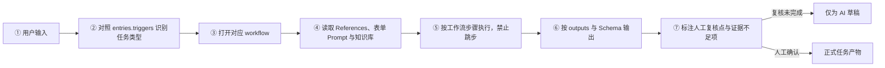
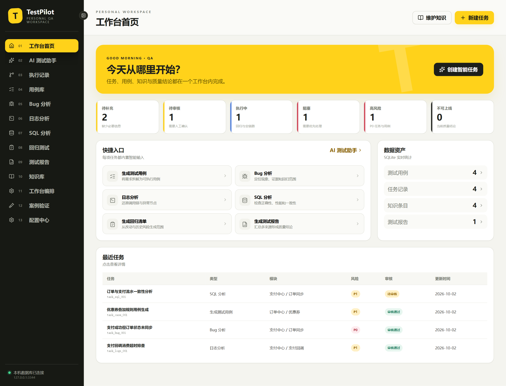
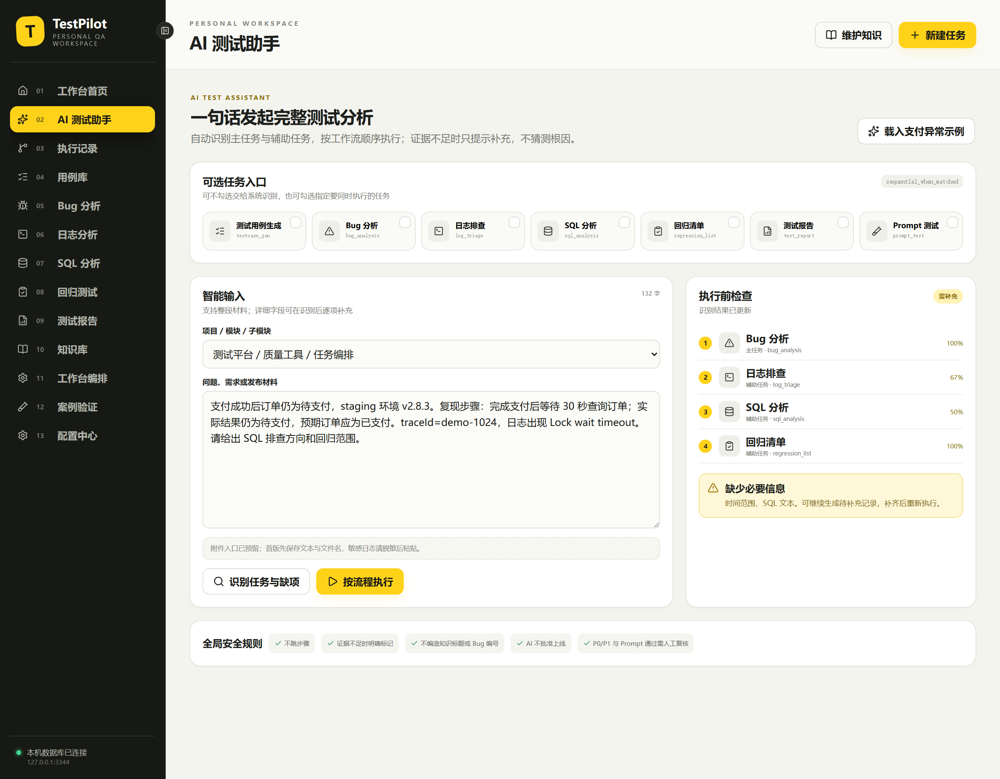
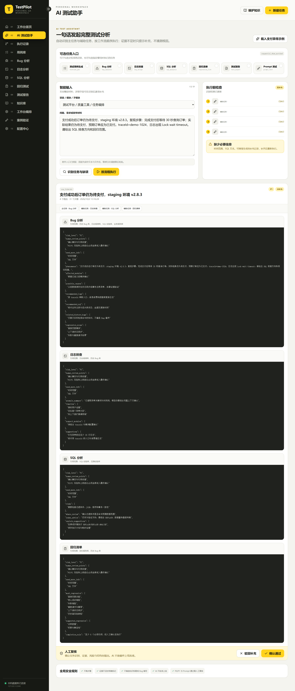
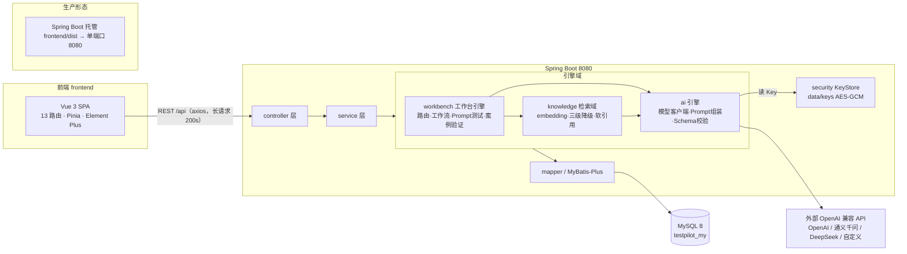

# TestPilot 项目说明文档

> **整理日期**：2026-10-04
> **适用范围**：TestPilot 当前 main 分支（v1.0.0）
> **资料来源**：本文档整合自原根目录 `README.md` 与 `design/`、`docs/` 目录下的需求、设计、手册类文档（用户操作手册、AI 工作流升级需求、知识库解析与双向服务方案、部署验证记录、交互原型）。上述原始文档已删除，本文档为唯一保留的项目综合说明，原始文档与各章节的对应关系见第 8 章附录。

---

## 目录

1. 项目概述
2. 技术架构与实现概览
3. 环境与部署
4. 功能模块说明
5. 知识库专题
6. 设计演进与升级规划
7. 常见问题与已知行为
8. 附录：资料索引
9. TestPilot-my 重新开发方案（Java + Vue + MySQL，2026-10-04 追加）

---

## 1. 项目概述

### 1.1 产品定位

TestPilot 是面向个人测试工程师的**本地测试工作台**（黄色主题）。所有数据保存在本机 MySQL 数据库（首次启动自动创建 `testpilot` 库），默认仅本机可访问，不上传云端。

它把日常测试工作收敛为一条主线：

> **发起任务 → 自动识别与路由 → 按流程执行 → 人工复核 → 沉淀知识 → 生成报告**

### 1.2 能力总览

| 模块 | 一句话说明 |
| --- | --- |
| 工作台首页 | 质量态势指标、快捷入口、数据资产与最近任务 |
| AI 测试助手 | 一句话发起完整测试分析，自动识别主任务与辅助任务并顺序执行 |
| 执行记录 | 保存原始输入、路由、逐步轨迹、证据、缺项与人工复核结论 |
| 用例库 | 按项目/模块/子模块组织用例，支持新增、导出、批量操作 |
| Bug 分析 | 定位现象、证据和回归范围的专项分析 |
| 日志分析 | 还原调用链与异常节点 |
| SQL 分析 | 检查 SQL 正确性、性能与一致性 |
| 回归测试 | 从高风险用例与历史缺陷生成可执行清单，并在线维护执行状态 |
| 测试报告 | 汇总多来源形成统一质量结论，可导出 Markdown / PDF |
| 知识库 | 可编辑、版本化、带引用保护的经验沉淀，供分析任务检索 |
| 工作台编排 | 配置 7 个标准入口的触发词、必填项、知识映射与工作流 |
| 案例验证 | 用固定 walkthrough 回归路由顺序与安全规则 |
| 配置中心 | 三级模块、大模型厂商、输出格式模板与关联规则 |

### 1.3 AI 使用边界（工作原则）

- 证据不足时**明确提示缺什么**，不编造结论；
- 不虚构知识标题或 Bug 编号；
- **AI 不做上线批准**，P0/P1 与 Prompt 测试结果必须人工复核；
- 任务识别、路由、步骤、输入、证据与复核结论全程可追溯。

---

## 2. 技术架构与实现概览

### 2.1 技术栈

| 层 | 选型 |
| --- | --- |
| 前端 | React 19 + TypeScript 7 + Vite 8，单页应用，无路由框架（`setPage` 状态切换）；图标 lucide-react，导出能力 jspdf（PDF）/ xlsx（Excel） |
| 后端 | Node.js 原生 HTTP 服务（无 Web 框架），REST API |
| 数据层 | MySQL 8.x（mysql2 连接池，启动时自动建库、建表、写种子数据） |
| 端口 | 服务端与前端统一使用 `3344` |

### 2.2 代码结构

| 文件 | 职责 |
| --- | --- |
| `server.mjs` | HTTP 服务与全部 REST API、建库建表、种子数据、单项分析 LLM 调用（`/api/ai/analyze`）、知识库 CRUD 与审核 |
| `workbench-api.mjs` | AI 工作台引擎：7 个标准入口定义（`ENTRY_DEFS`）、路由判定、工作流执行、案例验证 |
| `db.mjs` | MySQL 访问层（导出 `createDb()`，提供 `one/all/run/exec/end` 五个异步助手，首次启动自动 `CREATE DATABASE IF NOT EXISTS testpilot`） |
| `src/main.tsx` | 主应用 UI：工作台首页、Bug/日志/SQL 分析、用例库、知识库、回归、报告、配置中心 |
| `src/workbench.tsx` | AI 助手、执行记录、工作台编排、案例验证四个页面 |
| `scripts/deploy.mjs` | 一键部署脚本（检查环境 → 安装 → 构建 → 启动） |
| `knowledge-retrieval.mjs` | 知识检索服务：建 `knowledge_embeddings` / `retrieval_hits` 两表，semantic → keyword → none 三级降级检索与软引用记录，经 `createWorkbench()` 注入助手链路（见 5.3） |
| `scripts/provider-keys.mjs` | API Key 加密存取：Windows DPAPI / macOS 钥匙串，提供 `save` / `read` 两个方法（`server.mjs` 引用；暂无 remove，见 6.32 C3） |
| `scripts/migrate-sqlite-to-mysql.mjs` | 旧版 SQLite → MySQL 数据迁移脚本（幂等，见 3.4） |
| `server-runtime.mjs` | 兼容启动入口（直接导入 `server.mjs`，见 3.5） |

根目录 `app.js` 与 `styles.css` 为早期版本遗留文件，未被任何代码引用（前端样式实际为 `src/styles.css`，由 `src/main.tsx` 导入）；阅读代码时可直接忽略。

### 2.3 AI 执行链路（固定 7 步）



输入完整度校验发生在链路第一步；缺少核心字段时进入"证据不足项/需补充信息"，不得跳过后直接给根因。

### 2.4 多入口顺序调度

同一输入可命中多个入口（如"支付成功但订单未支付 + lock wait timeout + 支付回调改动"同时命中 Bug、日志、SQL、回归），系统按以下规则调度：

1. 展示命中入口、命中依据与置信度，禁止不可解释的分类结果；
2. **主任务只保留一个**，其余为辅助任务，可取消误命中项；
3. 按 `dispatch.multi_route_policy: sequential_when_matched` 与 `default_order` 顺序执行（联动案例固定顺序：Bug 分析 → 日志排查 → SQL 分析 → 回归清单）；
4. 上一步的结构化产物传递给下一步，下步缺项单独提示；
5. 每个子任务独立保存、重试、审核和追溯。

---

## 3. 环境与部署

### 3.1 环境要求

- **Node.js 24 LTS 或更高版本**（含 npm）：<https://nodejs.org/>
- **MySQL 8.x**：本机数据库服务。默认连接 `127.0.0.1:3306`（root / 空密码），可通过环境变量 `DB_HOST` / `DB_PORT` / `DB_USER` / `DB_PASSWORD` / `DB_NAME` 覆盖。
- 操作系统：Windows / macOS；浏览器：Edge、Chrome 等现代浏览器。

### 3.2 启动与访问

将项目下载并完整解压到当前用户可写的文件夹后再运行，不要直接在压缩包中运行。

| 方式 | 操作 | 适用场景 |
| --- | --- | --- |
| Windows 一键启动 | 双击 `start.bat` | 日常使用 |
| macOS 一键启动 | 双击 `start.command` 或 `启动 TestPilot.command` | 日常使用 |
| 终端通用启动 | 项目目录执行 `npm run deploy` | 任意系统 |

一键启动会自动完成：检查环境（Node / MySQL / 端口）→ `npm ci` 安装锁定依赖 → TypeScript 校验并构建到 `dist` → 启动生产服务 → 打开浏览器。

```bash
npm start        # 已安装依赖并构建后，离线直接启动
npm run dev      # 开发模式（同样运行在 3344 端口）
npm run check    # 开发校验：TypeScript 类型检查
npm run build    # 生产构建
```

- 访问地址：<http://127.0.0.1:3344>，服务保留终端窗口运行，停止按 `Ctrl+C` 或关闭窗口；
- 端口冲突时设置 `PORT` 环境变量后启动；
- 安装、构建、启动失败的原因会显示在终端并写入 `logs/deploy.log`。

### 3.3 数据与安全

| 项目 | 说明 |
| --- | --- |
| 数据库 | 本机 MySQL 8.x（默认库名 `testpilot`，自动创建）；更新代码不影响数据，**请勿删库** |
| data 文件夹 | 保存 API Key 密文与导出的 JSON 备份，更新或重装时一并保留 |
| API Key | Windows 使用当前用户 DPAPI 加密存至 `data/keys`，macOS 使用钥匙串；不写入数据库明文。**加密文件不能跨用户/跨电脑解密，换机后需重新配置** |
| 访问范围 | 仅本机 `127.0.0.1:3344`，默认局域网不可访问 |

备份建议：`mysqldump` 定期导出 `testpilot` 库（最完整）；复制 `data` 文件夹；用例库 JSON 导出、回归清单 XLSX 导出、报告 Markdown/PDF 导出可作轻量归档。

### 3.4 旧版数据迁移

- **SQLite → MySQL**：从旧版（SQLite 单文件）升级时，保留 `data/testpilot.sqlite`，执行 `node scripts/migrate-sqlite-to-mysql.mjs` 导入历史数据（幂等，可重复运行，原文件保留不动）。
- **浏览器 localStorage → MySQL**：旧版浏览器数据在首次进入时自动弹窗，可选择"备份并迁移到数据库"（先在本机生成只读 JSON 备份至 `data/backups`，再导入 MySQL，重复操作不产生重复数据）。

### 3.5 部署实现要点

- macOS 两个 `.command` 与 Windows `start.bat` 统一进入 `scripts/deploy.mjs`，`server-runtime.mjs` 为兼容入口；
- 每次一键启动都会校验安装与构建（需可访问 npm 软件源）；已构建后可 `npm start` 离线启动；
- 密钥文件与日志不入库（不提交 git）；pnpm 的 core-js 构建许可占位值为 false，文档统一采用 npm；
- 生产构建存在前端包体积警告，不影响构建和访问。

---

## 4. 功能模块说明

### 4.1 主界面与工作台首页

工作台首页是应用**默认入口页**（导航编号 01），回答一个问题："今天从哪里开始？"。它是整个测试工作流的**态势总览仪表盘**：监控质量态势指标、充当任务发起的枢纽、提供数据资产概览与最近动态查看。

主界面分为三个区域：左侧导航（13 个模块：工作台首页 / AI 测试助手 / 执行记录 / 用例库 / Bug 分析 / 日志分析 / SQL 分析 / 回归测试 / 测试报告 / 知识库 / 工作台编排 / 案例验证 / 配置中心）、顶部操作栏（提供「维护知识」「新建任务」快捷跳转）与内容区；导航栏底部显示本机数据库连接状态。



#### 页面结构（自上而下）

| 区域 | 内容 |
| --- | --- |
| 欢迎区（Hero） | 问候语（当前为静态英文演示文案，中文动态化方案见 6.15）与副标题，右侧「创建智能任务」按钮直达 AI 测试助手 |
| 六张指标卡 | 待补充、待审核、执行中、阻塞、高风险、不可上线，快速了解当前质量态势 |
| 快捷入口（左栏） | 6 张卡片：生成测试用例、Bug 分析、日志分析、SQL 分析、生成回归清单、生成测试报告，点击直达对应页面 |
| 数据资产（右栏） | 测试用例、任务记录、知识条目、测试报告四类数据的 MySQL 实时统计，点击数字区域跳转对应模块（「任务记录」卡为全类型任务总数、点击落到 Bug 分析页，口径注明方案见 6.15） |
| 最近任务表 | 最近 5 条任务（任务/类型/模块/风险/审核/更新时间），点击任意行打开详情抽屉，可执行提交审核 / 审核通过 / 驳回 |

#### 使用方式

- 启动应用访问 <http://127.0.0.1:3344> 后**自动进入首页**，也可点击左侧导航「01 工作台首页」；
- 点击「创建智能任务」→ 进入 AI 测试助手发起新分析；
- 点击快捷卡片 → 直达对应功能页；点击数据资产数字 → 跳转对应模块；
- 点击最近任务行 → 右侧滑出详情抽屉，查看输入、分析结果并执行审核操作。

#### 实现要点（前端 React + 后端 Node 原生 HTTP + MySQL）

- **前端**（`src/main.tsx`）：应用无路由框架，`App` 组件以 `useState<PageKey>('dashboard')` 持有当前页，`dashboard` 为初始值，故启动即首页；`Dashboard` 组件挂载时请求最近任务（取 20 条中前 5 条）并渲染全部区块。指标卡数值分两类：**动态计算**（待审核 = 最近任务中 `reviewStatus==='待审核'` 的数量；高风险 = `risk==='P0'` 的数量）与**静态演示值**（待补充=2、执行中=1、阻塞=1、不可上线=0，见 7.2 已知行为；真实统计改造方案见 6.3）。快捷入口来自 `TASK_META` 常量（同时定义 6 类任务的标题/描述/必填项），点击映射为页面 key 后 `setPage()` 切换；表格行点击触发 `setDrawer({type:'task'})` 打开通用详情抽屉。
- **API 层**（`server.mjs`）：首页仅消费两个 GET 接口——`GET /api/bootstrap` 对每张资源表执行 `COUNT(*)`，返回 `counts`（数据资产计数）+ `modules` + `providers`，应用启动时调用一次作为全局状态；`GET /api/tasks?pageSize=20` 走通用 `listResource`，按 `updated_at DESC` 分页查询，`mapRow` 负责 snake_case→camelCase 字段转换、JSON 字段解析与模块标签拼接。
- **数据层**（MySQL `testpilot` 库）：`tasks` 表是最近任务列表与待审核/高风险指标的数据源；`cases`/`knowledge`/`reports` 等表是数据资产计数来源。

数据流：

```text
打开 127.0.0.1:3344
  → GET /api/bootstrap（资产计数/模块/模型配置，全局状态）
  → Dashboard 挂载 → GET /api/tasks?pageSize=20（最近任务）
  → 渲染：指标卡（动态+演示值）/ 快捷入口（TASK_META）/ 数据资产（counts）/ 最近任务表格
  → 用户点击 → setPage 切换页面 / setDrawer 打开详情抽屉
```

### 4.2 AI 测试助手（核心功能）

把"一段材料"变成"一组按顺序执行的分析任务"，是使用频率最高的入口。

**发起任务**：页面由可选任务入口（7 个标准入口：测试用例生成、Bug 分析、日志排查、SQL 分析、回归清单、测试报告、Prompt 测试）、智能输入（项目/模块/子模块 + 整段材料粘贴，支持"载入支付异常示例"与"载入 Prompt 测试示例"两个示例按钮）、文本附件上传（白名单 .txt/.log/.sql/.md/.json/.csv，单个 ≤200KB，可移除；"附件参与分析"开关默认开启，开启时每文件前 8KB 随材料送入模型）、两个操作按钮（**识别任务与缺项** / **按流程执行**）四部分组成。不勾选入口时交给系统自动识别，勾选则执行指定任务。勾选 Prompt 测试时出现测试集选择栏：不使用测试集则按材料中【被测 Prompt】结构逐样例解析（解析失败退化为文本评审），也可下拉选用测试集并新建/编辑——测试集含被测 Prompt、预期输出 Schema 与 ≤10 个样例，执行时逐样例真运行并按 5 种规则机器判定（做实方案与实施记录见 6.16）。发起任务阶段的专项解析与输入域增强方案（路由排除 / 上一步产物传递 / 缺项分级与执行门禁 / 输入草稿保存）见 6.18；发起任务 × Bug 分析入口的交叉专项解析与缺口方案（问题标题恒真检查 / 缺项判定依据与补充引导）见 6.21；发起任务 × 日志排查入口的交叉专项解析与缺口方案（时间范围与环境识别口径 / 日志标识双侧识别 / 风险初判英文词）见 6.22；发起任务 × SQL 分析入口的交叉专项解析与缺口方案（SQL 语句形态识别 / 触发词误伤 / 风险词表）见 6.23；发起任务 × 回归清单入口的交叉专项解析与缺口方案（必填判定词表 / 风险初判发布域词 / 必回归项数量校验）见 6.24；发起任务 × 测试报告入口的交叉专项解析与缺口方案（触发词变体 / 必填判定词表 / 风险初判报告域词 / 报告章节数量校验 / 报告页口径与交互修正承接）见 6.25。

**识别与预检**：点击"识别任务与缺项"后，右侧面板展示路由列表（含主/辅助任务角色与信息完整度百分比）、缺少必要信息清单；缺项时不猜测根因，可生成待补充记录。识别与预检阶段的专项解析与预检域增强方案（面板刷新一致性 / 附件与测试集参与检查 / 主任务可指定 / 自动预检）见 6.19。



**按流程执行**：按固定顺序完成全部路由后生成执行结果卡片——执行 ID、路由页签（主/辅助任务）、每路由分块结构化输出（含知识引用范围与 JSON 结果；结构校验未通过的路由显示黄色徽标，悬停可见缺失项；Prompt 测试路由在 JSON 前额外展示逐样例真运行对照表：样例/输入/预期/实际输出/机器判定/差异说明六列与通过率，判定由规则产生、不可被模型更改）、人工复核栏（逐项复核勾选 + 可选复核备注 + **确认通过** / **驳回补充**；P0 记录确认时二次确认；命中 Prompt 测试时复核必选）。页面底部固定显示全局安全规则。执行结果呈现与处置的专项解析与结果域增强方案（耗时透出 / 复核终态与历史 / 知识引用跳转 / 风险人工修正 / 缺项回显）见 6.20。



**后续去向**：每次执行写入执行记录；复核通过后，可在执行结果卡片将事实类路由（Bug 分析 / 日志排查 / SQL 分析 / 回归清单）的输出**沉淀为知识**（生成待审核知识，需在知识库中审核发布，来源追溯 `runId#路由ID`）；Bug/日志/SQL 分析任务审核通过后也可在任务详情**申请入知识库**。用例生成路由的「存入用例库」与知识沉淀扩展方案见 6.5；测试报告路由的「存入测试报告」出口方案见 6.10.7；助手整体的执行域增强方案（取消 / 重试 / 重跑、命中依据与置信度、最近执行面板、Token 用量等）见 6.17。

### 4.3 执行记录

回答"这次分析到底执行了什么、结论是什么、谁复核过"。列表支持按标题/原始输入搜索、状态筛选（待补充/待复核/已完成）、导出当前页 JSON；详情抽屉包含执行结果卡片（可在此逐项勾选复核项、填写备注并直接复核，未勾完时服务端拒绝通过，复核通过后可将事实类路由输出沉淀为知识，已沉淀路由显示"已沉淀 → 待审核"，支持导出 Markdown 存档）与逐步执行轨迹（每步的路由、真实起止时间与状态；本地兜底的路由在步骤说明中标注原因）。

### 4.4 工作台编排

维护 7 个标准入口的"运行配置"，即父子任务结构（组合任务）的自定义全链路。每个入口可编辑四类配置（每行一项）：

| 配置项 | 说明 |
| --- | --- |
| 触发词 | 命中该入口的关键词 |
| 必填信息 | 执行前必须提供的信息，缺失时提示补充 |
| 知识库引用映射 | 该入口检索哪些知识库分类 |
| 工作流步骤 | 严格按顺序执行的步骤清单 |

发布规则：点击「保存并发布新版本」后版本号自动递增（v1 → v2）；**知识库事实不复制到工作台**；历史执行记录保留当时快照。

当前版本的已知缺口（触发词 / 必填修改不被运行消费、保存零校验、无未保存提醒与防重复提交、无恢复默认等）与增强方案见 6.14 / 6.29。

### 4.5 案例验证

AI 测试助手「路由识别层」的回归沙箱（FR-12）：用固定 walkthrough（完整材料）断言这份材料应命中哪些任务入口、以什么顺序执行，在发布工作台资产前做路由回归。当前为"官方示例 + 单次运行"的纯规则实现——运行链路不调用任何大模型；断言为路由子集断言（期望路由全部命中即通过，多余命中不判失败也不展示），`expectedRules` 仅随结果存档、不参与断言（文案与实现的语义偏差见 7.2）；结果仅回写 `validation_cases` 行内，不产生执行记录。每个案例卡片包含完整材料、预期检查（预期路由与必须规则）、运行按钮；运行后显示"验证通过/失败"及实际路由顺序（如 `bug_analysis → log_triage → sql_analysis → regression_list`）。自建案例、运行历史、全部运行与发布门禁联动的增强方案见 6.13；知识断言（期望知识可被检索命中的回归，6.2.6 M4 交付物）方案见 6.13.7。

### 4.6 用例库

按"项目 → 模块 → 子模块"三级组织。支持关键词/模块/优先级筛选、模块树点击筛选、导出 XLSX 与 JSON 备份、批量操作（生成回归、生成报告、下载 CSV 等）、新增用例（标题、测试步骤、预期结果必填）、详情抽屉（徽标、关联 Bug、复制用例等操作）。「新增 / 智能生成」页签的 AI 智能生成能力方案见 6.5；页面本体专项解析与外围补全（关联 Bug 做实 / 生成报告带入 / 导出完整备份 / 归档入口 / 搜索范围）见 6.28。

### 4.7 Bug / 日志 / SQL 三类专项分析

三个分析页结构完全一致（新建分析 / 任务列表 / 已入库经验三个页签）：填写任务标题、模块与风险等级，粘贴问题上下文，右侧实时显示**输入完整度**评分与**输出结构预览**；点击开始分析后生成结构化结果，执行「提交审核 → 审核通过/驳回 → 申请入知识库」流转。

模型说明：系统优先调用已启用且已配置 Key 的大模型；未配置或调用失败时自动回退**本地规则**分析并明确提示，回退不影响流程。

### 4.8 回归测试

回归清单以卡片展示：进度环/条实时反映执行完成度（通过/失败/跳过计入，未执行/阻塞不计）；每项可下拉更新执行状态（未执行/通过/失败/阻塞/跳过，立即保存）；底部统计通过/失败/阻塞数量；支持复制为 Markdown 待办、下载 XLSX；全部必选项完成后自动归档到「完成记录」页签。

### 4.9 测试报告

报告列表展示标题、项目/版本、覆盖模块、结论、失败/阻塞数；生成报告时左侧填写标题、发布版本与上线结论（可上线/有条件上线/不能上线），右侧勾选纳入报告的任务来源；详情包含醒目的上线结论、执行结果统计、风险与遗留问题列表，支持复制 Markdown、下载 .md 与 .pdf。报告项目名与 AI 叙述增强方案见 6.10；AI 助手「测试报告」结果直存报告库见 6.10.7；「测试报告」入口的发起阶段专项解析与入口判定增强（触发词变体 / 必填判定词表 / 风险初判报告域词 / 章节数量校验）与报告页口径交互修正（失败数语义 / 来源扩展 / 搜索分页 / 详情审计）见 6.25；报告趋势对比（按项目分组 · 版本语义升序 · CSS 分段条 · 快照如实呈现）见 6.10.8。

### 4.10 配置中心

四个页签：

- **项目与模块**：三级模块树，子模块可停用/恢复（停用后不出现在新建表单下拉，历史数据不受影响），支持新增；模块三级名称创建后不可编辑（后端 PATCH 已支持全字段 `??` 合并改名、前端无入口，补齐方案见 6.32 C2）；
- **大模型**：OpenAI、通义千问、DeepSeek、自定义兼容模型的 Base URL / 模型名 / API Key / 温度 / 超时 / 最大输出配置，支持测试连接；未启用厂商不参与分析；模型配置不可删除、名称不可改，测试连接探测 `{Base URL}/models` 端点（补齐方案见 6.32 C3~C5）；
- **格式模板**：与 6 类任务对应的输出字段参考清单，可增删改字段名并保存（`settings` 表 `template-{task}` 键）——**当前为纯参考配置**：不参与 AI 请求构造（AI 输出结构由工作台 `OUTPUT_SCHEMAS` 单源管理，见 6.4.5），历史记录展示也不读取该配置；保存时的「全量同步历史记录」提示与实际行为不符（降级定位与文案修正方案见 6.32 C1）；
- **关联规则**：只读展示每类任务自动检索的知识库分类映射——展示为前端静态硬编码，与真源（`workbench_assets.knowledge_json`，可在工作台编排页修改）存在不一致（真源化方案见 6.6.6 第 8 条）。

当前版本的已知缺口（格式模板整链路空转、模块编辑无入口、模型配置不可删改、PATCH 不带 enabled 字段静默停用厂商、测试连接对无 /models 网关误报连接失败）与补齐方案见 6.32。

---

## 5. 知识库专题

### 5.1 定位与三大机制

知识库是 TestPilot 中**「AI 分析的事实来源」**，覆盖 7 大分类：历史 Bug 库、业务规则库、接口异常库、日志规律库、SQL 经验库、压测经验库、回归规则库（`KB_CATEGORIES`）。

| 机制 | 说明 |
| --- | --- |
| **审核门控** | 新知识默认「待审核」，只有**已发布**状态的知识才会被分析任务检索引用 |
| **版本化** | 每次编辑保存生成新版本（`version` 自增），历史可追溯 |
| **引用保护** | 已被下游引用的知识不能随意撤销（后端返回 409 并列出依赖来源），避免"抽掉地基" |

### 5.2 使用路径（5 条）

1. **新增知识**：页头「新增知识」→ 填写标题/分类/风险/模块/正文 → 保存并提交审核（进入待审核）；
2. **审核与发布**：详情抽屉中「审核通过并发布」→ 可被分析任务检索；
3. **编辑与升版**：「编辑内容」修改正文，「保存新版本」版本号递增；
4. **撤销入库**：已发布知识可撤销；被引用时撤销被阻止（409 + 依赖清单），需先解除引用；
5. **申请入知识库（反向沉淀）**：Bug/日志/SQL 任务审核通过后点击「申请入知识库」，自动生成待审核知识（`source_task_id` 指向原任务，分类按任务类型自动映射），分析页「已入库经验」页签可查看已发布知识卡片。

### 5.3 实现结构（前端 React + 后端 Node 原生 HTTP + MySQL）

**数据层**（`server.mjs` + `knowledge-retrieval.mjs`）：

- `knowledge` 表：`id, title, category, module_id(外键→modules), risk(默认P1), status(待审核/已发布/已驳回/已撤销), version, content, source_task_id(来源追溯), review_note, created_at, updated_at`；
- `relations` 表（引用保护的基石）：`source_type/source_id → target_type/target_id + label + active`，撤销知识时若存在 `target_type='knowledge'` 且 `active=1` 的记录则返回 409——当前写入方仅种子演示数据与报告来源（沉淀来源自动登记方案见 6.30 K4）；
- `knowledge_embeddings` 表（`knowledge-retrieval.mjs` 建表）：知识向量缓存 `vector(BLOB，Float32Array 序列化) / vector_model / dim / updated_at`，检索时按 `updated_at` 与知识更新时间判过期、批量 16 条懒补偿重嵌；
- `retrieval_hits` 表（`knowledge-retrieval.mjs` 建表）：AI 检索命中软引用 `run_id / route_id / knowledge_id / title_snapshot / version_snapshot / score / method`——可追溯但**不参与撤销保护**（R7）。

**检索服务层**（`knowledge-retrieval.mjs`）：`createRetrieval(db, {readProviderKey})` 返回 `retrieve / recordHits`。`retrieve(text, categories)` 三级降级：semantic（`purpose='embedding'` 模型向量化、余弦相似度 ≥0.3 取 Top5）→ keyword（中文 2~3 字 n-gram 滑窗 + 英文词 token，标题命中 ×3 / 正文 ×1 取 Top5）→ none（显式"未检索到相关知识"）；候选集强制 `status='已发布'` 且分类在白名单内。该服务经 `createWorkbench(db, {readProviderKey, retrieve, recordHits})` 注入 AI 测试助手链路（依赖倒置，便于测试）。

**API 层**：

| 端点 | 行为 |
| --- | --- |
| `GET /api/knowledge` | 通用 listResource：搜索、category/status/module_id 筛选、分页 |
| `GET /api/knowledge/:id` | 详情，额外查 relations 计算 `dependencies` 与 `referenceCount` |
| `POST /api/knowledge` | 新建，强制 `status='待审核'`、`version=1`，写审计日志 |
| `PATCH /api/knowledge/:id` | `action='approve'`→已发布 / `'reject'`→已驳回 / `'withdraw'`→有 active 引用时 409 + dependencies；编辑则 version+1 |

**前端 UI 层**（`src/main.tsx`）：`KnowledgePage`（列表与指标卡）、`KnowledgeModal`（新增弹窗）、`DetailDrawer`（详情抽屉：引用次数、关联影响、编辑升版、审核发布、撤销入库）、`KnowledgeExperience`（分析页已入库经验）、`RelationSettings`（配置中心任务↔知识分类映射）。

### 5.4 与 AI 工作流的集成

知识库的"消费端"在 `workbench-api.mjs`：7 个标准入口各自声明 `knowledge` 引用映射（存于 `workbench_assets.knowledge_json`，可在工作台编排页自定义，修改后版本递增）：

| 入口 | 引用知识分类 |
| --- | --- |
| `bug_analysis` | 历史 Bug 库、日志规律库、SQL 经验库、业务规则库 |
| `log_triage` | 日志规律库、历史 Bug 库 |
| `sql_analysis` | SQL 经验库、压测经验库 |
| `regression_list` | 回归规则库、历史 Bug 库 |
| `test_report` | 业务规则库、历史 Bug 库、回归规则库 |
| `testcase_gen` | 业务规则库、接口异常库、历史 Bug 库 |
| `prompt_test` | 不消费知识库（`knowledge` 为空数组）：判定依据是被测 Prompt、预期输出 Schema 与逐样例真运行的机器判定，不引用知识条目 |

执行工作流时（AI 测试助手 `POST /api/workbench/runs`，2026-10 已实施，对应 6.2.6 里程碑 M1+M3），每个路由真实消费知识库：

```text
retrieve(text, entry.knowledge)      # 三级降级检索，只取已发布知识 Top5
 → systemPrompt 注入知识事实列表      # "- [分类] 标题（v版本，风险）：摘要"
                                      # 无命中时注入"本次未检索到相关知识……禁止虚构知识标题或 Bug 编号"
 → callModel 真实模型调用 → validateOutput 结构校验
 → 落库：workflow_runs（result.routeSummary.loadedKnowledge 条目级快照 + evidence_json
        "知识标题@v版本（检索方法 得分）"证据链）+ retrieval_hits（软引用，不写 relations）
 → 前端每路由显示"加载知识（semantic/keyword）：标题（v版本）"或"未检索到相关知识（未虚构）"
```

**未接入的链路**：独立分析页 `/api/ai/analyze`（Bug/日志/SQL 单项分析）无知识注入——对应 6.2.6 里程碑 M2，落地设计见 6.6.4~6.6.8（未实施）；用例/回归/报告/案例验证四入口的知识消费见 6.2.6 M4 相关方案（6.5 / 6.9 / 6.10 / 6.13）；人侧检索（语义搜索、影响分析、嵌入状态）未实现，方案见 6.30。

关键设计原则：**「知识库事实不复制到工作台」**——工作台只维护引用映射，事实始终以知识库中「已发布」版本为准，避免双份数据不一致。

### 5.5 数据闭环

```text
分析任务(审核通过) ──申请入知识库──▶ knowledge表(待审核)
执行记录(复核通过) ──沉淀为知识──▶ knowledge表(待审核)
                                        │ 人工审核
                                        ▼
                                   knowledge表(已发布)
                                        │ 被工作流入口按分类三级降级检索(semantic→keyword→none)
                                        ▼
                  AI 分析输出 + retrieval_hits 软引用快照(可追溯,不阻塞撤销)
                                        │ relations 硬引用(409 引用保护)
                                        ▼
                                   撤销/编辑受控
```

一句话总结：知识库通过**「审核门控 + 版本化 + 双层引用（软引用 retrieval_hits 可追溯、硬引用 relations 触发 409 保护）」**机制，为 AI 分析提供可信、可追溯、不可被悄悄篡改的事实来源。（注：硬引用当前仅由种子演示数据演示触发，「申请入知识库 / 沉淀为知识」的来源自动登记与解除引用入口方案见 6.30 K4；AI 检索命中一律只写软引用。）

---

## 6. 设计演进与升级规划

### 6.1 AI 测试助手与工作流升级（2026-08，已确认，核心功能已实现）

#### 6.1.1 背景

升级前 TestPilot 的 AI 能力以"进入单项页面 → 输入文本 → 返回结果"方式工作，只依赖长 Prompt 存在明显问题：同一输入被不同模型解释为不同任务、多项任务被合并成一段回答、表单缺项时模型补造信息、Prompt/工作流/输出格式散落不同步、分析过程无法说明加载了什么规则与知识、AI 输出未经复核即被误认为正式结论。

升级目标：把文件化能力（`workbench.yaml` + `workflows/` 等）映射为页面能力，让 TestPilot 从"多个 AI 工具入口"升级为"**有入口路由、有固定步骤、有业务知识、有机器校验、有人工门禁的测试调度器**"。

#### 6.1.2 核心设计结论

**① 知识库与工作台必须分离**：

| 领域 | 负责内容 | 不应包含 |
| --- | --- | --- |
| 知识库 | 已验证的业务事实与历史经验（历史 Bug、支付规则、回归规则） | Prompt、任务步骤、输出格式 |
| 工作台资产 | 测试助手如何完成任务（入口路由、表单、工作流、Prompt、Schema） | 未审核的业务事实 |
| References 方法库 | 如何识别、匹配和排查（模块映射、日志关键词、历史 Bug 匹配方法） | 历史 Bug 正文副本 |

**② 固定 7 步执行链路**（见 2.3 节）；**③ 多入口按顺序调度**（见 2.4 节）；**④ 文件资产映射为平台能力**：`workbench.yaml`→入口路由、`system/`→全局规则、`workflows/`→可视化步骤、`forms/`→输入表单、`prompts/`→Prompt 资产、`outputs/`+`schemas/`→输出模板与机器校验、`references/`→方法库、`examples/`→案例验证素材。

#### 6.1.3 信息架构

```text
AI 测试助手：发起任务 / 执行记录 / 组合任务 / 案例验证
工作台编排：入口路由 / 全局规则 / 工作流 / 输入表单 / Prompt / 输出模板 / Schema / References / Examples
知识库（独立入口）：历史 Bug / 业务规则 / 接口异常 / 日志规律 / SQL 经验 / 压测经验 / 回归规则
```

#### 6.1.4 功能需求摘要（FR-01 ~ FR-13）

| 编号 | 需求 | 要点 |
| --- | --- | --- |
| FR-01 | AI 测试助手首页 | 统一智能输入区、入口卡片、自动识别+手工勾选、最近执行与待复核展示 |
| FR-02 | 入口路由 | 7 个入口 ID（`testcase_gen`/`bug_analysis`/`log_triage`/`sql_analysis`/`regression_list`/`test_report`/`prompt_test`），关键词/正则触发，必须展示命中原因 |
| FR-03 | 全局规则 | 禁止跳步、禁止无证据确认根因、禁止虚构知识、AI 不批上线、风险 P0–P3（SQL 分析用 P0–P2）、规则修改需版本与验证 |
| FR-04 | 输入表单 | 字段必填/条件必填/脱敏提示、整段文本自动拆解、缺失面板（阻塞/建议补充）、缺核心字段禁止完整分析 |
| FR-05 | 工作流编排 | 有序步骤（必选/可选/条件/人工节点）、版本绑定任务快照；Bug/日志/SQL/回归各有固定步骤，回归必须项 ≥6 |
| FR-06 | Prompt 资产 | 系统规则+工作流+References+知识检索+表单变量组装、变量检查与 Token 预估、修改后须案例验证 |
| FR-07 | 输出模板与 Schema | 模板与 Schema 成对同步校验；`bug_output` 必须含 10 个字段；多入口章节顺序固定 |
| FR-08 | References 方法库 | 只保存方法与索引，不复制知识正文；执行详情显示实际加载项 |
| FR-09 | 知识库检索 | 按入口配置知识分类与召回数、只用已发布知识、无命中显式声明、任务保存知识版本快照 |
| FR-10 | 执行详情与证据链 | 六区域：输入、路由命中、时间线、加载的规则/知识、模型与 Schema 校验、人工复核 |
| FR-11 | 人工复核门禁 | 复核项默认未勾选、P0/资金/订单结论额外确认、未复核=「AI 草稿」、上线结论由人选择 |
| FR-12 | 案例验证沙箱 | 官方示例+自建案例、草稿配置试跑、修改前后对比、发布前必跑案例 |
| FR-13 | 配置发布与版本 | 资产五状态（草稿→待验证→可发布→已发布→已停用）、发布生成不可变"工作台版本包"、支持回滚配置不回滚历史任务 |

#### 6.1.5 状态与风险规则

- 任务状态：草稿 → 待预检 → 待补充 → 可执行 → 执行中 → 待复核 → 已确认 → 已完成（异常：阻塞/执行失败/已取消）；
- 步骤状态：未开始、等待输入、执行中、已完成、Schema 失败、等待人工、阻塞、已跳过；
- 结论等级：P0（资金/订单状态/严重数据一致性/核心链路不可用）、P1（主要功能不可用）、P2（局部功能有替代方案）、P3（低影响体验项）。风险规则可给出最低等级，AI 不得擅自降低强制风险。

#### 6.1.6 与现有功能的兼容方案

现有「快捷任务」升级为 AI 测试助手统一输入；Bug/日志/SQL 独立页面保留为强制指定入口的快捷方式；「全链路任务」升级为联动工作流管理与运行记录；「格式模板」扩展为输出模板 + Schema 配对；「关联规则」扩展为入口路由与知识/References 范围；知识库继续只管理事实；旧任务可查看不强制迁移，新任务走新执行链路。

#### 6.1.7 验收标准（要点）

7 个入口 ID 与教程一致且可正确进入；支付异常输入识别 `bug_analysis` 为主任务并解释命中原因；多入口顺序执行不合并输出；Bug 缺环境/复现步骤明确阻塞；每步展示加载的总规则/工作流/References/Prompt/知识/Schema；知识库无结果不生成虚假标题；Bug 输出含 10 个必填字段；SQL 无 EXPLAIN 不武断要求加索引；回归必须项 ≥6；复核未完成不能生成正式结论或发布知识；P0 与 Prompt"通过"必须人工终审；历史任务始终使用当时版本包。

#### 6.1.8 建议分期

| 阶段 | 内容 |
| --- | --- |
| Phase 1 可配置执行骨架 | 入口路由、表单完整度、顺序工作流、执行详情、人工复核、版本快照 |
| Phase 2 资产编排中心 | 全局规则、Prompt、输出模板/Schema、References、发布与回滚 |
| Phase 3 案例验证与质量度量 | 案例沙箱、断言对比、配置回归、路由准确率、Schema 通过率、人工修改率 |

#### 6.1.9 原型

升级评审阶段曾提供可点击原型（AI 测试助手、执行记录、工作台编排、案例验证四页面），仅展示交互方向，不连接模型、不保存数据、不修改正式配置。原型与预览图已随设计文档一并删除，交互流程以本文档 2.3、2.4、4.2、4.4、4.5 节的描述为准。

### 6.2 知识库双向服务实现方案（设计文档，未实施）

#### 6.2.1 已确认决策与现状事实

| 决策点 | 结论 |
| --- | --- |
| 检索路线 | 向量语义检索（embedding + 应用层余弦，BLOB 存向量），不引入向量库 |
| AI 测试助手接模型 | 包含，分阶段（阶段一单项分析注入，阶段二助手逐路由调模型） |
| AI 起草知识草稿 | 包含（AI 预填草稿，状态固定「待审核」，人工审核后才发布） |

代码调查发现的关键现状（全项目当前 AI 与知识库尚未打通）：

> **时态说明（2026-10-04 补注）**：以下五条为方案设计时（2026-08）的历史快照，不代表当前代码——其中检索基础设施与「助手逐路由调模型 + 知识注入」（M1 / M3）已于 2026-10 实施（现状见 5.4；人侧检索部分仍未实施，见 6.30），M2 / M4 / M5 仍未实施；「回归清单生成空壳 / 用例智能生成名不副实 / 报告前端确定性拼装」的现状仍然成立（见 7.2 与 6.9 / 6.5 / 6.10）。

- 全项目唯一 LLM 调用点是 `/api/ai/analyze`，Prompt 中无任何知识内容；
- AI 测试助手输出全部由 `buildOutput()` 本地模板生成，不调模型、不查 knowledge 表；
- knowledge 表仅被列表/详情两处查询，全部服务于前端渲染；
- 证据链只记录知识**分类名**字符串；分类白名单存在双源不一致（`RelationSettings` 与 `ENTRY_DEFS`）；
- 回归清单"生成"是空壳（无 API 调用）；用例"智能生成"名不副实（纯手工表单）；报告生成是前端确定性拼装。

#### 6.2.2 目标架构

```text
写入侧：人工审核通过/AI起草(待审核) ─▶ knowledge(已发布) ─触发嵌入─▶ knowledge_embeddings(新)
检索枢纽：knowledge-retrieval.mjs —— L1 语义 → L2 关键词 → L3 空结果显式声明
消费侧：单项分析(M2) / 助手runs(M3) / 用例·回归·报告(M4) / 语义搜索·输入联想·影响分析(人侧)
追溯：retrieval_hits(新, 软引用) + evidence_json(条目级快照)
闭环：AI起草知识草稿(M5) ─▶ 待审核 ─人工─▶ 已发布
```

架构原则：事实留在知识库；工作台 `knowledge_json` 只维护分类白名单（统一单一来源，消除双源漂移）；检索服务是唯一读取知识的通道。

#### 6.2.3 设计红线（R1–R8）

| # | 红线 |
| --- | --- |
| R1 | 只检索已发布知识（所有检索 SQL 强制 `status='已发布'`） |
| R2 | AI 不发布、不修改知识（AI 产物只能以待审核入库，审核动作仅人工触发） |
| R3 | 不编造知识标题/Bug 编号（Prompt 硬约束 → Schema 校验 → 未命中显式声明，三层防线） |
| R4 | API Key 不入库、不进快照 |
| R5 | 历史快照不可篡改（run/task 保存"知识标题@版本@相似度"快照） |
| R6 | 模型不可用不得伪造成功（降级路径全部显式标注） |
| R7 | AI 引用不锁死知识库（软引用 `retrieval_hits` 可追溯不阻塞撤销；硬引用 `relations` 才触发 409） |
| R8 | 知识事实不复制到工作台 |

#### 6.2.4 数据模型概要

- 新表 `knowledge_embeddings`：知识向量（`kb_id + kb_version + chunk_text + vector(BLOB) + vector_model + dim + status`）；向量以 Float32Array 序列化为 BLOB，检索时 JOIN 条件含 `kb_version=k.version`——知识升版未重嵌入时宁可检索不到，也不用旧向量代表新内容；
- 新表 `retrieval_hits`：AI 检索命中记录（run 类型/ID、kb 版本、相似度、引用片段），用于影响分析、审计与案例验证断言，**明确不参与撤销保护**；
- `providers` 表加 `purpose` 列（`chat`/`embedding`）——DeepSeek 官方无 embeddings 端点，需要隔离；seed 追加 OpenAI 兼容嵌入模型；
- 现有 `knowledge`/`relations`/`workbench_assets` 表零改动；`validation_cases` 加 `expected_knowledge_json` 列（落地设计见 6.13.7）。

#### 6.2.5 检索与降级设计

检索服务 `knowledge-retrieval.mjs` 核心接口：`embedKnowledge` / `retrieveKnowledge` / `findSimilar`（AI 起草查重用，阈值 0.90）/ `reembedAll`。

| 情况 | mode | 前端展示 |
| --- | --- | --- |
| 语义正常有命中 | `semantic` | 「语义命中 N 条」+相似度 |
| 语义正常无命中 | `semantic`（hits 空） | **「未找到已发布知识」**，不得静默 |
| embedding 不可用→关键词命中 | `keyword` | 黄色提示「关键词降级命中」 |
| 关键词也无命中 | `none` | 「未找到已发布知识（关键词模式）」 |

嵌入触发：人工审核发布、编辑升版、撤销/驳回、迁移导入、检索时懒补偿、手动重嵌、换模型全量重嵌入；嵌入为 fire-and-forget，失败不影响业务操作（置 pending 兜底）。

#### 6.2.6 里程碑拆解

| 里程碑 | 内容 | 要点 |
| --- | --- | --- |
| M1 检索基础设施 | 两张新表 + 检索模块 + 5 个检索端点 + 人侧 UI（语义搜索、嵌入状态、影响分析） | 约占 60% 工作量，其余里程碑的地基 |
| M2 单项分析注入 | `/api/ai/analyze` 注入检索命中的知识 + hits 透传落库 + 引用卡片展示 | Prompt 注入《知识标题》(分类, v版本, 相似度) |
| M3 助手接模型 | 逐路由"检索→调模型→容错链"，risk 取正则与模型的较高者，总预算 180s | 模型失败单路由兜底，落库时机与响应模式保持现状 |
| M4 四入口扩展 | 用例 AI 起草、回归清单从零建（`POST /api/regressions`，必回归 ≥6 服务端保底）、报告 AI 增强章节（**数字统计保持确定性**，AI 绝不参与计数；落地设计见 6.10，助手结果直存见 6.10.7）、案例验证知识断言（落地设计见 6.13.7） | 报告数字确定性是最高优先红线 |
| M5 AI 起草闭环 | 审核通过的任务「AI 起草知识」：查重（≥0.90 建议升版）→ 起草 → 待审核 → 人工发布 | AI 全流程无发布权限 |

实施顺序：M1 →（M2 ∥ M3）→ M4 → M5，每个里程碑独立可交付、可验收、可单独回滚。测试策略为引入 vitest（项目此前无测试框架），单元测试覆盖点积计算、BLOB 序列化 roundtrip、降级链、risk 合并、Prompt 快照等 10 项，集成测试覆盖容错链三路径等 4 项。

### 6.3 工作台首页指标卡真实统计（方案，未实施）

#### 6.3.1 背景与现状

首页六张指标卡当前为半演示状态：待补充/执行中/阻塞/不可上线四张为写死的演示值；待审核/高风险虽为动态计算，但仅基于最近任务切片（`GET /api/tasks?pageSize=20` 结果的前 5 条）计算，非全表统计。演示值不随数据变化，无法反映真实质量态势（见 7.2 已知行为）。

#### 6.3.2 指标口径定义（已确认）

| 卡片 | 统计口径 | 说明 |
| --- | --- | --- |
| 待补充 | `tasks WHERE status='待补充'` 全表计数 | 审核驳回动作的落地状态，对应副文案"缺少必要信息" |
| 待审核 | `tasks WHERE status='待审核'` 全表计数 | 替代现有"最近 20 条内 reviewStatus 计算"；统一以 status 字段为准，原因见 6.3.4 |
| 执行中 | `tasks WHERE status='执行中'` + `regressions WHERE status='执行中'` | 组合任务父任务 + 进行中的回归清单，对应副文案"回归与全链路" |
| 阻塞 | `tasks WHERE status='阻塞'` 全表计数 | 任务状态族成员（报告生成 blocked 统计同源），对应"需要优先处理" |
| 高风险 | `tasks WHERE risk='P0'` + `cases WHERE priority='P0' AND archived=0` | 任务与用例全表统计，对应"P0 任务与用例"；用例需排除已归档 |
| 不可上线 | 最新一份 `reports`（`created_at DESC LIMIT 1`）`verdict='不能上线'` 时为 1，否则 0 | "当前质量结论"语义，取值 0/1 |

#### 6.3.3 接口与前端设计（已确认新增独立接口）

**`GET /api/dashboard/metrics`**（`server.mjs` 的 `handleApi` 新增分支）：

```json
{ "metrics": { "pendingInput": 0, "pendingReview": 1, "running": 1, "blocked": 0, "highRisk": 3, "notLaunchable": 0 } }
```

实现要点：六项均为单条 `COUNT(*)` / `LIMIT 1` 查询，一次请求内执行后组装返回；不改动现有 `/api/bootstrap`（其 `counts` 继续承载数据资产统计）。

**前端**（`src/main.tsx` `Dashboard` 组件）：挂载时以 `API.request('/dashboard/metrics')` 获取指标并替换六张卡的演示值/切片计算值；卡片标签、副文案、配色与整体布局不变；最近任务表格的加载逻辑保持现状。

**刷新时机**：指标在每次进入首页（Dashboard 挂载）时刷新；可选增强——在详情抽屉的任务审核动作（提交/通过/驳回）成功后触发指标重取，使首页数值即时更新。

#### 6.3.4 现状一致性问题（附带发现）

创建分析任务时后端写入 `status='待审核'` 但 `review_status` 固定为'未提交'（`POST /api/tasks` 硬编码），仅当用户在详情抽屉点"提交审核"后两者才同步。原卡片按 reviewStatus 统计会漏掉"创建即待复核"的任务；本方案统一按 `status` 统计后首页指标不再受影响，但建议后续实施时将创建动作的 `review_status` 同步为'待审核'（可选修正，不属于本方案必须项）。

#### 6.3.5 验收标准（种子数据基线）

| 卡片 | 预期值 | 依据 |
| --- | --- | --- |
| 待补充 | 0 | 无 status='待补充' 的任务 |
| 待审核 | 1 | task_sql_001 |
| 执行中 | 1 | reg_001（回归清单执行中；无执行中任务） |
| 阻塞 | 0 | 无 status='阻塞' 的任务 |
| 高风险 | 3 | task_bug_001（P0 任务）+ case_001 / case_004（P0 用例） |
| 不可上线 | 0 | 最新报告 report_001 结论为"有条件上线" |

另需验证：驳回一个任务后"待补充"+1；生成 verdict='不能上线' 的新报告后"不可上线"=1；全部数值不再出现固定演示值。

#### 6.3.6 实施范围与文档回写

实施范围仅两处：`server.mjs`（新增接口分支）、`src/main.tsx`（Dashboard 指标来源替换）。完成后需回写本文档：4.1 节"实现要点"更新指标来源描述、7.2 已知行为删除"演示占位值"条目、6.3 节标注"已实施"。

### 6.4 执行记录功能补全设计方案（已实施，2026-10-03）

#### 6.4.1 背景与问题清单

对"执行记录"（`workflow_runs` / `workflow_run_steps`，实现集中于 `workbench-api.mjs` 与 `src/workbench.tsx`）逐行核对后确认：核心链路（创建 / 列表搜索筛选分页 / 详情 / 人工复核 / 状态流转 / 证据快照与 `retrieval_hits` 软引用）真实完整。以下 8 项为未完成、预留或简化实现：

| 编号 | 问题 | 类型 | 代码证据 |
| --- | --- | --- | --- |
| U1 | 4.2 节承诺"复核通过的任务可**申请入知识库**"，执行记录侧无此入口（"申请入知识库"按钮仅存在于 Bug/日志/SQL 分析任务抽屉 `src/main.tsx`，走 `tasks` 流程） | 承诺未兑现 | RunResult 复核栏仅有「确认通过 / 驳回补充」两按钮 |
| U2 | 复核备注 `note` 后端已支持，前端未开放输入，备注恒为默认文案 | 半成品 | PATCH /runs/:id 支持 note；前端 `review()` 只传 action |
| U3 | AI 助手执行完成后左侧"执行前检查"面板路由名称可能为空（7.2 已知行为） | 缺陷 | `execute()` 成功后 `setPreflight(run)`，run.routes 为字符串数组而预检面板渲染期望对象数组 |
| U4 | 复核门禁勾选未实现：`review_json.checks` 仅存档不交互，无逐项确认，P0/P1 无额外确认，未复核未标注"AI 草稿"（FR-11 部分未落地） | 设计简化 | 创建 run 时 checks 硬编码四项 |
| U5 | 输出仅校验"是合法 JSON 对象"，无字段级 Schema 校验（FR-07 部分未落地）；`OUTPUT_SCHEMAS` 为中文描述文本，不可机读，Prompt 描述与校验规则双源 | 设计简化 | `callModel()` |
| U6 | 逐步执行轨迹为事后补记：步骤 `status` 硬编码"已完成"、`started_at=completed_at` 同一时间戳；路由模型调用实为 `Promise.all` 并行，与 `sequential_when_matched` 策略名不符；模型失败为整体 502 阻断，与 6.2.6 M3 已确认的"模型失败单路由兜底"不符 | 设计简化 + 决策偏差 | POST /runs 执行与步骤写入段 |
| U7 | 附件仅有"附件入口已预留"文案，无上传入口；`input_json.attachments` 恒为空数组 | 预留未完成 | AssistantPage 智能输入区 |
| U8 | 执行记录无导出、无删除；全项目后端无任何 DELETE 端点 | 能力缺失 / 取舍待定 | 全仓 `DELETE` 零命中 |

#### 6.4.2 设计原则（延续既有红线与决策）

- **同步一次性落库不破坏**：所有增强保持"HTTP 同步返回完整 run、执行过程在内存完成、成功才落库"，不新增"执行中"状态与轮询（沿用 6.2 已确认决策；异步化 + 进度查询仅作远期升级路径，触发条件见该决策记录）。
- **R2（AI 不发布）、R5（历史快照不可篡改）、R6（不伪造成功）、R7（AI 引用为软引用）继续有效**。
- **最小侵入**：优先复用既有端点与组件（RunResult、POST /api/knowledge）；不改 `workflow_runs.status` 枚举（待补充/待复核/已完成），存量数据零迁移、DDL 零改动。
- **显式化**：机器校验失败、模型降级、预算耗尽兜底，一律在结果与轨迹中显式标注，不得静默（R6）。

#### 6.4.3 第一批：快速修复（U3、U2）——已实施（2026-10-03）

**U3 预检面板空白路由修复**

- 改动：`AssistantPage.execute()` 成功回调中移除 `setPreflight(r)`，仅保留 `setRun(r)`。识别与执行两态分离：预检面板只由「识别任务与缺项」刷新，执行结果由下方 RunResult 卡片完整呈现。
- 验收：载入示例 → 识别 → 执行，左侧面板不出现空白路由行，回到空态引导文案。

**U2 复核备注开放**

- 前端：RunResult 复核栏新增备注输入（textarea，可选，≤200 字）；`review(action)` 改为 `patch(\`/runs/${run.id}\`, { action, note: note || undefined })`。
- 后端：零改动（PATCH 已支持 note，空值沿用默认文案"人工确认通过"/"请补充证据"）。
- 验收：填写的备注存入 `review_json.note` 并在详情回显；不填时行为与现状一致。

#### 6.4.4 第二批：知识沉淀闭环（U1）——已实施（2026-10-03）

**目标**：执行记录**人工复核通过后**，可把单个路由的结构化输出沉淀为待审核知识，走知识库既有"人工审核 → 发布"链路。与 6.2 M5"AI 自动起草"不重叠：本项由人工点击触发，AI 产物仍只能以待审核入库（R2）。

**数据模型**：`knowledge` 表零改动。`source_task_id` 扩展取值约定：分析任务来源存任务 id（现状不变）；执行记录来源存 `runId#routeId` 复合值（如 `run_31d4e0dc#bug_analysis`），可反拆。

**接口**：

- 复用 `POST /api/knowledge`（已强制 `status='待审核'`、`version=1`、写审计日志）；
- `GET /api/workbench/runs/:id` 响应扩展 `knowledgeLinks: { [routeId]: knowledgeId }`：`getRun()` 追加一次 `SELECT id, source_task_id FROM knowledge WHERE source_task_id LIKE ?`（参数 `runId#%`），供前端"已沉淀"标记。表小、前缀过滤，无需新端点与索引。

**前端（RunResult）**：

- 每个 `wb-output` 路由卡片头部新增「沉淀为知识」按钮：仅 `run.status==='已完成'` 且该路由未沉淀时可用；已沉淀置灰显示"已沉淀 → 知识库待审核"；
- 点击弹出沉淀表单：分类预填（入口映射：`bug_analysis`→历史 Bug 库、`log_triage`→日志规律库、`sql_analysis`→SQL 经验库、`regression_list`→回归规则库）、标题预填 `run.title · 路由名`、风险预填该路由 `risk_level`、正文预填"来源头（run id / 路由 / 模型）+ 该路由 sections 的 pretty JSON"，均可编辑；提交后刷新 `knowledgeLinks`。
- **决策点 D1**：默认仅开放上述 4 个"事实类"路由的沉淀入口（与知识库 7 分类语义最贴合）；`testcase_gen` / `test_report` / `prompt_test` 输出属过程产物，默认隐藏按钮。如需全开放，补全映射常量即可。

**验收**：支付异常示例执行 → 人工确认通过 → Bug 分析卡片沉淀 → 知识库出现待审核知识（来源可追溯）→ 审核发布后分析页"已入库经验"可见；未复核通过的记录不显示按钮；同一路由不可重复沉淀。

#### 6.4.5 第三批：复核门禁与输出校验（U4、U5）——已实施（2026-10-03）

> 实施说明（与设计稿的差异）：① `OUTPUT_SCHEMAS` 结构化定义实际为 `{字段: {type, label}}`（全部字段必填，未引入可选 `required` 标志，缺省/空值即计为 missing）；② 徽标文案为"结构校验未通过"，缺失项与类型错误明细悬停可见；③ review.checks 追加项文案为"存在输出结构校验未通过的路由，请重点复核"；④ 勾选状态落库含 `checkedAt`（勾选时间），取消勾选置空。

**U4 复核门禁勾选（FR-11 补全）**

- 数据：`review_json.checks` 升级为 `[{item, checked, checkedAt}]`；读取端兼容旧字符串数组（视为全部未勾选）。
- 后端 PATCH /runs/:id：接收 `checks`；`action='approve'` 且 `review.required=true` 时**服务端强校验**全部 checked，否则 400 `{error:'存在未确认的复核项'}`（不依赖前端禁用）；reject 不要求勾选。
- 前端：复核栏逐项渲染勾选框（默认未勾选）+ U2 备注输入；「确认通过」在存在未勾项时禁用；`risk==='P0'` 时追加 `confirm()` 二次确认。
- 展示别名（**决策点 D2**，推荐采纳）：`status` 枚举不变，列表"复核"列与详情在 `review.status==='待复核'` 时显示"待复核 · AI 草稿"，落实 FR-11"未复核 = AI 草稿"语义而不破坏筛选器与既有数据。
- 验收：未勾完无法通过（直调接口同样被拒）；勾选状态与时间落库；P0 有二次确认。

**U5 输出 Schema 机器校验（FR-07 补全）**

- 单源化：`OUTPUT_SCHEMAS` 升级为结构化定义 `{字段: {type:'string'|'string[]', required, label}}`，`systemPrompt()` 的字段说明由该结构生成（消除"Prompt 描述"与"校验规则"双源漂移）。
- 校验器：`validateOutput(routeId, parsed)` 返回 `{passed, missing[], typeErrors[]}`，在 `callModel()` 成功后执行。
- 失败处理（R6：显式不静默、不阻断）：写入 `result.sections[id]._schema_check`；前端结果卡片头部显示"结构校验未通过（缺 X、Y）"黄色徽标；创建 run 时若存在未通过路由，向 `review.checks` 追加一项"输出结构不完整，重点复核"。
- 范围界定：仅覆盖 workbench 7 入口的 `OUTPUT_SCHEMAS`，不与配置中心"格式模板"（`tasks` 流程）联动；两者统一列为后续独立事项。
- 验收：构造缺字段 / 错类型的模型返回可检出并显式标注；正常输出行为无感知变化。

#### 6.4.6 第四批：执行链路增强（U6、U7）——已实施（2026-10-03）

> 实施说明（与设计稿的差异）：① 附件读取用 `File.text()`（`FileReader.readAsText` 的 Promise 等价 API），零依赖不变；② 兜底路由的 `workflow_run_steps` 步骤 note 写入"本地兜底：{原因}"，status 仍为"已完成"，时间窗为该路由的尝试/判定时刻；③ 全部路由失败时 502 错误信息聚合了各路由的失败原因；④ 证据汇总追加"兜底：{路由}（{原因}）"条目。

**U6 逐步执行轨迹真实化 + 单路由兜底**

- 执行模式：POST /runs 内 `Promise.all` 并行调用改为 `for...of` 串行逐路由执行（与 `sequential_when_matched` 策略语义对齐），逐路由记录 `startedAt / completedAt / durationMs`（内存）；全部结束后一次性落库——同步决策不变，不新增"执行中"态。
- 步骤写入：每路由的 workflow 步骤沿用该路由真实时间窗（步骤内部不伪造逐条时间）；`status` 仍为"已完成"，但时间戳不再同值，详情"逐步执行轨迹"呈现真实先后与耗时。
- 总预算与降级（落实 6.2.6 M3 已确认决策，修正现状整体 502 阻断）：单路由超时 clamp [5,30] 秒、全路由总预算 180 秒；预算耗尽后剩余路由不再调模型，走本地模板兜底输出，`routeSummary` 对应路由标注 `degraded: true` 与原因，结果卡片黄色徽标"本地兜底输出"；单路由模型失败同样单路由兜底（全部路由失败仍返回 502 且不落库）。
- **决策点 D3**：串行化后总等待 ≈ 各路由耗时之和（最坏 7×30s=210s，超 180s 预算部分走兜底；浏览器 fetch 无默认超时，可接受）。如不可接受，备选为保持并行 + 仅补耗时统计（"真实时序"降级为"批次窗口 + 顺序展示"）。**推荐串行**。
- 验收：同一 run 步骤时间戳呈现真实先后与耗时；模拟某路由模型超时，仅该路由降级标注、其余正常、记录照常落库。

**U7 附件上传（文本类）**

- 方案（零新依赖、不引入 multipart 解析）：前端 `FileReader.readAsText` 读取文本类附件（扩展名白名单 `.txt/.log/.sql/.md/.json/.csv`，单文件 ≤200KB），以 `{name, size, content}` 随 POST /runs 请求体 `attachments` 提交；后端现有 `input_json.attachments` 字段原样落库，零表改动。二进制类型前端直接提示"仅支持文本类附件"。
- 参与分析（**决策点 D4**，推荐参与）：组装 user 消息时按 `--- 附件：{name} ---` + 内容前 8KB 拼接，防止 token 失控；输入区提供"附件参与分析"开关（默认开）。
- 展示：执行结果卡片上方新增附件 chips；详情抽屉可折叠查看附件全文；保留"敏感日志请脱敏"提示文案。
- 验收：选择 .log 文件执行后，记录详情可查看附件名与内容；超限文件被拒；不选附件时行为与现状一致。

#### 6.4.7 U8 导出与删除：能力边界——已实施（2026-10-03）

- **导出（做）**：详情抽屉加「导出 Markdown」（输入 / 路由结果 / 复核 / 轨迹 / 证据汇总，前端拼装下载，对齐测试报告页导出先例）；列表工具栏加「导出当前页 JSON」。
- **删除（明确不做）**：全项目无 DELETE 是刻意设计（本地审计价值 + R5 快照不可篡改）；删除会产生 `retrieval_hits` 孤儿软引用、削弱影响分析能力。重议条件：单库体积影响本机使用，或出现合规删除需求时，再设计"级联清理 runs + steps + hits"的维护动作（须确认对话框，不进常规 UI）。

#### 6.4.8 实施顺序、验收基线与文档回写

| 批次 | 内容 | 预估 | 改动面 |
| --- | --- | --- | --- |
| 1 | U3 修复、U2 备注 | 0.5 天 | `src/workbench.tsx` |
| 2 | U1 沉淀闭环 | 1 天 | `src/workbench.tsx` + `workbench-api.mjs`（getRun 扩展） |
| 3 | U4 勾选、U5 Schema | 1~2 天 | `workbench-api.mjs` + `src/workbench.tsx` |
| 4 | U6 串行+计时+兜底、U7 附件、U8 导出 | 2~3 天 | `workbench-api.mjs` + `src/workbench.tsx` |

- 验收基线：`npm run check`（tsc --noEmit）通过；支付异常示例 walkthrough（识别 → 执行 → 勾选复核 → 备注 → 沉淀 → 知识库审核发布）全程可走通；每批完成后人工回归列表 / 详情 / 复核主链路。
- 文档回写（仿 6.3.6）：每批实施后——7.2 已知行为删除 / 更新对应条目（U3 对应"AI 助手"行、U7 对应附件行）；4.2"后续去向"与 4.3 节补全新能力描述；本节标注"已实施（第 N 批）"。

### 6.5 用例智能生成与知识沉淀闭环（方案，未实施）

#### 6.5.1 背景与现状梳理

「测试用例生成」是 AI 测试助手 7 个标准入口之一（`testcase_gen`）。以下为逐行核对后的完整现状（用户使用方式 / AI 生成原理 / 请求链路），作为本节方案的现状依据。该功能完整链路横跨助手页三个阶段，本节按功能视角解析；按页面阶段切分的专项解析另见 6.18（发起任务 · 输入与提交链路，输入域通用缺口 F~I）与 6.20（执行结果 · 结果生成与呈现链路，结果域通用缺口 R 系列，其 6.20.4 第一类已含用例生成出口互链）。

**（一）用户如何使用此功能**

该功能有两个同名入口——真实 AI 入口在「AI 测试助手」页（下述 1~7）；用例库的「新增 / 智能生成」页签为占位入口，现状只支持手工录入（见下文问题 1）。真实入口的操作路径（前置条件 → 选择入口 → 填写材料 → 识别缺项 → 按流程执行 → 复核）：

1. **前置条件**：到「配置中心 → 大模型」启用一个对话模型（用途 `chat`）并配置 API Key；否则助手页的「按流程执行」按钮被禁用，右侧显示"未配置可用的对话模型"警告。
2. **选择入口**：进入「AI 测试助手」页，在"可选任务入口"网格中勾选**测试用例生成**；也可以不勾选——只要输入文本含 `需求 / 验收 / 用例 / 场景 / 测试点` 等触发词就会被自动识别命中。
3. **填写智能输入**：项目 / 模块 / 子模块下拉、分析模型下拉（自动或指定）、大文本框粘贴需求背景与验收标准（该入口必填项）、可选上传文本类附件（`.txt/.log/.sql/.md/.json/.csv`，≤200KB，开启"附件参与分析"时每文件前 8KB 送入模型）。
4. **点击「识别任务与缺项」**（`POST /api/workbench/preflight`）：右侧面板显示命中的路由清单（主任务 / 辅助任务角色、信息完整度百分比）、缺少的必要信息（用例生成即"需求背景、验收标准"两个字段的规则判定）。
5. **点击「按流程执行」**（`POST /api/workbench/runs`）：按路由顺序依次执行，真实调用大模型 + 知识检索。
6. **查看结果**（`RunResult` 组件）：结果卡片显示执行 ID、风险等级、状态、使用的模型名；每路由一个分块，以 JSON 展示输出（用例生成路由的结构为"覆盖维度 / 用例结构 / 生成建议"加通用字段），并显示"加载知识（semantic/keyword）：标题（v版本）"或"未检索到相关知识（未虚构）"。
7. **人工复核**：勾选复核项后点「确认通过」，或「驳回补充」（P0 记录确认时二次弹窗）；可「导出 Markdown」存档整个执行记录。

**（二）项目是如何用 AI 生成测试用例的**

核心逻辑在 `workbench-api.mjs` 的 `POST /runs` 处理器，完整链路为"路由 → 知识检索（RAG）→ Prompt 组装 → OpenAI 兼容接口调用 → 校验 → 落库"：

① **选模型**：优先用请求指定的 `providerId`（必须 `enabled=1` 且 `purpose='chat'`），否则自动取第一个"已启用 + 已配 Key + chat 用途"的模型；Key 从加密存储（Windows DPAPI / macOS 钥匙串）读出。无可用模型直接 400 阻断。

② **知识检索（RAG 注入事实）**：`testcase_gen` 声明的知识分类是「业务规则库、接口异常库、历史 Bug 库」，调用 `knowledge-retrieval.mjs` 做三级降级检索：

- **semantic（向量）**：用 `purpose='embedding'` 的模型把需求和知识向量化，余弦相似度 ≥0.3 取 Top5；embedding 按 `updated_at` 判过期、批量 16 条自动补齐；
- **keyword（降级）**：向量不可用时，中文 2~3 字 n-gram 滑窗 + 英文词 token 匹配，标题命中 ×3、正文 ×1，取 Top5；
- **none**：都没命中则显式告知"未检索到相关知识"，并禁止模型虚构。

③ **Prompt 组装**（`systemPrompt`）：system 消息 = 角色声明 + 所属模块 + 工作流步骤（校验输入 → 拆解测试点 → 覆盖正常 / 异常 / 边界 → 生成结构化用例 → 标记人工复核）+ 已发布知识事实列表（`[分类] 标题（v版本，风险）：摘要`）+ 安全规则（不猜测根因、不编造知识标题 / Bug 编号、P0/P1 必须人工复核）+ 强制的输出 JSON 字段结构；user 消息 = 用户原始输入 + 附件内容。

④ **模型调用**（`callModel`）：`POST {baseUrl}/chat/completions`（Bearer Key，temperature / max_tokens / 超时来自配置，超时钳制在 5~30 秒），解析 `choices[0].message.content`，剥离 markdown 代码块围栏后必须能解析为 JSON 对象，否则抛错。

⑤ **输出约束与校验**：
- 输出 Schema 固定为 `{coverage（覆盖维度）, case_format（用例结构）, suggestions（生成建议）}`（三者均为 string[]）加通用字段（`OUTPUT_SCHEMAS`），由 `validateOutput` 逐字段校验缺失 / 类型，未通过的路由打上 `_schema_check` 徽标提示重点复核；
- **风险单向取高**：正则初判 P0/P1/P2 后，模型返回的 `risk_level` 只能升不能降（RANK 比较）；
- **失败策略**（既定决策）：全部路由调用失败 → 502 阻断且不落库；部分失败 → 该路由输出"本地兜底输出"文案并标注 `degraded`；整体 180 秒预算兜底。

⑥ **落库与复盘**：执行记录写入 `workflow_runs`（结果快照、证据链 `evidence_json` 含"知识标题@v版本（检索方法 得分）"）、`workflow_run_steps`（每条工作流步骤的执行轨迹）、`retrieval_hits`（检索命中软引用快照）。

**（三）代码是怎么实现此功能的（请求链路）**

```text
用户点击「按流程执行」
 → src/workbench.tsx execute()            POST /api/workbench/runs {text, moduleId, selectedRoutes, providerId, attachments}
 → server.mjs handleApi()                 parts[1]==='workbench' → 交给 workbench.handle()
 → workbench-api.mjs POST /runs
     ├─ 选 provider + 读加密 Key（providers 表 / scripts/provider-keys.mjs）
     ├─ routeText() 命中 testcase_gen + fieldPresent() 找缺项 + 正则初判 risk
     ├─ for 循环串行执行每个路由：
     │    options.retrieve(text, ['业务规则库','接口异常库','历史 Bug 库']) → knowledge-retrieval.mjs
     │    systemPrompt(...) → callModel(provider, key, messages) → 模型 API
     │    validateOutput() 校验 → 正常输出 / degraded 兜底标注
     ├─ 拼装 result：model 名、sections（各路由 JSON）、routeSummary（loadedKnowledge 条目级快照 + retrievalMethod）
     ├─ INSERT workflow_runs / retrieval_hits / workflow_run_steps
     └─ 返回 getRun(runId) → 前端 RunResult 渲染
```

关键落点：

- **前端**：`AssistantPage`（入口勾选、智能输入、识别 / 执行）、`RunResult`（结果展示、复核 `PATCH /runs/:id`、导出 Markdown）、`KnowledgeSink`（仅事实类路由的沉淀弹窗）；
- **后端**：`server.mjs` 只做委托，全部工作台逻辑在 `workbench-api.mjs`；知识检索独立在 `knowledge-retrieval.mjs`，经 `createWorkbench(db, {readProviderKey, retrieve, recordHits})` 注入（依赖倒置，便于测试）；
- **数据表**：`workbench_assets`（入口配置真源，可在「工作台编排」页修改触发词 / 必填项 / 知识映射 / 工作流并版本递增）、`workflow_runs`、`workflow_run_steps`、`retrieval_hits`、`knowledge_embeddings`；
- **运行时依赖**：MySQL（`db.mjs` 连接池），模型为任意 OpenAI 兼容接口（OpenAI / 通义千问 / DeepSeek）。

真实实现 vs 占位：AI 测试助手内的「测试用例生成」是完整的真实 AI 链路（2026-10 接入真实模型 + 知识检索，运行时自测 16/16 通过）；而「用例库新增页签的智能生成」为占位（即下述问题 1）、「回归页签的分析并生成按钮（只弹提示不发请求）」亦为占位（见 7.2）。

现状缺口共五项（2026-10-03 二次逐行核实，与首次归档结论一致并扩充）：

| # | 缺口 | 证据（源码定位） |
| --- | --- | --- |
| 1 | 模型不产出逐条结构化用例：输出 Schema 仅 coverage / case_format / suggestions 三个 string[] 字段，属"覆盖维度 / 用例结构 / 生成建议"层面的指导性内容，无法直接入库 | `workbench-api.mjs` `OUTPUT_SCHEMAS.testcase_gen` |
| 2 | 用例库「新增 / 智能生成」页签名不副实：页签只渲染手工 `CaseEditor`，无任何 AI 逻辑 | `src/main.tsx` `CasesPage` 的 `tab==='new'` 分支 |
| 3 | 执行结果无出口：`SINK_ROUTES` 仅登记 4 个事实类路由，`testcase_gen` 既无「沉淀为知识」按钮，也无「存入用例库」通道——生成结果只能看，不能落为资产 | `src/workbench.tsx` `SINK_ROUTES`、`RunResult` |
| 4 | 无轻量生成端点：用例库场景若复用 `POST /runs` 会写 `workflow_runs`，轻量生成动作将污染执行记录 | `workbench-api.mjs` `handle()` 无 `cases/generate` 分支 |
| 5 | 来源追踪字段闲置：`cases.source_task_id` 列与 `POST /api/cases` 的 `sourceTaskId` 入参均已预留，但当前不存在任何写入该字段的代码路径（手工表单不传、种子数据为空），AI 生成 → 入库的溯源链路完全缺失 | `server.mjs` `cases` 表 DDL、`POST /api/cases` |

缺口 1~3 即下文问题 1 / 问题 2 的详细展开；缺口 4、5 分别由方案 A1（轻量端点不写 `workflow_runs`）、A4（零 DDL 激活 `source_task_id` 与 `content_json._meta`）针对性解决。

**问题 1：用例库「新增 / 智能生成」页签名不副实。** `CasesPage` 共三个页签（「用例库」「新增 / 智能生成」「执行记录」），其中「新增 / 智能生成」页签只渲染 `CaseEditor` 手工表单（标题 / 模块 / 优先级 / 类型 / 前置条件 / 步骤 / 预期结果 / 测试数据，保存即 `POST /api/cases`），全程无任何 AI 调用；`localAnalysis()` 的 cases 分支为死代码。页签名承诺的"智能生成"能力不存在（与 7.2 已知行为一致）。

**问题 2：用例生成结果没有「沉淀为知识」按钮（且无入库入口）。** `SINK_ROUTES` 仅登记 4 个事实类路由（bug_analysis / log_triage / sql_analysis / regression_list；执行记录补全决策 D1，见 6.4.4），`testcase_gen` 不在其中，执行结果卡片不显示沉淀按钮；同时 `OUTPUT_SCHEMAS.testcase_gen` 仅有 coverage（覆盖维度）/ case_format（用例结构）/ suggestions（生成建议）三个字段，不产出逐条结构化用例，无法入用例库，也没有「存入用例库」动作。

#### 6.5.2 已确认决策

| 编号 | 决策 | 说明 |
| --- | --- | --- |
| D1 | 用例库真实接入 AI 生成 | 「新增 / 智能生成」页签改为双模式（手工新增 / AI 智能生成），AI 模式复用助手模型链路（使用者已确认） |
| D2 | 生成结果预览编辑后勾选保存 | 生成不自动入库；逐条预览、内联编辑、勾选后仅保存选中项（使用者已确认） |
| D3 | 助手结果双出口 | `testcase_gen` 执行结果同时支持「存入用例库」与「沉淀为知识」（使用者已确认） |
| A1 | 统一复用助手体系 | 升级 `OUTPUT_SCHEMAS.testcase_gen` 为含 `cases` 数组；新增轻量端点 `POST /api/workbench/cases/generate` 供用例库调用；模型选择 / 知识检索 / systemPrompt / callModel / 校验一套逻辑两处共用；该端点不写 `workflow_runs`，避免轻量生成动作污染执行记录 |
| A2 | 沉淀默认分类 | 「业务规则库」（弹窗内可改） |
| A3 | 入库门禁 | 与既有知识沉淀同门禁：`run.status==='已完成'`（人工复核通过后产物方可入资产库，保持"AI 产物需人工确认"红线） |
| A4 | 零 DDL | 来源追踪复用 `cases.source_task_id`（助手来源 `${runId}#testcase_gen`）与 `content_json._meta`（source / model / generatedAt / runId / routeId），不新增表与列 |

> 与既有方案的关系：D3 是执行记录补全 D1 沉淀路由范围（4 个事实类路由，见 6.4.4）的扩展；整体方向与 6.2 里程碑 M4「用例 AI 起草」一致，本节为其轻量落地版（不含 M4 的完整四入口改造）。

#### 6.5.3 后端设计（`workbench-api.mjs`）

1. **Schema 升级**：`OUTPUT_SCHEMAS.testcase_gen` 的 `case_format` 替换为 `cases`（object[]，label 声明每条含 title / priority（P0|P1|P2）/ case_type（功能|接口|异常|回归）/ precondition / steps（字符串数组）/ expected / test_data）；coverage、suggestions 保留。
2. **Prompt 类型渲染**：`systemPrompt()` 类型渲染补 `object[]` 分支（渲染为"对象数组"），与结构化 Schema 单源保持一致。
3. **校验器扩展**：`validateOutput()` 新增 `object[]` 分支——元素须为对象；逐条校验 title / expected 非空、steps 为非空字符串数组，错误信息带"第 N 条"定位；`cases` 为空数组计入 missing。
4. **provider 选择抽取**：新增内部函数 `pickProvider(providerId)`（指定时校验 / 未指定取第一个 enabled + 已配置 Key + chat），`POST /runs` 与新端点共用。
5. **新端点 `POST /api/workbench/cases/generate`**：入参 `{text, moduleId?, providerId?}`；text 为空 → 400；无可用模型 / 无 Key → 400（复用既有提示文案）；知识分类从 `workbench_assets` 中 `testcase_gen` 的 `knowledge_json` 读取（单一事实源，与助手一致）；`retrieve → systemPrompt → callModel`；调用失败 → 502 明确报错且不写任何数据（不回退本地模板）；返回 `{model, retrievalMethod, loadedKnowledge, ...模型输出字段, notice?, generatedAt, _schema_check?}`（校验未通过时附 `_schema_check`）。
6. **入库状态回读**：`getRun()` 响应新增 `caseLinks: {[routeId]: 已入库条数}`（`SELECT source_task_id FROM cases WHERE source_task_id LIKE '${runId}#%'` 按路由聚合），供前端"已存入用例库（N 条）"状态展示。

#### 6.5.4 助手前端设计（`src/workbench.tsx`）

7. `SINK_ROUTES` 增加 `testcase_gen:{name:'测试用例生成',category:'业务规则库'}`——该路由自动出现「沉淀为知识」按钮（已沉淀后显示"已沉淀 → 待审核"，复用既有逻辑）。
8. `KnowledgeSink` 正文预填：`testcase_gen` 时精简为"来源行 + `{coverage, suggestions, risk_level, human_review_points}`"，避免把全部生成用例灌入知识正文。
9. **新增共享导出**（供用例库复用）：`casesToDrafts(section)`（模型输出 → 可编辑草稿；priority / caseType 越界兜底 P1 / 功能；steps 按行文本互转）、`CasePreview`（勾选 + 全选、内联编辑、title / steps / expected 必填校验提示的受控列表组件）、`saveCaseDrafts(drafts, opts)`（逐条串行 `POST /api/cases`；前端生成编号 `TC-AI<时间戳后 6 位><两位序号>`；`content._meta` 记录 source / model / generatedAt / runId? / routeId?；返回成功 / 失败明细）。
10. `RunResult`：`testcase_gen` 路由头部新增「存入用例库」按钮——门禁 `run.status==='已完成'`；`caseLinks` 已存在时禁用并显示"已存入用例库（N 条）"；该路由无 `cases`（历史记录 / 兜底输出）时禁用并提示"本次输出无可用用例"；点击打开 `CaseSink` 弹窗（`CasePreview` + 保存；来源 `sourceTaskId='${runId}#testcase_gen'`、`source='ai_assistant'`；保存成功后刷新 run 使按钮状态更新）。

#### 6.5.5 用例库前端设计（`src/main.tsx`）

11. 「新增 / 智能生成」页签改为双模式分段切换：「手工新增」（默认，保留 `CaseEditor` 原样）/「AI 智能生成」。
12. **新增 `CaseGenerator` 组件**：需求材料 textarea（placeholder 引导包含需求背景、业务规则、验收标准）+ 模块下拉 + 分析模型下拉（过滤 embedding 用途，默认自动）；无可用对话模型时禁用生成按钮并警告（复用助手"请到配置中心 → 大模型…"文案）；生成 → `POST workbench/cases/generate` → 展示模型 / 检索方法 / 加载知识（标题@版本）或"未检索到相关知识（未虚构）"；结果经 `CasePreview` 编辑勾选 → 「保存选中 N 条」→ `saveCaseDrafts({moduleId, source:'ai_generate'})` → 提示成功条数并跳回用例库列表刷新；`cases` 为空或校验未通过时展示对应警告态。
13. import 扩展：从 `./workbench` 引入 `CasePreview`、`saveCaseDrafts`、`casesToDrafts`。

#### 6.5.6 样式与测试计划

14. `styles.css`：新增用例预览卡片与双模式切换的少量样式（复用既有 `panel` / `field` / `button` / `badge` 风貌与黄色主题）。
15. **静态校验**：`node --check workbench-api.mjs`；`npm run check`；`npm run build`。
16. **后端自测**（临时脚本，跑完清理）：`cases/generate` 的 text 空 → 400、无可用模型 → 400、假模型 → 502 且无数据写入；`validateOutput` 的 `object[]` 分支（缺 title / steps / expected 定位"第 N 条"、空数组记 missing）；`getRun` 的 `caseLinks` 计数。
17. **真机回归**（需已配置 chat 模型）：用例库生成 → 编辑 → 勾选保存 → 列表 / 详情正确（编号唯一、`_meta` 完整）；助手执行 `testcase_gen` → 复核通过 →「存入用例库」（保存后变"已存入 N 条"）+「沉淀为知识」（正文为覆盖维度 / 建议，进入知识库待审核）。
18. **兼容回归**：其余 4 个事实类路由的沉淀按钮不受影响；历史 run（旧 JSON 无 `cases`）渲染兼容——入库按钮禁用、知识沉淀预填容错。

#### 6.5.7 假设与边界

- 运行前提：MySQL 已启动（`testpilot` 库）；本次仅 INSERT，无 DDL / 删除操作。
- 历史执行记录为 JSON 快照，Schema 升级不影响旧记录展示。
- 不新增生成条数控件（由材料与模型自行决定）；无可用模型时按既定决策报错阻断，不回退本地模板。
- 不在本次范围：单项分析 `/api/ai/analyze` 知识注入、回归清单 AI 生成等（见 6.2 里程碑 M4）。
- 实施完成后需回写本文档：4.2 补充双出口动作、4.6 与 7.2 更新用例库描述、本节标注"已实施"。

>
> 2026-10-03 复核归档：同日再次逐行核实全部结论未变（方案仍未实施）；本次将 6.5.1 的缺口梳理由两处扩为五项清单（新增缺口 4「无轻量端点」、缺口 5「来源追踪字段闲置」，各附源码定位与方案 A1 / A4 的对应关系），并在「用户如何使用」中补全双入口视角（真实 AI 入口 + 用例库占位页签）。
>
> 2026-10-04 复核归档（发起任务视角）：使用者以「AI 测试助手-发起任务-测试用例生成」为口径再次四问，逐行重核 `workbench-api.mjs`（ENTRY_DEFS / OUTPUT_SCHEMAS.testcase_gen / POST /runs）与 `src/workbench.tsx`（SINK_ROUTES / AssistantPage / RunResult）确认全部结论未变——Schema 仍为 coverage / case_format / suggestions 三个 string[]、`SINK_ROUTES` 仍无 testcase_gen、仍无 `cases/generate` 端点，方案仍未实施；本轮未发现新的"未实现且无方案"缺口：功能本体缺口归本节 D1~D3 / A1~A4 与 6.5.8 B1~B3，发起任务输入域通用缺口归 6.18 F~I，执行结果通用缺口归 6.20 R 系列。

#### 6.5.8 补充方案：编辑升版 / 入库查重 / AI 来源标识（2026-10-03 追加，未实施）

对本节功能闭环的二次排查（逐行核对 `src/main.tsx` 的 `DetailDrawer` case 分支、`server.mjs` 的 `POST /api/cases` 与本节既有设计）确认：核心缺口已由 6.5.2~6.5.6 覆盖，尚有三处"未实现且无任何方案"的缺口（B1~B3），经使用者认可补全如下。三处均为**纯前端改动，零后端 / 零 DDL**；B1 可独立先行，B2 / B3 依赖 6.5 主体（`saveCaseDrafts` / `CasePreview` / `content_json._meta`）实施。

**缺口与决策**

| 编号 | 缺口（现状） | 证据（源码定位） | 决策 |
| --- | --- | --- | --- |
| B1 | AI 用例保存后无法修正：详情「编辑并升版」为死按钮（点击无反应）、「复制用例」仅弹提示 | `DetailDrawer` case 分支全部只读渲染，`editing` 条件渲染仅存在于 knowledge 分支，case 分支的 `setEditing(true)` 无对应 UI；后端 `PATCH /api/cases` 已支持 `version=version+1` | 做实编辑升版与复制（使用者已认可） |
| B2 | AI 批量生成入库无查重：模型对同一需求可能产出重复标题用例，静默重复入库 | 6.5 `saveCaseDrafts` 直接逐条 `POST /api/cases`；`POST /api/cases` 无同模块同题校验；既有查重方案 `findSimilar`（6.2 M5，阈值 0.90）属知识域且未实施 | 保存前软提示查重，不硬阻断（使用者已认可） |
| B3 | AI 来源标识不可见：6.5 仅约定溯源写入 `content_json._meta`（A4），列表 / 详情无任何展示设计，`_meta` 成死数据 | 6.5.3~6.5.7 无一条展示条目 | 列表徽标 + 详情来源行（使用者已认可） |

**B1 编辑升版与复制做实（`src/main.tsx`）**

19. **编辑态表单**：`DetailDrawer` case 分支补 `editing` 渲染——前置条件 / 测试步骤 / 预期结果 / 测试数据四个只读 section 换为受控表单（预填 `item.content`），标题 / 模块 / 优先级 / 用例类型一并放开编辑；控件与布局复用 `CaseEditor`（`Field` / `ModuleSelect` / `form-grid`）。
20. **按钮组切换**：非编辑态「复制用例 / 编辑并升版」→ 编辑态「保存新版本 / 取消」。
21. **保存**：前端必填校验（标题、步骤、预期结果，与 `CaseEditor` 同规则）→ `API.patch('cases', item.id, { title, moduleId, priority, caseType, content: { precondition, steps（按行拆数组）, expected, testData } })` → `setItem(next)` 刷新版本号 → `refresh()` 同步列表 → 提示"已升版至 v{next.version}"。
22. **溯源保持**：`content._meta` 存在（AI 生成用例）时原值保留并追加 `editedAt`；编辑不改 `status`（执行状态独立管理）。
23. **复制用例做实**（可选轻量项）：`POST /api/cases` 传新编号 `TC-C<时间戳后 6 位>`、title 加"副本"前缀、原 content 与模块 / 优先级 / 类型；成功后刷新列表并打开新用例详情（替换现状的仅提示）。
24. **验收**：编辑后版本号 +1、列表与详情同步；AI 用例编辑后 `_meta` 链完整（source / model / generatedAt 不变 + editedAt）；手工用例行为一致。

**B2 AI 生成入库查重（6.5 `saveCaseDrafts` 内部增强）**

25. **保存前查重**：对勾选草稿按 `moduleId` 调 `GET /api/cases?module_id=xx&pageSize=100`，按 `title === 草稿.title` 精确比对（LIKE 搜索结果前端再过滤，避免误伤）。
26. **命中处理**：`CasePreview` 对应条目显示"库中已有同题用例"警告徽标（title 属性展示已有用例编号）并**默认取消勾选**，使用者可重新勾选强制保存——同题不同前置 / 步骤属合法场景，判断权交人。
27. **成功提示区分**："已保存 N 条（其中 M 条与库中已有用例同题）"。
28. **边界**：仅标题精确匹配，不引入向量相似度（`findSimilar` 属知识域且未实施，用例域不引入 embedding 依赖）；跨模块不比对（同题异模块通常合法）。

**B3 AI 来源标识展示（6.5.4 / 6.5.5 的补充条目）**

29. **列表徽标**：用例列表「用例」列，`item.content?._meta?.source` 存在时 title 旁显示"AI"小徽标（title 属性提示"模型 xxx · 生成时间"，复用既有 badge 样式）。
30. **详情来源行**：`DetailGrid` 增加"来源"行——AI 生成显示"AI 智能生成（模型 xxx · 时间，入口：用例库 / 执行记录 runId）"；`_meta` 缺省（手工用例）不显示任何标识，历史数据零影响。

**测试与回写**

31. **静态校验**：`npm run check`（纯前端改动，无 `.mjs` 变更）。
32. **真机回归**：B1 编辑 / 复制全链路（含 AI 用例编辑后 `_meta` 检查）；B2 造同题数据验证警告徽标、默认取消勾选与强制保存路径；B3 依赖 6.5 实施后造 AI 用例验证徽标与来源行，手工用例无标识。
33. **兼容回归**：无 `_meta` 的历史用例列表 / 详情渲染不变；`PATCH` 升版不改 `status`；执行记录链路不受影响。
34. **实施完成后回写本文档**：7.2"用例库 · 详情"行删除对应条目、4.6 补充用例编辑描述、本节标注"已实施"。

### 6.6 Bug 分析功能解析与专项增强方案（现状解析与详细方案已归档；未实施）

「Bug 分析」是 AI 测试助手 7 个标准入口之一（`bug_analysis`），同时在左侧导航保留独立专项分析页（`AnalysisPage`，走 `tasks` 流程）。两条链路的差别：助手路径为完整 AI 链路（真实模型 + 知识检索 + 复核门禁 + 知识沉淀）；独立页为简化链路（`/api/ai/analyze`，无知识检索，模型不可用时回退本地规则）。以下 6.6.1~6.6.3 为逐行核对后的完整现状归档（用户使用方式 / AI 分析原理 / 实现链路）；6.6.4 起为独立分析页知识注入方案设计（2026-10-03 追加，为 6.2.6 里程碑 M2「单项分析注入」的落地设计）；发起任务阶段 × Bug 分析入口的交叉专项解析与缺口方案（问题标题恒真检查 / 缺项判定引导）见 6.21；6.6.9~6.6.11 为现状缺口三分类盘点与 Bug 分析特有无方案缺口（B1 独立页兜底增强 / B2 风险初判词表扩展）的补齐方案（2026-10-04 追加）。

#### 6.6.1 用户如何使用此功能

**入口一：AI 测试助手页**（`AssistantPage`，`src/workbench.tsx`；推荐路径）

1. **前置条件**：到「配置中心 → 大模型」启用一个对话模型（用途 `chat`）并配置 API Key；否则助手页的「按流程执行」按钮被禁用，右侧显示"未配置可用的对话模型"警告。
2. **选择入口**：在"可选任务入口"网格中勾选**Bug 分析**（`bug_analysis`）；也可不勾选——输入文本含 `bug / 缺陷 / 复现 / 实际结果 / 预期结果 / 报错 / 异常` 等触发词即自动命中；未命中任何入口时默认落入 `bug_analysis`。
3. **填写智能输入**：项目 / 模块 / 子模块下拉、分析模型下拉（自动或指定）、大文本框粘贴 Bug 现象 / 复现步骤 / 实际与预期结果 / 运行环境等材料；可选上传文本类附件（`.txt/.log/.sql/.md/.json/.csv`，≤200KB，开启"附件参与分析"时每文件前 8KB 送入模型）。
4. **点击「识别任务与缺项」**（`POST /api/workbench/preflight`）：右侧面板显示命中的路由清单（主任务 / 辅助任务角色、信息完整度百分比）与缺少的必要信息——Bug 分析必填项为"问题标题、复现步骤、实际结果、预期结果、环境"（正则规则判定）；缺项时只提示补充，不猜测根因。
5. **点击「按流程执行」**（`POST /api/workbench/runs`）：按路由顺序串行执行，真实调用大模型 + 知识检索。
6. **查看结果**（`RunResult` 组件）：结果卡片显示执行 ID、风险等级（P0/P1/P2）、状态、使用的模型名；Bug 分析路由以 JSON 展示结构化输出（问题现象概述 / 影响模块 / 可能原因 / 建议排查的日志方向 / 建议核查的 SQL 方向 / 历史 Bug 引用 / 建议回归范围，加通用字段），并显示"加载知识（semantic/keyword）：标题（v版本）"或"未检索到相关知识（未虚构）"；结构校验未通过、本地兜底的路由显示黄色徽标；可「导出 Markdown」存档。
7. **人工复核**：逐项勾选复核清单 + 可选备注 →「确认通过」（P0 记录二次确认弹窗）或「驳回补充」（回到"待补充"）。P0/P1 或命中 `prompt_test` 时为**必选复核**，清单未全部勾选时服务端拒绝通过。
8. **知识沉淀**：复核通过（`status='已完成'`）后，Bug 分析属事实类路由，卡片头部出现「沉淀为知识」按钮 → 弹窗预填标题 / 分类（历史 Bug 库）/ 风险 / 正文（来源头 + 该路由 JSON）→ 提交生成**待审核**知识（来源 `runId#bug_analysis`），经知识库人工审核发布后才进入后续检索；同一路由不可重复沉淀（6.4.4 已实施）。

**入口二：左侧导航「Bug 分析」独立页**（`AnalysisPage`，`src/main.tsx`）

新建分析 / 任务列表 / 已入库经验三个页签：填写任务标题、模块与风险等级，粘贴问题上下文（右侧实时显示输入完整度评分与输出结构预览），点击「开始分析」调用 `POST /api/ai/analyze`；模型未配置或调用失败时回退本地规则分析并明确提示（与 4.7 一致）。产物以 `tasks` 记录（状态"待审核"）进入"提交审核 → 审核通过/驳回 → 申请入知识库"流转；「已入库经验」页签对应「历史 Bug 库」已发布知识。该路径**未接入知识库检索**（对应 6.2 里程碑 M2「单项分析注入」，未实施）。

#### 6.6.2 项目是如何用 AI 做 Bug 分析的

核心逻辑在 `workbench-api.mjs` 的 `POST /runs` 处理器，完整链路为"路由 → 知识检索（RAG）→ Prompt 组装 → OpenAI 兼容接口调用 → 校验 → 落库"：

① **选模型**：优先用请求指定的 `providerId`（必须 `enabled=1` 且 `purpose='chat'`），否则自动取第一个"已启用 + 已配 Key + chat 用途"的模型；Key 从加密存储（Windows DPAPI / macOS 钥匙串）读出。无可用模型直接 400 阻断，不回退本地模板。

② **路由识别与缺项（规则判定，不调模型）**：`routeText()` 按触发词匹配路由；`fieldPresent()` 用正则检查 5 个必填项；风险先由正则初判（`生产 / 资损 / 重复扣款 / 数据丢失 / 安全` → P0；`失败 / 异常 / 超时 / 锁等待 / lock wait` → P1；其余 P2）。

③ **知识检索（RAG 注入事实）**：`bug_analysis` 声明的知识分类是「历史 Bug 库、日志规律库、SQL 经验库、业务规则库」，调用 `knowledge-retrieval.mjs` 做三级降级检索（仅 `status='已发布'`）：

- **semantic（向量）**：余弦相似度 ≥0.3 取 Top5；embedding 按 `updated_at` 判过期、批量 16 条自动补齐；
- **keyword（降级）**：中文 2~3 字 n-gram 滑窗 + 英文词 token 匹配，标题命中 ×3、正文 ×1，取 Top5；
- **none**：未命中则显式标注"未检索到相关知识"，并禁止模型虚构。

④ **Prompt 组装**（`systemPrompt`）：system 消息 = 角色声明（"只负责本任务，不复述其他任务"）+ 所属模块 + 工作流步骤（校验输入 → 描述现象 → 识别影响模块 → 给出日志方向 → 给出 SQL 方向 → 检索历史 Bug → 生成回归范围 → 判断风险 → 标记人工复核）+ 已发布知识事实列表（`[分类] 标题（v版本，风险）：摘要`；无命中时写入"禁止虚构知识标题或 Bug 编号"）+ 安全规则（证据不足不猜测根因、不编造知识标题 / Bug 编号、AI 不做上线批准、P0/P1 必须人工复核）+ 强制的输出 JSON 字段结构；user 消息 = 用户原始输入 + 附件内容（前 8KB）。

⑤ **模型调用**（`callModel`）：`POST {baseUrl}/chat/completions`（Bearer Key，temperature / max_tokens / 超时来自配置，超时钳制在 5~30 秒），解析 `choices[0].message.content`，剥离 markdown 代码块围栏后必须能解析为 JSON 对象，否则抛错。

⑥ **输出约束与校验**：

- 输出 Schema（`OUTPUT_SCHEMAS.bug_analysis`）为 7 个字段，由 `validateOutput` 逐字段校验缺失 / 类型，未通过的路由打上 `_schema_check` 徽标提示重点复核；
- **风险单向取高**：正则初判后，模型返回的 `risk_level` 只能升不能降（RANK 比较 P0>P1>P2）；
- **串行执行 + 总预算**：逐路由串行并记录真实起止时间，全路由总预算 180 秒；预算耗尽或单路由模型失败 → 该路由输出"本地兜底输出"文案并标注 `degraded`（原因显式）；**全部路由失败 → 502 阻断且不落库**。

⑦ **落库与复盘**：执行记录写入 `workflow_runs`（结果快照；状态按缺项落为"待补充"或"待复核"；证据链 `evidence_json` 含"模型：厂商 / 模型名"与"知识库：标题@v版本（检索方法 得分）"）、`workflow_run_steps`（9 个步骤的执行轨迹）、`retrieval_hits`（检索命中**软引用**快照——不写 `relations`、不阻塞知识撤销）。

⑧ **人工复核门禁**（`PATCH /api/workbench/runs/:id`）：`review.checks` 逐项勾选（含勾选时间）；`action='approve'` 且必选复核时服务端强校验全部已勾选，未完成返回 400，通过后状态置"已完成"；`action='reject'` → 状态回到"待补充"。

#### 6.6.3 代码是怎么实现此功能的（请求链路）

```text
用户点击「按流程执行」
 → src/workbench.tsx execute()            POST /api/workbench/runs {text, moduleId, selectedRoutes, providerId, attachments}
 → server.mjs handleApi()                 parts[1]==='workbench' → 交给 workbench.handle()
 → workbench-api.mjs POST /runs
     ├─ 选 provider + 读加密 Key（providers 表 / scripts/provider-keys.mjs）
     ├─ routeText() 命中 bug_analysis + fieldPresent() 找缺项 + 正则初判 risk
     ├─ for 循环串行执行每个路由：
     │    options.retrieve(text, ['历史 Bug 库','日志规律库','SQL 经验库','业务规则库']) → knowledge-retrieval.mjs
     │    systemPrompt(...) → callModel(provider, key, messages) → 模型 API
     │    validateOutput() 校验 → 正常输出 / degraded 兜底标注
     ├─ 拼装 result：model 名、sections（各路由 JSON）、routeSummary（loadedKnowledge 条目级快照 + retrievalMethod）
     ├─ INSERT workflow_runs / retrieval_hits / workflow_run_steps
     └─ 返回 getRun(runId) → 前端 RunResult 渲染
```

关键落点：

- **前端**：`AssistantPage`（入口勾选、智能输入、识别 / 执行）、`RunResult`（结果展示、复核、导出 Markdown、知识沉淀按钮）、`KnowledgeSink`（沉淀弹窗；`SINK_ROUTES` 登记 `bug_analysis` → 历史 Bug 库）；
- **后端**：`server.mjs` 只做委托（`/api/workbench/*` 交给 `workbench.handle()`）；独立分析页走 `server.mjs` 内联的 `POST /api/ai/analyze`（简化 Prompt：summary / risk / suggestions / missingFields，无知识检索）；知识检索独立在 `knowledge-retrieval.mjs`，经 `createWorkbench(db, {readProviderKey, retrieve, recordHits})` 注入（依赖倒置，便于测试）；`getRun()` 组装 `steps` 轨迹与 `knowledgeLinks`（已沉淀路由标记）供前端渲染；
- **数据表**：`workbench_assets`（入口配置真源，可在「工作台编排」页修改触发词 / 必填项 / 知识映射 / 工作流并版本递增）、`workflow_runs`、`workflow_run_steps`、`retrieval_hits`、`knowledge_embeddings`、`knowledge`（知识事实）、`providers`（`purpose` 列隔离 chat / embedding 用途）；
- **状态机**：`workflow_runs.status` = 待补充 / 待复核 / 已完成；`review.status` = 待复核 / 已复核 / 已驳回；`risk` = P0/P1/P2；`retrieval_hits.method` = semantic / keyword / none；
- **错误处理与兜底**：无可用模型 / 无 Key → 400 明确提示（指向配置中心）；单路由模型失败或预算耗尽 → 该路由本地兜底并显式标注（不静默）；全部路由失败 → 502 阻断且不落库；结构校验失败 → 徽标提示重点复核；
- **运行时依赖**：MySQL（`db.mjs` 连接池）；模型为任意 OpenAI 兼容接口（OpenAI / 通义千问 / DeepSeek）。

#### 6.6.4 背景与已确认决策

「Bug 分析」独立页与日志、SQL 独立页共用同一简化链路（`src/main.tsx` 的 `AnalysisPage` → `POST /api/ai/analyze`）：system Prompt 固定为极简四字段（`summary / risk / suggestions / missingFields`），无知识检索。本方案为 6.2.6 里程碑 M2「单项分析注入」的落地设计（M2 定义：`/api/ai/analyze` 注入检索命中的知识 + hits 透传落库 + 引用卡片展示）：给独立分析页接入知识库检索（Prompt 注入已发布知识 + 结果引用展示 + 命中软引用落库），一处改造覆盖 Bug / 日志 / SQL 三页共用链路；模型失败回退策略、输出 Schema、任务审核流转均保持不变。

| 编号 | 决策 | 说明 |
| --- | --- | --- |
| D1 | 映射真源 = 工作台资产 | 检索分类从 `workbench_assets`（`bug_analysis` / `log_triage` / `sql_analysis` 的 `knowledge_json`）读取；配置中心「关联规则」展示同步改为读取同一真源，消除双源不一致（使用者已确认） |
| D2 | 命中快照 + 软引用登记 | hits 随任务 `result_json` 存档（标题@版本@得分快照）；`POST /api/tasks` 自动登记 `retrieval_hits`（`run_id`=任务 ID）；不写 `relations`，不阻塞知识撤销（R7；使用者已确认） |
| D3 | 失败策略保持现状 | 模型未配置 / 调用失败 → 回退本地规则并明确提示（4.7 描述不变）；检索无命中 / 不可用 → 显式声明"未检索到相关知识"，不阻断流程（使用者已确认） |
| D4 | 引用展示 = 任务抽屉区块 | 任务详情抽屉新增「引用知识」区块（标题 · v版本 · 分类 · 检索方法 · 得分）；未命中显示"未检索到相关知识（未虚构）"；任务生成提示语标注加载条数（使用者已确认） |

> 与既有方案的关系：本方案为 6.2.6 M2 的落地设计，与 6.5.3「知识分类从 `workbench_assets` 读取（单一事实源）」沿用同一原则；助手链路（`workbench-api.mjs`）与独立页链路（`server.mjs` 内联处理器）互不影响，本节改造仅限后者（现状见 6.6.3 关键落点）。

#### 6.6.5 后端设计（`server.mjs`）

1. **任务类型 → 入口映射**：新增常量 `ANALYSIS_ENTRY_MAP = {bug:'bug_analysis', logs:'log_triage', sql:'sql_analysis'}`；`/api/ai/analyze` 按 `d.taskType` 读取资产行 `SELECT name,knowledge_json FROM workbench_assets WHERE id=?`，一次取得中文任务名与知识分类数组（单一事实源）；资产行缺失（正常不可达）按空数组处理，检索自然返回 `none`，不阻断。
2. **检索接入**：在 provider 校验与 Key 读取通过后（确认即将真实调用模型）执行 `retrieval.retrieve(text, categories)`——复用 `server.mjs` 模块作用域的检索实例（`const retrieval = await createRetrieval(db, {readProviderKey})`，与助手链路同一个 `knowledge-retrieval.mjs`）；检索内部自吞异常、三级降级（仅 `status='已发布'`、Top5），任何失败不阻断模型调用（D3）。
3. **Prompt 组装**：system 消息升级为助手同款三段式（精简版）：角色声明（`你是 TestPilot 测试工作台的分析引擎，正在执行「{资产名}」任务`）+ 知识库事实列表（`- [分类] 标题（v版本，风险）：摘要`；无命中时写入"本次未检索到相关知识……禁止虚构知识标题或 Bug 编号"）+ 安全规则与输出字段声明；**输出保持现有四字段 JSON 结构不变（本方案不改独立页输出 Schema）**；user 消息维持 `${taskType}\n${text}`。
4. **响应扩展**：返回体新增 `retrieval:{method,hits[],notice?}`（条目级快照：id / title / category / version / risk / score / snippet，直接透传检索输出）；`provider / model / result` 保持不变（向后兼容）。
5. **软引用登记**：`POST /api/tasks` 插入任务后，若 `d.result.retrieval.hits` 非空则调用 `retrieval.recordHits(taskId, routeId, hits, method)`；`route_id` 记录映射后的入口 id（如 `bug_analysis`），与执行记录链路保持同词表（未知类型落原始值）；仅写 `retrieval_hits` 软引用，不写 `relations`（R7）。

#### 6.6.6 前端设计（`src/main.tsx`）

6. **`AnalysisPage.run()`**：模型返回后合并检索结果——`result = {...result, ...ai.result}; if(ai.retrieval) result.retrieval = ai.retrieval;`；任务生成提示语按命中条数区分：`分析任务已生成（已加载知识 N 条），请进行人工复核`；未命中或回退本地规则路径保持原文案（本地规则路径不携带 `retrieval` 字段）。
7. **任务详情抽屉（`DetailDrawer` task 分支）**：「分析结果」区块之后新增「引用知识」区块（仅当 `item.result?.retrieval` 存在时渲染）：逐条显示 `[分类] 标题（v版本）· 检索方法 · 得分`（复用 `Badge` 与 `detail-section` 布局）；`method==='none'` 时显示"未检索到相关知识（未虚构）"；「分析结果」pre 渲染前剔除 `retrieval` 键，引用数据只由新区块承载、不在结果 JSON 中重复展示。
8. **配置中心「关联规则」真源化（`RelationSettings`）**：组件挂载时请求 `GET /api/workbench/assets`（既有端点），按 `TASK_META` id → 入口 id 映射（cases→`testcase_gen`、bug→`bug_analysis`、logs→`log_triage`、sql→`sql_analysis`、regression→`regression_list`、report→`test_report`）读取各入口 `knowledge` 数组渲染徽标，消除现状双源不一致（如 Bug 现为 3 类、真源为 4 类）；请求失败回退现有静态数组保底；面板 hint 改为"与工作台编排同源，发布知识后自动进入对应任务的检索范围（含独立分析页）"。

#### 6.6.7 样式与测试计划

9. **样式**：复用既有 `detail-section` / `Badge` 风貌与黄色主题；引用区块条目如需列表样式，新增少量 CSS（预计 ≤10 行），不引入新组件库。
10. **静态校验**：`node --check server.mjs`；`npm run check`；`npm run build`。
11. **后端自测**（临时脚本 / curl，跑完清理）：
    - 已配 chat + embedding 模型且存在已发布知识：`POST /api/ai/analyze` → `retrieval.method` 为 `semantic` 或 `keyword`，hits 含 title / version / category / score；
    - 未配置 embedding：自动降级 `keyword`；分类无命中 → `method:'none'` + notice，模型结果照常返回；
    - `POST /api/tasks` 携带 `result.retrieval` → 201 且 `retrieval_hits` 出现 `run_id=task_…` 行（route_id 为映射入口 id）；未携带时零新增；
    - 模型未启用 / Key 缺失 → 400（现有行为不变）；未知 `taskType` → 分类空数组、检索 none、不报错。
12. **真机回归**（需配置 chat 模型）：
    - Bug / 日志 / SQL 三页：命中时抽屉显示「引用知识」、提示语标注加载条数；未命中显示"未检索到相关知识（未虚构）"；本地规则路径不显示引用区块、行为与现状一致；
    - 配置中心「关联规则」与「工作台编排」一致（Bug 为 4 类）；在工作台编排修改某入口知识分类后，独立页下一次分析按新分类检索（同源生效验证）；
    - 对仅被本次分析命中的知识执行「撤销入库」：可正常撤销、不被 409 阻止（软引用不产生 `relations` 硬引用）。
13. **兼容回归**：AI 测试助手 / 执行记录链路不受影响（`retrieval_hits` 仅新增 task 维度行）；历史任务（无 `retrieval` 字段）抽屉渲染兼容；知识库详情「引用次数」不因软引用上涨（仅统计 `relations`）。

#### 6.6.8 假设与边界

- 运行前提：MySQL 已启动（`testpilot` 库）；本次仅新增检索读取与两类写入（任务 `result_json` 快照、`retrieval_hits` 插入），无 DDL、无删除操作。
- 检索分类以 `workbench_assets` 为单一真源：在工作台编排页修改知识映射后，独立页下一次分析即时生效；静态兜底仅用于资产行缺失的异常场景。
- 不在本方案范围：独立页输出 Schema 升级、模型超时钳制对齐（助手为 5~30 秒）、附件参与分析（7.2 已知行为）；与 6.2 M4、6.5 各自的后续事项区分。
- 检索命中为软引用快照（不写 `relations`，R7 持续有效）；知识撤销后的历史命中快照保留（R5 快照不可篡改）。
- 实施完成后需回写本文档：6.6 标题状态、6.2.6 M2 标注"已实施"、7.2 与 4.7 相关描述补充独立页知识注入说明（如有）。

#### 6.6.9 现状缺口盘点（三分类，2026-10-04 逐行核对）

Bug 分析助手主链路为完整真实实现（真实模型调用 + 知识检索注入 + 结构校验 + 风险管控 + 三表落库 + 人工复核 + 知识沉淀闭环）；缺口集中在独立页与共用链路的体验一致性（绝大多数已有方案映射）：

**第一类：未实现但文档已有方案（不自本节重复设计）**

| 缺口 | 方案 |
| --- | --- |
| 独立页不注入知识库：`/api/ai/analyze` 无 retrieve 调用，system Prompt 为固定四字段文案 | **6.6.4~6.6.8（M2 落地设计，未实施）** |
| 独立页输出结构与宣传不符：右侧预览"影响模块 / 证据链 / 可能原因 / 排查路径 / 回归范围"，实际模型仅被要求返回通用四字段（summary / risk / suggestions / missingFields） | 6.7.5 C1（含 bug 页 `outputSections` 对齐清单） |
| 独立页无输出 Schema 校验：`/api/ai/analyze` 不做 `validateOutput`，模型返回解析失败时以 `{summary:content}` 兜底且无字段校验 | 6.7.5 C1 |
| 独立页「添加附件」为占位：选择文件后仅提示文件名，不读取内容、不参与分析 | 6.11.3（W1，共享 `AnalysisPage` 组件三页一次生效） |
| 用例库「联合分析」仅弹提示：不携带用例上下文跳转 Bug 分析页 | 6.11.3（W4：拼接勾选用例为材料、跳转 Bug 分析页预填） |
| 附件内容不参与知识检索：`retrieve(text, ...)` 仅用主文本 | 6.7.5 C3 |
| 独立页模型超时未钳制：直用 `provider.timeout`（默认 60 秒），与助手 `callModel` 的 5~30 秒钳制不一致 | 6.8.5 S2（建议稿待确认，三页共用处理器受益） |
| 配置中心「关联规则」与真源不一致：Bug 静态映射 3 类 vs `workbench_assets` 真源 4 类 | 6.6.6 第 8 条（RelationSettings 真源化） |
| 发起链路「问题标题」必填检查恒真 / 缺项判定不可解释、无补充引导 | 6.21.5 J1 / J2 |
| bug「环境」字段识别口径不足（无 `/i`、"线上 / 预发 / 灰度 / UAT"漏识别、latest 等子串伪通过） | 6.22.5 S3（含 bug 同款修正） |
| 通用输入域 / 预检域 / 执行域 / 结果域缺口（草稿不保存、缺项不分级、预检无命中依据、耗时透出、复核终态等） | 6.18 / 6.19 / 6.17 / 6.20 |

**第二类：已定案的取舍（不算缺口）**：发起阶段相似历史提示（J3，6.21.4）；模块标签不影响知识检索范围（6.21.6，有意设计）；图片等二进制附件（6.11 W1）；独立页 `tasks` 与助手 `workflow_runs` 双轨数据不互通——为两条链路的定位差异（独立页为轻量人工审核流、助手为完整执行轨迹，6.6.1 已归档），不作为缺口。

**第三类：未实现且文档无方案（本节 B1 / B2 补齐）**

| # | 缺口 | 需求依据 | 源码证据 |
| --- | --- | --- | --- |
| B1 | **独立页本地兜底为静态文案（bug 分支）**：`localAnalysis` 的 bug 分支不做五要素结构解析（复现步骤编号、实际 / 预期结果对照、环境、traceId），suggestions 硬编码 3 条、evidence 固定 2 条、missingFields 仅按长度（`text.length<40` 全缺）判定；风险仅两档（`high→P0` 否则一律 `P1`），且词表与助手不一致（少 `p0`、多"全量"、无 `/i`、无 P2 档）——对照：logs 分支有 6.7.5 C4 方案、sql 分支有 6.8.5 S1 方案（待确认），bug 分支无对应方案 | FR-04 兜底产物可用性（兜底时应有实际参考价值）；与 C4 / S1 的对称性 | `src/main.tsx` `localAnalysis`（L181） |
| B2 | **风险初判词表缺 Bug 域高频高危词**：崩溃 / crash / 白屏 / 宕机（P0 级）与卡死 / 卡顿 / 数据不一致 / 越权 / 超卖 / 错账（P1 级）均不在词表 → 高危 Bug 材料停在 P2，"P0/P1 强制复核"门禁不触发；词表按入口补齐的既有节奏（6.22 S4 英文词 / 6.23 Q4 SQL 域词）已覆盖英文与 SQL 域，Bug 域缺位 | FR-03 风险规则输入覆盖完整性；Bug 分析为全系统兜底入口，词表缺口影响面最大 | `workbench-api.mjs` runs 受理段 L135（P0 / P1 两行正则） |

#### 6.6.10 无方案缺口的补齐方案详细设计（2026-10-04 经使用者确认，未实施）

**已确认决策**（续 6.6.4 的 D1~D4——该四项为 M2 知识注入方案决策；本批编号 D-66-x，相互独立）

| 编号 | 决策点 | 结论 |
| --- | --- | --- |
| D-66-1 | 范围口径 | B1 + B2 双项立项；与 6.6.4~6.6.8（M2）、6.7.5 C 系列、6.21 / 6.22 的分工见 6.6.9 第一类（使用者已确认） |
| D-66-2 | B1 实施方向 | 按 6.7.5 C4 同模式细化：五要素信号提取 + suggestions 动态化 + 独立页风险口径对齐助手词表（使用者已确认） |
| D-66-3 | B2 词表 | P0 追加 崩溃 / `\bcrash\b` / 白屏 / 宕机；P1 追加 卡死 / 卡顿 / 数据不一致 / 越权 / 超卖 / 错账，附误伤评估（使用者已确认） |
| D-66-4 | 产出方式 | 更新本文档 6.6 节（6.6.9 盘点 + 6.6.10 方案）（使用者已确认） |

**方案 B2：风险初判词表扩展（Bug 域，先于 B1 实施——B1 的独立页判定复用同一词表）**

1. **P0 正则升级**（`workbench-api.mjs` runs 受理段 L135）：由 `/生产|资损|重复扣款|数据丢失|安全|p0/i` 扩展为 `/生产|资损|重复扣款|数据丢失|安全|p0|崩溃|\bcrash(?:es|ed|ing)?\b|白屏|宕机/i`（"完全不可用"级信号）。
2. **P1 正则升级**（同处）：由 `/失败|异常|超时|锁等待|lock wait/i` 扩展为 `/失败|异常|超时|锁等待|lock wait|卡死|卡顿|数据不一致|越权|超卖|错账/i`（一致性 / 权限 / 账务类信号）。**与 6.22 S4、6.23 Q4 为同一行正则的并集关系**：三方案均未实施，任一先行实施后，后续方案在该行追加词项即可（不覆盖）。
3. **误伤评估（按口径核验）**：
    - `\bcrash(?:es|ed|ing)?\b` 的 `\b` 边界使 `crashlog` / `crashlytics` / `crash-free` 等复合词（crash 后紧跟字母）不匹配；独立单词 "crash" 命中即相关；
    - 中文词无词边界问题，误伤主要来自否定形态（"未崩溃 / 不卡了"）——既有 P0 词表"安全"（"不安全"同样升级）不做否定处理，本方案保持一致（记边界，见 6.6.11）；
    - "数据不一致"判 P1 而非 P0（一致性存疑需排查，非直接资损）；"越权 / 超卖 / 错账"潜在资损但需上下文确认，P1 起步——模型 `risk_level` 单向取高机制（只能升不能降）兜底升级路径；
    - "卡"单字不收（"卡片 / 卡号"高频出现误伤严重），仅收"卡死 / 卡顿"双字词。
4. **影响面**：词表为全路由共用初判起点（与 S4 / Q4 同语义），七入口初判结果随并集变化；模型 `risk_level` 单向取高与 P0/P1 强制复核规则不变。
5. **验收**："服务崩溃无法启动" / "页面 crash" / "全站白屏" / "数据库宕机" 材料 → risk P0（现状 P2）；"列表卡死" / "库存超卖" / "账务数据不一致" / "越权访问" → P1（现状 P2）；"crashlog 上报正常" → 不升级（边界反例）；"请求超时 / 生产资损"（既有词）→ 行为不变。

**方案 B1：独立页兜底 Bug 信号预处理（`src/main.tsx`）**

6. **新增纯函数 `parseBugSignals(text)`**（与 6.7.5 C4 的 `parseLogSignals` 同层并列，实现置于 `localAnalysis` 之前）：
    - `stepLines`：`/^\s*(?:\d+[.、)）]|[-•])\s*(.{2,})$/gm` 匹配编号 / 短横行取前 5 条——Bug 材料的复现步骤几乎总为编号行，不强制"复现步骤"标签前缀（降低漏检）；
    - `actual`：`/实际(?:结果)?[:：]\s*(.{2,80})/` 首个命中；
    - `expected`：`/(?:预期(?:结果)?|期望)[:：]\s*(.{2,80})/` 首个命中（"应[该为]"变体口语化强、误配率高，不收）；
    - `env`：`/\b(?:staging|test|prod|uat)\b|(?:生产|线上|预发|灰度)/i` 首个命中（词表与 6.22.5 S3 统一口径对齐，S3 实施后同步）；
    - `traceId`：与 C4 完全同款 `/trace[ -]?id[:=]\s*([A-Za-z0-9-]{4,})/i` 首个命中；
    - `fatalWords`：按 B2 升级后的 P0 词表命中项收集（崩溃 / crash / 白屏 / 宕机），供 summary 与 risk 使用。
7. **`localAnalysis`（L181）bug 分支改造**（logs / sql / cases 分支与通用逻辑不动）：
    - **summary 动态化**：`actual` 与 `expected` 同时命中 → `现象：{actual}；预期：{expected}`（各 ≤60 字）；仅 `fatalWords` 命中 → `检测到高危信号：{fatalWords.join('、')}`；否则回退现状 `text.slice(0,120)`；
    - **suggestions 按信号动态生成**（三槽位）：第 1 条有 `stepLines` → `按编号步骤逐条复测并记录首个失败点`，否则保持 `核对最近变更与复现路径`；第 2 条有 `traceId` → `按 traceId={id} 串联接口、日志与数据`，否则有 `actual`+`expected` → `对照实际与预期结果核对状态同步链路`，否则保持现状静态文案；第 3 条固定 `覆盖受影响模块及历史高风险用例`；
    - **missingFields 按信号判定**（替代 `text.length<40` 粗判，字段集对齐独立页 `TASK_META.bug.required` = `['问题现象','复现步骤','预期结果']`，仅 bug 分支生效）：`stepLines` 为空 → 缺"复现步骤"；`expected` 为空 → 缺"预期结果"；"问题现象"按材料长度判定（<40 视为无实质现象描述）；
    - **risk 对齐助手口径**：新增模块级 `initialRisk(text)`——P0 词表 = B2 升级后正则；P1 词表 = B2 升级后正则 ∪ 独立页既有"全量"（归 P1，零删减并集，同 6.22.5 S3 做法）；返回 `'P0' | 'P1' | 'P2'`；bug 分支 `risk` 改由 `initialRisk` 产生（logs / sql 分支仍走原 `high→P0 否则 P1` 两档，待 C4 / S1 实施时各自对齐，本方案不动）。**行为变化显式声明**：无信号的普通材料由现状 P1 变为 P2（与助手初判起点一致）；`AnalysisPage.run()` 的 `risk: result.risk || risk`（初判优先覆盖表单值）语义保持现状不变；
    - **evidence 动态化**：命中 `traceId` / `stepLines` / `env` 信号时，在固定 `['用户输入','项目模块配置']` 基础上追加对应信号名（如 `traceId 信号` / `复现步骤信号` / `环境信号`），供抽屉「分析结果」展示兜底依据。
8. **与 C4 / S1 的关系**：`parseBugSignals` / `parseLogSignals` / SQL 提取规则三者互不依赖、各自独立；`initialRisk` 的词表以 B2 落地后的助手正则为唯一真源（前端 / 后端两处同词表常量，注释互相锚定；风险词表资产化（6.14.5 / 6.17.6 方向）实施时随真源切换合并）。
9. **边界**：不新增 `result_json` 键（`summary / risk / suggestions / missingFields / evidence` 均为既有键，仅值动态化）；任务抽屉渲染零改动；「申请入知识库」正文为 `pretty(item.result)`，天然兼容。

**测试计划**

10. **静态校验**：`node --check workbench-api.mjs`；`npm run check`；`npm run build`。
11. **后端自测**（临时脚本，跑完清理）：B2 正则矩阵——"崩溃 / crash / 白屏 / 宕机" → P0；"卡死 / 卡顿 / 数据不一致 / 越权 / 超卖 / 错账" → P1；`crashlog` / `crashlytics` → 不升级；"请求超时 / 生产资损"（既有词）→ 行为不变；与 6.22 S4 / 6.23 Q4 并集叠加后语义一致（任选实施顺序）。
12. **前端自测**（`parseBugSignals` 样例断言）：完整材料（编号步骤 + 实际 / 预期标签 + traceId + staging）五信号全命中；纯白话现象材料 → 全空信号、suggestions 保持现状 3 条、risk P2；仅含"预期"标签 → 仅 expected 命中。
13. **真机回归**：独立页 Bug 分析在**模型未配置**下提交完整材料 → 兜底结果 summary 呈现"现象 / 预期"对照、suggestions 含 traceId 动态建议、missingFields 为空、risk 判定符合词表；高危材料（"订单服务崩溃"）→ risk P0；助手链路（模型已配置）不受影响；任务抽屉 / 审核流 / 申请入知识库全链路照常。
14. **兼容回归**：独立页日志 / SQL 分析兜底行为零变化（归 C4 / S1）；助手七入口初判随 B2 词表并集变化（与 S4 / Q4 同语义，验收时按 6.22 / 6.23 词表项复测）；历史任务（静态文案兜底产物）渲染不受影响。

**实施顺序与预估**

| 批次 | 内容 | 预估 | 改动面 |
| --- | --- | --- | --- |
| 1 | B2 风险词表扩展（Bug 域） | 0.25 天 | `workbench-api.mjs`（L135 两行正则） |
| 2 | B1 兜底信号预处理（bug 分支） | 0.5~1 天 | `src/main.tsx`（`parseBugSignals` + `initialRisk` + `localAnalysis` bug 分支） |

B2 独立最小价值可先交付（两行正则、纯风险口径）；B2 先行为 B1 的 `initialRisk` 提供词表真源；合计约 0.75~1.25 天。

**文档回写清单**

15. B2 实施后：4.2「发起任务」段风险初判说明补 Bug 域词；7.2「AI 测试助手 · 发起任务 × Bug 分析」行删除"风险初判词表缺 Bug 域高危词"描述；本节方案 B2 标注"已实施"。
16. B1 实施后：4.7 补兜底动态化描述（Bug 独立页）；6.7.5 C4 实施时 logs 分支兜底描述同步；本节方案 B1 标注"已实施"。

#### 6.6.11 假设与边界

- 全部方案零 DDL、零数据删除；B2 为共用初判词表的并集扩展（两行正则），B1 为前端纯函数改造（`localAnalysis` bug 分支 + `parseBugSignals` / `initialRisk` 两个新纯函数）。
- B2 为全路由共用初判起点（与 6.22 S4 / 6.23 Q4 同一行正则、并集关系），七入口初判结果随词表并集变化——属共用词表的既有语义，非 Bug 分析专属行为。
- 否定形态（"未崩溃 / 不卡了"）不识别，与既有 P0 词表"安全"的行为一致；如需否定感知，属风险规则资产化后续事项（6.14.5 / 6.17.6 方向），不在本节范围。
- B1 的独立页风险口径对齐后，无信号普通材料由 P1 变 P2（与助手初判一致）；「任务表单 risk 与初判结果取高」逻辑不在本次范围（现状为初判优先覆盖表单值，保持不变）。
- B1 仅改 bug 分支；logs 分支归 6.7.5 C4、sql 分支归 6.8.5 S1（待确认）、cases 分支为死代码（6.5.8 已有处置）。
- `initialRisk` 与助手初判为前端 / 后端两处同词表常量，注释互相锚定；风险词表资产化（6.14.5 / 6.17.6 方向）实施时随真源切换合并。
- 实施完成后按 6.6.10 文档回写清单更新本文档。

### 6.7 日志排查功能解析与专项增强方案（现状解析与详细方案已归档；未实施）

「日志排查」是 AI 测试助手 7 个标准入口之一（`log_triage`），同时在左侧导航保留独立「日志分析」页（`AnalysisPage`，taskType=`logs`，走 `tasks` 流程）。两条链路的差别与 Bug 分析（6.6）一致：助手路径为完整 AI 链路（真实模型 + 知识检索 + 复核门禁 + 知识沉淀）；独立页为简化链路（`/api/ai/analyze`，无知识检索，模型不可用时回退本地规则）。以下 6.7.1~6.7.3 为逐行核对后的完整现状归档（用户使用方式 / AI 排查原理 / 实现链路）；6.7.4~6.7.6 为日志排查特有缺口的补齐方案（2026-10-04 追加；独立页知识注入等共用链路改造见 6.6.4~6.6.8，本节不重复设计）；发起任务 × 日志排查入口的输入侧交叉专项（三字段判定规则缺口 S1~S4 与补齐方案）见 6.22；独立页链路补强专项（N1~N5）见 6.7.7。

#### 6.7.1 用户如何使用此功能

**入口一：AI 测试助手页**（`AssistantPage`，`src/workbench.tsx`；推荐路径）

1. **前置条件**：到「配置中心 → 大模型」启用一个对话模型（用途 `chat`）并配置 API Key；否则助手页的「按流程执行」按钮被禁用，右侧显示"未配置可用的对话模型"警告。
2. **选择入口**：在"可选任务入口"网格中勾选**日志排查**（`log_triage`）；也可不勾选——输入文本含 `日志 / traceid / exception / error / timeout / 堆栈 / 调用链 / lock wait` 等触发词即自动命中。日志类材料常同时命中 Bug 分析与 SQL 分析（内置"支付异常示例"即 Bug → 日志 → SQL → 回归四路由联动），此时日志排查按默认顺序为第二路由（辅助任务）。
3. **填写智能输入**：项目 / 模块 / 子模块下拉、分析模型下拉（自动或指定）、大文本框粘贴日志材料（发生时间、环境、traceId、日志上下文、预期行为等；该入口必填项为"日志或 traceId、时间范围、运行环境"）；可选上传文本类附件（`.txt/.log/.sql/.md/.json/.csv`，≤200KB，开启"附件参与分析"时每文件前 8KB 送入模型）。
4. **点击「识别任务与缺项」**（`POST /api/workbench/preflight`）：右侧面板显示命中的路由清单（主任务 / 辅助任务角色、信息完整度百分比）与缺少的必要信息；缺项时只提示补充，不猜测根因。
5. **点击「按流程执行」**（`POST /api/workbench/runs`）：按路由顺序串行执行，真实调用大模型 + 知识检索。
6. **查看结果**（`RunResult` 组件）：结果卡片显示执行 ID、风险等级、状态、使用的模型名；日志排查路由以 JSON 展示结构化输出——**异常摘要（anomaly_summary）/ 关键时间线（timeline）/ 可疑模块（suspect_modules）/ 排查建议（suggestions）** 四个专属字段加通用字段，并显示"加载知识（semantic/keyword）：标题（v版本）"或"未检索到相关知识（未虚构）"；结构校验未通过、本地兜底的路由显示黄色徽标；可「导出 Markdown」存档。
7. **人工复核**：逐项勾选复核清单 + 可选备注 →「确认通过」（P0 记录二次确认弹窗）或「驳回补充」（回到"待补充"）。P0/P1 或命中 `prompt_test` 时为**必选复核**，清单未全部勾选时服务端拒绝通过。
8. **知识沉淀**：复核通过（`status='已完成'`）后，日志排查属事实类路由，卡片头部出现「沉淀为知识」按钮 → 弹窗预填标题 / 分类（**日志规律库**）/ 风险 / 正文（来源头 + 该路由 JSON）→ 提交生成**待审核**知识（来源 `runId#log_triage`），经知识库人工审核发布后才进入后续检索；同一路由不可重复沉淀（6.4.4 已实施）。

**入口二：左侧导航「日志分析」独立页**（`AnalysisPage`，`src/main.tsx`）

新建分析 / 任务列表 / 已入库经验三个页签：填写任务标题、模块与风险等级，粘贴问题上下文（右侧实时显示输入完整度评分与输出结构预览），点击「开始分析」调用 `POST /api/ai/analyze`；模型未配置或调用失败时回退本地规则分析并明确提示（与 4.7 一致）。产物以 `tasks` 记录（状态"待审核"）进入"提交审核 → 审核通过/驳回 → 申请入知识库"流转；「已入库经验」页签对应「日志规律库」已发布知识。该路径**未接入知识库检索**（对应 6.2.6 里程碑 M2，落地设计见 6.6.4~6.6.8，未实施）。

#### 6.7.2 项目是如何用 AI 做日志排查的

主链路（`POST /runs`）与 Bug 分析（6.6.2）共用同一执行引擎，链路为"路由 → 知识检索（RAG）→ Prompt 组装 → OpenAI 兼容接口调用 → 校验 → 落库"，本节仅列日志排查的差异配置：

| 环节 | 日志排查（`log_triage`）的差异配置 |
| --- | --- |
| 触发词 | `日志 / traceid / exception / error / timeout / 堆栈 / 调用链 / lock wait` |
| 必填信息 | 日志或 traceId（`/日志\|trace\s?id\|exception\|error\|timeout\|堆栈/i`）、时间范围（`时:分` 或日期格式）、运行环境（`/环境\|staging\|test\|prod\|生产/`） |
| 知识检索分类 | **日志规律库、历史 Bug 库**（仅检索已发布知识，三级降级 semantic→keyword→none，Top5） |
| 工作流步骤（7 步，严格执行不跳步） | 提取关键字 → 识别异常 → 还原调用链 → 定位可疑模块 → 匹配历史规律 → 给出排查建议 → 标记证据缺口 |
| 输出 Schema（`OUTPUT_SCHEMAS.log_triage`） | `anomaly_summary`（异常摘要，string）、`timeline`（关键时间线，string[]）、`suspect_modules`（可疑模块，string[]）、`suggestions`（排查建议，string[]） |
| 风险判定 | 与全路由共用正则初判（`生产 / 资损 / 重复扣款 / 数据丢失 / 安全` → P0；`失败 / 异常 / 超时 / 锁等待 / lock wait` → P1），模型 `risk_level` 单向取高（只能升不能降） |
| 沉淀映射 | `SINK_ROUTES.log_triage` → 日志规律库（复核通过后可沉淀） |

无命中知识时 system Prompt 显式写入"本次未检索到相关知识……禁止虚构知识标题或 Bug 编号"（R3 三层防线之一）；选模型 / 附件拼接（前 8KB）/ 串行执行 / 180 秒总预算 / 单路由兜底 / 全部失败 502 阻断不落库等策略与 6.6.2 完全一致。

**独立页简化链路**：`POST /api/ai/analyze` 的 system Prompt 固定为"你是测试分析助手。仅返回合法 JSON，包含 summary、risk、suggestions、missingFields."，user 消息为 `logs\n{文本}`——**无知识检索、无模块信息、无工作流步骤、无日志专属字段**（timeline / suspect_modules 等结构仅助手链路产出）。

#### 6.7.3 代码是怎么实现此功能的（请求链路）

```text
（助手链路与 6.6.3 完全同构，差异仅在路由定义与检索分类）
 → workbench-api.mjs
     ├─ ENTRY_DEFS.log_triage：触发词 / 必填项 / knowledge:['日志规律库','历史 Bug 库'] / 7 步 workflow
     ├─ OUTPUT_SCHEMAS.log_triage：anomaly_summary / timeline / suspect_modules / suggestions
     └─ POST /runs 内 options.retrieve(text, ['日志规律库','历史 Bug 库']) → 其余同 6.6.3
```

关键落点（差异部分）：

- **前端**：`SINK_ROUTES` 登记 `log_triage → 日志规律库`（`src/workbench.tsx`）；导航页签「日志分析」图标 `SquareTerminal`（`src/main.tsx` `NAV`）；`TASK_META.logs` 定义标题 / 描述 / hint（引导"粘贴发生时间、环境、traceId、上下文日志和预期行为"）与必填项；独立页输出结构预览 `outputSections('logs')`（与实际返回不符，见 6.7.4 缺口 3）；
- **后端**：日志排查的入口定义与 Schema 均为 `workbench-api.mjs` 头部常量（seed 至 `workbench_assets` 后可在「工作台编排」页在线调整触发词 / 必填项 / 知识映射 / 工作流并版本递增，改配置不用改代码）；独立页共用 `server.mjs` 内联的 `POST /api/ai/analyze`（三页共用一处处理器）；
- **本地规则兜底**：`localAnalysis()` 的 logs 分支不解析日志结构，任何输入返回同样 3 条建议（按时间窗口还原调用链 / 定位首个异常节点并保留上下文 / 补充同 traceId 的上下游日志），风险由关键词正则判定（见 6.7.4 缺口 7）。

#### 6.7.4 现状缺口清单（7 项，2026-10-04 逐行核对）

日志排查主链路（AI 测试助手）为完整真实实现（真实模型调用 + 知识检索注入 + 结构校验 + 风险管控 + 三表落库 + 人工复核 + 知识闭环）；缺口集中在独立页与共用链路的体验一致性：

| # | 缺口 | 证据（源码定位） | 关联方案 |
| --- | --- | --- | --- |
| 1 | 独立页不注入知识库：`/api/ai/analyze` 无 retrieve 调用，system Prompt 为固定文案 | `server.mjs` `/ai/analyze` 处理器 | **6.6.4~6.6.8（M2 落地设计，未实施）** |
| 2 | 独立页「添加附件」为占位：选择文件后仅提示文件名，不读取内容、不参与分析 | `src/main.tsx` `AnalysisPage` 的 file input onChange 仅 `notify` | 7.2 已知行为；本节 C2 |
| 3 | 独立页输出结构与宣传不符：右侧预览"异常摘要 / 关键时间线 / 错误片段 / 可能原因 / 排查建议"，实际模型仅被要求返回通用四字段（summary / risk / suggestions / missingFields），日志专属字段全部缺失 | `src/main.tsx` `outputSections('logs')` vs `server.mjs` `/ai/analyze` Prompt | 本节 C1（6.6.8 已明确"不改独立页输出 Schema"不在 M2 范围） |
| 4 | 附件内容不参与知识检索：`retrieve(text, ...)` 仅用主文本，附件只拼入 user 消息 | `workbench-api.mjs` `POST /runs` 执行循环 | 本节 C3 |
| 5 | 无流式输出 / 中间进度：串行执行 + 同步一次性响应，多路由 + 180 秒预算场景下前端仅 busy 动画 | `POST /runs` 响应模式 | 本节 C5（取舍项） |
| 6 | 无真实日志源对接：仅文本粘贴与文本附件（6 种扩展名、≤200KB、前 8KB 截断），不支持日志平台拉取、大文件分片与二进制格式 | `AssistantPage.addFiles` 白名单 | 边界记录（见 6.7.6，产品定位取舍） |
| 7 | 本地规则兜底为静态文案：`localAnalysis` logs 分支不做日志结构解析（时间戳 / 级别 / traceId），兜底时无实际参考价值 | `src/main.tsx` `localAnalysis` | 本节 C4 |

#### 6.7.5 补齐方案详细设计（2026-10-04 经使用者确认，未实施）

**已确认决策**

| 编号 | 决策点 | 结论 |
| --- | --- | --- |
| D-C0 | 方案范围 | C1~C6 全量细化（含 P2 的 SSE 流式输出与大日志分片完整设计） |
| D-C1 | C1 实施时机 | M2 之后单独批次（保持 6.6.5 第 3 条"不改输出 Schema"边界，分步实施、回滚粒度细） |
| D-C2 | 附件路线 | 真实现附件上传（复用助手链路，Bug/日志/SQL 三页同时受益） |
| D-C3 | 产出方式 | 更新本文档 6.7 节（对话中给摘要） |

与 6.6 方案的分工：共用链路改造（独立页知识注入 + 引用展示 + 软引用落库）以 6.6.4~6.6.8 为准，即下述**批次 0 前置**；批次 1~6 为日志排查专项增强，全部在 M2 之后叠加。

**批次 0（前置）：跟随 6.6 M2 实施**

独立「日志分析」页接入知识检索（分类真源读 `workbench_assets` 的 `log_triage.knowledge_json`）、任务抽屉「引用知识」区块、`retrieval_hits` 软引用登记。直接按 6.6.4~6.6.8 实施，本节无独立工作。

**批次 1：C1 独立页专属 Schema 与三段式 Prompt**

后端设计（`workbench-api.mjs` + `server.mjs`）：

1. **共享资产导出**（`workbench-api.mjs`，零行为变化）：`ENTRY_DEFS`（L1）、`normalizeAsset`（L17）、`OUTPUT_SCHEMAS`（L27）、`validateOutput`（L36）、`systemPrompt`（L37）五处声明前加 `export`；`server.mjs` 顶部 `import { normalizeAsset, systemPrompt, validateOutput } from './workbench-api.mjs'`（workbench-api 不反向依赖 server，无循环导入）。
2. **`POST /api/ai/analyze` 改造**（`server.mjs` L118）：
   - 新增常量 `ANALYSIS_ENTRY_MAP = {bug:'bug_analysis', logs:'log_triage', sql:'sql_analysis'}`；请求体新增可选 `moduleId`（前端已有模块下拉但现状未随请求提交）；
   - 读入口资产：`db.one('SELECT * FROM workbench_assets WHERE id=?', entryId)` → `normalizeAsset` → `entry`（取 name / workflow / knowledge）；资产行缺失时回退现状固定 Prompt（向后兼容，正常不可达）；
   - moduleLabel：复用 `server.mjs` L88 既有 `moduleLabel(d.moduleId)`，空值取 '未指定'；
   - system 消息换为 `systemPrompt(entry, '主任务', label, retrieval.hits)`（叠加在 M2 检索注入之上）；user 消息去掉 `${taskType}\n` 前缀（任务名已进 system；此处对 6.6.5 第 3 条"user 消息维持 `${taskType}\n${text}`"做相应调整，属 C1 批次内的显式偏移）；
   - 输出校验：`validateOutput(entryId, parsed)`；未通过时响应附 `_schema_check`，不阻断；
   - **风险取高**：正则初判（与 `workbench-api.mjs` L77 同款：`生产/资损/重复扣款/数据丢失/安全` → P0；`失败/异常/超时/锁等待/lock wait` → P1）+ 模型 `risk_level` 单向取高（RANK P0>P1>P2，只能升不能降），与助手链路对齐，最终值写入 `result.risk_level`；
   - 响应结构不变：`{provider, model, result, retrieval}`；result 内含专属字段 + `risk_level` + 可选 `_schema_check`。
3. **前端对齐**（`src/main.tsx`）：
   - `outputSections`（L182）对齐实际 Schema：logs → 异常摘要 / 关键时间线 / 可疑模块 / 排查建议（+通用：风险等级 / 人工复核点）；bug → 问题现象概述 / 影响模块 / 可能原因 / 建议排查的日志方向 / 建议核查的 SQL 方向 / 历史 Bug 引用 / 建议回归范围；sql → 风险点 / 过滤条件审查结论 / 索引建议 / EXPLAIN 验证建议；
   - `TASK_META.required`（L27-33）与真源对齐：logs 改为「日志或 traceId / 时间范围 / 运行环境」（与 `workbench_assets` 一致；bug / sql 同步核对）。注：`Completeness`（L178）为长度启发式展示（`text.length>(i+1)*25` 判"已识别"），非真实字段识别，本批仅对齐清单文案、不改其算法；
   - `AnalysisPage.run()`（L117）：请求体加 `moduleId`；
   - `DetailDrawer` task 分支（L149）：分析结果与「申请入知识库」正文均为 `pretty(item.result)` JSON 渲染，新字段天然兼容，零改动，回归验证即可。

**批次 2：C2 独立页附件真实现（落地设计以 6.11.3 为准，本批仅列日志侧衔接）**

4. **落地真源**：附件真实现的完整设计见 6.11.3「外围功能补全 · 分析页附件」（W1 决策已确认：白名单 `.txt/.log/.sql/.md/.json/.csv`、单文件 ≤200KB、`File.text()` 读取、**选择即参与（无开关）**、`server.mjs` `/ai/analyze` user 消息按 `--- 附件：{name} ---` 拼入每文件前 8KB、任务 `input` 仅记录附件元数据 name / size 不复制正文）——共享 `AnalysisPage` 组件，Bug / 日志 / SQL 三页一次生效；本批不重复设计。
5. **日志侧衔接点**：① 批次 3（C3）的检索输入增强依赖本批提供的附件链路；② 批次 6（C6）的分片触发条件（`.log` / `.txt` 附件且 >8KB）消费同一附件结构；③ 实施后删除 7.2「分析页（独立任务入口）· 添加附件」已知行为行（与 6.11 回写清单合并执行）。

**批次 3：C3 检索输入增强（附件参与检索，全 7 入口生效）**

6. **助手链路**（`workbench-api.mjs` POST /runs）：执行循环（L82）之前计算一次 `retrievalQuery = text + '\n' + 参与分析附件每文件前 2000 字拼接`；L82 `options.retrieve(text, e.knowledge)` 改传 `retrievalQuery`。模块级常量 `RETRIEVAL_ATTACHMENT_CHARS = 2000`（取值理由：约为参与分析 8KB 的 1/4，防长附件稀释关键词召回；如需可配置列入后续 settings 增强，不在本方案范围）。
7. **独立页链路**（`server.mjs` `/ai/analyze`，M2 引入的 retrieve 调用点）：同样使用增强 query（依赖批次 2 提供附件、批次 0 提供检索接入）。
8. keyword 检索的中文 n-gram 滑窗与英文 token 对附件文本同样生效；semantic 路径的 query 向量亦基于增强文本。

**批次 4：C4 本地兜底日志预处理**

9. **新增纯函数 `parseLogSignals(text)`**（`src/main.tsx`）：
    - `errorLines`：匹配含 `ERROR|FATAL|Exception|WARN` 的行（不区分大小写），取前 10 条；
    - `traceId`：`/trace[ -]?id[:=]\s*([A-Za-z0-9-]{4,})/i` 首个命中；
    - `exceptionClass`：`/([A-Za-z_][\w.]*(?:Exception|Error))/` 首个命中；
    - `timeline`：含时间戳（`\d{4}-\d{2}-\d{2}[ T]\d{2}:\d{2}` 或 `时:分` 形式）的行取前 5 条。
10. **`localAnalysis`（L181）logs 分支改造**：summary 动态化（"检测到 N 条异常日志行，首个异常 {exceptionClass}，traceId {traceId}"，无信号时回退现状 `text.slice(0,120)`）；suggestions 按信号动态生成（有 traceId → "按 traceId={id} 串联上下游日志"；有异常类 → "定位 {class} 的堆栈与抛出点"；时间戳缺失 → 提示补充时间范围；无信号 → 保持现状 3 条）；命中时间戳行时附 `timeline` 字段（与 C1 模型路径的专属字段对齐）；risk 仍由现有正则判定。
11. **边界**：bug / sql / cases 分支与 `missingFields` 逻辑不动；`parseLogSignals` 的信号摘要也可作为 C1 之后模型输入的可选增强（降低 token 负担），是否启用在实施时验证效果后决定。

**批次 5：C5 SSE 流式输出（含既定决策修订）**

12. **决策修订声明**：修订 6.2.6 M3 与 6.4.2 中"同步 HTTP 一次性响应"的表述——**落库语义不变**（全部路由完成后一次性落库、不新增"执行中"状态、不引入轮询），仅响应方式可选升级为 SSE 渐进推送；`stream` 缺省 false，默认行为与现状完全一致，既有调用方零感知。
13. **后端**（`workbench-api.mjs` POST /runs）：
    - 请求体新增可选 `stream`；为 true 时 `res.writeHead(200, {'Content-Type':'text/event-stream', 'Cache-Control':'no-store'})`；
    - 逐路由完成即 `res.write('data: ' + JSON.stringify({type:'route', index, total, route:{id,name,role}, section, degraded?}) + '\n\n')`；预算耗尽或单路由兜底同样发 route 事件（带 degraded 标注）；
    - 全部路由失败：SSE 已发 200 头无法改状态码，改发 `{type:'error', error}` 终止事件（前端按错误处理，文案与现状 502 一致，"不落库"语义不变）；
    - 成功结束发 `{type:'done', run: await getRun(runId)}` 后 `res.end()`；非 stream 路径完全复用现状代码。
14. **前端**（`src/workbench.tsx` `execute()`）：
    - 请求体带 `stream: true`；`fetch` + `response.body.getReader()` 手解析 `data:` 行（EventSource 不支持 POST，零依赖不引库）；
    - 收到 route 事件 → 以事件数据渐进更新 `setRun`（`RunResult` 按 `routeSummary` 遍历渲染，天然支持部分路由结果）；busy 文案更新为"正在执行第 N/M 个路由：{name}"；
    - done 事件 → 完整 run；error 事件 → notify 错误（行为对齐现状 502 提示）；
    - 超时策略沿用 D3 决策（fetch 无默认超时可接受，总预算由后端 180 秒控制）。
15. **链路兼容**：`server.mjs` L130 对 `/api/` 直通 `handleApi`，无压缩 / 缓冲中间件，SSE 无阻；开发模式 vite middleware 同样直通；案例验证（POST /validations）走 `routeText` 不调模型，不受影响。

**批次 6：C6 大日志分片分析（P2）**

16. **现状与目标**：附件参与分析仅取前 8KB（L79 `slice(0,8192)`），超出部分丢弃；C6 让 `log_triage` 路由对超长日志类附件做分片信号提取，主调用注入汇总信号，还原更完整的时间线。
17. **设计**（`workbench-api.mjs` POST /runs，`log_triage` 路由分支）：
    - 触发条件：存在 `.log` / `.txt` 附件且内容 > 8KB；
    - 分片：每片 8KB，上限 3 片（最长 24KB 有效分析；超出部分仍丢弃并显式标注"附件过大，已分析前 N 片"）——上限防止预算耗尽导致全部兜底；
    - 分片调用：每片一次轻量模型调用（Prompt 固定："仅从以下日志片段提取 JSON：{errorLines(≤10), traceIds(≤5), exceptionClasses(≤5), timestamps(≤5)}，无则空数组"）；共享 180 秒总预算，单片失败 / 超时 → 该片跳过（降级不阻断）；
    - 汇总注入：合并去重各片信号，作为 `--- 附件分片信号汇总 ---` 段拼入该路由 user 消息；
    - 标注：`routeSummary` 该路由附 `attachmentChunks:{analyzed:N, total:M}`；`evidence_json` 追加"附件分片：N/M 片"；全部片失败 → 回退现状单段 8KB 并标注。
18. **成本与取舍**：N+1 次模型调用（N=片数 ≤3）；与 C5 正交，可独立实施、任意批次后插入。

**测试计划**

19. **静态校验**：`node --check workbench-api.mjs`、`node --check server.mjs`、`npm run check`、`npm run build`。
20. **后端自测**（临时脚本，跑完清理）：
    - C1：三 taskType 各构造缺字段 / 错类型模型返回 → `_schema_check` 检出；正常返回专属字段；风险取高（正则 P1 + 模型 P0 → P0；反向不降）；资产行缺失回退固定 Prompt；
    - C2：按 6.11.3 自测项执行（非法扩展名拒收、200KB 超限拒收、8KB 截断生效、`input_json` 记录附件元数据 name / size）；助手链路另验 `include=false` 附件不拼接、不参与 C3 检索；
    - C3：主文本无关键词、附件含关键词 → keyword 检索命中且排序正确；
    - C4：`parseLogSignals` 样例断言（含 traceId + Exception + 时间戳 / 纯白话文本 / 空输入）；
    - C5：`stream=false` 响应与现状逐字段一致；`stream=true` 事件序列（route×N → done）；全失败 error 事件且 `workflow_runs` 零新增；
    - C6：3 片上限、单片失败降级、`attachmentChunks` 标注。
21. **真机回归**（需已配置 chat 模型）：三独立页 walkthrough（分析 → 详情抽屉 → 申请入知识库正文含专属字段）；助手支付异常示例全程（含 C3 附件检索、C5 渐进渲染、C6 大附件）；历史任务（旧四字段 result）抽屉渲染兼容。
22. **兼容回归**：案例验证链路；执行记录列表 / 详情 / 复核主链路；沉淀为知识与已沉淀标记；无附件时各批次行为与现状一致。

**实施顺序与预估**

| 批次 | 内容 | 预估 | 改动面 |
| --- | --- | --- | --- |
| 0 | 6.6 M2 知识注入 | （见 6.6.4~6.6.8） | `server.mjs` + `src/main.tsx` |
| 1 | C1 专属 Schema 与三段式 Prompt | 1 天 | `workbench-api.mjs`（export）+ `server.mjs` + `src/main.tsx` |
| 2 | C2 附件真实现（按 6.11.3 实施） | （并入 6.11） | 见 6.11.3 |
| 3 | C3 检索输入增强 | 0.5 天 | `workbench-api.mjs` + `server.mjs` |
| 4 | C4 兜底日志预处理 | 0.5 天 | `src/main.tsx` |
| 5 | C5 SSE 流式输出 | 1~2 天 | `workbench-api.mjs` + `src/workbench.tsx` |
| 6 | C6 大日志分片 | 1 天 | `workbench-api.mjs` |

批次 1（C1）与批次 2（C2，按 6.11.3）相互独立、可并行，均建议在 M2 之后；批次 3（C3）依赖批次 2 的附件链路；批次 4 独立；批次 5 / 6 相互独立，可在任意批次后插入。合计约 3.5~5 天（不含批次 0 与批次 2，批次 2 工作量计入 6.11）。

**文档回写清单**

23. 每批实施后：6.7 标注已实施（第 N 批）；7.2 删改对应行（C2 删「分析页·添加附件」行、C1 删「输出结构预览」行，C2 行与 6.11 回写清单合并执行）；4.7 补独立页专属结构 / 附件 / 引用知识描述；4.2 补 C5 / C6 说明；C5 实施时在 6.2.6 M3 与 6.4.2 追加决策修订标注（仅响应方式，落库语义不变）。

#### 6.7.6 假设与边界

- 主链路（AI 测试助手）现状无缺口；批次 1~4 的实施前提为 6.6 M2 先行（批次 0），批次 5 / 6 独立无前置。
- 无真实日志源对接（缺口 6）为**产品定位取舍**而非缺陷：TestPilot 面向个人测试工程师的本地工作台，日志材料以"粘贴 + 文本附件"为主；对接 ELK / SLS 等日志平台、二进制日志解析不在近期范围，如后续需要按新方案单独立项。
- 全部批次不涉及 DDL 与数据删除；C1 的共享导出为纯 `export` 追加，需全量回归助手 7 入口的 Prompt 与校验行为零变化。
- C3 附件检索前缀为固定常量 2000 字、C6 分片上限固定 3 片——两者如需可配置，列入后续 settings 增强，不在本方案范围。
- C5 修订"同步一次性响应"表述仅限响应方式（SSE 可选、默认关闭）；落库时机、无"执行中"状态、无轮询的既定决策全部保持。
- 实施完成后按 6.7.5 第 23 条回写清单更新本文档。

#### 6.7.7 独立页链路补强方案（N1~N5）（2026-10-04 经使用者确认，未实施）

本节为「日志分析」第二轮完整解析（作用 / 使用方式 / 实现链路 / AI 用法 / 未实现盘点）后，经全文档交叉检索确认**无方案**的 5 项独立页（`AnalysisPage`，`src/main.tsx`）缺口补齐设计；主链路（AI 测试助手 `log_triage`）为完整真实实现，无新增缺口。五项均与既有方案独立、可任意顺序叠加：独立页知识注入见 6.6.4~6.6.8（M2）、专属 Schema / 附件 / 检索 / 兜底 / SSE / 分片见 6.7.5（C1~C6）、附件真实现见 6.11.3、模型超时钳制见 6.8.5 S2、发起阶段判定修正见 6.22.5（S1~S4）、AI 起草见 6.12、兜底信号与风险词表见 6.6.10（B1/B2）；N2 / N4 / N5 与 6.7.5 批次 1（C1）、6.22.5（S1~S3）、6.6.10（B1）的衔接关系见各方案内说明。

**已确认决策**

| 编号 | 决策点 | 结论 |
| --- | --- | --- |
| D-N1 | 归档位置 | 主方案写入本节（6.7.7）；6.11.3 与 6.22.6 各加一行互引（使用者已确认） |
| D-N2 | 风险终值口径 | 三方取高：终值 = max(用户手选 × 本地初判 × 模型 `risk_level`)，模型只能升不能降；与助手链路 RANK 红线对齐（使用者已确认） |
| D-N3 | 审核门禁深度 | 完整复核清单：通过前逐项勾选 4 项复核清单（与助手 `baseChecks` 同文案），服务端 PATCH 同步校验；改动 DDL + 服务端 + 前端（使用者已确认） |
| D-N4 | 输入完整度 | 复用 `POST /api/workbench/preflight` 真实判定（零后端改动）；不可用时降级回长度启发式；建议排在 6.22 S1~S3 之后（使用者已确认） |

**方案 N1：分析模型选择下拉（`src/main.tsx`）**

1. **现状**：`AnalysisPage.run()`（L117）以 `bootstrap.providers.find(p=>p.enabled&&p.keyConfigured&&p.purpose!=='embedding')` 自动取第一条可用对话模型；配置中心已承诺"同厂商可新增多条配置分别用于对话与向量""对话模型用于 AI 测试助手与单项分析"，但独立页无选择入口——多模型配置形同虚设；助手页已有 `chatProviders` 过滤 + 模型下拉（6.22.2），两链路行为不一致。
2. **设计**（纯前端，服务端零改动）：
   - `AnalysisPage` 新增 `chatProviders`（过滤 `enabled && keyConfigured && purpose!=='embedding'`）与 `providerId` 状态；默认选中 `chatProviders[0]?.id`；`bootstrap` 刷新后所选失效时自动回退首项；
   - 「新建分析」表单在模块 / 风险行内增加"分析模型"下拉（选项 `${p.name} · ${p.model}`）；可用列表为空时下拉禁用并展示"未配置可用的对话模型"（与助手页警告同口径），「开始分析」仍可执行（本地规则兜底链路不变）；
   - `run()` 中 provider 改为按所选 id 查找；请求体 `providerId` 与任务 `model` 字段写法不变。
3. **服务端零改动依据**：`/api/ai/analyze`（`server.mjs` L118）已按 `providerId` 取模型，并自行拒绝未启用 / embedding / 无 Key 三种情况。
4. **验收**：配置 2 条 chat（1 条未配 Key）+ 1 条 embedding → 下拉仅 1 条可用项 + 提示；两条可用时分别执行 → 任务「模型」列显示对应"厂商 / 模型"；embedding 不可选。

**方案 N2：任务审核复核清单门禁（`server.mjs` + `src/main.tsx`）**

5. **现状**：`DetailDrawer.taskAction()`（L145）提交 / 通过 / 驳回直接 `PATCH /api/tasks`（`server.mjs` L105 无校验）——无复核清单、无 P0 二次确认；对照助手链路：`review.checks` 逐项勾选、未勾满 `approve` 返回 400（`workbench-api.mjs` L161 / L168）、P0 二次确认弹窗（6.7.1 步骤 7）。FR-11"AI 不做上线批准、P0/P1 强制人工复核"在独立页未落地；风险等级为门禁触发条件，与 N5 联动。
6. **DDL 与迁移**（`server.mjs`）：`tasks` 表新增 `review_json TEXT NOT NULL`——新库并入 `CREATE TABLE IF NOT EXISTS tasks` 定义；存量库沿用 L34 `providers.purpose` 先例（`information_schema.COLUMNS` 探测缺失后 `ALTER TABLE tasks ADD COLUMN review_json TEXT NOT NULL`，存量行由 MySQL 以空串填充，读取侧 `parse(...,{})` 容错）。`mapRow`（L89）解析列表追加 `'reviewJson'` → `review`。
7. **服务端逻辑**：
   - `POST /api/tasks`（L104）创建时生成 `review` 对象：`{required: risk∈{P0,P1}, status:'待复核', checks: 4 项初始未勾}`；4 项文案与助手链路 `baseChecks`（L160）同源：任务识别是否准确 / 证据与结论是否匹配 / 风险等级是否合理 / 输出格式是否完整（常量 `AI_REVIEW_CHECKS` 置于 `server.mjs`）；C1（6.7.5 批次 1）落地后追加条件项"存在输出结构校验未通过，请重点复核"（依据 `result._schema_check`）；
   - `PATCH /api/tasks`（L105）：`d.checks` 时按条目合并勾选（保留 `checkedAt`，模式同 L168）；`d.action==='approve'` 且 `review.required===true` 且未全勾 → 400 `存在未确认的复核项：请逐项勾选后再确认通过`（与 L168 同文案）；通过 / 驳回更新 `review.status / note / reviewedAt` 并随 `review_json` 一并落库；驳回备注（可选）写入 `review.note` 与 audit detail。
8. **前端**（`DetailDrawer` task 分支）：「待审核」态渲染复核清单（逐项 checkbox，初始取 `item.review?.checks`，存量任务按 4 项惰性初始化）；「审核通过」在全勾前禁用并提示；P0 点击后弹二次确认（"AI 结论不构成上线批准，请确认已完成人工复核"，与助手页同口径）；勾选状态与驳回备注随通过 / 驳回 payload 一次性提交（`checks` / `reviewNote`）；「已完成 / 已驳回」态只读展示复核记录。
9. **验收**：P0 / P1 未勾满 → 前端拦截 + 服务端 400 双保险；勾满 + P0 二次确认 → 通过；P2 免强制（清单可空过）；存量任务（`review_json=''`）打开无报错；`GET /api/tasks` 列表 / 详情返回 `review` 字段。

**方案 N3：任务列表与已入库经验分页（`src/main.tsx`）**

10. **现状**：`AnalysisPage.load()`（L116）`API.list('tasks',{type:taskType,q,pageSize:20})` 无 `page` 状态，列表区（L119）仅渲染首页 20 条、无分页组件——超出部分仅可搜索命中；`KnowledgeExperience`（L162）固定首页 20 条、无分页无搜索。服务端 `listResource`（`server.mjs` L91）已支持 `page / pageSize / total / pages`；`Pagination` 组件（L176）已在知识库页 / 执行记录页使用——纯前端遗漏。
11. **设计**：
    - `AnalysisPage`：新增 `page / pageSize` 状态（默认 20）；`load()` 传参、`useEffect` 依赖补入；`q` 变化重置 `page=1`；列表区渲染 `<Pagination {...data} pageSize={pageSize} setPage={setPage} setPageSize={setPageSize}/>`（`data` 已含 page / pages / total）；
    - `KnowledgeExperience`：新增 `page / pageSize` 状态 + `Pagination`；可选补 `SearchBox`（`q` 传 `API.list('knowledge',{category,status:'已发布',q,...})`，对齐知识库页）。
12. **验收**：25 条 logs 任务 → 翻页 2 页、总数 25、搜索与翻页组合正确；25 条已发布日志规律库知识 → 经验区翻页正确；bug / sql 页同样生效（三页共享 `AnalysisPage`）。

**方案 N4：输入完整度真判定（`src/main.tsx`，复用 preflight）**

13. **现状**：`Completeness`（L178）得分 = `text.length/1.2` 封顶 100、检查项按 `text.length>(i+1)*25` 判定"已识别"——只与字数有关（100 字无关内容两项全过；45 字真实日志误报缺项）。6.7.5 C1 已明确"仅对齐清单文案、不改算法"；服务端已有真实判定：`POST /api/workbench/preflight`（`workbench-api.mjs` L130）按 `fieldPresent` 返回逐字段 `missing` 与 `completeness`，且响应含入口 `required` 真源。
14. **设计**（零后端改动）：
    - `AnalysisPage` 新增 `preflight` 状态与 `ENTRY_MAP`（`{bug:'bug_analysis', logs:'log_triage', sql:'sql_analysis'}`）；`text` 变更 debounce 400ms 调 `API.post('workbench/preflight',{text,selectedRoutes:[ENTRY_MAP[taskType]]})`，取 `routes.find(r=>r.id===ENTRY_MAP[taskType])` 存入（含 `required / missing / completeness`）；空文本清空、请求失败置 null 降级；
    - `Completeness` 组件改造为受控：有 preflight 时得分取 `completeness`、清单以 `required` 真源渲染、勾选态由 `missing` 反推（不依赖 `TASK_META.required`，与 C1 的文案对齐解耦）；无 preflight 时保持现状长度启发式兜底；
    - 「开始分析」缺项不阻断（对齐 6.7.1"只提示补充、不猜测根因"），点击时 `missing` 非空则提示"存在 N 项建议补充"。
15. **依赖与边界**：判定精度受 6.22.5 S1~S3（`fieldPresent` 伪通过 / 漏识别修正）影响，建议排在其后实施；preflight 为纯计算零落库，高频调用无副作用；本方案不动 `TASK_META.required`（其文案对齐归 C1）。
16. **验收**：粘贴"生产环境 10:20 日志：Lock wait timeout，traceId=abc" → 三项全"已识别"、完整度 100%；100 字无日志特征文本 → 缺项正确标记（不再是长度全绿）；服务异常 → 回退启发式无报错。

**方案 N5：风险终值三方取高（`src/main.tsx`；衔接 6.7.5 C1 服务端 `risk_level`）**

17. **现状**：`run()`（L117）`result={...result,...ai.result}` 使模型 `risk` 直接覆盖本地初判与用户手选（`risk:result.risk||risk` 仅模型缺字段时兜底）——模型可双向覆盖（含把用户手选 P0 降为 P2），无取高；与助手链路"正则初判 × 模型单向取高"（`workbench-api.mjs` L154-155）红线不一致；6.6.11 已显式声明"「任务表单 risk 与初判结果取高」不在 B1 范围"——本方案即该搁置项落地（B1 的 `initialRisk` / C4 / S1 后续词表对齐与本方案独立）。
18. **设计**：
    - 前端新增 `RISK_RANK` 与 `maxRisk(...list)` 纯函数（过滤空值取最大 rank，默认 'P2'）；
    - **近期（C1 未落地，纯前端）**：`run()` 在 AI 合并前保存 `localRisk`；AI 成功 → `finalRisk=maxRisk(用户手选, localRisk, ai.result.risk)`；AI 失败 → `finalRisk=maxRisk(用户手选, localRisk)`；`result.risk=finalRisk` 且落库 `risk:finalRisk`（result 内部与任务列一致）；
    - **C1 落地后（衔接行）**：服务端 `result.risk_level` 已含"后端正则 × 模型"取高，前端改为 `finalRisk=maxRisk(用户手选, ai.result.risk_level ?? localRisk)`；随 6.7.5 批次 1 一并改，避免双端取高逻辑漂移（`initialRisk` 与后端正则为注释互锚的同源词表，见 6.6.11）；
    - 不改 `result` 其余字段结构、不新增 `result_json` 键。
19. **验收**：用户 P2 + 材料"生产 / 重复扣款" → P0（核心修复：现状模型返回 P2 时被降级）；用户 P0 + 模型 P2 → P0；本地 P1 + 模型 P2 → P1；AI 失败纯本地 → maxRisk(用户, 本地)；模型升压路径（P2 → 模型 P0）行为不变。

**测试计划**

20. **静态校验**：`node --check server.mjs`；`npm run check`；`npm run build`。
21. **后端自测**（临时脚本，跑完清理）：N2——创建生成 review；P0/P1 未勾满 400、勾满通过；P2 免勾；checks 合并保留 `checkedAt`；存量任务读取容错；迁移幂等（两跑一致）。
22. **前端自测**：N1 过滤矩阵（可用 / 未启用 / 无 Key / embedding 四类）；N3 分页矩阵（25 条 / 搜索后翻页 / pageSize 切换）；N4 preflight 正反例（含 6.22 修正后口径）与降级路径；N5 `maxRisk` 样例矩阵。
23. **真机回归**：独立页全链路（多模型选择 → 分析 → 复核清单勾选 → 通过 → 申请入知识库）；模型不可用走本地兜底时清单照常；历史任务打开兼容。
24. **兼容回归**：助手链路零影响（未改共享逻辑）；知识库 / 执行记录 / 报告分页不受影响；`/api/ai/analyze` 请求与响应结构未变；`PATCH /api/tasks` 旧调用（无 checks）行为不变（P2 或非 approve 动作）。

**实施顺序与预估**

| 批次 | 内容 | 预估 | 改动面 |
| --- | --- | --- | --- |
| 1 | N5 风险三方取高（含 C1 衔接行） | 0.25 天 | `src/main.tsx` |
| 2 | N1 分析模型下拉 | 0.25 天 | `src/main.tsx` |
| 3 | N3 列表与经验区分页 | 0.25 天 | `src/main.tsx` |
| 4 | N4 输入完整度真判定 | 0.5 天 | `src/main.tsx` |
| 5 | N2 复核清单门禁（完整版） | 1~1.5 天 | `server.mjs` + `src/main.tsx` |

N1 / N3 / N5 / N4 互不依赖可并行；N2 独立；N4 建议排在 6.22 S1~S3 之后；N5 的 C1 衔接行随 6.7.5 批次 1 实施；N2 的条件项（`_schema_check`）随 C1 落地后补。合计约 2.25~2.75 天。

**文档回写清单**

25. 各批实施后：7.2「分析页（独立任务入口）」对应行更新 / 删除（N1~N5 五行）；4.7 补独立页模型选择 / 复核门禁 / 分页 / 完整度真判定 / 风险取高描述；本节标注"已实施（第 N 批）"。

### 6.8 SQL 分析功能解析与专项增强方案（现状解析归档；方案未实施）

「SQL 分析」是 AI 测试助手 7 个标准入口之一（`sql_analysis`），同时在左侧导航保留独立「SQL 分析」页（`AnalysisPage`，taskType=`sql`，走 `tasks` 流程）。两条链路的差别与 Bug 分析（6.6）、日志排查（6.7）一致：助手路径为完整 AI 链路（真实模型 + 知识检索 + 复核门禁 + 知识沉淀）；独立页为简化链路（`/api/ai/analyze`，无知识检索，模型不可用时回退本地规则）。以下 6.8.1~6.8.3 为逐行核对后的完整现状归档（用户使用方式 / AI 分析原理 / 实现链路）；6.8.4~6.8.6 为 SQL 分析特有缺口的补齐方案（2026-10-04 追加；独立页知识注入等共用链路改造见 6.6.4~6.6.8，附件 / 输出结构等通用体验改造见 6.7.5，发起任务 × SQL 分析入口的输入侧交叉专项（识别精度缺口 Q1~Q4 与补齐方案）见 6.23，本节不重复设计）；6.8.7 为独立页任务流转与记录处置维度的补充解析与补齐方案（T1~T5，2026-10-04 第二轮追加；T1 / T3 / T5 与 6.7.7 N5 / N3 / N2 同构，以 6.7.7 为准）。

#### 6.8.1 用户如何使用此功能

**入口一：AI 测试助手页**（`AssistantPage`，`src/workbench.tsx`；推荐路径）

1. **前置条件**：到「配置中心 → 大模型」启用一个对话模型（用途 `chat`）并配置 API Key；否则助手页的「按流程执行」按钮被禁用，右侧显示"未配置可用的对话模型"警告。
2. **选择入口**：在"可选任务入口"网格中勾选**SQL 分析**（`sql_analysis`）；也可不勾选——输入文本含 `sql / select / update / insert / delete / join / explain / 索引 / 慢查询 / 数据库` 等触发词即自动命中。SQL 类材料常同时命中 Bug 分析与日志排查（内置"支付异常示例"即 Bug → 日志 → SQL → 回归四路由联动），此时 SQL 分析按默认顺序为第三路由（辅助任务）。
3. **填写智能输入**：项目 / 模块 / 子模块下拉、分析模型下拉（自动或指定）、大文本框粘贴 SQL 材料（SQL 语句、表结构、执行计划、实际结果与预期结果等；该入口必填项为"SQL 文本、分析目标"）；可选上传文本类附件（`.txt/.log/.sql/.md/.json/.csv`，≤200KB，开启"附件参与分析"时每文件前 8KB 送入模型）。
4. **点击「识别任务与缺项」**（`POST /api/workbench/preflight`）：右侧面板显示命中的路由清单（主任务 / 辅助任务角色、信息完整度百分比）与缺少的必要信息；缺项时只提示补充，不猜测根因。
5. **点击「按流程执行」**（`POST /api/workbench/runs`）：按路由顺序串行执行，真实调用大模型 + 知识检索。
6. **查看结果**（`RunResult` 组件）：结果卡片显示执行 ID、风险等级、状态、使用的模型名；SQL 分析路由以 JSON 展示结构化输出——**风险点（risks）/ 过滤条件审查结论（where_review）/ 索引建议（index_advice）/ EXPLAIN 验证建议（explain_suggestions）** 四个专属字段加通用字段，并显示"加载知识（semantic/keyword）：标题（v版本）"或"未检索到相关知识（未虚构）"；结构校验未通过、本地兜底的路由显示黄色徽标；可「导出 Markdown」存档。
7. **人工复核**：逐项勾选复核清单 + 可选备注 →「确认通过」（P0 记录二次确认弹窗）或「驳回补充」（回到"待补充"）。P0/P1 或命中 `prompt_test` 时为**必选复核**，清单未全部勾选时服务端拒绝通过。
8. **知识沉淀**：复核通过（`status='已完成'`）后，SQL 分析属事实类路由，卡片头部出现「沉淀为知识」按钮 → 弹窗预填标题 / 分类（**SQL 经验库**）/ 风险 / 正文（来源头 + 该路由 JSON）→ 提交生成**待审核**知识（来源 `runId#sql_analysis`），经知识库人工审核发布后才进入后续检索；同一路由不可重复沉淀（6.4.4 已实施）。

**入口二：左侧导航「SQL 分析」独立页**（`AnalysisPage`，`src/main.tsx`）

新建分析 / 任务列表 / 已入库经验三个页签：填写任务标题、模块与风险等级，粘贴问题上下文（右侧实时显示输入完整度评分与输出结构预览），点击「开始分析」调用 `POST /api/ai/analyze`；模型未配置或调用失败时回退本地规则分析并明确提示（与 4.7 一致）。产物以 `tasks` 记录（状态"待审核"）进入"提交审核 → 审核通过/驳回 → 申请入知识库"流转；「已入库经验」页签对应「SQL 经验库」已发布知识。该路径**未接入知识库检索**（对应 6.2.6 里程碑 M2，落地设计见 6.6.4~6.6.8，未实施）。

#### 6.8.2 项目是如何用 AI 做 SQL 分析的

主链路（`POST /runs`）与 Bug 分析（6.6.2）共用同一执行引擎，链路为"路由 → 知识检索（RAG）→ Prompt 组装 → OpenAI 兼容接口调用 → 校验 → 落库"，本节仅列 SQL 分析的差异配置：

| 环节 | SQL 分析（`sql_analysis`）的差异配置 |
| --- | --- |
| 触发词 | `sql / select / update / insert / delete / join / explain / 索引 / 慢查询 / 数据库` |
| 必填信息 | SQL 文本（`/select \|update \|insert \|delete \|join \|explain /i`）、分析目标（`/分析\|排查\|优化\|慢\|风险\|一致性/`） |
| 知识检索分类 | **SQL 经验库、压测经验库**（仅检索已发布知识，三级降级 semantic→keyword→none，Top5） |
| 工作流步骤（8 步，严格执行不跳步） | 识别风险 → 检查 WHERE → 给出索引验证方向 → 分析慢查询 → 检查 JOIN → 检查 ORDER BY → 判断性能风险 → 建议 EXPLAIN 验证 |
| 输出 Schema（`OUTPUT_SCHEMAS.sql_analysis`） | `risks`（风险点，string[]）、`where_review`（过滤条件审查结论，string）、`index_advice`（索引建议，string）、`explain_suggestions`（EXPLAIN 验证建议，string[]） |
| 风险判定 | 与全路由共用正则初判（`生产 / 资损 / 重复扣款 / 数据丢失 / 安全` → P0；`失败 / 异常 / 超时 / 锁等待 / lock wait` → P1），模型 `risk_level` 单向取高（只能升不能降） |
| 沉淀映射 | `SINK_ROUTES.sql_analysis` → SQL 经验库（复核通过后可沉淀） |

无命中知识时 system Prompt 显式写入"本次未检索到相关知识……禁止虚构知识标题或 Bug 编号"（R3 三层防线之一）；选模型 / 附件拼接（前 8KB）/ 串行执行 / 180 秒总预算 / 单路由兜底 / 全部失败 502 阻断不落库等策略与 6.6.2 完全一致。

**静态分析边界**：SQL 分析为**纯静态分析**——模型基于文本判断正确性、性能与一致性风险，输出"EXPLAIN 验证建议"等方向性结论，**不连接业务库真实执行 SQL / EXPLAIN**（见 6.8.4 缺口 8、6.8.6 边界）。

**独立页简化链路**：`POST /api/ai/analyze` 的 system Prompt 固定为"你是测试分析助手。仅返回合法 JSON，包含 summary、risk、suggestions、missingFields."，user 消息为 `sql\n{文本}`——**无知识检索、无模块信息、无工作流步骤、无 SQL 专属字段**（risks / where_review / index_advice / explain_suggestions 结构仅助手链路产出）。

#### 6.8.3 代码是怎么实现此功能的（请求链路）

```text
（助手链路与 6.6.3 完全同构，差异仅在路由定义与检索分类）
 → workbench-api.mjs
     ├─ ENTRY_DEFS.sql_analysis：触发词 / 必填项 / knowledge:['SQL 经验库','压测经验库'] / 8 步 workflow
     ├─ OUTPUT_SCHEMAS.sql_analysis：risks / where_review / index_advice / explain_suggestions
     └─ POST /runs 内 options.retrieve(text, ['SQL 经验库','压测经验库']) → 其余同 6.6.3
```

关键落点（差异部分）：

- **前端**：`SINK_ROUTES` 登记 `sql_analysis → SQL 经验库`（`src/workbench.tsx`）；导航页签「SQL 分析」图标 `Database`（`src/main.tsx` `NAV`）；`TASK_META.sql` 定义标题 / 描述 / hint（引导"粘贴 SQL、表结构、执行计划、实际结果和预期结果"）与必填项，任务标题占位示例"订单与流水一致性检查"；独立页输出结构预览 `outputSections('sql')`（"SQL 正确性 / 性能风险 / 影响范围 / 优化建议 / 审核结论"，与实际返回不符，见 6.8.4 缺口 3）；任务抽屉「申请入知识库」固定映射 SQL 经验库、「已入库经验」页签筛选「SQL 经验库」；
- **后端**：SQL 分析的入口定义与 Schema 均为 `workbench-api.mjs` 头部常量（seed 至 `workbench_assets` 后可在「工作台编排」页在线调整触发词 / 必填项 / 知识映射 / 工作流并版本递增，改配置不用改代码）；独立页共用 `server.mjs` 内联的 `POST /api/ai/analyze`（三页共用一处处理器）；
- **本地规则兜底**：`localAnalysis()` 的 sql 分支不解析材料中的 SQL（语句块 / WHERE / JOIN / EXPLAIN 结果），任何输入返回同样 3 条建议（检查过滤条件、索引与执行计划 / 验证事务隔离和状态一致性 / 在测试环境执行验证 SQL），风险由关键词正则判定（见 6.8.4 缺口 6）。

#### 6.8.4 现状缺口清单（8 项，2026-10-04 逐行核对）

SQL 分析主链路（AI 测试助手）为完整真实实现（真实模型调用 + 知识检索注入 + 结构校验 + 风险管控 + 三表落库 + 人工复核 + 知识闭环）；缺口集中在独立页与共用链路的体验一致性，另含 1 项安全边界记录：

| # | 缺口 | 证据（源码定位） | 关联方案 |
| --- | --- | --- | --- |
| 1 | 独立页不注入知识库：`/api/ai/analyze` 无 retrieve 调用，system Prompt 为固定文案 | `server.mjs` `/ai/analyze` 处理器 | **6.6.4~6.6.8（M2 落地设计，未实施）** |
| 2 | 独立页「添加附件」为占位：选择文件后仅提示文件名，不读取内容、不参与分析 | `src/main.tsx` `AnalysisPage` 的 file input onChange 仅 `notify` | 7.2 已知行为；6.7.5 C2（通用改造） |
| 3 | 独立页输出结构与宣传不符：右侧预览"SQL 正确性 / 性能风险 / 影响范围 / 优化建议 / 审核结论"，实际模型仅被要求返回通用四字段（summary / risk / suggestions / missingFields），SQL 专属字段全部缺失 | `src/main.tsx` `outputSections('sql')` vs `server.mjs` `/ai/analyze` Prompt | 6.7.5 C1（通用改造，SQL 页自动受益） |
| 4 | 配置中心「关联规则」与真源不一致：SQL 静态映射为"SQL 经验库 / 业务规则库"，真源（`workbench_assets.sql_analysis.knowledge_json`）为"SQL 经验库 / 压测经验库" | `src/main.tsx` `RelationSettings` vs `workbench-api.mjs` `ENTRY_DEFS.sql_analysis` | **6.6.6 第 8 条（RelationSettings 真源化）** |
| 5 | 附件内容不参与知识检索：`retrieve(text, ...)` 仅用主文本，附件只拼入 user 消息 | `workbench-api.mjs` `POST /runs` 执行循环 | 6.7.5 C3（通用改造） |
| 6 | 本地规则兜底为静态文案：`localAnalysis` sql 分支不解析 SQL 结构（语句块 / WHERE / JOIN / EXPLAIN 结果），兜底时无实际参考价值 | `src/main.tsx` `localAnalysis` | 本节 S1 |
| 7 | 模型超时未钳制：独立页直用 `provider.timeout`（默认 60 秒），与助手 `callModel` 的 5~30 秒钳制不一致 | `server.mjs` `/ai/analyze` vs `workbench-api.mjs` `callModel` | 本节 S2 |
| 8 | 无真实 SQL 执行 / EXPLAIN 对接：纯静态分析，不连接业务库，产物为"EXPLAIN 验证建议"而非真实执行计划 | 全链路设计（见 6.8.2 静态分析边界） | 边界记录（见 6.8.6，安全取舍） |

独立页任务流转与记录处置维度的补充缺口（T1~T5：风险终值 / 重新分析 / 分页 / 导出 / 审核备注）见 6.8.7。

#### 6.8.5 补齐方案（S1~S3，2026-10-04 经使用者确认，未实施）

与 6.6 / 6.7 方案的分工：**共用链路改造（独立页知识注入 + 引用展示 + 软引用落库）以 6.6.4~6.6.8 为准**，实施 M2 时 Bug / 日志 / SQL 三页同时受益；**通用体验改造（专属 Schema、附件真实现、检索输入增强）以 6.7.5 C1~C3 为准**，实施后 SQL 页自动受益（缺口 2 / 3 / 5 随其解决）；以下为 SQL 分析特有的后续增强。

**P0 —— 跟随 6.6 M2 实施（本节无独立工作）**

独立「SQL 分析」页接入知识检索（分类真源读 `workbench_assets` 的 `sql_analysis.knowledge_json`，即"SQL 经验库 + 压测经验库"，同时消除缺口 4 的展示不一致）、任务抽屉「引用知识」区块展示、`retrieval_hits` 软引用登记。直接按 6.6 方案实施即可。

**P1 —— SQL 特有体验一致性（建议 2 项）**

- **S1 SQL 上下文预处理（兜底与增强）**：用正则从材料中提取 SQL 语句块（SELECT / INSERT / UPDATE / DELETE / EXPLAIN / JOIN）、关键子句（WHERE / JOIN / ORDER BY / LIMIT）与 EXPLAIN 输出块，构造结构化上下文；价值一：兜底路径替代 `localAnalysis` 的静态 3 条建议（消除缺口 6）；价值二：预处理结果可作为模型输入前缀、辅助关键词检索召回（与 6.7.5 C3 / C4 同模式，若通用改造先行则本项仅保留 SQL 提取规则部分）；
- **S2 超时钳制对齐**：`/api/ai/analyze` 模型调用超时钳制为 5~30 秒（与助手 `callModel` 一致），当前直用 `provider.timeout`（默认 60 秒，长材料可能长时间无反馈；消除缺口 7）。

**P2 —— 能力增强（可选，按需再议）**

- **S3 SQL 静态规则打底**：以确定性规则对 SQL 材料做基础审查（无 WHERE 的 UPDATE / DELETE、SELECT * 全列扫描、多表 JOIN 缺关联条件、LIKE 前缀通配等常见风险项），规则结果与模型输出合并展示、模型失败时规则结果照常可用（同 6.9.2 D1"规则打底 + AI 增强"模式的思想，属新增能力而非现状补齐）。

**决策定案（2026-10-04 经使用者确认，见 6.8.7 D-T4）**：三项全部立项——① S1 实施时机跟随 6.7.5 C 系列通用改造同批（若 C 系列先行，则仅保留 SQL 提取规则部分）；② S1 提取范围含 SQL 语句块与关键子句切分（WHERE / JOIN / ORDER BY / LIMIT）；③ S2 纳入近期批次；④ S3 按 P2 能力增强排期。实施后按批次回写本文档。

#### 6.8.6 假设与边界

- 主链路（AI 测试助手）现状无缺口，本节方案针对独立页与共用链路增强；S1~S2 的实施前提为 6.6 M2 与 6.7.5 C 系列先行（P0 无独立工作）。
- 无真实 SQL 执行 / EXPLAIN 对接（缺口 8）为**安全边界取舍**而非缺陷：连接业务库涉及凭据管理、只读约束、注入防护与环境隔离，与"本地静态分析 + 建议验证方向"的产品定位冲突；如后续需要，按新方案单独立项（至少含只读账号、语句白名单、环境隔离三项前置约束）。
- S1~S3 均不涉及 DDL 与数据删除；S1 若与 6.7.5 C1 共享模块同批实施，需保持助手 7 入口现有 Prompt 与校验行为不变（全量回归）。
- 实施完成后需回写本文档：6.8 标注已实施项、7.2 对应条目（附件占位、输出结构预览）更新或删除、4.7 补充独立页知识注入与专属结构说明。

#### 6.8.7 独立页任务流补充解析与补齐方案（T1~T5）（2026-10-04 经使用者确认，未实施）

本节为「SQL 分析」第二轮完整解析（作用 / 使用方式 / 实现链路 / AI 用法 / 未实现盘点）后，经全文档交叉检索确认的独立页（`AnalysisPage`，`src/main.tsx`，Bug / 日志 / SQL 三页共享）缺口补齐设计；主链路（AI 测试助手 `sql_analysis`）为完整真实实现，无新增缺口。范围分工：T1（风险终值）/ T3（分页）/ T5（审核备注）与 6.7.7 N5 / N3 / N2 同构（共享组件，实施后 SQL 页自动受益），本节不重复设计；T2（重新分析）/ T4（任务导出）为经交叉检索确认**无方案**的两项，本次新增设计；识别侧缺口（Q1~Q4）见 6.23，SQL 链路自身缺口与 S1~S3 见 6.8.4~6.8.6，本节不重复。

**缺口清单（T1~T5，2026-10-04 逐行核对）**

| # | 缺口 | 证据（源码定位） | 关联方案 |
| --- | --- | --- | --- |
| T1 | 风险下拉不生效：提交 `risk:result.risk||risk`——模型 `risk` 直接覆盖本地初判与用户手选（可升可降），用户下拉仅在模型缺字段时兜底 | `AnalysisPage.run()`（`src/main.tsx`） | **6.7.7 N5**（三方取高同口径，共享组件） |
| T2 | 无重新分析：任务生成后无「基于原输入再分析」入口（改材料 / 原样重跑均无），7.1 FAQ"补齐后重新执行"无操作路径；`parent_id` 列与 `POST /api/tasks` 的 `parentId` 透传已就绪但分析页零消费、来源不可见 | `DetailDrawer` task 分支（无按钮）；`src/main.tsx` 无 prefill 状态；`server.mjs` `tasks` DDL / `POST /api/tasks` | **本节设计（T2）** |
| T3 | 任务列表与已入库经验无分页：`load()` 固定 `pageSize:20` 无 `page` 状态；`KnowledgeExperience` 固定首页 20 条 | `AnalysisPage.load()` / `KnowledgeExperience`（`src/main.tsx`） | **6.7.7 N3**（共享组件） |
| T4 | 无任务导出：任务详情仅查看，无「导出 Markdown」（助手执行记录与测试报告均有导出先例），材料与结论无法带离工作台 | `DetailDrawer` task 分支（无导出按钮） | **本节设计（T4）** |
| T5 | 审核无备注：`taskAction()` 提交 / 通过 / 驳回无备注输入（驳回原因无法记录）；无 P0 二次确认 | `DetailDrawer.taskAction()`（`src/main.tsx`）；`PATCH /api/tasks` audit detail 固定为动作名（`server.mjs`） | **6.7.7 N2**（超集覆盖：复核清单门禁 + P0 确认 + 驳回备注）+ 本节轻量降级项 |

**已确认决策**

| 编号 | 决策点 | 结论 |
| --- | --- | --- |
| D-T1 | 归档与范围 | T1~T5 全部纳入并回写本文档；T1 / T3 / T5 以 6.7.7 N5 / N3 / N2 为准（共享 `AnalysisPage`），本节不重复设计；T2 / T4 为本次新增设计（使用者已确认） |
| D-T2 | 风险终值口径 | 三方取高：终值 = max(用户手选 × 本地初判 × 模型 `risk`)，模型只能升不能降（与 6.7.7 D-N2 同口径；使用者已确认） |
| D-T3 | 重新分析形态 | 两者都要：①「重新分析」预填回「新建分析」表单（可修改材料后提交，携 `parentId` 溯源）；②抽屉内「一键重跑」以原输入原样重新执行生成新任务（使用者已确认） |
| D-T4 | S1~S3 定案 | 三项全部立项（见 6.8.5）：S1 跟随 6.7.5 C 系列通用改造同批实施、提取范围含 SQL 语句块与关键子句切分；S2 纳入近期批次；S3 按 P2 能力增强排期（使用者已确认） |

**方案 T2：重新分析（预填回填 + 抽屉一键重跑）**

1. **共享提交函数抽取**（`src/main.tsx`）：`run()` 的"本地初判 → 选 provider → 调 `/api/ai/analyze` → 失败回退 → `POST /api/tasks`"核心抽为顶层函数 `submitAnalysis({taskType,title,moduleId,risk,text,parentId,providers,notify})`，返回新任务；`AnalysisPage.run()` 与抽屉「一键重跑」共用同一实现（单一实现防漂移，同 6.17 A3 `executeCore` / 6.13 `runCase` 思路）；6.7.7 N5 落地后三方取高逻辑在本函数内实现，两条入口自动一致。
2. **「重新分析」预填**（App 级状态，沿 6.9.4 第 8 条 `regressionPrefill` 模式）：App 新增 `analysisPrefill` / `setAnalysisPrefill` 并随 `props` 下传；`AnalysisPage` 新增 `parentId` 状态与消费 `useEffect`（匹配自身 `taskType` 时切「新建分析」页签、回填标题 / 模块 / 风险 / 文本 / `parentId`，随后清空 prefill），`run()` 提交带 `parentId`（服务端 `d.parentId` 透传已就绪，零后端改动）；`DetailDrawer` task 分支新增「重新分析」按钮（仅 `bug / logs / sql` 三类）：`setAnalysisPrefill({taskType:item.type,title:item.title,moduleId:item.moduleId,risk:item.risk,text:item.input?.text||'',parentId:item.id})` → `setPage(item.type)` → `close()`。
3. **「一键重跑」**（抽屉内直接执行）：`DetailDrawer` 补解构 `bootstrap`（App 已通过 `{...props}` 传入）；按钮点击置 busy → 调 `submitAnalysis`（`text:item.input?.text||''`、`parentId:item.id`、`risk:item.risk`）→ 成功后 `refresh()` + `setItem(新任务)`（抽屉切至新任务）；原任务零改动（快照不可篡改，同 6.17 A3 口径）。
4. **来源追溯展示**：`DetailGrid` 增第 5 行 `['来源任务',item.parentId||'—']`（`mapRow` 通用驼峰化已透出 `parentId`，零后端改动）；重跑任务 `input_json` 保持 `{text}` 结构不变。
5. **边界**：重跑不支持修改材料（改材料走「重新分析」预填路径）；组合任务（`type='combination'`）与历史 `text` 为空的任务不显示重跑入口；knowledge / case / report 抽屉不受影响。

**方案 T4：任务导出 Markdown（对齐导出先例）**

6. **新增纯函数 `taskMarkdown(item,audit)`**（`src/main.tsx`，与 `reportMarkdown` 同模式）：拼装四段——元信息（任务 ID / 类型 / 所属模块 / 风险 / 状态 / 审核 / 知识状态 / 模型 / 创建时间）、`## 输入信息`（`pretty(item.input)`）、`## 分析结果`（`pretty(item.result)`）、`## 操作记录`（`audit` 逐行 `- {dateTime} {action}：{detail}`；无记录时省略该段）。
7. **抽屉按钮**：task 分支 `drawer-actions` 增「导出 Markdown」→ `downloadText(taskMarkdown(item,audit),`${item.title}.md`)`（`downloadText` 已存在），对齐执行记录抽屉「导出 Markdown」与报告详情「Markdown」按钮先例；三页全部任务类型可用，纯前端拼装、零后端改动。

**T5 轻量降级项（6.7.7 N2 未先行时的过渡路径，可选）**

8. 6.7.7 N2（完整复核清单门禁，含 `review_json` DDL，1~1.5 天）覆盖 T5 全部缺口；若 N2 暂缓可先落轻量版（0.25 天、零 DDL）：「待审核」态渲染可选备注输入 → `taskAction` payload 带 `note` → `server.mjs` `PATCH /api/tasks` 的 audit 调用并入备注（`d.note` 非空时 detail 为「动作｜备注」，一行改动）；P0 通过前二次确认（与助手页 P0 确认同口径）；操作记录时间线已渲染 `a.detail`（零改动）。N2 实施后由 `review.note` 承载（audit 双写兼容），本降级项不新增字段。

**测试计划**

9. **静态校验**：`node --check server.mjs`；`npm run check`；`npm run build`。
10. **前端自测**：T2 预填矩阵（当前页 / 跨类型页跳转、提交后 `parent_id` 落列、抽屉重跑生成新任务且原任务不变）；T4 导出（含 / 不含操作记录、历史任务 `input` 缺 `text` 兼容）；T5 轻量版（备注入 audit detail 且时间线渲染、P0 二次确认取消则不提交）。
11. **真机回归**：任务列表 → 详情 →「重新分析」预填 → 补材料提交 → 新任务来源正确；「一键重跑」→ 新任务生成、列表刷新、抽屉切换；导出 .md 四段完整。
12. **兼容回归**：助手链路零影响（未改共享逻辑）；`PATCH /api/tasks` 旧调用（无 `note`）行为不变；6.7.7 N5 / N3 / N2 实施后 T2 重跑与三方取高自动一致（共享 `submitAnalysis`）。

**实施顺序与预估**

| 批次 | 内容 | 预估 | 改动面 |
| --- | --- | --- | --- |
| 1 | T4 任务导出 Markdown | 0.25 天 | `src/main.tsx` |
| 2 | T2 重新分析（预填 + 重跑，含共享函数抽取） | 0.5 天 | `src/main.tsx` |
| 3 | T5 轻量降级项（N2 未先行时可选） | 0.25 天 | `server.mjs` + `src/main.tsx` |

T4 / T2 相互独立可并行；T2 建议与 6.7.7 N5 同批（共享 `submitAnalysis` 内取高逻辑一次到位）；T1 / T3 / T5 完整版跟随 6.7.7 实施（本节无独立工作）。合计约 0.75~1 天（不含 N2 路线）。

**文档回写清单**

13. 各批实施后：7.2「分析页（独立任务入口）」删改对应行（T2 / T4 两行；T1 / T3 / T5 行随 6.7.7 回写清单合并执行）；4.7 补「重新分析 / 一键重跑 / 导出 Markdown」描述；本节标注"已实施（第 N 批）"。

### 6.9 回归清单智能生成（方案，未实施）

「回归清单」是 AI 测试助手 7 个标准入口之一（`regression_list`，助手链路完整可用）；其轻量落地面（用例库「批量操作 → 生成回归」与回归页「生成清单」）尚未接入真实逻辑。本节为 6.2.6 里程碑 M4 剩余项的落地设计（2026-10-03 全文档未实现盘点后新增）；发起任务 × 回归清单入口的输入侧交叉专项（必填判定词表 / 风险词表 / 数量校验缺口 Q1~Q3 与补齐方案）见 6.24，本节不重复设计。

#### 6.9.1 背景与现状

- 用例库批量操作栏的「生成回归」仅执行 `props.setPage('regression')` 跳转，不携带勾选用例上下文（`src/main.tsx` 批量操作栏）。
- 回归页「生成回归」页签的 `GenerateRegression` 仅含「版本 / 清单标题」「变更内容与影响模块」两个字段；提交处理器为 `notify('已按风险规则生成回归草稿');done()`——不发请求、不落库、无预览（`src/main.tsx` 的 `GenerateRegression`）。
- 数据侧：`regressions` 表与种子 `reg_001` 已存在（`title / module_id / status / progress / data_json`；items 含 `caseId / bugId / priority / status / expected / actual / owner / moduleId`）；`PATCH /api/regressions` 已支持逐条结果更新与进度自动计算（100% 自动置"已完成"），但**无任何创建端点**（`server.mjs` 端点清单中无 `POST /api/regressions`）。
- 清单消费侧全部真实：清单渲染、逐条状态下拉、进度环、复制清单、导出 XLSX（`src/main.tsx` 的 `RegressionPage`）。

| # | 缺口 | 证据（源码定位） |
| --- | --- | --- |
| 1 | 生成按钮为死交互：不发请求、不落库、无预览 | `GenerateRegression` 提交处理器（`src/main.tsx`） |
| 2 | 无创建端点：清单只能由种子注入，UI 无法新建 | `server.mjs` 无 `POST /api/regressions` |
| 3 | 勾选上下文丢失：批量「生成回归」不带 caseIds，无法按勾选聚合 | `src/main.tsx` 批量操作栏 |

#### 6.9.2 已确认决策

| 编号 | 决策 | 说明 |
| --- | --- | --- |
| D1 | 规则打底 + AI 增强 | 以确定性规则聚合为主（影响模块下 P0/P1 用例、失败用例与历史 Bug，保底 ≥6 条）；模型仅补充建议项与风险说明，模型失败时规则结果照常可用（使用者已确认） |
| D2 | 预览勾选后入库 | 生成不自动落库；逐条预览、编辑、勾选后创建清单（使用者已确认） |
| D3 | 双入口共用轻量端点 | 用例库勾选带入与回归页独立生成共用 `POST /api/workbench/regressions/generate`；不写 `workflow_runs`（与 6.5 A1 同模式） |
| D4 | 零表结构变更 | 入库走新增 `POST /api/regressions`；items 沿用种子结构并附加 `source / reason` 字段（旧清单渲染兼容） |

#### 6.9.3 后端设计（`workbench-api.mjs` / `server.mjs`）

1. **新端点 `POST /api/workbench/regressions/generate`**（轻量，不写任何表）：入参 `{title?, version?, change, moduleId?, caseIds?, providerId?}`；`change` 为空 → 400。规则聚合（确定性、纯 DB 查询）：
   - 勾选带入：`caseIds` 有值时按 id 取用例（跳过不存在项），快照其标题与现有优先级；
   - 模块默认：无 `caseIds` 时取 `moduleId` 下 P0/P1 用例与 `status='失败'` 用例（去重）；
   - 历史缺陷：同模块「历史 Bug 库」已发布知识（最多 5 条）生成"回归验证：{知识标题}"条目，优先级沿用该知识风险等级；
   - 保底：聚合不足 6 条时按 `updated_at` 倒序从模块下其余用例补足；仍不足则附 `notice:'该模块用例较少，可在预览中补充'`（不报错）。
2. **AI 增强（可选、失败不阻断）**：已配置 chat 模型时按 6.5.4 的 `pickProvider` 同模式选模型；知识分类取 `regression_list` 资产的 `knowledge_json`（真源）；**复用既有 `regression_list` 输出 Schema**（`must_regression / suggested_regression / completion_rule`，零校验器扩展）——`must_regression` 逐条转为"AI 必回归建议"、`suggested_regression` 转为"AI 建议项"、`completion_rule` 作为风险说明；调用失败 → 仅返回规则结果 + `notice`。
3. **响应**：`{items:[{key, source:'rule'|'ai', kind:'case'|'history'|'must'|'suggested', title, priority?, caseId?, reason?}], riskNotes, retrieval, model?, notice?}`（预览数据，不落库）。
4. **新增入库端点 `POST /api/regressions`**（`server.mjs` 标准资源域）：入参 `{title, version?, moduleId?, items}`；服务端生成 `reg_` 前缀 id、`status='执行中'`、`progress=0`；`data_json={version, items}`（条目兼容 `reg_001` 结构并附加 `source / reason`）；`audit('regression', id, '创建')`；→ 201。
5. `PATCH /api/regressions` 保持不变（逐条更新、进度与完成态自动计算）。

#### 6.9.4 前端设计（`src/main.tsx`）

6. **`GenerateRegression` 重做**：字段 = 清单标题（必填）、版本号（默认从标题提取 `vX.Y.Z`，可改）、变更内容与影响模块（必填 textarea）、影响模块（`ModuleSelect`）、生成方式（默认"规则 + AI 增强"；无可用 chat 模型时自动降为"仅按规则"并说明）。
7. **预览区**：分两组展示"规则聚合项"（来源徽标：勾选用例 / 模块 P0-P1 / 失败用例 / 历史 Bug）与"AI 建议项"；每条支持勾选（默认全选）、标题编辑、优先级选择；底部「创建清单（N 条）」→ `POST /api/regressions` → 回到清单列表并提示；`notice / riskNotes` 以提示条展示。
8. **批量入口做实**：用例库「生成回归」跳转时携带勾选上下文（App 层新增 `regressionPrefill` 状态：`caseIds + moduleId`）；回归页消费后自动切到「生成回归」页签并预填；无勾选时为空手进入（行为同现状）。
9. **渲染兼容**：清单列表对 `source==='ai'` 条目渲染"AI"小徽标；历史清单（无附加字段）渲染不变。

#### 6.9.5 测试计划

10. **静态校验**：`node --check server.mjs`、`node --check workbench-api.mjs`；`npm run check`；`npm run build`。
11. **后端自测**（临时脚本 / curl，跑完清理）：`change` 空 → 400 且零写入；无 chat 模型 → 200 规则结果 + notice；假模型 → 规则结果照常返回（不 502、不阻断）；保底 ≥6 条生效（构造不足 6 条的模块）；`POST /api/regressions` 后新旧清单并存，`PATCH` 逐条更新与进度自动计算回归通过。
12. **真机回归**：用例库勾选 2 条 → 生成回归 → 预览勾选 → 清单列表出现新清单（标题 / 版本 / 条目正确）；无勾选路径按模块聚合正确；导出 XLSX 与复制清单包含新条目。
13. **兼容回归**：助手 `regression_list` 路由（完整 AI 链路）不受影响；`regressions` 通用列表 / 详情无回归。

#### 6.9.6 假设与边界

- 运行前提：MySQL 已启动；本次新增 1 个生成端点与 1 个创建端点，复用现表（无 DDL、无删除）。
- 规则打底为保底路径：模型不可用 / 失败时生成结果仍可用、可预览、可入库（区别于 6.5 生成硬阻断——该场景无确定性兜底，本场景有）。
- 条目优先级取用例现有值；历史缺陷条目沿用知识风险等级；项目 / 模块名沿用 `modules` 表真源。
- 不在本次范围：回归清单自动执行（接口自动化）、与 CI 联动、清单删除 / 归档。
- 实施完成后回写：第 4 章回归测试小节、7.2「回归测试 · 生成清单」行、本节标注"已实施"。

#### 6.9.7 补充方案：助手结果转入与周边缺口修复（2026-10-04 追加，未实施）

对本节功能闭环的二次排查（逐行核对 `src/main.tsx` 的 `RegressionPage` / `GenerateRegression` / `RegressionItemDetail` / `DetailDrawer`、`src/workbench.tsx` 的 `RunResult` / `SINK_ROUTES`、`server.mjs` 的 `regressions` DDL 与 `PATCH /api/regressions`、`workbench-api.mjs` 的 `getRun`）确认：本节『已确认决策』D1~D4 已覆盖「回归页直接生成 + 用例库勾选带入」两条生成路径，但 AI 测试助手侧的结果转入与六处周边缺口（N1~N6）尚无设计。经使用者认可补全如下（本次会话确认范围：双入口都做——助手结果转入为本次新增；核心 + 周边缺口一并设计）。

**缺口与决策**

| 编号 | 缺口（现状） | 证据（源码定位） | 决策 |
| --- | --- | --- | --- |
| N1 | 助手 `regression_list` 结果只有「沉淀为知识」出口：AI 生成的必回归 / 建议项无法变成可执行清单 | `src/workbench.tsx` `RunResult` 路由卡片（`SINK_ROUTES` 仅知识出口）；`workbench-api.mjs` `POST /runs` 不写 `regressions` 表 | 新增「存入回归清单」动作，与本节生成入口构成双入口全覆盖（使用者已确认） |
| N2 | 「完成记录」为静态 `Empty` 占位（文案承诺"全部必选项完成后自动归档"）；进度口径无"必选项"概念（跳过 / 失败也计入完成） | `RegressionPage` 的 `tab==='history'` 分支；`PATCH /api/regressions` 的 `complete` 全条目口径 | 必选项口径 + 归档分流（使用者已确认） |
| N3 | 回归项「实际结果」无录入入口：抽屉只读 | `RegressionItemDetail`（`src/main.tsx`） | 抽屉内联编辑保存（使用者已确认） |
| N4 | XLSX 导出固定取列表第一张清单，多清单无法选择 | 页面头部 `exportRegression(data.items[0])` | 改为每张清单卡片内导出（使用者已确认） |
| N5 | 模块名显示为前端硬编码 map（仅 3 个种子模块），新模块显示 id 原文 | `moduleFromId`（`src/main.tsx`，列表 / 抽屉 / 导出 3 处调用） | 改用 `bootstrap.modules` 真源（使用者已确认） |
| N6 | 清单来源不可追溯：助手转入的清单与手工 / 种子清单无从区分，重复转入无法识别 | `regressions` 表无来源字段；`getRun()` 无转入状态聚合 | 新增 `source_task_id` 列 + 来源徽标（使用者已确认） |

**已确认决策（续本节『已确认决策』，D5~D8）**

| 编号 | 决策 | 说明 |
| --- | --- | --- |
| D5 | 助手出口门禁与去重 | `run.status==='已完成'`（人工复核通过）才可转入，与 6.5 A3「存入用例库」同门禁；同一 run 的 `regression_list` 仅可转入一次（已转入按钮置灰显示"已存入回归清单"）；「存入回归清单」与既有「沉淀为知识」按钮并列展示，互不影响 |
| D6 | 来源追溯（修订 D4 边界） | `regressions` 新增 `source_task_id VARCHAR(64) NULL` 列——与 `cases.source_task_id` 先例同构，启动时 `information_schema` 检查后 `ALTER TABLE ADD COLUMN`（同 `providers.purpose` 模式，不丢数据）；助手转入写 `${runId}#regression_list`；`getRun()` 新增 `regressionLinks` 聚合。D4"零表结构变更"修订为"不新建表、不改现有列语义；仅新增 1 个可空追溯列" |
| D7 | 必选项进度口径 | items 条目新增 `required` 布尔（缺省视为 true → 旧清单零迁移、`reg_001` 进度口径不变）；进度与完成归档仅按必选项计算；AI 映射：`must_regression → required:true`、`suggested_regression → required:false` |
| D8 | 归档分流与只读 | 「回归清单」页签只渲染 `status!=='已完成'`；「完成记录」渲染 `status==='已完成'`（同一次拉取前端分流，零后端改动）；完成记录中的条目状态下拉禁用（只读归档），查看 / 复制 / 导出保留 |

**后端设计**

14. **`server.mjs` 启动 DDL 区**：新增列检查与 ALTER（`ALTER TABLE regressions ADD COLUMN source_task_id VARCHAR(64) NULL`，模式同 `providers.purpose` 的 `information_schema` 检查；幂等，重启不重复执行）。
15. **`POST /api/regressions`**（本节『后端设计』第 4 条）入参扩展：`sourceTaskId?`（写入列；`sourceTaskId` 已存在 → 409"该执行记录已转入回归清单"，服务端强校验不依赖前端置灰）；items 逐条规范化——缺 `id` 补 `ri_xxx`、缺 `status` 默认 `未执行`、缺 `required` 默认 true、缺 `owner` 默认 `我`、缺 `expected` / `actual` 留空。
16. **`PATCH /api/regressions/:id` 进度算法修订**（D7）：`total = items.filter(i=>i.required!==false).length`；`complete = items.filter(i=>i.required!==false && !['未执行','阻塞'].includes(i.status)).length`；`progress = total ? Math.round(complete/total*100) : 0`；`progress===100 → status='已完成'`。
17. **`workbench-api.mjs` `getRun()`**：新增 `run.regressionLinks`——`SELECT id, source_task_id FROM regressions WHERE source_task_id LIKE ?`（`${runId}#%`）按路由 id 聚合（模式同 6.4.4 的 `knowledgeLinks`，只读）。
18. **助手转入口不新增端点**：前端把 AI sections 转换为 items 后直接调 `POST /api/regressions`（含 `sourceTaskId`）；`completion_rule` 不入 items，仅作弹窗说明条展示；`must_regression / suggested_regression` 为空时入口禁用。

**前端设计**

19. **`RunResult` 路由卡片新增「存入回归清单」按钮**（`src/workbench.tsx`，仅 `regression_list` 路由，与「沉淀为知识」并列）：
    - 门禁 `run.status==='已完成'`；`run.regressionLinks?.regression_list` 存在 → 置灰"已存入回归清单"；
    - 该路由无 `must_regression / suggested_regression`（历史记录 / 兜底输出）→ 禁用并提示"本次输出无可用回归项"；
    - 点击打开 `RegressionSink` 弹窗。
20. **新增 `RegressionSink` 弹窗**（`src/workbench.tsx`，与 `KnowledgeSink` 并列）：
    - 标题预填 `run.title`；版本号预填——从 `run.input.text` 提取首个 `v\d+(\.\d+)*` 匹配，无则留空可手输；模块沿用 `run.moduleId`；
    - 条目预览两组：必回归项（`must_regression` 逐条 → `{title, priority:'P1', required:true, source:'ai'}`）、建议项（`suggested_regression` → `{title, priority:'P2', required:false, source:'ai'}`）；默认全选，标题可编辑、优先级可选（P0/P1/P2）；
    - 优先级默认 P1 / P2 的理由：AI 输出不含优先级信息，不默认升级至高优先级；P0 由人工在预览中显式设置（对齐"P0 需人工确认"的既有红线）；
    - 「存入回归清单（N 条）」→ `POST /api/regressions`（`sourceTaskId='${run.id}#regression_list'`）→ 刷新 run（按钮随 `regressionLinks` 变灰）+ `notify`。
21. **`RegressionPage` 列表分流与卡片升级**（`src/main.tsx`）：
    - `load()` 一次拉取（`pageSize:100`）后前端分流：「回归清单」渲染 `status!=='已完成'`，「完成记录」渲染 `status==='已完成'`（替代静态 `Empty`，无数据时保留空态文案）；
    - 卡片头部：`sourceTaskId` 存在 → "AI 助手"来源徽标（`title` 悬停显示 `${runId}#regression_list`）；副标题补"必选 M / 共 N 项"计数；
    - 条目行：`source==='ai'` → "AI"徽标（本节『前端设计』第 9 条）；`required===false` → "建议"徽标；完成记录页签中的状态下拉禁用（只读）；
    - 卡片 footer 新增「下载 XLSX」（调 `exportRegression(r, notify)` 按该清单导出，函数已支持）；页面头部原「下载 XLSX」移除（消除"固定导出第一张"歧义）。
22. **`RegressionItemDetail` 实际结果编辑**（`src/main.tsx`）：
    - 打开抽屉携带清单上下文：`setDrawer({type:'regression-item', item, list:r, onSaved})`（`onSaved` 为清单 `load()`）；`DetailDrawer` 渲染改为 `<RegressionItemDetail item={item} list={drawer.list} modules={bootstrap.modules} notify={notify} onSaved={drawer.onSaved}/>`（`DetailDrawer` 已由 `{...props}` 收到 `bootstrap`，签名补解构即可，App 层零改动）；
    - 「实际结果」改为 textarea（预填 `item.actual`）+「保存实际结果」：更新 `list.data.items` 内对应条目后 `API.patch('regressions', list.id, {data:list.data})` → `notify` → `onSaved()` 刷新列表（抽屉保留不关闭）。
23. **模块名真源化**（`src/main.tsx`）：新增 `moduleLabelOf(modules, id)` 工具（命中 `modules.find(m=>m.id===id)` → `projectName / moduleName / submoduleName`，未命中回退空串）；替换 `moduleFromId` 的 3 处调用（列表卡片、`RegressionItemDetail`、`exportRegression`）；`moduleFromId` 删除。

**测试计划**

24. **静态校验**：`node --check server.mjs`、`node --check workbench-api.mjs`；`npm run check`；`npm run build`。
25. **后端自测**：ALTER 幂等（重启后列只出现一次）；`PATCH` 必选口径（构造 `required:false` 条目 → 其状态变化不影响进度；必选项全完成 → 自动"已完成"）；`POST /api/regressions` 规范化与 `sourceTaskId` 落列（重复 `sourceTaskId` → 409）；`getRun()` 的 `regressionLinks`（未转入为空、转入后含 id）。
26. **真机回归**：助手执行命中 `regression_list` → 复核通过 →「存入回归清单」预览编辑 → 提交 → 回归页出现新清单（AI 助手来源徽标、必测 / 建议徽标、必选项进度正确）→ 逐条执行 → 必选项全部完成后自动归档至「完成记录」（条目只读）→ 重开同一 run，按钮显示"已存入回归清单"；另验证未复核 run 无入口、`reg_001` 渲染与进度不变、抽屉实际结果编辑保存后列表同步。
27. **兼容回归**：4 个事实类路由的知识沉淀不受影响；清单渲染 / 状态下拉 / 复制清单 / XLSX 导出主链路不变；历史清单（无 `source / required / sourceTaskId`）渲染零变化。

**假设与边界**

- 本轮在本节主体（生成端点 + 回归页接真）之上新增：1 个可空列（`ADD COLUMN`，不丢数据）、`getRun` 只读聚合、1 个前端弹窗与若干渲染修复；无删除操作。
- `required` 缺省为 true 保证旧数据零迁移；`reg_001` 三条均无 `required` → 仍全部视为必选，进度口径不变。
- 完成记录为只读归档，不支持状态回退 / 重新打开；如需回退，后续单独立项。
- 助手转入不默认生成 P0 条目（默认 P1 / P2，预览可改），对齐"P0 需人工确认"的既有红线。
- 不在本次范围：报告来源选择扩展（回归清单作为报告数据来源，属报告功能）、清单删除 / 归档动作、跨清单汇总视图。
- 实施顺序建议：本节主体 → 本节补充（可合并实施）；实施完成后回写：4.8 回归测试小节、7.2「回归测试 · 生成清单」行、本节标注"已实施"。

### 6.10 测试报告生成增强（方案，未实施）

同属 6.2.6 里程碑 M4：「测试报告」入口在助手链路完整（`test_report` 路由），独立生成链路存在两处未实现。

#### 6.10.1 背景与现状

- **项目名硬编码**：`ReportsPage.generate()` 固定 `projectName:'电商平台'`（`src/main.tsx`）；后端 `POST /api/reports` 实际已支持任意项目名（`d.projectName||'未指定项目'`，`server.mjs`）——缺陷纯在前端。
- **无叙述章节**：报告数据（`modules / passed / failed / blocked / risks / sources`）为纯前端确定性计算，无任何模型参与；详情 `ReportDetail`、`reportMarkdown`、`downloadPdf` 均按固定结构渲染（`src/main.tsx`）。
- 统计口径：`passed=已完成任务数`、`failed=P0 任务数`、`blocked=阻塞状态任务数`。T1~T4 实施不改变该口径；其中 `failed=P0 任务数` 的非失败语义修正（改为"已驳回任务数"、历史报告 data_json 快照不回改、新旧口径并存）经使用者确认为 6.25 G2 事项（2026-10-04），实施以 6.25 为准。

| # | 缺口 | 证据（源码定位） |
| --- | --- | --- |
| 1 | 报告项目名固定为"电商平台" | `ReportsPage.generate()`（`src/main.tsx`） |
| 2 | 报告只有数字与列表，无结论叙述 | 生成链路无任何 AI 调用 |

#### 6.10.2 已确认决策

| 编号 | 决策 | 说明 |
| --- | --- | --- |
| T1 | 项目名真源化 | 生成区新增项目下拉，选项取自 `modules` 表去重 `project_name`（兜底"未指定项目"）；后端零改动（使用者已确认） |
| T2 | 数字确定性红线 | 通过 / 失败 / 阻塞、覆盖模块、风险清单继续由确定性规则计算（不交模型）；模型仅生成文字叙述 |
| T3 | AI 叙述可选开关 | 勾选且存在可用 chat 模型时调用；失败 / 未勾选 → 仅数字版报告，不阻断（使用者已确认） |
| T4 | 轻量端点单步整合 | 新增 `POST /api/workbench/reports/narrative`（不落库）；前端拿到叙述后随 `POST /api/reports` 一次落库 |

#### 6.10.3 后端设计（`workbench-api.mjs`）

1. **新端点 `POST /api/workbench/reports/narrative`**：入参 `{projectName, version, verdict, modules, stats:{passed,failed,blocked}, risks, sourceTitles, providerId?}`；无 chat 模型 / 无 Key → 400（前端仅在模型可用时调用）。
2. **知识检索**：分类取 `test_report` 资产的 `knowledge_json`（真源，即「业务规则库、历史 Bug 库、回归规则库」），复用 `retrieve`，检索快照随响应返回。
3. **输出 Schema**：新增 `OUTPUT_SCHEMAS.report_narrative = {summary:'string', quality_assessment:'string', next_steps:'string[]'}`；system prompt 附安全规则——**仅可引用给定统计数字，不得计算或编造新数字，不得改变上线结论**（数字红线）。
4. **数字守卫（确定性校验）**：提取叙述文本中的全部数字，与给定统计值集合（passed / failed / blocked / 模块数 / 版本号数字）比对；出现集合外数字 → 响应附 `_narrative_check`（重点复核提示，不阻断、不自动改写）。
5. **响应**：`{narrative:{summary, quality_assessment, next_steps, model, generatedAt}, retrieval, model, notice?, _narrative_check?}`；**不写任何表**。

#### 6.10.4 前端设计（`src/main.tsx`）

6. **项目下拉**：由 `bootstrap.modules` 去重 `projectName` 生成选项（当前为 电商平台 / 测试平台），保留"未指定项目"兜底；替换 `generate()` 中的硬编码值。
7. **AI 叙述开关**：生成区新增复选框（默认勾选；无可用 chat 模型时禁用并提示）；生成流程 = 先调 narrative（loading）→ 成功将 `narrative` 并入 `data` → `POST /api/reports` 一次落库；失败 `notify` 后照常生成数字版报告。
8. **详情渲染**：`ReportDetail` 新增「结论叙述」区块（仅当 `data.narrative` 存在）：摘要段落 + 质量评估 + 后续建议列表 + 模型署名（"由 {model} 生成，需人工核实"）；`_narrative_check` 存在时显示重点复核徽标。
9. **导出同步**：`reportMarkdown` / `downloadPdf` 增补"结论叙述"章节（与详情一致，缺省跳过）；历史报告零影响。

#### 6.10.5 测试计划

10. **静态校验**：`node --check workbench-api.mjs`、`node --check server.mjs`；`npm run check`；`npm run build`。
11. **后端自测**：无模型 → 400；假模型 → 502 且零写入；数字守卫（构造含集合外数字的假返回）→ `_narrative_check` 存在而响应正常。
12. **真机回归**：项目下拉列出全部项目；勾选 AI → 详情出现叙述区块与模型署名；取消勾选 / 无模型 → 数字版报告照常；Markdown / PDF 导出含叙述章节。
13. **兼容回归**：历史报告（`report_001` 等）详情与导出渲染不变。

#### 6.10.6 假设与边界

- 项目名来自 `modules` 表（配置中心维护），新增项目后下拉即时出现；历史报告的 `project_name` 不回改。
- 叙述不参与统计、不覆盖上线结论；数字红线由 prompt + 守卫双层保障，守卫为提示性（本地工具，人工终审）。
- 用例库批量「生成报告」当前为跳转入口（可用），不在本次范围；报告模板页签、报告删除亦不在范围；趋势对比已由 6.10.8 承接（2026-10-04 第三轮追加）。
- 实施完成后回写：第 4 章测试报告小节、7.2「测试报告 · 生成」行、本节标注"已实施"。

#### 6.10.7 补充方案：助手结果直存报告库与现状解析归档（2026-10-04 追加，未实施）

本节主体（6.10.1~6.10.6）覆盖报告页独立生成链路（T1 项目名真源化 / T2 数字确定性红线 / T3 AI 叙述可选开关 / T4 轻量叙述端点）。本轮对本功能追加二次排查（逐行核对 `src/main.tsx` 的 `ReportsPage.generate` / `ReportDetail` / `reportMarkdown` / `downloadPdf` / `DetailDrawer`、`src/workbench.tsx` 的 `RunResult` / `SINK_ROUTES`、`server.mjs` 的 `reports` DDL / `report_001` 种子 / `POST /api/reports`、`workbench-api.mjs` 的 `ENTRY_DEFS.test_report` / `OUTPUT_SCHEMAS.test_report` / `POST /runs` / `getRun`）后确认：两条链路各自成立但互不连通——报告页为确定性统计（项目名与叙述两处缺口已由本节主体覆盖）；助手侧 `test_report` 路由已具备完整 AI 执行能力（真实模型 + 知识检索 + 7 步工作流），但复核通过后仅能导出 Markdown，无任何报告出口。经使用者确认，AI 增强落点确定为「助手结果直存报告库」（`test_report` 路由输出经人工确认后存入 `reports` 表）；报告页轻量起草端点路线不再向助手场景扩展；报告页口径语义偏差等其余缺口列为另案。以下为缺口盘点与落地设计，编号自 14 起续排。

**两条链路现状（四问解析摘要）**

- 报告页链路（4.9）：填写标题 / 发布版本 / 上线结论（可上线 / 有条件上线 / 不能上线）+ 勾选纳入报告的任务来源（`API.list('tasks',{pageSize:100})`）→ `ReportsPage.generate()` 前端统计 `passed/failed/blocked` → `POST /api/reports` 一次落库。零 AI 参与；统计口径为派生语义（见 G2）。
- 助手链路（`test_report` 路由）：触发词「测试报告 / 上线结论 / 发布报告 / 质量结论」；必填「版本 / 测试范围 / 执行结果」；引用知识分类为业务规则库 / 历史 Bug 库 / 回归规则库（三级降级检索 Top5）；产出 `sections` 分块叙述 + `release_decision` 上线结论；结果仅存执行记录（`workflow_runs`），复核通过后可导出 Markdown。

**缺口清单（G1~G7，2026-10-04 逐行核对）**

| # | 缺口 | 证据（源码定位） | 关联方案 |
| --- | --- | --- | --- |
| G1 | 助手 `test_report` 无报告出口：复核通过后仅可导出 Markdown，输出不入 `reports` | `src/workbench.tsx` `SINK_ROUTES` 仅 4 个事实类路由；`workbench-api.mjs` `POST /runs` 不写 `reports` 表 | 本节设计（14~19） |
| G2 | 报告页口径语义偏差：`passed=已完成任务数`、`failed=P0 任务数`、`blocked=阻塞任务数`，非用例执行结果统计 | `src/main.tsx` `ReportsPage.generate()` 的 filter 表达式 | 已由 6.25 承接（G2 口径修正） |
| G3 | 来源仅为任务：`sources: chosen.map(x=>({type:'task',id:x.id}))`，无法引用回归清单 / 执行记录 | `src/main.tsx` `ReportsPage.generate()` | 已由 6.25 承接（G3 来源扩展三类） |
| G4 | 列表无搜索 / 分页：`API.list('reports')` 走默认 20 条，无关键词过滤 | `src/main.tsx` `ReportsPage` | 已由 6.25 承接（G4 纯前端搜索分页） |
| G5 | `DetailDrawer` 资源映射缺 `report`：详情不拉取审计与引用关系（改由专用抽屉渲染绕过） | `src/main.tsx` `DetailDrawer` 的 `resource` 映射仅 `case/knowledge/task` | 已由 6.25 承接（G5 映射补齐） |
| G6 | `sources` 双源结构不一致：种子 `report_001` 为字符串数组，前端 POST 为 `{type,id}` 对象数组 | `server.mjs` 种子 `report_001` vs `POST /api/reports` 的 relations 循环 | 本节设计（19 渲染兼容）+ 6.25 G3（来源明细渲染增强） |
| G7 | 无修订 / 删除端点；格式模板 `template-report` 无消费方 | `server.mjs` 仅 `POST /api/reports`；模板页签为编辑展示 | 取舍记录（不做） |

**已确认决策与设计约定（E1~E5）**

| 编号 | 决策 | 说明 |
| --- | --- | --- |
| E1 | AI 增强落点 = 助手结果直存报告库 | 为 `test_report` 增加「存入测试报告」出口：复核通过后将助手输出经人工确认的标题 / 项目 / 版本 / 结论与章节直存 `reports` 表（使用者已确认；报告页轻量起草端点路线未采纳——报告页叙述已由本章 T4 覆盖，助手场景直存更贴合「分析 → 归档」闭环） |
| E2 | 门禁与去重 | 仅 `run.status==='已完成'` 可转入；同一 run 一次一存，重复提交 409 并返回已有报告 id；`getRun` 返回 `reportLinks` 供按钮态判断（沿用 6.9.7「助手结果转入」同构先例） |
| E3 | 数字红线 | 助手输出不含确定性统计数字：落库 `data.statsAvailable=false`，`passed/failed/blocked` 由人工在弹窗中自愿填写（可留空）；渲染时空值显示「—」，与 T2「AI 绝不参与计数」一致 |
| E4 | 零 DDL | 复用 `reports.data_json` 存 `narrative`；复用 `POST /api/reports` 的 `sources` 循环写 `relations('report', rid, 'run', sourceRunId, '报告来源')`；审计 `audit('report', id, '由助手存入')` |
| E5 | Schema 升级 | `OUTPUT_SCHEMAS.test_report.sections` 由 `string[]` 升为 `{title, content}[]` 并新增 `risk_findings: string[]`（`systemPrompt` 与 `validateOutput` 同步，同 6.5.3 模式）；历史字符串数组输出在渲染时兼容转换 |

**后端设计（`server.mjs` / `workbench-api.mjs`）**

14. **`POST /api/reports` 扩展可选 `sourceRunId`**：传入时强校验——`workflow_runs` 中 run 存在（否则 404）、`status='已完成'`（否则 400）、`result` 含 `test_report` 路由输出（否则 400）；查重 `relations`（`source_type='report' AND target_type='run' AND target_id=sourceRunId`）命中 → 409 + 已有 `reportId`；通过后按现行 INSERT 落库，并经既有 `sources` 循环写入 `{type:'run', id:sourceRunId}`。
15. **`getRun()` 增补 `reportLinks`**：`SELECT source_id FROM relations WHERE source_type='report' AND target_type='run' AND target_id=?` 聚合为 `reportLinks:[{id,title}]`（实现模式同 6.4.4 的 `knowledgeLinks`；`getRun` 为 `workbench-api.mjs` 内部函数，改一处两端生效）。
16. **`data` 结构约定**（直存路径）：`{statsAvailable:false, passed/failed/blocked 可选数字, modules, sources:[{type:'run',id,label}], narrative:{sections:[{title,content}], release_decision, generatedBy:{model, retrievalMethod, loadedKnowledge, generatedAt}, runId}, risks}`；旧结构字段全部保留兼容。

**前端设计（`src/main.tsx` / `src/workbench.tsx`）**

17. **`RunResult`（`src/workbench.tsx`）新增「存入测试报告」按钮**：仅 `test_report` 路由显示；`run.status==='已完成'` 且该路由分块存在时可用，`reportLinks` 非空时置灰并显示「已存入报告」；知识沉淀按钮逻辑（`knowledgeLinks`）为同构先例。
18. **`ReportSink` 弹窗**（`src/workbench.tsx`，结构对齐 `KnowledgeSink`）：标题默认取 run 标题、项目下拉取 `bootstrap.modules` 去重、版本正则预填（从 `inputText` 提取）、结论默认「有条件上线」、章节与 `risk_findings` 预填可编辑、数字三项人工可选；提交调用 `POST /api/reports` 需裸 `fetch('/api/reports', …)`（`api` 助手前缀为 `/api/workbench`，参考 `postKnowledge` 先例）；409 → 提示已存入并附报告 id。
19. **报告渲染兼容**（`ReportDetail` / `reportMarkdown` / `downloadPdf`）：`narrative` 支持双形态——T4 扁平式（`summary / quality_assessment / next_steps`）与直存章节式（`sections / release_decision`）分别渲染；数字为 `null / undefined` 时显示「—」；`sources` 兼容字符串数组（种子）与 `{type,id}` 对象数组（新 POST）。

**报告页修正项（已由 6.25 承接）**

G2~G5 均不涉及 AI 与数字红线（纯前端口径与交互问题）——已于 2026-10-04 经使用者逐项确认并出方案：G2 失败语义化（`failed` 改"已驳回任务数"，历史报告不回改）、G3 来源扩展三类（回归清单 / 执行记录）、G4 列表搜索分页（纯前端）、G5 详情映射补齐（拉取详情与审计），见 6.25；建议与本节主体（T1~T4 / E1~E5 与设计 14~19）同批实施。

**测试计划**

20. **静态校验**：`node --check server.mjs`、`node --check workbench-api.mjs`；`npm run check`；`npm run build`。
21. **后端自测**：`sourceRunId` 校验矩阵（run 不存在 → 404；未完成 / 无 `test_report` 输出 → 400）；重复提交 → 409 且返回已有 id；成功后 `relations` 出现 `report→run` 记录且 `getRun.reportLinks` 可见。
22. **真机回归**：助手执行测试报告路由 → 复核通过 → 「存入测试报告」→ 报告列表出现新报告（结论 / 章节与助手输出一致）；报告详情与 Markdown / PDF 导出含直存章节；数字留空显示「—」。
23. **兼容回归**：报告页既有生成流程（含 T1~T4 实施后）零变化；历史报告（`report_001` 字符串数组 sources、旧 data 结构）详情与导出渲染不变；执行记录列表 / 详情其他路由不受影响。

**假设与边界**

- 直存为附加出口（新增按钮与弹窗），不改变助手主链路（`POST /runs` 落库语义、复核门禁、知识沉淀全部不动）；未复核 run 无法存入（E2 门禁）。
- 数字缺失为诚实呈现（R6）：`statsAvailable:false` 时详情显「—」而非 0，避免「AI 编数」或误导性统计。
- 历史 `test_report` 输出（字符串数组 sections）在渲染时做兼容转换，不迁移存量数据；Schema 升级后需回归 7 入口输出校验零误伤（`validateOutput` 的 object[] 分支）。
- 与 6.9.7（助手结果转入回归清单）为同构方案，两者建议与各自主体同批实施；E5 的 Schema 升级属 `workbench-api.mjs` 单点修改，需按 6.5.3 模式同步三处（`OUTPUT_SCHEMAS` / `systemPrompt` / `validateOutput`）。
- 不在范围：报告修订 / 删除、模板 `template-report` 消费（G2~G5 报告页口径与交互修正已由 6.25 出方案）；趋势对比已由 6.10.8 承接（2026-10-04 第三轮追加）。

#### 6.10.8 补充方案：报告趋势对比与功能级完整解析复核（2026-10-04 第三轮追加，未实施）

本节为「测试报告」功能级第三轮完整解析复核（2026-10-04 当次会话五问：作用 / 使用方式 / 实现方式 / AI 用法 / 未实现盘点与方案）。前四问的逐行核对结论——报告页为纯前端确定性统计链路（零 AI 参与）、助手 `test_report` 路由为完整 AI 执行链路（知识检索 → 模型 → Schema 校验 → 人工门禁）、两链路互不连通——与 6.10.7「两条链路现状（四问解析摘要）」及 6.25 发起阶段专项解析完全一致，作用与使用方式见 4.9、实现链路与 AI 用法见 6.10.7 与 6.25，本节不重复叙述；第五问经全文档交叉检索（6.10 / 6.10.7 / 6.25 / 6.28 逐项比对）后确认：**报告趋势对比是唯一「未实现且全文档无方案」项**——6.10.6 与 6.10.7 两处仅声明"不在范围"，无后续承接章节、代码零痕迹。经使用者确认四项落点决策（D-TR1~D-TR4），以下为落地设计，编号自 24 起续排 6.10.7 的 23。

**第五问盘点：未实现项三分类（2026-10-04 全文档交叉检索）**

| 分类 | 项 | 承接 |
| --- | --- | --- |
| 已有方案 | 项目名真源化 / AI 叙述开关 / 轻量叙述端点 | 6.10 T1~T4 |
| 已有方案 | 助手结果直存报告库（出口 / 门禁去重 / 数字红线 / Schema 升级） | 6.10.7 E1~E5 与设计 14~23 |
| 已有方案 | 报告页口径与交互修正（失败数语义 / 来源扩展三类 / 搜索分页 / 详情审计） | 6.25 G2~G5 |
| 已有方案 | 发起阶段增强（触发词变体 / 必填判定词表 / 风险初判报告域词 / 章节数量校验） | 6.25 X1~X4 |
| 已有方案 | 用例库批量「生成报告」携带勾选跳转预填与来源分区 | 6.28.7 方案 B |
| 已记取舍 | 报告修订 / 删除、模板 `template-report` 消费 | 6.10.7 G7（不做） |
| **无方案（本节承接）** | **报告趋势对比（同项目多版本横向对照视图）** | 6.10.6 / 6.10.7 仅两处"不在范围"声明；本节设计 24~27 |

**已确认决策（D-TR1~D-TR4）**

| 编号 | 决策 | 说明 |
| --- | --- | --- |
| D-TR1 | 落点 = 报告页新增「趋势对比」第 4 页签，纯前端零后端 | 数据源 `API.list('reports',{pageSize:100})`（列表端点 q/page/pageSize 已支持，`server.mjs` `listResource`）；不做专用端点（使用者已确认） |
| D-TR2 | 视图形态 = CSS 微型分段条 | passed / failed / blocked 三段占比条为手写 CSS（同 4.8 回归进度条风貌）；不引入图表库（项目现无任何图表依赖）（使用者已确认） |
| D-TR3 | 分组与排序 = 按项目分组 · 组内版本语义升序 | `compareVersion` 按数字段比较（`v2.10.0 > v2.9.0`）；不可解析版本回退创建时间序；组间按项目名稳定序（使用者已确认） |
| D-TR4 | 数字口径 = 快照如实呈现 | 直接读各报告 `data_json` 快照，不换算、不标注口径；单项空值显「—」、三项全空显"数字未填写"（与 6.10.7 E3 直存路径一致）（使用者已确认） |

**前端设计（`src/main.tsx` / `styles.css`）**

24. **「趋势对比」第 4 页签**（`ReportsPage`）：`Tabs` 增 `['trend','趋势对比']`（置于「报告模板」之后）；页签内容 `ReportTrend`——挂载时 `API.list('reports',{pageSize:100})` 一次拉取（loading / 空态"暂无报告"沿用既有风貌；超过 100 份不呈现，演示级上限与 6.25 G3/G4 口径一致）；数据仅读：`projectName / version / verdict / createdAt` 取行主列，`passed / failed / blocked` 取既有 `data` 快照（列表映射已解析）。
25. **纯函数 `compareVersion(a, b)` 与分组排序**：`compareVersion` 提取首个 `/v?(\d+(?:\.\d+)*)/` 匹配按 `.` 分段数字比较、缺失段补 0（`v1` ≡ `v1.0.0`），不可解析返回 `null`；组内排序双键——可解析对按版本语义升序，含不可解析对回退 `createdAt` 升序；`groupReports(rows)` 按 `projectName` 分组（空值归"未指定项目"），组间按项目名 `localeCompare` 升序（稳定确定性）。
26. **行渲染与交互**：每行 = 一次报告版本——`[版本 Badge] [创建日期] [上线结论 Badge] [通过 N · 失败 N · 阻塞 N] [CSS 微型分段条]`；分段条宽度 = 各计数 / 三计数之和（合计为 0 或全空 → 不渲染条、数字区显"数字未填写"；单项空显「—」，按 D-TR4）；三段色沿用既有状态色（通过绿 / 失败红 / 阻塞橙，与 4.8 回归进度条一致）；行点击 `setDrawer({type:'report', item})` 复用 `ReportDetail`（6.25 G5 实施后经通用映射，未实施时同样打开专用渲染，两态行为一致）。
27. **样式（`styles.css`）**：追加 `.trend-*` 段落（组头 / 行 / 分段条 / 空值），预计 ≤40 行；复用既有卡片与徽标风貌；`package.json` 与后端零改动。

**测试计划**

28. **静态校验**：`npm run check`；`npm run build`（本节纯前端，无后端文件改动）。
29. **纯函数矩阵**：`compareVersion`——`v2.10.0 vs v2.9.0`（后者在前）、`v1 vs v1.0.0`（相等）、`1.0 vs 2.0`（无 v 前缀）、无数字串（返回 `null` 回退时间序）；`groupReports`——空项目名归"未指定项目"、组内混版本排序正确。
30. **真机回归**：种子 `report_001` 呈现正确；手动生成两份不同版本报告 → 分组 / 排序 / 段条比例正确、点行开详情；历史报告（字符串数组 sources、无数字）零报错；6.10.7 E3 直存报告（数字留空）→ 「—」与"数字未填写"呈现。
31. **兼容回归**：「报告列表 / 生成报告 / 报告模板」三页签行为零变化（趋势页签为纯增量）；Markdown / PDF 导出链路不变。

**假设与边界**

- 纯前端增量：零 DDL、零后端端点、零新增依赖（`server.mjs` / `workbench-api.mjs` / `package.json` 均不动）；仅读取既有快照，不重算、不推断（数字红线不触碰）。
- 数据上限 `pageSize:100` 一次拉取（后端分页白名单上限）；超过 100 份报告暂不呈现（演示级上限）。
- 快照语义：展示生成当时数字；6.25 G2 口径修正前后的历史快照并存如实呈现，不换算不标注（D-TR4）。
- 不做：版本两两 diff / 差异高亮、趋势导出（Markdown / PDF / XLSX）、跨项目汇总视图、自动周报定时聚合。
- 实施顺序：与 6.10 主体（T1~T4）、6.10.7（E1~E5 / 14~23）、6.25（G2~G5 / X1~X4）无依赖冲突，可任一批次合并实施；与 6.25 G4 同批时两处状态独立（趋势页签不受列表分页状态影响）。
- 实施完成后回写：4.9 引用链、6.10.6 / 6.10.7 边界注（本轮写作时已先行补注）、本节标注"已实施"。

### 6.11 外围功能补全：分析页附件 / 批量导入 / 用例执行批次（方案，未实施）

本节汇集 7.2「当前版本已知行为」中尚无专项方案的三项外围缺口（2026-10-03 全文档未实现盘点后新增）；「复制用例 / 编辑并升版」已由 6.5.8 B1 覆盖，不在本节重复设计。

#### 6.11.1 背景与现状

| 位置 | 现状 | 证据（源码定位） |
| --- | --- | --- |
| 分析页（独立任务入口）· 添加附件 | 选择文件后仅 `notify` 文件名，内容不参与分析 | `src/main.tsx` `AnalysisPage` 的 file input onChange |
| 知识库 · 批量导入 | 按钮无 `onClick`，点击无反应 | `src/main.tsx` `KnowledgePage` 头部 actions |
| 用例库 · 批量操作 | 「创建执行」「联合分析」仅提示；「执行记录」页签为固定空态 | `src/main.tsx` 批量操作栏 / `tab==='execution'` 分支 |

关联说明：分析页附件与 6.7.5 C2 为同一缺口——本节即 C2「附件真实现」路线的落地设计（共享 `AnalysisPage` 组件，Bug / 日志 / SQL 三页一次生效）；"移除占位按钮"备选路线不再采纳。

#### 6.11.2 已确认决策

| 编号 | 决策 | 说明 |
| --- | --- | --- |
| W1 | 分析页附件真实现（对齐助手页） | 文本类扩展名（`.txt/.log/.sql/.md/.json/.csv`）≤200KB；读取后随请求传 `attachments`，服务端按每文件前 8KB 拼入 user 消息；选择即参与（无开关）（使用者已确认） |
| W2 | 批量导入 JSON 结构化 + 全部待审核 | 导入文件为知识对象数组；逐条 `POST /api/knowledge`，全部落"待审核"（R2 不破）；同题同分类跳过（使用者已确认） |
| W3 | 「创建执行」= 完整执行子系统 | 批次与逐条执行结果独立记录、与用例状态联动、导出归档（使用者已确认） |
| W4 | 「联合分析」= 跳转预填 | 不复制分析逻辑：拼接勾选用例为材料文本，跳转 Bug 分析页预填（使用者已确认） |

#### 6.11.3 分析页附件（`src/main.tsx` + `server.mjs`）

1. 从 `AssistantPage.addFiles` 提炼共享工具 `readTextFiles`（白名单 + 200KB 上限 + `File.text()`；每文件截前 8KB）；「添加附件」改多选，已选文件以 chip 展示、可移除。
2. `AnalysisPage.run()` 随 `POST /api/ai/analyze` 传 `attachments:[{name, content}]`；`server.mjs` 该处理器的 user 消息拼接 `--- 附件：{name} ---\n{content}`（与 `/runs` 同口径）；任务 `input` 记录附件元数据（name / size），附件正文不复制进 result（R8 精神）。
3. 与 6.7.5 的衔接：本节落地 C2 路线；与 C1（独立页专属 Schema）互不冲突——C1 改 Prompt 结构、本节仅扩展 attachments 入参与拼接；附件是否参与检索输入（C3）不在本节预设。另与 6.7.7 的衔接：独立页五项补强（分析模型下拉 / 复核清单门禁 / 列表与经验区分页 / 输入完整度真判定 / 风险终值三方取高，N1~N5）见 6.7.7，与本附件方案相互独立、可分别实施。

#### 6.11.4 知识库批量导入（`src/main.tsx`）

4. 「批量导入」打开 `KnowledgeImportModal`：选择 `.json` → 解析校验（数组；逐条 title / category / content 必填、category ∈ 7 分类、moduleId 存在性可选校验）→ 预览列表（逐条状态：可导入 / 缺字段 / 同题跳过）。
5. 同题跳过判定：按标题 + 分类精确比对（导入前 `GET /api/knowledge?q={title}` 前端再过滤，沿用 6.5.8 B2 的前端比对模式，零后端改动）。
6. 确认导入：逐条串行 `POST /api/knowledge`（全部"待审核"）→ 汇总"成功 N 条 · 跳过 M 条 · 失败 K 条（原因）"并刷新列表；附「下载 JSON 模板」按钮（`downloadText` 生成示例结构）。

#### 6.11.5 用例执行批次子系统（`server.mjs` + `src/main.tsx`）

7. **新表 2 张**（加入 `server.mjs` 既有 DDL 数组，`CREATE TABLE IF NOT EXISTS`；时间戳沿用既有 VARCHAR(40) ISO 字符串口径）：
   - `case_execution_batches`（`id / title / module_id / status('执行中'|'已完成') / total / passed / failed / blocked / skipped / created_at / updated_at`）；
   - `case_execution_items`（`id / batch_id / seq_order / case_id / code_snapshot / title_snapshot / priority_snapshot / status('待执行'|'通过'|'失败'|'阻塞'|'跳过') / note / executed_at`）。
8. **端点**（专用分支，置于通用 resources 判定之前；批内条目需联表与状态联动，不并入通用 listResource）：
   - `POST /api/case-executions`：`{caseIds[]}` → 快照生成批次（标题自动 `用例执行批次 {yyyy-MM-dd HH:mm}`）与全部条目（初始"待执行"）→ 201（含 items）；`caseIds` 为空 → 400；单批上限 100 条；
   - `GET /api/case-executions`：批次列表（分页 + 进度计数）；
   - `GET /api/case-executions/:id`：批次详情 + items（按 seq_order）；
   - `PATCH /api/case-executions/:id`：`{itemId, status, note?}` → 更新条目结果与 `executed_at`；**用例状态联动**：通过 / 失败 / 阻塞 → 同步 `cases.status`（跳过 / 待执行不动用例；仅更新 status 列，不升 version、不改用例 updated_at）；批次无"待执行"条目时自动置"已完成"；写审计。
9. **前端**：批量「创建执行」做实（勾选 → POST → notify"已创建批次（N 条）"→ 切到「执行记录」页签并刷新）；「执行记录」页签改为 `ExecutionBatches` 组件——批次列表（标题 / 时间 / 进度统计），展开或抽屉内逐条登记（状态下拉 + 备注 + 保存；批次完成后只读）；「导出 CSV」复用 `downloadRows`（批次 / 编号 / 标题 / 优先级 / 结果 / 备注 / 时间）。
10. **「联合分析」做实**：勾选 ≤5 条用例拼接为材料（标题 + 步骤 + 预期），经 App 层新增 `analysisPrefill` 状态跳转 Bug 分析页并预填标题与文本；超过 5 条取前 5 条并提示；分析仍走既有 `AnalysisPage` 链路（含 6.6 的知识注入改造，实施后自动受益）。

#### 6.11.6 测试计划

11. **静态校验**：`node --check server.mjs`；`npm run check`；`npm run build`。
12. **后端自测**：批次创建（空 caseIds → 400；快照字段与用例一致）；逐条更新 → 计数重算、无待执行条目自动"已完成"；用例状态联动矩阵（通过 / 失败 / 阻塞生效，跳过与待执行不生效）。
13. **真机回归**：附件（非法扩展名拒收、200KB 超限拒收、8KB 截断生效）；导入 3 条（含 1 条同题跳过）汇总正确；批次全链路 + 导出 CSV 内容正确。
14. **兼容回归**：`cases` 通用列表 / 详情 / PATCH 升版不受影响（联动仅改 status 列）；`tasks` 流程不变；助手附件链路不变。

#### 6.11.7 假设与边界

- 新增 2 张表与 4 个端点；全链路无删除（批次不可删，符合本项目不提供删除能力的现状口径）。
- 附件 8KB 截断为演示级上限（与助手页一致）；附件是否参与知识检索输入沿用 6.7.5 C3 的决策结论（本节不预设）。
- 状态联动仅限 `cases.status`；执行结果不回写用例步骤 / 预期。
- 不在本次范围：批次重跑 / 删除、CSV / Excel 格式导入、执行过程附件留存。
- 实施完成后回写：第 4 章用例库 / 知识库小节、7.2 对应三行、本节标注"已实施"。

### 6.12 AI 起草知识闭环（M5）（方案，未实施）

6.2.6 里程碑 M5「AI 起草知识闭环」的落地设计（2026-10-03 全文档未实现盘点后新增）。目标：在"分析结果 → 人工审核"之间插入"AI 起草"环节——把原始 JSON 结果起草为规范知识正文，人工始终保留确认权与发布权（R2 / R6）。

#### 6.12.1 背景与现状

- 任务侧（`DetailDrawer` task 分支，`src/main.tsx`）：审核通过后「申请入知识库」为单条内联逻辑——直接 `POST /api/knowledge`，`content=pretty(item.result)`（原始 JSON 转文本），无起草、无预览弹窗、无查重。
- 执行记录侧（`KnowledgeSink`，`src/workbench.tsx`）：弹窗正文预填"来源行 + `JSON.stringify(section)`"，同为原始 JSON 直提；仅提供人工编辑。
- 能力侧：`knowledge-retrieval.mjs` 现仅导出 `retrieve / recordHits`，**无查重 / 相似度接口**（内部 `embed / candidates / cosine` 可复用）；无起草端点。

| # | 缺口 | 证据（源码定位） |
| --- | --- | --- |
| 1 | 任务侧沉淀无起草：原始 JSON 直提 | `DetailDrawer` task 分支内联提交 |
| 2 | 执行记录侧沉淀无起草：正文为 `JSON.stringify(section)` | `KnowledgeSink` 预填 |
| 3 | 无查重：重复知识静默入库，无升版提示 | `knowledge-retrieval.mjs` 无 `findSimilar` |

#### 6.12.2 已确认决策

| 编号 | 决策 | 说明 |
| --- | --- | --- |
| K1 | 双入口共用一套能力 | 任务侧与执行记录侧共用起草端点与查重；任务侧改为弹窗（使用者已确认） |
| K2 | 起草失败回退现状路径 | 无模型 / 调用失败 → 弹窗降级为现行预填（原始 JSON 可编辑），不阻断申请（使用者已确认） |
| K3 | 查重软提示 + 建议升版 | `findSimilar` ≥0.90 命中 → 展示相似知识并可打开其详情；知识详情已支持「编辑内容 → 保存新版本」现行升版路径，本方案不新增升版动作（使用者已确认） |
| K4 | 状态机不变 | 起草产物一律"待审核"，发布仍在知识库人工审核（R2 / R6）；起草端点不写任何表 |

#### 6.12.3 后端设计（`knowledge-retrieval.mjs` / `workbench-api.mjs` / `server.mjs`）

1. **新增并导出 `findSimilar(text, {category?, threshold=0.9, limit=3})`**：
   - 语义路径：复用 `embed + candidates + cosine`，取 ≥0.90 的 Top3，返回 `{method:'semantic', hits:[{id,title,category,version,score}]}`；
   - 无 embedding provider：降级 `{method:'keyword_unavailable', hits:[]}`（不做模糊猜测）；另以**精确同题规则**兜底——同分类下标题完全一致必报（hit 附 `exact:true`）；
   - `server.mjs` 注入扩展：`createWorkbench(db, {…, findSimilar})` 传入。
2. **新端点 `POST /api/workbench/knowledge/draft`**：入参 `{source:'task'|'run', id, routeId?, providerId?}`：
   - 服务端按 id 读取权威数据（task 的 `result_json`，或 run 的 `result.sections[routeId]`），不接受前端传入正文（溯源确定性）；
   - 组装 prompt（角色 + 素材 + 输出 Schema + 安全规则：仅基于给定材料、不编造结论与编号）；新增 `OUTPUT_SCHEMAS.knowledge_draft = {title:'string', category:'string', risk:'string', content:'string[]'}`（content 为分条正文，前端按行合并预览）；
   - 返回 `{draft:{title,category,risk,content}, model, similar:{method,hits}, generatedAt, notice?}`；**不写任何数据**；
   - 模型不可用 / 失败 → 502（前端按 K2 回退预填）。
3. **查重调用时机**：起草成功后对 `draft.title + draft.content` 调 `findSimilar`（category 限定起草分类）；`source='run'` 且 `routeId` 不在该 run 路由中 → 400。
4. **提交路径不变**：仍走 `POST /api/knowledge`（落"待审核"）；任务侧维持 `PATCH /api/tasks {knowledgeStatus:'待审核'}` 联动。

#### 6.12.4 前端设计（`src/main.tsx` / `src/workbench.tsx`）

5. **新增共享组件 `KnowledgeDraftModal`**：「AI 起草」loading 态 → 展示草稿（标题 / 分类 / 风险 / 正文可编辑；分类默认沿用现行映射：bug→历史 Bug 库、logs→日志规律库、sql→SQL 经验库，run 侧取 `SINK_ROUTES` 分类）→ 相似知识提示区（`[分类] 标题（v版本）· 得分`，可点击打开知识详情抽屉；`exact` 命中标注"同题"）→「提交审核」→ 落库待审核 + toast。
6. **任务侧接入**（`DetailDrawer` task 分支）：现行内联提交逻辑移入 `KnowledgeDraftModal`（打开自动发起草；失败降级显示预填 `title / pretty(result)` + 「跳过起草直接提交」按钮，行为与现状等价）。
7. **执行记录侧接入**（`KnowledgeSink`）：弹窗头部新增「AI 起草」按钮（`source:'run'` + runId + routeId）；起草成功替换标题 / 风险 / 正文并显示相似区；失败仅 `notify`，保留现行预填（默认快速路径不变）。
8. **样式**：复用既有 modal / badge 风貌，新增相似提示区块少量样式（预计 ≤15 行）。

#### 6.12.5 测试计划

9. **静态校验**：`node --check knowledge-retrieval.mjs`、`node --check workbench-api.mjs`、`node --check server.mjs`；`npm run check`；`npm run build`。
10. **后端自测**：`findSimilar` 语义 ≥0.90 命中 / 低于阈值不命中 / 无 embedding 降级 + 同题精确命中；draft 端点 task 与 run 两种 source、routeId 缺失或非法 → 400、假模型 → 502 零写入。
11. **真机回归**：任务侧起草 → 编辑 → 提交 → 知识库出现"待审核"（来源 taskId 正确）；命中相似时提示区可打开旧知识详情并在其中升版；执行记录侧起草与回退两条路径。
12. **兼容回归**：无模型环境走回退路径（与现状一致）；历史任务 / 执行记录沉淀入口不变；`retrieve` 行为零改动。

#### 6.12.6 假设与边界

- 起草仅为文本生成：不自动选定新分类、不自动发布（R2 贯穿）；双侧提交均落"待审核"。
- `findSimilar` 阈值 0.90 与 6.2 M5 既定口径一致；无 embedding 时不做语义猜测（避免假阳性），仅精确同题兜底。
- 相似提示为软建议，不硬阻断重复入库（同题不同模块可能合法，判断权交人）。
- 不在本次范围：知识自动去重 / 合并、跨分类相似检测、起草质量评分。
- 实施完成后回写：第 5 章知识库专题、第 4 章任务详情小节、7.2 增补"知识沉淀无 AI 起草"行、本节标注"已实施"。

### 6.13 案例验证增强（FR-12）（方案，未实施）

「案例验证」用于以固定输入回归路由命中与编排配置，对应 FR-12"官方示例+自建案例、草稿配置试跑、修改前后对比、发布前必跑案例"（定义见 6.1.4）。官方示例（种子 `val_payment`）与单次运行已可用，其余均未实现。知识断言（期望知识可被检索命中，6.2.6 M4 交付物）的落地设计见 6.13.7。

#### 6.13.1 背景与现状

- 运行端点 `POST /api/workbench/validations/:id` 的断言为**路由子集断言**：`expected.every(x=>actual.includes(x))`——期望路由全部命中即通过，多余命中不判失败、也不展示；`expectedRules` 仅随结果存档、不参与断言（`workbench-api.mjs`）。
- 前端提示为"验证通过：路由与规则符合预期"，与实现（只断言路由子集）存在语义偏差（`src/workbench.tsx` 的 `SandboxPage`）。
- 数据侧：`validation_cases` 表与种子 `val_payment` 已存在（`id / name / input_text / expected_routes_json / expected_rules_json / status / last_result_json / updated_at`）；无创建端点、无运行历史（每次运行覆盖 `last_result_json`）。
- 路由命中判定 `routeText` 当前使用硬编码 `ENTRY_DEFS.triggers`（真源缺陷，见 6.14.5），编排页修改触发词对验证结果不生效。

| # | 缺口 | 证据（源码定位） |
| --- | --- | --- |
| 1 | 无创建入口：案例只能由种子注入，UI 无法新建 | `workbench-api.mjs` 无 `POST /validations` |
| 2 | 无历史记录：每次运行覆盖 `last_result_json`，无法做修改前后对比 | 运行处理器只更新主列 |
| 3 | 文案与实现不符："规则符合预期"未断言规则；多余命中不展示 | `SandboxPage` 提示 vs 运行处理器 |
| 4 | 路由判定不吃编排配置（触发词修改不生效） | `routeText` 硬编码（见 6.14.5） |
| 5 | 无"全部运行"与发布前必跑联动 | 无 `run-all` 端点；6.14 发布门禁无消费对象 |

#### 6.13.2 已确认决策

| 编号 | 决策 | 说明 |
| --- | --- | --- |
| V1 | 案例自建 | 新增创建入口（名称 + 完整材料 + 期望路由多选 + 期望规则按行）；官方种子保留为官方示例（使用者已确认） |
| V2 | 历史留存 | 新表 `validation_runs` 记录每次运行；卡片展示最近 5 次，支撑"修改前后对比"（使用者已确认） |
| V3 | 发布前必跑 | 提供 `run-all` 全量运行；6.14.4 的提交验证 / 发布门禁内联复用同一内部函数（使用者已确认） |
| V4 | 断言语义不扩大 | 维持路由子集断言（多余命中不判失败）；多余命中（extra）显式展示并提示；`expectedRules` 明确为"人工检查项"不自动断言（使用者已确认） |
| V5~V8 | 知识断言四项决策（2026-10-04） | 软断言独立判定 / 完整降级链 / 案例级清单 / 仅创建时可配（见 6.13.7） |

#### 6.13.3 后端设计（`workbench-api.mjs`）

1. **新表 `validation_runs`**（加入 `createWorkbench` 的 DDL 数组）：`(id INT PRIMARY KEY AUTO_INCREMENT, case_id VARCHAR(64) NOT NULL, passed INT NOT NULL, actual_routes_json TEXT NOT NULL, missing_routes_json TEXT NOT NULL, extra_routes_json TEXT NOT NULL, knowledge_json TEXT NOT NULL DEFAULT '{}', created_at VARCHAR(40) NOT NULL)`；`knowledge_json` 为 6.13.7 扩展列（知识断言结果快照，未配置时为 `{}`）；只插入、不删除。
2. **新端点 `POST /api/workbench/validations`（无 `:id`，创建）**：入参 `{name, inputText, expectedRoutes[], expectedRules[]?, expectedKnowledge[]?}`（`expectedKnowledge` 为 6.13.7 扩展，可选）；`name / inputText / expectedRoutes` 非空校验（不满足 → 400）；`expectedRoutes` 每项必须存在于当前资产路由集合（否则 400，防脏数据）；生成 `val_` 前缀 id、`status='待验证'`、`last_result_json={}`；写审计（经 6.14.4 注入的 `options.audit`）。
3. **运行逻辑抽取为内部函数 `runCase(row, entries?)`**：`entries` 缺省取当前资产真源（6.14.5 修复后的 `assets()`）；`actual = routeText(row.input_text, [], entries)`；`missing = 期望未命中`、`extra = 命中但不在期望`；`passed = missing.length===0`；结果 `{actualRoutes, expectedRoutes, missingRoutes, extraRoutes, passed, checkedAt, rules}`；更新 `validation_cases`（`status / last_result_json`）并向 `validation_runs` 插入一条；返回结果。单条运行、`run-all` 与 6.14.4 的提交验证 / 发布门禁全部复用该函数（断言逻辑单一实现，防三处漂移）。
4. **新端点 `POST /api/workbench/validations/run-all`**（保留字判定先于 `:id` 单条分支）：遍历全部案例逐条 `runCase`；返回 `{total, passed, failed:[{id, name, missingRoutes}], ranAt}`；单条失败不中断其余执行。
5. **列表扩展**：`GET /validations` 每条附 `history`（最近 5 条 `validation_runs` 倒序：`{passed, checkedAt, missingRoutes, extraRoutes}`）；`lastResult` 增补 `missingRoutes / extraRoutes`（旧字段保留）。

#### 6.13.4 前端设计（`src/workbench.tsx` 的 `SandboxPage`）

6. **「新增案例」弹窗**：名称、完整材料 textarea、期望路由（7 入口多选 chips）、期望规则（按行文本，每行一条）；提交后刷新列表并提示。
7. **「全部运行」**：调用 `run-all`；顶部汇总条展示"通过 P / 总 N"；失败清单列出案例名与缺失路由，点击定位到对应卡片。
8. **卡片增强**：`missingRoutes`（红色"缺失路由"）与 `extraRoutes`（黄色"多余命中：可能因触发词重叠"）区块；展开"最近 5 次"历史（时间 + 通过/失败 + 缺失数）。
9. **文案修正**：通过提示改为"验证通过：期望路由全部命中"；失败提示改为"验证失败：缺失路由 […]"；`expectedRules` 区块标注"人工检查项（不自动断言）"。

#### 6.13.5 测试计划

10. **静态校验**：`node --check workbench-api.mjs`；`npm run check`；`npm run build`。
11. **后端自测**（临时脚本 / curl，跑完清理）：创建（正常 201；缺字段 400；非法路由 400）；单条运行（全命中 → 通过；构造缺失 → `passed=false` 且 `missingRoutes` 正确；构造多余命中 → `passed=true` 且 `extraRoutes` 正确）；`run-all` 汇总一致且单条失败不中断；`validation_runs` 只增不减；`history` 倒序取 5。
12. **真机回归**：新建案例 → 运行 → 卡片展示 missing / extra 与历史；改触发词（6.14 已实施前提下）→ 重新运行结果变化；官方示例 `val_payment` 渲染不回归。
13. **兼容回归**：`GET /validations` 旧字段（`expectedRoutes / expectedRules / lastResult.actualRoutes`）不变。

#### 6.13.6 假设与边界

- 路由断言保持纯规则：零对话模型成本、零 Key 依赖；知识断言（`expected_knowledge_json`）已补落地设计（见 6.13.7：软断言 / 完整降级链 / 案例级清单），其语义检索路径依赖 embedding 模型、未配置时自动降级关键词。
- 与 6.14 同批实施（共享 `runCase` 与真源修复 6.14.5）；若单独先行，判定基于当时真源，仅"编排页触发词修改不生效"的既有缺陷仍在。
- 无删除：案例与运行记录只增不减；案例删除 / 归档不在 FR-12 范围。
- 实施完成后回写：第 4 章「案例验证」小节、7.2 对应行、本节标注"已实施"。

#### 6.13.7 知识断言扩展（6.2.6 M4 交付物）

案例验证当前仅断言路由命中（`routeText`），对工作台的另一层回归对象——「入口 → 知识分类映射（`knowledge_json`）+ 检索链路」——完全测不到：入口的分类白名单被误删、embedding 配置损坏导致语义路径失效、检索降级链断裂等回归，现有路由断言均无法发现。本节为 6.2.6 里程碑 M4「案例验证知识断言」的落地设计（6.2.4 仅登记了 `expected_knowledge_json` 列名，断言语义与全链路设计在此补全）。前置条件已具备：检索服务 `createRetrieval`（`knowledge-retrieval.mjs`）已随 6.2 M1 落地并导出 `retrieve`（semantic→keyword→none 三级降级、只取已发布知识、Top5 上限），`createWorkbench` 已注入 `options.retrieve`（`/runs` 执行链正在消费），知识断言零新增注入。

**已确认决策（V5~V8，2026-10-04）**

| 编号 | 决策 | 说明 |
| --- | --- | --- |
| V5 | 软断言·独立判定 | 知识断言结果 `knowledgePassed` 独立于路由断言 `passed`；`run-all` 单独汇总知识断言失败清单；6.14.4 发布门禁仅消费 `passed`，不因知识断言失败拦截。理由：知识库内容正常演化（撤销 / 驳回 / 新条目竞争召回）不应阻塞资产发布，与 R7「AI 引用不锁死知识库」精神一致（使用者已确认） |
| V6 | 完整降级链 | 断言检索与 `/runs` 真实执行链同口径：`retrieve(input_text, entry.knowledge)`——有 embedding 配置走语义、失败或未配置降级关键词、均无命中则 `none`；断言结果附各路由检索模式标注（R6 降级透明） |
| V7 | 案例级清单 | `expected_knowledge_json` 为平铺条目清单（创建时从已发布知识多选）；断言口径：所有命中路由的检索命中并集覆盖全部期望条目即通过。能捕捉「分类从所有路由移除」「检索链路断裂」类回归；「分类从 A 路由挪到 B 路由」的映射级回归不在本粒度内（使用者已确认） |
| V8 | 仅创建时可配 | 遵循 6.13「案例只增不减」边界，不新增编辑端点；期望知识下架后卡片标注「已下架」提示，过期案例以新建替代（使用者已确认） |

**后端设计（`workbench-api.mjs`）**

14. **`validation_cases` 加列**：`expected_knowledge_json TEXT NOT NULL DEFAULT '[]'`，内容为 `[{id, title, version}]` 快照数组——断言按 `id` 匹配，`title / version` 仅供人读（R5 快照惯例，知识后续改名 / 升版不影响匹配）。既有库经 `information_schema.COLUMNS` 检查后 `ALTER TABLE`（仿 `server.mjs` 对 `providers.purpose` 的迁移写法），`CREATE TABLE` 语句同步更新；存量案例默认 `[]`（不启用知识断言，行为零变化）。
15. **创建端点入参扩展**（6.13.3 第 2 条基础上增加 `expectedKnowledge[]?`）：防脏校验——每条 `id` 必须存在于 `knowledge` 表（不限状态：允许引用已下架条目以便复刻历史场景，运行时按下架标注处理），否则 400；缺省 / 空数组等价于不启用。前端选择器仅列已发布知识。
16. **`runCase` 扩展**（6.13.3 第 3 条基础上追加）：当 `expected_knowledge_json` 非空时——对每条实际命中路由执行 `await options.retrieve(row.input_text, entry.knowledge)`（与 `/runs` 相同调用口径，`entry` 取 6.14.5 修复后的资产真源）；`actualKnowledge` = 各路由命中 `id` 并集（去重）；`missingKnowledge` = 期望条目中不在并集者，逐条运行时反查 `knowledge` 表附状态标注（已发布 / 已撤销 / 已驳回 / 不存在）；`knowledgePassed = missingKnowledge.length === 0`（不参与 `passed` 计算）。结果对象追加 `knowledgeCheck: {expectedKnowledge, actualKnowledge, missingKnowledge, knowledgePassed, routes: [{routeId, method, hitCount}], checkedAt}`，`routes[].method` 记录各路由实际检索模式（semantic / keyword / none），保证降级透明（R6）；未配置期望知识时不调 `retrieve`、不产出 `knowledgeCheck`（零额外成本）。`last_result_json` 与 `validation_runs.knowledge_json`（6.13.3 第 1 条扩展列）均存该快照。
17. **`run-all` 汇总扩展**（6.13.3 第 4 条基础上追加）：返回对象增加 `knowledgeTotal`（启用了知识断言的案例数）与 `knowledgeFailed: [{id, name, missingKnowledge}]`——独立于路由 `failed` 清单，单条知识断言失败同样不中断其余执行。
18. **审计与门禁语义**：知识断言不写 `retrieval_hits`（该表是 run 执行的软引用登记，案例验证为回归断言、非执行记录）；6.14.4 `submit-validation` / `publish` 门禁**仅消费路由 `passed`**，`knowledgePassed=false` 不产生 400（V5）。

**前端设计（`src/workbench.tsx` 的 `SandboxPage`）**

19. **「新增案例」弹窗扩展**（6.13.4 第 6 条基础上增加）：「期望知识（可选）」多选区——从已发布知识中选择（标题 + 分类 + 版本，支持按 7 大分类筛选），选中项以 chips 展示 `标题@v版本`；留空即不启用知识断言。
20. **卡片新增「知识断言」区块**（仅启用的案例渲染）：`knowledgePassed` 徽标（通过 / 未通过）；`missingKnowledge` 清单逐条展示，已撤销 / 已驳回 / 不存在的条目追加灰色「已下架」标注与提示"期望知识已非发布状态，建议新建案例更新期望"（V8）；实际命中知识 chips（`标题@v版本`）附各路由 `method` 标注，`keyword` 时显示黄色「关键词降级」提示（与 `/runs` 结果域展示口径一致）。
21. **「全部运行」汇总条扩展**（6.13.4 第 7 条基础上增加）："通过 P / 总 N"旁追加"知识断言未通过 K / 启用 M"（K ≤ M）；知识断言失败清单与路由失败清单分列展示，互不混计。
22. **软断言文案**：知识断言区块副文案统一为"软断言：不影响路由断言结果与发布门禁"。

**测试计划**

23. **静态校验**：`node --check workbench-api.mjs`；`npm run check`；`npm run build`。
24. **后端自测**（临时脚本 / curl，跑完清理）：迁移后存量案例 `expected_knowledge_json='[]'` 且行为与迁移前一致；创建带合法期望知识 → 201 且快照落库、带不存在 id → 400、缺省不启用；断言（全命中 → `knowledgePassed=true`；构造期望条目不在并集 → `missingKnowledge` 正确且 `passed` 不受影响——软断言核心验证；期望条目下架后运行 → 标注「已撤销」；未启用案例 → 响应无 `knowledgeCheck` 且零 `retrieve` 调用）；降级链（无 embedding provider → `routes[].method='keyword'`；分类下无已发布知识 → `method='none'`）；`run-all`（`knowledgeFailed` 独立汇总、路由 `failed` 不含知识断言失败案例、单条失败不中断）；门禁（6.14 已实施前提下 `knowledgePassed=false` 时 `publish` 仍通过）。
25. **真机回归**：新建案例配置期望知识 → 运行 → 卡片渲染知识断言区块与各路由检索模式；知识库撤销某期望知识 → 重新运行 → 「已下架」标注；无 embedding 环境回归关键词降级展示。
26. **兼容回归**：`GET /validations` 旧字段不变；未启用知识断言的案例（含官方种子 `val_payment` / `val_prompt_test`）渲染与运行行为与 6.13 实施后完全一致。

**假设与边界**

- 「纯规则」边界修订：路由断言保持纯规则（零对话模型成本、零 Key 依赖）；知识断言（可选）语义路径依赖 embedding 模型与 Key，未配置时自动降级关键词（仍零 Key）、关键词无命中则 `none`——与 `/runs` 检索链完全同口径；断言全程不调用对话模型。
- 软断言边界（V5）：`knowledgePassed` 不进 `passed`、不进 6.14.4 门禁、不阻断 `run-all`；定位是"给人工看的知识链路巡检信号"，不是发布闸门。
- 粒度边界（V7）：案例级并集断言测不出「分类从 A 路由挪到 B 路由」（并集仍覆盖）；映射级回归若未来需要，再评估路由级结构（`{路由: [条目]}`），当前不做。
- 维护边界（V8）：期望知识不可编辑、案例不可删除（与 6.13 整体边界一致）；下架仅标注不阻断。
- 官方种子不配置期望知识：`val_payment` / `val_prompt_test` 保持 `[]`，避免演示环境因知识库内容差异出现常驻"知识断言未通过"噪音。
- 依赖关系：依赖 6.13（创建入口与 `runCase`）与 6.2 M1 检索基础设施（已实施）；6.14.5 真源修复先行则断言消费资产真源，否则与 `/runs` 同基于当时真源。
- 成本口径：启用知识断言的案例每次运行发生 ≤ 命中路由数次 `retrieve` 调用（语义路径含逐路由 query embedding，与 `/runs` 同口径、不做合并优化）；`run-all` 为各案例之和，个人工作台案例量级可接受。
- 实施完成后回写：第 4 章案例验证小节、7.2 对应行、本节标注"已实施"。

### 6.14 工作台编排增强（FR-13）（方案，未实施）

「工作台编排」维护 7 个标准入口的触发词、必填信息、知识库引用映射与工作流（`src/workbench.tsx` 的 `OrchestrationPage`），对应 FR-13"资产五状态（草稿→待验证→可发布→已发布→已停用）、发布生成不可变工作台版本包、支持回滚配置不回滚历史任务"（定义见 6.1.4）。当前为"编辑即发布"一步式实现，且存在运行时不消费编排数据的真源缺陷。

#### 6.14.1 背景与现状

- `PATCH /api/workbench/assets/:id` 为**一步发布**：任何保存都直接覆盖四组配置并 `version=version+1`；无草稿态、无版本历史、无回滚、无停用（`workbench-api.mjs`）。前端按钮为"保存并发布新版本"（`OrchestrationPage.save`）。
- 资产表 `workbench_assets` 由种子按 `ENTRY_DEFS` 注入（INSERT IGNORE，初始均为"已发布" v1）。
- **真源缺陷 A（触发词）**：路由识别 `routeText()` 使用模块级硬编码 `ENTRY_DEFS.triggers` 与 `DEFAULT_ORDER`，不消费 DB 资产表——编排页修改触发词后，预检 / 执行 / 案例验证的命中结果均不变化（"存了却不用"）；`preflight` 与 `runs` 虽同步读取 `assets()`，但只用于匹配入口对象（名称 / required 清单 / workflow 步骤），命中集合仍由硬编码决定。
- **真源缺陷 B（必填判定）**：`fieldPresent()` 为硬编码字段规则表，未登记字段恒返回 false（记为缺失）——编排页新增 / 改名必填字段后，预检与执行将永久报缺。
- 资产停用无路径：`status` 可经 PATCH 写入任意值，但运行时不按状态过滤，停用无实际效果。

| # | 缺口 | 证据（源码定位） |
| --- | --- | --- |
| 1 | 一步发布：无草稿态 / 版本包 / 回滚 / 停用 | `PATCH /assets/:id`（`workbench-api.mjs`） |
| 2 | 触发词真源缺陷：编排修改不影响运行 | `routeText()` 硬编码 `ENTRY_DEFS` |
| 3 | 必填判定缺陷：未登记字段恒"缺失" | `fieldPresent()` 硬编码规则表 |
| 4 | 发布无验证门禁：资产变更不经案例验证即可发布 | 无案例联动（见 6.13） |
| 5 | 版本号只增不留痕：历史版本内容不可追溯 / 不可回滚 | 无版本表 |

#### 6.14.2 已确认决策

| 编号 | 决策 | 说明 |
| --- | --- | --- |
| F1 | 两步发布 | 编辑与发布解耦：编辑 → 保存草稿 → 提交验证 → 发布（使用者已确认） |
| F2 | 五状态机 | 草稿→待验证→可发布→已发布→已停用（FR-13 原文），状态驱动操作可用性（使用者已确认） |
| F3 | 版本包不可变 + 回滚升号 | 每次发布 / 回滚发布固化一条不可变版本包；回滚 = 历史包内容回到草稿后重新走发布，版本继续升号、不覆盖历史（使用者已确认） |
| F4 | 发布硬门禁 | 发布前内联重跑全部验证案例（复用 6.13 `runCase`），失败 → 400 拒绝并附失败清单；服务端强制（使用者已确认） |
| F5 | 运行时单一真源 | 修复真源缺陷 A/B：运行时统一消费 DB 资产表；草稿永不参与运行（仅门禁试跑）；停用资产不参与路由（使用者已确认） |

#### 6.14.3 状态机与数据设计

6. **五状态转换**（`workbench_assets.status`）：主列 `triggers_json / required_json / knowledge_json / workflow_json` 恒为**最近一次已发布内容**（运行时唯一真源）；编辑中的内容存 `draft_json`。转换动作：
   - `save-draft`（保存草稿）→ `草稿`：四组配置写入 `draft_json`、`draft_updated_at` 更新；主列不动；
   - `submit-validation`（提交验证）→ 用"主列 + 当前草稿覆盖"的假想资产集合内联全量运行案例：全部通过 → `可发布`；有失败 → `待验证`（响应附失败清单）；
   - `publish`（发布）→ 前置 `status='可发布'`（否则 400）；发布前再次内联重跑兜底（防案例集变化）：通过 → 版本包固化、主列覆盖为草稿内容、`draft_json` 清空、`status='已发布'`；失败 → 400 附清单、状态回退 `待验证`；
   - `rollback`（回滚发布）→ 选定历史版本包，其内容写入 `draft_json`、`status='草稿'`（回滚只恢复配置、不回滚历史任务快照——FR-13 原文；随后重新走"提交验证 → 发布"）；
   - `deactivate`（停用）→ `已停用`；重新启用 = `save-draft` 回到 `草稿` 再发布（不提供直接复活）。
   - `草稿`、`待验证` 允许继续 `save-draft`（修改后重验）；`可发布` 一旦 `save-draft` 即回到 `草稿`（内容已变，需重验）。
7. **`workbench_assets` 增列**：`draft_json TEXT NULL`（NULL = 无草稿）、`draft_updated_at VARCHAR(40) NULL`；既有库经 `information_schema.COLUMNS` 检查后 `ALTER TABLE`（仿 `server.mjs` 对 `providers.purpose` 的迁移写法），`CREATE TABLE` 语句同步更新供新库直接建全列。
8. **新表 `workbench_asset_versions`**（加入 `createWorkbench` 的 DDL 数组）：`(id VARCHAR(64) PRIMARY KEY, asset_id VARCHAR(64) NOT NULL, version INT NOT NULL, name VARCHAR(128) NOT NULL, icon VARCHAR(32) NOT NULL, triggers_json TEXT NOT NULL, required_json TEXT NOT NULL, knowledge_json TEXT NOT NULL, workflow_json TEXT NOT NULL, action VARCHAR(16) NOT NULL, note VARCHAR(255) NOT NULL DEFAULT '', created_at VARCHAR(40) NOT NULL, UNIQUE KEY uk_asset_version (asset_id, version))`；只插入，不 UPDATE / 不 DELETE（不可变版本包）；`action ∈ {发布, 回滚发布}`。
9. **版本号**：发布时 `version = COALESCE(MAX(workbench_asset_versions.version), 当前 version) + 1`；回滚后重新发布同样升号，历史包不被覆盖。

#### 6.14.4 后端设计（`workbench-api.mjs` / `server.mjs`）

10. **`PATCH /api/workbench/assets/:id` 重构为动作分发**（兼容旧调用）：
    - `{action:'save-draft', triggers?, required?, knowledge?, workflow?}` → 更新草稿与状态（见 6.14.3 第 6 条）；仅消费四组配置字段，忽略其余（旧前端整对象提交兼容）；
    - `{action:'submit-validation'}` → `200 {status:'可发布'|'待验证', passed, failing:[{id, name, missingRoutes}]}`；
    - `{action:'publish'}` → 成功 `200`（返回新资产与版本号）；门禁失败 `400 {error:'发布验证未通过', failing:[…]}`；
    - `{action:'rollback', version}` → 校验版本存在（否则 404）→ 写入草稿、状态 `草稿`，`200`；
    - `{action:'deactivate'}` → `200`（重复停用幂等）；
    - **无 `action` 的旧式请求**（直接提交四组配置）→ 按 `save-draft` 处理并响应 `notice:'已保存为草稿（未发布）'`，绝不静默发布（防旧前端残留 / 外部脚本误发布）。
11. **`GET /api/workbench/assets`（`assets()`）扩展**：每条附 `hasDraft`（`draft_json` 非 NULL）、`draftUpdatedAt`、`versions:[{version, action, note, createdAt}]`（倒序）；运行消费处（preflight / runs / validations）过滤 `status!=='已停用'`，内容取主列。
12. **audit 注入**：`createWorkbench(db, opts)` 的 `options` 默认增加 `audit: async()=>{}`；`server.mjs` 调用处传入既有 `audit`（第 94 行 `audit(type, entityId, action, detail)`）；资产动作审计 `'保存草稿' / '提交验证' / '发布' / '回滚发布' / '停用'`（发布与回滚附版本号）。
13. **全部停用边界**：7 个入口全部停用时，`preflight` / `runs` 返回 `400 {error:'全部入口已停用，请先启用至少一个入口'}`（替代现在无条件回退 `bug_analysis` 的行为）。

#### 6.14.5 真源缺陷修复（缺陷 A / B）

14. **`routeText(text, selected, entries)` 真源化**：匹配源从 `ENTRY_DEFS.triggers` 改为入参 `entries`（运行处传 `assets()`，顺序即资产 `seq` 顺序，替代 `DEFAULT_ORDER` 排序）；`ENTRY_DEFS` 降级为种子与"资产表为空"时的异常兜底（附 `notice`）；三处调用点（preflight / runs / validations 的 `runCase`）统一传真源。
15. **`fieldPresent(text, field)` 三态化**：返回 `true`（已登记且命中）/ `false`（已登记未命中，真缺失）/ `null`（未登记）；未登记字段不进 `missing`，由调用方收集进 `unverified` 列表；已登记字段规则沿用现状（零行为变化）。
16. **`preflight` / `runs` 响应扩展**：`routes[]` 每条附 `unverified`（未登记字段列表，前端提示"该字段无法自动校验，请人工确认"）；`missing` 仅包含 `fieldPresent()===false` 的字段；执行记录 `missing` 与状态联动（`missing` 空 → `待复核`，否则 `待补充`）保持现状。

#### 6.14.6 前端设计（`src/workbench.tsx` 的 `OrchestrationPage`）

17. **按钮组按状态渲染**：`已发布` → 「编辑草稿」；`草稿` → 「保存草稿」「提交验证」；`待验证` → 「保存草稿」「重新提交验证」；`可发布` → 「发布」；`已停用` → 「重新启用（转为草稿）」。四组文本框照旧（每行一项），但改动只进内存 `draft`，显式点「保存草稿」才落库。
18. **草稿横幅**：`hasDraft` 时编辑区顶部显示"草稿未发布——运行仍使用 v{version} 已发布内容；发布前需通过案例验证"，附「查看差异」（草稿与主列四组字段的行级差异对比）。
19. **提交验证 / 发布交互**：提交验证按钮 loading；返回 `待验证` 时展示失败清单（案例名 + 缺失路由，可跳转「案例验证」）；发布点击后确认弹窗（差异摘要 + "将生成 v{n+1} 版本包"）；门禁 400 时展示失败清单并提示"修复后重新提交验证"。
20. **历史版本抽屉**：「历史版本」→ 抽屉展示版本包（版本号 / 动作 / 时间 / note），提供「回滚为新草稿」（确认弹窗：回滚只恢复配置，不影响历史执行记录）；「停用」入口放抽屉底部（确认弹窗）。
21. **左侧列表增强**：条目显示 `v{version}`（已有）与状态徽标（`WBadge` 已支持）；`hasDraft` 资产加"草稿"小徽标。

#### 6.14.7 测试计划

22. **静态校验**：`node --check server.mjs`、`node --check workbench-api.mjs`；`npm run check`；`npm run build`。
23. **后端自测**（临时脚本 / curl，跑完清理）：五状态全路径（保存草稿 → 提交验证失败 → 修正 → 通过 → 发布 → 回滚 → 停用 → 重新启用）；门禁拒绝矩阵（跳过 submit-validation 直接 publish → 400；案例集含失败时 publish → 400 且状态回退 `待验证`）；回滚升号（存在 v1/v2，回滚 v1 后发布 → 生成 v3 且 v1/v2 包均在）；旧式无 action 请求 → 仅保存草稿不发布；停用后 preflight / runs 不再命中该资产；全部停用 → 400 明确报错；`workbench_asset_versions` 只增不减。
24. **真源缺陷验证（关键）**：编排页改触发词 → 保存草稿 → preflight / runs 结果不变（草稿不参与运行）→ 提交验证 → 发布 → 同样输入命中变化（真源生效）；新增未登记必填字段 → 预检显示 `unverified` 提示而非误报缺失。
25. **真机回归**：AI 测试助手预检 / 运行、案例验证（6.13）、执行记录（6.4）门禁、配置中心与资产相关页面全链路回归；历史 run 快照不因回滚改变。

#### 6.14.8 假设与边界

- 迁移零破坏：`workbench_assets` 增列经 `information_schema` 检查 + ALTER，既有 7 条种子资产自动获得 `draft_json=NULL`；`version` 语义从"编辑次数"变为"发布次数"（历史高版本号保留，新发布从 `MAX(版本包, 当前 version)+1` 起算，不回填）。
- "回滚配置不回滚历史任务"：`rollback` 只影响后续运行；`workflow_runs` / `workflow_run_steps` 快照不可变（R5）。
- 门禁零模型成本：案例验证为纯规则断言，不依赖模型 / Key。
- 与 6.13 同批实施（共享 `runCase` 与真源修复）；6.13 先行时本节的 `submit-validation / publish` 门禁不可用，需一并上线后验收。
- 不在本次范围：资产新增 / 删除（FR-13 仅限 7 标准入口配置的生命周期）、版本包差异持久化（差异为前端即时计算）。
- 实施完成后回写：第 4 章「工作台编排」小节、7.2 对应行、本节标注"已实施"。

### 6.15 工作台首页细节完善（方案，未实施）

#### 6.15.1 背景与现状

对工作台首页（`src/main.tsx` 的 `Dashboard` 组件）逐行核对后确认：欢迎区、指标卡、快捷入口、数据资产、最近任务五个区块的交互链路（页面跳转、详情抽屉、审核流转）均为真实实现；指标卡的演示值/切片统计问题已由 6.3 方案覆盖。本节收录 6.3 之外、此前文档无方案的三个小项（2026-10-04 经使用者确认全部纳入）：

| 编号 | 问题 | 类型 | 代码证据 |
| --- | --- | --- | --- |
| H1 | Hero 问候语固定为 `GOOD MORNING · QA`，不随时段变化（下午/夜间打开仍显示"早上好"） | 静态演示文案 | `src/main.tsx` L80 |
| H2 | 「任务记录」数据资产卡显示 tasks 全表总数（含 Bug/日志/SQL/用例生成全类型），点击却跳转 Bug 分析页（其"任务列表"页签仅显示 `type='bug'` 的任务），卡片数字与落点口径不一致 | 语义偏差 | `src/main.tsx` L83（`setPage('bug')`）+ `server.mjs` L101（`counts.tasks` 全表 COUNT） |
| H3 | `QuickTasks` 组件（快速创建任务）为旧方案遗留死代码，从未被渲染；`guessTitle` 工具函数仅被它引用 | 死代码清理 | `src/main.tsx` L88-97、L183；全仓引用检索仅定义处命中 |

#### 6.15.2 H1 问候语动态化（中文问候，已确认）

- **方案**：Hero 区 kicker 由固定英文改为按本机时段计算的中文问候——5:00-11:59「早上好 · QA」、12:00-17:59「下午好 · QA」、18:00-次日 4:59「晚上好 · QA」（问候语中文化与 h2"今天从哪里开始？"语言统一，`· QA` 品牌后缀保留）；h2 与副标题不变。
- **实现**：`src/main.tsx` 新增 `greeting()` 工具函数（按 `new Date().getHours()` 三段判定），`Dashboard` 渲染时计算一次；纯前端改动，零 API、零存储、零表改动。问候在进入首页时计算（与指标刷新时机一致），不做定时自动切换——页面停留跨时段不更新问候属预期行为。
- **验收**：三个时段（可临时调整系统时间验证）各显示对应中文问候；kicker 样式（`.hero .kicker`）不变；其余区域无变化。

#### 6.15.3 H2 任务记录资产卡口径注明（已确认：卡片注明口径，跳转不变）

- **方案**：「任务记录」资产卡保留全表计数与跳转 Bug 分析页的现状，仅消除数字与落点的语义落差——`Asset` 组件（`src/main.tsx` L168）增加可选 `hint` 副文案参数，「任务记录」卡传入「Bug / 日志 / SQL / 用例分析任务」；其余三张卡（测试用例/知识条目/测试报告）不加副文案——它们的数字与落点本就一致。
- **样式**：`asset-list button` 为三列 grid（标签 / 数值 / 箭头），副文案在标签列内以 `<small>` 块级呈现，`src/styles.css` 追加 `.asset-list button small{display:block;font-size:11px;opacity:.75}` 量级的一条规则即可。
- **决策记录**：备选方案"改跳执行记录页并统一计数源为 `workflow_runs`"被否——`workflow_runs` 是 AI 助手执行记录（与 `tasks` 分析任务为两类实体），改跳会引入新的口径不一致且需扩展 `/api/bootstrap`；"仅记为已知行为"亦被否——卡片副文案即可消除歧义，成本更低。
- **验收**：「任务记录」卡显示口径副文案，数字与点击跳转行为不变；其余资产卡与页面无变化。

#### 6.15.4 H3 QuickTasks 死代码清理

- **方案**：删除 `src/main.tsx` 中的 `QuickTasks` 组件（L88-97）与仅被其引用的 `guessTitle` 工具函数（L183）；`localAnalysis`（L181）保留——`AnalysisPage`（L117）仍在使用。
- **验收**：`npm run check`（tsc --noEmit）通过；全仓检索无 `QuickTasks` / `guessTitle` 残留；页面行为零变化（该组件本就未被渲染）。

#### 6.15.5 实施范围与文档回写

- **实施范围**：改动集中在 `src/main.tsx`（H1 工具函数与 kicker、H2 Asset 副文案、H3 删代码）与 `src/styles.css`（H2 副文案样式一条规则）；后端与数据库零改动。三项相互独立，可单独实施与回滚。
- **完成后回写**：4.1 节"欢迎区"与"数据资产"行更新为新行为并移除 6.15 括注；7.2 已知行为删除 H1/H2 对应描述；本节标注"已实施"。

### 6.16 AI 测试助手 · Prompt 测试做实（真运行 + 测试集资产化）

#### 6.16.1 背景与现状

「Prompt 测试」（`prompt_test`）是 7 个标准入口中唯一没有专项方案章节的入口。逐行核对确认代码触点仅 4 处：`workbench-api.mjs` 的 `ENTRY_DEFS`（触发词命中）、`fieldPresent`、`OUTPUT_SCHEMAS`（仅 `checks` / `decision` 两字段）、复核必选（命中即 `review.required=true`）。升级前实质为**单次评审式**：把被测 Prompt 与材料一次性交给分析模型做文本评审——模型并不真的执行被测 Prompt，无逐样例对照，判定依赖模型自由发挥。缺口清单（G1~G7）：

| 编号 | 缺口 |
| --- | --- |
| G1 | 无结构化载体：被测 Prompt / 预期 Schema / 样例集无资产化存储，每次重新粘贴 |
| G2 | 无逐项运行：模型不实际执行被测 Prompt，无逐样例输入/输出对照 |
| G3 | 未对照 Schema：预期输出 Schema 不参与任何校验 |
| G4 | 幻觉检查无依据：评审模型可凭空断言，verdict 可被模型更改 |
| G5 | 差异无结构：无逐样例差异说明与通过率统计 |
| G6 | 无验证案例：案例验证页无 prompt_test 案例 |
| G7 | 图标缺省：前端 `routeIcon` 无 prompt_test 分支（落入 TestTube2 兜底） |

#### 6.16.2 已确认决策（2026-10-04）

| 决策 | 内容 |
| --- | --- |
| D-A | 按「真运行」升级：逐样例把【被测 Prompt + 样例输入】真正发给模型并取回原始输出；原评审式保留为材料解析失败的兜底 |
| D-B | 建表资产化：新增 `prompt_test_suites` 表，测试集（标题/被测 Prompt/预期 Schema/样例集）可新建、编辑、复用 |
| D-C | 5 种机器判定规则：`exact`（去空白全等）/`contains`（关键词全含）/`json_fields`（JSON 对象含全部字段）/`regex`（正则匹配）/`manual`（仅人工） |
| D-D | 方案写入本文档（即本节），实施后回写 4.2 |

#### 6.16.3 后端设计与实施（workbench-api.mjs）

- **表**：`prompt_test_suites`（`id` / `title` / `prompt_text` / `expected_schema`（原文直存）/ `samples_json` / `module_id` / `version` / `status` / `created_at` / `updated_at`），以 `CREATE TABLE IF NOT EXISTS` 追加进 DDL 数组，零破坏迁移。
- **材料解析兜底**（`parsePromptTestMaterial`）：无测试集时按【被测 Prompt】/【预期输出 Schema】/【样例 N】+ 输入：/模式：/预期： 行约定解析材料（样例上限 10），解析失败退化为原评审式 `callModel`。
- **机器判定**（`judgeSample`）：按 D-C 五规则对「模型原始输出 vs 预期」做规则判定，verdict 由规则产生、**不可被模型更改**；规则异常或 `manual` 一律「待人工」。
- **真运行执行器**（`runPromptTest`）：逐样例 `callModelRaw`（取原始文本、不强制 JSON）真运行，受总预算 180s 约束（超时样例标「未运行」不中断）；全未运行时抛错让外层计入 degraded；评审总结一次 `callModel` 生成 `checks` / `decision`（提示词明确 verdict 不可更改、结论须注明需人工终审），失败走本地兜底文案。
- **POST /runs 改造**：`prompt_test` 分支优先取 `suiteId` 对应测试集（其次材料解析），真运行结果写入 section（`samples_results` / `pass_rate` / `checks` / `decision` / `source`）；逐样例步骤以 `workflow_run_steps` 追加落库（步骤名含逐样例 verdict，可追溯）。
- **CRUD 端点**：`GET/POST /api/workbench/suites`、`PATCH /suites/:id`（服务端校验标题/被测 Prompt/样例必填与 ≤10 上限，编辑版本 +1）。
- **验证案例**：`validation_cases` 新增 `val_prompt_test`（含 2 样例完整材料，预期规则：逐样例真运行并机器判定、verdict 不被模型更改、结论需人工终审）。

#### 6.16.4 前端设计与实施（src/workbench.tsx + styles.css）

- G7：`routeIcon` 新增 `prompt_test → FlaskConical` 分支。
- 页头新增「载入 Prompt 测试示例」按钮（预填【被测 Prompt】结构化材料并选中 prompt_test 路由）。
- 勾选 prompt_test 后显示测试集选择栏：下拉（不使用测试集 + 各测试集「标题 · v版本 · N 样例」）+「新建」+「编辑」；`SuiteDialog` 弹窗含标题 / 被测 Prompt / 预期 Schema / 样例行编辑（样例名、输入、模式、预期、删除，≤10 行），判定规则说明内嵌；保存走 suites CRUD 并回填选中。
- `RunResult` 输出块新增「逐样例真运行结果」对照表（样例/输入/预期/实际输出/判定/差异说明六列，判定用 `WBadge` 三色），置于原始 JSON 之前。
- 样式：`.wb-intro-actions` / `.wb-suite-*` / `.wb-pt-*` 追加至 `src/styles.css`。

#### 6.16.5 使用流程

1. 「配置中心 → 大模型」确保有可用对话模型；AI 测试助手页点「载入 Prompt 测试示例」，或在输入框粘贴【被测 Prompt】结构化材料，或勾选 prompt_test 后直接选用已有测试集。
2. 「识别任务与缺项」确认 prompt_test 路由命中 →「按流程执行」。
3. 执行结果按样例展示机器判定对照表（通过率 / 判定 / 差异说明）；prompt_test 命中时人工复核必选，逐项勾选后才可「确认通过」。
4. 测试集沉淀：勾选 prompt_test →「新建 / 编辑」维护样例集，版本随编辑递增，后续执行直接复用。

#### 6.16.6 测试计划与实施记录

- 静态校验：`node --check workbench-api.mjs`、`npm run check`（tsc --noEmit）——已通过（2026-10-04）。
- API 冒烟：已编写临时冒烟脚本（config 入口 / suites 增查改 / 缺参 400 / `val_prompt_test` / preflight 路由识别七项），经使用者确认**豁免执行**，脚本已清理（2026-10-04）；真机回归（载入示例 → 执行 → 逐样例对照表 → 复核必选门禁，需已配置模型 Key）由使用者日常使用时验证。

#### 6.16.7 假设与边界、文档回写

- 真运行成本：N 样例 = N+1 次模型调用（逐样例 + 1 次评审总结），受总预算 180s 约束，超时样例标「未运行」不中断整体。
- verdict 只反映 5 种规则的机器判定，`manual` 与全部「待人工」结论以人工复核为准；「AI 不做上线批准」原则不变。
- 兜底链完整：无测试集且材料解析失败 → 退化为原评审式；真运行全未运行 → 计入 degraded（HTTP 仍成功，落库可追溯）。
- 复核必选、D1 沉淀入口默认隐藏（`prompt_test` 输出属过程产物）、FR-02 入口定义语义均不变。
- **回写已完成**（2026-10-04）：4.2 节「发起任务 / 按流程执行」已补「载入 Prompt 测试示例」按钮、测试集选择栏与逐样例对照表描述；API 冒烟经使用者确认豁免。

### 6.17 AI 测试助手整体功能解析与执行域增强方案（现状解析归档；方案未实施）

「AI 测试助手」是把"一段材料"变成"一组按顺序执行的分析任务"的统一执行入口（对应工作台主线：发起任务 → 自动识别与路由 → 按流程执行 → 人工复核 → 沉淀知识 → 生成报告），也是全站使用频率最高的页面。7 个标准入口中，各路由的功能解析已分别归档于 6.5（用例生成）/ 6.6（Bug 分析）/ 6.7（日志排查）/ 6.8（SQL 分析）/ 6.9（回归清单）/ 6.10（测试报告）/ 6.16（Prompt 测试），执行记录域见 6.4 与 6.27，发起任务输入域见 6.18，识别与预检域见 6.19，执行结果域见 6.20；本节为**助手整体**的解析归档（作用与使用方式 / 实现链路 / AI 用法分工），并为此前文档无方案的五组执行域缺口（A 执行控制 / B 命中依据与置信度 / C 最近执行面板 / D 步骤类型与版本绑定 / E 成本可观测性）输出详细设计。共用链路改造（流式输出 / 附件参与检索 / 大日志分片见 6.7.5 C3/C5/C6；独立页知识注入见 6.6.4~6.6.8；编排真源缺陷见 6.14.5）不在本节重复。

#### 6.17.1 功能定位与用户使用方式

**定位**：AI 测试助手是"有入口路由、有固定步骤、有业务知识、有机器校验、有人工门禁的测试调度器"（6.1）。一句话——AI 负责分析，规则负责约束 AI，人负责终审。它一次解决四个问题：① 一段材料涉及几类测试任务（自动识别主任务 + 辅助任务）；② 每类任务按什么流程做（固定工作流步骤、串行执行、禁止跳步）；③ 结论有什么依据（只引用已发布知识，未命中显式声明、禁止虚构）；④ 结论是否可信（Schema 机器校验 + 风险单向取高 + 复核门禁，未复核 = "AI 草稿"）。

**使用流程**（`AssistantPage`，`src/workbench.tsx`）：

1. **前置条件**：到「配置中心 → 大模型」启用一个对话模型（用途 `chat`）并配置 API Key；否则「按流程执行」按钮禁用、右侧显示"未配置可用的对话模型"警告（`chatProviders` 过滤，L16/L27）。
2. **发起任务**：可选 7 个任务入口（不勾选交给系统自动识别，勾选则指定执行）；选择项目 / 模块 / 子模块与分析模型（自动或指定）；粘贴整段材料（支持「载入支付异常示例」「载入 Prompt 测试示例」）；可上传文本附件（白名单 `.txt/.log/.sql/.md/.json/.csv`、单文件 ≤200KB、"附件参与分析"开关默认开、每文件前 8KB 送入模型）；勾选 Prompt 测试时出现测试集选择栏（可选用 / 新建 / 编辑，≤10 样例）。
3. **识别与预检**（`POST /api/workbench/preflight`）：右侧面板显示命中路由清单（主/辅助任务角色、信息完整度百分比）与缺少的必要信息；缺项时不猜测根因，可生成"待补充"记录。
4. **按流程执行**（`POST /api/workbench/runs`）：按默认顺序串行执行全部命中路由，生成执行结果卡片——执行 ID、风险/状态徽标、模型名、路由页签、每路由结构化 JSON（含"加载知识（semantic/keyword）：标题（v版本）"或"未检索到相关知识（未虚构）"；结构校验未通过 / 本地兜底显示黄色徽标）、Prompt 测试逐样例真运行对照表（六列 + 通过率）。
5. **人工复核**：逐项勾选复核清单 + 可选备注（≤200 字）→「确认通过」（P0 二次确认）或「驳回补充」（回到"待补充"）；必选复核（P0/P1 / prompt_test）未勾完时服务端 400 拒绝。
6. **后续去向**：复核通过（`已完成`）后，事实类路由（Bug/日志/SQL/回归）可「沉淀为知识」（生成**待审核**知识，来源 `runId#路由ID`，人工发布后才进入后续检索）；「导出 Markdown」存档；每次执行自动写入执行记录页（可搜索 / 筛选 / 回看详情）。

#### 6.17.2 代码是怎么实现此功能的（请求链路）

```text
用户点击「按流程执行」
 → src/workbench.tsx execute()      POST /api/workbench/runs {text, moduleId, selectedRoutes, providerId, suiteId, attachments[{name,size,content,include}]}
 → server.mjs L80                    createWorkbench(db,{readProviderKey, retrieve, recordHits}) 依赖注入（L78-80，知识检索独立于 knowledge-retrieval.mjs）
 → workbench-api.mjs POST /runs（L131-165）
     ├─ 选模型（L132-134）：指定 providerId 校验 enabled+chat；否则自动取第一个已配 Key 的 chat 模型；无模型 / 无 Key → 400 阻断（不回退本地模板）
     ├─ 路由识别（L135）：routeText() 触发词匹配（L26）→ 命中多入口按 DEFAULT_ORDER 排序，首位=主任务；无命中默认 bug_analysis
     ├─ 缺项检查（L135）：fieldPresent() 正则规则表（L19-25）逐字段判定
     ├─ 风险初判（L135）：正则（生产/资损/重复扣款/数据丢失/安全→P0；失败/异常/超时/锁等待→P1；其余 P2）
     ├─ 附件拼接（L137）：include≠false 的附件按 "--- 附件：{name} ---" + 前 8KB 拼入 user 消息
     ├─ 串行执行循环（L140-152）：每路由 retrieve(text, entry.knowledge) → systemPrompt 组装（L37-41）→ callModel（L48-53）→ validateOutput（L36）；
     │    180 秒总预算（L141）；prompt_test 走真运行分支（L145-149：测试集或材料解析 → 逐样例 callModelRaw + 规则判定 + 评审总结）
     ├─ 全部失败（L153）：502 阻断、不落库
     ├─ 风险单向取高（L154-155）：RANK P0>P1>P2，模型 risk_level 只能升不能降
     ├─ 组装 result（L156-159）：model / sections（含 _schema_check、degraded）/ routeSummary（loadedKnowledge 条目级快照 + retrievalMethod）
     └─ 三表落库（L162-164）：workflow_runs + retrieval_hits（软引用）+ workflow_run_steps（含 Prompt 测试逐样例步骤）→ 返回 getRun(runId)
 → 前端 RunResult 渲染；复核走 PATCH /runs/:id（L168，服务端强校验勾选）
```

知识检索（`knowledge-retrieval.mjs` L59-77）：semantic（embedding 模型向量化 + 应用层余弦 ≥0.3，Top5）→ keyword（中文 2~3 字 n-gram 滑窗 + 英文 token，标题命中 ×3 / 正文 ×1，Top5）→ none（显式声明"未检索到"）；`knowledge_embeddings` 按 `updated_at` 判过期、批量 16 条懒补齐（L37-49）；命中写入 `retrieval_hits` 软引用（L78-80，不写 `relations`、不阻塞知识撤销，R7）。

数据表：`workbench_assets`（7 入口配置真源）、`workflow_runs`（原始输入 / 结果 / 缺项 / 复核 / 证据快照）、`workflow_run_steps`（逐步轨迹）、`retrieval_hits`、`knowledge_embeddings`、`prompt_test_suites`、`validation_cases`。

#### 6.17.3 项目是如何用 AI 的（规则与模型分工）

| 环节 | 规则（代码） | AI（模型） |
| --- | --- | --- |
| 路由识别（哪个任务） | **触发词关键词匹配**（`routeText`），AI 不参与 | — |
| 缺项检查 | 正则规则表（`fieldPresent`） | — |
| 知识检索 | 关键词降级兜底（keyword 命中标题 ×3 / 正文 ×1） | **embedding 模型**做语义向量检索（可降级，不伪造） |
| 分析本体 | — | **chat 模型**：systemPrompt 注入"角色 + 模块 + 工作流 + 已发布知识事实 + 安全规则 + 输出 Schema"，userText 为材料 + 附件前 8KB |
| 风险判定 | 正则初判（P0/P1/P2） | 模型返回 `risk_level`，与初判**单向取高**（只能升不能降） |
| 输出校验 | `validateOutput` 字段级 Schema 校验 | — |
| Prompt 测试 | **5 种规则机器判定**（verdict 由规则产生、不可被模型更改） | chat 模型逐样例**真运行**被测 Prompt + 一次评审总结（checks/decision） |
| 终审与沉淀 | 服务端复核门禁（未勾完 400） | 人工触发沉淀，AI 产物仅"待审核"（R2：AI 不发布） |

即：AI 只出现在"检索"与"分析 / 真运行"两个环节，其余全部由规则与人工管控——这正是 1.3 节"AI 使用边界"的落地方式。

#### 6.17.4 未实现部分盘点（三分类，2026-10-04 逐行核对）

**第一类：未实现但文档已有方案（不自本节重复设计）**

| 缺口 | 方案 |
| --- | --- |
| 无流式输出 / 中间进度（串行 + 同步一次性响应） | 6.7.5 批次 5（C5，SSE 可选默认关） |
| 附件内容不参与知识检索（`retrieve` 仅用主文本） | 6.7.5 批次 3（C3，附件前 2000 字入检索） |
| 大日志附件 8KB 截断丢内容 | 6.7.5 批次 6（C6 分片） |
| 用例生成无逐条结构化用例与「存入用例库」出口 | 6.5 + 6.5.8 |
| 回归清单「存入回归清单」出口（后端无 POST 端点） | 6.9 |
| 测试报告「存入测试报告」出口 | 6.10.7 |
| M5 AI 起草知识（查重 / 起草） | 6.12 |
| 编排真源缺陷（触发词 / 必填字段修改不被运行消费） | 6.14.5 |
| 案例验证增强（自建案例 / 历史 / run-all） | 6.13 |
| 独立页（Bug/日志/SQL 分析页）知识注入与专属 Schema | 6.6.4~6.6.8（M2）+ 6.7.5 C1 |

**第二类：已定案的取舍（不算缺口）**：执行记录删除不做（6.4.7）；"执行中"状态与轮询不引入（6.4.2，C5 仅响应方式可选）；无真实日志源对接（6.7.6 产品定位）；无并发队列（单机单人）。

**第三类：未实现且文档无方案（本节 A~E 补齐）**

| # | 缺口 | 需求依据 | 源码证据 |
| --- | --- | --- | --- |
| A | 执行控制三件套：无取消 / 中断执行；模型瞬时失败无重试（直接进 degraded）；无重跑（驳回 / 待补充后只能回助手页重新粘贴执行） | 2.4 第 5 条"独立保存、**重试**、审核和追溯"仅"重试"未落地 | `execute()` 仅 busy 动画无 AbortController；L143-152 失败即 degraded；全仓无 rerun 端点 |
| B | 无命中依据与置信度展示：预检面板只有路由名 + 完整度，不显示哪个触发词命中、无置信度 | FR-02"必须展示命中原因"、2.4 第 1 条"展示命中入口、命中依据与置信度" | `routeText` 只返回 id 数组（L26）；`preflight` 响应无 matchedTriggers / confidence |
| C | 助手页无"最近执行与待复核"展示（最近执行只在执行记录页） | FR-01"最近执行与待复核展示" | `AssistantPage` 渲染树无任何 run 列表区块 |
| D | 工作流步骤无类型（必选 / 可选 / 条件 / 人工节点），run 不记资产版本号，复核项硬编码四项 | FR-05"有序步骤（必选/可选/条件/人工节点）、版本绑定任务快照" | `workflow_json` 为纯字符串数组；L160 `baseChecks` 硬编码；L156 `routeSummary` 无 version 字段 |
| E | 执行成本不可观测：同一 run 多路由对同一文本重复调 embedding（N 路由 = N 次 query 向量化）；模型返回的 `usage`（token 用量）被直接丢弃 | 可观测性 | `retrieve` 每路由独立 `embed([text])`（L62）；`callModelRaw` 只取 content（L46） |

建议记取舍（本次不出方案，理由见 6.17.6）：FR-06 Prompt 资产化 + Token 预估；多轮对话式追问；FR-08 References 方法库独立资产。

#### 6.17.5 无方案缺口的补齐方案详细设计（2026-10-04 经使用者确认，未实施）

**已确认决策**

| 编号 | 决策点 | 结论 |
| --- | --- | --- |
| D-17-1 | 方案范围 | A~E 五组全量细化（使用者已确认） |
| D-17-2 | A1 取消语义 | 取消即丢弃不落库（使用者已确认） |
| D-17-3 | A3 重跑范围 | 整单重跑 + 单路由重跑（使用者已确认） |

**方案 A：执行控制三件套（取消 / 重试 / 重跑）**

A1 取消 / 中断（`src/workbench.tsx` + `workbench-api.mjs`）：

1. **前端**（`AssistantPage.execute()`）：新建 `AbortController`（ref 持有），`fetch` 传 `signal`；busy 态主按钮渲染为「取消执行」，点击 `ctrl.abort()` 并 `notify('已取消本次执行')`；`catch` 中区分 `AbortError`（静默复位，不弹错误）与其他错误。
2. **后端**（POST /runs L131 入口）：`let aborted=false; req.on('close',()=>{aborted=true})`（Node http：客户端断开触发 `close`）；串行循环（L140）每路由开始前 `if(aborted)break`（不再发起剩余路由模型调用）；循环后 `if(aborted)return`（已执行路由结果丢弃，**不落库、不写响应**——连接已断）。
3. **与 6.7.5 C5 协同**：SSE 实施后前端 `reader.cancel()` 触发同一连接断开判定，后端零改动；`stream=true` 路径循环后同样 `if(aborted)return`（不发 done / error 事件）。
4. **验收**：执行中点击「取消执行」→ 前端提示已取消、busy 复位；后端不再发起剩余路由模型调用；`workflow_runs` / `retrieval_hits` / `workflow_run_steps` 零新增。

A2 瞬时失败重试（`workbench-api.mjs`）：

5. **新函数 `retryCall(fn)`**：执行 `fn`，失败后按错误分类——**可重试**：HTTP 429/5xx、网络类错误（`fetch failed` / `timeout` / ECONN）、JSON 解析失败（偶发截断）；**不可重试**：HTTP 400/401/403（参数 / 鉴权类）。可重试时固定间隔 800ms 后重试 **1 次**；仍失败则抛出。
6. **应用点（3 处）**：L150 各路由 `callModel`；L97 评审总结 `callModel`；L82 逐样例 `callModelRaw`（Prompt 测试逐样例最易受瞬时抖动影响）。
7. **预算与标注**：重试等待 + 重发耗时计入该路由耗时与 180 秒总预算（L141 检查不变）；重试后仍失败才进 degraded，`degradedReason` 与步骤 note 标注「（已重试 1 次）」。
8. **零 DDL、零前端改动**（degraded 展示已存在）。

A3 重跑（整单 + 单路由，`workbench-api.mjs` + `src/workbench.tsx`）：

9. **执行核心抽取**：POST /runs 处理器主体（L131-165：选模型 → 路由 → 循环 → 风险 → 组装 → 落库）抽为内部函数 `executeCore(d)`（入参同请求体 + 可选 `{rerunOf}`），原端点与重跑端点共用——单一实现防漂移（同 6.13 `runCase` 思路）。
10. **新端点 `POST /api/workbench/runs/:id/rerun`**（判定置于现有 `GET/PATCH /runs/:id` 分支之前，`parts[4]==='rerun'`）：读原 run 行（`input_json` → text / attachments、`module_id`、`routes_json`）；请求体可选 `{providerId, routeIds}`：
    - 缺省（整单重跑）：执行路由取原 `routes_json` 全量；
    - `routeIds` 传入（单路由重跑）：执行路由直接取 `routeIds` 与原路由顺序的交集子集（**绕过 routeText 触发词**，不复跑无关路由）；
    - 模型选择走 `executeCore` 既有逻辑（自动或请求体指定）；生成**新 runId**；`evidence_json` 首条插入「重跑自 {原runId}」；其余落库逻辑不变。
11. **前端**（`RunResult`）：
    - 结果卡片头部新增「重新执行」按钮（任意状态可用）→ `POST /runs/{run.id}/rerun` → `onChange(新 run)`（卡片切换为新记录）+ notify；
    - 每路由输出块头部新增「重跑此路由」按钮 → `POST /runs/{run.id}/rerun {routeIds:[r.id]}` → 新 run 仅含该路由；
    - 执行记录详情抽屉复用 `RunResult`，自动获得两个入口；请求期间按钮 loading（局部 state）。
12. **语义边界**：重跑不修改原记录（R5 快照不可篡改）；待补充 / 已驳回记录的"补齐后重新执行"主路径为回助手页改材料后发起全新执行（重跑不支持改材料）；重跑 run 标题沿用原输入派生规则（同标题，靠 evidence「重跑自」与时间区分）。
13. **验收**：整单重跑 → 新 run 全路由执行、evidence 含「重跑自」、原 run 字段不变；单路由重跑 → 新 run 仅含指定路由且顺序与原本一致；重跑失败语义与原执行一致（单路由兜底 / 全部失败 502 不落库）。

**方案 B：路由命中依据与置信度展示（FR-02 / 2.4）**

14. **`routeTextRich(text, selected, entries?)`**（`workbench-api.mjs`）：返回 `[{id, matchedTriggers:[...], source:'auto'|'selected'}]`；`matchedTriggers` = 该入口 `triggers` 中实际在文本出现的词（保持触发词声明顺序）；`auto` 为触发词命中、`selected` 为用户勾选追加（两者皆有 → auto）；排序规则与现状一致；原 `routeText` 改为薄壳 `routeTextRich(text,selected,entries).map(x=>x.id)`（validations L175 等旧调用零改动）。
15. **规则置信度**（不调模型）：`confidence = 50 + Math.min(30, matchedTriggers.length*10) + Math.round(completeness*0.2)`，区间 [50,100]；`source='selected'` 且无命中词时不计算、显示"手动指定"；文案注明"规则置信度（触发词命中数 + 必填完整度，非模型评估）"。
16. **响应与前端**：`preflight`（L130）与 `runs`（L135 / routeSummary L156）的 `routes[]` 每条附 `matchedTriggers / confidence / source`；预检面板每行显示"命中：报错、异常 · 置信度 70%"或"手动指定"；RunResult 路由页签悬停显示同样内容。
17. **与 6.14.5 协同**：`entries` 参数位为真源化预留；6.14 实施时匹配源切资产真源，富结构返回不变；两者共用 `routeTextRich` 单点，避免二次返工。

**方案 C：助手页"最近执行与待复核"面板（FR-01）**

18. **后端零改动**（复用 `GET /runs`，L166）。
19. **前端拉取**（`AssistantPage`）：挂载时与 `execute()` 成功后拉取 `GET /runs?page=1&pageSize=5`（最近执行）与 `GET /runs?status=待复核&pageSize=1`（取 `total` 为待复核数）。
20. **面板**：智能输入区下方新增「最近执行」紧凑条——头部"最近执行" + "待复核 N"徽标（N>0 高亮），每行 标题 · 主任务 · 风险/状态徽标（待复核显示"AI 草稿"）。
21. **跳转联动**（`src/main.tsx` + `RunsPage`）：`App` 新增 `runJump` state（`{runId?, status?, nonce}`，nonce 保证重复点击同行也触发），传给 `RunsPage`；`RunsPage` 监听变化：`runId` → `open(id)` 打开详情抽屉，`status` → 预置筛选；消费后清空。验收：执行完成后列表即时刷新、点行打开详情抽屉、"待复核 N"与执行记录页筛选一致。

**方案 D：工作流步骤类型 + 复核项联动 + 资产版本快照（FR-05 部分）**

22. **步骤语法兼容升级**：`workflow_json` 元素允许两种形态——`"步骤名"`（缺省 normal）或 `{"name":"步骤名","type":"manual"|"optional"|"normal"}`；三处消费点适配：`systemPrompt`（L40）步骤渲染（manual → "名称（人工节点）"、optional → "名称（可选）"）；`workflow_run_steps` 写入（L164）取步骤名；编排页（`OrchestrationPage`）文本框行语法 `名称|manual`（无后缀视为 normal），以 `parseStep / serializeStep` 纯函数解析 / 回显。
23. **复核项动态生成**（L160）：`baseChecks` 固定四项之后追加各 carried 路由 workflow 中 `type==='manual'` 的步骤名（去重、保持路由顺序），文案"已完成『{步骤名}』人工确认"；degraded 路由不追加；U4 服务端勾选门禁（L168）零改动。
24. **资产版本快照**：`routeSummary` 每条附 `version`（`assets()` 行已带该列），前端路由名后显示"（v2）"；零 DDL；历史 run 无该字段渲染兼容。
25. **存量兼容**：种子 `INSERT IGNORE`（L117）不覆盖旧库，旧数据纯字符串按 normal 渲染；步骤类型升级依赖编排页发布链路（6.14 实施后走草稿 / 发布，或直接 PATCH）。**不引入条件节点**（表达式引擎成本高、收益低，记取舍，见 6.17.6）。
26. **验收**：将某入口末步改为 `标记人工复核|manual` → 执行该路由 → Prompt 含"（人工节点）"；复核清单出现该步骤确认项且未勾选时无法通过；结果卡片显示资产版本号；未改动入口零行为变化。

**方案 E：执行成本可观测性**

27. **E1 检索去重**（`knowledge-retrieval.mjs` + `workbench-api.mjs` + `server.mjs`）：
    - `createRetrieval` 返回对象增加 `embedQuery(text)`（内部 `embed([text])`，返回 `{model, vector}` 或 null）；
    - `retrieve` 增可选参 `{queryEmbedding}`（L59）：传入时跳过自身 query 向量化（`ensureEmbeddings` 用其 `model` 照常执行），未传时行为与现状完全一致；
    - `server.mjs` L80 注入处追加 `embedQuery: retrieval.embedQuery`；POST /runs 循环前 `const qe = await options.embedQuery?.(text).catch(()=>null) ?? null`，循环内 `options.retrieve(text, e.knowledge, {queryEmbedding: qe})`（options 缺省对象 L108 增 `embedQuery:undefined`）；
    - 效果：N 路由省 N-1 次 query embedding 调用；keyword / none 降级路径不受影响。
28. **E2 Token 用量**（`workbench-api.mjs` + `src/workbench.tsx`）：
    - `callModelRaw`（L42-47）改为返回 `{content, usage}`（透传 `response.usage`，缺失记 null）；`callModel`（L48-53）返回 `{parsed, usage}` 并同步适配 3 处调用点；`runPromptTest` 逐样例与评审总结分别累计；
    - POST /runs 聚合：`result.usage = {modelCalls, promptTokens, completionTokens, totalTokens, partial}`（逐调用求和；任一缺失 → `partial:true` 且缺失按 0 计；degraded 路由不计）；
    - `evidence_json` 追加"Token 用量：prompt {p} / completion {c} / total {t}（{modelCalls} 次调用）"；
    - 前端 RunResult 头部模型名后追加"模型 N 次调用 · Token X+Y"（`partial` 时附"部分未返回"title）。
29. **方向边界**：不做金额折算（厂商单价不一，列为后续可选）；usage 缺失时显示"—"且显式标注，不阻断。
30. **验收**：多路由 run 的 query embedding 调用次数 = 1（假 embedding 端点计数自测）；结果卡片与 evidence 显示 token 用量；usage 缺失时不阻断、标注 partial。

**测试计划**

31. **静态校验**：`node --check workbench-api.mjs`、`node --check knowledge-retrieval.mjs`、`node --check server.mjs`；`npm run check`；`npm run build`。
32. **后端自测**（临时脚本，跑完清理）：A2（构造 5xx 一次后成功 → 成功且无标注；两次失败 → degraded 标注"已重试 1 次"；400 → 不重试直接 degraded）；A3（整单重跑 → 新 run + evidence 标注 + 原 run 不变；`routeIds` 子集只跑指定路由且顺序正确；重跑失败走原语义）；B（`routeTextRich` 命中词顺序、置信度公式边界、手动指定分支；旧 `routeText` 输出与现状一致）；D（manual 步骤进 Prompt 与复核项、version 透传）；E（embedQuery 计数、usage 聚合与 partial）。
33. **真机回归**（需已配置 chat 模型）：执行中取消 → 零落库；单路由重跑 → 仅该路由新 run；预检面板显示命中词与置信度；助手页最近执行点击跳转；manual 步骤复核门禁。
34. **兼容回归**：案例验证（`routeText` 薄壳）、执行记录列表 / 详情 / 复核、沉淀闭环；6.14 未实施前提下硬编码触发词行为不变。

**实施顺序与预估**

| 批次 | 内容 | 预估 | 改动面 |
| --- | --- | --- | --- |
| 1 | A2 重试 + E1 检索去重 + E2 Token 用量 | 1 天 | `workbench-api.mjs` + `knowledge-retrieval.mjs` + `server.mjs` + `src/workbench.tsx` |
| 2 | A1 取消 / 中断 | 0.5~1 天 | `workbench-api.mjs` + `src/workbench.tsx` |
| 3 | A3 重跑（整单 + 单路由） | 1~1.5 天 | `workbench-api.mjs`（executeCore 抽取）+ `src/workbench.tsx` |
| 4 | B 命中依据与置信度 | 0.5~1 天 | `workbench-api.mjs` + `src/workbench.tsx` |
| 5 | D 步骤类型与版本快照 | 1 天 | `workbench-api.mjs` + `src/workbench.tsx`（编排页） |
| 6 | C 最近执行面板 | 0.5~1 天 | `src/main.tsx` + `src/workbench.tsx` |

批次 1 独立最小价值、可先交付；A3 的 `executeCore` 抽取建议在 6.7.5 C5（SSE）之前实施（同一处理器的友好前置重构）；其余批次相互独立。合计约 4.5~6 天。

**文档回写清单**

35. 各批实施后：4.2 补「取消执行 / 重新执行 / 重跑此路由 / 最近执行面板 / 命中依据」描述；7.2 删除「AI 测试助手 · 执行域」行；本节标注"已实施（第 N 批）"。

#### 6.17.6 假设与边界

- 全部方案零 DDL（D 复用既有列、E 走内存聚合）、零数据删除，可独立实施与回滚。
- A1 取消语义为"丢弃不落库"（使用者已确认）：与 6.4.2"成功才落库、不改状态枚举、不新增执行中状态"一致；如需保留半成品需重议状态枚举。
- A3 单路由重跑生成"只含该路由的新 run"（使用者已确认）；重跑不支持修改材料（改材料回助手页发起新执行）。
- B 置信度为**规则置信度**（触发词命中数 + 完整度），非模型评估；如后续需要模型参与路由（语义识别），单独立项，不在本节。
- D 不引入条件节点（FR-05 中"条件节点"记取舍）与 P3 风险等级（现状正则与取高链无 P3 触发源，单独引入意义低）；步骤类型升级依赖编排页发布链路（6.14 或直接 PATCH）。
- E 不做金额折算；`embedQuery` 为可选注入（未注入时 retrieve 行为与现状一致）。
- **建议记取舍（本次不出方案）**：① FR-06 Prompt 资产化 + Token 预估——U5 已将 Schema 与 Prompt 描述单源化于代码，资产化会重新引入双源漂移风险，与 6.4.5 方向冲突，实际用量已由 E2 覆盖；② 多轮对话式追问——与"整段材料单次提交"产品形态冲突，A3 重跑覆盖"补齐后重新执行"主路径；③ FR-08 References 方法库独立资产——其职责已由触发词 / 字段规则 / risk 正则三处代码承担，6.14.5 承接前两者，剩余部分（risk 判定正则资产化）列为后续独立事项。
- 与 6.7.5 的分工：C3（附件参与检索）/ C5（SSE）/ C6（分片）以 6.7.5 为准，本节不重复；A1 取消与 C5 的 `reader.cancel()` 已做协同设计。

---

### 6.18 AI 测试助手 · 发起任务专项解析与输入域增强方案（现状解析归档；方案未实施）

「发起任务」是 AI 测试助手的第一阶段（对应手册截图 02：从打开页面到提交任务），回答一个问题："AI 这次分析拿到什么输入"。本节为**发起任务阶段（输入与提交）**的专项解析归档（功能定位与使用方式 / 实现链路 / AI 用法分工）+ 未实现盘点 + 输入域增强方案；「识别与预检」专项解析见 6.19，「执行结果」属后续主题。与既有章节的分工：助手整体与执行域增强见 6.17（取消 / 重试 / 重跑、命中依据与置信度、最近执行面板、Token 用量）；7 个路由各自的功能解析见 6.5~6.10 / 6.16，其中 Bug 分析入口、日志排查入口、SQL 分析入口、回归清单入口、测试报告入口、Prompt 测试入口的发起阶段交叉专项分别见 6.21 / 6.22 / 6.23 / 6.24 / 6.25 / 6.26；执行记录域见 6.4 与 6.27；本节不重复上述内容。

#### 6.18.1 功能定位与用户使用方式

**定位**：发起任务把"一段材料 + 一组可选项"组装成一次可执行的 AI 分析请求。它是整个助手中唯一的纯人工输入阶段——全部输入状态保存在前端内存中（不落库），点击「识别任务与缺项」触发的预检是纯计算（零写入），点击「按流程执行」才产生持久化产物（workflow_runs 等三表，见 6.17.2）。发起任务的质量直接决定 AI 分析的输入质量：材料文本、附件前 8KB、模块标签、路由命中集合（间接决定知识检索分类范围）与所选模型都在此阶段定型。

**使用流程**（`AssistantPage`，`src/workbench.tsx` L15-33）：

1. **前置条件**：到「配置中心 → 大模型」启用一个对话模型（用途 `chat`）并配置 API Key；否则「按流程执行」禁用、右侧显示警告（`chatProviders` 过滤，L16/L27）。
2. **（可选）勾选任务入口**：7 个标准入口卡片可不勾选（交给系统按触发词自动识别，命中多入口按默认顺序排序、首位为主任务）；也可勾选强制包含某入口（追加进命中集合并参与排序）。
3. **选择项目 / 模块 / 子模块**：下拉默认取第一个启用模块；模块不参与路由与缺项判断，仅作为模块标签注入 systemPrompt（未选择也可执行，后端记"未指定"）。
4. **选择分析模型**：默认"自动"（取第一个已配 Key 的 chat 模型，下拉中直接展示该模型名），也可显式指定；无可用模型时下拉禁用。
5. **（条件）Prompt 测试集**：仅勾选 Prompt 测试入口时出现测试集选择栏——不选则按材料中【被测 Prompt】结构逐样例解析，也可选用已建测试集或现场新建 / 编辑（≤10 样例，见 6.16）。
6. **粘贴材料与附件**：材料支持整段粘贴（有字数统计），或点「载入支付异常示例」「载入 Prompt 测试示例」一键填充（载入即覆盖当前输入并清空预检 / 结果）；附件为文本类白名单（`.txt/.log/.sql/.md/.json/.csv`，单个 ≤200KB），"附件参与分析"开关默认开（开启时每文件前 8KB 随材料送入模型）。
7. **提交**：两个操作按钮——**识别任务与缺项**（`POST /preflight`，纯计算不落库，右侧面板预览命中路由、主 / 辅助角色、完整度百分比与缺项清单）；**按流程执行**（`POST /runs`，同步执行全部命中路由并落库，生成执行结果卡片，链路见 6.17.2）。

**输入元素与现状边界**：

| 元素 | 行为 | 现状边界（缺口指向） |
| --- | --- | --- |
| 任务入口卡片 | 两态勾选：未干预（系统识别）/ 强制包含 | 无"排除"态——自动误命中无法取消（方案 F） |
| 模块下拉 | 默认第一个启用模块，可改 | 仅作 Prompt 模块标签；可提交"未指定"（有意设计） |
| 模型下拉 | 自动 / 指定 | 无可用模型时禁用执行并警告（已实现） |
| 测试集选择 | 仅 prompt_test 勾选时出现 | 已实现（6.16） |
| 材料文本域 | 字数统计；修改即清空预检与结果 | 无长度上限预警、无脱敏提示（记取舍，见 6.18.4） |
| 附件 | 白名单 + 200KB + 参与开关（默认开） | 仅文件选择器无拖拽（记取舍）；内容不参与知识检索（见 6.7.5 C3） |
| 示例按钮 | 两个示例一键载入（覆盖式） | 已实现 |
| 操作按钮 | 识别（预检）/ 执行；busy 互斥 | 执行中无取消（见 6.17 A1） |
| 输入态持久化 | 无——刷新 / 切页全部丢失 | 输入草稿不保存（方案 I） |

#### 6.18.2 代码是怎么实现此功能的（输入与提交链路）

**前端**（`AssistantPage`，`src/workbench.tsx`）：

- **状态**（L17）：`config / selected / text / moduleId / providerId / preflight / run / busy / atts / includeAtts / suites / suiteId / suiteDlg` 共 12 个 useState，全部内存态、无任何持久化；挂载时拉取 `GET /api/workbench/config`（7 入口资产 + 调度策略 + 全局规则）与 `GET /api/workbench/suites`（测试集列表，L18）。
- **附件读取**（L20 `addFiles`）：扩展名白名单 + 200KB 上限校验后 `File.text()` 读全文存入 `atts`（`{name,size,content}`），chip 可移除。
- **两个提交函数**：`inspect()`（L21）→ `POST /preflight {text, selectedRoutes}`；`execute()`（L22）→ `POST /runs {text, moduleId, selectedRoutes, providerId, suiteId, attachments[{name,size,content,include}]}`。
- **渲染区块**：页面介绍与示例按钮（L25）→ 可选任务入口网格（L26，两态按钮 `selected.includes(e.id)`）→ 智能输入区（L27：模块 / 模型 / 测试集 / 材料文本 / 附件栏与开关 / 两个操作按钮）→ 右侧执行前检查面板（L28：预检结果只读展示 + 无模型警告）→ 执行结果卡片（L29，条件渲染）→ 全局安全规则条（L30）→ 测试集弹窗（L31）。

**后端**（`workbench-api.mjs`）：

- **`POST /api/workbench/preflight`**（L130）：`routeText(text, selectedRoutes)` 触发词并集匹配（L26）→ 逐命中入口用 `fieldPresent` 正则规则表（L19-25）检查 required 缺项、计算完整度百分比、标注主 / 辅助角色 → 返回 `{routes[{id,name,role,missing,completeness}], mainRoute, missing 汇总, canRun, policy}`；**纯计算零写入**（预检结果不落库，刷新即失）。
- **`POST /api/workbench/runs` 受理段**（L131-137）：text 非空校验 → 选模型（`providerId` 指定则校验 enabled+chat，否则自动取第一个已配 Key 的 chat 模型；无模型 / 无 Key → 400 阻断）→ `routeText` 路由识别 → 缺项汇总（`fieldPresent`）→ 风险初判（正则：生产/资损/安全等→P0，失败/超时/锁等待→P1，其余 P2）→ 模块标签读取 → 附件拼接（`include!==false` 的附件按 `--- 附件：{name} ---` + 前 8KB 拼入 user 消息）；随后进入串行执行循环与三表落库（该段细节见 6.17.2，不重复）。

```text
打开助手页
 → GET /api/workbench/config（入口资产 / 调度策略 / 全局规则） + GET /api/workbench/suites
 → 用户输入（全内存态：材料 / 附件 / 勾选 / 模块 / 模型 / 测试集）
 → 点击「识别任务与缺项」→ POST /preflight {text, selectedRoutes}
     → 触发词匹配 + 正则缺项检查 → 右侧面板只读预览（零落库）
 → 点击「按流程执行」→ POST /runs {text, moduleId, selectedRoutes, providerId, suiteId, attachments}
     → 受理（校验 / 选模型 / 路由 / 缺项 / 风险初判 / 附件拼接）
     → 串行执行循环（检索 → Prompt → 模型 → 校验，见 6.17.2）→ 三表落库 → 返回完整 run
```

#### 6.18.3 项目是如何用 AI 的（发起任务阶段的参与度）

| 环节 | 规则（代码） | AI（模型） |
| --- | --- | --- |
| 任务入口命中 | **触发词关键词匹配**（`routeText`，L26），勾选强制包含 | — |
| 缺项检查 | 正则规则表（`fieldPresent`，L19-25） | — |
| 风险初判 | 正则（P0 / P1 / P2） | — |
| 模型选择 | 前端过滤 chatProviders + 后端自动取首个可用 | — |
| 附件读取 | FileReader 白名单 + 200KB + 8KB 截断 | — |
| 测试集解析 | `parsePromptTestMaterial` 材料结构解析 | — |
| 预检完整度 | required 覆盖率计算 | — |

即：**发起任务阶段是纯规则域，AI 零参与**。它的全部产物（材料 + 附件前 8KB + 模块标签 + 命中路由集合→知识检索分类范围 + 所选模型）构成执行阶段模型调用的完整输入边界；AI 的实际进入点在「按流程执行」之后（embedding 检索 + chat 分析 + Prompt 测试真运行，分工表见 6.17.3）。这也解释了为什么缺项检查与安全规则前置在此阶段——在输入侧用规则拦住"证据不足"，比在输出侧事后纠正更可控。

#### 6.18.4 未实现部分盘点（三分类，2026-10-04 逐行核对）

**第一类：未实现但文档已有方案（不自本节重复设计）**

| 缺口 | 方案 |
| --- | --- |
| 预检面板无命中依据与置信度（FR-02） | 6.17 B |
| 助手页无"最近执行与待复核"面板（FR-01） | 6.17 C |
| 执行无取消 / 瞬时失败不重试 / 无重跑 | 6.17 A1 / A2 / A3 |
| 不记录 Token 用量 | 6.17 E2 |
| 触发词 / 必填字段的编排修改不被识别与缺项检查消费（真源缺陷，直接影响发起任务） | 6.14.5 |
| 附件内容不参与知识检索 | 6.7.5 C3 |
| 大日志附件 8KB 截断丢内容 | 6.7.5 C6 |
| 无流式输出 / 中间进度 | 6.7.5 C5 |

**第二类：已定案的取舍（不算缺口）**：Token 预估（FR-06，6.17.6）；多轮对话式追问（6.17.6）；"执行中"状态与轮询不引入（6.4.2）；图片等二进制附件不立项（6.11 W1 已明确附件统一文本类口径）。**本节新记取舍（2026-10-04 使用者确认）**：主文本域脱敏提示（附件栏已有同义提示文案，主文本复用收益低）；附件拖拽上传（文件选择器已覆盖核心路径）；材料文本长度上限预警（附件已限 200KB，主文本受模型上下文窗口自然约束且字数统计已可见）。

**第三类：未实现且文档无方案（本节 F~I 补齐）**

| # | 缺口 | 需求依据 | 源码证据 |
| --- | --- | --- | --- |
| F | 无法取消误命中项：入口勾选只能"追加包含"，不能排除自动命中项；预检面板只读 | 2.4 第 2 条"其余为辅助任务，**可取消误命中项**" | `routeText(text,selected)` 仅并集逻辑（L26）；入口按钮两态（workbench.tsx L26）；预检面板无交互（L28） |
| G | 上一步结构化产物不传递给下一步：各路由独立执行同一份材料，前一路由结论不进后一路由上下文 | 2.4 第 4 条"**上一步的结构化产物传递给下一步**，下步缺项单独提示" | 串行循环（L140-152）每路由 userText 相同（L137 组装一次，循环内不变） |
| H | 缺项不分级且无执行门禁：missing 为扁平清单，无阻塞 / 建议分级；缺核心字段不禁止执行；字段无条件必填 | FR-04"缺失面板（**阻塞/建议补充**）、**缺核心字段禁止完整分析**、字段必填/**条件必填**" | preflight 返回单一扁平 missing（L130）；runs 缺项仅影响状态'待补充'不阻断（L162）；`required_json` 为纯字符串数组（L110）；`fieldPresent` 无条件规则表（L19-25） |
| I | 输入草稿不保存：刷新或切换页面丢失材料 / 附件 / 勾选 / 模块 / 模型全部输入 | 长材料工作流连续性（FR-04 体验侧；亦直接支撑"驳回补充 → 回助手页重填"路径，见 6.17 A3 边界） | AssistantPage 12 个状态全 useState（L17），无 localStorage 持久化、无草稿端点 |

#### 6.18.5 无方案缺口的补齐方案详细设计（2026-10-04 经使用者确认，未实施）

**已确认决策**

| 编号 | 决策点 | 结论 |
| --- | --- | --- |
| D-18-1 | 功能范围 | 发起任务 = 输入与提交阶段（识别与预检面板展示、执行结果留待后续专项） |
| D-18-2 | 需求类缺口 | F / G / H（含缺项分级、执行门禁、条件必填）全量细化（使用者已确认） |
| D-18-3 | 输入域增强 | 仅 I 草稿保存出方案；脱敏提示 / 拖拽上传 / 长度上限记取舍（使用者已确认） |

**方案 F：取消误命中项（路由排除机制，2.4 第 2 条）**

1. **前端三态入口卡片**（`src/workbench.tsx` L26）：新增 `excluded` state；入口卡片点击改为三态循环——未干预（默认，交给系统识别）→ 强制包含（现状 ✓ 态）→ 排除（显示 `Ban` 图标 + `excluded` 样式类，红色淡化边框）→ 回到未干预；面板标题说明更新为"点按循环：系统识别 → 强制包含 → 排除"。
2. **请求体扩展**（L21/L22）：`inspect()` 与 `execute()` 均追加 `excludedRoutes: excluded`。
3. **routeText 第三参**（`workbench-api.mjs` L26）：`routeText(text, selected=[], excluded=[])`——并集计算后过滤排除项；空集语义：记录排除前"是否有命中或勾选"（`hadMatches`），过滤后为空且 `hadMatches` → 返回 `[]`（用户主动清空全部命中，尊重意图、不回退）；本来无命中且无勾选 → 维持现状回退 `['bug_analysis']`。
4. **preflight 适配**（L130）：透传 `excludedRoutes`；空路由时返回 `{routes:[], missing:[], canRun:false, policy, notice:'全部命中项已被排除'}`，前端面板显示对应空态提示。
5. **runs 适配**（L135）：透传；空路由 → 400 `{error:'未命中任何任务入口：全部命中项已被排除，请调整排除标记或勾选任务后重试'}`。
6. **预检面板行级排除**（L28）：路由列表每行尾部加移除按钮 → 将该 id 加入 `excluded`（入口卡片同步显示排除态）；面板底部显示"已排除 N 项 · 点击恢复"提示条（点击移出 `excluded`）。**主任务自动顺延零改动**：排除首位主任务后，剩余路由按既有排序（L26 sort）新首位自动成为主任务（L130/L140 均取首位标注主任务）。
7. **兼容与验收**：validations（L175）不传第三参、行为不变；preflight / runs 不传 `excludedRoutes` 行为不变。验收：命中 4 路由的材料排除 `sql_analysis` → 预检 3 路由且 Bug 仍为主任务 → 执行落库的 `routes_json` 仅 3 路由；排除全部 → 预检空态 + 执行 400；恢复后回到原状。

**方案 G：上一步产物传递（2.4 第 4 条）**

8. **传递范围与载体**（`workbench-api.mjs` POST /runs 串行循环 L140）：循环内维护上游变量；每路由 carried 成功后记录 `{id, name, parsed}`；下一路由调用模型时在 user 消息头部插入上游段。**仅传递紧邻的上一个 carried 路由**（严格"上一步"语义：token 可控、误差不逐级累积）；首路由无上游；degraded 路由无产物不传递（其下游无上游段，自然跳过）。
9. **传递内容与截断**：上游路由 `parsed` 的 `JSON.stringify` 前 2000 字符（对齐 6.7.5 C3"附件前 2000 字入检索"的截断口径）；格式为 `【上一步结论 · {name}（仅供参考线索，须独立验证，不得直接照抄为结论）】\n{json}\n\n` 后接原 userText。
10. **prompt_test 互斥**：prompt_test 路由不接收上游（被测 Prompt 独立运行语义）、也不向下游传递产物（其 parsed 为评审总结 checks/decision，非事实链路产物）。
11. **请求级开关**：请求体可选 `passThrough`（缺省 true = 开启传递，对齐 2.4 需求原义）；`false` 时行为与现状完全一致。前端智能输入区新增复选框"上一步结论作为下一步参考线索（默认开）"，与"附件参与分析"开关同款式。
12. **快照与可追溯**：`routeSummary` 每条在接收到上游时附 `upstreamFrom: 上游路由 id`（随 result_json 落库）；`evidence_json` 追加"产物传递：{上游名} → {下游名}"（可审计）；前端展示为可选增强（RunResult 路由页签悬停显示"承接：{上游名}"），最小实现仅落快照。
13. **与既有机制协同**：传递内容计入 Token 用量（6.17 E2 实施后自动覆盖）；与知识检索正交（`retrieve` 仍只用主文本；附件参与检索另见 6.7.5 C3，互不重叠）；传递不改变 validateOutput / 风险取高 / 兜底语义。
14. **验收**：命中 bug+log 的材料 → log 路由的模型请求 user 消息含 bug 结论段（mock 或临时日志断言）；`passThrough:false` → 请求体与现状一致；单路由 → 无上游段零变化；prompt_test 与其他路由混合命中 → prompt_test 不收不发。

**方案 H：缺项分级与执行门禁（FR-04 收口：分级面板 + 禁止完整分析 + 条件必填）**

15. **required_json 兼容语法升级**（`workbench-api.mjs`）：元素两种形态——`"字段名"`（缺省 `level='suggested'`，行为与现状完全一致）或 `{"name":"字段名","level":"blocking"|"suggested","when":"正则字符串（可选）"}`；`normalizeAsset`（L17）解析为统一对象数组（字符串元素包装为 `{name, level:'suggested'}`）；与 6.17 D 的 workflow 步骤语法升级同构（同一"字符串→对象"兼容模式）。
16. **检查逻辑升级**：preflight（L130）与 runs（L135）的 missing 计算改为逐字段——`when` 存在且不匹配材料 → 跳过检查；`fieldPresent(text, name)` 为 false → 按 `level` 归入 blocking / suggested 两组；返回结构：`routes[].missing` 保持扁平（兼容）+ 新增 `routes[].missingDetail={blocking:[],suggested:[]}`，顶层同理；completeness 分母不变（全部受检字段）。
17. **前端缺失面板两栏**（`src/workbench.tsx` L28）：missing-box 升级——blocking 非空时红色盒"缺少核心字段（补齐后才能执行）：…"并禁用「按流程执行」按钮（预检态随 text 修改即时清空，L27 已有逻辑，禁用安全）；suggested 非空时黄色盒"建议补充：…（可继续执行）"；两者皆空维持现状绿色通过态。
18. **执行门禁（后端最终裁决）**（runs L135 后置校验）：将执行路由（排除后）的 blocking 缺失汇总非空 → 400 `{error:'缺少核心字段：{列表}。补齐后再执行，或到「工作台编排」调整字段分级', missingDetail}`——整单阻断（不跳过缺核心字段的路由单独执行其余，与"禁止跳步"精神一致）；suggested 缺失不阻断（维持现状"待补充"语义）。后端 400 为最终门禁，前端禁用仅为体验优化（双保险）。
19. **条件必填（when 语法）**：`when` 为正则字符串，编译失败按无 when 处理（不阻断执行，面板 notice 提示）；典型用法如 `{"name":"环境","level":"blocking","when":"prod|生产"}`（仅生产类材料将"环境"升为核心字段）；种子不启用 when（零行为变化），由编排页按需配置。
20. **编排页适配**（`src/workbench.tsx` L46）：必填信息编辑框行语法升级——`字段名`（suggested）/ `字段名|blocking` / `字段名|suggested` / `字段名|blocking|when正则`；新增 `parseRequired / serializeRequired` 纯函数（解析 / 回显，正则非法行提示不保存）；`PATCH /assets/:id`（L170）透传 JSON 天然兼容对象形态，零后端改动。
21. **种子与存量兼容**：`ENTRY_DEFS`（L1-9）与种子注入（L117 INSERT IGNORE 不覆盖旧库）保持纯字符串（= 全部 suggested）——**存量库与种子库行为零变化**（无 blocking → 无门禁 → 无禁用）；新定级由用户在编排页逐字段配置后发布（version+1，历史 run 快照不受影响）。
22. **与 6.14 / 6.17 的边界**：本方案只动 required 数据形态与检查分组，不引入资产草稿 / 验证门禁 / 版本包（6.14 域）；与 6.17 D（步骤语法）相互独立可分开实施，兼容模式相同，建议按 D→H 顺序实施以先确立升级先例。
23. **验收**：默认（全 suggested）→ 预检 / 执行行为与现状一致（回归基线）；编排将 bug_analysis"复现步骤"标 blocking → 无复现步骤的材料：预检红盒 + 执行按钮禁用 + 绕过前端直调 API 得 400；补齐后通过；when 字段条件触发 / 跳过正确；编排页回显 `复现步骤|blocking` 正确。

**方案 I：输入草稿保存**

24. **存储与结构**：localStorage 键 `testpilot.assistant.draft`，结构 `{text, moduleId, providerId, selected, excluded（F 实施后）, atts:[{name,size,content}], includeAtts, suiteId, savedAt}`；单机单人纯输入态不入 MySQL（草稿非资产、零 DDL）；与 3.4 旧版 localStorage 迁移无冲突（迁移逻辑只读旧版专用键，本草稿键名独立）。
25. **保存时机**：受控字段变更 debounce 500ms 后序列化写入；`QuotaExceededError` 降级——丢弃附件 content 仅存 `{name,size}` 并提示"附件过大，草稿仅保留附件名，恢复后需重新上传"。
26. **恢复时机**：AssistantPage 挂载时读取，`text` 非空才恢复（空草稿忽略）；恢复后提示"已恢复上次未提交的输入草稿"；恢复包含全部字段与附件（含内容，若未降级）。
27. **清除策略**：草稿常驻（**执行成功后不清除**——直接支撑"驳回补充 → 回助手页重填"路径，对齐 6.17 A3"重跑不支持改材料、主路径为回助手页重新发起"的边界，草稿保留显著降低该路径成本）；示例按钮旁新增「清空输入」按钮（一键清空 text / atts / selected / excluded / preflight / run 并删除草稿键）。
28. **范围边界**：preflight / run 结果态不入草稿（结果已有执行记录持久化）；suiteDlg 弹窗态不入草稿；草稿不跨设备（localStorage 本机特性）。
29. **多页签风险**：两个页签同时编辑助手页 → 后写覆盖（localStorage 单键）；单人单机场景可接受，不做页签级冲突检测（记边界）。
30. **验收**：输入材料 + 附件 + 勾选 → 刷新 → 全部恢复（含附件内容）；超大附件触发降级提示；执行成功 → 刷新 → 草稿仍在；「清空输入」→ 草稿键清除；双页签以最后保存为准。

**测试计划**

31. **静态校验**：`node --check workbench-api.mjs`；`npm run check`；`npm run build`。
32. **后端自测**（临时脚本，跑完清理）：F（routeText 三态并集 / 排除 / 空集分支；preflight 空路由 notice；runs 空 400）；G（上游段拼装与 2000 字截断、`passThrough:false` 零变化、prompt_test 互斥、degraded 无传递）；H（required 字符串 / 对象解析、when 跳过、blocking 400 与 suggested 放行、非法 when 降级）；I 为纯前端（浏览器手测为主）。
33. **真机回归**：三态入口循环与排除后的落库路由数；多路由材料观察 log 路由输出对 bug 结论的呼应（人工抽查，不作为硬断言）；编排标 blocking 后的预检红盒、按钮禁用与后端 400；草稿刷新恢复全链路。
34. **兼容回归**：不传新参数的旧请求行为不变（routeText / preflight / runs）；案例验证 routeText 结果不变；存量 required（纯字符串）预检与执行与升级前一致；执行记录列表 / 详情 / 复核零影响。

**实施顺序与预估**

| 批次 | 内容 | 预估 | 改动面 |
| --- | --- | --- | --- |
| 1 | F 路由排除 | 0.5~1 天 | `workbench-api.mjs` + `src/workbench.tsx` |
| 2 | H 缺项分级与门禁 | 1 天 | `workbench-api.mjs` + `src/workbench.tsx`（编排页） |
| 3 | G 产物传递 | 0.5~1 天 | `workbench-api.mjs` + `src/workbench.tsx` |
| 4 | I 草稿保存 | 0.5 天 | `src/workbench.tsx`（+ `styles.css` 少量） |

F 独立最小价值可先交付；H 建议先于 G（门禁是安全语义、传递是增强语义）；I 与其余零耦合可任意时点插入；G 若在 6.17 E2 之后实施可自然获得 token 计量。合计约 2.5~3.5 天。

**文档回写清单**

35. 各批实施后：4.2「发起任务」段补对应描述（三态入口 / 上游传递开关 / 缺项分级 / 草稿恢复）；7.2 删除「AI 测试助手 · 发起任务」行；本节标注"已实施（第 N 批）"。

#### 6.18.6 假设与边界

- 全部方案零 DDL（H 复用 required_json TEXT 列存对象数组）、零数据删除、零迁移；可独立实施与回滚。
- F 空集语义尊重用户意图（全部排除时不回退 bug_analysis）；若 6.17 B（routeTextRich）先行实施，F 的排除过滤应落在 routeTextRich 富结构同一单点上，避免出现两个版本的 routeText。
- G 仅紧邻上一步（不累积全历史）；上游结论未经人工复核，下游仅作"参考线索"（user 消息内联声明），不得照抄为结论；上游 degraded 时下游自然无上游段；传递默认开（对齐 2.4 已确认调度规则），提供请求级关闭。
- H 默认全 suggested（存量与种子零行为变化）；"缺核心字段禁止完整分析"仅在用户显式标 blocking 后生效——渐进收紧，不破坏既有"缺项可执行、生成待补充"路径；条件必填 when 为正则字符串，非法降级不阻断。
- I 草稿为浏览器本机态：不跨设备、不进 mysqldump 备份、多页签后写覆盖；执行成功不清除（支撑驳回重填路径）。
- 本节记取舍三项（主文本脱敏提示 / 附件拖拽 / 文本长度上限）理由见 6.18.4 第二类。

---

### 6.19 AI 测试助手 · 识别与预检专项解析与预检域增强方案（现状解析归档；方案未实施）

「识别与预检」是 AI 测试助手的第二阶段（对应手册截图 03：从点击「识别任务与缺项」到点击「按流程执行」之前），回答两个问题："这段材料会触发哪些任务"（路由识别）与"证据够不够执行"（缺项预检）。本节为**识别与预检阶段（含预检→执行衔接语义）**的专项解析归档（功能定位与使用方式 / 实现链路 / AI 用法分工）+ 未实现盘点 + 预检域增强方案。与既有章节的分工：发起任务输入域见 6.18，执行过程控制域见 6.17、执行结果域见 6.20，执行记录域见 6.4 与 6.27；命中依据与置信度（6.17 B）、路由排除（6.18 F）、缺项分级与执行门禁（6.18 H）、真源缺陷（6.14.5）等已有方案不在本节重复。

#### 6.19.1 功能定位与用户使用方式

**定位**：识别与预检是"执行前的只读预览与证据门卫"。它是纯计算阶段——`POST /api/workbench/preflight` 零模型调用、零落库、零成本，可无限次重试；价值是把"证据不足"在输入侧显式暴露（缺项清单 + 完整度百分比），支撑"缺项时不猜测根因、可生成待补充记录"的安全底线（2.3"输入完整度校验发生在链路第一步"的落地界面）。预检不是"预约"而是"预览"：执行时不消费预检结果，以提交时刻输入二次识别（衔接语义见 6.19.2）。

**使用流程**（`AssistantPage`，`src/workbench.tsx`）：

1. **前置**：已在智能输入区粘贴材料（发起任务阶段见 6.18.1）。
2. **点击「识别任务与缺项」**（`inspect()` L21）：`POST /preflight {text, selectedRoutes}` → 右侧「执行前检查」面板刷新为三块内容——路由列表（序号、入口图标、路由名、**主/辅助任务角色**（命中集合首位为主任务）、**信息完整度百分比**）；缺项警告（missing 非空 → 红色盒"缺少必要信息：{字段}。可继续生成待补充记录，补齐后重新执行"；为空 → 绿色盒"必要信息检查通过"）；无可用对话模型警告（`chatProviders` 为空时并列显示，L28）。面板右上角徽标随 missing 显示「需补充 / 可执行」。
3. **用户据此三个去向**：① **补充材料**——修改 text 立即清空预检面板（L27 `setPreflight(null)`），补齐后重新识别；② **调整任务集合**——勾选/取消入口卡片（L26；注意该操作不刷新面板，见 6.19.4 P1）；③ **直接执行**——缺项不阻断，「按流程执行」生成"待补充"状态记录（缺项语义详见 6.18.4 H）。

**展示元素与现状边界**：

| 元素 | 行为 | 现状边界（缺口指向） |
| --- | --- | --- |
| 路由列表 | 只读展示命中路由 + 角色 + 完整度 | 无命中依据与置信度（见 6.17 B）；无行级排除（见 6.18 F）与「设为主任务」操作（P4） |
| 完整度百分比 | required 字段覆盖率 | 附件内容不计入检查（P2） |
| 缺项清单 | 汇总去重 missing | 无阻塞/建议分级（见 6.18 H）；测试集携带字段误报（P3） |
| 主/辅助角色 | 命中集合首位为主任务 | 主任务隐式变更、不可指定（P4） |
| canRun | 后端返回、前端未消费 | 死字段（P5） |
| 无命中回退 | 静默回退 bug_analysis | 无回退标识（P6） |
| 触发方式 | 手动点击识别按钮 | 无自动预检（N） |
| 面板刷新 | 仅 text 变化清空 | selected 变化面板不刷新（P1） |

#### 6.19.2 代码是怎么实现此功能的（识别与预检链路）

**前端**（`AssistantPage`，`src/workbench.tsx`）：

- **`inspect()`（L21）**：text 非空校验 → busy 置位 → `POST /preflight {text, selectedRoutes}` → `setPreflight(结果)` + `setRun(null)`（识别与执行两态分离，6.4.3 U3 修复确立）。
- **面板渲染（L28）**：preflight 为空显示空态引导（"系统会在这里解释为什么匹配——主任务只保留一个，其他命中项作为辅助任务依次执行"）；非空渲染路由列表（每行 `e.completeness!==undefined ? ${e.completeness}% : '已执行'`）、missing 红盒、通过绿盒、无模型警告；列表渲染保留 `preflight.routes||preflight.result?.routeSummary` 兼容分支（U3 修复后不可达的防御性残留，无行为影响）。
- **输入联动**：text `onChange` 同时清空 preflight 与 run（L27）；入口卡片 `onClick` 仅改 `selected`（L26），不清空也不刷新 preflight——面板与勾选态脱节的根源（P1）。

**后端**（`workbench-api.mjs`）：

- **`POST /api/workbench/preflight`（L130）**：`routeText(text, d.selectedRoutes)`（L26）识别 → `assets()` 全量加载 → 逐命中路由：`e.required.filter(f=>!fieldPresent(text,f))` 得 missing、`(required.length-missing.length)/required.length×100` 得完整度、首位标主任务 → 响应 `{routes[], mainRoute, missing 汇总去重, canRun, policy:'sequential_when_matched'}`；**纯计算零写入**。
- **`routeText(text, selected)`（L26）**：文本小写化 → `ENTRY_DEFS` 七入口 `triggers` 逐词 `includes` 子串匹配 → 命中并集 + `selected` 追加（**只能追加，不能排除**，见 6.18 F）→ 空集回退 `['bug_analysis']`（P6：无标识）→ 按 `DEFAULT_ORDER` 排序（P4：首位即主任务、不可干预）。
- **`fieldPresent(text, field)`（L19-25）**：19 字段硬编码正则规则表（如 `'SQL 文本':/select |update |insert |delete |join |explain /i`）；未登记字段恒 `false`（6.14.5 缺陷 B：新增必填字段必误报）。
- **触发词字典维护**：「工作台编排」可改 `workbench_assets.triggers_json`（`PATCH /assets/:id` L170），但 `routeText` 消费硬编码 `ENTRY_DEFS`（6.14.5 缺陷 A 真源缺陷）——识别与预检的触发词当前实际**不可经编排生效**。

**预检→执行衔接（二次识别语义）**：`execute()`（L22）直发 `POST /runs`，不携带 preflight 结果；runs 受理段（L135）重新调用 `routeText + fieldPresent`。同一输入下预检与执行结果必然一致（同一纯函数）；输入不同时**以执行时刻为准**。该语义为设计选择：预检是预览不是预约，避免"预检后修改材料、却执行旧识别结果"；代价是预检面板可能落后于当前输入（P1 / N 的缺口根源）。

```text
点击「识别任务与缺项」
 → src/workbench.tsx inspect()（L21）  POST /api/workbench/preflight {text, selectedRoutes}
 → workbench-api.mjs POST /preflight（L130）
     ├─ 路由识别：routeText（L26）触发词子串匹配 + 勾选并集 + 空集回退 + DEFAULT_ORDER 排序
     ├─ 资产加载：assets()（L125）→ 命中入口 required / knowledge / workflow
     ├─ 缺项检查：fieldPresent（L19-25）正则规则表逐字段 → missing[] → completeness%
     └─ 响应：{routes, mainRoute, missing, canRun, policy}（零落库）
 → 前端「执行前检查」面板只读渲染（L28）
点击「按流程执行」
 → execute()（L22）POST /runs（不携带预检结果）
 → runs 受理段（L135）重新 routeText + fieldPresent（二次识别，以执行时刻输入为准）
```

数据表：预检零落库（无专属表）；识别与缺项的配置逻辑源为 `ENTRY_DEFS` 硬编码（`workbench_assets` 为名义真源，经 6.14.5 修复后切换）。

#### 6.19.3 项目是如何用 AI 的（识别与预检阶段的参与度）

| 环节 | 规则（代码） | AI（模型） |
| --- | --- | --- |
| 路由识别（哪个任务） | **触发词关键词子串匹配**（`routeText`，L26） | — |
| 缺项检查 | 19 字段正则规则表（`fieldPresent`，L19-25） | — |
| 完整度百分比 | required 覆盖率纯计算 | — |
| 主/辅助角色 | 命中集合首位为主任务 | — |
| 面板渲染 | 前端只读展示 | — |

即：**识别与预检阶段 AI 零参与**（与发起任务阶段同为纯规则域，同 6.18.3 口径）。设计意图：路由识别与缺项预检必须**可解释、可复现、零成本**——每次命中都能用"文本包含触发词 X"解释（2.4 第 1 条"禁止不可解释的分类结果"的落地方式），预检可无限次重试而不消耗模型调用；在输入侧用规则拦住"证据不足"，比输出侧事后纠正更可控。AI 的进入点在「按流程执行」之后（embedding 检索 + chat 分析，分工表见 6.17.3）；模型参与路由（语义识别）已明确单独立项（6.17.6 记取舍）。

#### 6.19.4 未实现部分盘点（三分类，2026-10-04 逐行核对）

**第一类：未实现但文档已有方案（不自本节重复设计）**

| 缺口 | 方案 |
| --- | --- |
| 预检面板无命中依据与置信度（FR-02 / 2.4 第 1 条） | 6.17 B |
| 无法取消误命中项（2.4 第 2 条，含预检面板行级排除） | 6.18 F |
| 缺项不分级、无执行门禁、无条件必填（FR-04） | 6.18 H |
| 触发词 / 必填字段的编排修改不被识别与缺项检查消费；未登记字段误报缺失（真源缺陷，直接影响本阶段） | 6.14.5 |
| 助手页无"最近执行与待复核"面板 | 6.17 C |

**第二类：已定案的取舍（不算缺口）**：预检结果态不入草稿（6.18 I 条目 28）；模型参与路由识别单独立项（6.17.6）；"执行中"状态与轮询不引入（6.4.2）；预检不产生持久化产物（设计原则，非缺口）。

**第三类：未实现且文档无方案（本节 P1~P4 + P5/P6/N 补齐）**

| # | 缺口 | 需求依据 | 源码证据 |
| --- | --- | --- | --- |
| P1 | 预检面板过期（stale）：勾选/取消入口后 selected 变化不刷新面板，面板展示的命中集合与实际执行集合可能不一致 | 一致性（面板名为"执行前检查"，却可能展示过期信息） | 入口卡片 onClick 仅 `setSelected`（L26）；`execute()` 二次识别不消费预检（L22/L135） |
| P2 | 附件内容不参与路由识别与缺项检查：SQL/日志写在附件中时，识别不命中 `sql_analysis` / `log_triage`，且误报"缺少 SQL 文本" | 一致性（附件已是材料一部分并参与模型分析，6.4.6 U7） | `routeText` / `fieldPresent` 仅接收主文本（L130/L135）；附件拼接仅在 user 消息组装（L137）；6.7.5 C3 仅覆盖知识检索输入 |
| P3 | prompt_test 测试集上下文不感知：已选测试集（被测 Prompt 与样例由测试集提供）时，仍按主文本误报"缺少 Prompt 文本" | 一致性（字段实际已由外部资产提供） | `fieldPresent` 规则 `/prompt\|提示词/i`（L22）；preflight 请求体无 `suiteId`（L21/L130） |
| P4 | 主任务隐式变更且不可指定：勾选 `DEFAULT_ORDER` 靠前的入口会静默把原主任务降为辅助任务；用户无"设为主任务"手段 | 2.4 第 2 条"主任务只保留一个"（应提供选择权而非仅顺序决定） | `routeText` 恒按 `DEFAULT_ORDER` 排序取首位（L26）；preflight / runs 请求体均无主任务偏好字段 |
| P5 | `canRun` 死字段：响应返回但前端零消费，语义仅"text 非空" | 代码卫生 | L130 `canRun:Boolean(text.trim())`；全仓检索前端零引用 |
| P6 | 默认回退无标识：无命中回退 `bug_analysis` 时，面板展示与真实命中无区分 | FR-02 可解释性（默认回退同样应可解释） | `routeText` 空集静默回退（L26）；6.17 B 的 `source` 仅 auto/selected 两态，未覆盖 fallback |
| N | 无自动预检：粘贴材料后必须手动点击「识别任务与缺项」 | 体验（预检零成本可自动化） | `inspect()` 仅按钮触发（L21）；text onChange 仅清空面板（L27） |

#### 6.19.5 无方案缺口的补齐方案详细设计（2026-10-04 经使用者确认，未实施）

**已确认决策**

| 编号 | 决策点 | 结论 |
| --- | --- | --- |
| D-19-1 | 功能范围 | 识别与预检 = 从点击「识别任务与缺项」到点击「按流程执行」之前，含预检→执行衔接语义（使用者已确认） |
| D-19-2 | 需求类缺口 | P1 / P2 / P3 / P4 全量细化（使用者已确认） |
| D-19-3 | 小项处理 | P5 / P6 / N 全部出方案（使用者已确认） |

**方案 P1：预检面板过期修复（selected 变更即时刷新）**

1. **触发机制**（`src/workbench.tsx`）：入口卡片 `onClick`（L26）在更新 `selected` 后，若 `preflight` 非空且 `text.trim()` 非空，立即调用 `inspect()` 重新识别（预检纯计算零成本，即时刷新无需 debounce）；6.18 F 实施后，预检面板行级排除（`excluded` 变更）与三态循环点击同样触发。
2. **text 行为不变**：text 修改仍清空面板（L27 现状）——文本变化对路由与缺项影响大，旧结果参考价值低；text 的自动识别由方案 N 承接（两方案共享"自动预检"机制、独立实施）。
3. **busy 互斥**：自动刷新复用 `inspect()` 内部 busy 处理；busy 期间（执行中）入口点击仅更新 `selected`，面板刷新顺延至下次手动识别或 N 的自动触发。
4. **验收**：识别后勾选新入口 → 面板即时包含该路由（角色与完整度同步重算）；取消勾选 → 即时移除；未识别时勾选 → 面板维持空态（不自动发起首次识别，首次识别仍由按钮或 N 触发）。

**方案 P2：附件参与路由识别与缺项检查**

5. **检查文本组装**（`workbench-api.mjs`）：新增纯函数 `checkText(text, attachments)`——主文本 + `include!==false` 的附件各前 2000 字（对齐 6.7.5 C3 检索口径），以 `--- 附件：{name} ---` 前缀拼接（与 L137 user 消息组装同格式）。
6. **preflight 请求体扩展**：`attachments`（结构与 runs 一致：`{name,size,content,include}`）；`inspect()`（L21）追加 `attachments: atts.map(a=>({...a,include:includeAtts}))`（与 `execute()` 同载荷）。
7. **preflight 适配**（L130）：`routeText(checkText, selectedRoutes)` 与 `fieldPresent(checkText, f)` 均以检查文本为输入——附件中的 `select ` 触发词参与路由命中，附件中的 SQL 文本满足 `'SQL 文本'` 正则。
8. **runs 适配**（L135）：识别与缺项计算同样改用 `checkText`（附件参与分析开关与识别口径统一）；**user 消息拼接维持 8KB 口径不变**（L137，P2 只影响识别与缺项检查，不扩大模型输入）。
9. **边界与验收**：无附件时 `checkText===text`（零行为变化）；`include=false` 附件不参与；验收——主文本无 SQL 字样 + 附件含 `SELECT` 语句 → 预检命中 `sql_analysis` 且"缺少 SQL 文本"消除。

**方案 P3：Prompt 测试集上下文感知**

10. **豁免机制**（`workbench-api.mjs`）：新增映射常量 `SUITE_SUPPLIED_FIELDS={prompt_test:['Prompt 文本','预期输出或评价标准']}`（恰好为该入口两个 required 项——由测试集资产提供的字段）；preflight 与 runs 在命中 `prompt_test` 且 `suiteId` 有效时加载测试集行，将上述字段从缺项检查中豁免（`fieldPresent` 不再对该字段判定）。
11. **preflight 请求体扩展**：`suiteId`（可选）；`inspect()`（L21）追加 `suiteId: suiteId||undefined`。
12. **runs 适配**（L135）：missing 计算前置测试集加载（现状 `suiteRow` 在执行循环内 L146 加载，需提前至受理段或在 missing 计算处单独查询一次——测试集按主键查、成本可忽略）；`d.suiteId` 无效（不存在）时豁免不生效，维持现状误报（宽松处理，不阻断）。
13. **完整度口径**：豁免字段视为"已提供"计入分子（语义：该字段已由测试集提供），分母维持 required 全集。
14. **验收**：勾选 prompt_test + 选用测试集 + 材料不含"prompt"字样 → 预检不再报"缺少 Prompt 文本"、完整度按已提供计算；不选测试集 → 行为与现状完全一致。

**方案 P4：主任务可指定**

15. **排序函数**（`workbench-api.mjs`）：新增 `orderRoutes(ids, mainRoute)` 纯函数——`mainRoute` 为 `ids` 集合成员时将其移至首位（其余保持既有顺序），否则原样返回（**无效值静默忽略**：不可指定未命中/被排除的路由为主任务）。
16. **请求体扩展**：`mainRoute`（可选 string）；preflight（L130）与 runs（L135）在 `routeText` 后应用 `orderRoutes`；主任务标注（首位）逻辑零改动。
17. **前端交互**（L28）：预检面板路由列表非首行尾部新增「设为主任务」操作（`Crown` 图标，悬停提示）；点击后记录 `mainRoute` state 并触发自动重新识别（复用 P1 机制，请求携带 `mainRoute`，服务端返回权威重排结果——避免前端本地镜像重排逻辑）；`execute()`（L22）传递 `mainRoute`。
18. **影响范围**：主任务变更同步影响 systemPrompt 角色声明、routeSummary 角色展示、执行顺序（主任务首位先行）；`evidence_json` 无需变更（路由顺序即快照）。
19. **验收**：命中 [bug_analysis, log_triage, sql_analysis] 的材料指定 `sql_analysis` 为主 → 预检面板 sql 首位主任务 → 执行结果 routeSummary 中 sql_analysis `role='主任务'`；无效 `mainRoute` → 忽略且行为与现状一致。

**方案 P5：canRun 死字段清理**

20. **删除**：preflight 响应移除 `canRun` 字段（L130 删 `canRun:Boolean(text.trim())`）——前端零消费已核实（全仓检索零引用），删除为响应瘦身。
21. **语义承接**："能否执行"的权威判据由 6.18 H 实施后的 `missingDetail.blocking` 承接（缺核心字段禁止执行的后端 400 门禁）；H 未实施期间该语义无实际消费场景，删除不损失任何能力。
22. **破坏性评估**：本机单人应用，preflight 唯一消费者为前端（零使用），删除安全；API 无外部契约（127.0.0.1:3344 仅本机）。

**方案 P6：默认回退标识（6.17 B 实施补充定义）**

23. **source 三态**：6.17 B 条目 14 的 `routeTextRich` 返回 `source` 枚举从两态扩展为三态——`auto`（触发词命中）/ `selected`（用户勾选追加）/ **`fallback`**（无命中且无勾选时的默认回退）；本节为该枚举的定义补充，实施随 6.17 B 批次 4（不单列批次）。
24. **notice 字段**：preflight 响应顶层新增 `notice`——发生默认回退时为"未命中任何任务入口，已按默认规则执行 Bug 分析（可在「工作台编排」调整触发词）"，否则缺省；前端面板顶部以信息条渲染（与缺项红盒区分的中性提示样式）。
25. **置信度口径**：6.17 B 条目 15 的规则置信度公式对 `fallback` 路由不适用，显示"默认路由（无触发词命中）"。
26. **runs 侧**：`routeSummary` 的 source 同步透传（FR-02 可解释性在执行结果同样成立）。
27. **验收**：输入无任何触发词的材料 → 预检显示 fallback 路由 + notice 信息条；命中材料 → 无 notice、source 全为 auto/selected。

**方案 N：自动预检（text 输入 debounce 自动识别）**

28. **触发机制**（`src/workbench.tsx`）：`useEffect` 监听 text 变化，debounce 800ms 后自动调用 `inspect()`（条件：`text.trim()` 非空、非 busy）；「识别任务与缺项」按钮保留（强制立即刷新语义，debounce 未到时点击即触发）。
29. **失败静默**：自动识别失败（网络/服务异常）不弹错误 toast（避免打字过程中反复弹错），面板维持空态；手动触发失败仍弹 toast（现状不变）。
30. **协同**：与 P1 共享自动预检机制（P1=selected 即时刷新、N=text debounce 刷新）；N 实施后 text 修改的"清空面板"演进为"停顿后自动重识别"（清空→自动刷新的中间空窗即 debounce 期）；6.18 I 草稿恢复后 `text` 非空即触发一次自动识别（useEffect 天然覆盖）。
31. **边界与验收**：请求频率 = 打字停顿频率（debounce 合并，本机纯计算无压力）；执行 busy 期间不触发；验收——粘贴材料停顿约 1 秒后面板自动显示识别结果，连续打字无请求风暴，手动按钮仍可用。

**测试计划**

32. **静态校验**：`node --check workbench-api.mjs`；`npm run check`；`npm run build`。
33. **后端自测**（临时脚本，跑完清理）：P2（附件含 SQL → 路由命中 + 缺项消除；`include=false` 不参与；无附件零变化）；P3（suiteId + prompt_test 命中 → 两字段豁免、完整度口径；无效 suiteId 维持现状）；P4（`orderRoutes` 提位 / 无效值忽略 / 其余顺序保持）；P5（响应无 canRun 字段）；P6（无命中材料 → fallback source + notice）。
34. **真机回归**：勾选入口面板即时刷新；打字停顿自动预检；附件 SQL walkthrough（识别 + 缺项 + 执行三处一致）；测试集预检不再误报；指定主任务后的执行角色变化；无命中材料的 notice 展示。
35. **兼容回归**：不传新参数（attachments / suiteId / mainRoute）的旧请求行为不变；案例验证 `routeText` 零影响；执行记录列表 / 详情 / 复核零影响。

**实施顺序与预估**

| 批次 | 内容 | 预估 | 改动面 |
| --- | --- | --- | --- |
| 1 | P1 面板即时刷新 + P5 canRun 清理 | 0.5 天 | `src/workbench.tsx` + `workbench-api.mjs` |
| 2 | P2 附件参与识别与缺项检查 | 0.5 天 | `workbench-api.mjs` + `src/workbench.tsx` |
| 3 | P3 测试集上下文感知 | 0.5 天 | `workbench-api.mjs` + `src/workbench.tsx` |
| 4 | P4 主任务可指定 | 0.5~1 天 | `workbench-api.mjs` + `src/workbench.tsx` |
| 5 | N 自动预检 | 0.5 天 | `src/workbench.tsx` |

（P6 并入 6.17 B 实施批次，不单列。）批次 1 独立最小价值可先交付；P2 / P3 建议在 6.18 F / H 之后实施（preflight / runs 请求体与检查结构的扩展先例由 F / H 确立，合并实施可减少同文件反复改动）；N 建议最后（实施后与 P1 共同构成完整自动预检终态）。合计约 2.5~3 天。

**文档回写清单**

36. 各批实施后：4.2「识别与预检」段补对应描述（附件与测试集参与检查 / 主任务指定 / 自动预检 / 回退标识）；7.2 删除「AI 测试助手 · 识别与预检」行；本节标注"已实施（第 N 批）"；P6 随 6.17 B 实施一并回写。

#### 6.19.6 假设与边界

- 全部方案零 DDL、零数据迁移、零数据删除；preflight 维持纯计算零落库原则。
- **二次识别语义保持**：预检结果不传递给执行、执行以提交时刻输入为准（设计决策而非缺陷）；预检与执行的输入一致时结果必然一致（同一纯函数）。P1 / N 消除的是"面板落后于输入"的感知问题，不改变该语义。
- P2 附件参与识别与缺项检查仅前 2000 字（对齐 6.7.5 C3 检索口径），模型输入仍为 8KB 口径（6.4.6 U7）——两口径用途不同（规则检查 vs 模型输入），刻意不对齐。
- P3 豁免清单为硬编码映射（prompt_test 专属）；6.18 H 的 `when` 条件必填与本方案正交（when 针对材料正则、P3 针对外部资产提供的字段豁免），可叠加。
- P4 `mainRoute` 仅接受命中集合内路由，无效值静默忽略（宽松输入）；与 6.18 F 排除天然互斥（被排除路由不在集合内）。
- P5 为破坏性响应变更（删除字段），已评估安全（本机单人、前端零消费）。
- P6 依赖 6.17 B 实施（`routeTextRich`）；本节仅定义 fallback 三态语义与展示，不构成独立批次。
- N 与 P1 共享自动预检机制但独立实施；自动预检不引入"执行中"状态或轮询（6.4.2 边界不变，仅为面板刷新）。
- 建议记取舍：预检结果的历史留存（每次识别不落库、不保留历史）——预检为纯预览，历史由执行记录承载，重复识别零成本无留存价值。

---

### 6.20 AI 测试助手 · 执行结果专项解析与结果域增强方案（现状解析归档；方案未实施）

「执行结果」是 AI 测试助手的第三阶段（对应手册截图 04：从「按流程执行」返回、结果卡片生成起，到人工复核与结果处置完毕），回答三个问题："AI 给出了什么结论与依据"（结构化结果与知识引用呈现）、"这个结论是否可信"（Schema 校验徽标 + 风险徽标 + 人工复核门禁）、"结论接下来去哪"（沉淀为知识 / 导出存档 / 写入执行记录）。本节为**结果呈现 → 人工复核 → 结果处置**域的专项解析归档（功能定位与使用方式 / 实现链路 / AI 用法分工）+ 未实现盘点 + 结果域增强方案。与既有章节的分工：执行过程控制（取消 / 重试 / 重跑 / 命中依据与置信度 / 最近执行面板 / Token 用量）见 6.17 A~E，发起任务输入域见 6.18，识别与预检域见 6.19，执行记录域见 6.4 与 6.27，结果转入资产库出口（用例库 / 回归清单 / 报告库）见 6.5.8 / 6.9 / 6.10.7；流式输出（6.7.5 C5）与知识起草（6.12）亦不在本节重复。

#### 6.20.1 功能定位与用户使用方式

**定位**：执行结果卡片（`RunResult`，`src/workbench.tsx` L35）是"AI 草稿 → 人工终审 → 正式产物"的中转站——复核未完成前一切结论仅为"AI 草稿"（FR-11），复核通过后才能沉淀为知识（R2：AI 不发布）或导出存档。执行结果同时是执行记录详情抽屉的内容主体（`RunsPage` 复用同一组件），因此本节方案对助手页与执行记录页同时生效。

**使用流程**（`AssistantPage` 执行完成后）：

1. **看结果**：卡片头部显示执行 ID、标题、风险徽标（P0 红色）、状态徽标、模型名与统计行（路由数 · 步骤数 · 更新时间）；路由页签标明主任务 / 辅助任务；每路由一个输出块——结构化 JSON 全文、"加载知识（semantic/keyword）：标题（v版本）"或"未检索到相关知识（未虚构）"、知识引用范围行；结构校验未通过（红徽标，悬停显示缺失项）与本地兜底（黄徽标，悬停显示原因）显式标注；Prompt 测试路由在 JSON 前渲染逐样例真运行对照表（样例 / 输入 / 预期 / 实际输出 / 判定 / 差异说明六列 + 通过率）；附件以折叠块展示（标注"参与分析 / 未参与分析"）。
2. **人工复核**：逐项勾选复核清单（P0 / P1 / prompt_test 必选，未勾完服务端 400 拒绝）+ 可选备注（≤200 字）→「确认通过」（P0 弹二次确认；通过后状态"已完成"）或「驳回补充」（review.status="已驳回"，run.status 回"待补充"）。
3. **结果处置**：「导出 Markdown」前端拼装存档（含输入 / 附件 / 逐路由 JSON / 复核 / 轨迹 / 证据六段）；复核通过后事实类路由（Bug / 日志 / SQL / 回归）可「沉淀为知识」（弹窗预填标题 / 分类 / 风险 / 正文，来源 `runId#路由ID`，进知识库待审核，已沉淀显示"已沉淀 → 待审核"）；每次执行自动写入执行记录页（详情抽屉复用 RunResult + 逐步执行轨迹 + 导出本页 JSON）。

#### 6.20.2 代码是怎么实现此功能的（结果生成与呈现链路）

```text
「按流程执行」返回后（POST /runs 后半段，workbench-api.mjs L153-165）
 → 全部失败（L153）：502 阻断、不落库（结果不存在）
 → 风险单向取高（L154-155）：RANK P0>P1>P2，模型 risk_level 只能升不能降
 → 组装 result（L156-159）：model / sections（公共字段 risk_level+human_review_points+need_more_info
     + 模型输出 + _schema_check 或 degraded/degraded_reason）/ routeSummary（id/name/role/knowledge/
     retrievalMethod/loadedKnowledge[id,title,version,category,score]/degraded?）
 → 三表落库（L162-164）：workflow_runs（input/result/missing/review/evidence 五份 JSON 快照）
     + retrieval_hits（软引用）+ workflow_run_steps（逐步轨迹，写入路由级 started_at/completed_at）
 → 同步返回 getRun(runId)（L126：run + steps + knowledgeLinks[沉淀链接]）
 → 前端 setRun(r)（L22）即时渲染 RunResult（L35），无轮询无 SSE（6.4.2 定案）
复核（RunResult review() → PATCH /runs/:id，L168）
 → approve：required 时校验勾选完整性（未勾完 400）→ review.status=已复核、run.status=已完成
 → reject：无状态校验 → review.status=已驳回、run.status=待补充
 → review_json 每次整体覆盖（仅保留最后一次：status/note/reviewedAt/checks）
处置：导出 Markdown（前端拼装 + downloadText）；沉淀为知识（POST /api/knowledge，sourceTaskId=runId#路由ID）
```

数据表：`workflow_runs`（result_json 含 sections/routeSummary/model；missing_json 缺项清单；review_json 复核态；evidence_json 证据快照数组）、`workflow_run_steps`（step_order 轨迹）、`retrieval_hits`（知识软引用快照）。

#### 6.20.3 项目是如何用 AI 的（结果生成阶段的参与度）

| 环节 | 规则（代码） | AI（模型） |
| --- | --- | --- |
| 结果本体 | OUTPUT_SCHEMAS 字段结构 + `validateOutput` 机器校验（L36） | chat 模型按 systemPrompt（角色 + 模块 + 工作流 + 已发布知识事实 + 安全规则 + 输出 Schema）产出结构化 JSON（L150） |
| 风险等级 | 正则初判 P0/P1/P2（L135） | 模型 `risk_level` 与初判**单向取高**（L154-155，只能升不能降） |
| Prompt 测试结果 | 5 种规则机器判定 verdict（不可被模型更改，L67-76） | 逐样例**真运行**被测 Prompt（L82）+ 评审总结二次调用 checks/decision（L97） |
| 失败结果 | 静态兜底文案 `fallbackSection`（L138） | 无 AI 分析失败原因（降级原因原样透出） |
| 终审与沉淀 | 服务端勾选门禁（L168） | AI 不参与终审；沉淀产物强制"待审核"（R2） |

#### 6.20.4 未实现部分盘点（三分类，2026-10-04 逐行核对）

**第一类：未实现但文档已有方案（不自本节重复设计）**

| 缺口 | 方案 |
| --- | --- |
| 执行中无「取消执行」；模型瞬时失败不重试；无重新执行 / 重跑此路由 | 6.17 A1 / A2 / A3 |
| 结果页签无命中依据与置信度（FR-02 在结果侧同样成立） | 6.17 B |
| 助手页无"最近执行与待复核"面板 | 6.17 C |
| 复核项硬编码四项、路由结果不显示资产版本号 | 6.17 D |
| 不记录 Token 用量、重复 query embedding | 6.17 E |
| 无流式输出 / 中间进度（同步一次性响应） | 6.7.5 批次 5（C5） |
| 用例生成 / 回归清单 / 测试报告无「存入资产库」出口 | 6.5.8 / 6.9 / 6.10.7 |
| 沉淀为知识无 AI 起草与查重 | 6.12 |

**第二类：已定案的取舍（不算缺口）**："执行中"状态与轮询不引入（6.4.2）；执行记录删除不做（6.4.7）；无并发队列（单机单人）。

**第三类：未实现且文档无方案（本节 R1/R2/R4/R7/R8 补齐）**

| # | 缺口 | 需求依据 | 源码证据 |
| --- | --- | --- | --- |
| R1 | 逐路由耗时与起止时间不透出：后端已计算并落库 `startedAt/completedAt/durationMs`，但 `routeSummary` 组装丢弃耗时字段，结果卡片无耗时展示，步骤轨迹只显示完成时间 | 可观测性（FR-10"时间线"区域在结果侧不完整） | carried 携带时间字段（L151/L152）；routeSummary 未透出（L156）；轨迹仅渲染 `completedAt`（`RunsPage` L44） |
| R2 | 复核无终态约束、历史被覆盖：已完成记录可再次 approve/reject/改勾选反复改判；`review_json` 整体覆盖仅留最后一次；复核操作不写 audit | FR-11 门禁语义完整性（终审结论应不可静默翻改）；2.4 第 5 条"追溯" | PATCH L168 无当前状态校验；review_json 整体覆盖（L168）；audit 零接入（workflow_runs 无 audit 行） |
| R4 | 知识引用不可跳转：`loadedKnowledge` 已含知识 id，前端只渲染"标题（v版本）"纯文本，无法跳知识库详情核对；"已沉淀 → 待审核"按钮同样不可点 | FR-08"执行详情显示实际加载项"（应可下钻核对） | routeSummary.loadedKnowledge 含 id（L156）；RunResult 知识行纯文本（L35）；App 全局 `setDrawer` 已传至 AssistantPage（main.tsx L65）但未消费 |
| R7 | 风险等级人工不可修正：单向取高只约束规则与 AI，复核人认为判高时无下调出口；PATCH 请求体无 risk 字段 | FR-11"上线结论由人选择"（风险等级是结论的一部分，最终裁决权应属人） | L168 body 仅 action/note/checks；前端复核栏无风险控件（L35） |
| R8 | 结果卡片不渲染缺项清单：`missing_json` 落库、列表有"缺项"计数列，但结果卡片 / 详情抽屉看不到"缺什么"，驳回补充后需回预检重新识别才能见到缺失项 | FR-04 缺失面板语义在执行后断裂；4.3"缺项…可追溯" | normalizeRun 解析 missing（L18）；RunsPage 列表计数列（L44）；RunResult 全组件无 missing 渲染（L35） |

**建议记取舍（本次不出方案，理由见 6.20.6）**：R3 结果 JSON 章节化渲染；R5 助手页无逐步执行轨迹；R6 重跑前后对比视图。

#### 6.20.5 无方案缺口的补齐方案详细设计（2026-10-04 经使用者确认，未实施）

**已确认决策**

| 编号 | 决策点 | 结论 |
| --- | --- | --- |
| D-20-1 | 范围口径 | 执行结果 = 结果呈现 → 人工复核 → 结果处置域，与 6.17 执行过程控制分工互斥（使用者已确认） |
| D-20-2 | 缺口处置 | R1 / R2 / R4 / R7 / R8 全量细化出方案；R3 / R5 / R6 记取舍（使用者已确认） |
| D-20-3 | 归档位置 | 新增 6.20 节并回写 4.2 / 6.17 / 6.19 / 7.2 互链（使用者已确认） |

**方案 R1：逐路由耗时与起止时间透出**

1. **后端透出**（`workbench-api.mjs` routeSummary 组装 L156）：carried 命中分支追加 `startedAt / completedAt / durationMs`（三字段已在 carried 上，L151）；degraded 分支当存在时间字段时同样透出（L152 catch 分支自带；L141 预算耗尽分支无时间字段则不透出，前端兼容缺省）。零 DDL（result_json 内嵌）。
2. **结果卡片耗时徽标**（`RunResult` 路由块 header，L35）：路由名旁追加耗时（新增 `fmtDur` 纯函数：`ms>=1000 ? (ms/1000).toFixed(1)+' s' : ms+' ms'`），title 悬停显示起止时刻；无耗时数据（预算耗尽路由）不显示。
3. **步骤轨迹起止时间**（`RunsPage` 详情抽屉轨迹行，L44）：`{s.routeId} · {dateTime(s.completedAt)}` 改为 `{s.routeId} · {dateTime(s.startedAt)} → {dateTime(s.completedAt)}`（started_at 已落库且 getRun 已返回，纯前端消费补齐）。同路由各步骤共用路由级执行窗口（现状写入语义，L164），不做步骤级拆分。
4. **验收**：多路由执行后结果卡片每路由显示耗时且与轨迹起止一致；预算耗尽路由无耗时徽标不报错；导出 Markdown 的轨迹段同步含起止时间（exportMd 轨迹行同步改造）。

**方案 R2：复核终态锁定与复核历史**

5. **终态规则**（PATCH /runs/:id 入口，L168）：`row.status==='已完成'` 时拒绝一切复核写入——approve / reject / 仅 checks 更新均返回 400「已完成记录为终态：如需修订请重新执行（整单或单路由重跑，见 6.17 A3）」；待复核 / 待补充间流转维持现状（approve 校验勾选、reject 自由）。
6. **复核历史追加**：`review.history = (review.history||[])`，每次 approve / reject 成功后 push `{action, status:新run.status, note, checks:勾选快照, reviewedAt}`；最新态字段（status/note/reviewedAt/checks）语义不变（现有前端零改动兼容）。
7. **审计写入**：approve / reject 成功后写 `audit`（`entity_type='run'`，action='复核通过'/'驳回补充'，detail=note）——`workflow_runs` 首次接入全局审计表，复用 GET /api/audit 查询通道（entity_type='run'）。
8. **前端**（`RunResult`，L35）：`run.status==='已完成'` 时复核操作区替换为只读结论条（「已完成（终态）· 复核结论：{note}」）；待复核 / 待补充渲染不变；「导出 Markdown」复核段追加历史行（`- {reviewedAt} {action}：{note}`）。
9. **存量兼容**：旧记录无 history 字段（undefined → 空数组），终态规则对存量"已完成"记录同样生效（本机单人无并发改判在途请求，安全）。
10. **验收**：已完成记录 approve/reject/仅勾选均 400；待补充 reject 更新备注且 history+1；驳回→再通过后 history 含两条、前端按钮消失、导出含两行历史；audit 出现 run 行。

**方案 R4：知识引用可跳转（复用全局详情抽屉）**

11. **传参打通**：`AssistantPage`（L15）与 `RunsPage`（L44）签名补 `setDrawer`（props 已含，main.tsx L65 `{...props}` 传递），透传至 `RunResult`。
12. **知识引用行可点击**（RunResult 知识行，L35）：`{k.title}（v{k.version}）` 改为 text-button，点击 `setDrawer({type:'knowledge', item:{id:k.id, title:k.title}})`——全局 `DetailDrawer`（main.tsx L70/L145）useEffect 按 id 自动 `API.get('knowledge',id)` 拉取最新全量详情；结果卡片保留当时快照文本（标题 + v版本），抽屉展示现势状态与最新版本（含"已撤销 / 已驳回"状态徽标），两处版本差异属预期（快照 vs 现势）。
13. **沉淀链接可点击**：`已沉淀 → 待审核` disabled 按钮（L35）改为可点击，`setDrawer({type:'knowledge', item:{id:knowledgeLinks[r.id]}})`，直达沉淀产物详情。
14. **层叠与兜底**：RunsPage 详情抽屉（页面内 overlay）之上打开全局 DetailDrawer（App 根部后渲染，天然上层），关闭后回到 run 抽屉；知识物理不删除（仅撤销），跳转恒可达，API 失败时 notify 兜底。零后端改动、零 DDL。
15. **验收**：点击"加载知识"任一标题 → 打开该知识详情抽屉（撤销知识显示已撤销态）；点击"已沉淀 → 待审核" → 直达沉淀知识；执行记录详情抽屉内同样可用。

**方案 R7：风险等级人工修正（复核终审权补齐）**

16. **后端**（PATCH /runs/:id，L168）：请求体可选 `risk`（仅 `action==='approve'` 时接受，其他动作携带则忽略）；校验合法值 `['P0','P1','P2']`（非法 400）；与当前值不同时：UPDATE `workflow_runs.risk` + 同步改写 result_json 中 `sections[*].risk_level`（组装态结论字段，保持全链路一致；模型原始输出字段不动）+ `evidence_json` 追加「风险人工修正：{原} → {新}（{note||'无备注'}）」（追加非篡改，R5 快照红线不破）+ 记入 R2 的 `review.history`。
17. **前端**（`RunResult` 复核栏，L35）：approve 按钮左侧新增风险下拉（默认 `run.risk`，标注"复核结论风险"）；所选与当前不同且为**降级**（P0→P1/P2、P1→P2）时 `window.confirm` 二次确认（降级影响列表筛选与报告统计，需谨慎；升级不确认）；提交时仅当值变化才携带 risk 字段。
18. **联动一致性**：修正后 WBadge 徽标即时刷新（`onChange(r)` 既有链路）；知识沉淀弹窗风险预填改为 `run.risk` 优先（L37 现为 `section.risk_level||run.risk`，sections 同步更新后两者已一致，此改为防御性对齐）；执行记录列表风险列随新值。
19. **语义边界**：单向取高红线不变——它约束"规则与 AI"（谁都不能降）；R7 补的是"人工终审裁决出口"，且强制留痕（evidence + history 双写）；驳回后重新执行的 run 风险重新计算，修正不跨 run 传递。
20. **验收**：approve + risk='P2' → 列表 / 徽标 / sections / 沉淀预填全为 P2 且 evidence、history 各含修正行；reject 携带 risk 被忽略；非法值 400；降级弹确认。

**方案 R8：结果卡片缺项清单回显**

21. **前端渲染**（`RunResult` 头部与路由页签之间，L35）：`run.missing?.length>0` 时渲染缺项提示条（复用预检面板 missing-box 样式）：「缺少必要信息：{missing.join('、')}。可补充材料后重新执行。」——数据已由 normalizeRun 解析（L18），纯前端零后端改动；"待补充"状态警示语义与该条天然对应，"已完成"记录保留显示（历史参考）。
22. **文案衔接**：提示条不重复引导按钮（助手页上下文可直接改材料重跑，记录页可等 6.17 A3 重跑入口），仅陈述事实与去向。
23. **验收**：缺项执行（"待补充"）→ 卡片顶部显示缺项条且与预检缺项一致；无缺项记录不渲染；执行记录详情抽屉经组件复用自动获得。

**测试计划**

24. **静态校验**：`node --check workbench-api.mjs`；`npm run check`；`npm run build`。
25. **后端自测**（临时脚本，跑完清理）：R1（routeSummary 含三时间字段；预算耗尽 degraded 不透出不报错）；R2（已完成 approve/reject/checks-only 均 400；待补充 reject → history 追加 + 最新态更新；audit 新增 run 行）；R7（approve+risk 修正 → run.risk 与 sections 同步、evidence/history 双写、非法值 400、reject 携带 risk 忽略）；R8（missing 响应原样，无后端改动）。
26. **真机回归**：多路由卡片耗时与轨迹起止一致；终态锁定后前端按钮消失、导出含历史；知识引用与沉淀链接跳转正确（含已撤销知识）；P0→P2 修正二次确认后全链路一致；缺项条渲染与预检一致；6.17 A3 实施后回归「已完成 → 重跑」替代路径。

**实施顺序与预估**

| 批次 | 内容 | 预估 | 改动面 |
| --- | --- | --- | --- |
| 1 | R8 缺项回显 + R1 耗时透出 | 0.5 天 | `src/workbench.tsx` + `workbench-api.mjs`（仅 L156 透出） |
| 2 | R2 复核终态与历史 | 0.5~1 天 | `workbench-api.mjs`（L168）+ `src/workbench.tsx` |
| 3 | R4 知识引用跳转 | 0.5 天 | `src/workbench.tsx`（复用全局 setDrawer，零后端） |
| 4 | R7 风险人工修正 | 0.5 天 | `workbench-api.mjs` + `src/workbench.tsx` |

批次 1 独立最小价值、可先交付；R7 依赖 R2 的 history 结构（修正记录入 history），批次 2 先行；R4 与其余批次完全独立。合计约 2~2.5 天。R1 与 6.17 E2（Token 用量）同为 routeSummary 扩展，实施时可同批合并。

**文档回写清单**

27. 各批实施后：4.2「按流程执行」段补对应描述（耗时展示 / 终态与复核历史 / 知识引用跳转 / 风险人工修正 / 缺项回显）；7.2 删除「AI 测试助手 · 执行结果」行；本节标注"已实施（第 N 批）"。

#### 6.20.6 假设与边界

- 全部方案零 DDL、零数据迁移、零数据删除；R1 / R2 / R7 均为既有 JSON 列（result_json / review_json / evidence_json）内嵌结构扩展。
- **终态语义**：run.status='已完成' 锁定为终态，与 6.4.7"删除不做"同向（已完成结论不可静默翻改，修订走重跑新记录）；待复核 / 待补充间流转维持现状。R5 快照红线（原始输入与 AI 输出不可篡改）不受影响：R7 修正的是结论字段（run.risk 与组装态 sections.risk_level），AI 原文与原始输入不动，且 evidence 追加留痕（追加非篡改）。
- **R7 与单向取高的关系**：单向取高约束规则与 AI（防降级），人工复核是最终裁决者，R7 给人工修正权（含降级）并强制双写留痕（evidence + history）——红线不变，裁决出口补齐；降级强制二次确认。
- **R4 快照语义**：结果卡片保留执行时刻的知识标题与版本快照，跳转抽屉展示现势状态与最新版本，两处版本差异属预期；知识仅撤销不物理删除，跳转恒可达。
- **建议记取舍**：① R3 结果 JSON 章节化渲染——4.2 现状描述与手册截图 04 均为 JSON 形态（刻意简单的产品选择），FR-07 核心已由 OUTPUT_SCHEMAS + validateOutput 承接，章节化渲染属展示美化且需逐路由模板，收益低；② R5 助手页无逐步执行轨迹——轨迹在执行记录详情抽屉完整呈现（页面分工：助手页聚焦结果，记录页承载追溯），重复渲染无增益；③ R6 重跑前后对比视图——依赖 6.17 A3 重跑实施（无承载对象），列为 A3 实施后的后续评估项。
- 与 6.17 的字段协同：R1 时间字段与 6.17 E2 Token 用量均在 routeSummary 扩展，互不冲突，建议同批实施减少同文件反复改动；6.17 A3 重跑实施后，R2 终态提示文案中的"重新执行"指向实际按钮。

### 6.21 AI 测试助手 · 发起任务 × Bug 分析入口专项解析与输入引导增强方案（现状解析归档；方案未实施）

「发起任务 × Bug 分析」是"阶段 × 入口"交叉专项（对应手册截图 02：从打开助手页到提交 Bug 分析任务），回答三个问题："一段 Bug 材料如何变成一次 Bug 分析请求"（使用方式与输入边界）、"发起阶段 AI 参与了什么"（零参与，纯规则域）、"Bug 分析入口在发起阶段有哪些特有缺口"（J1 恒真检查 / J2 缺项不可解释）。与既有章节的分工：Bug 分析全链路（助手 + 独立页两条链路）见 6.6；通用输入 / 预检 / 执行 / 结果域见 6.18 / 6.19 / 6.17 / 6.20；本节只覆盖 **Bug 分析入口特有**的行为归档与缺口（J1 / J2），通用方案不重复。

**交叉专项通用说明（适用于 6.21~6.26）**：以下六个入口专项（Bug 分析 / 日志排查 / SQL 分析 / 回归清单 / 测试报告 / Prompt 测试）的发起阶段流程与缺口结构同构，通用部分在此统一记录，各节仅覆盖入口特有内容（触发词、必填项判定语义、特有缺口与方案）。

**通用使用流程**（`AssistantPage`，`src/workbench.tsx` L15-33）：

1. **前置条件**：到「配置中心 → 大模型」启用一个对话模型（用途 `chat`）并配置 API Key；否则「按流程执行」禁用、右侧显示警告。
2. **入口命中（三种方式）**：① 在"可选任务入口"网格勾选卡片（强制包含）；② 不勾选，材料含该入口触发词（子串匹配，词表见各节"入口特有要素"表）即自动命中；③ 未命中任何入口时回退 `bug_analysis`（全系统兜底，回退无标识见 6.19 P6）。多路由命中按 `DEFAULT_ORDER` 顺序执行，首位为主任务（不可指定，6.19 P4）。
3. **选择模块与模型**：项目/模块/子模块下拉（默认第一个启用模块；模块仅作为 Prompt 背景标签注入，**不影响知识检索范围**——检索按入口声明的分类过滤，避免模块标注不全的知识漏召回）；分析模型默认"自动"（首个已配 Key 的 chat 模型）或显式指定。
4. **填写材料与附件**：整段粘贴材料；可选文本附件（白名单 `.txt/.log/.sql/.md/.json/.csv`，单个 ≤200KB，"附件参与分析"默认开、每文件前 8KB 送入模型）——附件内容**不参与**触发词识别与缺项检查（6.19 P2）。
5. **预检**：点「识别任务与缺项」→ 面板显示各命中入口完整度百分比与缺项清单（`fieldPresent` 正则逐字段判定，纯计算零落库）；缺项不阻断执行。
6. **执行提交与复核**：点「按流程执行」→ 缺项时生成"待补充"记录、齐全时"待复核"→ 串行执行全部命中路由（180 秒总预算、单路由超时 clamp 5~30s、单路由本地兜底、全部失败 502 阻断；执行链路见 6.17.2）→ 人工复核（P0/P1 必选勾选 + P0 二次确认）→ 事实类路由复核通过后可沉淀为知识、可导出 Markdown（结果域见 6.20）。

**通用缺口索引**（各节第一类盘点中反复出现的条目，统一列示，各节不再重复）：

| 通用缺口 | 方案 |
| --- | --- |
| 误命中无法排除（勾选只能追加） | 6.18 F |
| 上一步结构化产物不传递给下一步 | 6.18 G |
| 缺项不分级、缺核心字段不禁止执行 | 6.18 H |
| 输入草稿不保存（刷新 / 切页丢失） | 6.18 I |
| 预检域：无命中依据与置信度 / 勾选变化面板不刷新 / 附件不参与识别与缺项检查 / 测试集上下文不感知 / 主任务不可指定 / 回退无标识 / 无自动预检 | 6.19 P1~P6 / N |
| 执行域：无取消 / 失败不重试 / 无重跑 / 无最近执行与待复核面板 / 不记 Token 用量 | 6.17 A / C / E |
| 无流式输出与中间进度 | 6.7.5 C5 |
| 触发词 / 必填字段的编排修改不被运行消费（真源缺陷） | 6.14.5 |
| 缺项判定不可解释、无补充引导 | 6.21 J2 |
| 附件内容不参与知识检索 / 大附件 8KB 截断 | 6.7.5 C3 / C6 |

**通用取舍**（各节第二类盘点中反复出现）：图片等二进制附件（6.11 W1）；多轮对话式追问与模型参与路由识别（6.17.6）；主文本脱敏提示 / 拖拽上传 / 长度上限（6.18.4）；发起阶段零相似历史检索（6.21 J3）；发起阶段不做日志 / SQL 结构预解析（6.22.4 口径）。

**发起任务阶段纯规则域，AI 零参与**（六节口径一致）：入口命中、缺项检查、风险初判、模块 / 模型选择、附件校验全部为规则代码；发起阶段的全部产物（材料文本与附件前 8KB、命中路由集合——决定执行阶段的知识检索分类范围、模块标签、所选模型）构成执行阶段 AI 调用的完整输入边界，AI 的实际进入点在「按流程执行」之后的执行循环（embedding 语义检索 + chat 分析，分工见 6.17.3）。

#### 6.21.1 功能定位与用户使用方式

**定位**：Bug 分析是 AI 测试助手的**默认兜底入口**——7 个入口中触发词最多（7 个）、必填项最多（5 项）、知识检索分类最多（4 类），且任何未命中入口的材料都会回退到它；多路由联动案例（手册「载入支付异常示例」与案例验证 `val_payment`）也是以 Bug 材料为原型构建的"Bug → 日志 → SQL → 回归"四路由链。

**使用流程**（`AssistantPage`，`src/workbench.tsx` L15-33；通用步骤与附件规则见节首「交叉专项通用说明」，此处仅列本入口特有）：

1. **命中 Bug 分析入口**：触发词 7 个（`bug / 缺陷 / 复现 / 实际结果 / 预期结果 / 报错 / 异常`，全入口最多）——Bug 材料几乎必然含"报错/异常"，且常与日志词共现（`error / exception / timeout`）联动命中日志排查；未命中任何入口时**默认回退 bug_analysis**（全系统兜底）；多路由命中时 Bug 分析恒为主任务（`DEFAULT_ORDER` 首位）。
2. **填写 Bug 材料**：整段粘贴（5 要素口径：问题标题、复现步骤、实际结果、预期结果、环境）；placeholder 引导"粘贴需求、Bug 现象、复现步骤、日志、SQL、版本改动或测试结果…"；日志 / SQL 写在附件中时不参与触发词识别与缺项检查（P2）。
3. **（可选）一键载入支付异常示例**（`sample()` L23）：载入"支付成功后订单仍为待支付（staging v2.8.3）+ 复现步骤 + traceId + Lock wait timeout"的 Bug 材料，同时**清空全部勾选**（`setSelected([])`）与预检/结果/附件，交给系统自动识别——该示例命中 Bug → 日志 → SQL → 回归四路由，是 Bug 分析联动场景的标准演示。
4. **预检与执行**：预检面板显示 Bug 分析完整度（5 要素正则判定，见 6.21.2 表）；执行及以后的链路见 6.6.2 / 6.17.2 / 6.20。

**Bug 分析入口特有要素**：

| 要素 | 现状值 | 备注 |
| --- | --- | --- |
| 触发词（7 个，全入口最多） | bug / 缺陷 / 复现 / 实际结果 / 预期结果 / 报错 / 异常 | 子串匹配；与日志入口触发词高频共现 |
| 必填信息（5 项，全入口最多） | 问题标题、复现步骤、实际结果、预期结果、环境 | "问题标题"检查恒真（J1）；判定依据不可见（J2） |
| 知识检索分类（4 类，全入口最多） | 历史 Bug 库、日志规律库、SQL 经验库、业务规则库 | 由命中入口决定；发起阶段不可临时调整范围（可在编排页改资产） |
| 默认回退 | 无命中任何入口时回退 `bug_analysis` | 全系统兜底入口（P6 无标识） |
| 默认顺序 | `DEFAULT_ORDER` 首位 | 多路由命中时 Bug 分析恒为主任务 |
| 示例材料 | 「载入支付异常示例」 | Bug 材料四路由联动案例（与 `val_payment` 同源） |
| 入口图标 / 沉淀映射 | `AlertTriangle` / 历史 Bug 库（`SINK_ROUTES`） | 沉淀属结果域（6.20） |

#### 6.21.2 代码是怎么实现此功能的（发起链路）

**前端**（`src/workbench.tsx`）：入口卡片图标 `routeIcon('bug_analysis')→AlertTriangle`（L8）；`sample()` 载入支付异常示例并清空勾选/预检/结果/附件（L23）；`inspect()` → `POST /preflight {text, selectedRoutes}`（L21）；`execute()` → `POST /runs {text, moduleId, selectedRoutes, providerId, attachments}`（L22）；预检面板 missing-box 以顿号连接渲染缺失字段名（L28，J2 改造点）。

**后端**（`workbench-api.mjs`）：

- `ENTRY_DEFS.bug_analysis`（L3）：触发词 7 个 / 必填 5 项 / knowledge 4 分类 / 9 步工作流（校验输入 → 描述现象 → 识别影响模块 → 给出日志方向 → 给出 SQL 方向 → 检索历史 Bug → 生成回归范围 → 判断风险 → 标记人工复核）。
- `fieldPresent` 正则规则表（L19-25，全表 19 个已登记字段）中 Bug 分析占 5 项——**逐字段判定语义**（J1 / J2 的证据基础）：

| 必填字段 | 判定正则 | 实际语义 | 缺口指向 |
| --- | --- | --- | --- |
| 问题标题 | `/.{5,}/` | 文本长度 ≥5 即视为"已提供"，与是否写标题无关——实质恒真；执行记录标题另由系统自动取材料首句派生（L162 `text.split(/[。\n]/)[0].slice(0,42)`） | **J1** |
| 复现步骤 | `/复现\|步骤\|操作\|点击\|请求/` | 材料含任一关键词字样 | — |
| 实际结果 | `/实际\|现象\|仍为\|报错\|失败/` | 同上 | — |
| 预期结果 | `/预期\|应该\|应为/` | 同上 | — |
| 环境 | `/环境\|staging\|test\|prod\|生产\|测试环境/` | 同上；"正式服 / 线上"等表达不识别 | **J2**（判定依据不透出） |

- `routeText`（L26）：触发词子串匹配 → 勾选并集 → `DEFAULT_ORDER` 排序 → 空集回退 `['bug_analysis']`。
- `preflight`（L130）：完整度 =（required − missing）/ required × 100%（分母 5 项，因"问题标题"恒真实际有效口径为 4 项）；纯计算零落库。
- `runs` 受理段（L131-137）：风险初判正则（`生产 / 资损 / 重复扣款 / 数据丢失 / 安全` → P0；`失败 / 异常 / 超时 / 锁等待 / lock wait` → P1——Bug 材料高频命中 P1 词组）；附件拼接（`include!==false` 的附件按 `--- 附件：{name} ---` + 前 8KB 拼入 user 消息）。

```text
发起 Bug 分析任务
 → src/workbench.tsx：勾选/自动识别 bug_analysis + 模块/模型 + 材料 + 附件（全内存态）
 → 点击「识别任务与缺项」→ POST /preflight → routeText 命中 + fieldPresent 逐字段判定 → 完整度% + missing（零落库）
 → 点击「按流程执行」→ POST /runs 受理段（选模型 → routeText 二次识别 → 缺项汇总 → 风险初判 → 附件拼接）
     → 命中路由集合含 bug_analysis ⇒ 知识检索范围为 4 分类（历史 Bug 库 / 日志规律库 / SQL 经验库 / 业务规则库）
     → 标题自动派生（材料首句 ≤42 字）⇒ 进入执行循环（见 6.17.2 / 6.6.2）
```

#### 6.21.3 项目是如何用 AI 的（发起任务阶段的参与度）

| 环节 | 规则（代码） | AI（模型） |
| --- | --- | --- |
| Bug 入口命中 | 触发词子串匹配 + 勾选并集 + 空集回退 | — |
| 5 要素缺项检查 | `fieldPresent` 正则规则表 | — |
| 相似历史提示 | 无（J3 记取舍） | — |

即：**发起任务阶段纯规则域，AI 零参与**（口径见节首通用说明）。本入口特有：命中路由集合含 bug_analysis ⇒ 执行阶段知识检索范围为 4 分类（全入口最多）；执行侧分工表见 6.17.3。

#### 6.21.4 未实现部分盘点（三分类，2026-10-04 逐行核对）

**第一类：未实现但文档已有方案（不自本节重复设计；通用缺口已列入节首「通用缺口索引」，本表仅列入口特有）**

| 缺口 | 方案 |
| --- | --- |
| 独立 Bug 分析页（`/api/ai/analyze`）无知识注入 | 6.6.4~6.6.8 |

**第二类：已定案的取舍（不算缺口；通用取舍见节首「交叉专项通用说明」）**。**本节新记取舍（2026-10-04 使用者确认）**：**J3 发起阶段相似历史提示**——发起 / 预检不检索相似历史执行或相似知识（依据：预检"纯计算零成本"原则；知识命中已在执行结果卡片条目级展示（FR-09 落地处）；keyword 预检与实际 semantic 检索结果可能不一致产生信息噪音；重复分析防护已部分由执行记录搜索与 6.17 C 最近执行面板覆盖。如未来需要，单独立项）。

**第三类：未实现且文档无方案（本节 J1 / J2 补齐）**

| # | 缺口 | 需求依据 | 源码证据 |
| --- | --- | --- | --- |
| J1 | **"问题标题"必填检查恒真**：正则 `/.{5,}/` 只查文本长度，与是否提供标题无关——5 要素检查名存实亡的第一项；而执行记录标题本就由系统自动取材料首句派生，"问题标题"作为必填项没有存在意义 | FR-04"字段必填"语义完整性（恒真检查 = 无效必填）；完整度百分比真实性 | `fieldPresent` L20；标题派生 L162 |
| J2 | **缺项判定不可解释、无补充引导**：缺项只报字段名（顿号连接），不显示判定依据与写法示例——正则字样判定与自然语言表达的错位无法自查（如写"正式服"不算提供了"环境"） | FR-02"禁止不可解释的分类结果"的对称延伸（缺项判定同样应可解释）；FR-04"缺失面板"引导语义 | preflight 返回扁平 missing（L130）；前端 missing-box 仅 `join('、')` 渲染（L28）；与 6.17 B（路由级命中依据）互补，字段级依据无方案 |

#### 6.21.5 无方案缺口的补齐方案详细设计（2026-10-04 经使用者确认，未实施）

**已确认决策**

| 编号 | 决策点 | 结论 |
| --- | --- | --- |
| D-21-1 | 范围口径 | 发起任务阶段 × Bug 分析入口交叉专项；预检衔接见 6.19，执行及以后见 6.6 / 6.17 / 6.20（使用者已确认） |
| D-21-2 | J1 处理 | 移除"问题标题"必填项，标题由系统自动派生显性化（使用者已确认） |
| D-21-3 | J2 处理 | 判定依据透出 + 一键补充骨架，全量细化（使用者已确认） |
| D-21-4 | J3 处理 | 记取舍：发起阶段维持零检索现状（使用者已确认） |

**方案 J1：移除"问题标题"必填项（标题自动派生显性化）**

1. **常量与种子**（`workbench-api.mjs`）：`ENTRY_DEFS.bug_analysis.required` 由 5 项改为 `['复现步骤','实际结果','预期结果','环境']`；新库种子（L117 `INSERT IGNORE`）自然生效 4 项。
2. **存量数据修正**（`createWorkbench` 启动段、种子注入之后追加一条 UPDATE）：`UPDATE workbench_assets SET required_json=? WHERE id='bug_analysis' AND required_json='["问题标题","复现步骤","实际结果","预期结果","环境"]'`——**精确匹配原种子值才替换**：用户在编排页自定义过必填清单的行不动（自定义意图优先），幂等可重复执行；修正属启动数据修正（非用户动作），不写 audit。
3. **fieldPresent 规则表不动**：`'问题标题':/.{5,}/` 规则行保留——未引用字段不触发检查；保留可为编排页自定义重新加入该字段的场景兜底（避免落入 6.14.5 缺陷 B 的"未登记恒缺失"）。
4. **完整度口径**：分母 5 → 4，预检完整度更真实（缺 1 项由 80% 变 75%）；"问题标题"从预检缺项与 missing 落库中自然消失。
5. **标题派生显性化**：执行记录标题维持现状自动派生（材料首句 ≤42 字，L162）；将"标题由系统自动取材料首句生成"补入 4.2 与编排页说明文案；预检面板 / missing 不再出现"问题标题"（前端渲染由资产 required 驱动，零前端改动）。
6. **验收**：新库种子与存量未自定义行均为 4 项；编排页回显 4 项；预检完整度按 4 项计算；支付异常示例材料 4 项全通过（完整度 100%）；历史 run 快照（missing_json 含旧值）不受影响；自定义过必填的库行为不变。

**方案 J2：缺项判定依据透出与补充骨架**

7. **字段元数据**（`workbench-api.mjs`）：新增常量 `FIELD_META`——键集与 `fieldPresent` 规则表一致（19 个已登记字段），每字段 `{hint, skeleton}`：hint 为判定依据人话说明，skeleton 为补充骨架模板。示例：`'环境': {hint:'材料需包含：环境 / staging / test / prod / 生产 等字样', skeleton:'环境：staging v2.8.3\n'}`、`'复现步骤': {hint:'材料需包含：复现 / 步骤 / 操作 / 点击 / 请求 等字样', skeleton:'复现步骤：\n1. \n2. \n'}`；其余字段同模式逐项登记。
8. **preflight 响应扩展**（L130）：顶层新增 `missingMeta`——仅对本次实际缺失字段提供 `{字段名: {hint, skeleton}}`（无 meta 的缺失字段省略该键）；`routes[]` / `missing` 结构维持现状扁平（与 6.18 H 的 `missingDetail` 分级正交、可叠加：分级后每项仍经 missingMeta 取引导）。**runs 侧不扩展**——missing 落库维持字符串数组快照（引导属即时交互不落库；结果卡片 R8 缺项回显显示字段名即可）。
9. **前端 missing-box 升级**（L28）：缺失字段由顿号连接的纯文本改为逐字段行——每行：字段名 + 判定依据（hint 文本，展开或悬停显示）+「插入骨架」按钮；点击插入 = 在材料尾部追加 skeleton（text 变更自动清空预检面板，L27 现状联动；用户补完重新识别。6.19 N 自动预检实施后该联动演进为 debounce 自动重识别，协同无冲突）。
10. **meta 数据源边界**：FIELD_META 与 fieldPresent 规则表同为代码常量层，键集对齐、新增字段需两处同步（FIELD_META 顶部注释锚定该约定）；未来若字段规则随 6.14 演进资产化，meta 随同迁移（本方案不引入新表、零 DDL）。
11. **与 6.19 P3 的正交性**：测试集豁免字段不进 missing，自然不渲染 meta 行，无需适配。
12. **样式**：missing-box 内字段行布局复用既有 chip / 字段行样式（预计 ≤15 行 CSS），不引入新组件。
13. **验收**：缺"环境"材料 → 行内显示判定依据（含关键词清单）→ 点「插入骨架」→ 材料尾部追加"环境：staging v2.8.3" → 面板自动清空 → 重新识别后"环境"不再缺失、完整度上升；19 字段 meta 覆盖齐全；无缺失时面板与现状一致；旧响应无 missingMeta 时前端容错（不渲染引导、不报错）。

**测试计划**

14. **静态校验**：`node --check workbench-api.mjs`；`npm run check`；`npm run build`。
15. **后端自测**（临时脚本，跑完清理）：J1（新库种子 4 项；存量库精确匹配修正且幂等；自定义行不被覆盖；完整度分母 4）；J2（missingMeta 仅含实际缺失字段；FIELD_META 键集与规则表 19 字段一致；无缺失时 missingMeta 为空对象）。
16. **真机回归**：支付异常示例 → 预检 Bug 分析完整度 100%、缺项为空；构造只含现象不含环境词的材料 → 缺"环境"行 + 判定依据 + 插入骨架全链路；编排页 Bug 分析必填回显 4 项。
17. **兼容回归**：其他六入口预检与执行行为零变化（fieldPresent 规则零改动）；案例验证（`val_payment` 仅断言路由，不受 required 变化影响）；执行记录历史快照与列表 / 详情 / 复核零影响。

**实施顺序与预估**

| 批次 | 内容 | 预估 | 改动面 |
| --- | --- | --- | --- |
| 1 | J1 移除问题标题 | 0.5 天 | `workbench-api.mjs`（ENTRY_DEFS + 启动存量修正 UPDATE） |
| 2 | J2 判定依据与补充骨架 | 0.5~1 天 | `workbench-api.mjs`（FIELD_META + preflight 扩展）+ `src/workbench.tsx`（missing-box）+ `styles.css` 少量 |

J1 独立最小价值可先交付（纯数据口径修正）；J2 含前端交互改造建议其后实施；合计约 1~1.5 天。

**文档回写清单**

18. 各批实施后：4.2「发起任务」段补缺项判定依据与补充骨架描述、更新 Bug 分析必填口径（4 项）；6.6.1 步骤 4 必填项描述同步为 4 项；7.2 删除「AI 测试助手 · 发起任务 × Bug 分析」行；本节标注"已实施（第 N 批）"。

#### 6.21.6 假设与边界

- 全部方案零 DDL、零数据删除；J1 存量修正为带精确匹配条件的 UPDATE（幂等、不覆盖用户自定义）；J2 零后端存储变更。
- J1 后"问题标题"规则成为无默认引用的保留规则（字典性质，为编排页自定义场景兜底）；若 6.14.5 三态化先行实施，保留规则的 `true` 判定仍优于 unverified。
- J2 missingMeta 为预检响应即时数据、不落库；结果卡片缺项回显（6.20 R8）沿用字段名扁平清单——两处语义分工（发起侧引导 / 结果侧陈述）。
- J3 记取舍依据见 6.21.4 第二类；不排除未来单独立项（如需发起侧"相似历史执行提示"，建议等 6.17 C 最近执行面板实施后评估增量价值）。
- **模块标签不影响知识检索范围**：知识检索仅按入口声明的分类过滤（不按 module_id），发起阶段选择的模块仅注入 systemPrompt 作背景标签——该设计避免模块标注不全的知识漏召回，属有意设计（本节显性记录，此前文档未明确）。
- 与 6.18 / 6.19 的分工：本节仅覆盖 Bug 分析入口特有缺口（J1 / J2）；发起任务通用输入域（F~I）与预检域（P1~P6 / N）方案不在本节重复，实施时相互独立、可并行。

---

### 6.22 AI 测试助手 · 发起任务 × 日志排查入口专项解析与输入引导增强方案（现状解析归档；方案未实施）

「发起任务 × 日志排查」是"阶段 × 入口"交叉专项（对应手册截图 02：从打开助手页到提交日志排查任务），回答三个问题："一段日志材料如何变成一次日志排查请求"（使用方式与输入边界）、"发起阶段 AI 参与了什么"（零参与，纯规则域）、"日志排查入口在发起阶段有哪些特有缺口"（S1 时间范围判定双向失真 / S2 日志标识双侧识别错位 / S3 运行环境识别口径不足 / S4 风险初判英文词缺失）。与既有章节的分工：日志排查全链路（助手 + 独立页两条链路）见 6.7；通用输入 / 预检 / 执行 / 结果域见 6.21 节首「交叉专项通用说明」；本节只覆盖 **日志排查入口特有**的发起阶段行为归档与缺口（S1~S4），通用方案不重复（S3 对 Bug 分析入口"环境"字段的同款修正按本节口径一并实施，见 6.22.5）。

#### 6.22.1 功能定位与用户使用方式

**定位**：日志排查是 AI 测试助手的**高确定性排查入口**——材料本身就是"日志文本 / 堆栈 / traceId 上下文"，必填 3 项（日志或 traceId、时间范围、运行环境）；触发词 8 个（日志 / traceid / exception / error / timeout / 堆栈 / 调用链 / lock wait），日志材料几乎天然携带触发词；与 Bug 材料高频联动（内置"支付异常示例"即 Bug → 日志 → SQL → 回归四路由链，日志排查为第二路由/辅助任务），也是"识别异常 → 还原调用链 → 定位可疑模块"排查叙事最标准的功能落点（7 步工作流见 6.7.2）。

**使用流程**（`AssistantPage`，`src/workbench.tsx` L15-33；通用步骤与附件规则见节首「交叉专项通用说明」，此处仅列本入口特有）：

1. **命中日志排查入口**：触发词 8 个（`日志 / traceid / exception / error / timeout / 堆栈 / 调用链 / lock wait`）；日志入口**不是**兜底入口（未命中回退的是 `bug_analysis`，回退无标识问题见 6.19 P6）。日志材料常同时命中 Bug 分析（"报错/异常"）与 SQL 分析（含 SQL 片段时）→ 多路由按默认顺序执行，日志排查排在 Bug 分析之后。
2. **填写日志材料**：整段粘贴日志文本 / 异常堆栈 / traceId 上下文；该入口必填项为"日志或 traceId、时间范围、运行环境"（逐字段判定语义见 6.22.2 表）；日志写在附件中时不参与触发词识别与缺项检查（6.19 P2）。
3. **（可选）一键载入支付异常示例**（`sample()` L23）：材料含"staging 环境 + traceId + Lock wait timeout"，联动命中日志排查（与 6.21.1 同一示例）；**现状该示例在日志路由缺"时间范围"（完整度 67%）**，补齐设计见 6.22.5 方案 S1。
4. **预检与执行**：预检面板显示日志排查完整度（3 项正则判定，阶段细节见 6.19）；日志排查属事实类路由，复核通过后可沉淀至**日志规律库**（链路与专属输出字段见 6.7.1 步骤 6~8 / 6.7.2 表）。

**日志排查入口特有要素**：

| 要素 | 现状值 | 备注 |
| --- | --- | --- |
| 触发词（8 个） | 日志 / traceid / exception / error / timeout / 堆栈 / 调用链 / lock wait | 子串匹配；'traceid' 单形态与字段规则错位（S2） |
| 必填信息（3 项） | 日志或 traceId、时间范围、运行环境 | 逐字段判定语义见 6.22.2；三项均存在识别缺口（S1~S3） |
| 知识检索分类 | 日志规律库、历史 Bug 库 | 由命中入口决定；发起阶段不可临时调整范围（可在编排页改资产） |
| 默认顺序 | `DEFAULT_ORDER` 第三位（Bug 分析之后） | 多路由命中时恒为辅助任务 |
| 示例材料 | 「载入支付异常示例」（与 `val_payment` 同源） | 现状缺显式时间范围（补齐见 S1） |
| 入口图标 / 沉淀映射 | `SquareTerminal` / 日志规律库（`SINK_ROUTES`） | 沉淀属结果域（6.20） |

#### 6.22.2 代码是怎么实现此功能的（发起链路）

**前端**（`src/workbench.tsx`）：入口卡片图标 `routeIcon('log_triage')→SquareTerminal`（L8）；`SINK_ROUTES.log_triage→日志规律库`（L10）；`sample()` 载入支付异常示例并清空勾选/预检/结果/附件（L23，示例命中四路由）；`inspect()` → `POST /preflight {text, selectedRoutes}`（L21）；`execute()` → `POST /runs {text, moduleId, selectedRoutes, providerId, attachments}`（L22）；预检面板 missing-box 以顿号连接渲染缺失字段名（L28）。

**后端**（`workbench-api.mjs`）：

- `ENTRY_DEFS.log_triage`（L4）：触发词 8 个 / 必填 3 项 / knowledge 2 分类 / 7 步工作流（提取关键字 → 识别异常 → 还原调用链 → 定位可疑模块 → 匹配历史规律 → 给出排查建议 → 标记证据缺口）。
- `fieldPresent` 正则规则表（L19-25，全表 19 个已登记字段）中日志排查占 3 项——**逐字段判定语义**（S1~S3 的证据基础）：

| 必填字段 | 判定正则 | 实际语义 | 缺口指向 |
| --- | --- | --- | --- |
| 日志或 traceId | `/日志\|trace\s?id\|exception\|error\|timeout\|堆栈/i` | 只认 `traceid` / `trace id` 两种形态（`trace_id` / `trace-id` / `trace：` / `trace=` 漏识别）；"调用链"仅在路由触发词中、字段不认（路由命中但字段误报缺失）；纯"时间戳 + WARN 级别"的裸日志行片段全不识别 | **S2** |
| 时间范围 | `/\d{1,2}:\d{2}\|\d{4}-\d{1,2}-\d{1,2}\|时间/` | 裸"时间"二字即通过、单日期即通过（伪通过）；"最近一小时 / 今天上午 / 10 点到 12 点"等自然表达全漏（误报缺失）——两个方向同时失真 | **S1** |
| 运行环境 | `/环境\|staging\|test\|prod\|生产/` | **无 `/i` 标志**：`PROD` / `Staging` / `UAT` 大小写形态漏识别；"线上 / 预发 / 灰度"漏识别；无词边界：`latest` / `contest` 因含 "test" 子串伪通过 | **S3** |

- `routeText`（L26）：机制同 6.21.2；'traceid' 单形态导致 `Trace ID` / `trace_id` / `trace-id` 等写法**路由侧漏识别**（与字段侧错位，S2 双侧修正）。
- `preflight`（L130）：完整度 =（required − missing）/ required × 100%（分母 3 项）；纯计算零落库。
- `runs` 受理段（L131-137）：风险初判正则（P0/P1 词表同 6.21.2，L135）——纯英文材料（error / exception / timeout）不含任何中文词 → 停在 P2（S4）；附件拼接同 6.18.2。

```text
发起日志排查任务
 → src/workbench.tsx：勾选/自动识别 log_triage + 模块/模型 + 日志材料 + 附件（全内存态）
 → 点击「识别任务与缺项」→ POST /preflight → routeText 命中 + fieldPresent 逐字段判定 → 完整度% + missing（零落库）
 → 点击「按流程执行」→ POST /runs 受理段（选模型 → routeText 二次识别 → 缺项汇总 → 风险初判 → 附件拼接）
     → 命中路由集合含 log_triage ⇒ 知识检索范围为 2 分类（日志规律库 / 历史 Bug 库；三级降级 semantic→keyword→none）
     → 标题自动派生（材料首句 ≤42 字）⇒ 进入执行循环（见 6.7.2 / 6.17.2）
```

#### 6.22.3 项目是如何用 AI 的（发起任务阶段的参与度）

| 环节 | 规则（代码） | AI（模型） |
| --- | --- | --- |
| 日志入口命中 | 8 触发词子串匹配 + 勾选并集 + 空集回退 bug_analysis | — |
| 3 项缺项检查 | `fieldPresent` 正则规则表 | — |
| 日志结构预解析（时间戳 / 级别 / traceId 抽取） | 无——发起阶段不解析日志结构（S1 / S2 的判定函数为特征识别、非结构解析） | — |

即：**发起任务阶段纯规则域，AI 零参与**（口径见节首通用说明）。本入口特有：命中路由集合含 log_triage ⇒ 执行阶段知识检索范围为 2 分类（日志规律库 / 历史 Bug 库）；执行侧分工表见 6.7.2 / 6.17.3。

#### 6.22.4 未实现部分盘点（三分类，2026-10-04 逐行核对）

**第一类：未实现但文档已有方案（不自本节重复设计；通用缺口已列入节首「通用缺口索引」，本表仅列入口特有）**

| 缺口 | 方案 |
| --- | --- |
| 独立日志分析页（`/api/ai/analyze`）无知识注入 / 输出结构与宣传不符 / 附件占位 / 本地兜底为静态文案 | 6.6.4~6.6.8 / 6.7.5 C1 / C2 / C4 |
| 无真实日志源对接 | 6.7.6 边界 |

**第二类：已定案的取舍（不算缺口；通用取舍见节首「交叉专项通用说明」）**：无真实日志平台对接（ELK / SLS，6.7.6 产品定位取舍）。**本节新记取舍**：发起阶段不做日志结构预解析（时间戳 / 级别 / traceId 抽取）——发起阶段为纯规则域，结构化信号抽取已由执行侧模型按工作流完成（6.7.2），发起阶段解析无独立消费方（缺项判定所需信号已由 S1 / S2 的判定函数直接覆盖）；"粘贴即解析日志统计"如未来需要属新功能立项。

**第三类：未实现且文档无方案（本节 S1~S4 补齐）**

| # | 缺口 | 需求依据 | 源码证据 |
| --- | --- | --- | --- |
| S1 | **时间范围判定双向失真**：裸"时间"二字与单日期即通过（伪通过——材料随意出现"时间"字样就过检）；"最近一小时 / 今天上午 / 10 点到 12 点"等自然表达与口语区间全漏（误报缺失）。内置"支付异常示例"自身即缺"时间范围"（日志路由完整度 67%），演示完整性受损 | FR-04"字段必填 / 条件必填"语义完整性与"缺失面板"准确性（判定失真 = 必填检查失效）；完整度百分比真实性 | `fieldPresent` L21；样例常量（L118）实测"时间范围"不通过 |
| S2 | **日志标识双侧识别错位**：① 字段侧只认 `traceid` / `trace id`——`trace_id` / `trace-id` / `trace：` / `trace=` 变体漏识别；"调用链"路由命中时字段仍误报缺失（触发词与字段规则错位）；纯"时间戳 + 级别"裸日志行片段（无以上字样）全不识别。② 路由侧触发词仅 'traceid' 单形态——`Trace ID` / `trace_id` / `trace-id` 材料无法命中日志入口 | FR-02"入口路由"触发词覆盖与 FR-04 字段判定的一致性；日志材料真实书写形态多样性 | `fieldPresent` L21；`ENTRY_DEFS.log_triage.triggers`（L4）；`routeText` L26 |
| S3 | **运行环境识别口径不足（log 与 bug 两处同款）**：无 `/i` 标志（`PROD` / `Staging` 等大小写漏识别）；"线上 / 预发 / 灰度 / UAT"漏识别；无词边界——`latest` / `contest` / `attest` 因含 "test" 子串伪通过 | FR-04 字段判定准确性；与 6.21.2 记录的 Bug"环境"同款问题统一修正 | `fieldPresent` L20-21（两处规则） |
| S4 | **风险初判 P1 词表不含英文形态**：`error / exception / timeout / failed` 为主的英文材料无对应中文词（失败 / 异常 / 超时）→ 高风险材料停在 P2，复核必选（P0/P1 才强制）与人工关注度被削弱 | FR-03 风险 P0–P3 规则的输入覆盖完整性；英文日志材料的现实形态 | runs 受理段 L135（P1 正则） |

#### 6.22.5 无方案缺口的补齐方案详细设计（2026-10-04 经使用者确认，未实施）

**已确认决策**

| 编号 | 决策点 | 结论 |
| --- | --- | --- |
| D-22-1 | 范围口径 | 发起任务阶段 × 日志排查入口交叉专项；S3 触及 Bug 入口"环境"同款规则、一并修正；预检衔接见 6.19，执行及以后见 6.7 / 6.17 / 6.20（使用者已确认） |
| D-22-2 | 时间范围口径 | 双轨修正 + 示例补齐：判定改函数式（真识别相对 / 区间表达、去伪通过）＋支付示例与 `val_payment` 材料补显式时间范围（使用者已确认） |
| D-22-3 | 环境规则范围 | log「运行环境」与 bug「环境」两处同步修正（统一词表 + `\b` 边界 + `/i`）（使用者已确认） |
| D-22-4 | 风险初判 | 出详细方案：P1 词表补 `\b` 边界英文词（error / exception / timeout / fail* / fatal），附误伤评估（使用者已确认） |

**方案 S1：时间范围判定重写（函数式 A∨B∨C）+ 示例补齐**

1. **判定改为函数**（`workbench-api.mjs`）：新增顶层纯函数 `presentTimeRange(text)`——以下三类任一命中即视为"已提供时间范围"（全部正则已实测）：
   - **A 相对时间词**：`/(最近|近期|今天|今日|昨天|昨日|昨晚|今早|上午|下午|晚上|凌晨|夜间|本周|上周|近\s*[一二两三四五六七八九十\d]+\s*(?:分钟|小时|天|日|周|月)|过去\s*[一二两三四五六七八九十\d]+\s*(?:分钟|小时|天|日|周|月))/`（高频词表，非完备枚举，可后续按同模式扩展）；
   - **B 显式区间**：时刻区间 `/\d{1,2}:\d{2}(?::\d{2})?\s*[~～\-—–至到]\s*\d{1,2}:\d{2}(?::\d{2})?/`、日期区间 `/\d{4}[-/]\d{1,2}[-/]\d{1,2}\s*[~～\-—–至到]\s*\d{4}[-/]\d{1,2}[-/]\d{1,2}/`、时点区间 `/\d{1,2}\s*[点时]\s*(?:到|至|[~～\-—–])\s*\d{1,2}\s*[点时]/`；
   - **C 时间戳序列**：完整日期时间 ≥1 处（`/\d{4}[-/]\d{1,2}[-/]\d{1,2}[ T]\d{1,2}:\d{2}/`），或 `\d{1,2}:\d{2}:\d{2}` 形态 ≥2 处（单孤立时刻不足以证明"范围"）。
2. **规则表适配**（`fieldPresent`，L19-25）：`'时间范围'` 项由 `RegExp` 改为 `presentTimeRange` 函数引用；判定行 `rules[field]?.test(text)||false` 改为 `const r=rules[field];return typeof r==='function'?r(text):(r?.test(text)||false)`——规则表支持"正则或函数"两种形态的兼容扩展，其余 18 字段零变化。
3. **伪通过消除与真识别清单（已实测）**：`时间`（裸字样）、`2026-10-01`（单日期）、`等待 30 秒`、单孤立时刻不再通过；`最近一小时`、`近 3 天`、`今天上午`、`10 点到 12 点`、`10:00-10:30`、`2026-10-01 至 2026-10-02`、`10:00:01 … 10:01:05`（≥2 处）通过。
4. **示例补齐（三件套）**：
   - `sample` 常量（L118）与 `val_payment` 种子材料（L119，同源）在 "traceId=demo-1024，日志出现 Lock wait timeout。" 后插入一句：`排查范围：今天 10:00-10:30。`（同时命中 A 相对词与 B 时刻区间，示范"时间范围怎么写"；新句已实测不引入新触发词、四路由结果不变）；
   - 存量数据修正（`createWorkbench` 启动段、种子注入之后追加一条 UPDATE）：`UPDATE validation_cases SET input_text=? WHERE id='val_payment' AND input_text=?`（第二参为**原示例全文**）——精确匹配原值才替换，幂等可重复执行；仅改示例案例数据，历史 run 的 input_json 快照不动，不写 audit（启动数据修正非用户动作，同 6.21 J1 模式）；
   - 验证影响：`val_payment` 运行仅断言路由子集（L175 `expected.every(x=>actual.includes(x))`）→ 四路由不变、结果仍"通过"。
5. **验收**：新规则下"时间 / 单日期 / 等待 30 秒"材料 → 缺"时间范围"；"最近一小时"材料 → 通过；支付示例 → 日志排查完整度 100%（3 项全通过）；`val_payment` 运行 → 通过且四路由不变；其它六入口预检行为零变化（"时间范围"仅日志入口必填）。

**方案 S2：日志标识双侧修正（字段判定 + 路由触发词）**

6. **字段判定升级**（`fieldPresent` '日志或 traceId' 项改为函数 `presentLogId(text)`，正则已实测）：
   - 词形分支：`/日志|trace[\s_-]?id|trace\s*[:：=]|链路\s*id|exception|error|timeout|堆栈|调用链|lock\s*wait/i`（覆盖 `trace_id` / `trace-id` / `Trace ID` / `trace：` / `trace=` / `链路id`，并补入"调用链 / lock wait"与中文形态）；
   - 行级结构分支（`/m` 多行）：`/^.*(?:\d{4}[-/]\d{1,2}[-/]\d{1,2}|\d{1,2}:\d{2}:\d{2}).*(?:ERROR|WARN|INFO|DEBUG|FATAL|CRITICAL|错误|警告).*$/im`——"时间戳 + 级别 + 内容"的裸日志行片段（无触发词字样）同样视为已提供日志材料。
7. **路由触发词扩展**（`ENTRY_DEFS.log_triage.triggers`，L4）：现有 8 个之后追加 `'trace_id','trace-id','trace id','trace:','trace：','trace=','链路id'`（合计 15 个）。**必须改代码常量**——`routeText` 只读 `ENTRY_DEFS`（6.14.5 缺陷 A：编排页改触发词不生效），改 DB 不生效；为保持编排页显示与代码真源一致同步两处：① 新库种子（L117 `INSERT IGNORE`）自然生效；② 存量库启动段追加精确匹配 UPDATE（`UPDATE workbench_assets SET triggers_json=? WHERE id='log_triage' AND triggers_json=?`，第二参为原 8 词 JSON 串）——仅显示层修正，幂等，用户已自定义过该行触发词的不动。
8. **验收**：`trace_id=abc` / `trace-id: abc` / `Trace ID: abc` / `trace：abc` / `trace=abc` / `请还原调用链` / 裸 WARN 行片段 → 字段通过；`trace_id` / `Trace ID` 材料 → 路由命中日志排查（现状漏）；"支付成功后订单仍为待支付…"（无日志特征）→ 字段仍不通过（防泛化误报）；`Trace ID` 材料在 15 词触发词下路由结果与预检字段判定一致（双侧同口径）。

**方案 S3：运行环境识别口径统一（两处同步修正）**

9. **规则升级**（`fieldPresent`，L20-21 两处；正则已实测）：
   - log「运行环境」→ `/环境|线上|正式服|预发|灰度|生产|\b(?:staging|test|prod|uat)\b/i`
   - bug「环境」→ `/环境|线上|正式服|预发|灰度|生产|测试环境|\b(?:staging|test|prod|uat)\b/i`（保留既有"测试环境"字样，属零删减的形态并集）
   - 统一口径 = 中文词表补齐（线上 / 正式服 / 预发 / 灰度）+ `\b` 词边界 + `/i` 大小写不敏感；两处同组测试材料行为一致。
10. **误报消除与新增识别（已实测）**：`latest` / `contest` / `attest` / `testcase`（含 "test" 子串）不再通过；`PROD` / `Staging` / `UAT`（大小写混合）、`线上` / `预发` / `灰度` 新通过；`staging` / `test` / `生产` / `环境` 行为不变。
11. **验收**：bug 与 log 两入口同组材料双跑预检——`UAT问题` / `PROD 故障` / `Staging 集群`（修正前误报缺失 → 修正后通过）；`latest 版本说明` / `contest 材料`（修正前伪通过 → 修正后缺"环境 / 运行环境"）；`环境` / `staging` / `生产`（行为不变）；两入口结果一致。

**方案 S4：风险初判 P1 词表扩展（英文形态）**

12. **正则升级**（`workbench-api.mjs` runs 受理段 L135）：P1 正则由 `/失败|异常|超时|锁等待|lock wait/i` 扩展为 `/失败|异常|超时|锁等待|lock wait|\berror(?:s|ed)?\b|\bexceptions?\b|\btimeouts?\b|\bfail(?:s|ed|ing|ure|ures)?\b|\bfatal\b/i`；P0 正则不动（`生产 / 资损 / 重复扣款 / 数据丢失 / 安全 / p0`）。
13. **误伤评估（`\b` 边界，已实测）**：`errorCode` / `error_code` / `noErrors` / `failure_count` 等编程标识符不升级；`ERROR: connect failed` / `exception thrown` / `timeout after 3s` / `failed` / `failure` / `fatal` 升级至 P1。词表扩展仅影响初判起点，模型 `risk_level` 单向取高（P0>P1>P2）与复核必选规则（P0/P1 强制复核）不变。
14. **验收**：纯英文材料（"ERROR: connect failed"）→ risk P1（现状 P2）；含 `errorCode` 的普通材料 → 维持原判；中文材料（"请求超时"）→ 行为与现状一致（回归）。

**测试计划**

15. **静态校验**：`node --check workbench-api.mjs`；`npm run check`；`npm run build`。
16. **后端自测**（临时脚本，跑完清理；本节正则已按此口径预验 67 项全通过）：S1（A/B/C 三分支正例与反例矩阵、单孤立时刻反例、示例新句）；S2（7 种 trace 变体与调用链、裸 WARN / ERROR 行、无日志特征反例、15 触发词路由命中矩阵、双侧同口径）；S3（两入口同组材料双跑：latest / contest / attest / testcase 反例，PROD / Staging / UAT / 线上 / 预发 / 灰度 正例）；S4（英文正例与 errorCode / error_code / noErrors / failure_count 反例）；两处存量 UPDATE 幂等（两跑结果一致）。
17. **真机回归**：支付异常示例 → 日志排查完整度 100%、风险 P1；`val_payment` 运行 → 通过且四路由不变；`trace_id` 材料 → 路由命中 + 预检"日志或 traceId"通过；无时间语料材料 → 缺"时间范围"按现状红字展示；其余六入口预检行为零变化。
18. **兼容回归**：案例验证两案例；历史 run 快照与列表 / 详情 / 复核零影响；存量库未命中 UPDATE 条件的行（用户已自定义资产）行为不变；编排页日志排查触发词显示 15 词与代码一致。

**实施顺序与预估**

| 批次 | 内容 | 预估 | 改动面 |
| --- | --- | --- | --- |
| 1 | S4 风险词表扩展 | 0.25 天 | `workbench-api.mjs`（L135 正则一行） |
| 2 | S2 + S3 字段判定修正（日志标识 + 环境口径两处） | 0.5~1 天 | `workbench-api.mjs`（fieldPresent + ENTRY_DEFS + 启动存量 UPDATE） |
| 3 | S1 时间范围判定重写 + 示例补齐 | 0.5~1 天 | `workbench-api.mjs`（presentTimeRange + fieldPresent 适配行 + sample / val_payment + 启动存量 UPDATE） |

批次 1 独立最小价值可先交付（一行改动、纯风险口径）；批次 2 与批次 3 同改 `fieldPresent`（不同字段项），可合并为一批实施；批次 3 的示例补齐必须与其规则同批上线（否则内置示例在日志路由持续 67%），合计约 1.25~2.25 天。

**文档回写清单**

19. 各批实施后：4.2「发起任务」段补三字段判定口径升级与风险词表说明；6.7.1 步骤 3~4 与 6.7.2 表格（触发词 15 个、三项判定规则、风险正则）同步新口径；6.21.2 bug「环境」正则引用与 6.21.5 J2 示例 hint 词表同步 S3 口径（若 J2 已实施）；6.21.1 / 6.7 相关处补示例材料"时间范围"句描述；7.2 删除「AI 测试助手 · 发起任务 × 日志排查」行；本节标注"已实施（第 N 批）"。

#### 6.22.6 假设与边界

- 全部方案零 DDL、零数据删除；两处存量 UPDATE（S2 触发词显示、S1 示例文本）均带精确匹配条件（幂等、不覆盖用户自定义资产与历史快照）。
- S2 触发词扩展必须改代码常量（6.14.5 缺陷 A 的既有约束：编排页改触发词不参与识别）；本方案不改变该约束，仅保证编排页显示与真源一致；若 6.14.5（触发词资产化）先行实施，本方案的触发词增量应落在真源切换同一批次。
- S1 规则表"正则或函数"双形态为兼容扩展（同一判定行内分支），其余 18 字段零改动；`presentTimeRange` 的 A 词表为高频集合、非完备枚举（新表达可按同模式追加，不引入新机制）。
- S4 词表覆盖高频英文形态；`\b` 边界经实测不误伤编程标识符；更复杂的语义（错误码级别判定）属风险规则资产化后续事项（6.14.5 / 6.17.6），不在本节范围。
- 与 6.21 的关系：两节均为"发起任务 × 入口"交叉专项；S3 对 bug「环境」的修正（改规则）与 6.21 J2（透出规则判定依据）相互独立、可分别实施，J2 hint 词表与 S3 同步属实施协同（见回写清单）。
- 发起阶段仍为纯规则域：S1~S4 全部为确定性规则修正，不改变 AI 参与度（S2 行级结构分支为规则形态的日志特征识别，非模型调用）。
- 独立页侧（非发起阶段）的五项补强（分析模型下拉 / 复核清单门禁 / 列表分页 / 输入完整度真判定 / 风险终值三方取高）见 6.7.7；其中 N4 复用本节 `preflight` 端点，S1~S3 判定修正落地后自动受益，建议排在 S1~S3 之后实施。

---

### 6.23 AI 测试助手 · 发起任务 × SQL 分析入口专项解析与识别精度增强方案（现状解析归档；方案未实施）

「发起任务 × SQL 分析」是"阶段 × 入口"交叉专项（对应手册截图 02：从打开助手页到提交 SQL 分析任务），回答三个问题："一段 SQL 材料如何变成一次 SQL 分析请求"（使用方式与输入边界）、"发起阶段 AI 参与了什么"（零参与，纯规则域）、"SQL 分析入口在发起阶段有哪些特有缺口"（Q1 SQL 语句形态识别失效 / Q2 'sql' 子串误伤 / Q3 内置示例完整度 / Q4 风险词表缺失）。与既有章节的分工：SQL 分析全链路（助手 + 独立页两条链路）见 6.8；通用输入 / 预检 / 执行 / 结果域见 6.21 节首「交叉专项通用说明」；本节只覆盖 **SQL 分析入口特有**的发起阶段行为归档与缺口（Q1~Q4），通用方案不重复（Q1 / Q2 的词边界机制升级为 routeText 匹配层通用改动，全入口影响矩阵见 6.23.5；Q4 与 6.22 S4 同改一行正则为并集关系）。

#### 6.23.1 功能定位与用户使用方式

**定位**：SQL 分析是 AI 测试助手的**语句级静态分析入口**——材料形态为"SQL 语句 + 表结构 + 执行计划 + 实际/预期结果"，触发词 10 个（全入口最多）、工作流 8 步（全入口第二多，仅次于 Bug 分析 9 步）、必填 2 项（与用例生成 / 回归清单 / Prompt 测试并列最少）、知识检索 2 分类（SQL 经验库、压测经验库）；与 Bug / 日志材料高频联动（内置"支付异常示例"即 Bug → 日志 → SQL → 回归四路由链，SQL 分析为第三路由/辅助任务）；也是唯一带"静态分析边界"声明的入口——模型基于文本判断正确性 / 性能 / 一致性并输出"EXPLAIN 验证建议"，不连接业务库真实执行（见 6.8.2 / 6.8.6）。

**使用流程**（`AssistantPage`，`src/workbench.tsx` L15-33；通用步骤与附件规则见节首「交叉专项通用说明」，此处仅列本入口特有）：

1. **命中 SQL 分析入口**：触发词 10 个（`sql / select␠ / update␠ / insert␠ / delete␠ / join␠ / explain / 索引 / 慢查询 / 数据库`，␠=带尾随空格）——**其中 5 个触发词带尾随空格，多行 SQL 材料漏命中**（Q1，见 6.23.2）；SQL 入口**不是**兜底入口。SQL 材料常同时命中 Bug 分析（"报错/异常"）与日志排查（error / timeout）→ 多路由按默认顺序执行，SQL 分析排第四位（Bug、日志之后）。
2. **填写 SQL 材料**：整段粘贴 SQL 语句 / 表结构 / 执行计划 / 实际结果与预期结果；该入口必填项为"SQL 文本、分析目标"（逐字段判定语义见 6.23.2 表）；SQL 语句写在 `.sql` 附件中时不参与触发词识别与缺项检查（6.19 P2）。
3. **（可选）一键载入支付异常示例**（`sample()` L23）：材料含"SQL 排查方向"字样联动命中 SQL 分析（与 6.21.1 / 6.22.1 同一示例）；**现状该示例在 SQL 路由缺"SQL 文本"（完整度 50%——示例确实未贴 SQL 语句）**，补齐设计见 6.23.5 方案 Q3。
4. **预检与执行**：预检面板显示 SQL 分析完整度（分母 2 项）；SQL 分析属事实类路由，复核通过后可沉淀至**SQL 经验库**（链路与专属输出字段 risks / where_review / index_advice / explain_suggestions 见 6.8.1 步骤 6~8 / 6.8.2 表）。

**SQL 分析入口特有要素**：

| 要素 | 现状值 | 备注 |
| --- | --- | --- |
| 触发词（10 个，全入口最多） | sql / select␠ / update␠ / insert␠ / delete␠ / join␠ / explain / 索引 / 慢查询 / 数据库（␠=带尾随空格） | 子串匹配；5 词带尾随空格致多行 SQL 漏识别（Q1）；'sql' 子串误伤 mysql / postgresql / sqlite（Q2）；'数据库'中文词误伤记取舍（见 6.23.4） |
| 必填信息（2 项，全入口最少） | SQL 文本、分析目标 | 逐字段判定语义见 6.23.2；"SQL 文本"存在语句形态漏识别（Q1） |
| 知识检索分类 | SQL 经验库、压测经验库 | 由命中入口决定；发起阶段不可临时调整范围（可在编排页改资产） |
| 工作流步骤（8 步） | 识别风险 → 检查 WHERE → 给出索引验证方向 → 分析慢查询 → 检查 JOIN → 检查 ORDER BY → 判断性能风险 → 建议 EXPLAIN 验证 | 属执行域（见 6.8.2） |
| 默认顺序 | `DEFAULT_ORDER` 第四位（Bug、日志之后） | 多路由命中时恒为辅助任务（主任务可指定见 6.19 P4） |
| 示例材料 | 「载入支付异常示例」（与 `val_payment` 同源） | 现状缺 SQL 语句（SQL 路由完整度 50%，补齐见 Q3） |
| 入口图标 / 沉淀映射 | `Database` / SQL 经验库（`SINK_ROUTES`） | 沉淀属结果域（6.20） |

#### 6.23.2 代码是怎么实现此功能的（发起链路）

**前端**（`src/workbench.tsx`）：入口卡片图标 `routeIcon('sql_analysis')→Database`（L8）；`SINK_ROUTES.sql_analysis→SQL 经验库`（L10）；`sample()` 载入支付异常示例并清空勾选/预检/结果/附件（L23，示例命中四路由）；`inspect()` → `POST /preflight {text, selectedRoutes}`（L21）；`execute()` → `POST /runs {text, moduleId, selectedRoutes, providerId, attachments}`（L22）；预检面板 missing-box 以顿号连接渲染缺失字段名（L28）。

**后端**（`workbench-api.mjs`）：

- `ENTRY_DEFS.sql_analysis`（L5）：触发词 10 个 / 必填 2 项 / knowledge 2 分类 / 8 步工作流。
- `fieldPresent` 正则规则表（L19-25，全表 19 个已登记字段）中 SQL 分析占 2 项——**逐字段判定语义**（Q1 的证据基础）：

| 必填字段 | 判定正则 | 实际语义（实测） | 缺口指向 |
| --- | --- | --- | --- |
| SQL 文本 | `/select \|update \|insert \|delete \|join \|explain /i` | 六个关键词任一**后紧跟半角空格**才通过——词后为换行 / 制表符 / 星号 / 括号（多行格式化 SQL、`SELECT*FROM` 紧贴写法、`select(id)` 子查询）一律不识别，误报"缺少 SQL 文本"；'selection' / 'updates' 等英文普通词不误伤（关键词后非空格） | **Q1** |
| 分析目标 | `/分析\|排查\|优化\|慢\|风险\|一致性/` | 材料含任一关键词字样；Bug / 日志联动材料几乎必然含"排查 / 分析"（该字段在联动场景近乎恒通过）；纯 SQL 无说明文字时正确报缺（实测） | — |

- `routeText`（L26）：机制同 6.21.2；'select ' 等 5 个带尾随空格触发词同样要求"词后紧跟空格"——**多行 SQL 首词后换行时路由侧漏命中**（实测：`SELECT\n  order_id\nFROM orders…请分析性能风险` 整段回退识别为 Bug 分析）；'sql' 无边界子串匹配使 'mysql' / 'postgresql' / 'sqlite' 材料误命中（Q2）。
- `preflight`（L130）：完整度 =（required − missing）/ required × 100%（分母 2 项）；纯计算零落库。
- `runs` 受理段（L131-137）：风险初判正则（P0/P1 词表同 6.21.2，L135）——SQL 领域高频风险词（慢查询 / 全表扫描 / 死锁 / deadlock / 全量删除 / 误删 / drop table）**全部不在词表**（Q4：高危 SQL 材料停在 P2，P0/P1 强制复核不触发）；SQL 材料偶含"超时 / 失败"（接口报错联动场景）可间接命中 P1；附件拼接同 6.18.2。

```text
发起 SQL 分析任务
 → src/workbench.tsx：勾选/自动识别 sql_analysis + 模块/模型 + SQL 材料 + 附件（全内存态）
 → 点击「识别任务与缺项」→ POST /preflight → routeText 命中 + fieldPresent 逐字段判定 → 完整度% + missing（零落库）
 → 点击「按流程执行」→ POST /runs 受理段（选模型 → routeText 二次识别 → 缺项汇总 → 风险初判 → 附件拼接）
     → 命中路由集合含 sql_analysis ⇒ 知识检索范围为 2 分类（SQL 经验库 / 压测经验库；三级降级 semantic→keyword→none）
     → 标题自动派生（材料首句 ≤42 字）⇒ 进入执行循环（见 6.8.2 / 6.17.2）
```

#### 6.23.3 项目是如何用 AI 的（发起任务阶段的参与度）

| 环节 | 规则（代码） | AI（模型） |
| --- | --- | --- |
| SQL 入口命中 | 10 触发词子串匹配 + 勾选并集 + 空集回退 bug_analysis | — |
| 2 项缺项检查 | `fieldPresent` 正则规则表 | — |
| SQL 语句结构预解析（语句块 / WHERE / JOIN / EXPLAIN 结果抽取） | 无——发起阶段不解析 SQL 结构（记取舍，同 6.22.4 口径；执行域预处理方案见 6.8.5 S1） | — |

即：**发起任务阶段纯规则域，AI 零参与**（口径见节首通用说明）。本入口特有：命中路由集合含 sql_analysis ⇒ 执行阶段知识检索范围为 2 分类（SQL 经验库 / 压测经验库）；执行侧分工表见 6.8.2 / 6.17.3。

#### 6.23.4 未实现部分盘点（三分类，2026-10-04 逐行核对）

**第一类：未实现但文档已有方案（不自本节重复设计；通用缺口已列入节首「通用缺口索引」，本表仅列入口特有）**

| 缺口 | 方案 |
| --- | --- |
| 独立 SQL 分析页无知识注入 / 输出结构与宣传不符 / 附件占位 / 本地兜底静态文案 | 6.6.4~6.6.8 / 6.7.5 C1 / C2 / 6.8.4 |
| SQL 上下文预处理（执行域兜底与增强，与发起域正交） | 6.8.5 S1 |

**第二类：已定案的取舍（不算缺口；通用取舍见节首「交叉专项通用说明」）**。**本节新记取舍（2026-10-04 使用者确认）**：① **'数据库'中文触发词保留**——删除会伤害"数据库慢查询 / 数据库索引失效"类合理命中，中文词无词边界机制可用，"数据库连接失败"类环境材料误伤由 6.18 F 排除机制与 6.18 H 分级承接；② **DDL 语句（ALTER / CREATE TABLE / DROP 等）不加入触发词与字段词表**——SQL 分析入口工作流为查询分析（WHERE / 索引 / JOIN / ORDER BY / EXPLAIN），DDL 数据破坏类材料由 Q4 风险词（drop table / truncate table 升 P0）与 Bug 分析兜底承接，不在本入口扩围。

**第三类：未实现且文档无方案（本节 Q1~Q4 补齐）**

| # | 缺口 | 需求依据 | 源码证据 |
| --- | --- | --- | --- |
| Q1 | **SQL 语句形态识别失效（路由与字段双侧）**：触发词 `'select '` 等 5 词与字段正则均要求"关键词后紧跟半角空格"——多行格式化 SQL（从数据库客户端复制的最常见形态，关键词后为换行/制表符）**路由侧整段漏命中回退识别为 Bug 分析**；字段侧在路由已靠其他触发词命中时仍误报"缺少 SQL 文本"（如 JOIN 带空格救回路由、SELECT 换行致字段误报，完整度 50%）；`SELECT*FROM` 紧贴写法同漏 | FR-02 入口路由覆盖；FR-04 字段判定准确性（SQL 材料真实书写形态多样性） | `ENTRY_DEFS` L5 触发词形态；`fieldPresent` L22；`routeText` L26；实测多行 SQL 材料回退 `['bug_analysis']` |
| Q2 | **'sql' 触发词子串误伤**：'sql' 是 'mysql' / 'postgresql' / 'sqlite' 的子串——数据库连接 / 版本 / 环境类材料（无任何 SQL 语句）误命中 SQL 分析路由，以"缺 SQL 文本"的 50% 完整度参与执行，产出冗余路由与误导性缺项 | FR-02 路由命中准确性（误命中与 2.4 第 2 条"可取消误命中项"互补：先减少误命中源头，再留排除兜底） | `routeText` L26 `lower.includes`；实测 'MySQL 连接失败' 命中 bug + sql 双路由 |
| Q3 | **内置支付示例 SQL 路由完整度仅 50%**：示例材料无 SQL 语句（仅"请给出 SQL 排查方向"文字），"SQL 文本"恒缺失——与 6.22 S1（日志路由 67%）同款的演示完整性受损 | FR-04 演示口径完整性（标准示例应示范各路由"信息齐全"形态） | `sample` 常量 L118；实测 SQL 路由 missing=['SQL 文本']、完整度 50% |
| Q4 | **风险初判词表缺 SQL 领域高危词**：慢查询 / 全表扫描 / 死锁 / deadlock 材料判 P2；无 WHERE 的 DELETE"可能全量删除"材料也判 P2（'全量删除' / '误删' 不在 P0 词表，材料须写出"数据丢失"四字才 P0）——高危 SQL 材料不触发 P0/P1 强制复核与 P0 二次确认 | FR-03 风险规则的领域覆盖完整性；FR-11 人工复核门禁的触发前提 | runs 受理段 L135 正则；实测慢查询 / 全表扫描 / 死锁 / 全量删除材料均判 P2 |

#### 6.23.5 无方案缺口的补齐方案详细设计（2026-10-04 经使用者确认，未实施）

**已确认决策**

| 编号 | 决策点 | 结论 |
| --- | --- | --- |
| D-23-1 | 范围口径 | 发起任务阶段 × SQL 分析入口交叉专项；预检衔接见 6.19，执行及以后见 6.8 / 6.17 / 6.20（使用者已确认） |
| D-23-2 | 识别机制 | 词边界机制升级：routeText 英文触发词改 `\b` 词边界匹配（中文 / 含标点词维持子串）+ 字段正则词边界化 + 补复数触发词，一揽子修正 Q1 双侧与 Q2（使用者已确认） |
| D-23-3 | 示例补齐 | 三件套补齐（sample 常量 + `val_payment` 种子 + 存量精确匹配 UPDATE），与 6.22 S1 时间句叠加协同（使用者已确认） |
| D-23-4 | 风险词表 | P0 补数据破坏词（drop table / truncate table / 全量删除 / 误删）+ P1 补性能词（慢查询 / 全表扫描 / 死锁 / deadlock）（使用者已确认） |

**方案 Q1+Q2：识别精度修正——词边界机制升级（双侧同口径）**

1. **字段正则词边界化**（`workbench-api.mjs` L22）：`'SQL 文本'` 判定由 `/select |update |insert |delete |join |explain /i` 改为 `/\b(select|update|insert|delete|join|explain)\b/i`——词边界覆盖"关键词后为任意非词字符"（空格 / 换行 / 制表符 / 星号 / 括号 / 行尾），不再依赖尾随空格。实测 14 用例：6 项漏识别全部修正（`select\n` / `select\t` / `SELECT*FROM` / `select(id)` / `UPDATE\n` / `EXPLAIN\n`），6 项无误伤保持（selection / updates / inserted / deleted / joins 等英文普通词不命中），'please select your seat' 类英文日常用语误判与现状相同（非新增误伤）。
2. **routeText 匹配机制双形态**（L26）：触发词为纯 ASCII 词字符序列（`/^[\w\s]+$/`，如 bug / error / sql / select / lock wait）→ 构造 `\b词\b` 正则匹配；含中文或标点的触发词（如 '索引' / '慢查询' / 'trace:'）→ 维持 `includes` 子串匹配。实现要点：正则特殊字符转义 + `new RegExp` 构造失败 try-catch 回退子串（防御性）。
3. **触发词常量去空格化**（`ENTRY_DEFS.sql_analysis.triggers` L5）：'select ' / 'update ' / 'insert ' / 'delete ' / 'join ' 5 词去尾随空格（词边界机制下 `\bselect\b` 自带边界语义，尾随空格冗余且正是 Q1 病灶）；'explain' 本就无空格。新库种子（L117 `INSERT IGNORE`）自然生效；存量库启动段追加精确匹配 UPDATE（`UPDATE workbench_assets SET triggers_json=? WHERE id='sql_analysis' AND triggers_json=<原 10 词 JSON>`）——仅显示层同步，幂等可重复执行，用户已自定义该行触发词的不动（同 6.22 S2 第 7 条模式）。
4. **复数触发词补充**（机制升级配套）：词边界下单数形态不再匹配复数——`bug_analysis` 补 'bugs'；`log_triage` 补 'errors' / 'exceptions' / 'timeouts'；`prompt_test` 补 'prompts'（共 5 词；现状子串匹配 'bugs' 含 'bug' 可命中，升级后需显式登记）。每入口各配一条存量精确匹配 UPDATE（同第 3 条模式）。
5. **全入口回归矩阵（27 用例预验）**：多行 / 紧贴 SQL 5 例修正（原回退 `['bug_analysis']` → 命中 `sql_analysis`）；'MySQL 连接失败' 误伤消除（bug + sql 双路由 → 仅 bug）；'errorCode' 子串误伤同步消除（现状误命中 log_triage → 不再命中，为顺带改善）；'SQL Server' / 纯 'sql' 字样 / 中文触发词（索引 / 慢查询 / 数据库）/ 含空格词（lock wait）/ 单行 SQL 回归全部通过；bugs / errors / prompts 复数由第 4 条补齐后与现状一致。
6. **与 6.22 S2 的兼容**：S2 追加的 'trace:' / 'trace：'（含标点）自动走子串分支；'trace_id'（纯词字符含下划线）走词边界分支且 `\btrace_id\b` 对 'trace_id' 命中（下划线是词字符、整词匹配正确）——两方案实施顺序无关、行为叠加正确。
7. **与 6.14.5 的边界**：机制升级不改变"编排页触发词不被 routeText 消费"的真源缺陷；触发词形态修改仍须改代码常量 + 存量 UPDATE 同步显示层；若 6.14.5（触发词资产化）先行实施，本机制升级应落在真源切换同一批次。
8. **验收**：多行 SQL 粘贴 → 预检命中 SQL 分析且"SQL 文本"通过、完整度 100%（按材料含目标词）；'MySQL 连接失败' → 预检无 SQL 路由；'MySQL 慢查询'（含中文触发词）→ 仍命中 SQL 路由（合理命中不受影响）；其余六入口既有命中材料预检结果零变化；案例验证两案例通过。

**方案 Q3：示例补齐（三件套）**

9. **示例句插入**（`workbench-api.mjs` L118-L119，同源两处）：`sample` 常量与 `val_payment` 种子材料在"请给出 SQL 排查方向和回归范围。"前插入一句"关联 SQL：SELECT * FROM orders WHERE order_no = 'PAY-1024'。"——SQL 路由"SQL 文本"通过（完整度 50%→100%），同时示范"SQL 材料怎么贴"；实测插入后四路由命中不变、风险 P1 不变。
10. **与 6.22 S1 的叠加协同（关键）**：S1 在同一示例插入"排查范围：今天 10:00-10:30。"，两句叠加已实测无冲突（四路由 + P1 不变）；存量 UPDATE 互斥问题——两方案的 UPDATE 条件若各自只匹配"原文"，后实施者不命中（库中已是前者半途文本）——本节 UPDATE 写两条：`原示例全文 → 终态（两句齐全）` 与 `S1 已实施文本 → 终态`，保证任意实施顺序收敛到同一终态；若 S1 后实施，其 UPDATE 同理需含本节变体（实施时以两方案共同终态文本为准，在 6.22.5 回写清单协同约束下执行）。
11. **历史快照不动**：UPDATE 仅改示例案例数据（`validation_cases.val_payment`），历史 run 的 `input_json` 快照不动，不写 audit（启动数据修正非用户动作，同 6.21 J1 / 6.22 S1 模式）；`val_payment` 运行仅断言路由子集（L175），四路由不变结果仍"通过"。
12. **验收**：支付异常示例 → SQL 路由完整度 100%、缺项为空；`val_payment` 运行 → 通过且四路由不变；两方案任意实施顺序叠加后终态一致（UPDATE 幂等两跑结果一致）。

**方案 Q4：风险初判 SQL 领域词表**

13. **正则升级**（`workbench-api.mjs` runs 受理段 L135）：P0 正则补 `|drop table|truncate table|全量删除|误删`（数据破坏级，对齐既有"数据丢失"语义）；P1 正则补 `|慢查询|全表扫描|死锁|deadlock`（性能与可用性级）。
14. **误伤评估与既有词回归（10 用例实测）**：'DELETE FROM orders 无 WHERE 可能全量删除' / 'drop table 误执行' / 'truncate table 命令提交' / '误删了配置文件' → P0（"误删"对 Bug 材料同样成立——数据破坏语义，可接受）；慢查询 / 全表扫描 / 死锁 / deadlock 材料 → P1；普通材料 P2、'请求超时' P1 回归不变。
15. **词表影响面**：风险初判为全路由共用（L135 一行正则），SQL 领域词均为领域专属词组（慢查询 / 全表扫描 / 死锁 / deadlock / drop table / truncate table / 全量删除 / 误删），对其他入口材料语义上均为风险词、无领域外误伤；与 6.22 S4（英文词 error / exception / timeout / fail* / fatal）同改一行正则为**并集关系**——两方案先后实施互不冲突，同批实施可合并回归。
16. **验收**：慢查询 / 全表扫描 / 死锁材料 → 风险 P1（现状 P2）；无 WHERE 的 DELETE 全量删除材料 → P0 + 强制复核 + P0 二次确认；不含新词材料 → 风险与现状一致（回归）。

**测试计划**

17. **静态校验**：`node --check workbench-api.mjs`；`npm run check`；`npm run build`。
18. **后端自测**（临时脚本，跑完清理；本节正则与机制已按此口径预验 55 项全通过）：Q1/Q2（字段正则 14 用例矩阵；routeText 双形态机制 27 用例全入口矩阵；触发词去空格与复数词 4 条存量 UPDATE 幂等两跑一致）；Q3（示例三件套插入句实测 + 叠加终态 UPDATE 收敛 + 四路由与 P1 断言）；Q4（P0/P1 新词 10 用例 + 既有词回归）。
19. **真机回归**：多行 SQL 粘贴 → 预检命中 SQL 分析 + "SQL 文本"通过；'MySQL 连接失败' → 预检无 SQL 路由；支付异常示例 → SQL 路由完整度 100%、四路由与 P1 不变；'DELETE 无 WHERE 全量删除'材料 → 风险 P0 + 强制复核触发。
20. **兼容回归**：案例验证两案例（`val_payment` 四路由 / `val_prompt_test`）；其余六入口既有命中材料预检零变化；执行记录列表 / 详情 / 复核零影响；编排页 SQL 入口触发词显示 10 词（去空格后仍 10 词）、bug / log / prompt 入口触发词含复数词与代码一致。

**实施顺序与预估**

| 批次 | 内容 | 预估 | 改动面 |
| --- | --- | --- | --- |
| 1 | Q4 风险词表扩展 | 0.25 天 | `workbench-api.mjs`（L135 正则一行） |
| 2 | Q1+Q2 词边界机制升级 | 0.5~1 天 | `workbench-api.mjs`（fieldPresent + routeText + ENTRY_DEFS + 存量 UPDATE ×4） |
| 3 | Q3 示例补齐 | 0.25~0.5 天 | `workbench-api.mjs`（sample / val_payment + 存量 UPDATE ×2） |

批次 1 独立最小价值可先交付（一行改动、纯风险口径）；批次 2 与 6.22 S4（同改 L135 正则）若同批实施可合并回归；批次 3 建议与 6.22 S1 同批（同改一个示例常量与 `val_payment`，叠加终态一次到位、避免两条 UPDATE 半途态反复）。合计约 1~1.75 天。

**文档回写清单**

21. 各批实施后：4.2「发起任务」段补 SQL 识别口径与示例说明；6.8.1 步骤 2~3 / 6.8.2 表格（触发词口径、字段判定正则、风险正则）同步新规则；7.2 删除「AI 测试助手 · 发起任务 × SQL 分析」行；本节标注"已实施（第 N 批）"。

#### 6.23.6 假设与边界

- 全部方案零 DDL、零数据删除；三组存量 UPDATE（触发词行 ×1、复数词行 ×3、示例与叠加终态 ×2）均带精确匹配条件（幂等、不覆盖用户自定义资产与历史快照）。
- 词边界机制为 routeText 匹配层的形态升级，不改变 6.14.5 真源缺陷（编排页触发词仍不被消费）；英文复数形态覆盖以显式登记触发词实现（bugs / errors / exceptions / timeouts / prompts 五词），不引入 `(s)?` 正则触发词语法（保持触发词为纯字符串数组的资产契约）。
- Q1/Q2 修正后英文日常用语（"please select your seat"）仍会命中 SQL 触发词——与现状一致的非新增误伤，语义歧义材料依赖"SQL 文本"字段判定（无语句时报缺）与 6.18 F 排除兜底；'数据库'中文词误伤为已记取舍（见 6.23.4 第二类）。
- Q4 词表为领域词组集合，不做 SQL 语义解析（无 WHERE 检测、全列扫描识别等规则打底属 6.8.5 S3 执行域能力增强，不在发起域重复设计）。
- 与 6.21 / 6.22 的关系：三节均为"发起任务 × 入口"交叉专项；Q4 与 6.22 S4 同改一行正则为并集关系（先后实施互不冲突、同批建议合并回归）；Q3 与 6.22 S1 同改一个示例常量（叠加终态协同约束见方案 Q3 第 10 条）；S3（6.22 运行环境规则）不触及 SQL 入口（SQL 无环境类字段）。
- 发起阶段仍为纯规则域：Q1~Q4 全部为确定性规则修正，不改变 AI 参与度（词边界机制为规则形态升级，非模型调用）。

---

### 6.24 AI 测试助手 · 发起任务 × 回归清单入口专项解析与输入判定增强方案（现状解析归档；方案未实施）

「发起任务 × 回归清单」是"阶段 × 入口"交叉专项（对应手册截图 02：从打开助手页到提交回归清单任务），回答三个问题："一段发布/变更材料如何变成一次回归清单请求"（使用方式与输入边界）、"发起阶段 AI 参与了什么"（零参与，纯规则域）、"回归清单入口在发起阶段与执行输出口径上有哪些特有缺口"（Q1 必填判定词表与真实书写形态脱节 / Q2 风险初判缺发布域词 / Q3 必回归项数量无校验）。与既有章节的分工：回归清单功能全貌（助手链路现状 + 回归页轻量落地 + 助手结果转入的双入口方案）见 6.9 与 6.9.7；通用输入 / 预检 / 执行 / 结果域见 6.21 节首「交叉专项通用说明」；本节只覆盖**回归清单入口特有**的发起阶段行为归档与缺口（Q1~Q3），通用方案不重复（Q2 与 6.22 S4 / 6.23 Q4 同改一行正则为并集关系）。

#### 6.24.1 功能定位与用户使用方式

**定位**：回归清单是 AI 测试助手的**发布/变更级范围推进入口**——材料形态为"版本改动 + 影响模块 + 关联 Bug + 测试范围"，产出"必回归项 / 建议回归项 / 完成规则"三字段（`must_regression / suggested_regression / completion_rule`），供人工复核后转落地（转入回归页可执行清单为 6.9.7 方案，未实施）。触发词 5 个（全中文，全入口唯一无英文词的入口——6.23 D-23-2 词边界机制升级对其零影响）、必填 2 项（与用例生成 / SQL 分析 / Prompt 测试并列最少档）、知识检索 2 分类（回归规则库、历史 Bug 库）、工作流 7 步；`DEFAULT_ORDER` 第五位——是内置"支付异常示例"四路由联动链（Bug → 日志 → SQL → 回归）的**末端路由**，上游三路由的结论天然构成其输入语境（材料同源；上一步产物传递为 6.18 G 未实施）。FR-05 对本入口规定"回归必须项 ≥6"（当前无 enforcement，见 Q3）。

**使用流程**（`AssistantPage`，`src/workbench.tsx` L15-33；通用步骤与附件规则见节首「交叉专项通用说明」，此处仅列本入口特有）：

1. **命中回归清单入口**：触发词 5 个（`回归 / 影响范围 / 改动模块 / 发布范围 / 变更范围`，全中文）——'回归'为高频词，Bug 材料（其工作流含"生成回归范围"步骤、输出含 `regression_scope` 字段）常联动命中（取舍口径见 6.24.4 第二类）；回归清单**不是**兜底入口。
2. **填写发布/变更材料**：整段粘贴版本改动、影响模块、关联 Bug、测试范围；该入口必填项为"版本或变更内容、影响模块"（逐字段判定语义见 6.24.2 表）。
3. **（可选）一键载入支付异常示例**：命中四路由链，回归路由完整度 100%（实测两项必填均通过——与 SQL 路由 50% / 日志路由 67% 的示例缺口不同，本入口示例无完整度缺口）。
4. **预检与执行**：预检面板显示回归清单完整度（分母 2 项）；执行结果卡片：回归清单路由分块 JSON（三字段 + 风险等级 + 人工复核点）、知识引用展示（引用范围与加载知识条目、检索方法 semantic/keyword/none）；结构校验未通过的路由显示黄色徽标（悬停可见缺失项）。
5. **复核与后续去向**：复核通过后可**沉淀为知识**（回归规则库，待审核）、导出 Markdown；「存入回归清单」出口未实施（6.9.7 方案）。

**回归清单入口特有要素**：

| 要素 | 现状值 | 备注 |
| --- | --- | --- |
| 触发词（5 个，全中文） | 回归 / 影响范围 / 改动模块 / 发布范围 / 变更范围 | 子串匹配；'回归'高频联动（6.24.4 第二类）；无英文词 → 6.23 词边界升级零影响 |
| 必填信息（2 项） | 版本或变更内容、影响模块 | 两字段均为本入口专属（其余六入口 required 不含）→ Q1 词表修正跨入口零影响；判定语义见 6.24.2 |
| 知识检索分类 | 回归规则库、历史 Bug 库 | 由命中入口决定；可在编排页改资产 |
| 工作流步骤（7 步） | 识别直接变更 → 扩展上下游 → 还原业务链路 → 检索历史 Bug → 评估风险 → 生成必测/建议项 → 人工复核 | 属执行域 |
| 默认顺序 | `DEFAULT_ORDER` 第五位 | 四路由联动链末端（Bug、日志、SQL 之后）；多路由命中时恒为辅助任务 |
| 输出 Schema | must_regression / suggested_regression / completion_rule | 数量无校验（Q3）；无优先级/模块结构为 6.9.7 D7 已定案 |
| 示例材料 | 「载入支付异常示例」（四路由链） | 回归路由完整度 100%（实测），无 6.23 Q3 类缺口 |
| 入口图标 / 沉淀映射 | `ClipboardCheck` / 回归规则库（`SINK_ROUTES`） | 「存入回归清单」出口见 6.9.7（未实施） |

#### 6.24.2 代码是怎么实现此功能的（发起链路）

**前端**（`src/workbench.tsx`）：入口卡片图标 `routeIcon('regression_list')→ClipboardCheck`（L8）；`SINK_ROUTES.regression_list→回归规则库`（L10）；`sample()` 载入支付异常示例并清空勾选/预检/结果/附件（L23，示例命中四路由、回归路由完整度 100%）；`inspect()` → `POST /preflight {text, selectedRoutes}`（L21）；`execute()` → `POST /runs {text, moduleId, selectedRoutes, providerId, attachments}`（L22）；执行结果卡片 `RunResult`（L35）按路由分块渲染 JSON、知识引用徽标、结构校验徽标、复核面板与「沉淀为知识」出口。

**后端**（`workbench-api.mjs`）：

- `ENTRY_DEFS.regression_list`（L6）：触发词 5 / 必填 2 / knowledge 2 分类 / 7 步工作流。
- `fieldPresent` 正则规则表（L19-25）中回归清单占 2 项——**逐字段判定语义**（Q1 的证据基础）：

| 必填字段 | 判定正则 | 实际语义（实测） | 缺口指向 |
| --- | --- | --- | --- |
| 版本或变更内容 | `/版本\|v\d\|变更\|改动/` | 四词任一字样即通过；'发布/上线'形态的发布单（无 v 号、无"版本/变更/改动"字样）误报缺失 | **Q1** |
| 影响模块 | `/模块\|支付\|订单\|账户\|接口/` | 五词任一字样即通过；业务词硬编码——种子模块名"优惠券 / 会员账户"不在词表（"改动了优惠券核销逻辑与会员积分"实测误报缺失、完整度 50%）；'接口'否定语境（"不涉及任何接口"）伪通过（记取舍） | **Q1** |

- `routeText`（L26）：机制同 6.21.2；实测纯 Bug 材料（含"回归范围"）命中 `['bug_analysis','regression_list']` 双路由。
- `preflight`（L130）：完整度 =（required − missing）/ required × 100%（分母 2 项）；纯计算零落库。
- `runs` 受理段（L131-137）：风险初判正则（P0/P1 词表同 6.21.2，L135）——发布/回归域高频风险词（回滚预案 / 紧急修复 / hotfix / 线上故障）**全部不在词表**（Q2：高危发布材料实测停在 P2，不触发强制复核）。
- 执行循环（L140-152）：`OUTPUT_SCHEMAS.regression_list`（L31）三字段 + `validateOutput`（L36）结构校验——仅查字段存在与类型，**`must_regression` 为空数组或仅 1 条均 passed=true**（实测），FR-05"回归必须项 ≥6"无 enforcement（Q3）。
- `getRun`（L126）：聚合 `knowledgeLinks`（沉淀状态）；`regressionLinks`（转入状态）为 6.9.7 未实施。

```text
发起回归清单任务
 → src/workbench.tsx：勾选/自动识别 regression_list + 模块/模型 + 发布/变更材料 + 附件（全内存态）
 → 点击「识别任务与缺项」→ POST /preflight → routeText 命中 + fieldPresent 逐字段判定 → 完整度% + missing（零落库）
 → 点击「按流程执行」→ POST /runs 受理段（选模型 → routeText 二次识别 → 缺项汇总 → 风险初判 → 附件拼接）
     → 命中路由集合含 regression_list ⇒ 知识检索范围为 2 分类（回归规则库 / 历史 Bug 库；三级降级 semantic→keyword→none）
     → 标题自动派生（材料首句 ≤42 字）⇒ 串行执行循环（见 6.17.2；四路由链中为末位路由）
     → validateOutput 结构校验（无数量口径）⇒ 三表落库 → 返回完整 run
```

#### 6.24.3 项目是如何用 AI 的（发起零参与 + 执行链路归档）

| 环节 | 规则（代码） | AI（模型） |
| --- | --- | --- |
| 入口命中 | 5 触发词子串匹配 + 勾选并集 + 空集回退 bug_analysis | — |
| 2 项缺项检查 | `fieldPresent` 正则规则表 | — |
| 知识检索（执行） | 分类白名单（回归规则库 + 历史 Bug 库）+ 仅"已发布" | embedding 语义检索 Top5（阈值 0.3）→ keyword n-gram 降级 → none 显式声明 |
| Prompt 组装（执行） | 7 步工作流 + 输出 Schema + 安全规则注入 | 检索到的知识事实为唯一事实依据（禁止虚构知识标题 / Bug 编号） |
| 模型调用（执行） | 超时 clamp 5~30s、总预算 180s、JSON 解析 | chat 按 7 步工作流输出三字段；失败 → 本地兜底，全部路由失败 → 502 阻断 |
| 结果校验 | `validateOutput`（结构；无数量） | — |
| 风险合议 | 本地初判 + 模型 risk_level 单向取高 | — |
| 落库 | `workflow_runs` / `workflow_run_steps` / `retrieval_hits`（软引用）一次性同步写入 | — |
| 人工门禁 | P0/P1 复核必选（checks 勾完才可通过）、P0 二次确认；沉淀为知识走知识库审核门控 | — |

即：**发起任务阶段纯规则域，AI 零参与**（口径见节首通用说明）。本入口在四路由联动链中为**末位路由**：上游 Bug / 日志 / SQL 同步串行执行、各自独立检索与调用（同一份材料，上一步产物传递为 6.18 G 未实施）；执行结果的人工复核、知识沉淀与拟转入回归清单的去向设计见 6.20 与 6.9 / 6.9.7。

#### 6.24.4 未实现部分盘点（三分类，2026-10-04 逐行核对 + 临时脚本实测）

**第一类：未实现但文档已有方案（不自本节重复设计；通用缺口已列入节首「通用缺口索引」，本表仅列入口特有）**

| 缺口 | 方案 |
| --- | --- |
| AI 产物无法变成可执行清单（无「存入回归清单」出口）/ 来源不可追溯 / 无必选项口径 / 完成记录静态占位 | 6.9.7（N1 / N6 / D7 / D8，未实施） |
| 回归页直连生成（生成端点 + 入库端点）/ 用例库勾选带入 | 6.9（D1~D4，未实施） |
| 回归项实际结果编辑 / XLSX 固定导出第一张 / 模块名前端硬编码 | 6.9.7 N3 / N4 / N5 |
| 输出无优先级 / 模块结构（must/suggested 为纯字符串数组） | 6.9.7 D7（已定案：映射 P1/P2，P0 人工显式设置） |
| 自动执行（接口自动化）/ CI 联动 / 清单删除 / 报告来源扩展 | 6.9.6 / 6.9.7（明确范围外） |

**第二类：已定案的取舍（不算缺口；通用取舍见节首「交叉专项通用说明」）**。**本节新记取舍（2026-10-04 使用者确认）**：① **'回归'触发词保留高频联动**——Bug 材料含"回归范围 / 回归验证"即联动命中回归清单（实测：纯 Bug 材料命中 `['bug_analysis','regression_list']` 双路由；执行汇报类材料"本次回归验证全部通过"实测仅命中回归清单）——联动是四路由演示链的设计意图（发布/缺陷场景常需回归清单），与 `bug_analysis.regression_scope` 的主题重叠及汇报类误触发由 6.18 F 排除机制与 6.18 H 分级承接；② **'接口'中文词否定语境伪通过保留**——"不涉及任何接口"实测伪通过（中文无词边界机制，'接口'是影响面判定的合理信号词，同 6.23.4 '数据库'词保留口径）；③ **模块下拉单选**——跨模块发布变更只能选一个背景标签（模块仅作 Prompt 背景标签、不影响知识检索范围，6.18.1 已记该边界；材料文本本身可携带全部模块信息，损失有限）。

**第三类：未实现且文档无方案（本节 Q1~Q3 补齐，2026-10-04 临时脚本实测）**

| # | 缺口 | 需求依据 | 源码证据 |
| --- | --- | --- | --- |
| Q1 | **必填判定词表与真实书写形态脱节（双侧）**：'版本或变更内容'缺'发布 / 上线'形态——发布单（无 v 号、无"版本/变更/改动"字样）误报缺失；'影响模块'业务词硬编码（支付/订单/账户/接口 4 词）——种子模块名"优惠券 / 会员账户"不在词表，"改动了优惠券核销逻辑与会员积分"实测误报缺失（完整度 50%） | FR-04 字段判定准确性（发布/变更材料真实书写形态——发布单天然以"发布/上线"表述版本） | `fieldPresent` L23 两字段正则；实测两用例均误报 |
| Q2 | **风险初判词表缺发布/回归域词**：'回滚预案 / 紧急修复 / hotfix / 线上故障'类高危发布材料判 P2（实测三用例均 P2；仅材料写出"生产"二字才 P0）——不触发 P0/P1 强制复核与 P0 二次确认 | FR-03 风险规则的领域覆盖完整性；FR-11 人工复核门禁的触发前提（发布回归是上线前最后关卡） | runs 受理段 L135 正则；实测"上线+回滚预案 / 线上紧急修复"材料均 P2 |
| Q3 | **must_regression 数量无校验**：FR-05"回归必须项 ≥6"在助手链路无 enforcement——`validateOutput` 仅查字段存在与类型，实测空数组与仅 1 条均 passed=true；案例验证侧已定案人工检查项不自动断言（6.13 V4）、回归页规则聚合保底 ≥6（6.9.3）是另一条链路——助手执行侧数量口径完全缺失 | FR-05"回归必须项 ≥6"；输出质量下限（6.9.7 转入门禁仅防"无可用回归项"（空），不防"数量不足"） | `validateOutput` L36 + `OUTPUT_SCHEMAS` L31；实测空数组 / 1 条两用例均 passed |

#### 6.24.5 无方案缺口的补齐方案详细设计（2026-10-04 经使用者确认，未实施）

**已确认决策**

| 编号 | 决策点 | 结论 |
| --- | --- | --- |
| D-24-1 | 范围口径 | 发起任务 × 回归清单入口交叉专项；Q1+Q2+Q3 全部出方案；'回归'联动 / '接口'否定语境 / 模块单选三项记取舍（使用者已确认） |
| D-24-2 | 风险词口径 | 保守：仅补风险语义词（回滚 / 紧急修复 / hotfix / hot fix / 线上故障 / 线上问题 → P1）；'发布 / 上线'场景词不补——避免"测试环境发布"类低风险材料恒被强制复核（使用者已确认） |
| D-24-3 | 数量校验方式 | 软校验：不足 6 条 → 结构校验未通过徽标 + 复核项自动追加（复用 `_schema_check` 机制），零阻断、不重试，人工终审决定；与 6.9.7 转入门禁互补（使用者已确认） |

**方案 Q1：必填判定词表修正（两字段，均为本入口专属 → 跨入口零影响）**

1. **'版本或变更内容'补发布形态**（`workbench-api.mjs` L23）：正则由 `/版本|v\d|变更|改动/` 改为 `/版本|v\d|变更|改动|发布|上线/`。效果（拟验）："本次上线包含两个新功能，请安排回归测试。"→ 通过（现状误报缺失）。误伤评估：`fieldPresent` 只检查**已命中路由**的 required——词表修正仅影响已命中回归清单材料的完整度计算，不引入新路由命中；Bug 材料含"上线后出现该问题"（本已因触发词联动命中回归路由）字段通过仅提升完整度，无害；"发布失败"类纯 Bug 材料不含回归清单触发词（'发布范围'为完整词、子串不命中），该字段不被检查，零影响。
2. **'影响模块'模块名真源化**（L23 + 两调用点）：正则由固定 `/模块|支付|订单|账户|接口/` 改为"固定词 ∪ `modules` 表启用模块名"动态并集——`fieldPresent` 增加可选第三参 `extraPatterns`（RegExp 数组，缺省行为与现状完全一致）；`preflight`（L130）与 `runs` 受理段（L135）调用点受理时读 `SELECT module_name, submodule_name FROM modules WHERE status='启用'`（一次 `db.all`，开销可忽略）构建词正则传入（整词子串匹配）。效果（拟验）："改动了优惠券核销逻辑与会员积分"→ '优惠券'（种子 submodule）命中 → 通过（现状误报缺失）；配置中心新增模块后即时生效（每次受理时读取，与模块下拉展示的实时性一致）。
3. **覆盖边界（记边界不扩围）**：模块名整词匹配不覆盖未登记的自然表达（如"会员等级规则"——'会员账户'整词非其子串）——由 6.21 J2 判定依据透出承接（提示"写模块名或'模块'字样"）；固定 4 业务词保留（覆盖"支付链路 / 订单状态"类非模块名表达）；'接口'否定语境伪通过为已记取舍（6.24.4 第二类）。
4. **与 6.14.5 实施顺序边界**：若 6.14.5（`fieldPresent` 三态化）先行实施，本词表修正落在同一函数改造批次（`extraPatterns` 参数在三态化签名中保留）；两方案逻辑正交，先后实施互不冲突。
5. **验收**：Q1 双侧拟验用例（发布单无 v 号 / 优惠券模块词材料 → 通过）+ 回归用例（含 v 号 / 写"模块"二字 / 内置示例两项 → 结果与现状一致）+ 其余六入口命中材料预检零变化（两字段为回归清单专属）。

**方案 Q2：风险初判发布/回归域词（P1 补词，与 6.22 S4 / 6.23 Q4 并集）**

6. **正则升级**（`workbench-api.mjs` runs 受理段 L135）：P1 正则补 `|回滚|紧急修复|hotfix|hot fix|线上故障|线上问题`（发布/回归域风险词；P0 词表不动——'生产 / 资损'已覆盖发布场景核心 P0 语义）。
7. **效果与误伤评估（拟验）**："上线，回归不通过则执行回滚预案" / "线上金额错误，紧急修复后全量回归" → P1（现状 P2）；发布单普遍含"回滚预案"→ P1——进入回滚语境的发布属高风险场景，必选复核符合发布谨慎原则（合理升档）；'回滚后问题消失'类复盘材料 → P1（'回滚'语义本身是风险信号，可接受，同 6.23 Q4 '误删'对 Bug 材料同样成立的论证口径）；'线上'单独词不补（'线上优惠券'类表达过宽，只补'线上故障 / 线上问题'复合词）；'测试环境发布'类低风险材料维持 P2（保守口径的边界收益）。
8. **全局影响与并集关系**：风险初判为全路由共用（L135 一行正则）——新词均为风险语义词，对其他入口材料语义上均为风险词、无领域外误伤（同 6.23 Q4 第 15 条论证模式）；与 6.22 S4（英文词）/ 6.23 Q4（SQL 词）同改一行正则为**并集关系**——三方案先后实施互不冲突，同批实施建议合并回归。
9. **验收**：回滚预案 / 紧急修复 / hotfix / 线上故障材料 → P1 + 强制复核触发；不含新词材料 → 风险与现状一致（回归基线）；'测试环境发布'材料 → 维持 P2。

**方案 Q3：必回归项数量软校验（minItems 元数据，零前端改动）**

10. **`OUTPUT_SCHEMAS` 元数据扩展**（L31）：`regression_list.must_regression` 定义附加 `minItems: 6`（`{type:'string[]', label:'必回归项', minItems:6}`）；其余字段与路由零变化（minItems 缺省不校验）——数量口径来源 FR-05"回归必须项 ≥6"与 6.9.3 规则聚合保底 ≥6 的既定产品口径。
11. **`validateOutput` 通用消费**（L36）：`string[]` 分支追加——`v.minItems !== undefined` 且 `Array.isArray(val)` 且 `val.length < v.minItems` → `missing.push(\`${v.label}不足 ${v.minItems} 条\`)` → `passed=false`。现状实测空数组与 1 条均 passed=true，改后均判"必回归项不足 6 条"。
12. **复核项与徽标自动联动（零新增机制）**：既有逻辑 L160 `carried.some(r=>!r.check.passed)` → 复核项自动追加"存在输出结构校验未通过的路由，请重点复核"；前端 L29 既有"结构校验未通过"黄色徽标（悬停显示 missing 明细）自动生效——**零前端改动**。
13. **不阻断不重试与兜底边界**：模型输出照常落库（`sections` 附 `_schema_check`），供人工终审；本地兜底路由（degraded）不走 check（L158 仅对模型成功路由计算）——兜底单条文案不触发数量校验、零新增噪音；与 6.13 V4（案例验证 expectedRules 定案人工检查项）不冲突——本方案是执行侧机器可判定校验，V4 维持；与 6.9.7 转入门禁互补——转入侧防"无可用回归项"（空），执行侧防"数量不足"（<6）。
14. **验收**：mock 模型返回 1 条 / 空数组必回归项 → 结果卡片"结构校验未通过"徽标（悬停"必回归项不足 6 条"）+ 复核项追加；≥6 条 → passed=true；其余六路由输出校验零变化（无 minItems）；本地兜底路由无数量校验。

**测试计划**

15. **静态校验**：`node --check workbench-api.mjs`；`npm run check`；`npm run build`。
16. **后端自测**（临时脚本，跑完清理；本节已按此口径预验 17 例现状行为）：Q1（两字段新旧正则对照矩阵 + 模块词真源化命中与自然表达未覆盖案例 + `extraPatterns` 缺省回归）；Q2（新词 6 用例 + 既有词回归 + 低风险发布单维持 P2）；Q3（空数组 / 1 条 / 5 条 → passed=false 与 missing 文案；6 条 → passed=true；其他路由 schema 零变化；兜底不校验）。
17. **真机回归**：发布单材料（无 v 号、含模块名）→ 预检回归清单完整度 100%；'回滚预案'材料 → 风险 P1 + 强制复核触发；模型返回少量必回归项 → 结果卡片结构校验徽标 + 复核项追加；复核通过后沉淀为知识链路不变。
18. **兼容回归**：其余六入口既有命中材料预检零变化；不含新词材料风险初判不变；案例验证两案例（`val_payment` 四路由 / `val_prompt_test`）通过；执行记录列表 / 详情 / 复核零影响。

**实施顺序与预估**

| 批次 | 内容 | 预估 | 改动面 |
| --- | --- | --- | --- |
| 1 | Q2 风险词扩展 | 0.25 天 | `workbench-api.mjs`（L135 正则一行） |
| 2 | Q1 判定词表（两字段 + extraPatterns 机制） | 0.5 天 | `workbench-api.mjs`（fieldPresent + preflight / runs 两调用点） |
| 3 | Q3 数量软校验（minItems） | 0.25 天 | `workbench-api.mjs`（OUTPUT_SCHEMAS + validateOutput） |

批次 1 独立最小价值可先交付（一行改动、纯风险口径）；与 6.22 S4 / 6.23 Q4 若同批实施可合并回归（同改 L135 正则）；批次 2 若 6.14.5 先行则并入同一函数改造批次；批次 3 零前端改动可独立交付。合计约 1 天。

**文档回写清单**

19. 各批实施后：4.2「发起任务」段补回归清单识别口径（发布形态词 / 模块名判定 / 数量徽标语义）；本节标注"已实施（第 N 批）"。

#### 6.24.6 假设与边界

- 全部方案零 DDL、零数据删除、零存量 UPDATE（纯运行时逻辑与常量修正；模块词正则每次受理时现读现建，不缓存落盘）。
- 两必填字段均为回归清单入口专属（其余六入口 required 不含），Q1 词表修正跨入口零影响；风险正则全路由共用，Q2 新词均为风险语义词、无领域外误伤（保守口径：'发布 / 上线'场景词不补，避免低风险发布材料恒被强制复核——经使用者确认的被否选项）。
- 模块名真源化为整词子串匹配：未登记模块名的自然表达仍误报缺失，由 6.21 J2 判定依据透出承接；'接口'否定语境伪通过为已记取舍（6.24.4 第二类）。
- minItems 仅登记于 `must_regression`：`suggested_regression` / `completion_rule` 不设数量门槛（建议项可空、完成规则为文本）；软校验不阻断不重试，人工终审决定；6.9.7 转入门禁（空数组禁用）独立于本方案且互补。
- 与 6.23 词边界机制的关系：回归清单触发词全中文（含中文触发词维持子串匹配），机制升级对本入口零影响；Q2 与 6.22 S4 / 6.23 Q4 同改一行正则为并集关系（先后实施互不冲突、同批建议合并回归）。
- 发起阶段仍为纯规则域：Q1~Q3 全部为确定性规则修正，不改变 AI 参与度。
- 本节记取舍三项（'回归'触发词联动 / '接口'否定语境 / 模块单选）理由见 6.24.4 第二类。

### 6.25 AI 测试助手 · 发起任务 × 测试报告入口专项解析与入口判定增强方案（现状解析归档；方案未实施）

「发起任务 × 测试报告」是"阶段 × 入口"交叉专项（对应手册截图 02：从打开助手页到提交测试报告任务），回答三个问题："一段发布/上线材料如何变成一次测试报告请求"（使用方式与输入边界）、"发起阶段 AI 参与了什么"（零参与，纯规则域）、"测试报告入口在发起阶段及报告页上有哪些特有缺口"（X1 必填判定词表与真实书写形态脱节 / X2 触发词变体不命中 / X3 风险初判缺报告域词 / X4 报告章节数量无校验；并承接 6.10.7 留作"另案待确认"的报告页修正项 G2~G5：口径修正 / 来源扩展 / 列表搜索分页 / 详情映射补齐）。与既有章节的分工：两条链路现状与助手直存出口（E1~E5）见 6.10.7；报告页独立生成增强（T1~T4）见 6.10；通用输入 / 预检 / 执行 / 结果域见 6.21 节首「交叉专项通用说明」；本节只覆盖**测试报告入口特有**的发起阶段行为归档与缺口（X1~X4）+ 报告页 G2~G5，通用方案不重复（X1 与 6.24 Q1 为同函数不同字段；X3 与 6.22 S4 / 6.23 Q4 / 6.24 Q2 同改一行正则为并集关系；X4 与 6.24 Q3 同 `validateOutput` 机制）。

#### 6.25.1 功能定位与用户使用方式

**定位**：测试报告是 AI 测试助手的**发布上线结论宣告入口**——材料形态为"版本 + 测试范围 + 执行结果"，产出"报告章节 + 上线建议"两字段（`sections / release_decision`，后者注明需人工审批）；触发词 4 个（全中文）、必填 3 项、知识检索 3 分类（业务规则库、历史 Bug 库、回归规则库——业务规则 + 历史缺陷 + 回归规则三库联动）、工作流 7 步；`DEFAULT_ORDER` 第六位。该入口**不在** `SINK_ROUTES` 知识沉淀映射中（4 个事实类路由之外）——输出为"待人工审批的上线结论"，去向是报告库（「存入测试报告」出口见 6.10.7，未实施），不可沉淀为知识。本功能为**双链路**：助手 `test_report` 路由（AI 产出章节与上线建议）+ 报告页独立生成（`ReportsPage` 确定性统计落 `reports` 表；项目名硬编码与无叙述两缺口见 6.10）；两条链路互不连通（6.10.7 结论）。

**使用流程**（`AssistantPage`，`src/workbench.tsx` L15-33；通用步骤与附件规则见节首「交叉专项通用说明」，此处仅列本入口特有）：

1. **命中测试报告入口**：触发词 4 个（`测试报告 / 上线结论 / 发布报告 / 质量结论`，全中文）；测试报告**不是**兜底入口。
2. **填写发布/上线材料**：整段粘贴版本、测试范围（覆盖模块 / 用例 / 回归范围）与执行结果（通过 / 失败 / 阻塞）；该入口必填项为"版本、测试范围、执行结果"（逐字段判定语义见 6.25.2 表）。
3. **（可选）一键载入支付异常示例**：示例材料命中 Bug/日志/SQL/回归四路由联动链，**不含测试报告触发词（不命中本入口）**——与 6.24 回归清单"示例完整度 100%"不同，本入口无示例覆盖（记边界）。
4. **预检与执行**：预检面板显示测试报告完整度（分母 3 项）；执行结果卡片：测试报告路由分块 JSON（sections + release_decision + 风险等级 + 人工复核点）、知识引用展示（三分类引用范围与加载知识条目、检索方法 semantic/keyword/none）；结构校验未通过的路由显示黄色徽标（悬停可见缺失项）。
5. **复核与后续去向**：复核通过后可导出 Markdown；**无「沉淀为知识」按钮**（非事实类路由）；「存入测试报告」出口未实施（6.10.7 方案）。报告页侧使用方式（生成 / 列表 / 详情）见 4.9。

**测试报告入口特有要素**：

| 要素 | 现状值 | 备注 |
| --- | --- | --- |
| 触发词（4 个，全中文） | 测试报告 / 上线结论 / 发布报告 / 质量结论 | 子串匹配；变体（质量报告 / 测试总结 / 发版报告 / 验收报告 / 上线评审）实测全 MISS（X2）；'测试报告'入口名误伤由 6.18 F 承接 |
| 必填信息（3 项） | 版本、测试范围、执行结果 | 三字段均为本入口专属（其余六入口 required 不含）→ X1 词表修正跨入口零影响；判定语义见 6.25.2 |
| 知识检索分类（3 类） | 业务规则库、历史 Bug 库、回归规则库 | 由命中入口决定；可在编排页改资产 |
| 工作流步骤（7 步） | 汇总测试范围 → 统计执行结果 → 汇总缺陷 → 识别风险模块 → 整理遗留问题 → 生成上线建议 → 人工审批 | 末步为人工节点（模型不产出）→ X4 章节数口径取 6 个内容步骤 |
| 默认顺序 | `DEFAULT_ORDER` 第六位 | '验收报告'类材料与 testcase_gen 双命中时恒为辅助任务（已接受） |
| 输出 Schema | sections / release_decision | sections 无数量校验（X4）；release_decision 仅查存在与类型（文案不机检，记取舍） |
| 示例材料 | 「载入支付异常示例」（四路由链） | 不含本入口触发词 → 本入口无示例覆盖（记边界） |
| 入口图标 / 沉淀映射 | `FileBarChart` / 不在 `SINK_ROUTES` | 非事实类路由不可沉淀知识；「存入测试报告」出口见 6.10.7（未实施） |

#### 6.25.2 代码是怎么实现此功能的（发起链路）

**前端**（`src/workbench.tsx`）：入口卡片图标 `routeIcon('test_report')→FileBarChart`（L8）；`SINK_ROUTES` **不含** `test_report`（L10）；`inspect()` → `POST /preflight {text, selectedRoutes}`（L21）；`execute()` → `POST /runs {text, moduleId, selectedRoutes, providerId, attachments}`（L22）；执行结果卡片 `RunResult`（L35）按路由分块渲染 JSON、知识引用徽标、结构校验徽标、复核面板与「导出 Markdown」出口（无沉淀按钮）。

**后端**（`workbench-api.mjs`）：

- `ENTRY_DEFS.test_report`（L7）：触发词 4 / 必填 3 / knowledge 3 分类 / 7 步工作流。
- `fieldPresent` 正则规则表（L19-25）中测试报告占 3 项——**逐字段判定语义**（X1 的证据基础）：

| 必填字段 | 判定正则 | 实际语义（实测） | 缺口指向 |
| --- | --- | --- | --- |
| 版本 | `/版本\|v\d/` | 两词任一字样即通过；'发布/上线'形态的发布单（无 v 号、无"版本"字样）误报缺失；'env2' 因含 'v2' 子串误通过（记边界） | **X1** |
| 测试范围 | `/范围\|模块\|用例\|回归/` | 四词任一字样即通过；写模块名而不含四词的表述（"本次验证支付回调与订单同步"实测误报缺失、完整度 67%） | **X1** |
| 执行结果 | `/通过\|失败\|阻塞\|执行/` | 四词任一字样即通过；'执行'宽词——"本次未执行 / 本次无需执行"伪通过（记取舍） | 记取舍 |

- `routeText`（L26）：机制同 6.21.2；仅读 `ENTRY_DEFS` 常量（不读 DB 资产，真源缺陷见 6.14.5）。
- `preflight`（L130）：完整度 =（required − missing）/ required × 100%（分母 3 项）；纯计算零落库。
- `runs` 受理段（L131-137）：风险初判正则（P0/P1 词表同 6.21.2，L135）——报告/上线域高频风险词（阻塞 / 未通过 / 不通过 / 遗留）**不在词表**（X3：纯阻塞报告材料实测停在 P2，不触发 P1 强制复核）。
- 执行循环（L140-152）：`OUTPUT_SCHEMAS.test_report`（L33）两字段 + `validateOutput`（L36）结构校验——仅查字段存在与类型，**`sections` 为空数组或仅 1 条均 passed=true**（实测）；`release_decision` 空串被拦（现状已具备）。
- `getRun`（L126）：聚合 `knowledgeLinks`（本入口恒为空——不可沉淀）；`reportLinks`（直存状态）为 6.10.7 未实施。

```text
发起测试报告任务
 → src/workbench.tsx：勾选/自动识别 test_report + 模块/模型 + 发布/上线材料 + 附件（全内存态）
 → 点击「识别任务与缺项」→ POST /preflight → routeText 命中 + fieldPresent 逐字段判定 → 完整度% + missing（零落库）
 → 点击「按流程执行」→ POST /runs 受理段（选模型 → routeText 二次识别 → 缺项汇总 → 风险初判 → 附件拼接）
     → 命中路由集合含 test_report ⇒ 知识检索范围为 3 分类（业务规则库 / 历史 Bug 库 / 回归规则库；三级降级 semantic→keyword→none）
     → 标题自动派生（材料首句 ≤42 字）⇒ 串行执行循环（见 6.17.2）
     → validateOutput 结构校验（sections 无数量口径 → X4）⇒ 三表落库 → 返回完整 run
 → 复核通过 → 导出 Markdown；「存入测试报告」出口见 6.10.7（未实施）
```

**报告页链路**（`src/main.tsx`，G2~G5 证据基础）：`ReportsPage.generate()`（L128）前端确定性统计——`passed=已完成任务数`、`failed=P0 任务数`（非失败语义，G2）、`blocked=阻塞任务数`、`sources:chosen.map(x=>({type:'task',id}))`（仅任务，G3）、`projectName:'电商平台'` 硬编码（6.10 T1）；列表 `API.list('reports')` 无参数（默认 20 条、无搜索，G4）；`DetailDrawer` 的 `resource` 映射仅 `case/knowledge/task`（L145）——报告详情走专用 `ReportDetail`（L154）渲染分支，不拉 `API.get` 与审计（G5）。后端 `POST /api/reports`（`server.mjs` L111）落库并写 `audit('report', rid, '生成')`、按 `sources` 循环写 `relations`（label='报告来源'）——后端已通用支持任意来源类型；`GET /api/reports` 已支持 q/分页（`resources.reports` 三列搜索）、`GET /api/reports/:id` 已可用。

#### 6.25.3 项目是如何用 AI 的（发起零参与 + 执行链路归档）

| 环节 | 规则（代码） | AI（模型） |
| --- | --- | --- |
| 入口命中 | 4 触发词子串匹配 + 勾选并集 + 空集回退 bug_analysis | — |
| 3 项缺项检查 | `fieldPresent` 正则规则表 | — |
| 知识检索（执行） | 分类白名单（业务规则库 + 历史 Bug 库 + 回归规则库）+ 仅"已发布" | embedding 语义检索 Top5（阈值 0.3）→ keyword n-gram 降级 → none 显式声明 |
| Prompt 组装（执行） | 7 步工作流 + 输出 Schema + 安全规则注入 | 检索到的知识事实为唯一事实依据（禁止虚构知识标题 / Bug 编号） |
| 模型调用（执行） | 超时 clamp 5~30s、总预算 180s、JSON 解析 | chat 按 7 步工作流输出两字段；失败 → 本地兜底，全部路由失败 → 502 阻断 |
| 结果校验 | `validateOutput`（结构；无数量） | — |
| 风险合议 | 本地初判 + 模型 risk_level 单向取高 | — |
| 落库 | `workflow_runs` / `workflow_run_steps` / `retrieval_hits`（软引用）一次性同步写入 | — |
| 人工门禁 | P0/P1 复核必选（checks 勾完才可通过）、P0 二次确认；上线建议**不机检**（文案交人工终审） | — |

即：**发起任务阶段纯规则域，AI 零参与**（口径见节首通用说明）。本入口输出为"上线建议（需人工审批）"——AI 只产章节与建议、不做上线批准（R6 / FR-11）；执行结果的人工复核与去向设计见 6.20 与 6.10.7（「存入测试报告」出口）。

#### 6.25.4 未实现部分盘点（三分类，2026-10-04 逐行核对 + 临时脚本实测）

**第一类：未实现但文档已有方案（不自本节重复设计；通用缺口已列入节首「通用缺口索引」，本表仅列入口特有）**

| 缺口 | 方案 |
| --- | --- |
| 助手 test_report 无报告出口（复核通过后仅可导出 Markdown） | 6.10.7（E1~E5 + 设计 14~19，未实施） |
| 报告页项目名硬编码 / 无结论叙述 | 6.10（T1~T4，未实施） |
| 无修订 / 删除端点；模板 template-report 无消费方 | 6.10.7 G7（取舍记录：不做） |

**第二类：已定案取舍（记不扩围）**

| 取舍项 | 口径 |
| --- | --- |
| '测试报告'入口名误伤（正文提及"测试报告"的 Bug 材料恒命中本入口） | 触发词子串匹配的固有代价；排除机制由 6.18 F 承接，词表本身不缩 |
| '执行结果'宽词伪通过（"本次未执行 / 本次无需执行"含'执行'即通过） | 保守不缩词：是否提供了执行情况信息属语义边界，判定权交人工 |
| `release_decision` 文案不机检（"可以上线"无"人工审批"字样亦通过） | 结构校验只管存在与类型；上线结论终审在人工（R6 / FR-11） |
| '验收报告'与 testcase_gen 双命中（'验收'为 testcase_gen 触发词） | 已确认接受：testcase_gen 在 `DEFAULT_ORDER` 前位为主任务，报告路由为辅助任务，同一材料双路由输出互补 |
| `v\d` 对 'env2' 类字符串的误通过 | 词边界改造（`\bv\d`）会引入既有形态评估成本，不随本方案引入；并入 6.14.5 三态化批次统一评估 |
| test_report 不可沉淀知识（不在 SINK_ROUTES） | 非事实类路由；出口为报告库（6.10.7 E1），设计一致 |
| 示例材料不覆盖 test_report（'载入支付异常示例'不含报告触发词） | 本入口无示例演示（与 6.24 回归清单示例 100% 不同）；示例扩充不在本方案 |

**第三类：未实现且文档无方案（本节出方案；X1~X4 为发起阶段入口判定，G2~G5 承接 6.10.7 报告页"另案"）**

| # | 缺口 | 证据（源码定位） |
| --- | --- | --- |
| X1 | '版本'/'测试范围' 判定词表与真实书写形态脱节：'发布/上线'形态发布单、模块名表述误报缺失 | `workbench-api.mjs` L24（实测见 6.25.2 表） |
| X2 | 触发词变体不命中：质量报告 / 测试总结 / 发版报告 / 验收报告 / 上线评审 实测全 MISS | `workbench-api.mjs` L7（实测） |
| X3 | 风险初判缺报告域词：阻塞 / 未通过 / 不通过 / 遗留 材料判 P2，P1 强制复核不触发 | `workbench-api.mjs` L135（实测） |
| X4 | `sections` 无数量校验：空数组或仅 1 条均通过结构校验 | `workbench-api.mjs` L33 / L36（实测） |
| G2 | 报告页口径语义偏差：`failed=P0 任务数` 非失败语义 | `src/main.tsx` L128 |
| G3 | 来源仅为任务：无法引用回归清单 / 执行记录 | `src/main.tsx` L128 |
| G4 | 列表无搜索 / 分页：`API.list('reports')` 走默认 20 条 | `src/main.tsx` L127-129 |
| G5 | `DetailDrawer` 资源映射缺 `report`：详情不拉取审计与最新数据（专用分支绕过） | `src/main.tsx` L145 |

#### 6.25.5 详细设计

**已确认决策（D-25-1~D-25-6）**

| 编号 | 决策点 | 结论 |
| --- | --- | --- |
| D-25-1 | 范围口径 | 发起任务 × 测试报告入口交叉专项；X1~X4 全部出方案 + G2~G5 全部出方案（含 G2 口径修正）；'入口名误伤'/'执行结果宽词'两项记取舍（使用者已确认） |
| D-25-2 | 触发词口径 | 补 5 词：质量报告 / 测试总结 / 发版报告 / 验收报告 / 上线评审；'验收报告'与 testcase_gen 双命中已确认接受（testcase_gen 主任务）（使用者已确认） |
| D-25-3 | 风险词口径 | 保守：仅补报告/上线的失败与保留语义词（阻塞 / 未通过 / 不通过 / 遗留 → P1）；'缺陷'类不补；否定语境（"无未通过项"）误升 P1 为接受的保守边界（使用者已确认） |
| D-25-4 | 数量校验方式 | 软校验：sections 不足 6 条 → 结构校验未通过徽标 + 复核项自动追加（复用 `_schema_check` 机制），零阻断、不重试；口径取 7 步工作流的内容步骤数（末步"人工审批"为人工节点）（使用者已确认） |
| D-25-5 | G2 口径修正 | `failed` 由"P0 任务数"改为"已驳回任务数"（失败语义）；`passed`/`blocked` 不变；`risks` 维持"P0 任务标题"（风险清单独立于失败数）；历史报告 data_json 快照不回改、新旧口径并存（使用者已确认） |
| D-25-6 | G3~G5 实施口径 | G3 来源扩展三类（task 按状态、regression 按 items 状态、run 仅引用不贡献数字）；G4/G5 纯前端（后端已支持）；G2~G5 与 6.10.7 主体建议同批实施（使用者已确认） |

**方案 X1：必填判定词表修正（两字段，均为本入口专属 → 跨入口零影响）**

1. **'版本'补发布形态**（L24）：正则由 `/版本|v\d/` 改为 `/版本|v\d|发布|上线/`。效果（拟验）："本次上线包含订单同步优化与支付回调重构，请生成上线评审材料"→ 通过（现状误报缺失）；'env2' 类误通过维持现状（记边界，见 6.25.4 第二类）。误伤评估：`fieldPresent` 只检查**已命中路由**的 required——'版本'为测试报告专属字段（其余六入口 required 不含），词表修正零跨入口影响。
2. **'测试范围'补模块名真源**（L24 + 两调用点）：正则由固定 `/范围|模块|用例|回归/` 改为"固定四词 ∪ `modules` 表启用模块名"动态并集——复用 6.24 Q1 设计的 `fieldPresent` 可选第三参 `extraPatterns`（RegExp 数组，缺省行为与现状完全一致）；`preflight`（L130）与 `runs` 受理段（L135）受理时读 `SELECT module_name, submodule_name FROM modules WHERE status='启用'`（一次 `db.all`，开销可忽略）构建词正则传入（整词子串匹配）。效果（拟验）："本次验证支付回调与订单同步，请生成测试报告"→ '支付回调'（种子子模块名）命中 → 通过（现状误报缺失、完整度 67%）；配置中心新增模块后即时生效（每次受理现读现建）。
3. **机制依赖与顺序边界**：'测试范围' 与 6.24 Q1 的 '影响模块' 为**同函数不同字段**——若 6.24 Q1 先行实施（`extraPatterns` 参数已就位），本项仅在 '测试范围' 一处注册额外词集；若同批实施则一次改造覆盖两字段（并集关系，先后实施互不冲突）；若 6.14.5（`fieldPresent` 三态化）先行，本项并入同一函数改造批次。
4. **覆盖边界（记边界不扩围）**：模块名整词匹配不覆盖未登记模块名的自然表达（如"订单核心链路"）——由 6.21 J2 判定依据透出承接；'执行结果' 宽词伪通过为已记取舍（6.25.4 第二类）。
5. **验收**：X1 双侧拟验用例（'发布/上线'形态发布单 / 模块名材料 → 通过）+ 回归用例（含 v 号 / 含"范围、模块"字样形态 → 结果与现状一致）+ 其余六入口命中材料预检零变化（三字段为测试报告专属）。

**方案 X2：触发词补 5 词（变体命中修正）**

6. **`ENTRY_DEFS.test_report` 触发词升级**（L7）：由 4 词扩为 9 词（原 4 词序列保留，追加 质量报告 / 测试总结 / 发版报告 / 验收报告 / 上线评审）。路由识别真源为 `ENTRY_DEFS` 常量（`routeText` L26 不读 DB 资产），改常量即生效；播种后的 `workbench_assets.triggers_json`（`INSERT IGNORE` 仅首播）与编排页展示的旧 4 词不同步属 6.14.5 真源缺陷范畴，本方案不动 DB。
7. **效果与误伤评估（拟验）**：5 个变体词材料从"未命中（回退 `bug_analysis`）"变为"命中 test_report"；'验收报告'材料与 testcase_gen（触发词'验收'）双命中——testcase_gen 在 `DEFAULT_ORDER` 前位为**主任务**、test_report 为辅助任务（已确认接受）；新增 5 词均为报告专有短语、不含其他入口触发词完整词（'上线评审'不含'上线结论'完整词、'发版报告'不含'发布报告'完整词）——对既有七入口材料零误伤；'测试报告'入口名误伤（正文提及）不变，由 6.18 F 承接。
8. **验收**：5 个变体词拟验材料各自的 routes 结果（质量报告 / 测试总结 / 发版报告 / 上线评审 → 单独命中 test_report；验收报告 → testcase_gen + test_report 双命中且主任务为 testcase_gen）+ 原 4 词回归 + 其余入口材料 routes 零变化。

**方案 X3：风险初判报告域词（P1 补词，与 6.22 S4 / 6.23 Q4 / 6.24 Q2 并集）**

9. **正则升级**（runs 受理段 L135）：P1 正则补 `|阻塞|未通过|不通过|遗留`（报告/上线的失败与保留语义词；P0 词表不动——'生产 / 资损'已覆盖重大事故语义）。
10. **效果与误伤评估（拟验）**："通过 45，阻塞 2 条" → P1（现状 P2）；"本次未通过 3 条，遗留问题 2 个" → P1；否定语境"无未通过项"含'未通过' → P1（报告材料出现失败语义词即视为存在失败记录的可能，强制复核符合上线谨慎原则——保守口径）；'遗留'技术语境（"遗留数据清理"）→ P1（同 6.24 Q2 '回滚'论证口径：词本身即风险信号，可接受）；'缺陷'类词不补（D-25-3）。
11. **全局影响与并集关系**：风险初判为全路由共用（L135 一行正则）——新词均为风险语义词，对其他入口材料语义上均为风险词、无领域外误伤（同 6.23 Q4 论证模式）；与 6.22 S4（英文词）/ 6.23 Q4（SQL 词）/ 6.24 Q2（发布词）同改一行正则为**并集关系**——四方案先后实施互不冲突，同批实施建议合并回归。
12. **验收**：4 词材料 → P1 + 强制复核触发；不含新词材料 → 风险与现状一致（回归基线）。

**方案 X4：报告章节数量软校验（minItems 元数据，零前端改动）**

13. **`OUTPUT_SCHEMAS` 元数据扩展**（L33）：`test_report.sections` 定义附加 `minItems: 6`（`{type:'string[]', label:'报告章节', minItems:6}`）；其余字段与路由零变化（minItems 缺省不校验）——数量口径来源：7 步工作流中"人工审批"为人工节点、模型应产出的内容章节为 6 步（D-25-4）。
14. **`validateOutput` 通用消费**（L36）：数组分支追加——`v.minItems !== undefined` 且 `Array.isArray(val)` 且 `val.length < v.minItems` → `missing.push(\`${v.label}不足 ${v.minItems} 条\`)` → `passed=false`。**与 6.10.7 E5 的兼容**：E5 将 `sections` 升级为 `{title,content}[]`（object[] 分支）后，minItems 元数据保留、校验落在 object[] 分支——本方案消费逻辑按"任意数组类型 + minItems"实现，一次改造同时覆盖 `string[]` 与 `object[]`，并与 6.24 Q3（'必回归项' minItems）合并为同一 `validateOutput` 改造批次（两字段分别登记 minItems）。
15. **复核项与徽标自动联动（零新增机制）**：既有逻辑 L160 `carried.some(r=>!r.check.passed)` → 复核项自动追加"存在输出结构校验未通过的路由，请重点复核"；前端既有"结构校验未通过"黄色徽标（悬停显示 missing 明细）自动生效。现状实测：sections 空数组与仅 1 条均 passed=true，改后均判"报告章节不足 6 条"；`release_decision` 空串现状已被拦（不重复设计）；软校验不阻断不重试、模型输出照常落库（供人工终审）；本地兜底路由（degraded）不走 check（L158 仅对模型成功路由计算）、零新增噪音。
16. **验收**：mock 模型返回空数组 / 1 条 / 5 条 sections → "结构校验未通过"徽标（悬停"报告章节不足 6 条"）+ 复核项追加；6 条 → passed=true；release_decision 缺失维持拦截；其余六路由输出校验零变化（无 minItems）。

**方案 G2：报告页失败数口径修正（纯前端一行逻辑）**

17. `src/main.tsx` `ReportsPage.generate()`（L128）：`failed:chosen.filter(x=>x.risk==='P0').length` → `failed:chosen.filter(x=>x.reviewStatus==='已驳回').length`（失败语义 = 人工审核驳回的任务数）；`passed`（已完成任务数）/ `blocked`（阻塞任务数）不变；`risks` 维持"选中任务中 P0 风险的任务标题"（风险清单与失败数解耦——P0 是风险等级、驳回是结论）。历史报告 `data_json` 数字快照不回改（列表 / 详情仅渲染报告自身快照，无口径标记；新旧口径并存见 D-25-5）；种子数据（taskRows 全为审核通过 / 待审核、无已驳回）下修正后 failed=0——拟验路径：将处于"待审核"的任务在详情中驳回到"已驳回"（`taskAction('reject')` 现成可用）→ 勾选生成报告 → failed=1。同步修订 6.10.1 口径记载（见文档回写清单）。

**方案 G3：报告来源扩展三类（纯前端，后端零改动）**

18. `src/main.tsx` `ReportsPage`：
    - 来源选择器在"任务"分区外新增两个分区：**回归清单**（`API.list('regressions',{pageSize:100})`）与**执行记录**（`API.list('workbench/runs',{pageSize:100})`——助手七入口路由均可引用）；勾选状态统一为 `{type,id}`。
    - 数字映射：`task` 按 G2 修正口径（已完成 / 已驳回 / 阻塞）；`regression` 按 items 状态统计（`passed=通过数 / failed=失败数 / blocked=阻塞数`，未执行与跳过不计——`reg_001` 拟验：passed=1、failed=1、blocked=0）；`run` 仅作来源引用、**不贡献数字**（助手输出无确定性统计，与 6.10.7 E3 数字红线一致）；多类混选时数字为各贡献源合计。
    - `sources` 结构 `[{type:'task'|'regression'|'run', id, label}]`（label 取任务标题 / 清单标题（含版本）/ 执行记录标题）；后端零改动——`POST /api/reports` 的 `sources` 循环按 `s.type/s.id` 通用写 `relations`（L111），label 随 `data_json` 落库。
    - `risks` 精选取并：P0 任务标题 + 回归清单**失败项**标题（去重）——"风险与遗留问题"同时覆盖未归档的 P0 风险与已实证的失败项。
    - 详情与导出：`ReportDetail` 新增"报告来源"区块（`[类型徽标] label`）；字符串数组（历史种子）按 id 前缀推断类型（`reg_→回归清单 / task_→任务 / run_→执行记录`）且 label 缺失显示 id；task 来源可点击打开详情抽屉（`setDrawer`），regression / run 来源点击切页（`setPage('regression')` / `setPage('runs')`）；`reportMarkdown` / `downloadPdf` 同步增补来源明细（与详情一致，缺省跳过）。
    - 验收：混选 1 任务（已完成）+ reg_001 + 1 执行记录 → 报告数字 = 任务与回归清单合计、执行记录仅出现在来源；详情"报告来源"三类型展示正确；历史报告（字符串数组 sources）渲染兼容不报错。

**方案 G4：报告列表搜索 / 分页（纯前端，后端已支持）**

19. `src/main.tsx` `ReportsPage` 列表页签：状态增 `q / page / pageSize`，`load=()=>API.list('reports',{q,page,pageSize})`、`useEffect` 依赖 `[q,page,pageSize]`；列表头部加 filterbar（`SearchBox` 搜标题 / 项目 / 结论）、底部加 `Pagination`（复用现行组件，与用例库 / 知识库一致）。后端零改动依据：`resources.reports.search=['title','project_name','verdict']` + `listResource` 通用 q/page/pageSize（`server.mjs` L90-102）。
    验收：搜索"支付"命中 `report_001`；切换页大小与翻页生效；无关键词时默认 20 条与现状一致。

**方案 G5：报告详情映射补齐（纯前端一行映射）**

20. `src/main.tsx` `DetailDrawer`（L145）：`resource` 映射追加 `drawer.type==='report'?'reports':''`——报告详情进入通用拉取：`API.get('reports',id)`（`GET /api/reports/:id` 已支持）与 `API.request('/audit?type=report&id=…')`（type 映射 `'reports'.replace(/s$/,'')='report'`，与 `POST /api/reports` 写入的 `audit('report',rid,'生成')` 对齐）；`audit.length>0` 时自动渲染"操作记录"区块（报告生成时间线）。列表行 → 详情实体切换对 `ReportDetail` 无缝（`mapRow` 结构一致）；报告无 PATCH 端点，操作记录为单条"生成"，无写操作扩展；`ReportDetail` 专用渲染分支保留（结构与专用性不变）。
    验收：从列表打开报告详情 → 数据来自详情端点（与列表行一致）；"操作记录"显示"生成"审计；历史报告同现。

**测试计划**

21. **静态校验**：`node --check workbench-api.mjs`；`npm run check`；`npm run build`。
22. **后端自测**（临时脚本，跑完清理；本节已按此口径预验现状行为）：X1（三字段新旧正则对照矩阵 + 模块词真源化命中与自然表达未覆盖案例 + `extraPatterns` 缺省回归）；X2（5 变体词命中矩阵 + 双命中主任务判定 + 原 4 词与其他入口回归）；X3（新词 4 用例 + 既有词回归 + '缺陷'不补边界）；X4（空数组 / 1 条 / 5 条 → passed=false 与 missing 文案；6 条 → passed=true；其他路由 schema 零变化；兜底不校验）。
23. **真机回归**：发布单材料（无 v 号、写"上线"与模块名）→ 预检完整度 100%；'质量报告'类材料 → 命中 test_report；'阻塞 / 遗留'材料 → 风险 P1 + 强制复核触发；模型返回少量 sections → 结果卡片结构校验徽标 + 复核项追加；报告页 G2~G5（驳回任务后 failed 计数 / 三类来源混选 / 搜索翻页 / 详情操作记录）四场景；复核通过后导出 Markdown 链路不变。
24. **兼容回归**：其余六入口既有命中材料预检 / 风险 / 路由零变化；案例验证两案例（`val_payment` 四路由 / `val_prompt_test`）通过；执行记录列表 / 详情 / 复核零影响；历史报告（`report_001`）列表 / 详情 / 导出渲染不变。

**实施顺序与预估**

| 批次 | 内容 | 预估 | 改动面 |
| --- | --- | --- | --- |
| 1 | X2 触发词 5 词 | 0.25 天 | `workbench-api.mjs`（ENTRY_DEFS 一行） |
| 2 | X3 风险词 4 词 | 0.25 天 | `workbench-api.mjs`（L135 正则一行） |
| 3 | X1 判定词表（两字段 + extraPatterns） | 0.5 天 | `workbench-api.mjs`（fieldPresent + preflight / runs 两调用点） |
| 4 | X4 章节数软校验（minItems） | 0.25 天 | `workbench-api.mjs`（OUTPUT_SCHEMAS + validateOutput） |
| 5 | G2~G5 报告页四项 | 1 天 | `src/main.tsx`（ReportsPage / ReportDetail / 导出；后端零改动） |

批次 1/2 独立最小价值可先交付（各一行改动）；批次 2 与 6.22 S4 / 6.23 Q4 / 6.24 Q2 同批可合并回归（同改 L135 正则）；批次 3 与 6.24 Q1 / 6.14.5 同批可并做（同函数）；批次 4 与 6.24 Q3 同批可并做（同 `validateOutput` 改造）；批次 5 建议与 6.10.7 主体（T1~T4 / E1~E5）同批实施（G3 的 run 来源与 E1 直存出口共用 `relations（report→run）` 数据基础，避免二次变更来源结构）。合计约 2.25 天（不含 6.10.7 主体）。

**文档回写清单**

25. 各批实施后：4.2「发起任务」段补测试报告识别口径（触发词变体 / 判定词表 / 数量徽标语义）；4.9 补报告页口径与交互修正说明；7.2 对应两行更新；本节标注"已实施（第 N 批）"。

#### 6.25.6 假设与边界

- 全部 X 系列零 DDL、零存量 UPDATE（运行时规则与常量修正；模块词正则每次受理时现读现建、不缓存落盘）；G 系列纯前端、零后端改动；不引入删除能力。
- X1~X4 为确定性规则修正，发起阶段仍为纯规则域（AI 参与度不变）；X4 为执行侧软校验（不阻断不重试，人工终审）；与 6.13 V4（案例验证 expectedRules 定案人工检查项）不冲突——本方案是执行侧机器可判定校验，V4 维持。
- 词表口径保守：'执行结果' 宽词、'缺陷'类未补词、`v\d` 对 'env2' 误通过、否定语境误升均为已记边界（6.25.4 第二类）；新增 5 触发词均为报告专有短语，七入口误伤面零扩大。
- G2 新旧口径并存：历史报告不回改；统计仅基于生成时勾选快照（生成后任务状态变化不回写报告——与现行数据快照语义一致）。
- G3 run 来源不贡献数字（6.10.7 E3 数字红线）；G5 报告详情只读（无修订 / 删除，6.10.7 G7 取舍不变）；报告"数据来源"计数语义从"任务数"扩为"来源项数"（含回归清单 / 执行记录）。
- test_report 不可沉淀知识（SINK_ROUTES 限定 4 个事实类路由）；「存入测试报告」（6.10.7 E1）为唯一报告化去向，本节 X1~X4 为其前置体验修复（入口能命中、缺项判定准、风险不漏检、章节不缺失）。
- 与 6.24 的关系：X1 与 Q1（同函数不同字段）、X3 与 Q2（同改一行正则）、X4 与 Q3（同 `validateOutput` 机制）三对均并集关系（同批建议合并实施与回归）；`extraPatterns` 机制以 6.24 Q1 设计为准，本节不重复设计。

---

### 6.26 AI 测试助手 · 发起任务 × Prompt 测试入口专项解析与测试集资产管理增强方案（现状解析归档；方案未实施）

「发起任务 × Prompt 测试」是"阶段 × 入口"交叉专项（对应手册截图 02：从打开助手页到提交 Prompt 测试任务），回答四个问题："一段被测 Prompt 如何变成一次逐样例真运行请求"（使用方式与输入边界）、"发起阶段 AI 参与了什么"（零参与，纯规则域；执行阶段双角色）、"该入口如何实现"（执行链路做实已于 6.16 归档，本节归档发起链路）、"入口在发起与资产管理侧有哪些特有缺口"（T1 测试集无停用 / T2 模块归属半实现 / T3 版本快照缺失 / T5 解析成败不预判）。与既有章节的分工：Prompt 测试执行链路做实与测试集资产化（真运行 + 5 规则机器判定 + `prompt_test_suites` 表，**已实施**）见 6.16；通用输入 / 预检 / 执行 / 结果域见 6.21 节首「交叉专项通用说明」（其中 P3 测试集上下文感知承接"选测试集仍误报缺项"）；本节只覆盖 **Prompt 测试入口特有**的发起阶段行为归档与资产管理缺口（T1 / T2 / T3 / T5），通用方案与执行链路不重复。

#### 6.26.1 功能定位与用户使用方式

**定位**：Prompt 测试（`prompt_test`）是 7 个标准入口中唯一"被测对象是 AI 本身"的入口——分析对象不是业务系统而是一段被测 Prompt（系统提示词）；也是唯一输出**逐样例机器判定对照表**的入口（逐样例把被测 Prompt 真运行取原始输出、按 5 种规则机器判定，verdict 由规则产生不可被模型更改，6.16 已做实）。它与其余六入口有三点结构性差异：① 知识检索分类为空（`knowledge: []`）——被测 Prompt 的正确性不依赖业务知识库；② 输入可完全外置——勾选入口后可直接选用测试集资产，主文本可以只有一句话甚至依赖测试集（误报缺项由 6.19 P3 承接）；③ 复核**恒为必选**（`routes.includes('prompt_test')` 即 `review.required=true`，与其余入口按风险等级触发不同）。

**使用流程**（`AssistantPage`，`src/workbench.tsx` L15-33；通用步骤与附件规则见节首「交叉专项通用说明」，此处仅列本入口特有）：

1. **命中 Prompt 测试入口（两种方式）**：① 在"可选任务入口"网格勾选 Prompt 测试卡片（强制包含，勾选后显示测试集选择栏）；② 不勾选，材料含触发词（`prompt / 提示词 / 模型输出 / 回答质量 / 幻觉`，子串匹配）即自动命中。无命中回退恒为 `bug_analysis`——Prompt 测试不是兜底入口。
2. **准备测试输入（三种方式，决定执行形态）**：
    - **方式 A · 测试集资产（推荐）**：勾选入口后在选择栏「新建」打开 `SuiteDialog` 维护——测试集标题 / 被测 Prompt（粘贴系统提示词原文）/ 预期输出 Schema（可选）/ 测试样例行（≤10，每行：样例名、样例输入、判定模式 `exact|contains|json_fields|regex|manual`、预期值），判定规则说明内嵌于弹窗；保存走 suites CRUD（编辑版本 +1），执行时在下拉选中即可，后续复用。
    - **方式 B · 结构化材料**：点「载入 Prompt 测试示例」一键预填，或手动按【被测 Prompt】/【预期输出 Schema】/【样例 N】+ `输入：` / `模式：` / `预期：` 行约定粘贴整段材料——执行时逐样例解析（≤10 个）。
    - **方式 C · 非结构化材料（兜底）**：材料不含上述结构 → 材料解析失败，**退化**为单次评审式（模型仅做文本评审，无逐样例对照）；该退化当前要到执行后才能发现（T5，见 6.26.4）。
3. **选择项目 / 模块 / 子模块与分析模型**：同通用发起流程（模块仅作 Prompt 背景标签，本入口无知识检索分类可影响）。
4. **预检**（阶段细节见 6.19）：点「识别任务与缺项」→ 面板显示完整度百分比与缺项清单（两字段正则判定，见 6.26.2 表）；**已选测试集时仍按主文本误报"缺少 Prompt 文本"**（6.19 P3 承接）。
5. **执行提交**：点「按流程执行」→ 测试集优先（`suiteId` 直查）、其次材料解析、均无则评审式兜底；真运行结果渲染逐样例对照表（样例 / 输入 / 预期 / 实际输出 / 判定 / 差异说明六列 + 通过率 + 来源）；执行链路细节见 6.16.3 / 6.16.4（已实施，不重复）。
6. **人工复核（恒为必选）**：prompt_test 命中即 `review.required=true`——逐项勾选复核清单后才能「确认通过」；verdict 中的"待人工"与 `manual` 模式结论以本次复核为准。

**Prompt 测试入口特有要素**：

| 要素 | 现状值 | 备注 |
| --- | --- | --- |
| 触发词（5 个） | prompt / 提示词 / 模型输出 / 回答质量 / 幻觉 | 宽词误伤见 6.26.4 第二类 |
| 必填信息（2 项，全入口最少） | Prompt 文本、预期输出或评价标准 | 逐字段判定语义见 6.26.2 表 |
| 知识检索分类 | 空（唯一无知识引用的入口） | 结果块显示"无知识事实引用 / 未检索到相关知识（未虚构）" |
| 判定模式（5 种） | exact / contains / json_fields / regex / manual | 机器判定权在 `judgeSample`，模型不可更改 |
| 测试样例上限 | 10 个（服务端强校验，超出拒绝） | 编辑版本 +1，历史 run 快照不受影响 |
| 复核 | **恒为必选**（不看风险等级） | 唯一入口级复核门禁 |
| 知识沉淀 | 不可（不在 `SINK_ROUTES`） | 输出属过程产物，6.16.7 已定案 |
| 测试集生命周期 | 仅增改查（GET/POST/PATCH） | **无停用 / 删除**（T1）；归属模块 UI 缺失（T2） |
| 示例材料 | 「载入 Prompt 测试示例」（`ptSample`，订单状态问答 2 样例） | 与 `val_prompt_test` 验证案例同源 |

#### 6.26.2 代码是怎么实现此功能的（发起链路 + 执行链路归档）

**前端**（`src/workbench.tsx`）：入口图标 `routeIcon('prompt_test')→FlaskConical`（L8）；`ptSample()` 载入示例（预填结构化材料、选中 prompt_test、清空 suiteId/预检/结果/附件，L24；页头按钮 L25）；测试集 state 与挂载拉取 `GET /suites`（L17 / L18）；勾选 prompt_test 时渲染测试集选择栏（下拉「不使用测试集」+ 各集"标题 · v版本 · N 样例" + 新建 / 编辑按钮，L27）；`inspect()` → `POST /preflight {text, selectedRoutes}`（L21）、`execute()` → `POST /runs {text, moduleId, selectedRoutes, providerId, suiteId, attachments}`（L22，`suiteId` 为本入口独有参数）；`SuiteDialog` 弹窗（标题 / 被测 Prompt / 预期 Schema / 样例行编辑 ≤10 / 判定规则说明，保存 POST/PATCH suites，L40-42）；`RunResult` 逐样例对照表（`sec.samples_results` 存在时渲染六列表格 + 通过率 + 来源，置于原始 JSON 之前，L35）。

**后端**（`workbench-api.mjs`）：

- `ENTRY_DEFS.prompt_test`（L8）：触发词 5 个 / 必填 2 项 / `knowledge: []` / 7 步工作流（读取 Prompt → 准备样例 → 逐项运行 → 对照 Schema → 检查事实与幻觉 → 记录差异 → 人工判定）。
- `fieldPresent` 正则规则表中本入口占 2 项（全表 19 个已登记字段）：

| 必填字段 | 判定正则 | 实际语义 | 缺口指向 |
| --- | --- | --- | --- |
| Prompt 文本 | `/prompt\|提示词/i` | 主文本含 "prompt" 或 "提示词" 字样（**与是否真有被测 Prompt 无关**；已选测试集时仍按主文本判定 → 误报） | 6.19 P3 承接 |
| 预期输出或评价标准 | `/预期\|标准\|schema\|格式/i` | 主文本含任一字样（材料 B 方式中该信息位于【预期输出 Schema】块内，含"预期/Schema"字样通常可通过） | — |

- `OUTPUT_SCHEMAS.prompt_test`（L34）：仅 `checks`（检查项字符串数组）与 `decision`（判定建议字符串）两字段。
- 测试输入解析与判定三件套（均纯函数）：`PROMPT_TEST_MAX_SAMPLES=10` / `PROMPT_TEST_MODES` / `normalizeSample`（L54-56）；`parsePromptTestMaterial`（L57-65，按【被测 Prompt】/【预期输出 Schema】/【样例 N】+ 输入/模式/预期行约定解析，样例截断 ≤10，无样例返回 null）；`judgeSample`（L67-76，5 规则机器判定——`exact` 去空白全等 / `contains` 分号、竖线、换行分隔关键词全含 / `json_fields` 合法 JSON 对象含全部字段 / `regex` 正则匹配 / `manual` 与规则异常一律"待人工"）。
- 真运行执行器 `runPromptTest`（L77-105）：逐样例 `callModelRaw`（【被测 Prompt + 样例输入】发模型取原始文本，不强制 JSON）；每样例前检查 180 秒总预算（超时标"未运行"不中断）；全未运行抛错交外层计 degraded；评审总结在预算内一次 `callModel` 生成 `checks`/`decision`（提示词明确 verdict 不可更改、结论须注明需人工终审），失败走本地兜底文案；返回 `pass_rate`（"通过 x / 总数"）。
- suites CRUD（L171-173）：`GET /suites`（全量，`updated_at DESC`）/ `POST /suites`（服务端校验标题、被测 Prompt、样例必填与 ≤10 上限）/ `PATCH /suites/:id`（部分更新 + `version=version+1`；**均无 status 消费与 DELETE**——T1 证据）。
- 数据表：`prompt_test_suites`（L114：`id / title / prompt_text / expected_schema / samples_json / module_id / version / status（默认"已发布"）/ created_at / updated_at`）；`validation_cases` 种子 `val_prompt_test`（L120-121）。

```text
发起 Prompt 测试任务
 → src/workbench.tsx：勾选 prompt_test（或触发词命中）+ 测试集选择/新建（或粘贴结构化材料）（全内存态）
 → 点击「识别任务与缺项」→ POST /preflight → routeText 命中 + fieldPresent 两字段判定 → 完整度% + missing（零落库）
     （现状：已选测试集仍按主文本误报缺项 → 6.19 P3；材料解析成败不预判 → T5）
 → 点击「按流程执行」→ POST /runs 受理段（选模型 → routeText 二次识别 → 缺项汇总 → 风险初判 → 附件拼接）
     → prompt_test 分支（L145-149）：suiteId 直查测试集（优先）→ 否则 parsePromptTestMaterial（其次）
       → runPromptTest：逐样例 callModelRaw + judgeSample 机器判定 + 评审总结（180s 总预算）
       → 真运行失败兜底：材料均不可解析 → 退化为评审式 callModel；真运行全未运行 → 外层计 degraded
     → section（samples_results / pass_rate / checks / decision / source）+ 逐样例步骤写 workflow_run_steps
     → review.required=true（L161）→ 前端对照表渲染 + 复核必选门禁（执行链路细节见 6.16）
```

#### 6.26.3 项目是如何用 AI 的（发起零参与 + 执行链路归档）

| 环节 | 规则（代码） | AI（模型） |
| --- | --- | --- |
| Prompt 测试入口命中 | 触发词子串匹配（5 词）+ 勾选并集 | — |
| 必填缺项检查 | `fieldPresent` 正则（2 字段） | — |
| 测试输入来源解析 | `suiteId` 主键直查 / `parsePromptTestMaterial` 纯函数 | — |
| 逐样例真运行 | 180 秒总预算控制 + 超时标"未运行" | **chat 模型执行被测 Prompt**（`callModelRaw` 取原始文本，不强制 JSON） |
| 逐样例判定 | `judgeSample` 5 规则机器判定（verdict **不可被模型更改**） | — |
| 评审总结 | 预算内一次调用 + 失败本地兜底文案 | **chat 模型生成 checks / decision**（仅基于机器判定事实，须注明需人工终审） |
| 风险等级 | 正则初判 + 单向取高链照常适用 | — |
| 终审 | 复核恒为必选（服务端勾选门禁） | AI 不参与终审 |

即：**发起任务阶段纯规则域，AI 零参与**（口径见节首通用说明）；执行阶段模型仅承担"**执行被测 Prompt**"与"**评审总结**"两个角色，判定权在规则、终审权在人工——与 1.3 节"AI 使用边界"的落地方式一致。成本口径：N 样例 = N+1 次模型调用（逐样例 + 1 次评审总结），受 180 秒总预算约束（超时样例标"未运行"不中断整体）；本入口无知识检索（`knowledge: []`，`retrieve` 空分类即无 embedding 调用）。

#### 6.26.4 未实现部分盘点（三分类，2026-10-04 逐行核对）

**第一类：未实现但文档已有方案（不自本节重复设计；通用缺口已列入节首「通用缺口索引」，本表仅列入口特有）**

| 缺口 | 方案 |
| --- | --- |
| 已选测试集仍按主文本误报"缺少 Prompt 文本"（字段实际已由测试集提供） | 6.19 P3（测试集上下文感知） |

**第二类：已定案的取舍（不算缺口）**

| 取舍项 | 口径 |
| --- | --- |
| 上一步产物传递 | prompt_test **互斥**（不接收上游、不向下游传递——被测 Prompt 独立运行语义，6.18 G 条目 10 已定案） |
| 知识沉淀出口 | 不可沉淀（输出属过程产物，6.16.7 定案；`SINK_ROUTES` 仅 4 个事实类路由） |
| verdict 语义与通过率口径 | verdict 只反映 5 规则机器判定，`manual` 与"待人工"以人工复核为准；`pass_rate` 分母含"未运行"样例（"通过 x / 总数"，6.16 已定） |
| 真运行成本边界 | 样例 ≤10、总预算 180s、超时样例标"未运行"不中断（6.16.7）；无命中不回退 prompt_test（回退恒为 bug_analysis） |
| 复核门禁 | prompt_test 命中恒必选复核（6.16.7），不看风险等级 |
| 触发词宽词误伤 | "回答质量 / 模型输出 / 幻觉"出现在其他材料正文时误命中本入口——子串匹配固有代价（同 6.25 '测试报告'入口名误伤口径），排除由 6.18 F 承接；**本节显性记录** |
| 测试集导入导出与异步执行 | 沿用 6.16 决策边界：样例 ≤10、单机单人不立项；多设备协作或单次耗时超 3~5 分钟时再重评（**本节自决策记录显性回写至文档**） |
| **T4 失败 / 未运行样例无单独补跑（本节新记取舍，2026-10-04 使用者确认不出方案）** | 6.17 A3（整单 + 单路由重跑）未实施且已定粒度到路由——单样例补跑依赖其 `executeCore` 抽取加 `{sampleIds}` 参数，单独先行会造成同文件二次改造与方案漂移；样例 ≤10、单样例受 provider.timeout clamp [5,30]s 约束下整路由重跑上限 180s 可接受；待 A3 实施时一并评估 |

**第三类：未实现且文档无方案（本节 T1 / T2 / T3 / T5 补齐）**

| # | 缺口 | 需求依据 | 源码证据 |
| --- | --- | --- | --- |
| T1 | **测试集无停用 / 删除能力**：端点仅 GET/POST/PATCH（无 DELETE）；PATCH 不接受 status；表有 `status` 列（默认"已发布"）但全链路零消费；误建测试集永远出现在下拉中无法清理或标记废弃 | 资产生命周期完整性（测试集是资产，只能累积无法退役）；下拉长期可用性 | suites 端点 L171-173（无 DELETE、PATCH UPDATE 字段固定不含 status）；DDL `status` 列 L114；前端零 status 消费（L27 / L40-42） |
| T2 | **测试集模块归属半实现**：表有 `module_id`、POST/PATCH 已透传 `d.moduleId`，但 `SuiteDialog` 无模块选择字段（payload 不含 moduleId），UI 创建的测试集 `module_id` 恒为 null；选择栏无模块归属展示 | 与项目 / 模块体系对齐（模块是全站组织维度，配置中心已维护）；API 与表结构已留口子只差 UI | `SuiteDialog` payload（workbench.tsx L41 无 moduleId）；POST `d.moduleId||null`（L172）、PATCH `d.moduleId??row.module_id`（L173）已支持 |
| T3 | **执行记录未快照测试集版本与被测 Prompt 原文**：`source` 仅"测试集：标题（id）"不含 version；section 不落被测 Prompt / Schema 原文快照（测试集内容不在 `input_json` 中，是唯一证据源）；测试集编辑升版后历史 run 无法精确对照"当时用的是 v 几、被测 Prompt 原文是什么" | R5 快照不可篡改原则下的可追溯性（6.17 D 资产版本快照仅覆盖 `workbench_assets`，不含 suites） | `source:suiteRow?source.label:...` 且 label 无版本（L147-148）；section 组装无快照字段（L148） |
| T5 | **无测试集时预检不预判材料解析成败**：`parsePromptTestMaterial` 仅在执行时调用；样例结构错误（如缺"输入："行）要到执行后才暴露"退化为文本评审"，与用户预期的"逐样例真运行"不符且预检面板无提示 | 6.16.5 使用流程的可预期性（方式 B 应在预检阶段确认真运行可达）；预检"执行前检查"语义完整性 | `parsePromptTestMaterial` 仅 L147 执行路径调用；preflight（L130）仅 routeText + fieldPresent，无材料解析 |

#### 6.26.5 无方案缺口的补齐方案详细设计（2026-10-04 经使用者确认，未实施）

**已确认决策**

| 编号 | 决策点 | 结论 |
| --- | --- | --- |
| D-26-1 | 范围口径 | 发起任务 × Prompt 测试入口交叉专项；T1 / T2 / T3 / T5 全部出方案，T4 记取舍（使用者已确认） |
| D-26-2 | T1 停用语义 | **停用可恢复**：已停用测试集在下拉末尾"已停用"分组灰显、仍可选中（宽松执行语义），编辑弹窗内可「恢复发布」；不做 DELETE 硬删除（使用者已确认） |
| D-26-3 | 实施口径 | 四方案相互独立、零 DDL、零数据删除（T1 复用既有 `status` 列；T3 全部在 `result_json` / `evidence_json` 内扩展）（使用者已确认） |

**方案 T1：测试集停用与恢复（软生命周期）**

1. **PATCH 接受 status**（`workbench-api.mjs` L173）：UPDATE SET 子句追加 `status=?`，取值 `['已发布','已停用'].includes(d.status)?d.status:row.status`（白名单校验，非法值保缺省与既有字段 `d.x??row.x` 模式一致）；响应 camel 行已含 status 零改动。
2. **GET 零改动**：`GET /suites`（L171）camel 行已携带 `status` 列——后端仅 PATCH 一处改动，列表全量返回、由前端按 status 分组（单机数据量小，不加查询参数、不多端点）。
3. **前端选择栏分组**（`src/workbench.tsx` L27）：常态分组 = `suites.filter(s=>s.status!=='已停用')`；末尾追加 `<optgroup label="已停用">` 灰显已停用集（option 文本后缀"（已停用）"，样式灰字），**仍可选中**——选中即用户有意使用或准备恢复，执行链路零限制。
4. **编辑弹窗停用 / 恢复按钮**（`SuiteDialog` L40-42）：编辑态（`editing`）footer 增次级按钮——`init.status!=='已停用'` 显示「停用测试集」、否则显示「恢复发布」；点击 `PATCH /suites/:id {status}` 后走 `onSaved`；`save()` payload 维持不含 status（普通编辑不改变生命周期状态）。新建态不显示该按钮。
5. **选中复位联动**（AssistantPage L31 `onSaved` 回调）：保存结果 `status==='已停用'` 时 `setSuiteId('')` 复位"不使用测试集"（避免选中项悄然失效的困惑），否则维持现状回填 `r.id`。
6. **执行侧边界（宽松语义）**：POST /runs 的 `suiteId` 直查（L146）不过滤 status——已停用集仍可执行（历史引用一致性优先，停用仅影响呈现与标记）；验收：停用 → 下拉移入"已停用"分组、正文后缀（已停用）、当前选中项复位；恢复 → 回常态分组；选中已停用集执行 → 正常真运行；历史 run 渲染不受影响。

**方案 T2：测试集模块归属 UI 补全**

7. **SuiteDialog 增"归属模块"字段**（L40-42）：AssistantPage 渲染处（L31）向 `SuiteDialog` 透传 `modules={bootstrap.modules||[]}`；弹窗内标题字段下方新增下拉——缺省"不归属"（`''`）+ 启用模块（`m.status==='启用'` 过滤，与助手页输入区口径一致）显示 `项目 / 模块 / 子模块` 全路径。
8. **保存透传**：`save()` payload 追加 `moduleId: moduleIdVal||undefined`（POST `d.moduleId||null` / PATCH `d.moduleId??row.module_id` 已支持，L172-173 零后端改动）；编辑态回显 `init.moduleId`。
9. **选择栏归属展示**（L27）：option 文本在有归属时追加后缀 `· 模块名`（前端以 `bootstrap.modules.find(m=>m.id===s.moduleId)` 取标签；模块名随行内联、不做第三层 optgroup 分组——与 T1 的 status 分组叠加嵌套过深，见 6.26.6）。
10. **验收**：新建归属模块的测试集 → GET /suites 返回 moduleId、下拉显示模块后缀；编辑改归属 → version+1 生效；不选 → `module_id` 为 null 与现状完全一致；模块停用后该测试集编辑下拉不再列出已停模块（已归属值原样保留回显）。

**方案 T3：测试集版本与内容快照（可追溯）**

11. **source 补版本**（L148）：测试集路径 label 由 `测试集：${title}（${id}）` 扩为 `测试集：${title}（${id}）· v${version}`；材料路径 label 维持"材料解析（未使用测试集）"。
12. **section 快照扩展（仅测试集路径）**：`parsed` 组装处追加 `suite_version: Number(suiteRow.version)`、`prompt_snapshot: suiteRow.prompt_text`、`schema_snapshot: String(suiteRow.expected_schema||'')`——**材料路径不加快照**（方式 B 的被测 Prompt 全文已在 `input_json` 原始输入中，重复快照无增量价值；测试集内容不在 `input_json` 中，是唯一证据源，必须快照）；评审式兜底路径无 samples_results 无 source，语义一致零改动。
13. **evidence_json 追加快照条目**（L162 证据数组）：carried 中 prompt_test 且含 `suite_version` 时追加一条 `测试集快照：${source 文本}`——证据汇总区与导出 Markdown 的"证据汇总"段自然可见（前端零改动）。
14. **前端与兼容**：对照表头部来源行（L35）直接显示带版本号的 source 文本（零前端改动）；`prompt_snapshot` / `schema_snapshot` 落库后随"导出 Markdown"逐路由 JSON 自然导出；零 DDL，历史 run 无新字段渲染兼容（source 模板串向后兼容）。**验收**：测试集 v1 执行 → source 含 v1 + section 含快照；编辑升版 v2 再执行 → 新 run v2、旧 run 仍 v1 且被测 Prompt 原文快照不变（可逐字对照当时输入）；材料路径 run 零新增字段。

**方案 T5：预检材料解析预判（真运行 vs 评审式透明化）**

15. **preflight 扩展**（L130）：命中路由含 prompt_test 时对主文本执行 `parsePromptTestMaterial(text)`（纯函数、微秒级，符合预检"纯计算零落库"原则），该路由项追加 `materialParsed: p?{ok:true,samplesCount:p.samples.length}:{ok:false,samplesCount:0}`；其余路由项无此字段。
16. **前端呈现**（L28 预检面板路由列表）：prompt_test 行的 small 副标题追加解析预判——渲染条件 `e.id==='prompt_test' && !suiteId && e.materialParsed`（已选测试集时不渲染：执行必然真运行、无歧义，且避免 P3 实施前预检不带 suiteId 的口径错位误导）；`ok` → 文本"将逐样例真运行（已识别 N 个样例）"；`!ok` → 黄字"未识别到样例结构，将退化为文本评审"。
17. **口径边界**：预检解析仅主文本（与 `fieldPresent` 同一输入口径）；结构化材料写在附件中时预检显示"未识别"与执行（userText 含附件拼接后解析）不一致——与 6.19 P2 同源，P2 实施后统一改 `checkText` 口径，本方案跟随（先后实施无冲突）。
18. **验收**：粘贴完整结构化材料 → "已识别 2 个样例，将逐样例真运行"；样例缺"输入："行 → 黄字退化提示；选择测试集 → 不显示该提示；非 prompt_test 材料 → 路由项无该字段、面板与现状一致。

**测试计划**

19. **静态校验**：`node --check workbench-api.mjs`；`npm run check`；`npm run build`。
20. **后端自测**（临时脚本，跑完清理）：T1（PATCH status 白名单内生效 / 非法值保缺省 / 普通编辑不改 status；GET 全量带 status）；T2（moduleId 透传 null / 值两分支）；T3（测试集路径 source 含 v 版本 + section 三快照字段 + evidence 追加；材料路径零新增；旧格式 source 渲染兼容）；T5（materialParsed ok / 失败 / 非 prompt_test 无字段三分支）。
21. **真机回归**：T1 停用 → 下拉"已停用"分组 + 选中复位 + 已停用集执行正常 + 恢复发布全链路；T2 归属模块与下拉后缀；T3 v1 → 编辑 → v2 双 run 快照对照（被测 Prompt 原文逐字可查）；T5 三态提示（识别成功 / 退化警示 / 测试集模式不显示）。
22. **兼容回归**：`val_prompt_test` 案例验证通过；评审式兜底路径零变化；执行记录列表 / 详情 / 复核 / 沉淀零影响；不传新字段（status / moduleId）的旧 suites 请求行为不变。

**实施顺序与预估**

| 批次 | 内容 | 预估 | 改动面 |
| --- | --- | --- | --- |
| 1 | T3 版本与内容快照（纯后端组装，最小价值） | 0.25 天 | `workbench-api.mjs`（L148 / L162 两处） |
| 2 | T5 材料解析预判 | 0.25~0.5 天 | `workbench-api.mjs`（preflight）+ `src/workbench.tsx`（L28） |
| 3 | T1 停用与恢复 | 0.5 天 | `workbench-api.mjs`（PATCH 一处）+ `src/workbench.tsx`（L27 / L31 / L40-42）+ `styles.css` 少量 |
| 4 | T2 模块归属 UI | 0.25~0.5 天 | `src/workbench.tsx`（SuiteDialog + 选择栏） |

批次 1 独立最小价值可先交付；批次 2~4 相互独立可并行；T5 建议在 6.19 P3 之前实施时按条目 16 的渲染条件规避口径错位（P3 实施后由 suiteId 分支接管）；合计约 1.25~1.75 天。

**文档回写清单**

23. 各批实施后：4.2「发起任务」段补测试集停用 / 恢复、归属模块、解析预判描述；6.16.4 / 6.16.5 对应补充；7.2 删除「AI 测试助手 · 发起任务 × Prompt 测试」行；本节标注"已实施（第 N 批）"。

#### 6.26.6 假设与边界

- 全部方案零 DDL、零数据删除：T1 复用既有 `status` 列（不提供 DELETE 端点，硬删除不做——与全文档"零数据删除"红线一致）；T3 全部在 `result_json` / `evidence_json` 内扩展；T2 / T5 纯字段透传与纯计算。
- T1 停用为**呈现与标记层**语义：已停用集仍可执行、仍可编辑（编辑保存不改 status）、选中即用户意图；"已停用"分组与恢复按钮是唯一生命周期操作面。
- T1 下拉分组为两层（在用 / 已停用），模块归属以文本后缀展示、不做第三层 optgroup 嵌套（嵌套分组在原生 select 中层级语义混乱，记取舍）。
- T3 快照仅测试集路径需要（材料路径全文已在 `input_json`）；`pass_rate` 口径维持 6.16 既有定义（分母含未运行样例）不变；快照为 run 级只读事实，测试集后续编辑不影响已落库快照（R5）。
- T5 预检解析仅主文本口径（附件参与待 6.19 P2 统一）；选测试集时不渲染解析提示，P3 实施后可扩展为"将按测试集真运行"文案（两方案先后实施均无冲突）。
- T4 记取舍（不出方案）：单样例补跑待 6.17 A3 `executeCore` 抽取后以 `{sampleIds}` 扩展参数评估；触发词宽词误伤与测试集导入导出边界见 6.26.4 第二类。
- 与 6.16 的分工：6.16 为执行链路"做实"记录（**已实施**），本节为发起阶段交叉专项 + 测试集资产管理增强（**未实施**）；执行链路设计（runPromptTest / judgeSample / 兜底链）以 6.16 为准，本节不重复。

---

### 6.27 执行记录专项解析与记录域增强方案（现状解析归档；方案未实施）

「执行记录」是 AI 测试助手执行链路的**持久化档案页**（工作台主线"执行 → 复核 → 沉淀 → 追溯"的追溯落点；对应手册截图 05/06：列表 + 详情抽屉），本节回答五个问题："功能作用"（记录每次执行"拿了什么输入、走了什么过程、给出什么结论、谁复核过、依据是什么"）、"用户怎么用"（列表检索筛选 → 详情回看 → 复核 / 沉淀 / 导出）、"怎么实现"（RunsPage + 列表接口 + getRun 详情 + PATCH 复核 + 三表快照）、"AI 在其中做什么"（**零参与**，记录域为纯数据读写与展示，AI 成分全部是执行时刻的快照）、"还有哪些无方案的缺口"（L1 检索筛选 / L2 输入回看 / L3 追溯渲染 / L4 列表展示联动 / L5 导出范围 / L6 跨页双向回链）。与既有章节的分工：执行记录补全（U1~U8，**已实施**，2026-10-03）见 6.4；执行过程控制域（取消 / 重试 / 重跑 / 命中依据 / 最近执行 / Token）见 6.17 A~E；执行结果域（耗时透出 / 复核终态 / 知识引用跳转 / 风险修正 / 缺项回显）见 6.20 R1~R8；识别与预检域见 6.19，发起任务输入域见 6.18；用例库"执行记录"页签批次归档见 6.11；知识起草（沉淀侧 AI 增强）见 6.12；流式输出（6.7.5 C5）不在本节重复。

#### 6.27.1 功能定位与用户使用方式

**定位**：执行记录是"执行事实的只读档案"——不产生任何新分析，只把每次执行的三表快照（`workflow_runs` / `workflow_run_steps` / `retrieval_hits`）以列表 + 详情方式呈现，服务于四种追溯场景：① **复核流转**（待复核记录逐项勾选通过 / 驳回）；② **结论追溯**（当时模型、路由、知识命中、兜底原因逐项核对）；③ **沉淀与存档**（复核通过后沉淀为知识、导出 Markdown / JSON）；④ **检索回看**（按标题 / 原始输入搜索、按状态筛选）。"无落库的发起与预检"与"有落库的执行"在此分界：一切可追溯性从本页开始。

**使用流程**（`RunsPage`，`src/workbench.tsx` L44）：

1. **进入**：工作台导航「执行记录」（`page==='runs'`，main.tsx L65）→ 挂载即拉 `GET /api/workbench/runs?q=&status=&page=1&pageSize=20`。
2. **检索与筛选**：搜索框（按标题或原始输入 LIKE 匹配）、状态下拉（全部 / 待补充 / 待复核 / 已完成）；q / status / page 任一变化自动重载（useEffect 依赖）。
3. **列表浏览**（8 列）：执行记录（标题 + ID）、主任务（路由 id 原文）、路由数、风险（WBadge）、状态（WBadge）、缺项（计数）、复核（`review.status`，为"待复核"时显示"待复核 · AI 草稿"别名，D2 决策）、更新时间。
4. **打开详情**：点击行 → `GET /runs/:id` → 右侧抽屉渲染——RunResult（复用助手结果卡片全组件：头部统计 / 风险状态徽标 / 模型名 / 路由页签 / 每路由输出 JSON / 加载知识 / Schema 与兜底徽标 / 沉淀按钮 / 人工复核区 / 导出 Markdown）+「逐步执行轨迹」（每步：步序、路由图标、步骤名、路由 ID、完成时间、状态徽标）。
5. **复核**（门禁同助手页）：逐项勾选 + 备注（≤200 字）→「确认通过」（P0 二次确认）/「驳回补充」→ `PATCH /runs/:id`；必选项未勾完服务端 400。
6. **处置**：复核通过后事实类路由「沉淀为知识」（弹窗 → `POST /api/knowledge`，`sourceTaskId=runId#routeId`，强制待审核）；「导出 Markdown」存档；工具栏「导出本页 JSON」（当前页 items 数组）+「刷新」；底部简易分页（‹ 第 X / Y 页 ›，pageSize 固定 20）。

**记录页特有要素**：

| 要素 | 现状值 | 备注 |
| --- | --- | --- |
| 数据来源 | workflow_runs 全表（列表）+ 单行 + steps + retrieval_hits（详情） | 只读档案，无编辑 / 删除（6.4.7 定案） |
| 搜索 | `title LIKE ? OR input_json LIKE ?` | run id 搜不到；无风险 / 模块 / 复核状态筛选（L1） |
| 分页 | 前端固定 pageSize=20；后端白名单 [20,50,100] | 前端未消费 50/100（L1） |
| 排序 | `ORDER BY updated_at DESC` 固定 | 无排序切换（记取舍） |
| 列表差异列 | 主任务显示路由 id 原文；缺项列仅计数；无创建时间 | 展示与联动缺口（L4） |
| 详情输入区 | 不渲染 `input.text`（仅附件块） | 原始输入只在导出 Markdown 的"原始输入"段（L2） |
| 详情追溯区 | 轨迹行不渲染步骤 `output.note`；无证据汇总块 | 数据已落库、getRun 已返回，前端未消费（L3） |
| 复核联动 | `onChange={setSelected}` 仅更新抽屉对象 | 复核后列表行不刷新（L4） |
| 导出 | 仅「导出本页 JSON」（当前页 items） | 筛选结果全量导出无入口（L5；6.4 U8 定案范围收窄） |
| 来源回链 | 知识详情"来源任务"为纯文本 | `sourceTaskId` 复合值可解析但不可点（L6） |

#### 6.27.2 代码是怎么实现此功能的（记录链路）

**前端**（RunsPage，`src/workbench.tsx` L44）：单一组件承载列表 + 详情 + 复核 / 沉淀 / 导出全部交互；state 全内存（`q / status / data / selected / page`）；`load()` → `api('/runs?q=&status=&page=&pageSize=20')` → setData；行点击 `open(id)` → `api('/runs/${id}')` → setSelected 打开抽屉（RunResult + 轨迹 details）；抽屉内 RunResult 的 onChange 直接回写 selected；「导出本页 JSON」走 `downloadText(data.items)`。**签名仅解构 `{notify}`**——`{...props}` 已含 `bootstrap / setDrawer / setPage`（main.tsx L54 / L65），落地增强时按需补充解构。

**后端**（`workbench-api.mjs`）：

- **GET /api/workbench/runs**（L166）：page / pageSize（白名单 [20,50,100]，默认 20）→ where 组装（q → `(title LIKE ? OR input_json LIKE ?)`；status → 直筛）→ `COUNT(*)` 总数 + `ORDER BY updated_at DESC LIMIT / OFFSET` 取页 → `{items(行 normalizeRun), page, pageSize, total, pages}`。
- **GET /api/workbench/runs/:id**（getRun L126）：单行 normalizeRun + steps（`output_json` parse 为 `output`，含 note 标注）+ `knowledgeLinks`（`source_task_id LIKE 'runId#%'` 反查沉淀知识，`{routeId: knowledgeId}`）；不存在 404。
- **PATCH /api/workbench/runs/:id**（L168）：`d.checks` 快照更新（对象化 `{item,checked,checkedAt}`，兼容旧字符串数组）→ approve（required 校验未勾完 400、`review.status='已复核'`、note 缺省"人工确认通过"）/ reject（`已驳回`、note 缺省"请补充证据"）→ 同步 run.status（已完成 / 待补充）→ 返回 getRun。
- **写路径**（POST /runs L162-164，只读侧数据源）：`workflow_runs`（input / result / missing / review / evidence 五份 JSON 快照 + status / risk / module_id）、`workflow_run_steps`（每路由按 `e.workflow` 逐步骤 INSERT，`output_json={note,evidence}`——note 为"本地兜底：{原因}"或"按工作流顺序执行"）、`retrieval_hits`（软引用）。
- **知识沉淀写路径**：RunResult → `POST /api/knowledge`（server.mjs，强制待审核、version=1、写审计）——`sourceTaskId` 复合值即 L6 回链的解析锚点。

```text
打开执行记录页
 → GET /runs?q&status&page&pageSize（列表：items / page / pages / total）
 → 点击行 → GET /runs/:id（run + steps[output.note] + knowledgeLinks）
 → 复核 → PATCH /runs/:id（approve / reject + checks 门禁）
 → 沉淀 → POST /api/knowledge（sourceTaskId = runId#routeId）
 → 导出：本页 JSON（列表行）/ Markdown（exportMd 六段：输入 / 附件 / 逐路由 JSON / 复核 / 轨迹 / 证据）
```

#### 6.27.3 项目是如何用 AI 的（记录域参与度）

| 环节 | 规则（代码） | AI（模型） |
| --- | --- | --- |
| 列表 / 详情 / 复核 / 导出 | 全部为 SQL 读写与前端渲染 | — |
| 记录内的"AI 成分" | — | 均为**执行时刻快照**：模型名（provider / model）、知识命中（标题@版本 + 方法）、兜底原因、Prompt 测试 verdict |
| 沉淀为知识 | 服务端强制"待审核"（R2：AI 不发布） | — |

即：**执行记录域 AI 零参与**（同 6.18.3~6.26.3 发起域口径）——它是"AI 执行结果的账本"，而非 AI 调用点；记录页既不触发检索也不触发模型，可无限次打开回看而不产生任何成本（与预检同为"零成本可重试"语义，但预检是零写入、本页是纯读）。

#### 6.27.4 未实现部分盘点（三分类，2026-10-04 逐行核对）

**第一类：未实现但文档已有方案（不自本节重复设计）**

| 缺口 | 方案 |
| --- | --- |
| 逐路由耗时与起止时间不透出（详情轨迹仅完成时间） | 6.20 R1 |
| 复核无终态约束、历史被覆盖、不写审计 | 6.20 R2 |
| 详情知识引用行与"已沉淀"标识不可点击 | 6.20 R4 |
| 复核时风险等级不可人工修正 | 6.20 R7 |
| 结果卡片不渲染缺项清单（本页抽屉同） | 6.20 R8 |
| 执行中无取消 / 失败不重试 / 无重新执行 | 6.17 A1~A3 |
| 助手页无最近执行与待复核面板（记录页承载） | 6.17 C |
| 步骤无类型、run 无资产版本 | 6.17 D |
| 不记录 Token 用量 | 6.17 E |
| 用例库"执行记录"页签空壳（批次归档） | 6.11 |
| 沉淀为知识无 AI 起草与查重 | 6.12 |
| 无流式输出 / 中间进度 | 6.7.5 C5 |

**第二类：已定案的取舍（不算缺口）**：执行记录删除不做（6.4.7）；"执行中"状态与轮询不引入（6.4.2）；结果 JSON 章节化渲染不做（6.20 R3）；助手页无逐步执行轨迹（6.20 R5，追溯在记录页）；重跑前后对比待 A3（6.20 R6）。**本节新记取舍（2026-10-04 经使用者确认）**：列表排序切换（主场景按最近更新排序已满足）；时间范围筛选（q + 状态组合已覆盖主场景）；详情深链 URL（本应用无 URL 路由体系，深链需引入路由重构，超范围）；列表自动轮询（单机单人 + 手动刷新已足够，与 6.4.2 不引入轮询同向）；审计时间线（依赖 6.20 R2 的 audit 写入，R2 实施后作为后续评估项）。

**第三类：未实现且文档无方案（本节 L1~L6 补齐）**

| # | 缺口 | 需求依据 | 源码证据 |
| --- | --- | --- | --- |
| L1 | 列表检索与筛选不足：q 仅匹配 `title / input_json`（run id 搜不到）；无风险 / 模块 / 复核状态筛选；前端 pageSize 固定 20（后端白名单已支持 20/50/100）；筛选切换后 page 不复位 | 4.3"支持按标题/原始输入搜索、状态筛选"的可用性延展；FR-10 追溯入口效率 | L166 where 组装 `(title LIKE ? OR input_json LIKE ?)`；URL 硬编码 `pageSize=20`（workbench.tsx L44）；useEffect 依赖 `[q,status,page]` 无复位 |
| L2 | 详情缺"输入"区域：`input.text` 仅存在于导出 Markdown，界面不渲染（FR-10 六区域之"输入"在界面缺位）；`module_id` 已落库但列表 / 详情零展示 | FR-10"六区域：**输入**、路由命中、时间线、加载的规则/知识、模型与 Schema 校验、人工复核" | `run.input?.text` 仅 exportMd（"## 原始输入"段）；RunResult 只渲染 `run.input?.attachments`；`module_id` 落库（DDL L111）无前端消费 |
| L3 | 追溯信息不渲染：步骤 `output.note`（含"本地兜底：{原因}"）与 `evidence` 证据汇总只存库不渲染；与 4.3"本地兜底的路由在步骤说明中标注原因"不符 | FR-10 六区域之"时间线 / 加载的规则/知识"；4.3 记录页自述 | 轨迹行仅 `{s.stepName}` + `{s.routeId} · {dateTime(s.completedAt)}`（L44）；steps.output.note / run.evidence 全仓无渲染（仅 exportMd"证据汇总"段） |
| L4 | 列表展示与联动不足：主任务列显示原始路由 id（无中文名）；无创建时间；缺项列仅计数（无明细）；复核后列表行不刷新（onChange 仅更新抽屉对象） | 4.3 列表可用性；复核流转闭环（详情动作应反馈到列表） | `<td>{r.mainRoute}</td>`；行无 createdAt；`<td>{r.missing.length}</td>`；`onChange={setSelected}`（L44） |
| L5 | 导出范围：仅「导出本页 JSON」（当前页 items）——筛选后的全量结果无导出入口 | 6.4 U8"导出当前页"的范围补全（可追溯性交付物） | 导出按钮 `JSON.stringify(data.items)` + `执行记录-第${page}页.json`（L44） |
| L6 | 跨页双向回链缺失：知识详情"来源任务"为纯文本不可点（`sourceTaskId=runId#routeId` 复合值已落库，无法回到执行记录）；独立页来源（`sourceTaskId=taskId`）同样不可跳任务详情 | 2.4 第 5 条"独立保存、**重试**、审核和**追溯**"的追溯侧；5.2 第 5 条"来源追溯" | main.tsx L147 `['来源任务',item.sourceTaskId||'人工维护']` 纯文本；`DetailGrid` 值渲染 `{b||'—'}` 无交互 |

**本节拟记取舍**（理由见 6.27.6）：列表排序切换；时间范围筛选；详情深链 URL；列表自动轮询；审计时间线（依赖 6.20 R2，R2 实施后作为后续评估项）。

#### 6.27.5 无方案缺口的补齐方案详细设计（2026-10-04 经使用者确认，未实施）

**已确认决策**

| 编号 | 决策点 | 结论 |
| --- | --- | --- |
| D-27-1 | 范围口径 | 记录页域（列表 + 详情抽屉 + 列表接口）+ 跨页双向回链（知识详情 → 来源 run 回跳等反向链路）（使用者已确认） |
| D-27-2 | 缺口处置 | L1 / L2 / L3 / L4 / L5 / L6 全量细化（使用者已确认） |
| D-27-3 | 归档方式 | 新增专节 + 全量回写（6.17 / 6.18 / 6.19 / 6.20 首段互链、7.2 新增行与出处行）（使用者已确认） |

**方案 L1：列表检索与筛选增强**

1. **后端 where 扩展**（`workbench-api.mjs` L166）：q 的 LIKE 集合由 `(title LIKE ? OR input_json LIKE ?)` 扩为 `(id LIKE ? OR title LIKE ? OR input_json LIKE ?)`（run id 可搜）；新增三个可选筛选参数——`risk`（白名单 ['P0','P1','P2'] 校验后直筛 `risk=?`）、`moduleId`（直筛 `module_id=?`）、`reviewStatus`（复核状态存于 review_json TEXT 内，按 `review_json LIKE ?` 匹配 `%"status":"{值}"%`，值白名单 ['待复核','已复核','已驳回']；note 自由文本极端含同形串的误命中记边界）；参数缺省行为与现状完全一致（不传不生效）。
2. **前端筛选栏**（RunsPage L44 filterbar）：新增三个下拉（风险 / 模块 / 复核状态）——模块选项来自 `bootstrap.modules`（RunsPage 签名补解构 `bootstrap`，`{...props}` 已传递）；复核状态文案沿用别名口径（"待复核 · AI 草稿"）。
3. **pageSize 消费**：分页区新增 20/50/100 下拉（RunsPage 内联实现，与 main.tsx 通用 Pagination L176 同款式；该组件位于 main.tsx 内部未导出，不做跨文件导出重构）；`load()` URL 的 `pageSize=20` 改为 state 值。
4. **筛选联动**：q / status / risk / moduleId / reviewStatus 任一变化 → `setPage(1)` 复位再加载（现状 q / status 不复位）；新增「重置」轻量按钮（一键清空筛选与搜索）。
5. **验收**：以完整 runId 或 id 片段搜索 → 命中；风险 P0 筛选 → 仅 P0 行；复核"待复核"筛选 → 含"AI 草稿"行；组合筛选 → where 按 AND 拼接正确；pageSize=50 → 返回 50 行且分页器同步；不传新参数的旧请求行为不变。

**方案 L2：详情"输入"区域补全（FR-10 六区域最后一块拼图）**

6. **原始输入折叠块**（RunResult L35，附件块相邻处）：渲染条件 `run.input?.text` 存在且 `withInput` 为真——`<details>` 折叠块「原始输入（N 字）」+ 全文 `<pre>`；`withInput` prop 由 RunsPage 详情抽屉传入——助手页不传（与输入区 textarea 重复），记录页作为档案回看渲染；插入于附件块之前（原始输入在前、附件紧随，聚合为输入域，不改其他区块相对顺序）。与 6.20 R8 的缺项提示条同区（顺序：缺项条 → 输入域 → 路由页签）。
7. **附件块**：现有 `wb-atts` 附件块位置与行渲染逻辑不变（输入域聚合仅指新增原始输入块与之相邻，不搬移不改写）。
8. **模块展示**（头部信息区）：`bootstrap.modules` 按 `run.moduleId` 映射显示 `项目 / 模块 / 子模块` 全路径（与 ModuleSelect 同源数据）；未指定 / 无 moduleId 显示"未指定"（与后端 `modLabel` 口径一致）；`bootstrap` 经 RunsPage 解构透传。助手页结果卡片同步显示（模块信息无重复性，口径统一）。
9. **验收**：记录页打开历史 run → 见输入全文与字数、附件、模块；助手页结果卡片不出现输入块（withInput 未传）、模块显示一致；无附件 / 无模块的历史记录渲染"未指定"且不报错。

**方案 L3：追溯信息渲染（步骤 note + 证据汇总）**

10. **轨迹行渲染 note**（RunsPage 详情抽屉轨迹区，L44）：轨迹行小字区追加 `s.output?.note`——note 以"本地兜底："开头时用警示色（兜底原因显式化，对齐 4.3"本地兜底的路由在步骤说明中标注原因"），其余（"按工作流顺序执行"）常规灰色；与 6.20 R1（起止时间）同区渲染（`{routeId} · {startedAt} → {completedAt}` + note 行），实施时两方案合并回归。
11. **证据汇总折叠块**（轨迹区之后）：`run.evidence` 数组逐条渲染 `<details>` 折叠块「证据汇总（N 条）」；条目即落库快照文本（用户原始输入、模型名、`知识库：{title}@v{version}（{method} {score}）`、`兜底：{路由名}（{原因}）`，6.18 G 实施后含产物传递条目——以当时快照为准，本方案不枚举）；与导出 Markdown"证据汇总"段内容一致（界面查看 vs 存档两处渲染属预期）。
12. **位置口径**：证据块与轨迹同属记录页详情抽屉（追溯域归属记录页，6.20 R5 取舍口径）；助手页经导出 Markdown 查看，不重复渲染。
13. **审计时间线（后续评估项）**：run 审计依赖 6.20 R2（audit 写入 `entity_type='run'`）；R2 实施后可在详情抽屉复用 DetailDrawer 的 audit 时间线模式（`GET /api/audit?type=run&id=...`）作为后续评估项，本节不展开。
14. **验收**：含兜底路由的历史 run → 轨迹行下显警示色原因小字；正常步骤显示常规说明；evidence 非空 → 折叠块逐条与导出一致；助手页零变化。

**方案 L4：列表展示与联动**

15. **主任务列中文名**：RunsPage 首次挂载 `GET /api/workbench/config` 构建 `routeNameById` 缓存（7 入口 id→name，资产真源；编排页改名后刷新页面即生效）；行渲染 `name||id` 降级（拉取失败静默降级原始 id、不阻塞列表）。
16. **创建时间**：更新时间列下方追加小字 `dateTime(r.createdAt)`（数据已在行内）。
17. **缺项明细**：缺项计数徽标 `title` 悬停显示 `missing.join('、')`（行数据已含 missing 数组）。
18. **复核 / 处置后列表联动**：抽屉 `onChange={(r)=>{setSelected(r);void load()}}`——复核通过 / 驳回 / 沉淀后列表行（状态 / 复核列）即时刷新；单机数据量下重复查询成本可忽略；6.17 A3 重跑实施后同链路自然受益。
19. **验收**：主任务列显示中文名（接口失败降级原始 id）；缺项悬停见明细；复核通过后列表状态列即时变"已完成"；沉淀后「已沉淀 → 待审核」即时出现；刷新按钮行为不变。

**方案 L5：导出筛选结果**

20. **「导出筛选结果」按钮**（工具栏「导出本页 JSON」旁）：按当前 q / status / risk / moduleId / reviewStatus 组合，循环请求 `page=1..N&pageSize=100` 拉取全部筛选结果（N=ceil(total/100)），上限保护 2000 条（超出提示"结果超过 2000 条，请缩小筛选范围后再导出"，不再拉取）；拼装 `{exportedAt, filter:{q,status,risk,moduleId,reviewStatus}, total, rows:[...]}` 下载（复用 downloadText），命名 `执行记录-筛选结果-{数量}条.json`。
21. **边界**：导出为列表行级数据（与「导出本页 JSON」同构，非完整详情快照——完整数据走逐详情"导出 Markdown"）；原「导出本页 JSON」按钮保留（6.4 U8 口径不变）。
22. **验收**：筛选后导出条数 = total；超限提示且不发起拉取；不筛选时导出全部（≤2000）；导出 JSON 的 rows 与本页导出的行结构一致。

**方案 L6：跨页双向回链（知识详情 → 来源 run / 来源任务）**

23. **回链解析规则**（main.tsx DetailDrawer knowledge 分支，L147）：`item.sourceTaskId` 三种形态——① 含 `#`（`runId#routeId` 复合值，助手执行记录沉淀）→ 渲染 text-button「执行记录：{runId}」，点击 `onOpenRun(runId)`；② 不含 `#`（独立页"申请入知识库"，`sourceTaskId=taskId`）→ 渲染 text-button「任务详情：{sourceTaskId}」，点击 `setDrawer({type:'task',item:{id:sourceTaskId}})`（DetailDrawer 既有按 id 拉取模式，替换当前抽屉）；③ 空 → 维持"人工维护"纯文本。
24. **DetailGrid 承载交互**：`DetailGrid` 行值类型放宽（ReactNode 可渲染，`{b||'—'}` 已兼容）；"来源任务"行从纯文本改为按条目 23 构造的元素（rows 数组内联构造，不改变布局）。
25. **App 接线（runJump 定向打开）**：App 增加 `const [runJump,setRunJump]=useState<Row|null>(null)` 并入 `props`；`onOpenRun=(runId)=>{setDrawer(null);setPage('runs');setRunJump({runId,status:null,nonce:Date.now()})}`（先关知识抽屉再切页，避免遮挡）；RunsPage 签名补解构 `{runJump,setRunJump}`，新增 `useEffect` 检测 `runJump?.runId` → `open(runJump.runId)` → `setRunJump(null)`（消费即清空，防重复触发）。**字段形态与 6.17 C 的 runJump（`{runId?,status?,nonce}`）完全一致**——C 未实施时本节先落地 runId 分支最小子集，C 实施时复用同一 state 不产生二次改造（status 分支届时由 C 接管用于筛选预置）。
26. **层叠与兜底**：跳转后知识抽屉关闭、记录页抽屉打开（线性导航；本应用无浏览器 URL 路由，返回经导航再进知识库——记边界）；run 不物理删除（6.4.7）恒可达；任务不存在或 API 失败时 notify 兜底。
27. **双向闭环口径**：本方案补齐"知识 → 记录"方向；"记录 → 知识"方向已由 6.20 R4 设计（结果卡片知识引用 / 已沉淀链接跳知识库）——R4 与 L6 独立可分别实施，两者合一即执行记录与知识库的双向可达闭环。
28. **验收**：来源为 run 沉淀的知识 → 点击落到执行记录页并自动打开该 run 详情抽屉（一次点击直达）；来源为独立任务 → 打开任务详情；人工维护 → 纯文本；跳转过程知识抽屉正确关闭；连续多次跳转（nonce 更新）正确触发。

**测试计划**

29. **静态校验**：`node --check workbench-api.mjs`；`npm run check`；`npm run build`。
30. **后端自测**（临时脚本，跑完清理）：L1（q 含 id 匹配三分支；risk / moduleId / reviewStatus 白名单与缺省；组合 where 拼接；pageSize 白名单外回退 20；响应结构 `{items,page,pageSize,total,pages}` 不变）；L2~L6 为前端改动为主，接口侧零变化（保留不变性回归）。
31. **真机回归**：L1 筛选组合与分页复位、pageSize 三档；L2 记录页输入块与模块（助手页不出现输入块）；L3 兜底原因小字 + 证据块与导出一致；L4 主任务中文名、创建时间、缺项悬停、复核后列表即时刷新；L5 筛选导出条数一致与超限提示；L6 三种来源形态跳转（run / task / 人工维护）+ 助手页执行后即时沉淀 → 知识详情回跳全链路。
32. **兼容回归**：不传新参数的旧列表请求行为不变；案例验证、助手全链路、独立页、知识库零影响；历史 run 渲染不变（withInput 缺省 false）。

**实施顺序与预估**

| 批次 | 内容 | 预估 | 改动面 |
| --- | --- | --- | --- |
| 1 | L2 输入回看 + L4 列表展示联动（纯前端，最小价值） | 0.5~1 天 | `src/workbench.tsx` |
| 2 | L1 检索筛选（后端 where + 前端筛选栏） | 0.5~1 天 | `workbench-api.mjs`（L166）+ `src/workbench.tsx` |
| 3 | L3 追溯渲染（纯前端） | 0.5 天 | `src/workbench.tsx` |
| 4 | L5 导出筛选结果 + L6 跨页回链 | 0.5~1 天 | `src/workbench.tsx` + `src/main.tsx` |

L2 / L4 独立可先交付；L1 与 L3、L5 相互独立；L6 的 runJump 与 6.17 C 同机制、与 6.20 R4 合并实施即双向闭环（建议 R4 / C 实施时同批以省二次改造）；L3 与 6.20 R1 同区（建议合并回归）。合计约 2~3.5 天。

**文档回写清单**

33. 各批实施后：4.3「执行记录」段补对应描述（筛选增强 / 输入回看 / 兜底标注与证据 / 列表联动 / 导出范围 / 来源回链）；7.2 删除「执行记录」行；本节标注"已实施（第 N 批）"。

#### 6.27.6 假设与边界

- 全部方案零 DDL、零数据删除：L1 复用现有列 LIKE / 直筛；L6 仅前端路由与回调；记录页保持只读档案语义（无编辑 / 删除，6.4.7 定案延续）。
- **快照红线（R5）**：记录页恒为"当时快照"展示；L6 跳转到的知识为现势状态（最新版本 / 可能已撤销），与 6.20 R4 同一口径（快照 vs 现势，差异属预期）。
- L1 的 reviewStatus 用 JSON 文本 LIKE 匹配（`review_json LIKE '%"status":"…"%'`）：note 自由文本极端包含同形串时可能误命中（概率极低，记边界；如后续需精确可改为 JSON 函数提取，本版保守复用 q 对 input_json 的既有 LIKE 模式，零新风险）。
- L2 输入块仅记录页渲染（withInput）：助手页与输入区重复、导出 Markdown 已有"原始输入"段（查看 vs 存档两处语义不同不冲突）；附件 content 全文在 input_json 中（落库为原始 d.attachments），记录页可展开回看属既有能力，与"附件参与分析"开关无关。
- L3 证据 / 轨迹归属记录页详情（6.20 R5 口径）；note 呈现以落库快照为准（不回溯重算）；审计时间线待 6.20 R2 后评估。
- L4 入口名映射以 `GET /config` 为真源（编排页改名刷新页面即生效）；失败降级原始 id 不阻塞页面。
- L5 导出上限 2000 条（内存与耗时保护）；导出为行级数据快照，非完整详情。
- L6 runJump 字段形态对齐 6.17 C（`{runId?,status?,nonce}`）：C 先实施则本节直接复用（runId 分支）；本节先实施则 C 实施时同一 state 扩展 status 分支，无二次改造；跳转为线性导航（无浏览器返回栈——无 URL 路由应用，记边界）。
- 与其他方案协同：L3 与 6.20 R1 同区合并回归；L4 复核联动与 6.20 R2 终态（实施后复核动作减少）无冲突；L5 与 6.4 U8（导出本页）为并存关系（保留原按钮）；L6 与 6.20 R4 合并即双向闭环；6.11（用例库执行批次归档）与本节不同域（助手 run vs 用例批次），互不重叠。
- 本节记取舍五项（排序切换 / 时间范围筛选 / 深链 URL / 自动轮询 / 审计时间线）理由见 6.27.4 第二类。

### 6.28 用例库功能专项解析与外围补全方案（现状解析归档；方案未实施）

「用例库」页面（`src/main.tsx` `CasesPage`）的专项解析与外围缺口补全（2026-10-04 全文档未实现盘点后新增）。与既有章节的分工：AI 生成用例链路（助手 `testcase_gen` 入口解析 + 用例库智能生成页签做实）见 6.5 / 6.5.8，执行批次子系统（「创建执行」「执行记录」页签、用例状态联动）见 6.11，生成回归勾选带入见 6.9 D3——本节不重复；本节归档**页面本体**（列表 / 详情 / 导出 / 批量操作 / 手工新增 / AI 参与现状）的解析，并补全五项经全文档检索确认无方案覆盖的外围缺口（A~E）。

#### 6.28.1 功能定位与使用方式

**定位**：用例库是测试用例的资产管理中心——按「项目 → 模块 → 子模块」三级组织用例资产，承担四项职责：沉淀（手工录入）、检索与复用（搜索 / 筛选 / 模块树 / 导出）、下游供给（回归清单经 items `caseId` 引用用例、测试报告来源统计）、执行状态跟踪（`status` 未执行 / 通过 / 失败 / 阻塞，`version` 编辑升版）。进入路径：左侧导航「用例库」、首页「数据资产 → 测试用例」卡、首页快捷入口「生成测试用例」（落地到本页而非 AI 助手页）。

**使用方式**（三页签）：

1. **用例库**（默认页签）：搜索框 + 模块下拉 + 优先级下拉 + 模块树点击叶子按三级模块过滤 + 分页；表格列含勾选、用例（标题 + 编号）、模块、优先级、类型、步骤数、状态、生成日期、版本；点击行打开详情抽屉（徽标、用例编号 / 所属模块 / 生成日期 / **关联 Bug（固定显示 0）**、前置条件、测试步骤、预期结果、测试数据）；头部「导出 XLSX」与图标「备份 JSON」；勾选后批量栏「创建执行（仅提示）/ 联合分析（仅提示）/ 生成回归（跳转不携带勾选）/ 生成报告（跳转不携带勾选）/ 下载 CSV」。
2. **新增 / 智能生成**：手工表单 `CaseEditor`（标题 / 模块 / 优先级 / 类型 / 前置条件 / 步骤每行一步 / 预期结果 / 测试数据，标题 + 步骤 + 预期必填），保存入库跳回列表；「智能生成」仅为页签文案（做实方案见 6.5 D1）。
3. **执行记录**：固定空态占位（做实方案见 6.11 W3）。

详情抽屉操作按钮现状：「复制用例」仅弹提示、「编辑并升版」为死按钮（做实方案见 6.5.8 B1）。

#### 6.28.2 实现链路

- **前端**（`src/main.tsx`）：`CasesPage`（L99-112，筛选状态驱动 `useEffect` → `API.list('cases',…)`；`groupModules()` 聚合「项目→模块→子模块」模块树；`exportCases()` 经 `xlsx` 库导出三种格式）；`CaseEditor`（L114，`API.post('cases',{...form,content:{…}})`）；`DetailDrawer` case 分支（L148，`API.get` 拉详情 + `API.request('/audit')` 拉操作记录时间线）。
- **后端**（`server.mjs`）：`GET /api/cases` 走通用 `listResource`（L90-91：搜索列 `code/title/priority/status`、固定过滤 `archived=0`、支持 q / module_id / priority / page / pageSize）；`GET /api/cases/:id`（L103）；`POST /api/cases`（L106：`code` 缺省 `TC-时间戳后 6 位`、`sourceTaskId` 入参预留但无写入方、写审计）；`PATCH /api/cases/:id`（L107：`version+1` 自动升版、支持 `archived`）。无删除端点（项目不提供删除能力）。
- **数据表**（MySQL DDL L22）：`cases(id, code UNIQUE, title, module_id 外键, priority, case_type, version, status, source_task_id, content_json TEXT, archived, created_at, updated_at)`——用例正文（前置条件 / 步骤 / 预期 / 测试数据）整体存于 `content_json`。种子 4 条（`case_001~004`，功能 / 接口 / 异常 / 回归四类，P0×2）；回归清单 `reg_001` 经 items `caseId` 引用 `case_001/002`。

#### 6.28.3 AI 参与度

| 环节 | 现状 |
| --- | --- |
| 用例库页面 | **零 AI**：手工表单录入；`localAnalysis()` 的 cases 分支为死代码（独立分析页路由仅映射 bug / logs / sql） |
| AI 助手 `testcase_gen` 入口 | 真实 AI 链路（选模型 → 知识检索 RAG → Prompt → 模型 → 校验 → 落库），但输出 Schema 仅 `coverage/case_format/suggestions` 三个 string[]，不产逐条结构化用例、无「存入用例库」出口（`SINK_ROUTES` 无 `testcase_gen`）——完整链路解析见 6.5.1 |
| 首页快速创建「生成测试用例」 | 走本地规则创建**任务**（`POST /api/tasks`），不产用例、不落用例库（属工作台首页域） |
| 用例数据喂 AI | 无：`cases` 表不被任何 AI 链路读取（知识检索只读 `knowledge` 表） |

AI 生成用例闭环（Schema 升级 / 轻量端点 / 双出口 / 溯源 / 查重 / 来源标识）方案见 6.5 + 6.5.8，均未实施。

#### 6.28.4 三分类盘点

| 分类 | 功能点 | 归属 |
| --- | --- | --- |
| 已实现 | 列表 / 筛选 / 模块树 / 分页 / 手工新增 / 详情只读展示 / 审计时间线 / XLSX·CSV 导出（列完整度见缺口 C） | — |
| 已有方案未实施 | 智能生成页签做实（6.5 D1/D2/A1）、助手结果存入用例库（6.5 D3）、溯源激活（A4）、编辑升版与复制（6.5.8 B1）、入库查重（B2）、AI 来源标识（B3）、创建执行与执行记录页签与状态联动（6.11 W3）、联合分析（W4）、生成回归勾选带入（6.9 D3） | 6.5 / 6.5.8 / 6.11 / 6.9 |
| **无方案（本节补全）** | A 详情「关联 Bug」硬编码 0；B「生成报告」不携带勾选且报告来源无用例分区；C 导出 JSON 丢前置条件与测试数据；D 归档无入口；E 搜索不含用例内容 | 本节 A~E |

#### 6.28.5 已确认决策

| 编号 | 决策 | 说明 |
| --- | --- | --- |
| U1 | 关联 Bug 双源结合 | relations 显式登记为主（用户主动关联，语义准确）+ 回归清单共现派生为辅（展示区标注来源）（使用者已确认） |
| U2 | 报告带入双动作 | 报告来源选择器新增「测试用例」分区（按 status 统计数字）+ 用例库「生成报告」跳转携带勾选自动预勾（使用者已确认） |
| U3 | 导出 JSON 升级完整备份 | JSON 全字段（含 content 原始结构与 `_meta`）；XLSX / CSV 补前置条件与测试数据列（使用者已确认） |
| U4 | 归档软隐藏可恢复 | 批量「归档」+「含已归档」开关 + 详情「恢复」；不做物理删除（使用者已确认） |
| U5 | 搜索扩展到内容列 | search 增 `content_json`；顺带补「用例类型」筛选（使用者已确认） |

#### 6.28.6 方案 A：用例关联 Bug 做实（双源结合）

缺口：`DetailDrawer` case 分支 `DetailGrid` 的「关联 Bug」行硬编码 `'0'`；`relations` 通用关联表（`source_type/source_id/target_type/target_id/label/active`）已存在且被报告来源使用（`POST /api/reports` 写 `relations('report',…)`），但无 case→task 方向的写入方与查询方；4.6 将「关联 Bug」描述为详情抽屉已有展示项，与实现不符。

1. **登记端点** `POST /api/cases/:id/relations`（`server.mjs`）：入参 `{taskId, action?:'link'|'unlink'}`（缺省 link）；link 时校验用例存在（404）、任务存在且 `type='bug'`（400「仅可关联 Bug 分析任务」）；重复关联幂等返回（已存在 active 记录直接 200）；写 `relations('case', caseId, 'task', taskId, '用例验证')` + 审计；unlink 置 `active=0`（软删，不做物理 DELETE）+ 审计。
2. **查询聚合**：`GET /api/cases/:id` 增强——`relatedBugs`（relations JOIN tasks 取 id / title / risk / status，模式对齐 knowledge 详情的 dependencies 聚合）与 `derivedBugs`（遍历 `regressions` 表解析 `data_json`，收集含本 `caseId` 条目所在清单中带 `bugId` 的条目 → `{bugId, regressionId, regressionTitle}`；演示级数据量全表扫描可接受）。
3. **前端详情**：「关联 Bug」行升级为区块——手动关联列表（点击打开任务详情抽屉、每条带「解除」）+ 共现列表（只读，标注「来自回归清单 {title}」）+「关联 Bug」按钮（弹窗列出 `API.list('tasks',{type:'bug',pageSize:100})` 供选择）；空态显示 0 保持布局兼容；关联 / 解除动作自动进入既有「操作记录」时间线（审计渲染现状即支持）。
4. **种子可验路径**：`case_001` 打开详情 → 共现区显示 `task_bug_001`（经 `reg_001`：ri_1 关联 case_001 与 ri_3 关联 task_bug_001 同清单）；手动关联后两区并存。

#### 6.28.7 方案 B：生成报告带入用例（来源分区 + 跳转预填）

缺口：批量栏「生成报告」仅 `props.setPage('reports')`，勾选信息全部丢失；`ReportsPage` 来源选择器仅任务列表（6.25 G3 方案扩展任务 / 回归清单 / 执行记录三分区，亦无用例）；6.10.7 已记载「用例库批量生成报告为跳转入口，不在本次范围」后无后续设计。后端 `POST /api/reports` 的 sources 循环写 relations 已通用（不限 type），本方案零后端改动。

5. **来源选择器新增「测试用例」分区**：`API.list('cases',{pageSize:100})`（默认排除归档）；勾选状态统一 `{type:'case', id, label:title}`，与 G3 的 `[{type,id,label}]` 结构一致。
6. **数字映射**：`case` 类型按 `status` 统计（`passed=通过数 / failed=失败数 / blocked=阻塞数`，未执行不计——与 G3 回归清单来源同口径）；多类混选合计；失败用例标题并入 `risks` 取并（与回归清单失败项同口径，去重）。
7. **跳转预填**：App 层新增 `reportPrefill`（对称 6.9 D3 的 `regressionPrefill`）：「生成报告」携带 `{caseIds: selected}`；报告页消费后自动切「生成报告」页签并预勾对应用例，消费即清空；无勾选时空手进入（行为同现状）。
8. **详情与导出**：`ReportDetail`「报告来源」区块 case 类型点击打开用例详情抽屉（`setDrawer({type:'case'})`，G3 已为 task 设计同模式）；`reportMarkdown` / `downloadPdf` 来源明细含用例；历史报告 id 前缀推断补 `case_→测试用例`。
9. **实施依赖**：分区骨架以 6.25 G3 为基础——G3 先实施则本方案仅增量「测试用例」分区；本方案先行则需一并落地 G3 分区骨架（task / regression / run / case 四分区一次到位）。用例数字统计依赖 `status` 有真实值（6.11 W3 状态联动先行或同批；先行落地时种子 4 条可验证：passed=1 / failed=1 / blocked=1）。

#### 6.28.8 方案 C：导出 JSON 完整备份

缺口：`exportCases()` 导出行仅编号 / 标题 / 模块 / 优先级 / 类型 / 状态 / 版本 / 步骤（`join('；')`）/ 预期九列，**前置条件与测试数据丢失**；JSON 被命名为「备份」（4.6 亦承诺「JSON 备份」）但结构不可用于恢复。

10. **JSON 全字段**：`exportCases('json')` 改为导出完整对象数组——每条 `{id, code, title, moduleId, moduleLabel, priority, caseType, version, status, content:{precondition, steps, expected, testData}, sourceTaskId, createdAt, updatedAt}`；`content._meta` 存在时原样保留（支撑 6.5.8 B3 溯源数据随备份迁移）。
11. **XLSX / CSV 补列**：表格视图补「前置条件」「测试数据」两列（步骤列维持 join 现状）；列序：编号 / 标题 / 模块 / 优先级 / 类型 / 状态 / 版本 / 前置条件 / 步骤 / 预期 / 测试数据。
12. **边界**：导出 JSON 为备份 / 迁移格式（对象数组结构对齐 6.11 W2 知识库导入的风格，为将来用例批量导入预留格式基础）；用例导入端点不在本节范围。

#### 6.28.9 方案 D：用例归档入口（软隐藏可恢复）

缺口：`archived` 列数据层半实现——DDL 有列、`listResource` 固定过滤 `archived=0`、`PATCH` 支持修改、6.3 首页统计口径预期排除归档，但全应用无归档 / 恢复入口，`archived` 成为死数据通道。

13. **批量归档**：批量栏新增「归档」——确认弹窗（"归档后从默认列表隐藏（不删除），可在『含已归档』视图中恢复"）→ 逐条 `PATCH /api/cases/:id {archived:1, auditAction:'归档'}` → 汇总提示并刷新。
14. **审计文案透传**：`PATCH /api/cases/:id` 接受可选 `d.auditAction`（缺省维持现行「更新版本」），归档 / 恢复分别记「归档」「恢复」。
15. **含已归档开关**：filterbar 新增 checkbox「含已归档」；后端 `listResource` cases 特判——`url.searchParams.get('archived')==='all'` 时不追加 `archived=0` 过滤；列表行已归档用例加灰色「已归档」徽标。
16. **恢复**：详情抽屉 `archived=1` 时显示「恢复」按钮 → `PATCH {archived:0, auditAction:'恢复'}` → 刷新列表与详情。
17. **边界联动**：归档用例不出现在默认列表、首页统计（6.3 口径现状已排除）、报告来源选择器（方案 B 按默认列表拉取）；6.9 D3 生成回归带入的 `caseIds` 取用时跳过归档项（实施 6.9 时按此对齐）；「含已归档」视图中勾选导出归档用例为合法路径；relations 关联数据不因归档失效。

#### 6.28.10 方案 E：搜索范围扩展至用例内容

缺口：`resources.cases.search=['code','title','priority','status']`，搜索框提示「搜索编号、标题或**关键词**」，但步骤 / 预期 / 前置条件中的关键词搜不到；列表有「类型」列但筛选栏无类型下拉（`listResource` 筛选 key 白名单亦不含 `case_type`）。

18. **搜索列扩展**：`resources.cases.search` 增 `'content_json'`（LIKE 子串命中步骤 / 预期 / 前置 / 测试数据；JSON 键名为英文，中文关键词误命中键名的风险极低）；placeholder 改为「搜索编号、标题或步骤 / 预期内容」与实现一致。
19. **类型筛选下拉**：优先级下拉旁新增「用例类型」下拉（全部类型 / 功能 / 接口 / 异常 / 回归）；后端 `listResource` 筛选 key 白名单 `['type','status','module_id','category','priority','risk']` 增补 `'case_type'`（一行）；前端传 `case_type` 参数。

#### 6.28.11 测试计划

20. **静态校验**：`node --check server.mjs`；`npm run check`；`npm run build`。
21. **后端自测**（临时脚本，跑完清理）：关联端点（link 正常 / 重复幂等 / 非 bug 任务 400 / 用例或任务不存在 404 / unlink 置 active=0）；`cases/:id` 聚合（`relatedBugs` + `derivedBugs`——种子 `case_001` 共现 `task_bug_001`）；`archived=all` 不过滤与默认过滤对照；搜索「幂等」命中 `case_001`（标题与步骤双侧）；`case_type` 筛选命中矩阵。
22. **真机回归**：A（手动关联 → 详情两区并存 → 解除 → 审计时间线出现动作）；B（勾选 3 条用例生成报告 → 自动预填 → 数字 = 状态统计 → 详情来源可点开用例抽屉 → 导出 Markdown 含来源）；C（导出 JSON 含 precondition / testData / `_meta`；XLSX 补列后列序正确）；D（归档 → 默认列表消失 → 开关视图出现徽标 → 详情恢复）；E（搜步骤关键词命中；类型筛选生效）。
23. **兼容回归**：无 `archived` 参数时列表行为零变化；种子 4 条渲染不变；`POST /api/reports` 零改动（relations 通用循环现状已支持 case 类型）；6.11 / 6.9 / 6.25 G3 实施时按本节边界联动条款对齐。

#### 6.28.12 假设与边界

- 方案 A 的关联方向为 case→task 单向；Bug 任务详情反向展示「关联用例」不在本节范围。`derivedBugs` 的共现语义为「同一回归清单中共同验证」，非显式关联，展示区以来源标注区分。
- 方案 B 的数字统计依赖用例 `status` 有值：6.11 W3 未实施前以种子数据验证；报告快照语义与现状一致（生成后状态变化不回写）。
- 方案 D 归档为软隐藏，不引入物理删除（项目无删除能力口径）；`derivedBugs` 的 `regressions` 全表扫描为演示级实现，数据量增长后可后续加索引 / 物化（不在本节范围）。
- 方案 E 中文分词不可用，LIKE 子串匹配为演示级精度（与全项目 `listResource` 搜索口径一致）。
- 实施顺序建议：E（两行）→ C（纯前端）→ D → A → B（依赖 6.25 G3 分区骨架，见条目 9）。
- 实施完成后回写：4.6 更新用例库描述、7.2 对应行更新、本节标注「已实施」。

---

### 6.29 工作台编排专项解析与编排域增强方案（现状解析归档；方案未实施）

本节回答关于「工作台编排」的五问：作用与使用方式（6.29.1）、代码实现（6.29.2）、AI 用法（6.29.3）、未实现部分盘点（6.29.4）与无方案缺口补齐（6.29.5）。经全文档交叉比对，未实现部分按三分类处理：第一类（已有方案）5 项指向既有章节；第二类（已记取舍）2 处；第三类（无方案）2 组缺口（V 保存校验 / W 编辑防误操作）在本节出详细方案，外延 4 项（X1~X4）记取舍。全部决策经使用者确认（2026-10-04），方案未实施。

#### 6.29.1 功能定位与用户使用方式

**定位**：「工作台编排」（侧边栏菜单，`src/main.tsx` L23；截图 07-工作台编排.png）是 7 个标准入口"运行配置"的维护页，即组合任务（父子任务结构）全链路配置的配置真源。7 个标准入口定义于 `ENTRY_DEFS`（`workbench-api.mjs` L1-9）：测试用例生成（`testcase_gen`）/ Bug 分析（`bug_analysis`）/ 日志排查（`log_triage`）/ SQL 分析（`sql_analysis`）/ 回归清单（`regression_list`）/ 测试报告（`test_report`）/ Prompt 测试（`prompt_test`）。每个入口维护 4 组配置（每行一项）：

| 配置组 | 作用 | 运行消费环节 |
| --- | --- | --- |
| 触发词 | 命中该入口的关键词 | 路由识别 `routeText`（L26） |
| 必填信息 | 执行前必须提供的信息，缺失时提示补充 | 缺项检查 `fieldPresent`（L19-25）+ 完整度 |
| 知识库引用映射 | 该入口检索哪些知识库分类 | 知识检索 `retrieve(text, e.knowledge)`（L140） |
| 工作流步骤 | 严格按顺序执行的步骤清单 | systemPrompt 注入（L37-41）+ 逐步落库（L164） |

设计原则（4.4 已记载）：知识库事实不复制到工作台（"知识库存事实、工作台存流程"）；入口 `id` / 名称 / 图标为系统常量，不可编辑（PATCH 不接收）；保存即发布（version+1），历史执行记录保留当时快照。

**使用方式**：

1. 侧边栏点「工作台编排」→ 页面加载 7 个入口资产（`GET /api/workbench/assets`），左侧列表显示 `id · v版本`。
2. 点选入口 → 右侧 4 个多行文本框编辑（每行一项；`editList` 即时按换行拆分 + trim + 去空行，不去重）。
3. 点右上「保存并发布新版本」→ `PATCH /api/workbench/assets/:id` → 版本号 +1 → 提示"已发布 {id} v{n}"；左侧列表版本号同步刷新。
4. 发布前到「案例验证」页跑固定 walkthrough 回归（4.5 / 6.13）。
5. 页面内发布规则提示："知识库事实不复制到工作台；修改后版本号递增，历史执行记录保留当时快照。删除步骤前请确认不会破坏输出 Schema。"

#### 6.29.2 代码是怎么实现此功能的（请求链路）

```text
用户点击「保存并发布新版本」
 → src/workbench.tsx OrchestrationPage（L46）
     load()   = GET /api/workbench/assets → items + 默认选中首条（仅 current 为空时）
     choose() = 切换入口：current=x，draft=浅拷贝 4 组数组（triggers/required/knowledge/workflow）
     editList(key,value) = value.split('\n').map(trim).filter(Boolean)（不去重）
     save()   = PATCH /assets/{id}（draft 全量）→ setCurrent/setDraft(返回行) → load() 刷新 → notify 版本号
 → workbench-api.mjs
     GET  /api/workbench/assets（L169）→ assets()（L125）→ normalizeAsset（L17，4 个 JSON 列解析为数组）
     PATCH /api/workbench/assets/:id（L170）：404 检查 → UPDATE 4 列 + version+1 + updated_at → 返回新行（无内容校验）
 → 数据表 workbench_assets（DDL L110）：id/name/icon + triggers_json/required_json/knowledge_json/workflow_json
     + version/status/updated_at/seq；种子 L117 = INSERT IGNORE 7 入口（仅首次插入，重启不覆盖用户修改）
 → 运行时消费（AI 测试助手 POST /runs L131-165）实时读同一张表
```

另有 `GET /api/workbench/config`（L129，返回 entries + dispatch 策略 + rules 清单）供运行时/消费方使用。

#### 6.29.3 项目是如何用 AI 的（规则与模型分工）

编排页本身零 AI（纯表单 CRUD 与 JSON 落库）。编排配置不是被 AI 编辑，而是**约束 AI**——在「AI 测试助手」执行链路的 4 个环节被消费：

| 编排配置 | 消费环节 | 规则（代码） | AI（模型） |
| --- | --- | --- | --- |
| 触发词 | 路由识别 `routeText`（L26） | **触发词关键词匹配**（AI 不参与；当前读硬编码 `ENTRY_DEFS` 而非 DB——真源缺陷见 6.14.5） | — |
| 必填信息 | 缺项检查 `fieldPresent`（L19-25） | 正则规则表 | — |
| 知识库引用映射 | `retrieve(text, e.knowledge)`（L140） | keyword 降级兜底（中文 n-gram） | **embedding 模型**语义向量检索（余弦 ≥0.3 Top5，可降级不伪造） |
| 工作流步骤 | `systemPrompt`（L37-41）注入"工作流步骤（严格执行，不跳步）：A → B → C" | 步骤原文进 system 消息约束模型 + 逐步骤落库 `workflow_run_steps`（L164） | **chat 模型**按步骤约束产出分析 |
| （关联）输出 Schema | `validateOutput`（L36） | 字段级 Schema 校验 | — |

#### 6.29.4 未实现部分盘点（三分类，2026-10-04 逐行核对）

**第一类：未实现但文档已有方案（不自本节重复设计）**

| 缺口 | 方案 |
| --- | --- |
| 真源缺陷：触发词 / 必填字段的编排修改不被运行消费（`routeText` 读硬编码 `ENTRY_DEFS` L26、`fieldPresent` 硬编码规则表 L19-25） | 6.14.5 |
| 一步即发布：无草稿态 / 验证门禁 / 版本包 / 回滚 / 停用 | 6.14（F1~F4） |
| 工作流步骤无类型（manual / optional 语法） | 6.17 D |
| 必填信息无分级（blocking / when 语法） | 6.18 H |
| 触发词带尾随空格（`select ` / `update ` 等）与无词边界匹配 | 6.23 Q1 |

**第二类：已定案的取舍（不算缺口）**：资产增删、版本差异持久化（6.14.8）；Prompt 资产化、References 方法库、条件节点（6.17.6）。

**第三类：未实现且文档无方案（本节 V / W / X 补齐）**

| # | 缺口 | 源码证据 |
| --- | --- | --- |
| V | 保存内容零校验：非数组值可入库（前端 `[...x.triggers]` 展开异常）、空触发词（入口永不自动命中）、空工作流（systemPrompt 步骤段为空、轨迹无步骤）、非法知识分类（检索静默为空）、重复项、跨入口触发词完全重复无提示、未登记必填字段（`fieldPresent` 恒 false 误报缺失）；配套：preflight 完整度边界 bug（L130 `Math.max(1, required.length)` 使"无必填"显示 0%） | L170 / L130 |
| W | 编辑防误操作缺失：save() 无 busy 防重复（双击 version+2）；choose() 切换入口无未保存提醒；无「恢复默认」；内容无变化仍递增版本；updatedAt 已返回但编辑面板不展示 | `src/workbench.tsx` L46 |
| X | 外延 4 项：FR-03 全局规则编辑 / FR-07 Schema（模板）编辑 / FR-09 召回数配置 / AI 辅助编排 | — |

#### 6.29.5 无方案缺口的补齐方案详细设计（2026-10-04 经使用者确认，未实施）

**已确认决策**

| 编号 | 决策点 | 结论 |
| --- | --- | --- |
| D-29-1 | 空触发词 | 拒绝保存（400） |
| D-29-2 | 空工作流 | 拒绝保存（400） |
| D-29-3 | 空必填 | 允许（语义"无必填"）+ 警告；完整度按 100% 修复 |
| D-29-4 | 重复项 | 服务端自动去重 + 警告回显 |
| D-29-5 | 非法知识分类 | 警告不阻止 |
| D-29-6 | 跨入口触发词重复 | 警告不阻止 |
| D-29-7 | 未登记必填字段 | 警告不阻止 |
| D-29-8 | 编辑体验 W1~W5 | 全部实施 |
| D-29-9 | 外延 X1~X4 | 全部记取舍（不出方案） |

**方案 V：保存内容校验与脏数据防御**（`workbench-api.mjs` + `src/workbench.tsx`）

1. **服务端校验函数 `validateAssetInput(d, existing)`**（PATCH /assets/:id L170 处理器内调用）：类型防御——`triggers` / `required` / `knowledge` / `workflow` 若提供则必须为字符串数组（`Array.isArray` 且每项 `typeof==='string'`），否则 400「X 必须为字符串数组」（现状：传字符串经 `json()` 原样入库，前端 choose() 的 `[...x.triggers]` 将把字符串展开成单字符数组，页面渲染异常）；随后逐项 trim + 去空项规范化（与前端 editList 同口径，服务端兜底）。
2. **拒绝档（400）**：空触发词——「触发词不能为空」（D-29-1；无触发词入口只能被手动勾选命中）；空工作流——「工作流步骤不能为空」（D-29-2；步骤清单注入模型指令且逐步落库）。
3. **自动去重 + 警告（D-29-4）**：4 组数组分别 `[...new Set(arr)]` 去重（保留首次出现顺序）；发生去重时警告「已自动去除重复项（第 N 组）」。
4. **警告档（保存成功 + `warnings[]` 回显，D-29-3/5/6/7）**：
   - 空必填：警告「该入口无必填信息（按 100% 完整度计算）」；
   - 非法知识分类：比对 `SELECT DISTINCT category FROM knowledge` 运行时集合，不在集合内的分类警告「该分类当前无知识条目或名称有误，检索结果可能为空」（提示不阻止——分类允许先配后用）；
   - 跨入口触发词完全重复：与 `assets()` 其余入口逐词比对，重复词警告「触发词 X 与入口『Y』重复：命中顺序由入口顺序决定，可能互相遮蔽」；
   - 未登记必填字段：`required` 中不在 `fieldPresent` 规则表键集合内的字段警告「该字段未登记运行判定规则，执行时将始终判定为缺失（6.14.5 真源修复实施后消解）」。配套零行为重构：将 `fieldPresent` 内联规则表（L19-25）提升为模块级常量 `FIELD_RULES`，判定函数与校验器共用（键集合以 `Object.keys(FIELD_RULES)` 提取）。
5. **完整度边界修复（D-29-3，preflight L130）**：`completeness: e.required.length ? Math.round((e.required.length-missing.length)/e.required.length*100) : 100`——"无必填"入口显示 100%（原 `Math.max(1, e.required.length)` 表达式使其显示 0%）。与 6.14.5 协同：真源化改造该段时按此口径保留。
6. **warnings 回传与前端展示**：PATCH 成功响应体顶层附加 `warnings` 字段（无警告时省略，资产本体结构不变）；前端 save() 解构 `const {warnings=[], ...asset}=r` → `setCurrent(asset)/setDraft(asset)` → 有警告时 `notify(warnings.join('；'))`，无警告维持现行文案。前端 save() 前置本地预检（空触发词 / 空工作流快速提示，不发请求），服务端 400 文案兜底展示。

**方案 W：编辑防误操作**（`src/workbench.tsx` OrchestrationPage，D-29-8）

7. **busy 防重复提交（W1）**：新增 `busy` state；save() 首行 `if(busy)return`，`finally` 复位；按钮 `disabled={!current||busy}`、busy 时渲染 `Loader2` 旋转图标——对齐 `SuiteDialog`（L41/L42）现成模式；双击 version+2 消除。
8. **未保存提醒（W2）**：新增 `dirty` 判定——draft 与 current 的 4 组数组逐组 `join('\n')` 比较；choose(x) 首行若 dirty 则 `window.confirm('当前入口有未保存的修改，切换后将丢失。确定切换？')`，取消则不切换（`window.confirm` 为本项目既有确认惯例，见 `RunResult` L35 P0 终审确认）。
9. **内容无变化不升版（W3）**：save() 中若 `!dirty` → `notify('内容没有变化')` 并 return（不发起 PATCH，避免无效 version 递增）。
10. **恢复默认（W4）**：新增 `GET /api/workbench/assets/defaults`（`workbench-api.mjs`）——从 `ENTRY_DEFS` 现算返回 `{items:[{id,name,triggers,required,knowledge,workflow}]}`，**不落库、零双源**（默认真源仍是代码常量）；前端编辑面板新增「恢复默认」按钮 → confirm「将当前编辑内容替换为该入口的默认配置（尚未发布）？」→ 拉取默认值填入当前 draft（保留 id/name 等）+ `notify('已载入默认配置，点击「保存并发布新版本」后生效')`——不自动保存，维持"保存动作显式触发版本递增"语义。
11. **updatedAt 展示（W5）**：编辑面板标题区（`wb-asset-title`）WBadge 旁增加「最近发布 {dateTime(current.updatedAt)}」（`dateTime` 工具已存在，RunsPage 同款用法）。

**外延项：记取舍（D-29-9，不出方案）**

12. **FR-03 全局规则编辑（X1）**：`GET /config`（L129）rules 清单与 `systemPrompt`（L40）内安全规则为产品红线（"不编造知识标题或 Bug 编号""AI 不做上线批准""P0/P1 交人工复核"）——开放编辑会让安全底线可被配置削弱，保持代码单源不开放。
13. **FR-07 Schema / 模板编辑（X2）**：`OUTPUT_SCHEMAS`（L27-35）是 `validateOutput` 的输出校验契约，2026-10 刚经 6.4.5 U5 单源化，开放编辑将重新引入双源漂移；「展示格式模板」类需求已由「配置中心 → 格式模板」（`src/main.tsx` `TemplateSettings` L141，settings 表 `template-*`）承担——编排域不重复引入。
14. **FR-09 召回数配置（X3）**：知识检索 `MAX_RECALL = 5`（`knowledge-retrieval.mjs` L8，semantic / keyword 同值全局统一）——per-entry 配置收益低且引入检索策略双源，保持全局常量。
15. **AI 辅助编排（X4）**：即"AI 起草触发词 / 步骤 / 字段"。与既有边界一致（"模型不参与路由识别"、6.17.6 口径"AI 不修改配置真源"）不引入；7 组配置人工维护为一次性低成本动作。

#### 6.29.6 测试计划

16. **静态校验**：`node --check workbench-api.mjs`；`npm run check`；`npm run build`。
17. **后端自测**（临时脚本，跑完清理）：类型防御（`{triggers:'需求'}` → 400、`{workflow:[1,2]}` → 400）；空触发词 / 空工作流 → 400；空必填 → 200 + warnings 含"无必填"；去重（`["a","a","b"]` → 入库 `["a","b"]` + warnings）；非法分类 → 200 + warnings；跨入口重复（复制 bug_analysis 触发词到 log_triage → warnings 列词）；未登记字段（required 增"数据库名称"→ warnings）；完整度（required 置空 → preflight 100%）；defaults（GET 返回 7 组快照、DB 零变化）。
18. **真机回归**：V（构造空触发词 / 空工作流 → 保存被拒并展示 400 文案；提交重复项 → 警告提示 + 重载后为去重结果）；W（编辑后切换入口 → 确认弹窗、取消不切换；快速双击保存 → version 只 +1；无修改保存 → 提示"内容没有变化"且版本不变；恢复默认 → 填入默认、手动发布后生效；面板显示"最近发布"时间）；兼容（正常编辑保存流程零变化——无警告时无新增提示）。
19. **兼容回归**：`GET /assets` 响应结构不变；PATCH 成功响应新增可选 `warnings` 字段（无警告省略）——前端旧解构不受影响；defaults 为纯新增端点；执行链路（POST /runs / preflight）唯一改动为完整度边界修复（正向改进，见 6.29.5 条目 5）。

#### 6.29.7 假设与边界

- 去重与跨入口重复判定均为 trim 后原文比较；触发词运行时匹配为大小写不敏感（`toLowerCase`），故「SQL」与「sql」不自动去重（大小写归一不在本节范围）。
- 非法分类提示的集合取 `knowledge` 表运行时 DISTINCT category；"先配后用"场景靠提示兜底。
- 未登记字段警告依赖 `FIELD_RULES` 模块级常量提升（零行为重构）；6.14.5 真源修复若将判定规则资产化，本节校验随之消费新真源（协同条款）。
- 未保存判定仅比较 4 组可编辑数组（name/icon/status/version 不参与——不可编辑或由保存动作产生）。
- 恢复默认仅覆盖 4 组可编辑配置，不含 version/status；载入后仍需手动发布。
- X1~X4 为取舍归档，后续如需重新评估请以新会话发起（X1/X2 涉及安全边界与单源原则，需谨慎）。
- 实施顺序建议：V（后端兜底校验 + 完整度修复）→ W（前端体验 + defaults 端点）；与 6.14.5 并行实施时按 6.29.5 条目 5 与本节协同条款对齐。
- 实施完成后回写：4.4 补充校验说明、7.2 对应行更新、本节标注「已实施」。

---

### 6.30 知识库人侧消费与机制补全方案（现状解析已更新至第 5 章；方案未实施）

「知识库」功能四问解析（作用 / 用户使用方式 / 实现 / AI 用法）已随本轮更新至第 5 章（5.3 补全 4 张表与检索服务层、5.4 更新为已实施的真实检索链路并标注未接入链路、5.5 修正数据闭环图）。本节为第 5 问「未实现且文档无方案」的盘点与补全设计：对 `server.mjs`（knowledge CRUD / relations 全部写入方 / retrieval 实例 / listResource）、`knowledge-retrieval.mjs`（retrieve / recordHits / ensureEmbeddings / 候选集）、`src/main.tsx`（KnowledgePage / KnowledgeModal / DetailDrawer / KnowledgeExperience / RelationSettings / AnalysisPage）、`src/workbench.tsx`（RunResult 加载知识展示 / AssistantPage）、`workbench-api.mjs`（retrieve 调用 / loadedKnowledge 快照 / evidence_json）逐行核对，并与既有方案（6.2 / 6.4 / 6.5 / 6.6.4~6.6.8 / 6.7 / 6.8 / 6.9 / 6.10 / 6.11 / 6.12 / 6.13 / 6.20 / 6.25 / 6.27）交叉比对排除后，确认以下 6 项"未实现且无方案"缺口。

#### 6.30.1 缺口清单（K1~K6）

| # | 缺口 | 类型 | 证据（源码定位） |
| --- | --- | --- | --- |
| K1 | 人侧语义搜索缺失：知识库列表搜索仅 LIKE 子串匹配，向量检索能力只服务 AI 链路——人无法用自然语言语义搜知识，分析页 / 助手页输入材料时也无相关知识联想 | 人侧消费 | `server.mjs` `resources.knowledge.search`（LIKE）；`retrieve()` 全项目仅被 `workbench-api.mjs` 调用；文档 6.2.2 / 6.2.6 M1 仅有"语义搜索·输入联想·影响分析(人侧)"名词提及，无落地设计 |
| K2 | 影响分析缺失：retrieval_hits 只写不读——"这条知识被 AI 引用过多少次、被哪些执行记录 / 任务用过"无任何查看入口；知识详情「引用次数 / 关联影响」只反映 relations 硬引用 | 人侧消费 | 全仓无 retrieval_hits 查询端点与 UI；`GET /api/knowledge/:id` 仅聚合 relations |
| K3 | 嵌入状态不可见：哪些知识已向量化、用什么模型、是否过期无从查看；`vector_model / dim` 列存了但从未被读取展示 | 人侧消费 | `knowledge_embeddings` 无查询端点；文档 6.2.6 M1 一行提及"嵌入状态"，无设计 |
| K4 | 引用保护无业务触发路径（机制形同虚设）：全项目仅 2 处 `INSERT INTO relations`——种子演示（`task_bug_001→kb_004`，唯一一条 `target_type='knowledge'`）与报告来源（`report→task`）；「申请入知识库 / 沉淀为知识」只写 `source_task_id` 软关联，不写 relations → 409 保护在真实业务中永远不会触发 | 机制缺陷 | `server.mjs` L82 / L111 为全部写入方；文档 5.1 / 5.3 / 7.1 描述了机制但无任何方案定义写入时机 |
| K5 | 换 embedding 模型后向量跨模型失效（静默失准）：`ensureEmbeddings` 只按 `updated_at` 判过期、不比较 `vector_model`；换模型后查询向量（新模型）与存量向量（旧模型）跨向量空间计算余弦，语义检索结果无意义且无任何提示 | 机制缺陷 | `knowledge-retrieval.mjs` ensureEmbeddings（单条查询只 SELECT `updated_at`）；文档 6.2.5 仅"换模型全量重嵌入"一句提及，无落地设计 |
| K6 | 知识库指标卡"当前页切片"统计失真：有效知识 / 待审核 / 分类覆盖三张卡基于当前分页 20 条（`data.items.filter`）计算，翻页即变、超 20 条后严重失真，与「知识总量」（全表 `data.total`）口径互相矛盾 | 展示口径缺陷 | `src/main.tsx` `KnowledgePage` 的四行 `Metric`；7.2 无记录无方案（6.3 仅覆盖首页） |

#### 6.30.2 已确认决策

| 编号 | 决策 | 说明 |
| --- | --- | --- |
| D-30-1 | 范围：K1~K6 六项全部立项 | 使用者已确认（2026-10-04） |
| D-30-2 | K4 方向 = 沉淀来源登记 | 「申请入知识库 / 沉淀为知识」的知识在审核发布时自动写入 relations 来源硬引用（task/run→knowledge），撤销需先人工解除引用；配套存量补登记与解除引用入口（使用者已确认方向；登记 / 解除 / 补登记细节为本方案设计） |
| D-30-3 | K5 策略 = 自动检测 + 手动全量双轨 | 检索时按 `vector_model` 一致性自动判过期重嵌（懒补偿），另提供「全量重嵌入」维护入口（使用者已确认） |
| D-30-4 | K1 形态 = 搜索框升级 + 输入联想 | 知识库列表搜索升级语义模式；分析页与助手页输入区增加相关知识联想（使用者已确认） |
| D-30-5 | 人侧检索复用 retrieve() 且不登记软引用 | 人侧语义搜索与联想复用既有三级降级检索（仅覆盖已发布知识，与 AI 同口径）；不写 retrieval_hits——软引用语义专属"AI 输出的依据"，人查阅不属于此列（方案建议，随本节一并确认） |
| D-30-6 | 输入联想为手动触发 | 点击「联想知识」按钮才发起请求，不做 debounce 自动轮询（控制 embeddings API 调用成本）；联想结果仅供人参考，不自动注入 Prompt（真正的注入由执行时 retrieve 完成）（方案建议，随本节一并确认） |

#### 6.30.3 K1 人侧语义搜索与输入联想

**后端（`server.mjs`）**

1. 新端点 `POST /api/knowledge/search`：入参 `{text, categories?, limit?}`——`text` 为空 400；`limit` 钳制 [1,20] 默认 10；`categories` 缺省为全部 7 分类（前端语义模式下分类下拉联动传入）；调用模块作用域已有 `retrieval.retrieve(text, categories, {limit})` 原样透传返回 `{method, hits:[{id,title,category,version,risk,score,snippet}], notice?}`；**不写 retrieval_hits**（D-30-5）；无 embedding provider 时 retrieve 内置降级 keyword。
2. 端点实现置于通用 `resources` 判定之前的专分支（`parts[1]==='knowledge' && parts[2]==='search'`），避免被 `GET /api/knowledge/:id` 的 `:id='search'` 误吞。

**前端（`src/main.tsx` `KnowledgePage`）**

3. 搜索区新增「关键词 / 语义」模式切换（segmented 两键）：关键词模式 = 现状 LIKE 搜索（`API.list` + 筛选 + 分页，零变化）；语义模式下搜索框 placeholder 改为「用一句话描述要找的经验（如：支付重复扣款怎么排查）」，回车或点击「语义搜索」按钮调新端点。
4. 语义结果渲染：结果区替换表格——列「知识标题（snippet 摘要）/ 分类 / 风险 / 版本 / 相似度 / 检索方法」，行点击 `setDrawer({type:'knowledge', item})` 打开详情抽屉（复用全局 DetailDrawer，携带 id）；结果区头部显示「语义命中 N 条（semantic）· 仅覆盖已发布知识」；`method==='none'` 时显示 notice 提示。
5. 语义模式联动与降级：分类下拉作为 `categories` 入参；模块 / 状态筛选与分页控件置灰（提示「语义搜索不支持模块 / 状态筛选与分页」）；未配置向量模型时结果区顶部提示「未配置向量模型，已自动降级为关键词模式（配置：配置中心 → 大模型 → 用途=知识检索向量）」。

**输入联想（`src/main.tsx` `AnalysisPage` + `src/workbench.tsx` `AssistantPage`）**

6. `AnalysisPage`（Bug/日志/SQL 三页共用）智能输入区下方新增「联想相关知识」按钮：点击后取 `text` 前 500 字调 `POST /api/knowledge/search {text, limit:3}`，按钮下方展示最多 3 张联想卡片（`[分类] 标题（v版本）· 相似度 0.xxx`），卡片点击 `setDrawer({type:'knowledge', item})` 打开知识详情（AnalysisPage 已有 setDrawer 透传）；`method==='none'` 显示「未联想到相关知识」。
7. `AssistantPage`（`src/workbench.tsx`）智能输入区同样增加「联想知识」按钮与卡片：卡片展示同款信息，点击经 `props.setPage('knowledge')` 跳转知识库列表页（控制改动面；后续可与 6.20「知识引用跳转」统一增强为直接打开详情）。
8. 边界：联想不自动注入 Prompt（人自行决定是否参考；执行时的知识注入仍由 `POST /runs` 内 `retrieve` 完成）；每次点击触发一次请求，无自动轮询（D-30-6）。

#### 6.30.4 K2 影响分析（retrieval_hits 人侧消费）

**后端（`server.mjs`）**

9. 新端点 `GET /api/knowledge/:id/hits`：一次聚合 `SELECT COUNT(*) total, SUM(method='semantic') semantic, SUM(method='keyword') keyword, MAX(created_at) lastHitAt FROM retrieval_hits WHERE knowledge_id=?` + 最近明细 `SELECT * FROM retrieval_hits WHERE knowledge_id=? ORDER BY id DESC LIMIT 20`；返回 `{total, semantic, keyword, lastHitAt, items}`；同样置于通用 resources 判定之前的专分支（`parts[2]` 为 `:id` 且 `parts[3]==='hits'`）。
10. `GET /api/knowledge/:id` 详情响应扩展 `hitStats:{total, lastHitAt}`（同款聚合查询，mapRow knowledge 分支追加）。

**前端（`src/main.tsx` `DetailDrawer` knowledge 分支）**

11. 新增「AI 引用记录」区块（置于「关联影响」之后，`hitStats.total>0` 时渲染）：头部「AI 累计引用 {total} 次（语义 {semantic} · 关键词 {keyword}）· 最近 {dateTime(lastHitAt)}」；明细列表逐条「{run_id} · {route_id} · 得分 {score} · {method} · {dateTime}」；`run_` 前缀的 run_id 旁提供「查看执行记录」链接按钮（`props.setPage('runs')` 跳执行记录页；定位到具体记录依赖 6.27 执行记录增强的跳转机制，两方案独立实施、后续合并生效）。
12. 「引用次数」行拆分（DetailGrid）：改为「硬引用（阻塞撤销）：N 次 / AI 引用（不阻塞）：M 次」——N 取 `referenceCount`（relations），M 取 `hitStats.total`，软硬两层口径显式区分（R7 的 UI 落地）。
13. 边界：已撤销 / 已驳回知识的历史命中照常展示（retrieval_hits 为快照，R5 不可篡改）；hits 全链路只读，无删除。

#### 6.30.5 K3 嵌入状态可视化

**后端（`server.mjs`）**

14. 新端点 `GET /api/knowledge/embeddings/status`：以已发布知识为分母（`SELECT id,title,updated_at FROM knowledge WHERE status='已发布'`）LEFT JOIN `knowledge_embeddings`，逐条计算状态——已嵌入（`e` 存在且 `e.updated_at >= k.updated_at` 且 `e.vector_model === 当前模型`）/ 过期（存在 `e` 但任一条件不满足）/ 未嵌入（`e` 不存在）；「当前模型」取 providers 中 `enabled=1 AND purpose='embedding' AND key_mask<>''` 的 model（`embeddingProvider()` 同款查询）；返回 `{providerConfigured, providerModel, publishedTotal, embedded, stale, missing, perKnowledge:[{id, title, state:'embedded'|'stale'|'missing'}]}`（perKnowledge 供列表徽标一次拉取，演示级数据量可接受）。
15. `GET /api/knowledge/:id` 详情响应扩展 `embedding:{state, model, dim, updatedAt}`（单条 JOIN 查询）。

**前端（`src/main.tsx`）**

16. `KnowledgePage` 指标卡区下方新增「嵌入状态」条幅：`已向量化 {embedded}/{publishedTotal} · 模型 {providerModel} · 待嵌入 {missing} · 过期 {stale}`；`providerConfigured=false` 时整条显示「未配置向量模型：语义检索自动降级为关键词模式（配置：配置中心 → 大模型 → 用途=知识检索向量）」；条幅右侧「全量重嵌入」按钮（K5b，见条目 31~33）。
17. 列表行已发布知识显示向量状态徽标（复用 Badge：`已嵌入`（绿）/ `待嵌入`（灰）/ `过期`（黄）），数据来自 status 端点的 `perKnowledge` 映射；非已发布状态不显示徽标（待审核等不参与嵌入）。
18. `DetailDrawer` knowledge 分支 DetailGrid 增「向量状态」行：「已嵌入（模型 {model} · {dim} 维 · {dateTime}）」或「待嵌入 / 已过期（重新检索时自动重嵌）」。

#### 6.30.6 K4 引用保护做实（沉淀来源登记）

写入时机：知识「审核通过并发布」（`action='approve'`）时自动登记来源硬引用——只有已发布知识才有被保护的意义，待审核草稿不锁。

**后端（`server.mjs`）**

19. `PATCH /api/knowledge/:id` 的 `approve` 分支追加来源登记：UPDATE 成功后取**更新后的最终** `source_task_id`（`d.sourceTaskId ?? c.source_task_id`），非空时解析——含 `#` 视为执行记录来源 `{sourceType:'run', sourceId:'#' 前段, routeId:'#' 后段, label:'执行记录沉淀（'+routeId+'）'}`，否则视为任务来源 `{sourceType:'task', sourceId:值, label:'任务沉淀'}`；INSERT 前查重（同 source_type/source_id/target_type/target_id 且 active=1 已存在则跳过，幂等）；写入 `relations(source_type, source_id, 'knowledge', id, label)`；写审计 `audit('knowledge', id, '登记来源引用', label)`；source_id 为空白则跳过。
20. 存量补登记端点 `POST /api/knowledge/:id/register-source`：校验知识存在（404）、`status='已发布'`（400「仅已发布知识可登记」）、`source_task_id` 非空（400「无来源追溯信息」）、无对应 active relations 记录（幂等：已存在返回 200 `{registered:false, reason:'already'}`）；通过后按条目 19 同规则写入 + 审计，返回 `{registered:true, relation}`。
21. 解除引用端点 `PATCH /api/relations/:id`：入参 `{active:0}`（本方案仅开放解除；缺省或非 0 返回 400）；置 `active=0`（软删，不物理 DELETE，符合项目无删除能力口径）+ 审计 `audit('relations', id, '解除引用', 原 label 与两端 id)`；返回更新后记录。
22. 撤销路径引导：`withdraw` 的 409 响应体已含 `dependencies`（现状保留）；前端在依赖列表每条旁加「解除引用」按钮（条目 23），解除后可重试撤销。

**前端（`src/main.tsx` `DetailDrawer` knowledge 分支）**

23. 「关联影响」区块每条依赖记录追加「解除引用」按钮：`confirm()` 确认（「解除后该引用不再参与 409 保护，该知识可被撤销」）→ `PATCH /api/relations/:id {active:0}` → 刷新详情（dependencies / referenceCount 更新）与列表。
24. 新增「登记引用保护」按钮（drawer-actions 区，仅 `status==='已发布' && sourceTaskId && dependencies 中无该来源记录` 时显示）：调 `register-source` 端点 → 刷新详情；用于 approve 自动登记上线前的存量知识与历史沉淀数据。
25. `knowledgeAction('withdraw')` 的 409 catch 文案补充：「存在有效关联，不能撤销入库：可先在下方依赖列表解除引用后重试」（现有 dependencies 明细展示逻辑保留）。

**语义与边界**

26. 来源硬引用的含义：「该知识的结论被来源任务 / 执行记录背书」；撤销流程变为「解除来源引用（人工确认解耦）→ 撤销」；409 判定范围不变（仍查全部 `target_type='knowledge' AND active=1`）。
27. 种子演示（`task_bug_001→kb_004`）与报告来源（`report→task`）不受影响；`POST /api/knowledge`（人工新增，source_task_id 多为空）不登记——人工新增无来源实体，不适用。
28. `POST /api/reports` 的 sources 循环（report→task/run 等）为既有路径，与本节知识域登记互不干扰。

#### 6.30.7 K5 向量失效修复（双轨）

**自动检测重嵌（`knowledge-retrieval.mjs`）**

29. `ensureEmbeddings` 过期判定升级：单条查询由 `SELECT updated_at` 改为 `SELECT updated_at, vector_model`；判过期条件由 `!e || e.updated_at < row.updated_at` 升级为 `!e || e.updated_at < row.updated_at || e.vector_model !== model`——换 embedding 模型后首次语义检索自动将全部候选判过期并批量重嵌（懒补偿）。
30. `retrieve` 语义打分双保险：存量向量查询 `SELECT knowledge_id, vector FROM knowledge_embeddings ...` 增取 `vector_model` 列，参与余弦打分的行增加 `s.vector_model === query.model` 过滤——即使 `ensureEmbeddings` 因嵌入调用失败未完成重嵌，也绝不用旧模型向量与新查询向量跨空间计算（可用向量不足时自然落入 keyword 降级，宁缺毋错）。

**手动全量重嵌（`knowledge-retrieval.mjs` + `server.mjs` + 前端）**

31. `createRetrieval` 返回值追加 `rebuild()` 方法：查全部已发布知识（`SELECT id,title,content FROM knowledge WHERE status='已发布'`），无 embedding provider 返回 `{ok:false, reason:'no-provider'}`；否则分批 16 条强制全量重嵌（不走 stale 过滤）并 `REPLACE INTO`（vector_model 统一更新为当前模型）；返回 `{ok:true, rebuilt:N, model}`。
32. 新端点 `POST /api/knowledge/embeddings/rebuild`（`server.mjs`）：调用 `retrieval.rebuild()`，`ok:false` 时 400（提示配置向量模型）；成功写审计 `audit('knowledge', 'embeddings', '全量重嵌入', 'rebuilt=N model=xxx')` 并透传结果。
33. 前端：嵌入状态条幅（条目 16）的「全量重嵌入」按钮 → loading 态 → 完成后提示「已重建 N 条向量（模型 xxx）」并刷新状态条幅与列表徽标。

边界：rebuild 为同步全量操作，演示级数据量（几十~几百条）可接受；数据量显著增长后的分批 / 异步化不在本节范围。K5a（条目 29/30）为正确性修复，最优先实施。

#### 6.30.8 K6 指标卡口径修正

**后端（`server.mjs`）**

34. 新端点 `GET /api/knowledge/stats`：`SELECT status, COUNT(*) n FROM knowledge GROUP BY status` + `SELECT COUNT(DISTINCT category) c FROM knowledge`；返回 `{total, byStatus:{...}, categories}`。

**前端（`src/main.tsx` `KnowledgePage`）**

35. 挂载与增删改后（load 的同时）拉取 stats：四张卡改全库真值——有效知识 = `byStatus['已发布']`、待审核 = `byStatus['待审核']`、分类覆盖 = `{categories}/7`、知识总量 = `total`；卡片固定全库口径、不随筛选 / 翻页变化，副标签注明「全库」；筛选后的结果数沿用表格区「共 N 条」现状。

#### 6.30.9 测试计划

36. 静态校验：`node --check server.mjs`、`node --check knowledge-retrieval.mjs`；`npm run check`；`npm run build`。
37. 后端自测（临时脚本，跑完清理）：
    - search：空 text 400；有 embedding + 已发布知识 → semantic hits 带相似度与 snippet；无 embedding → keyword 降级；无关文本 → none + notice；`retrieval_hits` 表行数零变化（人侧检索不登记）；
    - hits / hitStats：造 3 条 retrieval_hits（2 semantic + 1 keyword）→ total=3、明细按 id DESC、lastHitAt 正确；无命中知识 → 全 0；
    - embeddings/status：发布 3 条、嵌入 2 条（其中 1 条改 content 触发过期）→ embedded=2 / stale=1 / missing=1；providers 无 embedding 配置 → providerConfigured=false；
    - K4：任务申请入知识库 → approve → relations 出现 task→knowledge 记录（label「任务沉淀」）；执行记录沉淀来源（`runId#routeId`）→ source_type='run' 且 label 含路由 id；重复 approve 幂等（不重复写）；register-source 校验矩阵（未发布 400 / 无来源 400 / 已登记 already）；withdraw 409 → PATCH relations active=0 → 再 withdraw 成功；
    - K5：换 embedding 模型（PATCH providers）→ 首次语义检索自动重嵌且 `vector_model` 更新；屏蔽嵌入调用使 ensureEmbeddings 失败 → 语义打分跳过旧模型向量、降级 keyword（双保险验证）；rebuild 端点全量重建计数正确、无 provider 400；
    - stats：状态分布与全表 COUNT 一致。
38. 真机回归：
    - 知识库页：语义搜索「支付重复扣款」命中 kb_001（显示相似度与方法）；切回关键词模式行为与现状一致；指标卡为全库真值、翻页 / 筛选不变化；
    - 分析页 / 助手页「联想知识」卡片展示与点击行为；
    - 知识详情：AI 引用记录区块（先跑一次助手任务产生 hits）；引用次数软硬拆分显示；向量状态行；
    - K4 全链路：沉淀为知识 → 知识库审核发布 → relations 登记 → 撤销被 409（依赖列表含来源）→ 解除引用 → 撤销成功；
    - 嵌入状态条幅与列表徽标数字一致；全量重嵌入后 stale 归零。
39. 兼容回归：AI 测试助手检索行为零变化（retrieve 签名不变，仅内部判定增强；K5a 实施后同模型场景向量零重嵌）；知识库 LIKE 搜索 / 筛选 / 分页现状不变；seed 的 409 演示行为不变；历史知识（无 hits / 无 embedding）详情渲染兼容；报告生成 relations 写入不受影响。

#### 6.30.10 实施顺序与预估

| 批次 | 内容 | 预估 | 改动面 |
| --- | --- | --- | --- |
| 1 | K5a 检索正确性修复（条目 29/30） | 0.25 天 | `knowledge-retrieval.mjs` |
| 2 | K6 指标卡（条目 34/35）+ K3 嵌入状态（条目 14~18） | 0.5~1 天 | `server.mjs` + `src/main.tsx` |
| 3 | K1 语义搜索与输入联想（条目 1~8） | 1 天 | `server.mjs` + `src/main.tsx` + `src/workbench.tsx` |
| 4 | K2 影响分析（条目 9~12） | 0.5 天 | `server.mjs` + `src/main.tsx` |
| 5 | K4 引用保护做实（条目 19~28） | 0.5~1 天 | `server.mjs` + `src/main.tsx` |
| 6 | K5b 全量重嵌（条目 31~33，依赖批次 2 条幅） | 0.25 天 | `knowledge-retrieval.mjs` + `server.mjs` + `src/main.tsx` |

合计约 3~4 天；K5a 为静默失准类正确性缺陷，建议最先交付。

#### 6.30.11 假设与边界

- 全部方案零 DDL（复用 knowledge / relations / knowledge_embeddings / retrieval_hits / providers 现有结构）；无删除操作（解除引用为 active=0 软删，审计留痕）。
- 人侧语义搜索与联想复用 retrieve()：仅覆盖已发布知识（与 AI 检索同口径，未发布内容走既有 LIKE 搜索）；不写 retrieval_hits（D-30-5）。
- K4 硬引用语义为「来源背书」而非「内容依赖」——来源任务 / 执行记录自身的结果快照（result_json / workflow_runs）不依赖知识行的存在；解除引用后两者仅剩 source_task_id 软追溯。该语义与 6.2.4 R7（AI 引用一律软引用）不冲突。
- K2 的 run_id 跳转本节仅到执行记录列表页；「点击定位到具体执行记录详情」依赖 6.27 执行记录增强的跳转设计，两方案独立实施、后续合并生效。
- K3 perKnowledge 全量返回适用于演示级数据量（<1000 条）；显著增长后可改为列表页按需查询（不在本节范围）。
- K5 rebuild 同步执行；换模型后的首次检索懒补偿（K5a）与手动重建（K5b）可能重复嵌入同批知识（幂等 REPLACE，无正确性问题）。
- 不在本次范围：知识删除 / 合并 / 过期机制、跨分类语义搜索加权、按 run 反查知识的检索、知识库导出。
- 实施完成后回写本文档：5.2 使用路径补充语义搜索与联想、5.5 闭环图去掉 K4 注记、7.2 知识库行更新、本节标注「已实施」。

---

### 6.31 回归测试功能专项解析与外围补全方案（现状解析归档；方案未实施）

「回归测试」功能五问专项解析（作用 / 用户使用方式 / 实现链路 / AI 用法 / 未实现且文档无方案的缺口与补全设计，2026-10-04）。与既有章节的分工：生成链路（规则打底 + AI 增强、双入口预览入库）见 6.9；助手结果转入、必选项口径、完成记录归档、实际结果录入、模块名真源、来源追溯见 6.9.7（N1~N6 / D5~D8）；发起阶段输入判定（必填词表 / 风险词表 / 数量校验）见 6.24。本节归档**页面外围**（列表检索、清单元信息、条目增删、关联展示、导出列）并补全五项经全文档检索确认无方案覆盖的缺口（A~E）。

#### 6.31.1 功能定位与用户使用方式

**定位**：回归测试以「回归清单」为执行载体——把高风险用例、历史缺陷与变更影响面组织为可执行清单，逐条执行并记录结果，是版本发布前的回归验证工作台；同时作为 AI 测试助手 7 个标准入口之一（`regression_list`）的展示与落库侧。

**用户使用方式（现状：三页签 + 助手路径）**

1. **「回归清单」页签**：卡片列表展示进行中的清单（状态徽标、版本 / 更新日期 / 条目数、进度环 + 进度条、通过 / 失败 / 阻塞计数）；每条可下拉更新执行状态（未执行 / 通过 / 失败 / 阻塞 / 跳过，立即保存并把进度写回服务端）；支持「复制清单」（Markdown 待办格式）与页头「下载 XLSX」；「查看」打开条目详情抽屉（只读）。
2. **「生成回归」页签**：仅「版本 / 清单标题」「变更内容与影响模块」两个字段，提交后提示"已按风险规则生成回归草稿"（死交互，不发请求、不落库；做实方案见 6.9）。
3. **「完成记录」页签**：静态空态占位（文案承诺"所有必选项完成后，清单会自动归档到这里"；归档机制方案见 6.9.7 N2 / D8）。
4. **AI 助手路径**：在助手输入回归材料 → 规则识别命中 `regression_list` → 执行完整 AI 链路（知识检索 + 模型 + Schema 校验）→ 人工复核通过后可「沉淀为知识」（「存入回归清单」出口见 6.9.7 N1）。

#### 6.31.2 代码是怎么实现此功能的（请求链路）

```text
[页面链路]
回归页挂载 → API.list('regressions')（无参数，服务端默认 page=1 / pageSize=20）
  → GET /api/regressions → listResource('regressions', url)
  → WHERE（无筛选条款）ORDER BY updated_at DESC LIMIT 20
  → mapRow（data_json 反序列化为 data）→ {items, page, pageSize, total, pages}
条目下拉改状态 → 本地改 item.status → API.patch('regressions', r.id, {data: r.data})
  → PATCH /api/regressions/:id（唯一写端点）→ 全条目口径重算 progress
  → progress=100 自动 status='已完成' → audit('regression', id, '更新执行结果')

[助手链路]（入口定义与识别细节见 6.24）
材料 → 规则识别命中 regression_list → POST /api/workbench/runs
  → 字段判定 / 缺项检查 → retrieve（业务规则库 / 历史 Bug 库 / 回归规则库 Top5）
  → 模型生成（systemPrompt）→ validateOutput 校验（must_regression / suggested_regression / completion_rule）
  → 落库 workflow_runs → 人工复核 → 「沉淀为知识」（现状唯一出口）
```

**前端（`src/main.tsx`）**

- `RegressionPage`（L123）：`load=()=>API.list('regressions').then(setData)`，`useEffect(…,[])` 仅初载一次——无搜索 / 筛选 / 分页控件（后端能力闲置，缺口 A）；下拉 `onChange` 原地改 `item.status` 后 `API.patch('regressions', r.id, {data: r.data})` 全量覆盖 `data`；副标题 `{item.caseId?'关联用例':'关联 Bug'}`——未判断 `bugId`，无关联条目误标「关联 Bug」（缺口 D）；页头「下载 XLSX」固定 `exportRegression(data.items[0], notify)`（永远取第一张清单，改法见 6.9.7 N4 卡片内导出）；「查看」→ `setDrawer({type:'regression-item', item})`（不携带清单上下文，补法见 6.9.7 条目 22）。
- `GenerateRegression`（L125）：两字段表单 + `notify('已按风险规则生成回归草稿');done()`——死交互（做实方案见 6.9）。
- `DetailDrawer`（L145）：`resource` 映射仅 `case / knowledge / task`——`regression-item` 不拉取详情与审计；L150 渲染 `<RegressionItemDetail item={item}/>`。其签名为 `{drawer,close,notify,refresh,setPage}`，而 App 渲染时展开 `{...props}`（L54，含 `setDrawer`；L70）——新增能力时补解构即可，App 层零改动（与 6.9.7 条目 22 同模式）。
- `RegressionItemDetail`（L156）：只读 `DetailGrid`（负责人 / 关联记录 `item.caseId||item.bugId` id 原文 / 功能模块 `moduleFromId(item.moduleId)` / 执行状态）+ 预期 / 实际两段文本（实际结果录入见 6.9.7 N3）。
- 可复用组件与工具：`SearchBox`（L170）/ `ModuleSelect`（L171）/ `Pagination`（L176，20/50/100 三档）；`moduleFromId`（L186）为前端硬编码 3 个种子模块（真源化见 6.9.7 N5）；`regressionText`（L195，复制清单）；`exportRegression`（L196）固定 7 列（优先级 / 回归项 / 模块 / 状态 / 预期 / 实际 / 负责人，缺口 E）。

**后端（`server.mjs` / `workbench-api.mjs`）**

- `regressions` DDL（server.mjs L24）：`id / title / module_id / status / progress / data_json / created_at / updated_at`（无 `source_task_id`，追溯列方案见 6.9.7 D6）；种子 `reg_001`（L70-71）：`v2.8.3`、3 条目（`ri_1 → case_001`、`ri_2 → case_002`、`ri_3 → task_bug_001`）、progress 67。
- `listResource` 注册（L90）：`search: ['title','status']`、`order: 'updated_at'`；实现（L91）**已支持** `q`（多字段 LIKE）/ `status` / `module_id` / `page` / `pageSize(20/50/100)`——前端未消费（缺口 A 的服务端基础已就绪）。
- 通用端点（L102-103）：`GET /api/regressions`（列表）与 `GET /api/regressions/:id`（详情）走 `resources` 判定，响应结构 `{items, page, pageSize, total, pages}`。
- `PATCH /api/regressions/:id`（L110）：唯一写端点——`UPDATE regressions SET status=?,progress=?,data_json=?,updated_at=?`（**不含 `title / module_id`**，缺口 B）；进度算法 `complete = items.filter(i=>!['未执行','阻塞'].includes(i.status))`（全条目口径，必选项口径修订见 6.9.7 D7）；审计固定 `'更新执行结果'`；**无 `POST /api/regressions`**（创建端点缺位，方案见 6.9）。
- 助手侧（`workbench-api.mjs`）：`ENTRY_DEFS.regression_list`（L6：触发词「回归 / 影响范围 / 改动模块 / 发布范围 / 变更范围」等、必填 2、知识分类 2、工作流 7 步）；`fieldPresent`（L23）文本正则判定；`OUTPUT_SCHEMAS.regression_list`（L31）；`validateOutput`（L36）；`systemPrompt`（L37-41）；`getRun`（L126）仅聚合 `knowledgeLinks`；`POST /runs`（L131 起）落库 `workflow_runs`，**不写 `regressions` 表**（转入方案见 6.9.7 N1）。
- 助手前端（`src/workbench.tsx`）：`SINK_ROUTES`（L10）仅 4 个事实类路由（回归无结果出口）；`RunResult`（L35）路由卡片渲染。

#### 6.31.3 项目是如何用 AI 的（页面零参与 + 助手完整链路）

| 环节 | AI 参与度 |
| --- | --- |
| 页面「生成回归」 | 零 AI：死交互；规则打底 + AI 增强 + 预览入库的完整设计见 6.9（未实施） |
| 助手 `regression_list` | 完整 AI 链路：规则识别 → 缺项检查 → 三级降级知识检索（业务规则库 / 历史 Bug 库 / 回归规则库）→ 模型生成 → Schema 校验 → 人工复核门禁 |
| 助手结果消费 | 现状仅「沉淀为知识」出口（`SINK_ROUTES` 仅知识）；「存入回归清单」见 6.9.7 N1（未实施） |
| 页面执行侧 | 零 AI：人工逐条更新状态，进度由服务端确定性重算 |
| 回归数据反哺 | 无：回归数据不参与任何 AI 检索链路，也不写 `relations`（报告来源选择扩展——含回归清单——已由 6.25 G3 设计，未实施） |

#### 6.31.4 未实现部分盘点（三分类，2026-10-04 逐行核对）

**第一类：已有方案未实施**

| 项 | 承接方案 |
| --- | --- |
| 生成链路做实（规则聚合 + AI 增强 + 预览入库 + 用例库勾选带入） | 6.9（D1~D4） |
| 助手结果转入（出口 / 门禁去重 / 来源追溯） | 6.9.7 N1 / D5 / D6 |
| 必选项进度口径 + 完成记录归档分流（只读） | 6.9.7 N2 / D7 / D8 |
| 回归项「实际结果」录入（抽屉内联编辑） | 6.9.7 N3 |
| 每清单卡片导出 + 模块名真源化 | 6.9.7 N4 / N5 |
| 发起阶段输入判定增强（必填词表 / 风险词 / 数量校验） | 6.24 |

**第二类：已定案取舍（既有章节已记录，不重复设计）**

- 清单删除 / 归档动作（6.9.6 与 6.9.7 边界声明"不在本次范围"）。
- 跨清单汇总视图（6.9.7 边界声明）。
- 回归清单自动执行（接口自动化 / CI 联动）（6.9.6 边界声明）。

**第三类：未实现且全文档无方案（本节承接，A~E）**

| 编号 | 缺口 | 证据（源码定位） |
| --- | --- | --- |
| A | 列表无检索 / 筛选 / 分页：默认仅最近 20 张，多清单无检索手段；服务端 `q / status / module_id / page / pageSize` 已备而前端零消费 | `src/main.tsx` `RegressionPage.load`（L123）；`server.mjs` L90-91 |
| B | 清单元信息不可编辑：`title / module_id` 创建后无法修改（唯一写端点的 UPDATE 不含这两列，也无编辑 UI）；审计动作固定为"更新执行结果" | `server.mjs` L110；`src/main.tsx` 零入口 |
| C | 条目不可增删：清单条目仅能改状态，无法补充 / 剔除回归项 | `RegressionPage` 卡片（`src/main.tsx` L123）；`RegressionItemDetail`（L156）只读 |
| D | 关联展示缺陷：无关联条目误标「关联 Bug」（仅判 `caseId`）；抽屉「关联记录」为 id 原文、不可跳转 | `src/main.tsx` L123 副标题表达式；L156 `RegressionItemDetail` |
| E | XLSX 导出列不全：固定 7 列，缺与 6.9 / 6.9.7 字段协同的「类型（必选 / 建议）」「来源」列 | `exportRegression`（`src/main.tsx` L196） |

#### 6.31.5 无方案缺口的补齐方案详细设计（2026-10-04 经使用者确认，未实施）

**已确认决策（D-31-1~5）**

| 编号 | 决策 | 说明 |
| --- | --- | --- |
| D-31-1 | A 实现落点 = 服务端参数化 | 前端工具栏把 `q / status / module_id / page / pageSize` 传给既有 `listResource`（后端除与 D8 协同的 `exclude_status` 外零新增）；与 6.9.7 D8（前端分流）的协同见条目 4（使用者已确认；客户端纯过滤方案未采纳） |
| D-31-2 | B 编辑范围 = 标题 / 模块 / 版本号 | `PATCH` 扩展可选 `title / module_id` 列写入 + `data_json.version` 随编辑覆盖；审计动作按内容区分（使用者已确认） |
| D-31-3 | C 条目增删 = 全量 data 覆盖 | 复用 `PATCH`（`data.items` 整体覆盖）承载条目增删，零新端点；编辑入口仅对未完成清单开放（使用者已确认） |
| D-31-4 | D 范围 = 副标题三态 + 关联记录跳转 | 副标题改为 `caseId → 关联用例 / bugId → 关联 Bug / 均无 → 无关联`；抽屉关联记录改为可点击跳转（用例 / 任务抽屉）（使用者已确认） |
| D-31-5 | E 范围 = 导出补「类型 / 来源」两列 | 按 6.9.7 D7（`required` 缺省视为必选）与 6.9（`source: ai / rule`）口径推导；字段缺失的历史数据降级「—」（使用者已确认） |

**方案 A：列表检索 / 筛选 / 分页（服务端参数化）**

1. **前端工具栏**（`RegressionPage` 的 lists 页签）：新增筛选区——`SearchBox`（关键词，placeholder"搜索清单标题、状态"）+ 状态下拉（全部 / 执行中 / 已完成）+ `ModuleSelect`（全部模块）+ `Pagination`（20 / 50 / 100 三档）——四个控件均为页面既有可复用组件（L170 / L171 / L176）；新增 `q / status / moduleId / page / pageSize` state，任一筛选变化时 `page` 复位 1，`useEffect` 依赖数组随之重载。
2. **load 升级**：`load = () => API.list('regressions', {q, status, module_id: moduleId, page, pageSize}).then(setData)`（`API.list` 已自动剔除空值，L37）；空态区分——无筛选且无数据时保留现有空态，有筛选且无结果时提示"未找到匹配清单，可调整筛选条件"。
3. **分页与导出协同**：列表默认 20 条，翻页 / 每页档位全部走服务端（`total / pages` 由响应携带）；6.9.7 N4 实施后「下载 XLSX」在卡片内按清单全量导出，与列表分页无耦合；N4 未实施前页头导出按钮维持现状（本方案不改动它）。
4. **与 6.9.7 D8 的协同条款（关键）**：D8 的「回归清单 / 完成记录」分流当前设计为前端过滤（同一次拉取前端 filter，零后端改动）。本方案实施后升级为服务端查询——「完成记录」页签传 `status='已完成'`；「回归清单」页签需要"非已完成"集合，`listResource`（`server.mjs` L91）增补可选参数 `exclude_status`（独立 where 片段 `status <> ?`，不进 search 白名单，约一行改动），或保留前端过滤 + 拉全量补偿（二选一，建议前者）。两项独立可分别实施：D8 先实施 → 本方案实施时把前端过滤切换为服务端参数并删除旧过滤；本方案先实施 → 分流行为暂不变（本方案不改公开展示），D8 实施时直接消费 `exclude_status`。

**方案 B：清单元信息编辑（标题 / 模块 / 版本号）**

5. **后端扩展**（`server.mjs` L110）：`PATCH /api/regressions/:id` 扩展为可选列写入——`title`（提供时 trim 后须非空，否则 400"清单标题不能为空"）、`module_id`（提供字符串时写入，空串 = 清除关联）、`data`（现状语义不变：提供时全量覆盖 `data_json` 并重算进度）；三者独立可组合；审计动作——`d.action` 显式提供时优先，否则含 `data` 维持'更新执行结果'（现状调用零变化），仅元信息记'更新清单信息'。
6. **前端编辑入口**：卡片标题行旁新增「编辑」text-button → 打开新增 `RegressionEditModal`（轻量结构对齐 `KnowledgeModal`）：清单标题（必填）/ 功能模块（`ModuleSelect`）/ 版本号（预填 `r.data.version`）；提交按实际改动组装 `{title?, moduleId?, data?}`（版本有变时才带 `data:{...r.data, version}`）→ `notify` + `load()` + `refresh()`。
7. **验收**：改标题 / 模块 / 版本 → 列表卡片、抽屉、导出文件即时反映；标题留空 → 拦截（前端提示 + 后端 400 双保险）；抽屉「操作记录」出现'更新清单信息'条目（仅改元信息时）；状态下拉的'更新执行结果'审计维持不变（兼容）。

**方案 C：条目增删（全量 data 覆盖）**

8. **条目编辑模式**：卡片 footer 新增「编辑条目」按钮（仅 `status!=='已完成'` 渲染——完成记录为只读归档，对齐 6.9.7 D8 口径）→ 打开新增的 `RegressionItemsModal`：逐行列出全部条目（优先级下拉 / 标题 input / 模块 `ModuleSelect` / 删除按钮）+ 底部「添加回归项」；新增条目模板 `{id:'ri_'+随机串, title:'', priority:'P1', status:'未执行', expected:'', actual:'', owner:'我', moduleId: 清单模块}`；提交 → `API.patch('regressions', r.id, {data:{...r.data, items: nextItems}})`（全量覆盖，零新端点）。
9. **提交校验**：条目数 ≥1（前端拦截"清单至少保留一条回归项"）；新增行标题非空（空标题行提示并阻止提交）；条目 `id` 与现存条目冲突时重新生成；`required / source` 等 6.9 / 6.9.7 协同字段原样保留（编辑不破坏）。
10. **边界**：进度随提交由服务端按现状口径重算（6.9.7 D7 必选口径实施后自动切换，无需本方案改动）；并发修改（另一窗口同时改状态）以最后提交的 `data` 为准（单机演示场景，不做乐观锁，记边界）；已归档清单不出现编辑入口。

**方案 D：关联展示修正（副标题三态 + 跳转）**

11. **副标题三态**（`src/main.tsx` L123）：`{item.caseId ? '关联用例' : item.bugId ? '关联 Bug' : '无关联'}`——修正"无关联条目显示关联 Bug"的误标；种子三条目不受影响（ri_1 / ri_2 有 `caseId`、ri_3 有 `bugId`）。
12. **关联记录跳转**（L156 `RegressionItemDetail`）：「关联记录」行由 id 原文改为条件渲染 text-button——`item.caseId` → 点击 `setDrawer({type:'case', item:{id:item.caseId}})`（打开用例详情抽屉，DetailDrawer case 分支按 id 拉取）；`item.bugId` → `setDrawer({type:'task', item:{id:item.bugId}})`（打开任务详情抽屉）；两者均无 → 维持「—」。实现要点：`DetailDrawer` 签名补解构 `setDrawer`（App 的 L54 `{...props}` 已含、L70 传入——与 6.9.7 条目 22 补解构 `bootstrap` 同模式，App 层零改动），L150 渲染改为 `<RegressionItemDetail item={item} setDrawer={setDrawer}/>`；抽屉为单抽屉替换模式（点击后当前回归条目抽屉被目标详情替换，与 6.27 L6 导航口径一致）。

**方案 E：导出列补充（类型 / 来源）**

13. **列扩展**（`src/main.tsx` L196 `exportRegression`）：行映射插入两列——「类型」：`x.required===false ? '建议' : '必选'`（缺省视为必选，对齐 6.9.7 D7）；「来源」：`x.source==='ai' ? 'AI' : x.source==='rule' ? '规则' : '—'`（对齐 6.9 生成方案写入的 `source` 字段）；最终列序：优先级 / 回归项 / 类型 / 模块 / 状态 / 预期 / 实际 / 负责人 / 来源。
14. **同批交付与降级**：与 6.9 / 6.9.7 同批实施时两列自然填充；先于它们实施时全部行显示「必选 / —」（旧数据无字段，属预期降级不报错）；6.9.7 N4（卡片内导出）复用同一函数自动获益。

#### 6.31.6 测试计划

15. **静态校验**：`node --check server.mjs`；`npm run check`；`npm run build`。
16. **后端自测**（临时脚本，跑完清理）：PATCH 元信息（仅 `title` → title 列更新 + 审计'更新清单信息'；`title` 空串 → 400；仅 `data` → 现状行为与审计不变；`title` + `data` 组合 → 两者同时生效）；`exclude_status` 参数（造 1 条已完成 + 1 条执行中 → `exclude_status=已完成` 仅返回执行中；参数缺省 → 全量不受影响）；既有参数组合回归（`q='支付'` 命中 reg_001；`status / module_id / pageSize` 白名单行为不变）。
17. **真机回归**：列表筛选（关键词 / 状态 / 模块组合 + 翻页 + 每页档位切换 + 筛选空态文案）；清单元信息编辑（改标题 / 模块 / 版本 → 卡片、抽屉、导出即时更新）；条目增删（加 2 条 / 删 1 条 → 进度与统计计数正确、XLSX 与复制清单含新条目、标题空行被拦截）；副标题三态（补造无关联条目 → 显示"无关联"）；抽屉跳转（ri_1「关联记录」→ 打开 case_001 用例抽屉；ri_3 → 打开 task_bug_001 任务抽屉）；导出含「类型 / 来源」列；完成记录页签（6.9.7 D8 实施后）不出现「编辑条目」入口。
18. **兼容回归**：旧清单渲染零变化（无 `required / source` 字段 → 导出显示「必选 / —」）；状态下拉更新链路（PATCH 仅 `data`）行为不变；助手链路零影响（未改 `workbench-api.mjs`）；`GET /api/regressions` 与详情响应结构不变（仅输入侧新增可选参数）。

#### 6.31.7 实施顺序与预估

| 批次 | 内容 | 预估 | 改动面 |
| --- | --- | --- | --- |
| 1 | D 副标题三态 + 关联跳转 + E 导出列（纯前端，最小闭环） | 0.25 天 | `src/main.tsx` |
| 2 | B 清单元信息编辑（后端 PATCH 扩展 + 编辑弹窗） | 0.5 天 | `server.mjs` + `src/main.tsx` |
| 3 | C 条目增删（条目编辑弹窗） | 0.5 天 | `src/main.tsx` |
| 4 | A 列表参数化（前端工具栏 + `exclude_status` 增补） | 0.5 天 | `src/main.tsx` + `server.mjs` |

D / E 独立可先交付；B / C 共用弹窗基础建议同批；A 的条目 4 与 6.9.7 D8 分流协同（D8 实施时 `exclude_status` 一次到位）。合计约 1.5~2 天。

#### 6.31.8 假设与边界

- 全部方案零 DDL、零数据删除：A 复用 `listResource`（仅 `exclude_status` 一个 where 片段新增）；B 扩展现有 UPDATE 的可选列；C 复用 `data_json` 覆盖；D / E 纯前端。
- A 的 `q / status / module_id / page / pageSize` 全部在服务端既有能力内（`server.mjs` L91），搜索范围沿用 `search: ['title','status']`（不含版本号与条目内容——如需扩展搜索字段属独立事项，本节不纳入）。
- B 的模块选择不做存在性强校验（`ModuleSelect` 只列启用模块；宽松不阻断，与 6.9.7 N5 真源化协同）。
- C 的条目编辑仅限未完成清单（完成记录只读归档——6.9.7 D8 语义）；编辑不改变 `required / source` 等协同字段（原样透传）；无条目级操作审计（审计粒度仍为清单级，条目级留痕留待后续评估）。
- D 的 `bugId` 落点为任务详情抽屉（种子 `ri_3 → task_bug_001` 为 tasks 表 id）；实施时以"能打开目标详情"为准，打不开时维持文本展示（降级不报错）。
- E 的「类型 / 来源」口径依赖 6.9（`source`）与 6.9.7 D7（`required`）的字段设计——两方案未实施时显示「必选 / —」，属预期降级。
- 与 6.9.7 的既有设计不做任何改动：N1（助手转入出口）、N2 / D7 / D8（必选口径与归档分流）、N3（实际结果编辑）、N4（卡片导出）、N5（模块真源）、N6 / D6（来源追溯）全部保留；本节仅在其外围（检索 / 元信息 / 条目管理 / 关联展示 / 导出列）添补，实现落点互不冲突（如 C 的 `data` 覆盖与 N3 的 `data` 覆盖共用同一 PATCH 通道，先后实施无迁移成本）。
- 不在本节范围：清单删除 / 归档动作、跨清单汇总视图、回归自动执行（第二类取舍）；版本号语义重构（如多版本快照对比）。
- 实施顺序建议：D → E → B → C → A（先纯前端后接口；A 与 6.9.7 D8 对齐时机）。
- 实施完成后回写本文档：4.8 回归测试小节补「检索 / 筛选 / 编辑 / 条目管理 / 关联跳转」描述、7.2「回归测试 · 清单列表与导出」行删除、本节标注"已实施（第 N 批）"。

---

### 6.32 配置中心功能解析与专项增强方案（现状解析归档；方案未实施）

配置中心（左侧导航第 13 项）是 TestPilot 的全局基础配置入口，含四个页签：项目与模块、大模型、格式模板、关联规则。其中**项目与模块、大模型为真实生效的基础配置**（模块下拉数据源 + 全部 AI 链路的模型供给）；**格式模板为空转的展示配置**（无消费方）；**关联规则为静态只读镜像**（真源在工作台资产）。以下 6.32.1~6.32.2 为逐行核对后的完整现状归档（用户使用方式 / 实现链路 / 与 AI 的关系）；6.32.3 为缺口盘点（三分类）；6.32.4~6.32.9 为无方案缺口的补齐方案（2026-10-04 经使用者确认）。关联规则真源化与独立页模型选择分别在 6.6.6 第 8 条 / 6.7.7 N1 已有方案，本节不重复设计。

#### 6.32.1 用户如何使用此功能

1. **项目与模块**（`ModuleSettings`，`src/main.tsx` L137）：左侧按项目分组的三级模块树（每行显示更新时间、状态徽标、「停用/恢复」text-button——停用后该模块不再出现在新建表单下拉，历史数据不受影响）；右侧「新增模块」表单填项目 / 模块 / 子模块三个必填项 →「添加三级模块」。
2. **大模型**（`ModelSettings`，L139）：左侧 Provider 列表（名称、模型名或「待配置」、`· 向量`用途标记、启用指示灯）+「新增模型配置」（默认名「模型配置 N」，purpose 默认 chat）；右侧编辑器配置 Base URL / 模型名 / **用途**（对话分析 chat vs 知识检索向量 embedding）/ API Key（密码框，占位符显示已存掩码 `前3••••后3`）/ 温度（0~2）/ 超时（秒）/ 最大输出 / 启用开关；警示文案说明 DeepSeek 官方无 embeddings 接口、同厂商可新增多条配置分别用于对话与向量；操作为「保存配置」（PATCH）与「测试连接」（POST `/api/providers/:id/test`，成功提示 `连接成功，耗时 Nms`）。
3. **格式模板**（`TemplateSettings`，L141）：左侧 6 类任务列表（`TASK_META`）；右侧字段清单（每行字段名输入 + 前 3 项「必填」/ 其余「可选」徽标 + 删除按钮、可「添加字段」）；「确认并全量同步」保存到 `settings` 表 `template-{task}` 键，提示「模板已保存，历史记录已按新格式同步」——该提示不成立（见 6.32.3 CFG-1）。
4. **关联规则**（`RelationSettings`，L143）：纯只读卡片，每类任务下方渲染其关联知识库分类徽标；映射为组件内静态数组，无任何编辑操作（修改入口在「工作台编排」页，真源为 `workbench_assets`）。

#### 6.32.2 项目是如何实现此功能的（含与 AI 的关系）

**请求链路**：

```text
前端 SettingsPage（src/main.tsx L135，Tabs 切换 4 个子组件 L137~143）
 → 数据源 GET /api/bootstrap（server.mjs L101，modules + providers 一次返回；
   providers 经 mapRow L89 派生 keyConfigured = Boolean(key_mask)）
 → 各页签操作 → server.mjs 6 个接口分支（L113~121）
     POST /api/modules            新建（status 固定「启用」，sort_order 默认 99）
     PATCH /api/modules/:id       全字段更新（?? 保留原值；前端实际只传 status 切换停用/恢复）
     POST /api/providers          新建（带 apiKey 时先 saveProviderKey 加密落盘，DB 只存掩码）
     PATCH /api/providers/:id     更新（换 Key 即覆盖保存、旧密文被替换）
     POST /api/providers/:id/test 测试连接（fetch {base_url}/models，Bearer Key，超时=provider.timeout）
     GET/PATCH /api/settings/:key 格式模板读存（upsert + 审计「全量同步模板」）
 → 数据层 3 张表（modules L20 / providers L28 / settings L29）
 → 每次变更写 audit 表；providers.purpose 列经 information_schema 探测补加（L34，SQLite→MySQL 迁移遗留）
```

**密钥安全体系**（`scripts/provider-keys.mjs`）：明文 API Key 永不落库——Windows 经 DPAPI 加密存 `data/keys/{id}.dpapi`（临时文件 + rename 原子写、mode 600），macOS 存系统钥匙串（`security add-generic-password`）；DB 仅存展示掩码 `key_mask`。当前仅有 `save / read` 两个方法（无 remove，C3 需补）。

**与 AI 的关系——配置中心零 AI 参与，是三条 AI 链路的供给侧**：

| AI 链路 | 消费方式 | 落点 |
| --- | --- | --- |
| AI 测试助手 `POST /runs` | 指定 `providerId`（校验 enabled + chat 用途）或自动取首个「已启用 + 已配 Key + chat」；温度 / 超时（钳制 5~30 秒）/ max_tokens 均取自 provider 配置 | `workbench-api.mjs` 执行段（L131 起） |
| Bug / 日志 / SQL 独立分析页 | 前端自动取第一条可用 chat 模型（无选择下拉，方案见 6.7.7 N1）；失败回退本地规则 | `src/main.tsx` L117 → `server.mjs` `/ai/analyze` |
| 知识库向量检索 | 专取 `purpose='embedding'` 且已配 Key 的 Provider 做向量化（semantic 相似度 ≥0.3 取 Top5），与 chat 用途隔离 | `knowledge-retrieval.mjs` L12 |

前端统一过滤口径 `chatProviders = enabled && keyConfigured && purpose!=='embedding'`（`src/workbench.tsx` L16）。反向说明：无 AI 辅助生成配置、无 AI 推荐模型、无 AI 校验配置合理性；「测试连接」为纯 HTTP 探测而非 AI 调用；格式模板与关联规则页签不参与任何 AI 请求构造。

#### 6.32.3 现状缺口清单（三分类，2026-10-04 逐行核对）

**第一类：未实现但文档已有方案（不自本节重复设计）**

| 缺口 | 方案 |
| --- | --- |
| 关联规则双源不一致（Bug 静态 3 类 vs 真源 4 类；SQL 静态「SQL 经验库 / 业务规则库」vs 真源「SQL 经验库 / 压测经验库」）且只读 | 6.6.6 第 8 条（RelationSettings 真源化，未实施） |
| 独立分析页无模型选择，多模型配置形同虚设 | 6.7.7 N1（未实施） |
| 格式模板与 `OUTPUT_SCHEMAS` 不联动 | 6.4.5 范围界定（列为「后续独立事项」）；本节 C1 降级决策后该事项随之处置（见 6.32.8） |
| `template-report` 无消费方 | 6.10 缺口表 G7（取舍记录：不做） |

**第二类：已定案的取舍（不算缺口）**：模块 / 知识 / 用例等业务数据无删除为全项目刻意设计（6.4.7——审计价值 + 快照不可篡改；providers 是否适用见 6.32.8 的 C3 辨析，本节按适用面收窄处理）；格式模板字段重排序（字段行 Menu 图标为装饰）随 C1 降级定位一并记为不做（纯参考清单顺序无功能影响）。

**第三类：未实现且文档无方案（本节 CFG-1~CFG-5 补齐）**

| # | 缺口 | 证据（源码定位） |
| --- | --- | --- |
| CFG-1 | **格式模板整链路空转**：保存提示「历史记录已按新格式同步」、按钮「确认并全量同步」、警告「新增字段会在历史记录中显示"待补齐"」均不成立——`template-{task}` 配置全前端仅 `TemplateSettings` 自身读取（L141 的 useEffect），任务列表 / 详情抽屉渲染零消费该配置；「必填/可选」徽标按位置 `i<3` 判定、无任何校验消费；4.10 现状描述（「保存后历史记录同步显示新结构」）与实际不符 | `src/main.tsx` L141、`server.mjs` L121（仅 upsert 无同步逻辑） |
| CFG-2 | **模块编辑无入口**：后端 `PATCH /api/modules/:id`（L114）支持全字段 `??` 合并改名，前端仅暴露停用 / 恢复——名称写错只能停用重建（重建 sort_order=99 排尾）；`sort_order` 字段前端无任何控制 | `src/main.tsx` L137 vs `server.mjs` L114 |
| CFG-3 | **Provider 不可删除、名称不可改**：误建模型配置只能停用永久遗留（与 6.26 已立项的 Prompt 测试集「误建只能遗留下拉」同性质，但 providers 无方案）；UPDATE 语句（L116）不含 `name` 列、前端编辑器无名称输入框；`providerKeys` 无 remove 方法 | `server.mjs` L115-116、`scripts/provider-keys.mjs` L25-52、`src/main.tsx` L139 |
| CFG-4 | **PATCH /api/providers/:id 的 enabled 缺省置停用**：`d.enabled?1:0` 而非 `??` 保留原值——任何不带 `enabled` 字段的 PATCH 会静默关闭该厂商（对照 modules L114 用 `d.status??c.status`；前端总是携带 enabled 故日常不触发，属 API 层隐患） | `server.mjs` L116 |
| CFG-5 | **测试连接依赖 `{baseUrl}/models` 端点**：部分 OpenAI 兼容网关 / 中转不实现 `/models`，误报「连接失败：HTTP 404/405」而 `chat/completions` 实际可用，误导用户放弃可用配置；网络异常 / 超时走 handleApi 兜底 500（L124）返回原始 `error.message`（如 `fetch failed`），对用户不可解读 | `server.mjs` L117 vs L124 |

#### 6.32.4 已确认决策（2026-10-04 经使用者确认）

| 编号 | 决策点 | 结论 |
| --- | --- | --- |
| D-C1 | 格式模板定位 | **降级为纯参考配置**：修正虚假「全量同步」承诺文案，不接入消费方（不做实历史记录联动）（使用者已确认） |
| D-C2 | 立项范围 | CFG-2（模块编辑）+ CFG-3（Provider 删除+改名）+ CFG-4（enabled 缺陷）+ CFG-5（测试连接提示）四项全部立项（使用者已确认） |
| D-C3 | 文档结构 | 新增本专节（6.32）+ 修正 4.10 与实际不符的描述 + 补 7.2 已知行为行（使用者已确认） |
| D-C4 | Provider 删除守卫 | `enabled=1` 拒绝（400「请先停用后再删除」）；停用即可删——已保存 Key 的配置删除时连带清理密文（`providerKeys` 新增 remove）并审计注明（使用者已确认） |

#### 6.32.5 补齐方案详细设计

**方案 C1：格式模板降级为纯参考（`src/main.tsx` L141 + `server.mjs` L121 审计文案）**

1. **文案修正**（`TemplateSettings`）：面板 hint「保存会全量同步历史展示」→「作为输出结构参考，不影响 AI 输出与历史记录渲染」；按钮「确认并全量同步」→「保存模板」；保存成功提示「模板已保存，历史记录已按新格式同步」→「模板已保存（当前为参考配置）」。
2. **「全量同步提醒」warning 块替换为定位说明**：「本模板为输出结构参考清单，不参与 AI 请求构造（AI 输出结构由工作台 `OUTPUT_SCHEMAS` 单源管理，见 6.4.5），也不改变历史记录的展示结构」。
3. **「必填/可选」徽标移除**（`i<3` 位置判定、无任何校验消费——纯参考清单无必填语义；`Badge` 从该行 JSX 移除，其余页签用法不受影响）。
4. **保存 value 结构简化**为 `{fields, updatedAt}`（移除无意义的 `syncMode:'all-history'`）；读取端 `r.value?.fields||defaults` 对存量数据（含 syncMode）天然兼容，存量行不做数据清理。
5. **审计文案对齐**：`server.mjs` L121 的 audit detail「全量同步模板」→「保存格式模板」（消除审计误导）。

**方案 C2：模块编辑入口（`src/main.tsx` L137；server.mjs 零改动）**

6. 右侧面板扩展为「新增 / 编辑」双模式：新增 `editing` 状态（待编辑的模块行对象，null 即新增模式）；每个子模块行新增「编辑」text-button（与「停用/恢复」并列）。
7. **编辑模式**：面板标题变「编辑模块」、三个输入框预填原值、追加「排序号」数字输入（默认显示原 `sortOrder`）；保存调既有 `PATCH /api/modules/:id`（传 `projectName / moduleName / submoduleName / sortOrder`）——后端 L114 已支持全字段 `??` 合并并自动 `refreshModuleNames()` 刷新模块标签缓存，零后端改动。
8. 校验沿用新增模式（三级名称非空）；「取消编辑」按钮回新增模式并清空表单。
9. **行为声明与排序**：模块名为动态联查标签（`mapRow` L89 的 `moduleLabel`）而非快照——改名后历史任务 / 用例 / 知识的模块列即时显示新名称（与报告 `project_name` 不回改的快照语义不同，属预期行为）；新增模式同步补「排序号」可选输入（缺省 99，与后端默认一致），排序影响模块树展示顺序（bootstrap 按 `project_name,module_name,sort_order` 排序）。

**方案 C3：Provider 删除与改名（`server.mjs` L115-117 + `scripts/provider-keys.mjs` + `src/main.tsx` L139）**

10. **改名（后端）**：`PATCH /api/providers/:id`（L116）的 UPDATE 语句首列增加 `name=?`（参数 `d.name??c.name`，与 modules L114 同保留语义）。
11. **改名（前端）**：编辑器 form-grid 增加「名称」Field（`form.name` 随 `setForm(p)` 天然预填保存的原名；「{name} 配置」面板标题随保存联动刷新）。
12. **删除端点**：新增 `DELETE /api/providers/:id`——守卫 `enabled=1` → 400 `{error:'请先停用后再删除'}`；通过守卫后：`key_mask` 非空时先调 `providerKeys.remove(id)` 清理密文 → `DELETE FROM providers WHERE id=?` → `audit('provider', id, '删除模型配置' + (已配 Key 时附 '（已清理密钥密文）' 或清理失败时 '（密文清理失败，请手动清理）'))` → 返回 200 `{ok:true}`。
13. **`providerKeys.remove(id)`**：返回对象新增第三个方法（与 save / read 并列）——Windows `unlink(path(id))`（fs/promises 补导入 unlink，ENOENT 容错）；macOS `exec('/usr/bin/security', ['delete-generic-password', '-a', id, '-s', 'TestPilot-LLM'])`（try/catch 容错）；其余平台 no-op。密文清理失败不阻断删除（行删除照常、审计降级注明），避免「删不掉又留孤儿密文」的双输局面。
14. **删除前端**：编辑器 smart-actions 追加「删除配置」text-button——`p.enabled` 时禁用并提示「请先停用后再删除」；点击 `confirm()`（文案「将删除该模型配置{已配 Key 时 追加：及其本机密钥密文}，历史记录不受影响。确定删除？」）→ `API.request(\`/providers/${p.id}\`,{method:'DELETE'})`（API 封装无 delete 方法，直接用 request）→ notify + `refresh()` + `setSelected` 重置到列表首项。删除后助手 / 独立页 / 检索的模型下拉随 bootstrap 刷新天然联动。

**方案 C4：测试连接降级提示（`server.mjs` L117）**

15. fetch 调用包局部 try/catch：HTTP 404/405 → 502 `{error:'连接失败：HTTP {status}（部分兼容网关不提供 /models 端点，聊天接口可能仍可用，建议直接执行一次分析验证）'}`；其余非 2xx 维持现状文案「连接失败：HTTP {status}」。
16. **网络异常 / 超时**（fetch 抛错，含 `AbortSignal.timeout`）→ 502 `{error:'无法连接到 Base URL：{error.cause?.code || error.message}（网络错误或超时）'}`——从 handleApi 兜底 500（L124，返回原始 `fetch failed` 类信息）改为显式 502 上游失败语义。

**方案 C5：enabled 缺省保留修复（`server.mjs` L116）**

17. `d.enabled?1:0` → `(d.enabled??c.enabled)?1:0`：JSON 布尔 `false` 不触发 `??`（显式停用仍生效）、`undefined` 回退库中原值（`c.enabled` 为 0/1，经 `?1:0` 归一）——与 modules L114 `d.status??c.status` 的保留语义对齐，PATCH 局部更新不再隐式改变启用状态。

#### 6.32.6 测试计划

18. **静态校验**：`node --check server.mjs`；`node --check scripts/provider-keys.mjs`；`npm run check`；`npm run build`。
19. **后端自测**（临时脚本，跑完清理）：
    - C5：PATCH 仅传 `{model:'x'}` → enabled 保持原值（现状被置 0）；传 `{enabled:false}` → 置 0；传 `{enabled:true}` → 置 1；
    - C3：DELETE 启用中配置 → 400；建「停用 + 配 Key」配置 → DELETE → 行消失 + `data/keys/{id}.dpapi` 文件消失 + audit 含「删除模型配置（已清理密钥密文）」；DELETE 后 `GET /api/bootstrap` 列表收窄；PATCH `{name:'新名'}` → name 更新且其余字段不受影响；
    - C4：mock 返回 404 的 `/models` 端点 → 502 且错误信息含降级提示；不可达域名 → 502 含网络错误码（非 500 裸奔）；
    - C1：PATCH settings 后 audit detail 为「保存格式模板」。
20. **前端自测**：格式模板保存提示 / 按钮文案 / 徽标移除 / 定位说明文案；模块编辑往返（改名 + 调排序号 → 树刷新、新建表单下拉显示新名、取消编辑回新增态）；Provider 改名（列表与「{name} 配置」标题联动）、删除守卫态（启用中禁用、停用可删、confirm 文案含 / 不含密钥两态）。
21. **真机回归**：配置中心四页签全流程；用已配置模型执行一次助手分析（C5 后 enabled 不被误动、分析链路不受影响）；审计行为可在 `audit` 表核对。
22. **兼容回归**：既有 `PATCH /api/providers` 调用（前端总是携带 enabled）行为不变；`settings` 表存量 `template-*` 行读取兼容（含 syncMode 旧字段）；助手 / 独立页 / 检索三条 AI 链路零改动。

#### 6.32.7 实施顺序与预估

| 批次 | 内容 | 预估 | 改动面 |
| --- | --- | --- | --- |
| 1 | C5 enabled 修复 + C4 测试连接提示 | 0.5 天 | `server.mjs` L116-117 |
| 2 | C1 格式模板降级文案 | 0.25 天 | `src/main.tsx` L141 + `server.mjs` L121 |
| 3 | C2 模块编辑入口 | 0.5 天 | `src/main.tsx` L137 |
| 4 | C3 Provider 删除 + 改名 | 1 天 | `server.mjs` L115-117 + `scripts/provider-keys.mjs` + `src/main.tsx` L139 |

批次 1/2 为纯修正可先行；批次 3 独立；批次 4 含密钥体系扩展建议最后实施。合计约 2.25 天。

#### 6.32.8 假设与边界

- **DELETE 先例辨析（C3 对 6.4.7 原则的适用收窄）**：「全项目无 DELETE」的设计动机针对执行记录等业务数据（审计价值 + R5 快照不可篡改 + `retrieval_hits` 孤儿引用）。providers 为可重建的配置数据：历史记录的 `model` 字段是字符串快照（如 `DeepSeek / deepseek-chat`），删除 Provider 行不影响历史展示；`keyConfigured` 为运行时查询、无外键依赖；删除动作写 audit 留痕可追溯。故 providers 开 DELETE 属原则适用面的收窄而非违背，执行记录 / 知识 / 用例等业务数据的无删除红线不变。
- **C1 降级决策处置了 6.4.5 的「格式模板与 `OUTPUT_SCHEMAS` 联动」后续独立事项**：格式模板定位为纯参考后不做联动（`OUTPUT_SCHEMAS` 继续单源管理 AI 输出结构，6.29 X2「编排域不重复引入展示格式模板」的结论持续有效）；6.10 G7 的 `template-report` 取舍结论不受影响。
- **存量数据处理**：`settings` 表含 `syncMode` 的旧行保留不清理（读取兼容）；被删除 Provider 的密文随删除清理、不留孤儿文件；误删防护依赖 enabled 守卫 + confirm 二次确认双保险（无「回收站 / 软删除」，与配置数据的轻量定位一致）。
- 全部方案零 DDL（providers / modules / settings 表结构不变）；`providerKeys` 新增 remove 方法不改变 save / read 行为；不改 `workbench-api.mjs`、`knowledge-retrieval.mjs`（三条 AI 链路零触碰）。
- **不在本节范围**：模块删除（维持无删除，停用即够用——如需删除属独立事项再议）；Provider「清除 Key 但保留配置」单独操作（C3 删除时连带清理已覆盖主要诉求，单独清 Key 暂无场景）；格式模板字段重排序（降级定位后无功能价值）；关联规则真源化（归 6.6.6 第 8 条）。
- 实施完成后回写本文档：4.10 与 7.2 已随本节同步修正（本次）；各批实施后本节标注「已实施（第 N 批）」并删除 7.2 对应描述。

#### 6.32.9 文档回写清单

23. C1 实施后：7.2「配置中心 · 格式模板」行删除；本节 C1 标注已实施。
24. C2 实施后：7.2「配置中心 · 项目与模块」行删除、4.10 该行补编辑能力描述；本节 C2 标注已实施。
25. C3 / C4 / C5 实施后：7.2「配置中心 · 大模型」行删除、4.10 该行补删除 / 改名与测试连接降级说明；本节对应方案标注已实施。

---

## 7. 常见问题与已知行为

### 7.1 FAQ 精选

| 问题 | 处理 |
| --- | --- |
| 启动脚本提示未找到 Node | 安装 Node.js 24 LTS 后重新打开终端或启动脚本 |
| macOS 提示无执行权限 | 终端执行 `chmod +x start.command`，再运行 `./start.command` |
| 依赖下载失败 | 检查网络或 npm 软件源；详细错误见 `logs/deploy.log` |
| 无法连接 MySQL | 确认 MySQL 服务已启动、账号密码正确；详细错误见 `logs/deploy.log` |
| 3344 端口被占用 | 关闭原服务，或设置 `PORT` 环境变量后重启 |
| 提示"模型暂不可用，已使用本地规则" | 到配置中心 → 大模型检查厂商启用、API Key、Base URL 与模型名，点"测试连接"验证；回退不影响流程 |
| 任务状态"待补充" | 材料缺少必要信息（如时间范围、SQL 文本），补齐后重新执行 |
| 撤销知识被阻止 | 知识已被下游任务引用（引用保护），需先处理引用关系再撤销 |
| 如何沉淀分析结论 | 任务详情"申请入知识库"→ 到知识库审核发布 |
| 换电脑后模型 Key 失效 | API Key 为本机加密（DPAPI/钥匙串），换机后需在配置中心重新输入保存 |

### 7.2 当前版本已知行为（v1.0.0，预留或演示级）

| 位置 | 行为 |
| --- | --- |
| 用例库 · 批量操作 | “创建执行”“联合分析”仅提示；“执行记录”页签暂无批次归档（完整执行子系统方案见 6.11）；“生成报告”跳转不携带勾选、批量归档无入口（补全方案见 6.28） |
| 用例库 · 详情 | “复制用例”仅提示；“编辑并升版”暂无编辑表单（做实方案见 6.5.8）；“关联 Bug”固定显示 0（做实方案见 6.28） |
| 用例库 · 新增页签 | 手工录入表单可用，“智能生成”为后续能力（方案见 6.5） |
| 用例库 · 列表与导出 | 搜索仅匹配编号 / 标题 / 优先级 / 状态（不含步骤与预期内容）；“备份 JSON”导出不含前置条件与测试数据（非完整备份）（补全方案见 6.28） |
| 回归测试 · 生成清单 | 提交后提示"已生成回归草稿"并返回清单列表（规则打底 + AI 增强方案见 6.9） |
| 回归测试 · 清单列表与导出 | 列表默认仅展示最近 20 张且无搜索 / 筛选 / 分页（后端 q / status / module_id / page 参数闲置）；清单标题 / 模块 / 版本创建后不可编辑；条目不可增删；无关联条目误标「关联 Bug」、抽屉关联记录为 id 原文不可跳转；XLSX 缺「类型（必选 / 建议）」「来源」列（补全方案见 6.31） |
| 测试报告 · 生成 | 报告项目名当前取内置项目"电商平台"（项目名真源化与 AI 叙述章节方案见 6.10；助手结果直存报告库见 6.10.7；失败数当前为 P0 任务数（非失败语义）、来源仅任务、列表无搜索分页、详情不拉审计——修正方案见 6.25） |
| 知识库 | “批量导入”暂未接入（导入方案见 6.11）；列表搜索仅 LIKE 子串匹配、无语义搜索（分析页 / 助手页亦无相关知识联想）；详情“引用次数”仅统计 relations 硬引用，retrieval_hits 软引用只写不读、无 AI 引用记录查看入口；向量嵌入状态不可见，换 embedding 模型后存量向量跨模型静默失效；指标卡为当前页 20 条切片统计（翻页即变）；“申请入知识库 / 沉淀为知识”不写 relations，409 引用保护在真实业务中不触发（以上补全方案见 6.30） |
| 分析页（独立任务入口）· 添加附件 | 选择文件后仅提示文件名，首版请粘贴文本（AI 测试助手页已支持文本附件上传与参与分析，见 4.2；独立页附件真实现方案见 6.11） |
| 分析页（独立任务入口）· 输出结构预览 | 右侧预览的分节（如日志页"错误片段 / 可能原因"）为宣传性文案，实际模型返回通用四字段（summary / risk / suggestions / missingFields）；专属结构升级方案见 6.7.5 C1 |
| 分析页（独立任务入口）· 分析模型 | 自动取已启用且已配置 Key 的第一个对话模型，无选择入口（配置多条对话模型时不生效；方案见 6.7.7 N1） |
| 分析页（独立任务入口）· 任务审核 | 「提交审核 / 审核通过 / 驳回」直接生效：无复核清单、无 P0 二次确认、驳回无原因记录（助手链路为 P0/P1 强制勾选复核；方案见 6.7.7 N2） |
| 分析页（独立任务入口）· 列表与经验 | 「任务列表」与「已入库经验」固定首页 20 条，无分页（超出部分仅可搜索命中；方案见 6.7.7 N3） |
| 分析页（独立任务入口）· 输入完整度 | 得分与「已识别」标记仅为字数启发式（与内容无关；方案见 6.7.7 N4） |
| 分析页（独立任务入口）· 风险等级 | 模型返回的 risk 直接覆盖用户手选与本地初判（可升可降、无取高；方案见 6.7.7 N5） |
| 分析页（独立任务入口）· 任务重新分析 | 任务生成后无再次分析入口：既无法基于原输入修改材料后再分析（7.1 FAQ"补齐后重新执行"无操作路径），也无法原样重跑；来源任务不可见（方案见 6.8.7 T2） |
| 分析页（独立任务入口）· 任务导出 | 任务详情仅查看，无「导出 Markdown」（助手执行记录与测试报告均有导出先例；方案见 6.8.7 T4） |
| 任务详情 / 执行记录 · 知识沉淀 | 均为人工整理后提交（"申请入知识库" / "沉淀为知识"），无 AI 起草与查重（M5 方案见 6.12） |
| AI 测试助手 · 执行域 | 执行中无「取消执行」；模型瞬时失败不重试、直接本地兜底；执行记录无「重新执行 / 重跑此路由」；预检面板无命中依据与置信度；助手页无最近执行与待复核面板；不记录 Token 用量（增强方案见 6.17） |
| AI 测试助手 · 发起任务 | 输入草稿不保存（刷新/切页丢失材料与附件）；无法排除误命中的自动路由（勾选只能追加）；各路由独立执行、上一步结论不传递给下一步；缺项提示为单一清单（无阻塞/建议分级、缺核心字段不禁止执行）（方案见 6.18） |
| AI 测试助手 · 识别与预检 | 勾选/取消任务入口后预检面板不刷新（展示可能过期）；附件内容不参与路由识别与缺项检查（SQL 在附件中仍报"缺少 SQL 文本"）；选用 Prompt 测试集时仍按主文本误报"缺少 Prompt 文本"；主任务由命中顺序隐式决定、不可指定；无命中回退 Bug 分析时无标识；无自动预检（须手动点击识别）（方案见 6.19） |
| AI 测试助手 · 执行结果 | 逐路由耗时与起止时间不展示（数据已落库未透出）；复核无终态约束（已完成可反复改判）且历史仅留最后一条、复核不写审计；知识引用行与"已沉淀"标识不可点击跳转知识库；复核时风险等级不可人工修正（单向取高仅约束规则与 AI）；结果卡片不渲染缺项清单（驳回后需回预检才能见到缺失项）（方案见 6.20） |
| 执行记录 | 列表搜索仅覆盖标题与原始输入（run id 搜不到），无风险 / 模块 / 复核状态筛选，分页固定 20 条（前端未消费后端 20/50/100 白名单）；详情不渲染原始输入全文与所属模块；逐步执行轨迹不显示步骤说明（含本地兜底原因）与证据汇总；主任务列显示路由 id 原文、缺项列仅计数、复核后列表行不刷新；导出仅当前页 JSON；知识详情"来源任务"为纯文本、不可回跳执行记录（方案见 6.27） |
| AI 测试助手 · 发起任务 × Bug 分析 | "问题标题"必填检查恒真（正则只查文本长度与内容无关，5 要素实际有效 4 项；执行记录标题由系统取材料首句自动派生）；缺项只报字段名，不显示判定依据与写法示例（如"环境"需含 环境/staging/test/prod/生产 字样）、无补充引导；风险初判词表缺 Bug 域高危词（崩溃 / crash / 白屏 / 宕机 / 卡死 / 数据不一致等材料判 P2，P0/P1 强制复核不触发）（方案见 6.21 / 6.6.10） |
| AI 测试助手 · 发起任务 × 日志排查 | 三字段判定口径不足：「时间范围」裸"时间"字样与单日期即通过、相对时间表达（"最近一小时 / 今天上午"）漏识别；「日志或 traceId」trace_id / trace-id 等变体与 "Trace ID" 路由触发双侧漏识别、"调用链"路由命中但字段误报缺失；「运行环境」规则无 /i 标志（PROD / Staging 大小写漏识别）、"线上 / 预发 / 灰度 / UAT"漏识别、latest / contest 因含 "test" 子串误通过；风险初判 P1 词表不含英文 error / exception / timeout（纯英文材料停在 P2）；内置支付异常示例自身缺"时间范围"（日志路由完整度 67%）（方案见 6.22） |
| AI 测试助手 · 发起任务 × SQL 分析 | SQL 语句形态识别失效：路由触发词与字段判定正则均要求关键词后跟半角空格，多行格式化 SQL（SELECT 后换行 / 制表符 / `SELECT*FROM` 无空格形态）整段漏识别回退 Bug 分析、字段侧误报"缺少 SQL 文本"；'sql' 子串误伤：mysql / postgresql / sqlite 等数据库环境类材料误命中 SQL 路由；内置支付异常示例 SQL 路由完整度仅 50%（示例未贴 SQL 语句）；风险初判词表缺 SQL 领域高危词（慢查询 / 全表扫描 / 死锁 / 全量删除 / drop table / truncate table 材料判 P2，P0/P1 强制复核不触发）（方案见 6.23） |
| AI 测试助手 · 发起任务 × 回归清单 | 必填判定词表与真实书写形态脱节：「版本或变更内容」缺"发布/上线"形态（无 v 号的发布单误报缺失）；「影响模块」业务词硬编码（支付/订单/账户/接口），种子模块名"优惠券/会员账户"不在词表（材料写了模块名仍误报缺失、完整度 50%）；风险初判词表缺发布域词（回滚预案 / 紧急修复 / hotfix / 线上故障材料判 P2，P0/P1 强制复核不触发）；FR-05"回归必须项 ≥6"无校验（must_regression 空数组或仅 1 条均通过结构校验）（方案见 6.24） |
| AI 测试助手 · 发起任务 × 测试报告 | 触发词变体（质量报告 / 测试总结 / 发版报告 / 验收报告 / 上线评审）实测全不命中（回退 Bug 分析）；「版本」「测试范围」判定词表与真实书写形态脱节（无 v 号的发布单、模块名表述误报缺失）；风险初判词表缺报告域词（阻塞 / 未通过 / 不通过 / 遗留材料判 P2，P1 强制复核不触发）；sections 无数量校验（空数组或仅 1 条均通过结构校验）；test_report 不入知识沉淀、无「存入测试报告」出口（直存方案见 6.10.7）（方案见 6.25） |
| AI 测试助手 · 发起任务 × Prompt 测试 | 测试集无停用 / 删除能力（端点仅增改查，status 列全链路零消费，误建测试集只能遗留下拉）；测试集模块归属半实现（表字段与 API 已支持、SuiteDialog 无模块选择，UI 创建恒为 null）；执行记录未快照测试集版本与被测 Prompt 原文（升版后历史 run 无法精确对照所用版本）；无测试集时预检不预判材料解析成败（样例格式错误到执行时才发现退化为文本评审）；失败 / 未运行样例无单独补跑（只能整路由重跑 N+1 次调用）（方案见 6.26） |
| 案例验证 | 仅官方示例可运行；无自建案例、运行历史与"全部运行"；通过文案为"路由与规则符合预期"而实际仅断言路由子集（方案见 6.13）；无知识断言——"入口 → 知识分类映射 + 检索链路"不可回归（方案见 6.13.7） |
| 工作台编排 | "保存并发布新版本"一步即发布（version+1）；无草稿态、验证门禁、版本包、回滚与停用；触发词 / 必填字段的编排修改当前不被运行消费（真源缺陷）；保存内容零校验（非数组脏数据 / 空触发词 / 空工作流可入库）、无未保存提醒与防重复提交、无恢复默认、不展示最近发布时间（方案见 6.14 / 6.29） |
| 工作台首页 | 「待补充/执行中/阻塞/不可上线」四张指标卡为演示占位值；「待审核/高风险」为最近任务动态统计；数据资产卡为 MySQL 实时统计（详见 4.1；真实统计改造方案见 6.3）；Hero 问候语为静态英文文案；「任务记录」资产卡数字为全类型任务总数而点击落到 Bug 类型列表（细节完善方案见 6.15） |
| 配置中心 · 格式模板 | 「确认并全量同步」按钮与「模板已保存，历史记录已按新格式同步」提示不成立——`template-{task}` 配置全前端仅模板页自身读取，任务列表 / 详情抽屉渲染不消费该配置；「新增字段会在历史记录中显示待补齐」警告为虚假承诺；「必填/可选」徽标按位置（前 3 项）判定、无任何校验消费；字段行不可重排序（Menu 图标为装饰）（降级为纯参考方案见 6.32 C1） |
| 配置中心 · 项目与模块 | 模块三级名称创建后不可编辑（后端 PATCH 已支持全字段 `??` 合并改名，前端仅暴露停用/恢复），误建只能停用重建（重建 sort_order=99 排尾）；排序号无前端控制（补齐方案见 6.32 C2） |
| 配置中心 · 大模型 | 模型配置不可删除（误建只能停用遗留）、名称不可改（UPDATE 语句与前端表单均不含 name）；PATCH 请求体不带 enabled 字段会把该厂商静默置为停用（前端总是携带故日常不触发，API 层隐患）；测试连接探测 `{Base URL}/models`，不提供该端点的兼容网关误报「连接失败」而聊天接口实际可用（补齐方案见 6.32 C3~C5） |

---

## 8. 附录：资料索引

### 8.1 现存资料

| 资料 | 位置 | 说明 |
| --- | --- | --- |
| 本说明文档 | `docs/TestPilot项目说明文档.md` | 项目唯一综合说明（即本文档） |
| 手册截图 | `docs/手册截图/01~24-*.png` | 全部模块的真实运行界面截图，编号与第 4 章模块对应 |

### 8.2 已删除的原始文档（内容已整合进本文档）

以下文档整合后已删除；如已提交过 git，可通过提交历史找回：

| 原文档 | 整合位置 |
| --- | --- |
| `README.md`（根目录） | 第 1、3、7 章（产品定位、一键部署与故障处理、开发校验） |
| `docs/用户操作手册.md` | 第 3、4、7 章 |
| `docs/deployment-review.md` | 第 3.5 节 |
| `docs/知识库功能解析.md` | 第 5 章 |
| `docs/知识库双向服务实现方案.md` | 第 6.2 节 |
| `design/2026-08-ai-workflow-upgrade/requirements.md` | 第 2.3、2.4、6.1 节 |
| `design/2026-08-ai-workflow-upgrade/README.md`、`prototype/` | 第 6.1.9 节 |

---

## 9. TestPilot-my 重新开发方案（Java + Vue + MySQL，2026-10-04 追加）

> **本章性质**：基于第 1~8 章所述 TestPilot（v1.0.0，Node.js + React + MySQL）进行**整体重写**的完整技术方案。新项目代码库位于 `D:\develop\TestPilot-my`，与原项目相互独立、数据不互通。本章为唯一方案真源；开发实施时逐 Phase 推进，完成后在本章标注实施记录。**已确认决策**（2026-10-04）：后端 Java（JDK 21 + Spring Boot 3 + MyBatis-Plus + Maven）、前端 Vue 3 + TypeScript + Element Plus、数据库 MySQL 8（不使用 SQLite）、功能范围**一步到位**（已实现功能 + 第 6 章全部未实施方案）。

### 9.1 背景与目标

#### 9.1.1 重写动机

| 维度 | 原项目（v1.0.0） | 新项目目标 |
| --- | --- | --- |
| 后端 | Node.js 原生 HTTP（无框架、单文件巨石 `server.mjs`） | Java 主流企业栈（Spring Boot 分层工程，学习与求职通用度更高） |
| 前端 | React 19 + 无路由框架（`setPage` 状态切换） | Vue 3 + Vue Router 正式路由化 + Pinia 状态管理 |
| 数据层 | 启动时 `CREATE TABLE IF NOT EXISTS` 自动建表 | Flyway 版本化迁移（DDL 与种子数据可追溯、不可变） |
| 功能完成度 | 7.2 大量演示级/占位行为，第 6 章 30 个方案未实施 | 13 个模块全部真实实现，6.2~6.32 未实施方案全量落地 |

#### 9.1.2 目标态定义（重要原则）

新项目的功能目标 = **原项目已实现功能（第 4、5 章现状 + 6.1 / 6.4 / 6.16 / 6.2-M1M3 已实施部分）+ 第 6 章全部未实施方案（6.2 M2/M4/M5、6.3、6.5~6.15、6.17~6.32）的并集**。

由此推导出一条关键实施原则：

> **「按补丁后目标态一次实现」**——原项目大量方案是针对"现状缺陷打补丁"式设计（如 6.14.5 编排真源缺陷修复、6.32 配置中心补齐、6.3 首页指标去演示值）。新项目**不先复刻缺陷再打补丁**，而是直接按补丁后的目标态实现。例如：工作台编排的触发词/必填项从一开始就从 `wb_asset` 真源读取（不存在"修改不被运行消费"阶段）；首页六张指标卡从一开始就按 6.3.2 全表统计口径实现；配置中心从一开始就支持模块改名、模型删除与 `/models` 探测失败降级。

#### 9.1.3 不变的红线与设计决策（全量沿用）

以下原项目确立的原则在新项目中**原样有效**，属于重写中不可退化的底线：

| 类别 | 内容 | 出处 |
| --- | --- | --- |
| AI 使用边界 | 证据不足明确提示缺项、不编造知识标题/Bug 编号、AI 不做上线批准、全程可追溯 | 1.3 |
| 设计红线 R1~R8 | 只检索已发布知识 / AI 不发布不修改知识 / 不编造 / Key 不入库不进快照 / 快照不可篡改 / 不伪造成功 / AI 引用为软引用 / 知识事实不复制到工作台 | 6.2.3 |
| 执行模式 | 固定 7 步执行链路、多入口顺序调度（主任务唯一）、串行执行、单路由兜底、180 秒总预算、**同步一次性落库不引入轮询** | 2.3 / 2.4 / 6.4.2 |
| 复核门禁 | 逐项勾选 + 服务端强校验 + P0 二次确认 + 未复核 = "AI 草稿" + 风险单向取高 | 6.4.5 / FR-11 |
| 报告数字确定性 | 统计数字一律确定性规则计算，AI 仅生成文字叙述且受数字守卫约束 | 6.10 T2 |
| 知识沉淀门禁 | AI 产物只能以待审核入库，发布动作仅人工触发；沉淀需 `run.status='已完成'` 门禁 | 6.4.4 |
| 删除不做 | 全项目无 DELETE 端点是刻意设计（审计价值 + 快照不可篡改） | 6.4.7 |
| 知识库-工作台分离 | 知识库管事实，工作台资产管"如何做"，`knowledge_json` 只存分类映射单一真源 | 6.1.2 / 6.2.2 |

### 9.2 总体技术选型

| 层 | 选型 | 说明 |
| --- | --- | --- |
| JDK | **21 LTS** | Records、虚拟线程（可选用于模型调用 IO）等特性可用 |
| 后端框架 | **Spring Boot 3.5.x**（Web MVC + Validation + Actuator） | 单体应用、分包不拆微服务（本地单人工具，无并发队列需求） |
| ORM | **MyBatis-Plus 3.5.x** | `BaseMapper` 通用 CRUD + `LambdaQueryWrapper`；JSON 字段经 TypeHandler 映射 |
| 数据库访问 | mysql-connector-j + HikariCP（SB 默认池） | 连接参数经 `application.yml` / 环境变量覆盖（`DB_HOST` 等，对齐原项目口径） |
| 数据库迁移 | **Flyway** | `V1__init.sql` 建表 + `V2__seed.sql` 种子；迁移不可变、只增不改 |
| 大模型调用 | **自研 OpenAI 兼容客户端**（JDK HttpClient 封装，不引入 Spring AI） | 原因：忠实复刻既有链路（多厂商 + `purpose` 隔离 + 超时钳制 + 429/5xx 重试 + 原始文本取回），Spring AI 抽象层与"逐样例真运行 / chatRaw"等定制点匹配度低，自研可控性更强 |
| 构建 | Maven 3.9+（附 mvnw wrapper） | `mvn spring-boot:run` 开发、`mvn package` 产出 fat jar |
| 前端框架 | **Vue 3.5 + TypeScript + Vite 6** | Composition API + `<script setup>` |
| 状态/路由 | Pinia + Vue Router 4 | 13 个业务路由（对比原项目 `setPage`，属架构正规化） |
| UI 库 | **Element Plus** | 表格/抽屉/表单/分页组件覆盖度高；主色定制为琥珀黄对齐原"黄色主题" |
| HTTP | Axios | 统一封装：错误 notify、常规请求 15s 超时、**长请求通道 200s**（`POST /runs` 等模型调用） |
| 图标 | lucide-vue-next | 对齐原项目 lucide-react 图标体系 |
| 导出 | Markdown（Blob 下载）；XLSX（`xlsx` 库）；PDF（浏览器打印方案，见 9.10 D8） | |
| 数据库 | **MySQL 8.x**，库名 `testpilot_my` | JDBC URL 加 `createDatabaseIfNotExist=true` 首次自动建库；与原库 `testpilot` 隔离 |
| 端口 | 后端 `8080`（`server.port` 可覆盖）；开发期前端 Vite `5173` 代理 `/api` → 8080；**生产模式后端托管前端 dist，单端口访问**（对齐原项目"一个端口"体验） | |

### 9.3 工程结构与总体架构

#### 9.3.1 目录结构

```text
TestPilot-my/
├── backend/                          # Spring Boot 单体（分包不拆模块）
│   ├── pom.xml
│   └── src/main/
│       ├── java/com/testpilot/
│       │   ├── TestPilotApplication.java
│       │   ├── config/               # Web/CORS/MyBatis-Plus/异步线程池/长请求超时
│       │   ├── common/               # 统一响应体 ApiResult、业务异常、分页参数、审计切面
│       │   ├── controller/           # REST 控制器（按资源划分，仅做参数校验与委托）
│       │   ├── service/              # 业务服务（模块树/用例/任务/回归/报告/知识/配置）
│       │   ├── mapper/               # MyBatis-Plus Mapper 接口
│       │   ├── entity/               # 数据库实体（含 TypeHandler JSON 字段）
│       │   ├── dto/                  # 请求/响应 DTO（record 优先）
│       │   ├── ai/                   # AI 引擎域：ProviderRegistry、OpenAiCompatClient、
│       │   │                         #   PromptAssembler、OutputSchemaValidator、RiskMerger、
│       │   │                         #   BudgetController（180s 预算）、RetryPolicy
│       │   ├── workbench/            # 工作台引擎域：EntryRouteService（触发词路由+富命中）、
│       │   │                         #   WorkflowExecutor（串行执行+取消令牌）、PromptTestRunner、
│       │   │                         #   ValidationService（案例验证）、轻量生成端点服务
│       │   ├── knowledge/            # 检索域：EmbeddingService、RetrievalService（三级降级）、
│       │   │                         #   HitRecorder（软引用）、EmbeddingMaintenance
│       │   └── security/             # KeyStore：AES-256-GCM 主密钥 + provider 密文文件
│       └── resources/
│           ├── application.yml
│           └── db/migration/         # Flyway：V1__init.sql、V2__seed.sql、V3__…
├── frontend/                         # Vue 3 SPA
│   ├── package.json / vite.config.ts / tsconfig.json
│   └── src/
│       ├── main.ts / App.vue
│       ├── router/                   # 13 个业务路由 + 全局路由守卫
│       ├── stores/                   # bootstrap（模块/厂商/计数）、ui（抽屉/通知）
│       ├── api/                      # axios 实例 + 按资源模块化的 API 封装
│       ├── components/               # 通用组件：DetailDrawer、RunResult、KnowledgeSink、
│       │                             #   CaseSink、RegressionSink、ReportSink、CasePreview、
│       │                             #   SuiteDialog、WBadge 等
│       ├── views/                    # 13 个页面（dashboard/assistant/runs/cases/analysis-*/
│       │                             #   regression/reports/knowledge/orchestration/
│       │                             #   validation/settings）
│       └── styles/                   # 黄色主题变量 + Element Plus 主色定制
├── data/                             # 运行时数据：keys/（master.key + provider 密文）、backups/（导出 JSON）——不入 git
├── logs/                             # 运行日志
├── scripts/                          # start.bat / start.sh（检查环境 → 构建 → 启动 → 开浏览器）
└── README.md / docs/                 # 新项目说明（引用本文档第 9 章为方案真源）
```

#### 9.3.2 总体架构



要点：

1. **三个引擎域保持原项目的依赖倒置结构**：`WorkflowExecutor` 通过接口注入 `RetrievalService`（`retrieve` / `recordHits`）与 `readProviderKey`，便于单测（对齐原 `createWorkbench(db, {...})` 注入设计）；
2. **前后端开发形态**：开发期 Vite dev server（5173）+ `/api` 代理；生产期 `npm run build` 产物拷入 `backend/src/main/resources/static`（或打包脚本合并），`java -jar` 单进程单端口；
3. **长请求**：`POST /api/workbench/runs` 同步执行（最长约 180s + 前端取消窗口），后端配置 Tomcat 连接与异步超时 ≥ 210s，前端 axios 该端点专用 200s 超时；
4. **取消机制（对齐 6.17 A1 / D-17-2"取消即丢弃不落库"）**：执行请求携带前端生成的 `executionToken`；后端以 `ConcurrentHashMap<token, AtomicBoolean>` 注册执行中标志，`POST /api/workbench/executions/{token}/cancel` 置位；串行循环每路由开始前检查，已取消则中断且**不落库**。（相比原方案依赖 HTTP 连接断开检测，令牌方式在 Servlet 容器下更可靠，语义一致。）

### 9.4 数据库设计

#### 9.4.1 设计约定

| 项 | 约定 | 说明 |
| --- | --- | --- |
| 库 | `testpilot_my`（utf8mb4 / utf8mb4_0900_ai_ci / InnoDB） | JDBC URL `createDatabaseIfNotExist=true` 首启自动建库 |
| 主键 | `BIGINT AUTO_INCREMENT` | 替代原项目字符串主键；**业务编号列**（如 `code`）保留人读性与溯源（`TC-xxx`、`reg-xxx`），溯源复合值 `source_task_id` 沿用 `${runId}#${routeId}` 语义 |
| JSON 快照 | `LONGTEXT` + Jackson TypeHandler | **不用 MySQL JSON 类型**：JSON 类型会重排键序与规范化空白，违背 R5"历史快照不可篡改"的保真诉求；LONGTEXT 原样存取 |
| 状态/枚举 | 中文枚举字符串入库 | 与原项目一致（`status='待审核'` 等），避免映射层双源；实体侧以常量类约束 |
| 建表/种子 | Flyway `V1__init.sql` + `V2__seed.sql` | 种子数据对齐原项目口径（模块树、7 入口资产、4 厂商、演示任务/用例/知识/回归/报告/验证案例）；迁移**不可变、只增不改** |
| 删除 | 无 DELETE 端点、无物理删除 DDL | 对齐 6.4.7"删除不做"决策；停用走 `enabled` 软停用 |

#### 9.4.2 表清单（18 张）

| 域 | 表 | 关键列 | 对应原表 | 承接要点 |
| --- | --- | --- | --- | --- |
| 配置 | `sys_module` | level(1/2/3)/project_name/module_name/submodule_name/enabled/sort_order | modules | 三级模块树；创建后可编辑（6.32 C2 直接做对）、可停用恢复 |
| 配置 | `sys_provider` | name/base_url/model/enabled/**purpose(chat\|embedding)**/temperature/timeout_seconds/max_tokens/**has_key** | providers | 4 家预置 + 自定义；**Key 不入库**（密文在 data/keys，表内仅 has_key 标志）；可删除可改名（6.32 C3/C4 目标态） |
| 配置 | `sys_setting` | key/value | settings | `template-{task}` 等；模板降级为纯参考并如实标注（6.32 C1 目标态） |
| 配置 | `sys_audit_log` | resource_type/resource_id/action/detail_json/created_at | 审计（原内置） | 统一审计，复核/发布/沉淀等动作落审计 |
| 知识 | `kb_knowledge` | title/category/module_id/risk/status/version/content/source_task_id/review_note | knowledge | 7 分类；审核门控 + 版本化；创建即 `status='待审核'` 且 `review_status` 同步（修正 6.3.4 发现的不一致） |
| 知识 | `kb_relation` | source_type/source_id/target_type/target_id/label/active | relations | 硬引用 409 保护；**写入方扩展**：沉淀/申请入库自动登记 + 报告来源 + 用例批次（6.30 K4 目标态） |
| 知识 | `kb_embedding` | knowledge_id/version/vector(BLOB)/vector_model/dim/updated_at | knowledge_embeddings | float[] 序列化 BLOB；按 version 判过期 |
| 知识 | `kb_retrieval_hit` | run_id/route_id/knowledge_id/title_snapshot/version_snapshot/score/method | retrieval_hits | 软引用，不参与撤销保护（R7）；人侧可读（6.30） |
| 工作台 | `wb_asset` | entry_id/name/triggers_json/required_fields_json/knowledge_json/workflow_json/version | workbench_assets | 7 入口配置**唯一真源**；运行时路由/必填/知识映射全部实时读此表（6.14.5 真源缺陷直接做对） |
| 工作台 | `wb_run` | title/text/module_id/routes_json/input_json/result_json/evidence_json/missing_json/review_json/status/risk/provider_name/model_name/usage_json/created_at | workflow_runs | result 含 routeSummary（loadedKnowledge 快照、degraded、命中依据与置信度）；steps 版本与耗时（6.17） |
| 工作台 | `wb_run_step` | run_id/step_index/step_name/route_id/status/started_at/completed_at/note | workflow_run_steps | 真实起止时间；note 记录兜底原因与重试标注 |
| 工作台 | `wb_prompt_suite` | title/prompt_text/expected_schema/samples_json/module_id/version/status | prompt_test_suites | 6.16 成果复刻；**含 status 消费**（停用/删除能力，6.26 缺口直接做对） |
| 工作台 | `wb_validation_case` | title/material_json/expected_routes_json/expected_rules_json/expected_knowledge_json/last_result_json/created_by | validation_cases | 官方示例 + **自建案例**（6.13）；知识断言列（6.13.7） |
| 业务 | `biz_case` | code/title/module_id/priority/case_type/status/version/archived/content_json(含 `_meta` 与 precondition/steps/expected/testData) | cases | AI 来源 `_meta`（source/model/generatedAt/runId/routeId）；编辑升版；执行状态独立（6.5.8） |
| 业务 | `biz_task` | title/type(bug\|log\|sql)/module_id/risk/status/input/result_json/review_status/review_note/provider_name/model_name/attachments_json | tasks | 独立分析页任务；**创建即 status 与 review_status 同步**（修正 6.3.4） |
| 业务 | `biz_regression` | title/version/module_id/status/progress/source_task_id/data_json(items 含 source/reason/required) | regressions | 创建端点 + 必选项口径进度（6.9 D7）+ 完成归档分流（6.9 D8） |
| 业务 | `biz_report` | title/project_name/version/verdict/data_json(含 narrative 双形态/statsAvailable) | reports | 直存路径（6.10.7 E3）+ 趋势对比数据源（6.10.8） |
| 业务 | `biz_case_batch` | title/module_id/status/started_at/data_json(逐条执行结果) | （新增） | 用例执行批次子系统（6.11 W3） |

> 关键差异说明：① 原 `workflow_runs` 等表的 `id` 为随机字符串，新表用 BIGINT 主键 + `source_task_id` 复合溯源值中携带的 runId 改用业务编号（`RUN-yyMMdd-xxxx`），对"沉淀为知识 / 存入用例库 / 转回归 / 存报告"的 `LIKE 'runId#%'` 聚合查询改为 `source_run_id` 显式列索引查询，消除前缀模糊匹配；② 原项目启动时 `information_schema` 检查补列（如 `providers.purpose`、`regressions.source_task_id`）的模式整体废弃，统一由 Flyway 管理。

#### 9.4.3 沉淀/转入溯源关系（新设计）

原项目四条"结果出口"（沉淀知识 / 存用例 / 转回归 / 存报告）均以 `source_task_id LIKE 'runId#%'` 反查聚合。新项目统一为**显式关系**：

- `kb_knowledge.source_ref`：`{type:'run'|'task', id, routeId?}`（JSON，替代字符串反拆）；
- `biz_case.content_json._meta`：含 `runId / routeId / source`（沿用 6.5 A4 设计但改为 BIGINT id）；
- `biz_regression.source_run_id` + `source_route_id`（替代 LIKE）；
- `biz_report` 直存经 `kb_relation`（`report→run`）+ `data_json.runId` 双保险（沿用 6.10.7 E2/E4）。

对应"已沉淀 / 已存入 / 已转入 / 已存报告"的按钮置灰判断改为各域精确查询（`getRun` 聚合 `knowledgeLinks / caseLinks / regressionLinks / reportLinks` 四组，一次性返回）。

### 9.5 后端设计

#### 9.5.1 REST API 清单

| 分组 | 端点 | 说明 |
| --- | --- | --- |
| 通用 | `GET /api/bootstrap` | 模块树 + 厂商（脱敏）+ 各域计数 |
| 首页 | `GET /api/dashboard/metrics` | 六指标全表统计（6.3.2 口径：待补充/待审核/执行中/阻塞/高风险/不可上线） |
| 模块 | `GET/POST /api/modules`、`PATCH /api/modules/{id}` | 全字段 `??` 合并改名 + enabled + sort_order（6.32 C2 目标态） |
| 厂商 | `GET/POST /api/providers`、`PATCH /api/providers/{id}`、`DELETE /api/providers/{id}`、`POST /api/providers/{id}/key`、`POST /api/providers/{id}/test` | Key 经 security 域加密存取（`POST .../key` 写入、`DELETE` 清除）；**PATCH 只更新请求携带字段**（修复"缺 enabled 字段静默停用"）；测试连接先探 `{BaseURL}/models`、失败降级发 1-token chat 请求（6.32 C5）；可删除（先停用） |
| 设置 | `GET/PATCH /api/settings` | 模板等键值 |
| 知识 | `GET /api/knowledge`（q/category/status/module_id/分页）、`GET /api/knowledge/{id}`（dependencies+referenceCount）、`POST`、`PATCH /{id}`（approve/reject/withdraw/edit 升版）、`POST /api/knowledge/import` | withdraw 遇 active 硬引用 409 + 依赖清单；批量导入（6.11 W2：JSON 数组、全部待审核、同题同分类跳过、预览） |
| 知识·人侧 | `GET /api/knowledge/search?mode=semantic\|keyword`、`GET /api/knowledge/{id}/impact`、`GET /api/knowledge/embeddings/status`、`POST /api/knowledge/embeddings/reembed` | 6.30：语义搜索、影响分析（软硬引用汇总）、嵌入状态（含跨模型失效检测）、手动全量重嵌 |
| 独立分析 | `POST /api/ai/analyze` | Bug/日志/SQL 单项分析；**注入知识检索（6.2 M2）**：`retrieve(type→分类映射) → systemPrompt 注入事实 → hits 落软引用 → 响应携带 loadedKnowledge`；模型选择下拉支持（6.7.7 N1）；风险三方取高（6.7.7 N5）；模型失败回退本地规则并显式标注（R6） |
| 任务 | `GET/POST/PATCH /api/tasks`、`POST /api/tasks/{id}/reanalyze`、`POST /api/tasks/{id}/knowledge-draft` | 复核流转（提交/通过/驳回含原因）；重新分析（6.8 T2）；申请入知识库（登记硬引用，6.30 K4） |
| 助手 | `POST /api/workbench/preflight`、`POST /api/workbench/runs`、`GET /api/workbench/runs`（分页/筛选/搜索）、`GET /api/workbench/runs/{id}`、`PATCH /api/workbench/runs/{id}`（复核）、`POST /api/workbench/runs/{id}/rerun`、`POST /api/workbench/executions/{token}/cancel` | preflight/runs 响应 routes 含 `matchedTriggers/confidence/source`（6.17 B）；执行串行 + 取消令牌 + 重试（6.17 A）；rerun 整单/单路由（6.17 A3）；复核服务端强校验 checks（6.4.5） |
| 轻量生成 | `POST /api/workbench/cases/generate`、`POST /api/workbench/regressions/generate`、`POST /api/workbench/reports/narrative` | 均不写 `wb_run`（6.5 A1 / 6.9 D3 / 6.10 T4 同模式）；cases 生成失败 502 硬阻断；regressions 规则打底 + AI 增强、模型失败不阻断；narrative 带数字守卫 |
| 测试集 | `GET/POST /api/workbench/suites`、`PATCH /api/workbench/suites/{id}`、`DELETE /api/workbench/suites/{id}` | 6.16 复刻 + status 停用/删除（6.26 目标态）；执行时快照测试集版本与被测 Prompt 原文（6.26） |
| 案例验证 | `GET/POST /api/workbench/validations`、`POST /api/workbench/validations/{id}/run`、`POST /api/workbench/validations/run-all` | 自建案例 + 运行历史 + 全部运行（6.13）；断言含 expectedRules 与知识断言（6.13.7） |
| 用例 | `GET/POST/PATCH /api/cases`（分页/筛选/搜索含步骤与预期内容）、`POST /api/cases/batches`、`PATCH /api/cases/batches/{id}` | 升版编辑；批次创建与逐条结果（6.11 W3）；搜索范围扩展（6.28） |
| 回归 | `GET/POST /api/regressions`（q/status/module_id/分页）、`PATCH /api/regressions/{id}` | 创建含 `sourceRunId` 查重 409（6.9.7 D6）；条目规范化 + 必选项进度口径（D7）；列表搜索分页（6.31） |
| 报告 | `GET/POST /api/reports`（分页/搜索）、`GET /api/reports/{id}`（含审计） | 直存路径校验矩阵（6.10.7 14~16）；列表分页搜索（6.25 G4）；详情审计（G5） |
| 审计 | `GET /api/audit?resourceType=&resourceId=` | 统一审计查询 |

#### 9.5.2 AI 引擎域（`ai` 包）

| 组件 | 职责 | 对齐原实现 |
| --- | --- | --- |
| `ProviderRegistry` | 读 `sys_provider` + KeyStore 解密；`pickProvider(providerId?, purpose)`：指定时校验 enabled+purpose+Key，否则取第一个已启用已配 Key 的 chat 模型；无可用 → 400 阻断 | workbench-api 选模型逻辑 |
| `OpenAiCompatClient` | `chat(provider, key, messages, params)`（JSON 输出）/ `chatRaw`（原始文本，Prompt 测试真运行用）/ `embed(provider, key, texts)`；超时钳制 [5,30]s；**可重试错误（429/5xx/网络/JSON 截断）间隔 800ms 重试 1 次**；usage（token 用量）随响应返回 | callModel / callModelRaw + 6.17 A2 |
| `PromptAssembler` | system 消息组装：角色声明 + 所属模块 + 工作流步骤 + 已发布知识事实列表（`[分类] 标题（v版本，风险）：摘要`，无命中注入"未检索到相关知识，禁止虚构"）+ 安全规则 + **由结构化 Schema 单源生成的输出字段说明** | systemPrompt + 6.4.5 U5 单源化 |
| `OutputSchemaValidator` | `{字段: {type: string\|string[]\|object[], label, required}}` 逐字段校验；object[] 逐条校验 title/steps/expected 并带"第 N 条"定位；返回 `{passed, missing[], typeErrors[]}` | validateOutput（含 6.5.3 / 6.10.7 E5 扩展） |
| `RiskMerger` | 正则初判（含各领域扩展词表：6.6.10 Bug 域、6.22 英文 error/exception/timeout、6.23 SQL 高危词、6.24 发布域词、6.25 报告域词）+ 模型 `risk_level` **单向取高** | risk 合并 + 词表增强 |
| `BudgetController` | 全路由总预算 180s；单路由超时走本地兜底模板 + `degraded` 标注 + 步骤 note"本地兜底：{原因}（已重试 1 次）"；全部路由失败 → 502 不落库 | 6.4.6 U6 |
| `EntryRouteService` | 触发词路由（**实时读 `wb_asset` 真源**）；`routeTextRich` 返回 `[{id, matchedTriggers, source, confidence}]`；规则置信度 = 50 + min(30, 命中数×10) + round(完整度×0.2)；勾选追加为 selected；无命中默认 bug_analysis 并显式标注回退 | routeText + 6.17 B + 6.14.5 |

#### 9.5.3 工作台引擎域（`workbench` 包）

- `WorkflowExecutor`（核心，对应原 `POST /runs` 主体）：
  1. 选模型（ProviderRegistry，无可用 400）→ 2. 路由识别（EntryRouteService 富结构）+ 缺项检查（fieldPresent 正则规则表，**词表按 6.21~6.26 增强后的目标态**：变体识别 `/i` 大小写、SQL 无空格形态、发布/上线形态、相对时间表达等）+ 风险初判 → 3. 附件拼接（include 开关，每文件前 8KB）→ 4. **串行循环**（每路由开始前查取消令牌）：`retrieve(text+附件前 2000 字, entry.knowledge)` → `PromptAssembler` → `OpenAiCompatClient.chat` → `OutputSchemaValidator` → 单路由失败/超时兜底；Prompt 测试路由走 `PromptTestRunner` → 5. 风险单向取高 → 6. 组装 result（model/sections/routeSummary 含 loadedKnowledge 快照与 retrievalMethod/usage 汇总）→ 7. 三表落库（`wb_run` + `wb_run_step` + `kb_retrieval_hit`）→ 8. 返回 `getRun(runId)`（含四组 links 聚合）。
  - **上一步产物传递**（6.18）：串行循环中把已完成路由的结构化输出摘要注入下一路由 user 消息（可开关，默认开）。
- `PromptTestRunner`（6.16 复刻）：测试集（`suiteId`）优先、材料解析兜底；逐样例 `chatRaw` 真运行（受总预算约束，超时样例标"未运行"）；5 种机器判定（exact/contains/json_fields/regex/manual），verdict 由规则产生不可被模型更改；一次评审总结生成 checks/decision；逐样例步骤落 `wb_run_step`。
- `ValidationService`（6.13 目标态）：官方示例 + 自建案例；单案例运行与全部运行；断言 = 路由子集断言 + expectedRules 规则断言 + **知识断言**（期望知识可被检索命中，6.13.7）；运行历史落 `last_result_json` 与运行历史表；纯规则执行不调模型。
- 轻量生成服务：`CaseGenerateService`（6.5：`cases` object[] Schema、失败 502 零写入）、`RegressionGenerateService`（6.9：规则聚合保底 ≥6 条 + AI 增强不阻断）、`ReportNarrativeService`（6.10 T4：叙述生成 + 数字守卫 `_narrative_check`）。

#### 9.5.4 知识检索域（`knowledge` 包）

- `EmbeddingService`：发布/编辑升版/撤销/导入触发重嵌（`@Async` fire-and-forget，失败置 pending 不阻断业务，R6 显式可查）；检索时懒补偿（批量 16 条）；`reembedAll` 全量重嵌；`embeddings/status` 透出向量模型一致性检测（跨模型静默失效可见化，6.30）。
- `RetrievalService`：`retrieve(text, categories)` 三级降级——semantic（embedding 向量化 + 应用层余弦 ≥0.3 Top5）→ keyword（中文 2~3 字 n-gram 滑窗 + 英文 token，标题 ×3 / 正文 ×1 Top5）→ none（显式声明）；候选强制 `status='已发布'` 且分类在白名单（**白名单唯一真源 = `wb_asset.knowledge_json`**，消除双源，6.6.6）。
- `HitRecorder`：命中写 `kb_retrieval_hit` 软引用（含 title/version 快照、score、method）；人侧影响分析读软 + 硬引用汇总（6.30）。
- **不引入向量库**（沿用 6.2 已确认决策）：BLOB 存 float[] + 应用层余弦，个人规模（千级知识条目）性能充分。

#### 9.5.5 密钥安全域（`security` 包）

- `KeyStore`：首次启动生成 256-bit 主密钥 `data/keys/master.key`；每厂商 Key 以 AES-256-GCM 加密存 `data/keys/provider-{id}.key`（随机 IV 前置存储）；提供 `save / read / remove`（补齐原缺 remove，6.32 C3）。
- Key 全程不出现在：数据库、日志、run/任务快照、错误响应（R4）。
- 跨机语义对齐原 DPAPI：`master.key` 属本机私有（.gitignore），换机后密文不可解，需在配置中心重新录入。

### 9.6 前端设计

#### 9.6.1 路由与页面结构（对比原 `setPage` 正式路由化）

| 路由 | 页面 | 对应原模块 | 核心组件 |
| --- | --- | --- | --- |
| `/dashboard` | 工作台首页 | 01 | Hero、指标卡（真实统计）、快捷入口、数据资产、最近任务表 |
| `/assistant` | AI 测试助手 | 02 | AssistantForm（入口勾选/智能输入/附件/测试集选择栏）、PreflightPanel、RunResult、最近执行面板（6.17 C） |
| `/runs` | 执行记录 | 05 | RunList（搜索/风险/模块/复核状态筛选/分页 20/50/100）、RunDetail（结果卡片 + 轨迹 + 导出） |
| `/cases` | 用例库 | 09 | CasesList（模块树 + 筛选 + 批量操作）、CaseEditor、CaseGenerator（AI 双模式）、批次页签 |
| `/analysis/bug` `/analysis/log` `/analysis/sql` | 三类专项分析 | 12/13/14 | AnalysisPage（共享组件，type 参数化：新建分析含附件、任务列表分页、已入库经验） |
| `/regression` | 回归测试 | 15 | RegressionList（清单卡片 + 完成记录分流）、GenerateRegression（规则+AI 预览）、RegressionItemDetail |
| `/reports` | 测试报告 | 16/17/18 | ReportList（搜索分页）、GenerateReport（项目下拉 + 来源三类勾选 + AI 叙述开关）、ReportDetail、ReportTrend（趋势对比） |
| `/knowledge` | 知识库 | 19/20/21 | KnowledgeList（语义/关键词搜索 + 嵌入状态入口）、KnowledgeModal、DetailDrawer（审核/升版/撤销/影响分析）、ImportModal |
| `/orchestration` | 工作台编排 | 07 | EntryEditor（触发词/必填/知识映射/工作流四类配置 + 校验 + 版本历史 + 恢复默认） |
| `/validation` | 案例验证 | 08 | CaseCards（自建 + 官方）、RunHistory、RunAll |
| `/settings` | 配置中心 | 22/23/24 | ModuleTree、ProviderPanel（含 Key 管理/测试连接/删除）、TemplatePanel（纯参考标注）、RelationPanel（读 `wb_asset` 真源） |

#### 9.6.2 状态管理与通用组件

- **Pinia stores**：`bootstrapStore`（模块树、厂商列表、计数、chatProviders 计算属性）；`uiStore`（全局 DetailDrawer 状态、通知队列）。
- **全局 DetailDrawer**：对齐原项目"跨页跳转复用"模式——抽屉内资源详情（case/knowledge/task/run/regression-item/report）支持"来源任务 / 引用知识 / 关联 run"互跳，跳转经 `router.push` + query 携带 drawer 参数（或 store 持有跳转链上下文），保留原"点击行 → 滑出抽屉 → 点击溯源链接 → 跳页并自动开抽屉"交互。
- **RunResult 组件族**（最复杂）：路由页签、结构化 JSON 分块、知识引用行（可点击跳知识库，6.20）、`_schema_check`/`degraded` 黄色徽标、Prompt 测试逐样例对照表（六列）、逐路由耗时（6.20）、复核栏（勾选 + 备注 + P0 二次确认）、四类出口按钮（沉淀知识 / 存用例库 / 转回归清单 / 存测试报告，含已处理置灰态）、「重新执行 / 重跑此路由」按钮。
- **主题**：CSS 变量定义琥珀黄主色 + Element Plus `--el-color-primary` 定制；WBadge/进度环等沿用原视觉语言（黄色主题、状态色：通过绿/失败红/阻塞橙）。

#### 9.6.3 前端专项承接（原 6.x 前端类方案）

| 能力 | 承接 |
| --- | --- |
| 输入草稿保存（6.18 F） | assistant 表单文本/附件名/勾选状态自动存 localStorage，恢复提示 |
| 预检面板自动刷新（6.19 F） | 入口勾选、附件增删、测试集选择变化 → 防抖自动重跑 preflight |
| 缺项分级展示（6.18 H） | 缺核心字段（阻塞级）红色区隔 + 禁用「按流程执行」；建议级黄色 |
| 复核终态约束（6.20 R2） | 已完成记录复核动作锁定，历史留痕（服务端审计） |
| 风险人工修正（6.20 R4） | 复核栏风险下拉仅允许在"规则与模型较高值"基础上人工确认或上调 |
| 执行中取消（6.17 A1） | busy 态按钮变「取消执行」→ 调 cancel 端点 → 前端复位不弹错 |
| 耗时与 Token 透出（6.17 D/E） | run 头部总耗时、每路由 durationMs、usage token 数徽标 |
| 报告趋势对比（6.10.8） | 按项目分组 + 版本语义升序 + CSS 分段条（compareVersion 纯函数入单测） |
| 导出 | Markdown（前端拼装 Blob）；XLSX（含回归清单"类型/来源"列，6.31）；PDF 走浏览器打印（9.10 D8） |

### 9.7 功能范围与增强承接总表

#### 9.7.1 已实现功能复刻基线（Phase 验收下限）

| 模块 | 复刻基线（原项目已实现） |
| --- | --- |
| 工作台首页 | 布局三区、六指标卡、快捷入口、数据资产、最近任务 + 详情抽屉（指标口径直接按 6.3.2 真实统计实现） |
| AI 测试助手 | 7 入口路由、preflight 识别与缺项、串行执行 + 知识注入 + Schema 校验 + 风险取高 + 180s 预算 + 单路由兜底、附件 8KB、复核门禁、沉淀知识、导出 Markdown |
| Prompt 测试 | 测试集资产化、逐样例真运行、5 规则机器判定、对照表、复核必选（6.16 全量复刻） |
| 执行记录 | 列表搜索筛选分页、详情（结果 + 轨迹）、复核（勾选 + 备注 + 400 强校验）、导出 JSON/Markdown |
| 用例库 | 三级模块、筛选、XLSX/JSON 导出、批量操作、新增、详情抽屉 |
| 独立分析三页 | 新建分析、任务列表、已入库经验、审核流转、申请入知识库、本地规则回退 |
| 回归测试 | 清单卡片、进度环、逐条状态、XLSX/Markdown 导出、复制待办 |
| 测试报告 | 列表、生成（确定性统计）、详情、Markdown 导出 |
| 知识库 | 7 分类、审核门控、版本化、引用保护 409、CRUD、沉淀反向、检索三级降级 + 软引用 |
| 工作台编排 | 7 入口四类配置编辑、版本递增、历史快照保留 |
| 案例验证 | 官方示例、路由断言、运行展示 |
| 配置中心 | 三级模块树（增/改/停用）、大模型（4 厂商 + purpose + Key + 测试连接）、格式模板、关联规则 |

#### 9.7.2 未实施方案承接映射（6.2~6.32 全量 → 新项目目标态）

| 原方案 | 核心内容 | 新项目落点 | 分期 |
| --- | --- | --- | --- |
| 6.2 M2 | 独立分析页知识注入 | `POST /api/ai/analyze` 检索注入 + 引用卡片展示 | P4 |
| 6.2 M4（用例） | 用例 AI 起草 | 与 6.5 合并：双模式生成 + 预览勾选入库 | P5 |
| 6.2 M4（回归） | 回归清单从零建 | 与 6.9 合并：规则打底 + AI 增强 + 创建端点 | P5 |
| 6.2 M4（报告） | 报告 AI 增强章节 | 与 6.10 合并：T1~T4 + 直存 + 趋势 | P5 |
| 6.2 M4（案例） | 案例验证知识断言 | 与 6.13.7 合并 | P4 |
| 6.2 M5 / 6.12 | AI 起草知识闭环（查重 ≥0.90 建议升版 → 起草 → 待审核） | `POST /api/tasks/{id}/knowledge-draft`（AI 起草版）+ run 路由「AI 起草知识」入口 | P6 |
| 6.3 | 首页指标真实统计 | `GET /api/dashboard/metrics`，P1 起即按真实口径实现 | P1（骨架）/P6（终验） |
| 6.4 | 执行记录补全（已实施） | 全量复刻（U1~U8 成果为目标态基线） | P3 |
| 6.5 / 6.5.8 | 用例智能生成闭环 + 编辑升版/查重/AI 徽标 | CaseGenerator、CasePreview、CaseSink、双出口、B1~B3 | P5 |
| 6.6 | Bug 专项（知识注入 + 6.6.10 风险词表 + B1 兜底增强） | 分析页共享注入 + RiskMerger 词表 | P4/P6 |
| 6.7 | 日志专项（C1 专属 Schema、C3 附件入检索、C5 SSE 可选默认关、C6 大日志分片、N1~N5 五项补强） | 分析页参数化 Schema + 检索输入扩展 + 模型下拉/门禁/分页/完整度真判定/三方取高 | P4 |
| 6.8 | SQL 专项（T1~T5：重新分析、来源任务可见、导出 Markdown 等） | reanalyze 端点 + 详情来源行 + 导出 | P4 |
| 6.9 / 6.9.7 | 回归清单智能生成 + 助手转入 + 必选项口径 + 归档分流 + N1~N6 | 轻量生成端点 + RegressionSink + progress 算法 + 完成记录页签 | P5 |
| 6.10 / 6.10.7 / 6.10.8 | 报告增强全套（T1~T4、E1~E5 直存、趋势对比） | narrative 端点 + ReportSink + ReportTrend + 数字守卫 | P5 |
| 6.11 | W1 分析页附件 / W2 知识批量导入 / W3 用例执行批次 | readTextFiles 共享工具 + ImportModal + biz_case_batch | P4 / P2 / P5 |
| 6.13 / 6.13.7 | 案例验证增强（自建、历史、run-all、知识断言） | ValidationService + 自建案例 UI | P4 |
| 6.14 / 6.29 | 编排增强（真源消费、保存校验、草稿/门禁/版本包/回滚） | **P4 实现时直接做对真源消费**；草稿态与版本包按 FR-13 目标态实现 | P4 |
| 6.15 | 首页细节（中文问候、口径修正） | Hero 动态问候 + 资产卡跳转口径 | P6 |
| 6.16 | Prompt 测试做实（已实施） | 全量复刻 + 6.26 缺口补齐（suite 停用/删除、版本快照、失败样例补跑） | P3 |
| 6.17 | 执行域 A~E（取消/重试/重跑、命中依据置信度、最近面板、步骤类型与版本、Token） | 取消令牌 + RetryPolicy + rerun 端点 + routeTextRich + 助手页面板 + 步骤类型 + usage | P3 |
| 6.18 | 发起任务输入域（草稿、路由排除、产物传递、缺项分级门禁） | localStorage 草稿 + 排除交互 + executor 传递 + 阻塞级禁用 | P3 |
| 6.19 | 识别预检域（面板刷新、附件参与检查、主任务可指定、自动预检） | 防抖自动 preflight + 附件参与 fieldPresent + 主任务选择 | P3 |
| 6.20 | 执行结果域（耗时、复核终态、引用跳转、风险修正、缺项回显） | RunResult 增强 | P3 |
| 6.21~6.26 | 六入口交叉增强（词表/判定/变体/数量校验等） | EntryRouteService 词表与 fieldPresent 规则表统一按增强后目标态实现；风险词表入 RiskMerger | P3（词表随引擎）/P6（交叉终验） |
| 6.27 | 执行记录域（搜索范围、筛选、详情增强、轨迹说明、导出全量） | RunList/RunDetail 目标态 | P3 |
| 6.28 | 用例库外围（关联 Bug 做实、生成报告带入、完整备份、归档） | biz_case 批量与导出增强 | P5 |
| 6.30 | 知识库人侧（语义搜索、嵌入状态、影响分析、来源登记） | 人侧 4 端点 + UI；relations 写入方扩展 | P2 |
| 6.31 | 回归外围（搜索分页、清单编辑、关联 Bug、XLSX 列） | regressions 列表增强 + 条目增删 | P5 |
| 6.32 | 配置中心 C1~C5 | **P1 实现时直接按补齐后目标态**（模板降级标注、模块编辑、模型删改、PATCH 修复、连接探测降级） | P1 |

### 9.8 实施计划（7 个 Phase）

> 分期原则：每个 Phase 独立可运行、可验收、可回退；优先打通"数据底座 → AI 引擎 → 核心链路 → 外围增强"。估算按单人 + AI 辅助开发的弹性节奏。

| Phase | 内容 | 交付物 | 验收要点 | 预估 |
| --- | --- | --- | --- | --- |
| **P0 工程骨架** | backend（SB3 + Maven + Flyway V1/V2 + Actuator）与 frontend（Vue3 + Vite + TS + Pinia + Router + EP）骨架；全局布局（左侧导航 13 项 + 顶栏 + 路由出口）；黄色主题定制；启动脚本 start.bat；`.gitignore`（data/logs 不入库） | 两端可启动互通（Vite 代理 /api → 8080）；首启自动建库 `testpilot_my` 并执行迁移+种子 | 导航可切换 13 个空页面；`java -jar` + dist 托管单端口验证 | 2~3 天 |
| **P1 配置中心与底座** | sys_module / sys_provider / sys_setting CRUD + KeyStore（AES-GCM）+ 测试连接（/models 探测降级）+ bootstrap 端点 + dashboard/metrics + 对应四个页签 UI；**按 6.32 补齐后目标态**（模块改名、模型删改、PATCH 局部更新、模板纯参考标注） | 配置中心四页签全部可用；Key 保存后重启仍可读；换机语义验证（master.key 缺失 → 明确报错提示重录） | 4 厂商种子在列；停用厂商后分析侧不可选；`has_key` 状态与文件一致 | 3~5 天 |
| **P2 知识库与检索底座** | kb_knowledge/relation/embedding/retrieval_hit 四表链路：知识 CRUD + 审核门控 + 版本化 + 撤销 409 保护；EmbeddingService（异步重嵌/懒补偿/状态查询）；RetrievalService 三级降级 + HitRecorder；人侧 4 端点（语义搜索/影响分析/嵌入状态/重嵌）；批量导入（6.11 W2）；relations 写入方扩展（6.30 K4） | 知识库页面全功能；发布/升版触发重嵌；撤销被引用知识 → 409 + 依赖清单 | 无 embedding 模型时 keyword 降级命中且黄色提示；无命中显式声明（R6）；导入同题跳过 | 5~8 天 |
| **P3 AI 测试助手核心链路** | ai 引擎全套（ProviderRegistry/Client/Assembler/Validator/RiskMerger/Budget/EntryRoute 含 6.21~6.26 增强词表）+ workbench 引擎（WorkflowExecutor 串行+取消令牌+重试+产物传递、PromptTestRunner、preflight 富命中）+ wb_run/step/suite/validation 表链路 + 助手页与执行记录页全套 UI（含 6.4/6.16/6.17/6.18/6.19/6.20/6.27 全部增强）+ 沉淀知识出口 | 支付异常示例 walkthrough 全程可走通：识别（命中依据+置信度）→ 执行（串行、耗时、知识引用）→ 复核（勾选强校验、P0 二次确认）→ 沉淀 → 知识库审核发布；取消/重试/重跑可用 | 与原项目 6.1.7 验收标准逐条对齐；7 入口输出 Schema 校验零误伤；180s 预算兜底路径实测 | 8~12 天 |
| **P4 独立分析与编排、验证** | 独立分析三页（M2 知识注入 + 6.7.5 C1 参数化 Schema + C3 附件入检索 + N1~N5 + 6.8 T1~T5 + 6.11 W1 附件）+ 工作台编排页（真源消费 + 6.14/6.29 增强：校验/草稿/版本包/恢复默认）+ 案例验证页（6.13/6.13.7：自建/历史/run-all/知识断言） | 三分析页与助手同享注入与门禁体系；编排修改触发词/必填**立即影响** preflight 与执行；验证案例断言含知识与规则 | Bug 页注入知识引用卡片；模型选择下拉生效；风险三方取高；案例验证 run-all 全绿 | 6~10 天 |
| **P5 资产域（用例/回归/报告）** | 用例库（CRUD/升版/批量/批次子系统 6.11 W3 + 6.5 智能生成双模式 + 6.5.8 B1~B3 + 6.28 外围）+ 回归（6.9/6.9.7 全套 + 6.31）+ 报告（6.10/6.10.7/6.10.8/6.25 G2~G5 全套）+ 三个轻量生成端点 + 三个 Sink 弹窗 + 助手四出口全通 | AI 用例生成 → 预览编辑勾选 → 入库（查重提示/AI 徽标/_meta 溯源）；回归生成（规则保底 ≥6 + AI 增强）→ 执行 → 必选项归档；报告（项目下拉/来源三类/AI 叙述/数字守卫/直存/趋势对比） | 各域 walkthrough 验收（对齐 6.5.6/6.9.5/6.10.5 测试计划）；`statsAvailable=false` 显"—" | 8~12 天 |
| **P6 闭环与全局收口** | AI 起草知识闭环（6.2 M5/6.12：查重→起草→待审核）+ 首页细节（6.15 中文问候/口径）+ 6.21~6.26 交叉专项终验（词表/变体/数量校验矩阵用例化）+ 全局验收 + 文档回写 | 全部 6.x 方案落地完成；首页六指标与种子基线一致（对齐 6.3.5 数值口径按新种子重算） | 按本文档 9.7.2 逐行勾验；7.2 已知行为对应能力在新项目全部可用 | 4~6 天 |

**总计约 36~56 人日**（弹性 6~10 周）。里程碑对齐关系：P2 ≈ 原 M1；P3 ≈ 原 M3 + 执行域增强；P4 ≈ 原 M2；P5 ≈ 原 M4；P6 ≈ 原 M5 + 收口。

#### 9.8.1 测试策略

| 层 | 工具 | 覆盖点（对齐 6.2.6 测试策略） |
| --- | --- | --- |
| 后端单测 | JUnit 5 + Mockito | 余弦计算、float[] BLOB 序列化 roundtrip、三级降级链、风险合并取高、Schema 校验（含 object[] 第 N 条定位）、compareVersion 版本语义、触发词词表矩阵（6.21~6.26 变体用例）、Prompt 5 规则判定 |
| 后端集成 | Spring Boot Test + 本地 MySQL（`testpilot_my_test` 独立测试库） | Flyway 迁移链、API 冒烟（400/409/502 矩阵：无模型阻断、撤销保护、重复转入、全部失败不落库）、执行链路容错三路径 |
| 前端 | vue-tsc 类型检查 + vitest（可选，纯函数） | 表单校验、草稿恢复、分页参数白名单 |
| 真机回归 | 人工 walkthrough | 每个 Phase 验收列执行；支付异常示例 / Prompt 测试示例两条固定链路全流程 |

#### 9.8.2 工程规范

- **后端**：Controller 只做参数校验与委托（无业务逻辑）；Service 事务边界（`@Transactional` 仅写操作）；DTO 用 record；统一 `ApiResult<T>` 响应与全局异常处理（业务异常带 code，如 409 引用保护）；日志用 SLF4J（**Key 与快照不打日志**，R4）。
- **前端**：ESLint + Prettier；组件 `PascalCase`、组合式 API 统一 `<script setup lang="ts">`；API 层按资源分文件（对齐后端分组）。
- **Git**：`main` 受保护；功能分支 `feat/phase3-assistant` 等命名；提交信息 `feat|fix|docs|chore: 简述`。
- **Flyway 纪律**：已合并迁移不可变；新变更一律新版本号 `V{n}__desc.sql`；开发库数据优先、禁止删库重置（种子仅首装写入）。

### 9.9 环境要求

| 项 | 要求 | 说明 |
| --- | --- | --- |
| JDK | 21 LTS | `JAVA_HOME` 配置；脚本启动时校验版本 |
| Maven | 3.9+（或仅用内置 mvnw wrapper，免安装） | 国内可配置阿里镜像加速 |
| Node.js | 20 LTS 或 22 LTS（含 npm） | 仅前端构建需要；生产运行不需要 |
| MySQL | 8.x 本机服务 | 默认 `127.0.0.1:3306`（root/空密码），环境变量 `DB_HOST` / `DB_PORT` / `DB_USER` / `DB_PASSWORD` / `DB_NAME` 覆盖（对齐原项目口径）；首启自动建库 `testpilot_my` |
| 浏览器 | Edge / Chrome 等现代浏览器 | 长请求（执行最长约 3 分钟）期间勿关闭页面 |

启动方式（对齐原项目一键体验）：

| 方式 | 操作 |
| --- | --- |
| Windows 一键启动 | 双击 `scripts/start.bat`（检查 JDK/MySQL/Node → 构建前后端 → 启动 → 打开浏览器 `http://127.0.0.1:8080`） |
| 开发模式 | backend：`mvn spring-boot:run`；frontend：`npm run dev`（5173 端口，代理 /api） |
| 离线生产启动 | `java -jar backend/target/testpilot-my.jar`（已内置前端 dist，单端口） |

数据与安全（对齐原 3.3 语义）：`data/keys`（主密钥 + 厂商 Key 密文）与 `data/backups`（导出 JSON）随项目保留、不入 git、**不随分发包分发**；换机后需重新录入大模型 Key；数据库备份用 `mysqldump testpilot_my`。

### 9.10 关键决策记录与风险清单

#### 9.10.1 决策记录（D1~D14）

| # | 决策 | 理由 / 备选与否决原因 |
| --- | --- | --- |
| D1 | 功能范围一步到位（已实现 + 全部未实施方案） | 使用者 2026-10-04 确认；以 9.7.2 映射表为验收清单 |
| D2 | Spring Boot 单体分包，不拆微服务 | 本地单人工具、无并发队列需求（原 6.17.6 取舍沿用） |
| D3 | Flyway 管理 DDL 与种子，替代启动建表 | 迁移可追溯、不可变；废弃 `information_schema` 补列模式 |
| D4 | BIGINT 自增主键 + 业务编号列 + 显式溯源列 | 消除 `LIKE 'runId#%'` 前缀模糊查询；溯源关系见 9.4.3 |
| D5 | JSON 快照用 LONGTEXT（不用 MySQL JSON 类型） | R5 快照保真：JSON 类型会规范化键序与空白 |
| D6 | API Key：AES-256-GCM 文件加密（master.key 本机私有） | Java 无原生 DPAPI；换机失效语义与原项目一致；备选 Jasypt（口令派生，换机可解但需口令——否决，弱化"本机绑定"语义） |
| D7 | 同步一次性落库，不引入轮询（沿用原决策） | 远期升级触发条件沿用 6.4.2 记录；SSE 流式为可选项默认关（6.7.5 C5） |
| D8 | PDF 导出采用浏览器打印方案（打印样式表 + window.print） | jsPDF 中文字体需嵌入大体积字体文件；浏览器自带中文渲染零依赖；Markdown 为权威导出格式 |
| D9 | 前端正式路由化（Vue Router） | 对比原 `setPage` 为架构正规化；URL 可分享/收藏/刷新保持 |
| D10 | 生产形态：Spring Boot 托管前端静态资源，单端口 8080 | 对齐原项目"单端口单进程"体验；运维简单 |
| D11 | 向量检索保持 BLOB + 应用层余弦，不引入向量库 | 沿用 6.2 已确认决策；千级知识规模无性能压力 |
| D12 | 不引入 Spring AI，自研 OpenAI 兼容客户端 | purpose 隔离、chatRaw 真运行、超时钳制、重试策略等定制点与原链路一一对应，自研可控 |
| D13 | 取消机制用执行令牌 + 取消端点（非连接断开检测） | Servlet 容器下断连检测不可靠；语义与 6.17 D-17-2 一致（取消即丢弃不落库） |
| D14 | 原项目"演示级/占位行为"不复刻，直接实现目标态 | 见 9.1.2"按补丁后目标态一次实现"原则 |

#### 9.10.2 风险与缓解

| 风险 | 影响 | 缓解 |
| --- | --- | --- |
| 交付体量大（30 个方案承接，36~56 人日） | 周期拉长、中途弃坑 | 7 个 Phase 独立可交付；P3 完成即达到"核心可用"里程碑，P4~P6 为增量增强 |
| 长请求 180s 超时链路（Tomcat/axios/浏览器） | 执行被中途掐断 | P0 即配置并实测全链路超时（Tomcat connectionTimeout/async timeout ≥ 210s、axios 200s）；单路由超时钳制 30s 控制上界 |
| embedding 厂商无兼容端点（如 DeepSeek 无 embeddings） | semantic 检索不可用 | purpose 隔离 + keyword 降级链路为一级公民（黄色提示不伪造，R6）；P2 验收强制覆盖降级路径 |
| MyBatis-Plus JSON TypeHandler 与 LONGTEXT 映射 | 实体/快照读写不一致 | 统一 JacksonTypeHandler 封装 + 序列化 roundtrip 单测；快照字段只读写不查询（查询走显式列） |
| 中文 PDF 打印样式兼容性 | 导出观感差异 | 打印专用 CSS（@media print）+ Markdown 权威导出双轨；P5 验收含打印实测 |
| 触发词词表增强（6.21~6.26）回归面广 | 改词表引发误命中/漏命中 | 词表矩阵单测 + 案例验证页（run-all）作为路由回归沙箱——这正是原项目 FR-12 的设计初衷 |
| Flyway 种子与多环境（dev/test 双库） | 测试污染开发数据 | 测试库 `testpilot_my_test` 独立；种子仅在空库首装执行 |

#### 9.10.3 实施记录（随开发回写）

| 日期 | Phase | 记录 |
| --- | --- | --- |
| （待实施） | — | 本方案于 2026-10-04 定稿；开发启动后在此登记各 Phase 实际交付与偏差 |

---

*文档完 · TestPilot v1.0.0（第 1~8 章，原项目综合说明）+ TestPilot-my 重新开发方案（第 9 章，2026-10-04 追加）· 整合自 README.md 与 design/、docs/ 目录原始文档（原文档已删除，本文档为唯一保留版本）*
