# TestPilot 用户操作手册

> **适用版本**：v1.0.0  
> **访问地址**：<http://127.0.0.1:3344>  
> **手册日期**：2026-10-02  
> 本手册所有截图均采集自 127.0.0.1:3344 的真实运行界面，图中出现的任务、用例、报告等均为演示数据。

> **开发者注意**：想了解本项目如何从零开发？请见《[TestPilot 从0开发 · 详细分册版](./教程/README.md)》（完整代码 · 手把手步骤 · 原理与取舍）。

---

## 目录

1. 产品简介
2. 启动与访问
3. 认识主界面
4. 工作台首页
5. AI 测试助手（核心功能）
6. 执行记录
7. 工作台编排
8. 案例验证
9. 用例库
10. Bug / 日志 / SQL 三类专项分析
11. 回归测试
12. 测试报告
13. 知识库
14. 配置中心
15. 旧版数据迁移
16. 数据、安全与备份
17. 常见问题（FAQ）
18. 附录：当前版本的已知行为

---

## 1. 产品简介

TestPilot 是面向个人测试工程师的**本地测试工作台**。所有数据保存在本机 SQLite 数据库中，默认仅本机可访问，无需服务器，也不上传云端。

它把日常测试工作收敛为一条主线：

> **发起任务 → 自动识别与路由 → 按流程执行 → 人工复核 → 沉淀知识 → 生成报告**

### 1.1 能力总览

| 模块 | 一句话说明 |
| --- | --- |
| 工作台首页 | 质量态势指标、快捷入口、数据资产与最近任务 |
| AI 测试助手 | 一句话发起完整测试分析，自动识别主任务与辅助任务并顺序执行 |
| 执行记录 | 保存原始输入、路由、逐步轨迹、证据、缺项与人工复核结论 |
| 用例库 | 按项目/模块/子模块组织用例，支持新增、导出、批量操作 |
| Bug 分析 | 定位现象、证据和回归范围的专项分析 |
| 日志分析 | 还原调用链与异常节点 |
| SQL 分析 | 检查 SQL 正确性、性能与一致性 |
| 回归测试 | 从高风险用例与历史缺陷生成可执行清单，并在线维护执行状态 |
| 测试报告 | 汇总多来源形成统一质量结论，可导出 Markdown / PDF |
| 知识库 | 可编辑、版本化、带引用保护的经验沉淀，供分析任务检索 |
| 工作台编排 | 配置 7 个标准入口的触发词、必填项、知识映射与工作流 |
| 案例验证 | 用固定 walkthrough 回归路由顺序与安全规则 |
| 配置中心 | 三级模块、大模型厂商、输出格式模板与关联规则 |

### 1.2 工作原则（AI 使用边界）

- 证据不足时**明确提示缺什么**，不编造结论；
- 不虚构知识标题或 Bug 编号；
- **AI 不做上线批准**，P0/P1 与 Prompt 测试结果必须人工复核；
- 任务识别、路由、步骤、输入、证据与复核结论全程可追溯。

---

## 2. 启动与访问

### 2.1 环境要求

- **Node.js 24 LTS 或更高版本**（含 npm），下载：<https://nodejs.org/>
- 操作系统：Windows / macOS
- 浏览器：Edge、Chrome 等现代浏览器

### 2.2 启动方式

将项目完整解压到当前用户可写的文件夹（不要直接在压缩包内运行），然后任选一种方式启动：

| 方式 | 操作 | 适用场景 |
| --- | --- | --- |
| Windows 一键启动 | 双击 `start.bat` | 日常使用 |
| macOS 一键启动 | 双击 `start.command` 或 `启动 TestPilot.command` | 日常使用 |
| 终端通用启动 | 项目目录执行 `npm run deploy` | 任意系统 |

一键启动程序会自动完成：检查环境与端口 → 安装锁定依赖 → 校验并构建 → 启动生产服务 → 打开浏览器。

已安装依赖并构建过之后，也可以直接快速启动，无需再次联网安装：

```bash
npm start          # 直接启动已构建的生产服务
npm run dev        # 开发模式（同样运行在 3344 端口）
```

### 2.3 访问与停止

- 浏览器打开：**<http://127.0.0.1:3344>**
- 服务**保留终端窗口**运行；停止时按 `Ctrl+C` 或直接关闭终端窗口。
- 端口冲突时可设置 `PORT` 环境变量后启动（默认 3344）。

> 提示：数据位于 `data/testpilot.sqlite`。更新代码或重装时请**保留 `data` 文件夹**，否则历史任务、用例、知识会丢失。

---

## 3. 认识主界面


界面分为三个区域：

### 3.1 左侧导航（13 个模块）

| 编号 | 名称 | 用途 |
| --- | --- | --- |
| 01 | 工作台首页 | 指标总览与快捷入口 |
| 02 | AI 测试助手 | 一句话发起完整测试分析 |
| 03 | 执行记录 | 查看每次执行的完整轨迹 |
| 04 | 用例库 | 用例资产管理与导出 |
| 05 | Bug 分析 | Bug 专项分析 |
| 06 | 日志分析 | 日志专项分析 |
| 07 | SQL 分析 | SQL 专项分析 |
| 08 | 回归测试 | 回归清单与执行状态维护 |
| 09 | 测试报告 | 报告生成与导出 |
| 10 | 知识库 | 经验沉淀与审核 |
| 11 | 工作台编排 | 配置 7 个标准入口 |
| 12 | 案例验证 | 路由与规则回归验证 |
| 13 | 配置中心 | 模块、模型、模板配置 |

导航栏底部显示本机数据库连接状态（`127.0.0.1:3344`），点击侧栏顶部的折叠图标可收起导航获得更宽的工作区。

### 3.2 顶部操作栏

- **维护知识**：一键跳转到知识库。
- **新建任务**：一键跳转到 AI 测试助手。

### 3.3 通用交互约定

- **提示（Toast）**：操作反馈在右上角短暂显示，约 3 秒后自动消失。
- **详情抽屉**：点击表格行或"查看"按钮，从右侧滑出详情面板；点击面板外灰色区域或右上角 × 关闭。
- **徽标（Badge）**：红色表示高风险/失败，黄色表示待处理/待审核，绿色表示通过/已完成/已发布。
- **分页**：表格底部支持每页 20 / 50 / 100 条切换。

---

## 4. 工作台首页

首页回答一个问题："今天从哪里开始？"

- **六张指标卡**：待补充、待审核、执行中、阻塞、高风险、不可上线，快速了解当前质量态势。
- **创建智能任务**：进入 AI 测试助手发起新分析。
- **快捷入口（6 项）**：生成测试用例、Bug 分析、日志分析、SQL 分析、生成回归清单、生成测试报告，点击直达对应页面。
- **数据资产**：测试用例、任务记录、知识条目、测试报告四类数据的实时统计（来源 SQLite），点击数字区域可跳转到对应模块。
- **最近任务**：列出最近 5 条任务；点击任意一行打开详情抽屉，可查看输入、分析结果并执行审核操作（提交审核 / 审核通过 / 驳回）。

---

## 5. AI 测试助手（核心功能）

AI 测试助手把"一段材料"变成"一组按顺序执行的分析任务"，是使用频率最高的入口。

### 5.1 发起任务

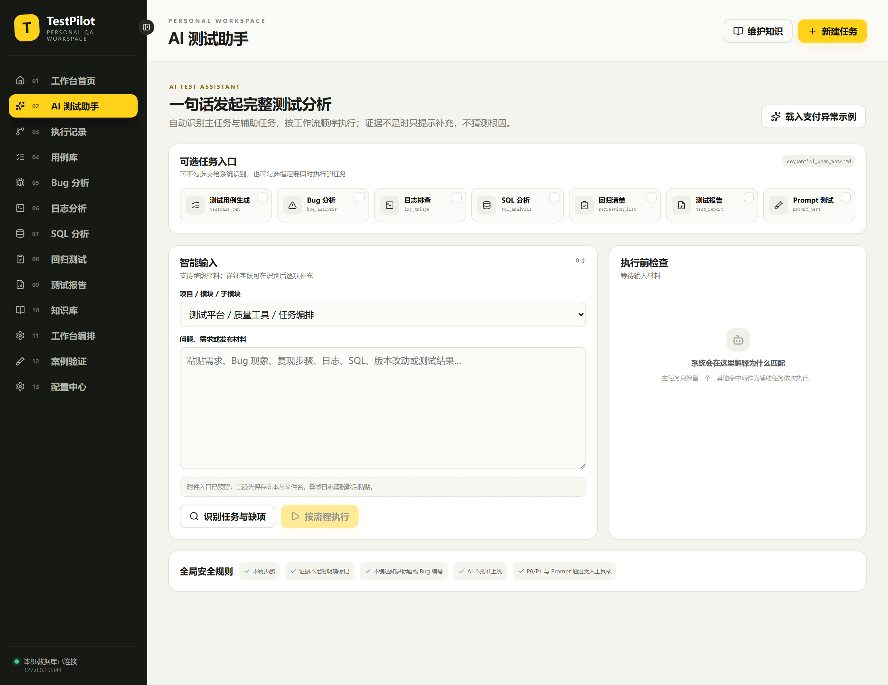

页面由四个区域组成：

1. **可选任务入口**：7 个标准入口（测试用例生成、Bug 分析、日志排查、SQL 分析、回归清单、测试报告、Prompt 测试）。
   - 不勾选任何入口：交给系统自动识别主任务与辅助任务；
   - 勾选指定入口：系统同时执行你指定的任务。
2. **智能输入**：
   - 选择"项目 / 模块 / 子模块"（下拉中只显示启用状态的模块）；
   - 在文本框中粘贴问题、需求或发布材料（支持整段材料，详细字段可在识别后逐项补充）。
   - 也可以点击右上角 **载入支付异常示例** 快速体验完整流程。
3. **附件说明**：附件入口已预留，首版请将关键信息粘贴为文本；敏感日志请**脱敏后**再粘贴。
4. **两个操作按钮**：
   - **识别任务与缺项**：只做预检，不执行分析；
   - **按流程执行**：直接按路由顺序执行完整分析。

### 5.2 识别与预检


点击 **识别任务与缺项** 后，右侧"执行前检查"面板会解释系统为什么这样匹配：

- **路由列表**：展示命中的任务入口、角色（主任务/辅助任务）以及**信息完整度百分比**；
- **缺少必要信息**：明确列出缺什么（例如"时间范围、SQL 文本"），不会猜测根因；此时可以继续生成待补充记录，补齐材料后重新执行；
- **必要信息检查通过**：全部满足时显示绿色提示，可进入执行。

> 规则：**主任务只保留一个**，其他命中项作为辅助任务依次执行。

### 5.3 按流程执行


点击 **按流程执行** 后，系统按固定顺序完成全部路由，随后在页面下方生成**执行结果卡片**：

- 卡片头部：执行 ID（如 `run_xxxxxxxx`）、标题（取自输入材料）、路由数与步骤数、风险等级、状态（待复核/已完成）；
- **路由页签**：区分"主任务"和"辅助任务"，例如：主任务 Bug 分析 → 辅助任务 日志排查 → 辅助任务 SQL 分析 → 辅助任务 回归清单；
- **分块结构化输出**：每个路由一个输出区块，包含引用范围（来自哪些知识库分类）与完整 JSON 结果；
- **人工复核栏**：
  - **确认通过**：确认任务识别、证据、风险与结构化输出无误；
  - **驳回补充**：材料不足或结论有误时驳回，任务回到"待补充"。

页面底部固定显示**全局安全规则**（不编造事实、证据不足时明确提示、不虚构知识标题或 Bug 编号、AI 不做上线批准、P0/P1 与 Prompt 测试结果人工复核）。

### 5.4 后续去向

- 每次执行都会写入**执行记录**（第 6 章），包含逐步执行轨迹；
- 复核通过的任务可在详情抽屉中 **申请入知识库**，沉淀为可被后续分析引用的知识（进入"待审核"状态，需在知识库中审核发布）。

---

## 6. 执行记录

执行记录回答："这次分析到底执行了什么、结论是什么、谁复核过？"

### 6.1 列表与筛选

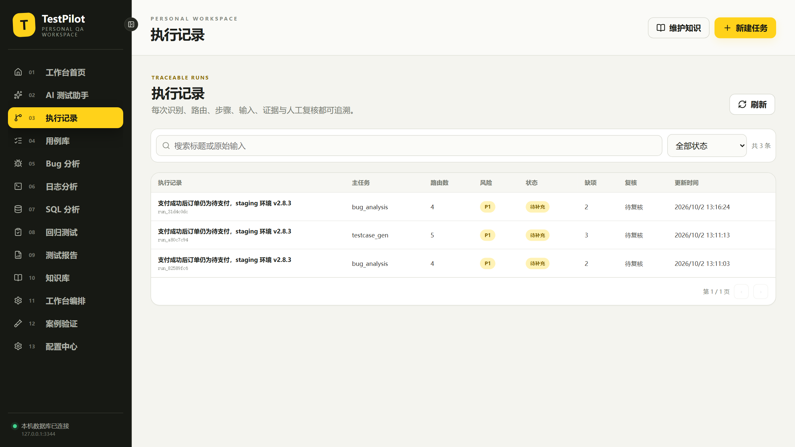

- **搜索**：按标题或原始输入检索；
- **状态筛选**：全部状态 / 待补充 / 待复核 / 已完成；
- **表格列**：执行记录（标题 + ID）、主任务、路由数、风险、状态、缺项数、复核状态、更新时间；
- 点击 **刷新** 可获取最新数据；点击任意一行打开详情。

### 6.2 执行详情

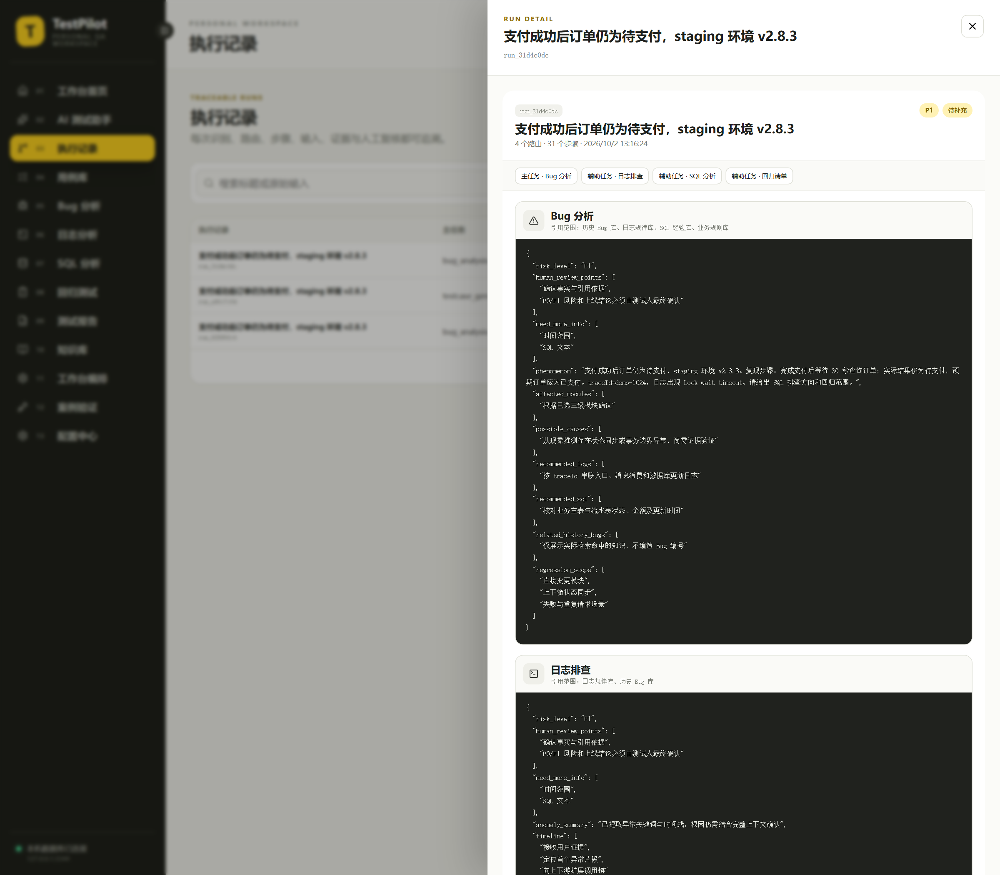

详情抽屉（RUN DETAIL）包含两部分：

1. **执行结果**：与 AI 助手页一致的结果卡片，包含每个路由的 JSON 输出和人工复核按钮（可在此直接复核）；
2. **逐步执行轨迹**：按顺序列出每个步骤的执行路由、完成时间与状态，完整还原执行链路。

---

## 7. 工作台编排

工作台编排用于维护 7 个标准入口的"运行配置"，是自定义任务行为的场所。

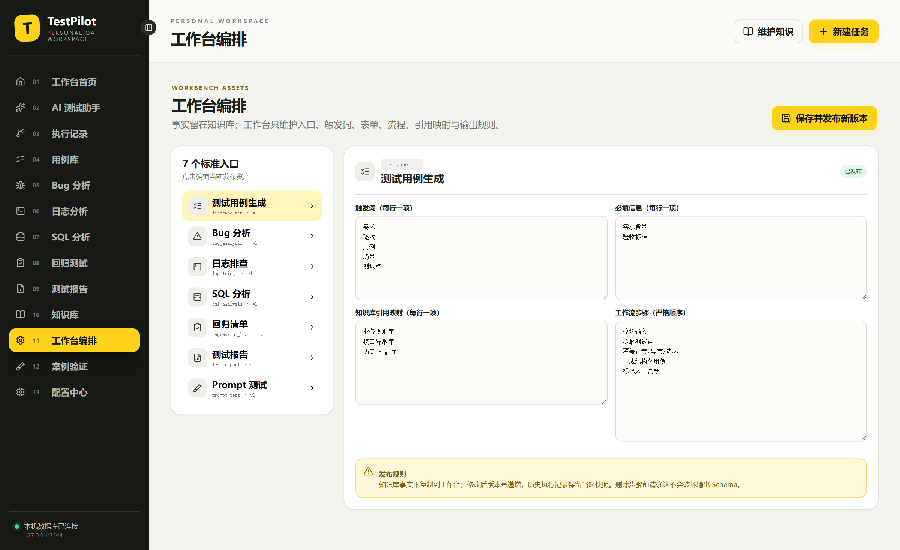

### 7.1 编辑入口

左侧列出 7 个标准入口（含当前版本号，如 `bug_analysis · v1`），点击任意入口进入编辑。

### 7.2 可编辑的四类配置

| 配置项 | 说明（每行一项） |
| --- | --- |
| 触发词 | 命中该入口的关键词 |
| 必填信息 | 执行前必须提供的信息，缺失时提示补充 |
| 知识库引用映射 | 该入口检索哪些知识库分类 |
| 工作流步骤 | 严格按顺序执行的步骤清单 |

### 7.3 发布规则

- 点击 **保存并发布新版本** 后版本号自动递增（如 v1 → v2）；
- **知识库事实不复制到工作台**，工作台只维护入口、触发词、表单、流程、引用映射与输出规则；
- 历史执行记录保留当时快照；
- 删除工作流步骤前请确认不会破坏输出结构。

---

## 8. 案例验证

案例验证用于在**发布工作台资产前**做回归：用固定 walkthrough（完整材料）验证路由顺序与安全规则是否符合预期。

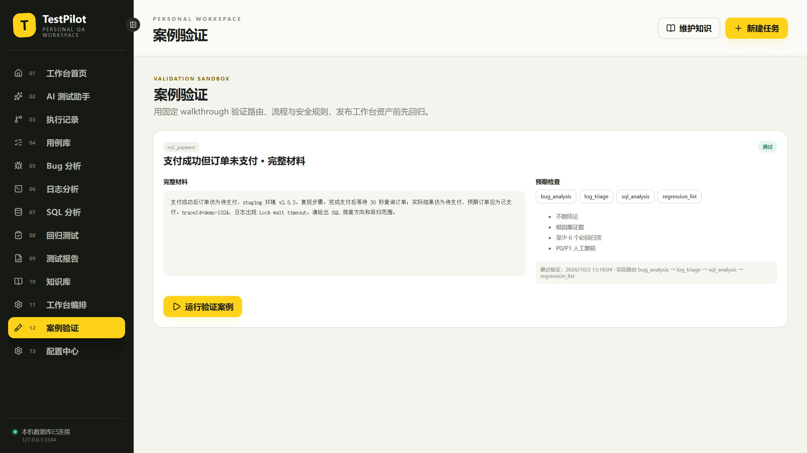

每个验证案例卡片包含：

- **完整材料**：固定的输入文本（walkthrough）；
- **预期检查**：预期命中的路由清单与必须满足的规则；
- **运行验证案例**：点击开始验证。

运行后：

- 弹出提示"验证通过：路由与规则符合预期"或"验证失败：请检查触发词与路由顺序"；
- 卡片底部显示 **最近验证时间与实际路由顺序**（例如：`bug_analysis → log_triage → sql_analysis → regression_list`），并更新状态徽标。

---

## 9. 用例库

用例库是测试用例的资产中心，按"项目 → 模块 → 子模块"三级组织。

### 9.1 列表与筛选

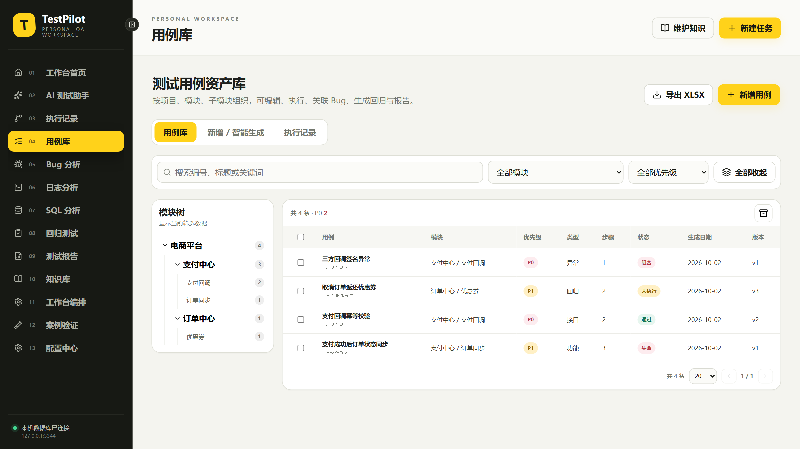

- **筛选条件**：关键词搜索（编号/标题/关键词）、模块下拉、优先级（P0/P1/P2）；
- **模块树**（左侧）：显示当前筛选数据的三级结构，点击叶子节点可按子模块筛选，点击"全部收起"快速折叠；
- **表格列**：用例（标题 + 编号）、模块、优先级、类型、步骤数、状态、生成日期、版本；
- **导出**：
  - 页头 **导出 XLSX**：导出当前筛选结果（或已勾选项）；
  - 表格右上归档图标：导出 JSON 备份。

### 9.2 批量操作

勾选任意行后，列表上方出现批量操作栏：

| 操作 | 行为 |
| --- | --- |
| 创建执行 | 给出创建提示（执行批次归档功能见附录） |
| 联合分析 | 给出带入 Bug 分析的提示 |
| 生成回归 | 跳转到回归测试页 |
| 生成报告 | 跳转到测试报告页 |
| 下载 CSV | 导出已选用例为 CSV |

### 9.3 新增用例

切换到 **新增 / 智能生成** 页签：

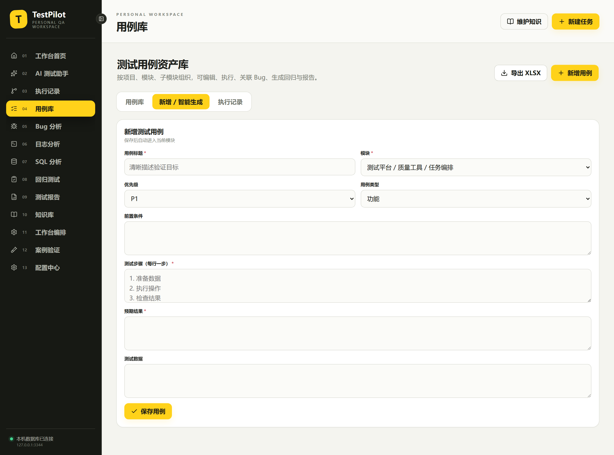

填写表单后点击 **保存用例**，用例自动进入所选模块：

- **必填**：用例标题、测试步骤（每行一步）、预期结果；
- 选填：模块、优先级、用例类型（功能/接口/异常/回归）、前置条件、测试数据。

### 9.4 用例详情

点击列表中任意一行，从右侧打开详情抽屉：

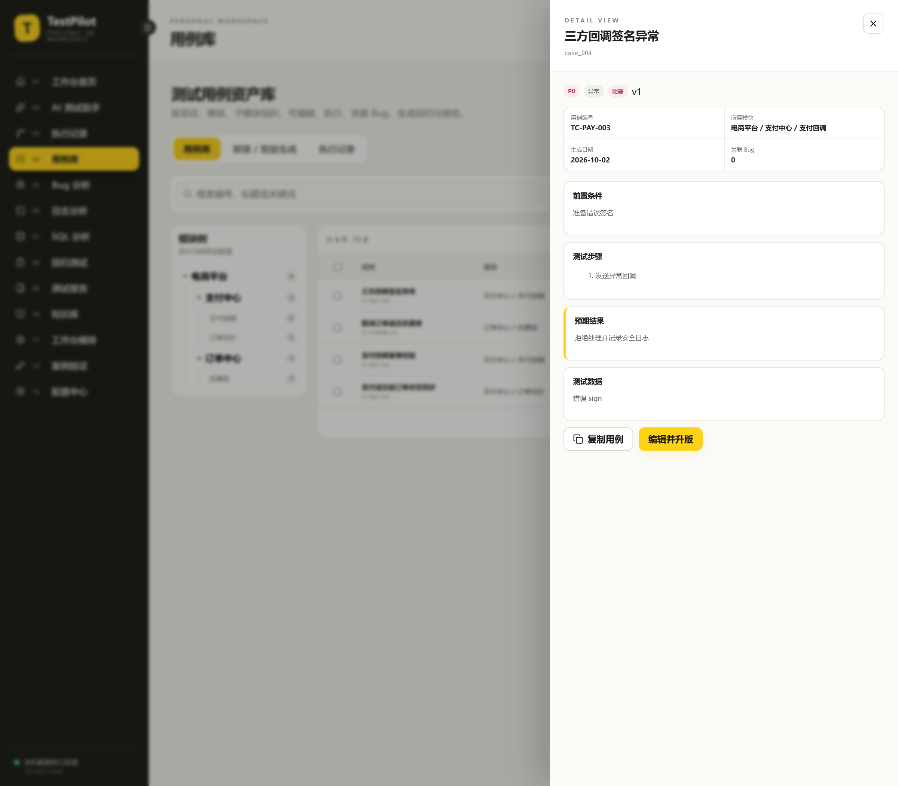

- 顶部徽标：优先级、类型、状态、版本；
- 详细信息：用例编号、所属模块、生成日期、关联 Bug；
- 正文区：前置条件、测试步骤（有序列表）、预期结果、测试数据；
- 操作：**复制用例**（给出复制提示）、**编辑并升版**（当前版本暂无编辑表单，见附录）。

---

## 10. Bug / 日志 / SQL 三类专项分析

三个分析页结构完全一致，区别只在任务模板与输出结构。以下以 Bug 分析为例，日志与 SQL 分析操作方式相同。

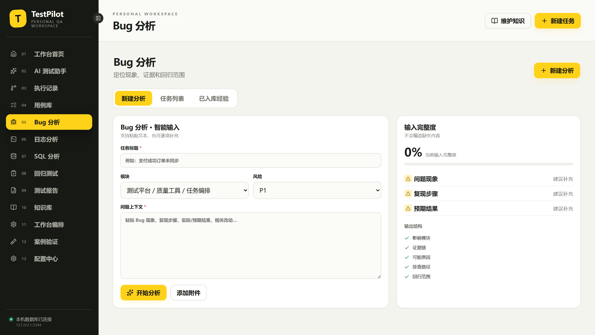

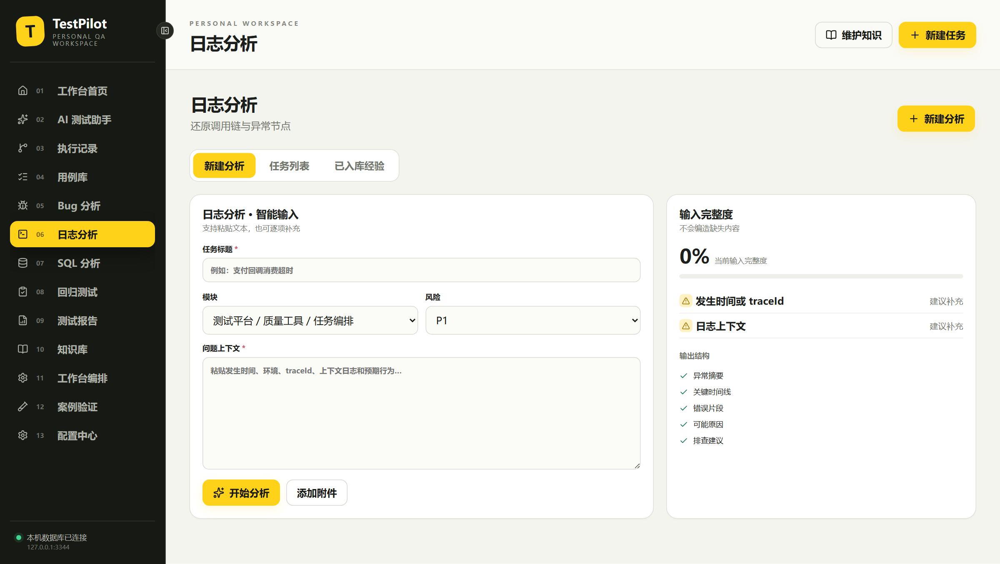

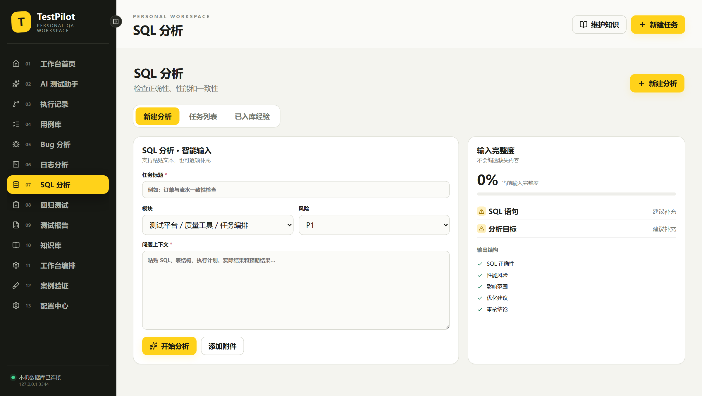

### 10.1 新建分析

页面分三个页签：**新建分析 / 任务列表 / 已入库经验**。

在"新建分析"中：

1. 填写 **任务标题**（例如"支付成功订单未同步"）；
2. 选择模块与风险等级（P0/P1/P2）；
3. 粘贴 **问题上下文**（Bug 现象、复现步骤、日志、SQL 等，输入框占位符会提示建议内容）；
4. 右侧实时显示 **输入完整度**（评分 + 必填信息检查清单）与 **输出结构预览**（每类任务的结构不同）；
5. 点击 **开始分析**。

> 模型说明：系统优先调用"已启用且已配置 Key"的大模型；若未配置或调用失败，会自动回退为**本地规则**分析，并在提示中明确说明（"模型暂不可用，已使用本地规则"）。回退不影响流程，但建议在配置中心补齐模型配置以获得更高质量的输出。

分析完成后自动打开任务详情抽屉，可查看输入信息与结构化分析结果，并执行审核动作：

- **提交审核** → **审核通过 / 驳回**；
- 审核通过后可点击 **申请入知识库**，生成一条待审核知识。

### 10.2 任务列表 / 已入库经验

- **任务列表**：搜索并查看该类型的历史任务，点击行打开详情；
- **已入库经验**：展示该类型的已发布知识卡片（Bug→历史 Bug 库、日志→日志规律库、SQL→SQL 经验库），点击卡片查看知识详情。

---

## 11. 回归测试

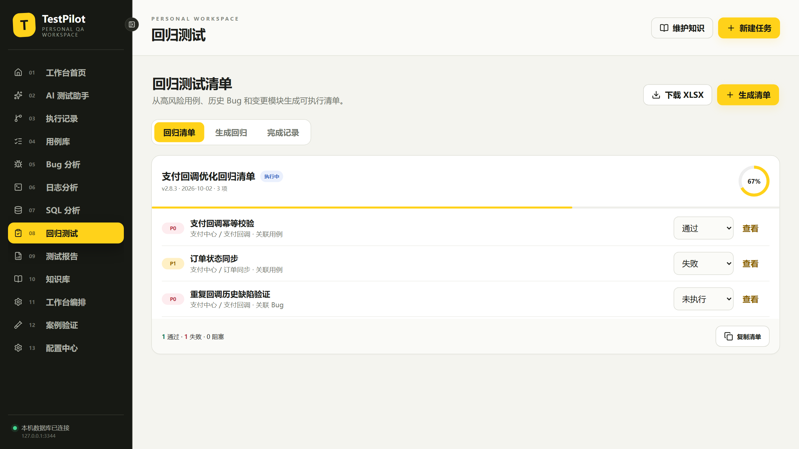

### 11.1 回归清单

每份清单以卡片展示：

- 标题、状态、版本、更新日期、回归项数量；
- **进度环与进度条**：实时反映已通过比例；
- **回归项列表**：每项包含优先级、标题、关联模块与来源（关联用例/关联 Bug）；
  - 通过右侧下拉框直接更新执行状态：**未执行 / 通过 / 失败 / 阻塞 / 跳过**（立即保存）；
  - 点击 **查看** 打开详情抽屉（负责人、关联记录、功能模块、预期结果、实际结果）；
- **底部统计**：通过 / 失败 / 阻塞数量一目了然；
- **复制清单**：将清单复制为 Markdown 待办列表；
- 页头 **下载 XLSX**：导出清单为 Excel。

### 11.2 生成清单

切换到 **生成回归** 页签，填写"版本 / 清单标题"与"变更内容与影响模块"，点击 **分析并生成**（当前版本返回清单列表，见附录）。

### 11.3 完成记录

全部必选项完成后清单会自动归档到 **完成记录** 页签。

---

## 12. 测试报告

### 12.1 报告列表

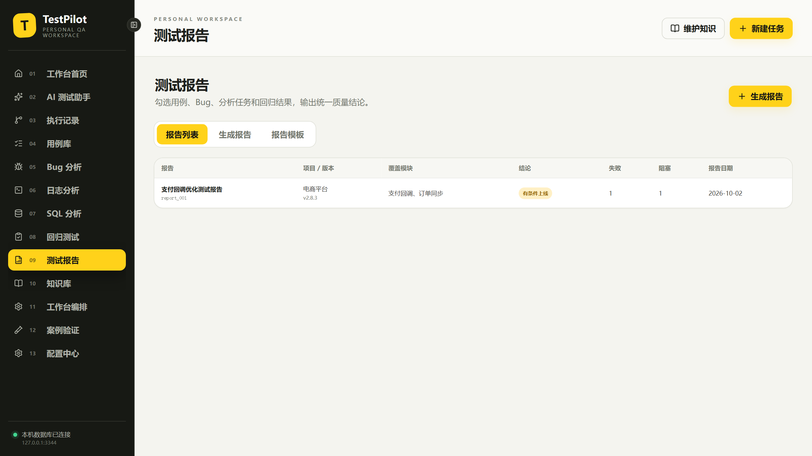

表格展示：报告（标题 + ID）、项目 / 版本、覆盖模块、结论、失败数、阻塞数、报告日期。点击任意一行打开报告详情。

### 12.2 生成报告

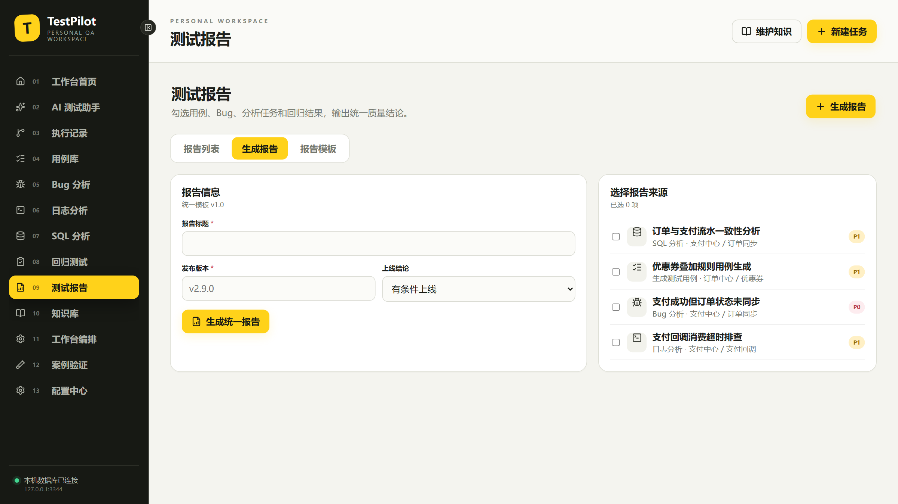

1. 点击页头 **生成报告** 进入"生成报告"页签；
2. 左侧填写 **报告信息**：报告标题（必填）、发布版本（必填）、上线结论（可上线 / 有条件上线 / 不能上线）；
3. 右侧 **选择报告来源**：勾选需要纳入报告的任务（展示任务类型、模块与风险）；
4. 点击 **生成统一报告**，报告生成后自动打开详情。

### 12.3 报告详情与导出

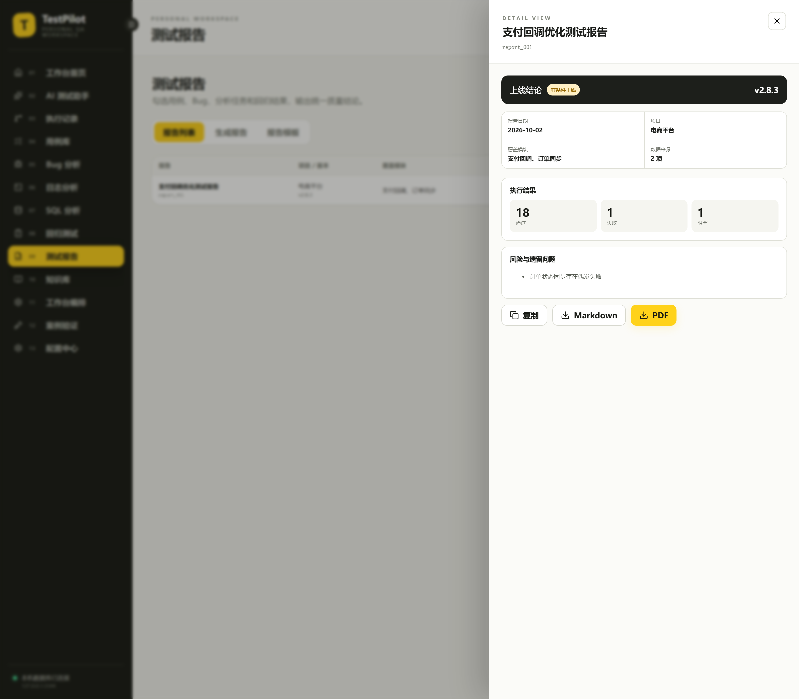

详情抽屉包含：

- **上线结论**（醒目标识）与报告版本；
- 报告日期、项目、覆盖模块、数据来源数量；
- **执行结果**：通过 / 失败 / 阻塞数字；
- **风险与遗留问题**列表；
- 导出操作：**复制**（Markdown 文本到剪贴板）、**Markdown**（下载 .md 文件）、**PDF**（下载 .pdf 文件）。

> "报告模板"页签仅作说明：模板统一在 **配置中心 → 格式模板** 中维护。

---

## 13. 知识库

知识库是 AI 分析的事实来源，只有**已发布**的知识才会被分析任务检索引用。

### 13.1 列表与筛选

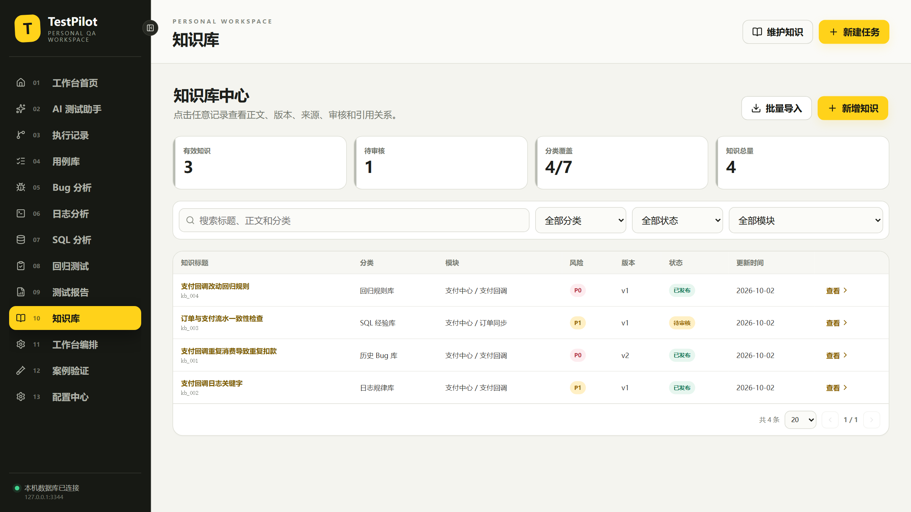

- **四个指标卡**：有效知识（已发布）、待审核、分类覆盖（/7 类）、知识总量；
- **筛选**：搜索（标题、正文、分类）、分类（历史 Bug 库 / 业务规则库 / 接口异常库 / 日志规律库 / SQL 经验库 / 压测经验库 / 回归规则库）、状态、模块；
- 表格列：知识标题、分类、模块、风险、版本、状态、更新时间。

### 13.2 知识详情与审核

点击任意一行打开详情抽屉：

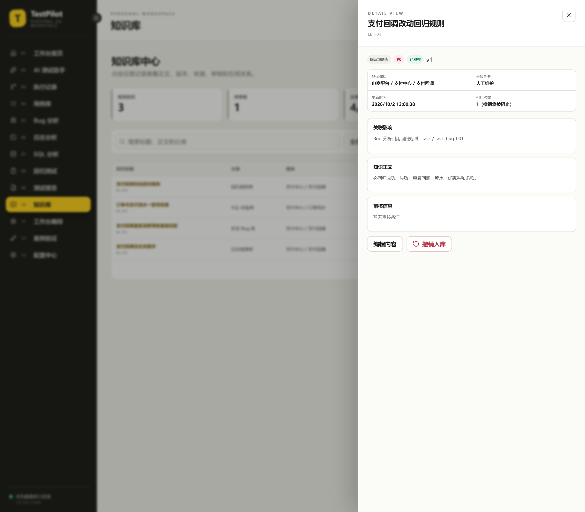

- **基本信息**：分类、风险、状态徽标、当前版本；
- **详情网格**：所属模块、来源任务、更新时间、引用次数（被引用时会提示"撤销将被阻止"）；
- **关联影响**：展示下游引用来源（如有）；
- **知识正文**：点击 **编辑内容** 可直接修改，点击 **保存新版本** 生成新版本；
- **审核操作**：
  - 状态为"待审核"时：**审核通过并发布**；
  - 状态为"已发布"时：**撤销入库**——若该知识已被引用，撤销会被阻止，并提示具体引用来源，需先解除引用再撤销。

### 13.3 新增知识

点击页头 **新增知识**：

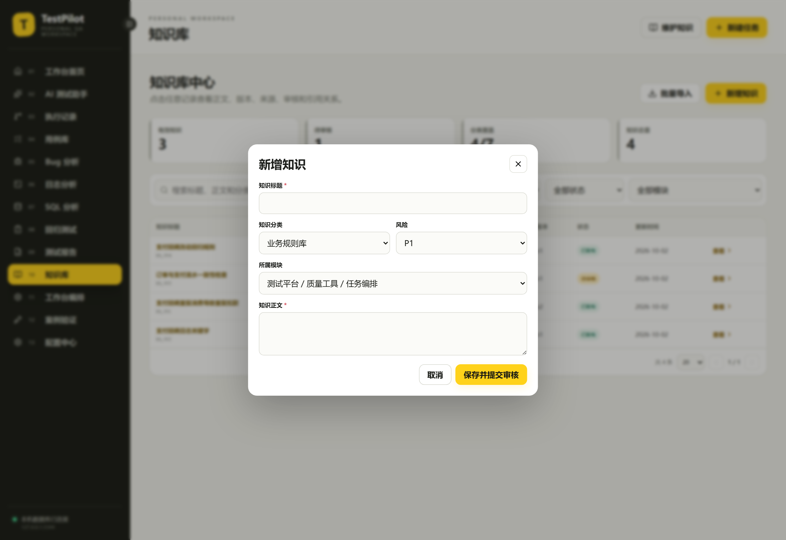

填写知识标题（必填）、分类、风险、所属模块、知识正文（必填），点击 **保存并提交审核**。新知识默认进入"待审核"状态，审核发布后即可被分析任务引用。

---

## 14. 配置中心

配置中心包含四个页签：**项目与模块 / 大模型 / 格式模板 / 关联规则**。

### 14.1 项目与模块

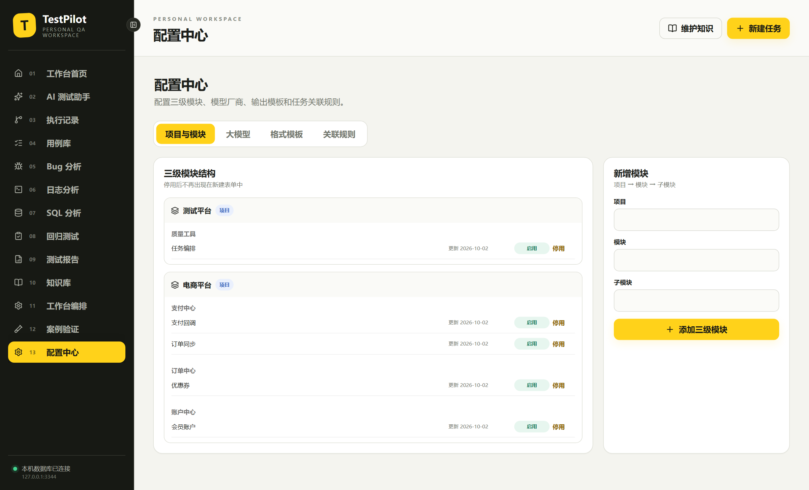

- **三级模块结构**：以"项目 → 模块 → 子模块"树形展示，每个子模块显示启用状态与更新时间；
- **停用 / 恢复**：点击子模块右侧按钮切换状态；**停用后不再出现在新建表单的模块下拉中**，历史数据不受影响；
- **新增模块**：右侧填写项目、模块、子模块名称，点击 **添加三级模块**。

### 14.2 大模型

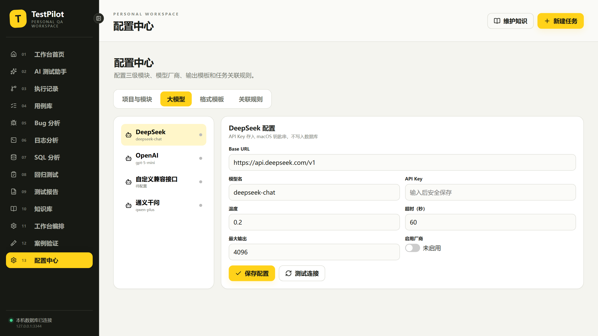

- 左侧为厂商列表（OpenAI、通义千问、DeepSeek、自定义兼容模型），带启用状态指示；
- 右侧编辑配置：

| 配置项 | 说明 |
| --- | --- |
| Base URL | 接口地址 |
| 模型名 | 调用的具体模型 |
| API Key | 密码框输入，已配置时显示掩码 |
| 温度 / 超时（秒）/ 最大输出 | 推理参数 |
| 启用厂商 | 开关，未启用的厂商不会参与分析 |

- **保存配置**：保存后立即生效；
- **测试连接**：验证连通性，成功时提示耗时（毫秒）。

> 安全说明：API Key 在 Windows 使用当前用户的 DPAPI 加密保存到 `data/keys`，macOS 使用钥匙串；**不写入数据库明文**。Windows 加密文件不能跨用户或跨电脑解密，换机后需重新配置。

### 14.3 格式模板

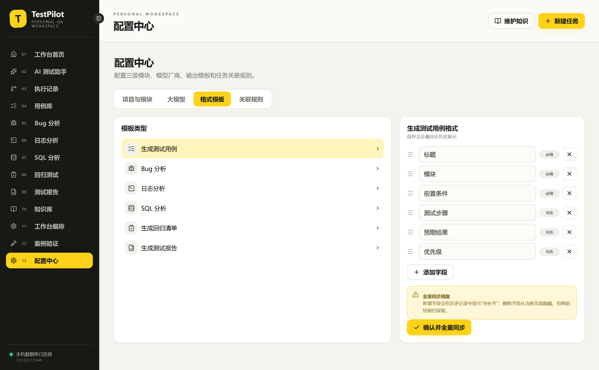

- 左侧选择模板类型（与 6 类任务对应：生成测试用例、Bug 分析、日志分析、SQL 分析、生成回归清单、生成测试报告）；
- 右侧编辑字段列表：可直接修改字段名、删除字段、添加字段（前 3 个字段标记为必填，其余为可选）；
- 点击 **确认并全量同步** 保存：历史记录会同步显示新结构，新增字段在历史记录中显示"待补齐"；删除字段仅从当前页面隐藏，**原始快照仍保留**。

### 14.4 关联规则

只读展示"任务与知识关联"：每类任务会自动检索哪些知识库分类（例如 Bug 分析检索历史 Bug 库、日志规律库、业务规则库）。发布知识后自动进入对应任务的检索范围。

---

## 15. 旧版数据迁移

如果你之前使用过旧版工作台（数据存在浏览器 localStorage 中），首次进入时会自动弹窗：

- 显示检测到的任务数与知识条数；
- 点击 **备份并迁移到 SQLite**：先在本机生成只读 JSON 备份（保存在 `data/backups`），再导入 SQLite；**重复操作不会产生重复数据**（幂等保护）；
- 点击 **暂不迁移**：关闭弹窗，下次进入不再重复提示（可用旧数据文件手动恢复）。

---

## 16. 数据、安全与备份

| 项目 | 说明 |
| --- | --- |
| 数据文件 | `data/testpilot.sqlite`（SQLite，WAL 模式） |
| 访问范围 | 仅本机 `127.0.0.1:3344`，默认局域网不可访问 |
| API Key | Windows DPAPI / macOS 钥匙串加密，数据库仅记录脱敏状态 |
| 操作记录 | 任务、用例、知识详情抽屉底部有时间线，记录关键操作与时间 |
| 升级保留 | 更新代码时保留 `data` 文件夹即可保留全部数据 |

**备份建议**：

1. 直接复制整个 `data` 文件夹（最完整）；
2. 用例库支持 JSON 导出、回归清单支持 XLSX 导出、报告支持 Markdown/PDF 导出，可作为轻量归档。

---

## 17. 常见问题（FAQ）

**Q1：提示 3344 端口被占用怎么办？**  
关闭已在运行的原服务，或设置 `PORT` 环境变量后重新启动（例如 `set PORT=3355`）。

**Q2：分析时提示"模型暂不可用，已使用本地规则"？**  
说明当前没有可用的大模型配置。到 **配置中心 → 大模型** 检查：厂商是否启用、API Key 是否已配置、Base URL 与模型名是否正确，然后点击"测试连接"验证。回退本地规则不影响流程，补齐配置后重新分析即可。

**Q3：任务状态"待补充"是什么意思？**  
表示材料缺少必要信息（如时间范围、SQL 文本）。按提示补齐材料后重新执行，或直接在详情中继续流转。

**Q4：撤销知识时被阻止？**  
该知识已被下游任务引用（引用保护）。详情中会列出具体引用来源，需先处理引用关系后再撤销。

**Q5：如何把分析结论沉淀为知识？**  
在任务详情中点击"申请入知识库"生成待审核知识，然后到 **知识库** 中审核发布。

**Q6：换电脑后模型 Key 失效？**  
API Key 使用本机加密（DPAPI/钥匙串），换机后需在配置中心重新输入保存。

**Q7：页面数据与手册截图不一致？**  
截图采集于真实环境中的某次运行，演示数据（任务、用例、报告）会随后续操作变化，属正常现象。

---

## 18. 附录：当前版本的已知行为

以下入口在当前 v1.0.0 中为**预留或演示级**，点击后仅给出交互提示，不产生实际数据或跳转，请知悉：

| 位置 | 行为 |
| --- | --- |
| 用例库 · 批量操作 | "创建执行""联合分析"仅提示；"执行记录"页签暂无批次归档 |
| 用例库 · 详情 | "复制用例"仅提示；"编辑并升版"暂无编辑表单 |
| 用例库 · 新增页签 | 提供手工录入表单（"智能生成"为后续能力） |
| 回归测试 · 生成清单 | 提交后提示"已生成回归草稿"并返回清单列表 |
| 测试报告 · 生成 | 报告的项目名当前取内置项目"电商平台"，与你的实际项目名称无关 |
| 知识库 | "批量导入"暂未接入 |
| 分析页 · 添加附件 | 选择文件后仅提示文件名，首版请粘贴文本 |
| 工作台首页 | 部分指标卡为演示数据（数据资产卡为 SQLite 实时统计） |
| AI 助手 | 执行完成后，左侧"执行前检查"面板的路由名称可能显示为空，请以右侧执行结果卡片为准 |

---

*手册完 · TestPilot v1.0.0*
